# RQ1.1 与 RQ2.1 最新实验结果：详细分析与总结

**报告日期：2026-09-11（America/Toronto）。** 本报告分析已完成的正式实验，不启动推理、训练或补跑。按要求，本版暂不汇报 attention；相关原始记录与既有分析不修改。

**QA 已更新为语义评分 V2：** 本文QA正文、图表及QA–RCA联合分析均已替换为最新结果，不再使用旧严格分数作为主结果。[评分来源与版本映射](assets/qa_semantic_v2_source_manifest.json)保留修复依据；RCA、RQ2.1和cost结果不变。没有重跑模型或改写原始回答。

## 1. 先看结论

这两轮实验支持的故事不是“把数据变成图就一定更好”，而是：**不同证据适合不同表示；选什么、怎么画、怎么摆，都可能帮助或破坏诊断，而且准确率收益和 token 收益并不自动一致。**

1. **RQ1.1 最明确的正面结果是 Qwen 的选择性拓扑视觉化。** 三个主数据集的 300 cases 上，TPV 的 MRR 从纯文本 T 的 0.3093 提升到 0.3819，AC@1 从 0.2100 提升到 0.3000。相对 T 的预注册比较经 Holm 校正后 p=0.0276。但同样的收益没有在 Gemma 的 TPV 上复现。
2. **全视觉 V 大幅降低输入，却不是准确率最好的方案。** Qwen 的输入减少 59.9%，MRR 从 0.3093 降至 0.2658，输出反而增加 8.4%；Gemma 输入减少 70.1%、输出减少 10.7%，但 MRR 从 0.3011 降至 0.2400。
3. **最省输入的部分，并不一定最有利于诊断。** 在 RQ1.1 的四区域析因中，Metrics 视觉化承担主要输入节省，同时对两个模型的 MRR 都呈负向平均效应；Topology 视觉化的平均效应则为正。这里存在清楚的“压缩—诊断”张力。
4. **修正评分后，QA与RCA的主要关联仍弱。** 兼容`overall`遗漏、显示舍入和明确格式变体后，P4的T/V正确率明显恢复；同case配对的QA–RCA主要关联仍弱且不显著。测量修复与两类任务的表现差异可以同时观察到。
5. **反事实 RCA 表明模型确实会随图像证据改变答案。** 定向移植比安慰剂产生更强的定向排名移动，空白化诊断内容后 MRR 大幅降低，直接显示了输入图像对输出排名的影响。
6. **RQ2.1 的证据选择产生了真实输入变化。** 随机选择显著恶化两个模型的文本 RCA；trace/diversity策略有较高点估计，本轮多重比较后差异未达显著。不同策略既有整体退化，也有数据集方向反转。
7. **画图容量和图像使用分别形成瓶颈。** 部分新选择策略在固定画布下有11.9%–18.8%的视觉条件不可执行；限定到双方均可执行的配对cases，V仍落后于T。两个环节均能在结果中单独定位。
8. **剪影、布局没有一个跨模型通吃的答案。** Qwen 在分层有向图上的点估计较高，Gemma 没有同方向收益；拓扑居中的布局使 Gemma 明显退化。Qwen 随源图分辨率上升表现改善，但增加了输入开销，收益也没有在所有数据集上同步出现。

## 2. 本报告究竟用了哪批结果

### 2.1 版本与完成范围

| 研究/实验 | 本报告使用的正式结果 | 逻辑记录数 | 当前状态 |
| --- | --- | ---: | --- |
| RQ1.1 Direct-RCA | V3、480 cases、19 arms、双模型 | 18,240 | 完整；模型输出异常保留计分 |
| RQ1.1 Direct-QA | V3、480 cases、18 条件、双模型；语义评分V2 | 17,280 | 同步排除原协议不合格题及基础设施失败case后，16,824条纳入分析 |
| RQ1.1 One-stage counterfactual RCA | V3、4 个图像条件、双模型 | 3,840 | 完整 |
| RQ2.1 Evidence selection | `exp_evidence_selection_formal_v1` | 15,360 | 完整，含设计不可执行记录 |
| RQ2.1 Silhouette encoding | `exp_silhouette_encoding_formal_p0_v2` | 11,520 | 完整；固定 P0、D0 |
| RQ2.1 Canvas composition | `exp_canvas_composition_formal_p0_v2` | 10,560 | 完整；固定 P0、S0 |

共重新核验 **76,800 条源记录的 record hash**，并从原始记录重算每个数据集、模型和 arm 的 RCA 均值，与保留的正式汇总逐项核对。检查通过。这是持久化与数值一致性检查，不是“实验设计永远无 bug”的证明。

RQ2.1 的 37,440 条是**逻辑条件记录**，包含 S0/D0 对已有 P0__V 的复用，不等于 37,440 次新调用。仅两个后续实验的基线引用就占 1,920 条；其他相同请求也会复用。不能用这些记录相加推断包含历史失败尝试的真实总推理次数。

本报告**不混入**以下内容：早期 469-case RQ1.1、整体弃用的旧 RQ2、smoke/gate、RQ3 的 BASE/SFT 比较。旧报告原样保留；读到旧文件中的不同数值时，应先比较结果版本，而不是直接认为成绩突然变化。

### 2.2 五个数据集都保留，但统计口径必须分清

| 数据集 | Cases | 本报告中的解释 |
| --- | ---: | --- |
| AegisLab | 100 | 主数据集；不能与 RE2-TT 当作完全独立的应用家族 |
| AIOPS-2022 | 100 | 主数据集；含 service、pod、node 根因 |
| AIOPS-2025 | 100 | 主数据集；含多种根因层级 |
| RE2-OB | 90 | 单列参考，同时纳入 RQ2.1 五数据集汇总 |
| RE2-TT | 90 | 单列参考，同时纳入 RQ2.1 五数据集汇总 |

**RQ1.1** 沿用其注册主分析：前三个数据集共 300 cases，另给全部五个数据集分项结果。**RQ2.1** 沿用后来的固定基准决定：全部五个数据集都报告，不再挑选冠军，也不再用旧的 90-case 选择集决定后续条件。

RQ2.1 的主结果表用“五数据集等权平均”：先分别算五个数据集 MRR，再各占 20% 平均。统计检验表另标明 **480-case pooled**，即每个 case 等权。因为样本量是 100/100/100/90/90，两种均值略有差别；不要把五数据集均值差与 pooled 检验的 ΔMRR 混写成同一个数。

RE2 在旧文档中常被称为“饱和参考”，这是历史定位，**不表示当前每个 arm 的成绩接近 1**。本报告中的 RE2 也会明显受表示与筛选策略影响，不因其较容易而删除。

这些 cases 已被前期研究使用，当前结果属于 **repeated-exposed evaluation（反复使用过的评估集）**，不是从未观察过的独立确认集。

## 3. 不熟悉项目也能读懂的术语

### 3.1 四类证据与公共摘要

| 名称 | 白话解释 |
| --- | --- |
| M / Metrics | CPU、请求量、时延等随时间变化的数值序列。关注异常幅度、开始偏离的时间和持续多久。 |
| R / Traces | 一次请求经过哪些服务、操作，以及各段调用耗时、调用数量和错误。这里的 R 表示 trace 区域，不是早期 routed arm。 |
| L / Logs | 系统输出的事件文字。重复文字整理为模板，再保留发生次数、相对时间和诊断性数字。 |
| G / Graph / Topology | caller→callee，即“谁调用谁”的有向关系，以及相关传播摘要。它是调用证据，不自动等于真实故障因果图。 |
| MET-Z | 指标异常摘要。用正常参考段的均值/标准差等统计，描述当前段相对参考段偏离多大；`z` 是标准化偏离尺度，不是根因概率。 |
| TRC-L | Trace 的局部延迟摘要。`inclusive latency` 是含子调用等待在内的总跨度耗时；`local/exclusive latency` 尝试扣除子调用占用，突出该调用自身的耗时。它有助于区分“自身慢”与“被下游拖慢”，但不能单凭它认定根因。 |
| LOG-R | 日志事件量/错误等相对参考段的变化摘要；不是把出现最频繁的模板直接当成根因。 |
| Denum-inspired readable log graph | 把重复模板、实体、相对时间 bin、次数和数字变量组织成可读结构，压缩重复内容；不是二进制压缩包。 |
| onset / persistence | 首次检测到异常变化的相对时间 / 变化持续程度。公共遥测推导的 onset 不等于私有真实注入时间。 |
| silhouette / 剪影 | 一张 evidence card 内部如何画：例如曲线、柱形图、热图、矩阵；不是整个 dashboard 的布局。 |
| composition / 编排 | 完整卡片放在哪里、间距多少、画布比例和分辨率是什么；与选哪些证据分开。 |

service、node、pod 分别用 case-local 的 3/4/5 位数字 ID；这只是匿名类型提示，不编码谁是根因。V 表示事件证据位于图像，不表示公共任务、候选列表、输出说明也必须藏进图像。

### 3.2 指标怎么读

- **MRR**：正确根因排第 1 得 1，排第 2 得 1/2，第 3 得 1/3；前五名没有正确根因则为 0，最后对 cases 求平均。
- **AC@K**：前 K 个候选里是否命中被 scorer 接受的根因。AC@1 最接近“第一判断是否正确”。
- **AVG@K**：AC@1 到 AC@K 的平均值，不是额外的一次推理结果。
- **Repair / break**：相对同 case 的基线，从错误变正确 / 从正确变错误。本文表格的 Top-1 repair/break 按第一候选计算；MRR 改善/下降是另一个量。
- **Paired dz**：每个 case 的差值均值除以差值标准差；正号表示改善，绝对值反映效应相对于 case 间变化的大小。
- **Holm p**：同时比较多个 arms 后校正的显著性指标。p<0.05 不代表收益一定很大；p≥0.05 也不证明两个方法完全相同。

统计使用按 case 配对的 Pratt-Wilcoxon 和 paired dz，不报告置信区间。实质性准确率提升还要求 ΔMRR≥0.05。主分析、探索性多 arm 比较和跨模型比较的检验 family 不能事后混换。

## 4. RQ1.1：什么信息适合视觉化

### 4.1 全部 19 个 RCA arms

| Arm | 输入内容 |
| --- | --- |
| T | 四区域全部为自然语言文本，是对照基线 |
| C | 同事实的紧凑 typed/structured 文本；“紧凑”不预先保证 tokenizer 后更短 |
| S | 把 T 的事件文本按原顺序画成截图；不是曲线、图结构组成的真实 dashboard |
| MV / TCV / LV / TPV | 分别仅将 M / R / L / G 视觉化，其余区域仍是文本 |
| V_MR / V_ML / V_MG / V_RL / V_RG / V_LG | 名称列出的两个区域视觉化，另外两个为文本 |
| V_MRL / V_MRG / V_MLG / V_RLG | 名称列出的三个区域视觉化，剩下一个为文本 |
| V | M/R/L/G 全部为真实 dashboard |
| H | 完整 V 图像 A，后接完整 T 文本 B，即 A+B；它是重复编码控制，不进入 exact-once 的 16-cell 析因分析 |

表中是前三主数据集 300 cases，每个 arm、模型的分母一致。

| Arm | Qwen MRR | Qwen AC@1 | Qwen AC@5 | Gemma MRR | Gemma AC@1 | Gemma AC@5 |
| --- | --- | --- | --- | --- | --- | --- |
| T | 0.3093 | 0.2100 | 0.4500 | 0.3011 | 0.2833 | 0.3267 |
| C | 0.3202 | 0.2300 | 0.4500 | 0.3225 | 0.2967 | 0.3567 |
| S | 0.2228 | 0.1600 | 0.3167 | 0.1883 | 0.1867 | 0.1900 |
| MV | 0.2811 | 0.1800 | 0.4233 | 0.1967 | 0.1900 | 0.2033 |
| TCV | 0.2779 | 0.2000 | 0.3933 | 0.2481 | 0.2333 | 0.2667 |
| LV | 0.2881 | 0.1967 | 0.4267 | 0.2825 | 0.2800 | 0.2867 |
| TPV | 0.3819 | 0.3000 | 0.4867 | 0.2953 | 0.2867 | 0.3067 |
| V_MR | 0.2598 | 0.1767 | 0.3800 | 0.1800 | 0.1733 | 0.1900 |
| V_ML | 0.2759 | 0.1833 | 0.4133 | 0.2167 | 0.2133 | 0.2200 |
| V_MG | 0.3206 | 0.2367 | 0.4267 | 0.2850 | 0.2767 | 0.2933 |
| V_RL | 0.2647 | 0.1833 | 0.3833 | 0.2914 | 0.2833 | 0.3067 |
| V_RG | 0.3453 | 0.2467 | 0.4700 | 0.2811 | 0.2767 | 0.2867 |
| V_LG | 0.3863 | 0.3100 | 0.4900 | 0.3087 | 0.3033 | 0.3200 |
| V_MRL | 0.2184 | 0.1400 | 0.3367 | 0.1744 | 0.1700 | 0.1800 |
| V_MRG | 0.2904 | 0.2033 | 0.4100 | 0.2500 | 0.2500 | 0.2500 |
| V_MLG | 0.2867 | 0.2033 | 0.4033 | 0.3111 | 0.3100 | 0.3133 |
| V_RLG | 0.3473 | 0.2633 | 0.4567 | 0.2828 | 0.2800 | 0.2900 |
| V | 0.2658 | 0.1833 | 0.3800 | 0.2400 | 0.2400 | 0.2400 |
| H | 0.2964 | 0.2000 | 0.4367 | 0.2328 | 0.2200 | 0.2467 |

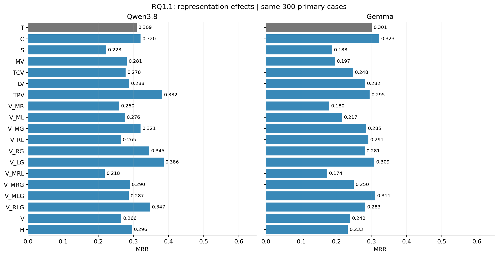

**发现 1：选择性视觉化比“全放进图里”更值得研究。** Qwen 的 TPV 和 V_LG 都明显高于 V；Gemma 的 C 点估计最高。H 也没有显示出“图文都给一定更好”的结果。视觉并非单向增强模块。

Qwen 的 V_LG=0.3863 是这张表的最高点估计，但它是探索性组合；不能只从 19 个条件里挑最大的数就宣布最优。若把 18 个对 T 比较作为探索性 family，V_LG 的 Holm p=0.0585；TPV 在这一更大 family 下为 0.0717。下面的 TPV p=0.0276 来自其原注册的五个区域视觉比较，**两种检验问题不同，均需说明。**

### 4.2 注册比较与区域平均效应

| 模型 | 对 T 的比较 | ΔMRR | Holm p | 配对 dz |
| --- | --- | --- | --- | --- |
| Gemma | LV | -0.0186 | 0.845 | -0.0572 |
| Gemma | MV | -0.1044 | 0.00137 | -0.2173 |
| Gemma | TCV | -0.0531 | 0.0259 | -0.1541 |
| Gemma | TPV | -0.0058 | 0.845 | -0.0155 |
| Gemma | V | -0.0611 | 0.047 | -0.1373 |
| Qwen3.8 | LV | -0.0212 | 0.476 | -0.0568 |
| Qwen3.8 | MV | -0.0282 | 0.476 | -0.0737 |
| Qwen3.8 | TCV | -0.0314 | 0.0743 | -0.0876 |
| Qwen3.8 | TPV | 0.0727 | 0.0276 | 0.1656 |
| Qwen3.8 | V | -0.0435 | 0.257 | -0.0988 |

Qwen TPV 的 Top-1 修复为 54 cases，破坏为 27 cases，净增加 27/300=9 个百分点，不只是把正确根因从第五挪到第四。Gemma 的全视觉 V，AC@1/3/5 都为 0.2400，平均输出约 1.04 个候选；T 平均约 1.54 个。注册输出允许一到五个候选，这属于模型行为，不能事后给它补满五个答案。

完整 16-cell 析因还允许问：**在另外三个区域的所有表示背景上平均，把某区域改成图像会怎样？** 这比单看一个 TPV 或 MV 更全面，但仍限定于本 renderer、数据和模型。

| 模型 | 改为视觉的区域 | 跨其他背景的平均 ΔMRR | Holm p |
| --- | --- | --- | --- |
| Gemma | M | -0.0546 | 0.0314 |
| Gemma | R | -0.0312 | 0.0343 |
| Gemma | L | 0.0088 | 0.623 |
| Gemma | G | 0.0454 | 0.00236 |
| Qwen3.8 | M | -0.0503 | 0.000198 |
| Qwen3.8 | R | -0.0325 | 0.00284 |
| Qwen3.8 | L | -0.0166 | 0.00617 |
| Qwen3.8 | G | 0.0561 | 0.0011 |

**发现 2：两个模型都显示出“G 平均有利、M/R 平均不利”的方向。** Gemma 单独 TPV 相对 T 几乎没改善，但 G 在其他表示背景上平均有正效应。这不是矛盾，而是说明其他区域的呈现方式会改变 G 的作用。Gemma 的 M×G 二阶交互为 +0.0684，Holm p=0.0061，也提醒我们不能把组件收益视为固定常数。

Shapley 在这 16 个注册状态中对 T→V 的总变化进行分摊，MRR 分量如下：Qwen 的 M/R/L/G 为 −0.0518/−0.0304/−0.0187/+0.0574；Gemma 为 −0.0610/−0.0415/+0.0011/+0.0402。它解释的是**这个有限表示空间里的贡献分摊**，不是组件放到任何 dashboard 都具有的固有价值。

### 4.3 Token：必须把输入和输出分开

以下均为每 case 的平均实际 token；输入包括图像 tokens。百分比是 arm 均值相对本模型 T 均值的变化，不跨 tokenizer 比较绝对成本。

#### Qwen3.8

| Arm | 平均输入 tokens | 平均输出 tokens | 输入相对 T | 输出相对 T | ΔMRR |
| --- | --- | --- | --- | --- | --- |
| T | 12,947.6 | 170.8 | +0.0% | +0.0% | 0.0000 |
| C | 12,928.2 | 179.1 | -0.2% | +4.9% | 0.0109 |
| S | 13,615.4 | 149.5 | +5.2% | -12.5% | -0.0865 |
| MV | 7,822.4 | 193.1 | -39.6% | +13.1% | -0.0282 |
| TCV | 15,015.4 | 158.7 | +16.0% | -7.1% | -0.0314 |
| LV | 15,339.7 | 160.1 | +18.5% | -6.2% | -0.0212 |
| TPV | 14,600.0 | 163.5 | +12.8% | -4.3% | 0.0727 |
| V_MR | 6,982.4 | 164.6 | -46.1% | -3.6% | -0.0494 |
| V_ML | 7,306.7 | 164.5 | -43.6% | -3.7% | -0.0333 |
| V_MG | 6,567.0 | 174.3 | -49.3% | +2.1% | 0.0113 |
| V_RL | 14,499.7 | 161.1 | +12.0% | -5.7% | -0.0446 |
| V_RG | 13,759.9 | 167.2 | +6.3% | -2.1% | 0.0360 |
| V_LG | 14,084.3 | 172.4 | +8.8% | +0.9% | 0.0771 |
| V_MRL | 6,466.7 | 175.9 | -50.1% | +3.0% | -0.0908 |
| V_MRG | 5,726.9 | 176.9 | -55.8% | +3.6% | -0.0189 |
| V_MLG | 6,051.3 | 186.2 | -53.3% | +9.0% | -0.0226 |
| V_RLG | 13,244.2 | 169.7 | +2.3% | -0.7% | 0.0381 |
| V | 5,190.2 | 185.1 | -59.9% | +8.4% | -0.0435 |
| H | 15,857.4 | 153.3 | +22.5% | -10.2% | -0.0129 |

#### Gemma

| Arm | 平均输入 tokens | 平均输出 tokens | 输入相对 T | 输出相对 T | ΔMRR |
| --- | --- | --- | --- | --- | --- |
| T | 14,294.3 | 113.5 | +0.0% | +0.0% | 0.0000 |
| C | 14,280.7 | 107.3 | -0.1% | -5.5% | 0.0214 |
| S | 3,552.4 | 104.9 | -75.1% | -7.6% | -0.1128 |
| MV | 7,236.5 | 108.4 | -49.4% | -4.5% | -0.1044 |
| TCV | 15,271.3 | 108.4 | +6.8% | -4.5% | -0.0531 |
| LV | 15,652.0 | 109.9 | +9.5% | -3.2% | -0.0186 |
| TPV | 14,823.6 | 108.2 | +3.7% | -4.7% | -0.0058 |
| V_MR | 6,276.7 | 103.5 | -56.1% | -8.8% | -0.1211 |
| V_ML | 6,657.5 | 107.1 | -53.4% | -5.7% | -0.0844 |
| V_MG | 5,829.1 | 106.1 | -59.2% | -6.6% | -0.0161 |
| V_RL | 14,692.3 | 112.4 | +2.8% | -1.0% | -0.0097 |
| V_RG | 13,863.9 | 109.7 | -3.0% | -3.4% | -0.0200 |
| V_LG | 14,244.6 | 107.5 | -0.3% | -5.3% | 0.0076 |
| V_MRL | 5,697.7 | 104.7 | -60.1% | -7.8% | -0.1267 |
| V_MRG | 4,869.3 | 103.7 | -65.9% | -8.6% | -0.0511 |
| V_MLG | 5,250.0 | 104.1 | -63.3% | -8.3% | 0.0100 |
| V_RLG | 13,284.8 | 108.1 | -7.1% | -4.8% | -0.0183 |
| V | 4,268.2 | 101.4 | -70.1% | -10.7% | -0.0611 |
| H | 16,233.1 | 111.1 | +13.6% | -2.2% | -0.0683 |

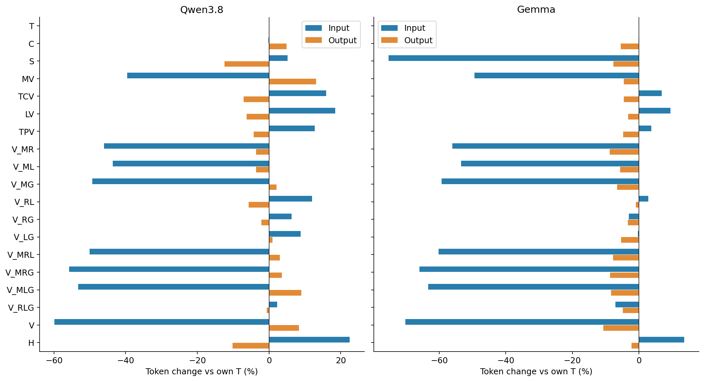

**发现 3：最好的诊断 arm 不一定最省 token。** Qwen TPV 虽提升 MRR，输入却比 T 多 12.8%，输出少 4.3%。不能写成“TPV 同时提高准确率并大幅压缩输入”。

**发现 4：截图压缩高度依赖模型的图像处理机制。** S 对 Gemma 的输入节省很大，对 Qwen 却比 T 略多；两个模型的 RCA 都变差。这个控制说明，“把文字装进像素”与“通过图形组织提供有用结构”是不同机制。

**发现 5：Metrics 是主要输入压缩来源，也是明显的准确率风险来源。** 析因 Shapley 对输入的分摊中，M 约贡献 Qwen −7,311、Gemma −8,516 tokens/case；但其 MRR 分量均为负。不能为了省最多的 token 就盲目把所有数值压进图里。

同理，G 的 Shapley 输入分量为负，不表示单独 TPV 的输入必然少：某些图像/指南开销由多个视觉区域共享，Shapley 是跨加入顺序的平均分摊，而 TPV−T 是一次具体部署比较。

本地部署不存在 API 账单，这里 token 是模型工作量与部署开销的指标。**输入减少不等于输出减少，更不等于端到端时间同比缩短。** 本版不将 token 换算成未经测量的实际加速倍数。

### 4.4 数据集与根因层级：收益不是均匀的

| 模型 | 数据集 | Cases | T | C | TPV | V | S |
| --- | --- | --- | --- | --- | --- | --- | --- |
| Qwen3.8 | aegislab | 100 | 0.4683 | 0.4378 | 0.5308 | 0.4225 | 0.3667 |
| Qwen3.8 | aiops2022 | 100 | 0.2558 | 0.2675 | 0.2783 | 0.1882 | 0.1083 |
| Qwen3.8 | aiops2025 | 100 | 0.2037 | 0.2553 | 0.3367 | 0.1867 | 0.1933 |
| Qwen3.8 | re2_ob | 90 | 0.8309 | 0.8444 | 0.9287 | 0.5981 | 0.6037 |
| Qwen3.8 | re2_tt | 90 | 0.8139 | 0.7880 | 0.8741 | 0.4741 | 0.5278 |
| Gemma | aegislab | 100 | 0.4125 | 0.4158 | 0.4400 | 0.3900 | 0.2600 |
| Gemma | aiops2022 | 100 | 0.3033 | 0.3200 | 0.2400 | 0.1500 | 0.1400 |
| Gemma | aiops2025 | 100 | 0.1875 | 0.2317 | 0.2058 | 0.1800 | 0.1650 |
| Gemma | re2_ob | 90 | 0.8593 | 0.9000 | 0.9000 | 0.6333 | 0.2556 |
| Gemma | re2_tt | 90 | 0.7611 | 0.7833 | 0.7444 | 0.4333 | 0.3333 |

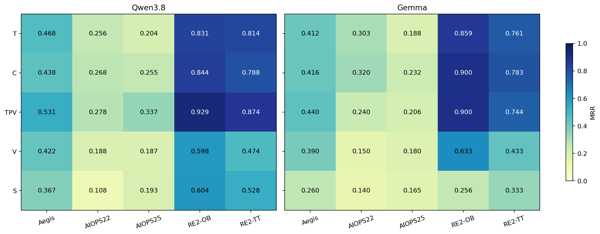

Qwen TPV 在 AIOPS-2025 上从 0.2037 到 0.3367，变化大于 AIOPS-2022 的 0.2558→0.2783。Gemma TPV 在 AegisLab 略好，在 AIOPS-2022 却从 0.3033 降至 0.2400。因此不能用一个总体均值替代迁移性解释。

| 模型 | 数据集 | 根因层级 | Cases | T MRR | TPV MRR | V MRR |
| --- | --- | --- | --- | --- | --- | --- |
| Gemma | aiops2022 | node | 29 | 0.3793 | 0.2069 | 0.2069 |
| Gemma | aiops2022 | pod | 38 | 0.3553 | 0.3684 | 0.1579 |
| Gemma | aiops2022 | service | 33 | 0.1768 | 0.1212 | 0.0909 |
| Gemma | aiops2025 | node | 22 | 0.1818 | 0.2273 | 0.2273 |
| Gemma | aiops2025 | pod/service | 22 | 0.0947 | 0.1061 | 0.1364 |
| Gemma | aiops2025 | service | 56 | 0.2262 | 0.2366 | 0.1786 |
| Qwen3.8 | aiops2022 | node | 29 | 0.3678 | 0.3276 | 0.2379 |
| Qwen3.8 | aiops2022 | pod | 38 | 0.0877 | 0.2171 | 0.1864 |
| Qwen3.8 | aiops2022 | service | 33 | 0.3510 | 0.3056 | 0.1465 |
| Qwen3.8 | aiops2025 | node | 22 | 0.1455 | 0.1136 | 0.1250 |
| Qwen3.8 | aiops2025 | pod/service | 22 | 0.1402 | 0.1591 | 0.0530 |
| Qwen3.8 | aiops2025 | service | 56 | 0.2515 | 0.4940 | 0.2634 |

`pod/service` 表示该分层记录的 accepted-root 标签涉及两类层级，不是把 pod 自动升级成 service。Scorer 按注册的 granularity-aware 规则匹配，node/pod 并未被排除。

例如 Qwen 在 AIOPS-2022 的 pod 根因上，T→TPV 从 0.0877 到 0.2171，但 node 根因从 0.3678 到 0.3276；AIOPS-2025 的 service 层级改善更大。这些是小分层的描述性结果，不能直接断言“拓扑图只对 pod 有用”。

故障类型同样有异质性：Qwen TPV 相对 T，`HTTPRequestReplaceMethod` 的 15 cases 平均 ΔMRR 约 +0.1556，`JVMMemoryStress` 的 14 cases 约 −0.0833。样本小、比较多，应作为失败检查线索，不作为新冻结规则。完整 fault-type 分项保留在附录 CSV。

## 5. RQ1.1 QA：语义评分V2的最新结果

### 5.1 题目、评分端点与分母

P1–P4（也称L1–L4）表示正确回答需要涉及1–4个区域。另有题型/推理操作轴：R1是独立读取，R2是前一步实体决定后一步查询，R3是各区域选winner（最符合条件的实体）后，再要求一个跨区域`overall`汇总。这里的R1/R2/R3不是研究问题编号，也不是trace区域R。

T/V/S分别是自然语言文本、真实dashboard、同文本截图；PathV只将问题需要的区域视觉化，ContextV只将问题不需要的区域视觉化。P4涉及全部区域，所以PathV=V、ContextV=T，不重复调用。同case、同条件的两个模型回答同一道题，使用一致的评分规则。

**当前主指标为“所有要求的区域答案均正确”，简称区域全对率。** 不强制R3的额外`overall`，同时接受保存的精确测量值及冻结画布对应的舍入值。明确的JSON键名、图上数值注记和上下游集合格式可规范化；错误ID、错符号、错方向、漏值和多报/少报邻居仍判错。不会替模型补出缺失答案。步骤准确率给每个答对步骤计分；前缀准确率依次检查“截至这一步是否一直答对”。

沿用原来的8个基础设施失败case联合排除规则（两模型和各表示同步排除），原协议不合格、未发调用的题目不计分，没有新增排除。17,280条原QA记录中，最终每模型8,412条、合计16,824条纳入分析。主数据集仍为AIOPS-2022、AIOPS-2025、AegisLab；各P的有效cases为293/288/286/285，所有表示在同P使用相同分母。不同P的题型和case构成不完全相同，不能把P1→P4当作严格控制后的单一难度曲线。

### 5.2 主数据集：所有表示的区域全对率

| 所需区域数 P | 表示 | 每模型有效 cases | Qwen 区域全对率 | Gemma 区域全对率 |
| --- | --- | --- | --- | --- |
| 1 | T | 293 | 67.24% | 70.99% |
| 1 | V | 293 | 45.73% | 51.19% |
| 1 | S | 293 | 27.65% | 15.36% |
| 1 | PATHV | 293 | 52.22% | 59.73% |
| 1 | CONTEXTV | 293 | 49.49% | 74.40% |
| 2 | T | 288 | 56.25% | 53.47% |
| 2 | V | 288 | 40.97% | 30.21% |
| 2 | S | 288 | 12.15% | 5.56% |
| 2 | PATHV | 288 | 44.44% | 36.11% |
| 2 | CONTEXTV | 288 | 59.03% | 55.90% |
| 3 | T | 286 | 34.62% | 29.37% |
| 3 | V | 286 | 18.88% | 16.08% |
| 3 | S | 286 | 2.45% | 1.40% |
| 3 | PATHV | 286 | 21.33% | 18.53% |
| 3 | CONTEXTV | 286 | 36.01% | 33.22% |
| 4 | T | 285 | 21.75% | 23.16% |
| 4 | V | 285 | 8.07% | 11.23% |
| 4 | S | 285 | 2.11% | 0.35% |

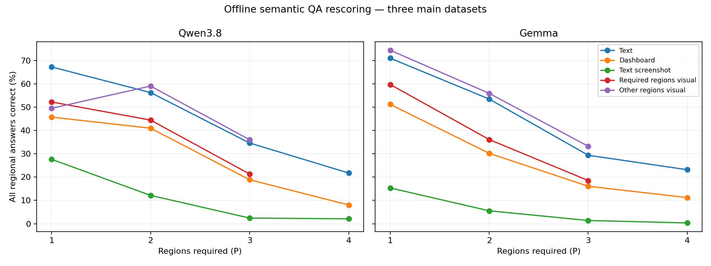

**发现6：放宽格式并兼容显示精度后，真实dashboard仍落后于文本，但不再是旧版的高层级全零。** P4的T/V分别为Qwen 21.75%/8.07%、Gemma 23.16%/11.23%。P2–P3中，ContextV通常更接近T，PathV更接近V；不过单区域题存在例外，不能把这个方向推广为每个case都成立。

下面按同case比较V与T。负差值表示视觉区域全对率较低；修复/破坏是从T错到V对、从T对到V错的case数。Pratt-Wilcoxon、paired dz和Holm沿用同数据范围×模型×P的比较family，其他表示的完整检验也保留在附件。

| 模型 | 区域数 | V−T（百分点） | Holm p | 配对dz | 修复/破坏 |
| --- | --- | --- | --- | --- | --- |
| Gemma | 1 | -19.80 | 1.54e-10 | -0.4147 | 10/68 |
| Gemma | 2 | -23.26 | 1.87e-11 | -0.4423 | 14/81 |
| Gemma | 3 | -13.29 | 3.92e-05 | -0.2663 | 19/57 |
| Gemma | 4 | -11.93 | 2.42e-06 | -0.2904 | 9/43 |
| Qwen3.8 | 1 | -21.50 | 1.09e-09 | -0.3929 | 19/82 |
| Qwen3.8 | 2 | -15.28 | 6.27e-06 | -0.2907 | 21/65 |
| Qwen3.8 | 3 | -15.73 | 8.77e-07 | -0.3177 | 16/61 |
| Qwen3.8 | 4 | -13.68 | 1.45e-07 | -0.3272 | 8/47 |

整题错不等于每一步都错。P4的步骤与前缀结果如下：

| 模型 | P4表示 | 区域全对率 | 步骤准确率 | 前缀准确率 |
| --- | --- | --- | --- | --- |
| Gemma | T | 23.16% | 73.60% | 45.35% |
| Gemma | V | 11.23% | 55.26% | 28.42% |
| Qwen3.8 | T | 21.75% | 73.95% | 43.42% |
| Qwen3.8 | V | 8.07% | 58.25% | 27.28% |

例如两模型文本条件能答对约74%的步骤，但所有四步同时正确只有约22%–23%。这是“每步都会增加整题失败机会”的体现，不足以单独证明发生了跨区域推理障碍。

### 5.3 五个数据集与评分修正幅度

下表先在每个case内平均有效P1–P4，再在数据集内平均，不是直接混合所有题目；两个RE2数据集仍完整单列。

| 数据集 | 模型 | cases | T | V | S |
| --- | --- | --- | --- | --- | --- |
| aegislab | Gemma | 99 | 40.82% | 30.89% | 5.47% |
| aegislab | Qwen3.8 | 99 | 45.37% | 31.57% | 11.36% |
| aiops2022 | Gemma | 98 | 48.72% | 28.83% | 7.40% |
| aiops2022 | Qwen3.8 | 98 | 49.49% | 30.10% | 13.78% |
| aiops2025 | Gemma | 96 | 44.27% | 22.40% | 4.43% |
| aiops2025 | Qwen3.8 | 96 | 41.41% | 25.26% | 9.11% |
| re2_ob | Gemma | 89 | 39.89% | 20.79% | 6.74% |
| re2_ob | Qwen3.8 | 89 | 48.60% | 25.28% | 10.96% |
| re2_tt | Gemma | 90 | 44.44% | 26.67% | 4.72% |
| re2_tt | Qwen3.8 | 90 | 46.67% | 30.00% | 9.44% |

为说明测量修正而非模型进步，下面保留一张明确标注版本的审计对照。它不是另一套主结果：

| 模型 | 有效回答 | 原严格正确 | V1正确 | V2正确 | 比V1新增 |
| --- | --- | --- | --- | --- | --- |
| Gemma | 8412 | 1187 | 2675 | 2693 | 18 |
| Qwen3.8 | 8412 | 1409 | 2766 | 2824 | 58 |

V2比V1恢复了76条整题和143个步骤的正确判定：Trace精确/显示最大值29条整题、图上数值注记26条、明确上下游分隔格式21条。相对原严格评分，两版修复合计恢复2,921条整题。63项CPU测试、17,280条QA原记录哈希、480个packet和1,900个选中问题检查通过，原回答、原分数及V1结果均保留。

`overall`仍单独记录：缺少它不再影响区域全对率；若明确提供但错误，则影响附加的`overall_checked`敏感性分数。**取消必填不等于模型完成了没有输出的汇总操作。** 本章是事后测量修正，不能当作原始预注册端点或新一次模型提升。完整评分来源与版本见[校验清单](assets/qa_semantic_v2_verification.json)。

### 5.4 使用V2重新连接QA与RCA

不是比较两个总体均值，而是按**case×model×representation**配对：先在case内聚合QA，再与同表示RCA的reciprocal rank（正确根因排名的倒数）关联。PathV/ContextV映射到对应区域视觉组合，H没有对应QA；同case四个P不当作四个独立样本。ΔQA、ΔRR分别是相对同case文本条件的变化。

| 模型 | 关系 | cases | Spearman ρ | Holm p |
| --- | --- | --- | --- | --- |
| Qwen3.8 | T：QA与RR | 293 | -0.0673 | 1.0000 |
| Qwen3.8 | V：QA与RR | 293 | +0.0212 | 1.0000 |
| Qwen3.8 | ΔQA(V−T)与ΔRR(V−T) | 293 | +0.0511 | 1.0000 |
| Gemma | T：QA与RR | 293 | +0.0271 | 1.0000 |
| Gemma | V：QA与RR | 293 | +0.0596 | 1.0000 |
| Gemma | ΔQA(V−T)与ΔRR(V−T) | 293 | +0.0025 | 1.0000 |

主数据集可配对293个cases。以上主要Spearman关联仍弱且经Holm校正后不显著；这不是“已证明不相关”。

原来的“题目支持边连接accepted root”的子集也已换用V2分数重算。沿用原先由证据定义的子集，不按成绩重新挑case；每模型、表示仍为124个cases，先在case内聚合，T/V/S作为各模型的独立Holm family：

| 模型 | 表示 | cases | Spearman ρ | 原始p | Holm p |
| --- | --- | --- | --- | --- | --- |
| Gemma | S | 124 | +0.1003 | 0.2677 | 0.8030 |
| Gemma | T | 124 | +0.0315 | 0.7282 | 0.8030 |
| Gemma | V | 124 | +0.0808 | 0.3723 | 0.8030 |
| Qwen3.8 | S | 124 | -0.1710 | 0.0575 | 0.1726 |
| Qwen3.8 | T | 124 | +0.0458 | 0.6139 | 0.6139 |
| Qwen3.8 | V | 124 | +0.0954 | 0.2919 | 0.5838 |

该子集也未出现显著关联。**它只是显示图中根因相关连接的代理，不等于真实物理故障传播链。** 子集定义和评分版本必须同时讲清，不能沿用旧严格评分的相关系数。

合理结论是：**这套QA区域正确率还不足以作为RCA质量代理、训练奖励或是否正确推理的裁判。** 评分修正削弱了“只是缺overall造成弱关联”的解释，但仍无法分辨其他可能原因：题目细节不是决定根因的关键证据、每case问题覆盖有限、RCA利用了QA未覆盖的摘要，以及复杂视觉题仍较难。一般区域查找、最大值和投票不等于完整故障推理；现有数据不能证明模型只凭感觉猜测。

## 6. 反事实 RCA：模型是否真的使用图像证据

四个条件都仍是一阶段 RCA：

- `V_FACTUAL`：原始事件图像。
- `V_TARGETED`：对诊断证据做定向移植，使某些证据从供体实体指向受体实体。
- `V_PLACEBO`：结构相近但不针对目标诊断方向的安慰剂干预。
- `V_NEUTRAL`：中性控制，移除/中和主要诊断内容，保留公共任务框架。

| 图像条件 | Qwen MRR | Gemma MRR |
| --- | --- | --- |
| V_FACTUAL | 0.2714 | 0.2450 |
| V_TARGETED | 0.2289 | 0.2033 |
| V_PLACEBO | 0.2668 | 0.2317 |
| V_NEUTRAL | 0.0589 | 0.0467 |

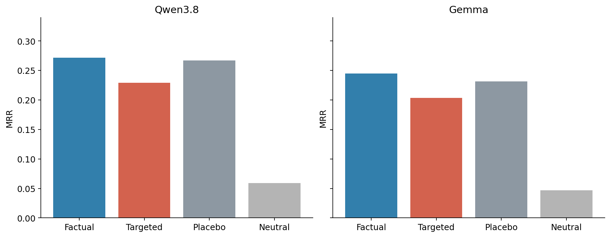

主要机制量 **CVI** 不是 MRR 增益：它衡量供体退出前列、受体进入前列的定向倒数排名变化，再减去 placebo 的同类变化。300 主 cases 上，Qwen CVI=+0.2599、Holm p≈2.28×10⁻³¹、dz=0.7851；Gemma=+0.1764、p≈1.14×10⁻¹⁴、dz=0.4858。Targeted 的 top-1 改变率约 41.7% / 35.0%。

**发现 7：模型不是完全无视事件图像。** 定向证据变化会引起定向排名响应，Neutral 下成绩也明显降低。但“对图像响应”“找到正确根因”“正确理解物理因果传播”仍是三件事。模型也可能跟随显著异常、实体关联或非因果线索；这些实验未恢复模型内部思维链。

这组 factual 是独立注册调用，其 MRR 不必与 Direct-RCA V 的一次采样输出逐字节相同；不应挑较高的一组替换另一组。

## 7. RQ2.1：从桥梁出发，但不再逐级挑冠军

### 7.1 实际完成的设计

后续决定将旧的“选择 P*→选择 S*→选择 D*”改为共同基准：

| 实验 | 固定什么 | 改变什么 |
| --- | --- | --- |
| Evidence selection | 父版剪影 S0、编排 D0 | P0 与七种选择策略，每种 T/V |
| Silhouette encoding | **P0** 选择、D0 编排 | S0 与十一种新剪影/紧凑条件 |
| Canvas composition | **P0** 选择、**S0** 剪影 | D0 与十种新编排/分辨率条件 |

因此本轮**没有正式 champion**；没有根据前一实验较高 MRR 切换后续基准；原计划的冠军 2×2×2 组合也没有执行。以下结论是围绕共同 P0/S0/D0 的受控效应，不是全部选择×剪影×布局组合的普适贡献。

### 7.2 与 RQ1.1 的桥梁

P0 名为 `R1-PanelSelect-v14`，包括实际选择与显示投影：M 的异常排名与 12 条 series/64 bins，R 的 TRC-L 排名，L 的实体/模板优先与 Denum 预览，G 的子图与调用边规则。它不是完整 raw telemetry，也不是随意拼出的统一 top-k。

RQ1.1 原 T/V 结果保留为桥梁引用。RQ2.1 使用中性选择说明和适配后的公共输入层，因此将 P0__T/P0__V 作为校准基线，不声称两个版本的请求完全相同。下面单列相对原桥梁的 **480-case 配对变化**：

| 模型 | 校准表示 | 480-case ΔMRR | Holm p | 配对 dz |
| --- | --- | --- | --- | --- |
| Qwen3.8 | T | -0.0044 | 1 | -0.0339 |
| Qwen3.8 | V | -0.0070 | 1 | -0.0264 |
| Gemma | T | 0.0083 | 0.96 | 0.0418 |
| Gemma | V | -0.0063 | 1 | -0.0152 |

校准的总体变化较小、校正后不显著；这支持沿桥梁解释变化，但**不证明严格等价**，也不能把新 arm 的全部变化都归因于某一个图形。后续局部干预先与 RQ2.1 自己的 P0/S0/D0 比较。

## 8. RQ2.1 信息筛选：选什么真的重要

### 8.1 八种策略及 T/V 成绩

| 策略 | 具体在改什么 |
| --- | --- |
| P0 | RQ1.1 父版 PanelSelect |
| P_SIGMA | SIRCL 的原生三倍标准差相关指标排名，主要替换 M 选择 |
| P_BARO_RS | 官方 BARO RobustScorer 指标排名组件，主要替换 M；不等于复现完整 BARO 系统 |
| P_TRACE_SC | SIRCL 异常 span 的 support/confidence 组合，主要替换 R |
| P_LOG_FREQ | SIRCL 模板频次工具，主要替换 L |
| P_COVERAGE | 项目自研：优先覆盖不同实体、metric family、模板和图端点 |
| P_DIVERSITY | 项目自研、MMR-inspired：固定权衡相关性与冗余，不让高度重复证据占满预算 |
| P_RANDOM | 同预算的确定性随机选择，负对照 |

不同 P 的目的就是改变内容，**不要求跨 P 信息相同**；每个 P 内的 T/V 使用该策略对应的注册事实投影。完整证据池留在 CPU 侧，最终只把选中内容送入模型。

以下 MRR 为五数据集等权平均：

| 选择策略 | Qwen Text | Qwen Vision | Gemma Text | Gemma Vision |
| --- | --- | --- | --- | --- |
| P0 | 0.5097 | 0.3664 | 0.5130 | 0.3491 |
| P_SIGMA | 0.4586 | 0.3118 | 0.3933 | 0.2488 |
| P_BARO_RS | 0.4912 | 0.3692 | 0.5160 | 0.3147 |
| P_TRACE_SC | 0.5212 | 0.3646 | 0.5324 | 0.3482 |
| P_LOG_FREQ | 0.5190 | 0.3244 | 0.5058 | 0.2932 |
| P_COVERAGE | 0.4913 | 0.2392 | 0.5037 | 0.1911 |
| P_DIVERSITY | 0.5226 | 0.3186 | 0.5501 | 0.2953 |
| P_RANDOM | 0.3081 | 0.1479 | 0.2762 | 0.0920 |

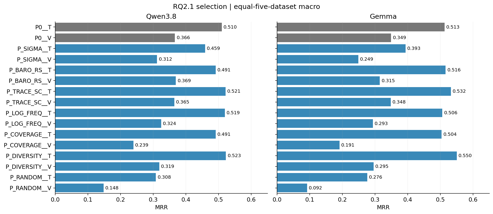

### 8.2 是否又出现“工具名变了，输入没变”

本次重新比较最终请求的公共文本及图像 SHA，去掉仅用于审计的 span/region 元数据。下表列出与同表示 P0 完全相同的数量；分母只包括双方都可执行的条件。两个模型得到一致的公共输入配对结果。

| 策略 | Text 与 P0 相同/可比较 | Vision 与 P0 相同/可比较 |
| --- | --- | --- |
| P_SIGMA | 11/480 | 11/480 |
| P_BARO_RS | 0/480 | 0/480 |
| P_TRACE_SC | 8/480 | 8/480 |
| P_LOG_FREQ | 5/480 | 5/423 |
| P_COVERAGE | 0/480 | 0/411 |
| P_DIVERSITY | 0/480 | 0/417 |
| P_RANDOM | 0/480 | 0/390 |

例如 P_SIGMA 有 11 个自然相同 case，P_TRACE_SC 有 8 个，P_LOG_FREQ 有 5 个；这符合允许相同选择复用的规则。它们不是整批坍缩到 P0。此检查证明最终文本/图像输入确有变化；它本身不证明新策略一定选到了更有诊断价值的证据。

### 8.3 效果与统计

| 模型 | 条件 | 相对基线 | 480-case ΔMRR | Holm p | 配对 dz | Top-1 修复/破坏 |
| --- | --- | --- | --- | --- | --- | --- |
| Qwen3.8 | P_COVERAGE__V | P0__V | -0.1252 | 2.19e-08 | -0.3140 | 17/70 |
| Qwen3.8 | P_DIVERSITY__T | P0__T | 0.0126 | 1 | 0.0344 | 52/42 |
| Qwen3.8 | P_RANDOM__T | P0__T | -0.1962 | 3.33e-14 | -0.4090 | 32/116 |
| Qwen3.8 | P_SIGMA__T | P0__T | -0.0519 | 0.00448 | -0.1639 | 20/35 |
| Qwen3.8 | P_TRACE_SC__T | P0__T | 0.0118 | 1 | 0.0518 | 24/17 |
| Gemma | P_COVERAGE__V | P0__V | -0.1521 | 5.12e-08 | -0.2834 | 38/111 |
| Gemma | P_DIVERSITY__T | P0__T | 0.0373 | 1 | 0.0821 | 62/46 |
| Gemma | P_RANDOM__T | P0__T | -0.2307 | 1.31e-14 | -0.4048 | 39/147 |
| Gemma | P_SIGMA__T | P0__T | -0.1218 | 1.73e-05 | -0.2438 | 40/96 |
| Gemma | P_TRACE_SC__T | P0__T | 0.0194 | 1 | 0.0702 | 28/18 |

此表 ΔMRR/dz/p 使用 480 个 cases 的配对 pooled 统计；主结果表仍是五数据集等权。Top-1 修复/破坏让我们看到平均改善是否伴随大量相反案例。

**发现 8：负对照提供了非常明确的信息选择证据。** Random Text 在 Qwen、Gemma 上均大幅下降，Holm p 均远低于 0.05。因为 Text 不受这些视觉渲染失败影响，这一结果不能用“只是画不下”解释。当前异常/相关性筛选比在相同名额内随机抽证据更有价值。

**发现 9：覆盖更多种类并不自动等于诊断更好，原生工具也不自动优于适配过的父版。** P_SIGMA Text 在两模型显著退化；P_TRACE_SC、P_DIVERSITY Text 点估计较高，但经本轮校正后没有显著优势。不能把最高均值命名成已经证明优于其他策略的冠军。

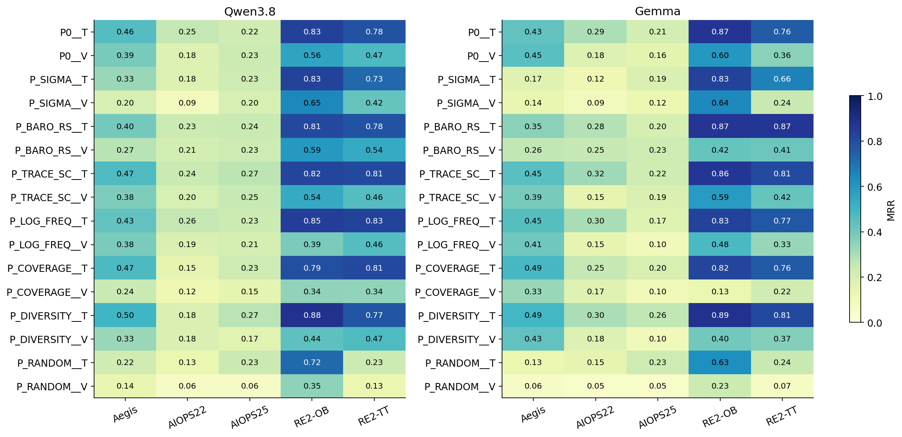

一个有意思的例外是 AIOPS-2025：Random Text 的 Qwen/Gemma MRR 为 0.2350/0.2283，略高于各自 P0 的 0.2195/0.2083；但它在其他数据集大幅退化。这提示“当前相关性摘要并非在每个数据集都抓住了最有用信号”，不支持部署随机策略。这样的反例应保留，不为了整齐故事删除。

### 8.4 可执行性与成本：不能混成一个成功率

| Vision 条件 | 每模型不可执行 cases | 比例 | 原因类别 |
| --- | ---: | ---: | --- |
| P_LOG_FREQ | 57/480 | 11.9% | 选择后的内容无法满足注册画布/显示约束 |
| P_DIVERSITY | 63/480 | 13.1% | 同上 |
| P_COVERAGE | 69/480 | 14.4% | 同上 |
| P_RANDOM | 90/480 | 18.8% | 同上 |
| P0 / P_SIGMA / P_BARO_RS / P_TRACE_SC | 0/480 | 0% | 全部可执行 |

这些是设计不可执行，而不是残余服务器错误。端到端结果保留为 0 分；如果只计算成功画出的子集，分母和 case 难度就变了，不能用条件成功率替换正式结果。附录同时提供可执行子集的描述性统计，便于区分两个瓶颈。

| 条件 | Qwen 输入 | Qwen 输出 | Gemma 输入 | Gemma 输出 |
| --- | --- | --- | --- | --- |
| P0__T | 13,538.4 | 164.6 | 14,867.0 | 113.8 |
| P0__V | 4,819.7 | 185.6 | 3,877.4 | 101.2 |
| P_SIGMA__T | 14,077.9 | 164.9 | 15,405.2 | 113.0 |
| P_SIGMA__V | 4,819.7 | 186.5 | 3,877.4 | 103.5 |
| P_BARO_RS__T | 14,053.2 | 170.6 | 15,383.0 | 113.3 |
| P_BARO_RS__V | 4,819.7 | 190.6 | 3,877.4 | 104.4 |
| P_TRACE_SC__T | 13,521.6 | 161.6 | 14,848.6 | 114.5 |
| P_TRACE_SC__V | 4,819.7 | 187.7 | 3,877.4 | 102.8 |
| P_LOG_FREQ__T | 13,517.8 | 167.9 | 14,841.2 | 113.0 |
| P_LOG_FREQ__V | 4,270.3 | 162.6 | 3,440.6 | 89.9 |
| P_COVERAGE__T | 13,277.0 | 170.1 | 14,606.1 | 113.6 |
| P_COVERAGE__V | 4,157.0 | 158.9 | 3,350.8 | 88.5 |
| P_DIVERSITY__T | 13,436.8 | 181.4 | 14,764.8 | 112.7 |
| P_DIVERSITY__V | 4,210.3 | 163.0 | 3,392.6 | 88.5 |
| P_RANDOM__T | 12,864.5 | 185.9 | 14,189.3 | 110.2 |
| P_RANDOM__V | 3,941.8 | 154.0 | 3,170.8 | 86.4 |

表中是五数据集等权、按逻辑目标计的平均实际 tokens；不可执行目标没有发起调用，计 0。因此后四个 Vision 的“输入更少”部分来自根本没有执行，**不能称为效率提升**。相比之下，P0 T→V 的输入下降来自已执行请求的表示改变。

Qwen 各个完整可执行 V 条件输入相同，是固定画布经同一 processor 后获得相同视觉 token 数的结果，**不是图像内容相同**。同样长度可以容纳完全不同的证据。

## 9. RQ2.1 剪影：相同内容怎么画

固定 P0 证据、D0 布局、画布尺寸和卡片分组，仅改变卡片内部编码。与用户后来追加的密度条件一起，共 S0 加十一种新条件。

| 条件 | 含义 |
| --- | --- |
| S0 | 父版真实图表 |
| S_M_HEATMAP | M 的时间-bin 热图 |
| S_M_TIME_BARS | M 的逐时间-bin 柱形图，不是丢失时间顺序的幅值直方图 |
| S_M_OVERLAY | 同语义、同单位的兼容曲线共轴叠画；不是任意 series 强行共轴 |
| S_R_PAIRED_BARS / S_R_DUMBBELL | R 的参考/当前成对条形，或两点连线 |
| S_L_MATRIX | 日志模板×时间矩阵，同时保留文字与诊断数字 |
| S_G_MATRIX / S_G_LAYERED | 有向矩阵 / 保留环与交叉边的分层有向图 |
| S_TABLE | 同事实的组织化表格，不是 T 的原文截图 |
| S_COMPACT_MIX | 热图、trace 双点、日志矩阵、G 矩阵的组合 |
| S_DENSITY_COMPACT | 在同样字体、事实和外层画布中压缩卡片内部可安全减少的留白；不额外增加信息 |

| 条件 | Qwen MRR | Gemma MRR | Qwen ΔMRR | Gemma ΔMRR |
| --- | --- | --- | --- | --- |
| S0 | 0.3664 | 0.3491 | 0.0000 | 0.0000 |
| S_M_HEATMAP | 0.3491 | 0.3102 | -0.0173 | -0.0389 |
| S_M_TIME_BARS | 0.3772 | 0.3252 | 0.0107 | -0.0239 |
| S_M_OVERLAY | 0.3767 | 0.3164 | 0.0103 | -0.0327 |
| S_R_PAIRED_BARS | 0.3683 | 0.3567 | 0.0019 | 0.0076 |
| S_R_DUMBBELL | 0.3529 | 0.3393 | -0.0135 | -0.0098 |
| S_L_MATRIX | 0.3692 | 0.3596 | 0.0028 | 0.0104 |
| S_G_MATRIX | 0.3644 | 0.3416 | -0.0020 | -0.0076 |
| S_G_LAYERED | 0.3943 | 0.3253 | 0.0279 | -0.0238 |
| S_TABLE | 0.2880 | 0.2751 | -0.0784 | -0.0740 |
| S_COMPACT_MIX | 0.3468 | 0.2824 | -0.0197 | -0.0667 |
| S_DENSITY_COMPACT | 0.3575 | 0.3231 | -0.0089 | -0.0260 |

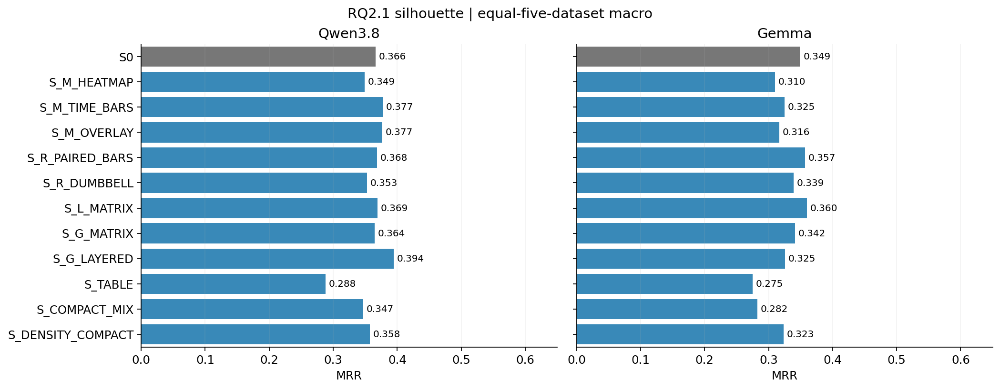

| 模型 | 条件 | 相对基线 | 480-case ΔMRR | Holm p | 配对 dz | Top-1 修复/破坏 |
| --- | --- | --- | --- | --- | --- | --- |
| Qwen3.8 | S_DENSITY_COMPACT | S0 | -0.0073 | 1 | -0.0232 | 25/31 |
| Qwen3.8 | S_G_LAYERED | S0 | 0.0281 | 0.796 | 0.0909 | 32/21 |
| Qwen3.8 | S_TABLE | S0 | -0.0747 | 0.00266 | -0.1877 | 27/56 |
| Gemma | S_DENSITY_COMPACT | S0 | -0.0250 | 1 | -0.0629 | 32/44 |
| Gemma | S_G_LAYERED | S0 | -0.0229 | 1 | -0.0580 | 32/43 |
| Gemma | S_TABLE | S0 | -0.0736 | 0.142 | -0.1275 | 63/99 |

**发现 10：能让人感觉更“结构化”的表格，不一定更适合 VLM。** S_TABLE 的两个模型均下降；Qwen 的 pooled ΔMRR=−0.0747，Holm p=0.0027。模型需要从像素中逐项读取表格，不能把“形式整齐”直接等同于容易诊断。

**发现 11：同一图形对不同 Solver 的作用不一致。** S_G_LAYERED 的 Qwen 点估计从 0.3664 到 0.3943，Gemma 从 0.3491 到 0.3253；两者都不足以证明新图形稳定更好。单看 Qwen 最高条形就推广给 Gemma 会出错。

**发现 12：压缩内部留白没有自动产生收益。** S_DENSITY_COMPACT 对两个模型均未改善，也没有减少输入 tokens，因为外层图像尺寸未变。这个实验测试的是同信息的内部紧凑度，不能用于回答“放入更多 evidence cards 是否更好”。

| 条件 | Qwen 输入 | Qwen 输出 | Gemma 输入 | Gemma 输出 |
| --- | --- | --- | --- | --- |
| S0 | 4,819.7 | 185.6 | 3,877.4 | 101.2 |
| S_M_HEATMAP | 4,819.7 | 190.5 | 3,877.4 | 102.6 |
| S_M_TIME_BARS | 4,819.7 | 188.1 | 3,877.4 | 103.5 |
| S_M_OVERLAY | 4,819.7 | 189.5 | 3,877.4 | 102.0 |
| S_R_PAIRED_BARS | 4,819.7 | 186.2 | 3,877.4 | 103.8 |
| S_R_DUMBBELL | 4,819.7 | 185.2 | 3,877.4 | 102.2 |
| S_L_MATRIX | 4,819.7 | 190.5 | 3,877.4 | 103.1 |
| S_G_MATRIX | 4,819.7 | 187.8 | 3,877.4 | 101.4 |
| S_G_LAYERED | 4,819.7 | 187.5 | 3,877.4 | 101.4 |
| S_TABLE | 4,819.7 | 188.3 | 3,877.4 | 105.2 |
| S_COMPACT_MIX | 4,819.7 | 187.7 | 3,877.4 | 103.2 |
| S_DENSITY_COMPACT | 4,819.7 | 186.3 | 3,877.4 | 102.5 |

所有剪影条件输入相同，输出差异较小，多数新画法没有减少输出。准确率点估计的小变化不能被说成同时降低了推理开销。

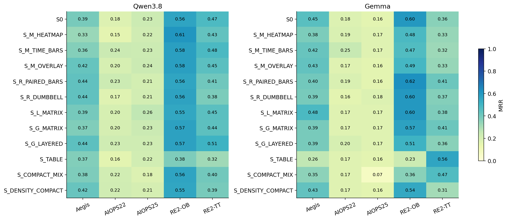

## 10. RQ2.1 编排与分辨率：同样卡片怎么摆

固定 P0 证据与 S0 剪影。`D_ENTITY` 是整张卡片按实体关联排序，不是重新拆卡；`D_ONSET_ORDER` 按公共遥测 onset 排序，不使用注入标签；`D_TOPOLOGY_CENTER` 把 G 放到中心。`COMPACT/AIRY` 改外部间距；`LANDSCAPE/PORTRAIT` 改比例但保持原像素预算；`SCALE` 改最终 PNG 分辨率。

| 条件 | Qwen MRR | Gemma MRR | Qwen ΔMRR | Gemma ΔMRR |
| --- | --- | --- | --- | --- |
| D0 | 0.3664 | 0.3491 | 0.0000 | 0.0000 |
| D_COMPACT | 0.3691 | 0.3427 | 0.0027 | -0.0064 |
| D_AIRY | 0.3714 | 0.3136 | 0.0050 | -0.0356 |
| D_ENTITY | 0.3847 | 0.3016 | 0.0183 | -0.0476 |
| D_TOPOLOGY_CENTER | 0.3420 | 0.2102 | -0.0244 | -0.1389 |
| D_ONSET_ORDER | 0.3900 | 0.3160 | 0.0236 | -0.0331 |
| D_LANDSCAPE | 0.3756 | 0.2928 | 0.0092 | -0.0563 |
| D_PORTRAIT | 0.3451 | 0.2522 | -0.0214 | -0.0969 |
| D_SCALE_075 | 0.3236 | 0.3400 | -0.0428 | -0.0091 |
| D_SCALE_125 | 0.4015 | 0.3553 | 0.0351 | 0.0062 |
| D_SCALE_150 | 0.4137 | 0.3607 | 0.0473 | 0.0116 |

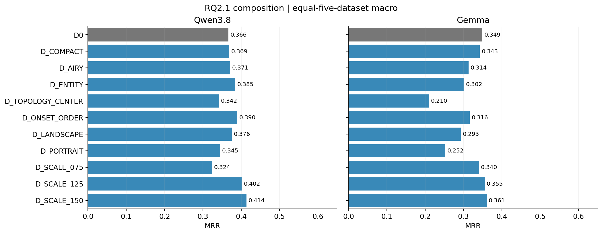

| 模型 | 条件 | 相对基线 | 480-case ΔMRR | Holm p | 配对 dz | Top-1 修复/破坏 |
| --- | --- | --- | --- | --- | --- | --- |
| Qwen3.8 | D_PORTRAIT | D0 | -0.0218 | 1 | -0.0568 | 39/48 |
| Qwen3.8 | D_SCALE_150 | D0 | 0.0459 | 0.0123 | 0.1467 | 41/22 |
| Qwen3.8 | D_TOPOLOGY_CENTER | D0 | -0.0248 | 1 | -0.0677 | 34/43 |
| Gemma | D_PORTRAIT | D0 | -0.0951 | 0.00115 | -0.1887 | 40/86 |
| Gemma | D_SCALE_150 | D0 | 0.0111 | 1 | 0.0334 | 29/24 |
| Gemma | D_TOPOLOGY_CENTER | D0 | -0.1354 | 4.43e-07 | -0.2638 | 35/100 |

**发现 13：强调拓扑，与把拓扑放在中心，不是同一件事。** RQ1.1 中 G 平均有利，但 RQ2.1 `D_TOPOLOGY_CENTER` 使 Gemma 从 0.3491 降至 0.2102；480-case Top-1 修复 35、破坏 100，Holm p≈4.43×10⁻⁷。表示价值与空间编排价值不能混为一谈。布局改变如何破坏阅读顺序或局部可读性是候选机制，单靠成绩不能确定内部原因。

**发现 14：分辨率对 Qwen 有较清楚的描述性趋势，但不是免费收益。**

| 条件 | Qwen 输入 | Qwen 输出 | Gemma 输入 | Gemma 输出 |
| --- | --- | --- | --- | --- |
| D0 | 4,819.7 | 185.6 | 3,877.4 | 101.2 |
| D_COMPACT | 4,819.7 | 188.3 | 3,877.4 | 102.5 |
| D_AIRY | 4,742.8 | 183.5 | 3,814.4 | 100.8 |
| D_ENTITY | 4,819.7 | 190.4 | 3,877.4 | 102.9 |
| D_TOPOLOGY_CENTER | 4,819.7 | 186.9 | 3,877.4 | 105.5 |
| D_ONSET_ORDER | 4,819.7 | 190.3 | 3,877.4 | 102.4 |
| D_LANDSCAPE | 4,825.8 | 191.0 | 3,858.1 | 102.6 |
| D_PORTRAIT | 4,826.1 | 187.5 | 3,874.1 | 104.2 |
| D_SCALE_075 | 3,908.1 | 185.4 | 3,877.4 | 102.9 |
| D_SCALE_125 | 5,974.5 | 183.7 | 3,877.4 | 102.9 |
| D_SCALE_150 | 7,483.9 | 184.3 | 3,877.4 | 103.2 |

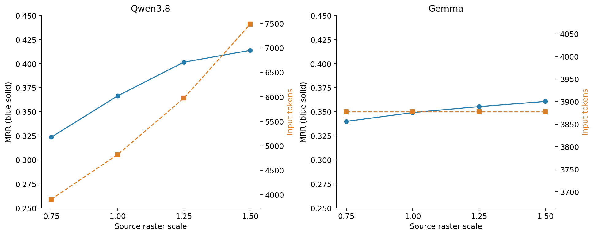

Qwen 从 D0 到 scale 1.50，五数据集 MRR 0.3664→0.4137；输入约 4,820→7,484，增加 55.3%，输出约 185.6→184.3，几乎不变。480-case pooled ΔMRR=+0.0459、Holm p=0.0123，统计显著但**未达到注册的 +0.05 实质收益门槛**。

不能从四个 scale 点宣称“分辨率越高永远越好”。Gemma 的源图变大没有增加平均输入 token，MRR 变化也很小；源图像素数和 processor 后有效视觉 token 是不同概念。

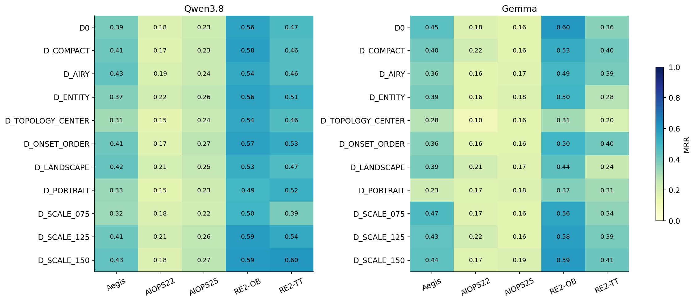

Qwen 的 D_SCALE_150 在 AIOPS-2022 上约为 0.1775，几乎等于 D0 的 0.1770；在 RE2-TT 上则从 0.4741 到 0.6019。汇总改善很大一部分依赖特定数据集，并非所有场景的字都放大就同步变好。

D_AIRY 每模型有 8/480（1.67%）设计不可执行，其低输入均值同样不能全解释为节省；其他编排均可执行。

## 11. 系统性失败与局限：不要都归因于“模型不行”

### 11.1 最终记录中的异常

下表按最终原始记录重新统计，不沿用中途 completion 日志计数。输出契约异常包括解析问题及不被接受的 ID/结构；截断可能与其重合，不能直接相加。复用条件也可能继承一个失败输出，因此这是逻辑记录级统计，不是唯一网络请求失败率。

| 实验 | 模型 | 逻辑记录数 | 格式/输出契约异常 | 截断 | 残余基础设施失败 | 设计不可执行 | 题目不合格 |
| --- | --- | --- | --- | --- | --- | --- | --- |
| composition | Gemma | 5280 | 4 (0.08%) | 0 | 0 | 8 | 0 |
| composition | Qwen3.8 | 5280 | 56 (1.06%) | 0 | 0 | 8 | 0 |
| rq1_cf | Gemma | 1920 | 15 (0.78%) | 0 | 0 | 0 | 0 |
| rq1_cf | Qwen3.8 | 1920 | 14 (0.73%) | 0 | 0 | 0 | 0 |
| rq1_qa | Gemma | 8640 | 26 (0.30%) | 20 | 0 | 0 | 84 |
| rq1_qa | Qwen3.8 | 8640 | 20 (0.23%) | 1 | 8 | 0 | 84 |
| rq1_rca | Gemma | 9120 | 7 (0.08%) | 0 | 0 | 0 | 0 |
| rq1_rca | Qwen3.8 | 9120 | 22 (0.24%) | 1 | 0 | 0 | 0 |
| selection | Gemma | 7680 | 3 (0.04%) | 0 | 0 | 279 | 0 |
| selection | Qwen3.8 | 7680 | 27 (0.35%) | 0 | 0 | 279 | 0 |
| silhouette | Gemma | 5760 | 3 (0.05%) | 0 | 0 | 0 | 0 |
| silhouette | Qwen3.8 | 5760 | 61 (1.06%) | 0 | 0 | 0 | 0 |

RQ1.1 QA 的 Qwen 残余基础设施失败涉及 8/480 cases（1.67%），主数据集涉及 7/300（2.33%），在共同配对掩码中排除；题目 eligibility 另按对应层级处理。RQ2.1 六个实验×模型组合最终残余 whole-case infrastructure exclusions 均为 0。

不要把5%基础设施阈值套在设计不可执行率上：两者分母和意义不同。上表保留原始输出契约与截断状态，不因离线语义重评分而改写运维历史。QA的`overall`遗漏现在单独审计，不再混入区域全对率；合法JSON与实际内容答对仍是两回事。

过去 smoke 没有截断不代表 formal 没有：这批 RQ1.1 Gemma QA 有 20 条截断，Qwen QA 1 条、Direct-RCA 1 条。新报告按最终记录如实列出，不追溯声称全部响应均完整。

### 11.2 更细的失败链

| 环节 | 当前观察 | 对应发现 |
| --- | --- | --- |
| 证据被选入 | 300主cases中44个没有根因实体直接关联的已展示遥测；T/V在这44个case中均未命中 | 展示证据覆盖与诊断成败紧密相伴 |
| 证据被组织成图 | 一些选择策略画不下；在可执行配对子集里V仍低于T | 渲染容量和模型使用图像分别构成瓶颈 |
| 精确读数/组合 | V2兼容格式与显示精度后，QA的T仍优于V；高P仍较难，但不再全零 | 精确读取和多步骤组合的表示代价仍存在 |
| 输出任务终点 | 去除overall必填并修正格式后，区域全对率提高，QA–RCA关联仍弱 | 测量误判解释了部分低分，但未解释全部任务间差异 |
| 排名决策 | Qwen TPV改善MRR并修复更多Top-1；Gemma的V没有额外Top-5命中 | 不同Solver的排序行为及其视觉响应不同 |
| 响应视觉干预 | 定向反事实引起定向排名变化；空白化明显降低MRR | 模型输出会随诊断图像证据的改变而改变 |

44 个直接 root-telemetry 缺席 cases 分别为 AegisLab 4、AIOPS-2022 21、AIOPS-2025 19。这个统计排除了仅在候选/标题里出现 root ID 的情况，只分析已选输入，不窥探模型隐状态。不能误写成 raw processor 又丢失了 44 个字段。

这也是后续 Composer 应追踪完整链条的理由：**pool 中有没有→目录有没有→有没有选中→有没有完整画出→公开 reason 有没有引用→排名有没有改善。** 公开 reason 的实体/数值可核验匹配仍是表面 grounding 指标，不是思维链正确性证明。分层与引用汇总在附录保留，本文不把启发式 matcher 的命中包装为可靠因果解释。

## 12. 综合发现：表示、证据、布局和成本分别改变了什么

下面整理32项具体发现。RQ1.1数值默认使用三个主数据集的300 cases；RQ2.1均值默认采用五数据集等权，逐case修复/破坏与补充配对检验使用480 cases。既有预注册检验保留原family；新增跨表示检验为事后探索性family，分别写明效应和p值。点估计、显著差异、描述性分层在各项中明确区分。

### 12.1 哪些区域帮助诊断，哪些区域增加负担

**F01｜Topology是两个模型共有的平均正向区域。** 在其他区域的八种匹配背景中，把G从文本改为图像，平均MRR变化为Qwen +0.0561、Gemma +0.0454；原family Holm p分别为0.00110、0.00236。Qwen八个背景的点估计全部为正；Gemma六个为正、两个轻微为负。正向变化分布在多个组合背景，而不仅是单一TPV条件。

**F02｜Metrics和Traces视觉化的平均代价在两个模型上都出现。** M的平均MRR变化为Qwen −0.0503、Gemma −0.0546；R分别为−0.0325、−0.0312，四项原family Holm p均<0.05。数值序列和调用时延摘要是本轮全视觉压缩中的主要诊断风险区域。

**F03｜Logs的视觉化作用更依赖模型。** L的平均效应为Qwen −0.0166（Holm p=0.00618），Gemma +0.0088（p=0.623）。前者表现出小而可检出的负向变化，后者未呈现明确方向。

**F04｜区域之间存在交互，而且交互方向会随Solver反转。** M×G的平均差中之差为Qwen −0.0482、Gemma +0.0684，二阶interaction family Holm p分别为0.0220、0.00609。这里的“差中之差”指G的作用在M为视觉时与M为文本时相差多少，再对R/L背景平均。同样的M/G组合，对Qwen更容易相互抵消，对Gemma则呈现正向互补。

**F05｜对Qwen，选择性视觉化比全部视觉化更有效。** TPV相对V的MRR增加0.1162，事后跨表示family Holm p=2.32×10⁻⁵；Top-1修复46个case、破坏11个。平均输出也从185.1降至163.5 tokens，但保留文本使输入增加到V的约2.81倍。这是更高诊断质量与更高输入量并存的明确取舍。

**F06｜冗余的图文A+B会增加成本，也可能损害诊断。** H相对T的输入增加Qwen 22.5%、Gemma 13.6%；Gemma MRR下降0.0683，补充family Holm p=0.0229，Top-1修复13个、破坏32个。Qwen的H相对T变化较小（−0.0129）。重复提供相同内容，在这两个Solver上没有形成一致收益。

补充跨表示比较如下。这里的Holm在新增14项RQ1.1比较中共同校正，与第4章预注册对T的family不同；原预注册统计保持不变。

| 模型 | 比较 | n | ΔMRR | 本补充family Holm p | Top-1修复/破坏 |
| --- | --- | --- | --- | --- | --- |
| Gemma | TPV−V | 300 | +0.0553 | 0.405 | 38/24 |
| Gemma | H−V | 300 | -0.0072 | 1 | 23/29 |
| Gemma | H−T | 300 | -0.0683 | 0.0229 | 13/32 |
| Gemma | C−T | 300 | +0.0214 | 0.685 | 16/12 |
| Qwen3.8 | TPV−V | 300 | +0.1162 | 2.32e-05 | 46/11 |
| Qwen3.8 | H−V | 300 | +0.0306 | 0.568 | 28/23 |
| Qwen3.8 | H−T | 300 | -0.0129 | 1 | 29/32 |
| Qwen3.8 | C−T | 300 | +0.0109 | 1 | 14/8 |

### 12.2 证据覆盖和排序行为暴露了哪些瓶颈

**F07｜缺少根因直接关联的已展示遥测时，诊断几乎全部失败。** 44个此类case上，两模型的T/V MRR全部为0；Qwen TPV仅命中1个（MRR=0.0227），Gemma TPV为0。这些case的根因仍在候选集中；统计对象是最终展示事实与accepted-root实体的直接绑定，不是完整processed corpus。该分层与数据集/故障难度相伴，提供了优先检查证据筛选覆盖的具体线索。

**F08｜“证据存在”之后，使用证据仍是第二个瓶颈。** 在其余256个有根因直接关联遥测的case上，Qwen T/V/TPV MRR分别为0.3624/0.3115/0.4437；Gemma分别为0.3529/0.2813/0.3460。即使根因有关的遥测已进入输入，这一批case的成绩仍随表示变化。

| 模型 | 表示 | 根因直接关联遥测 | cases | MRR | AC@1 |
| --- | --- | --- | --- | --- | --- |
| Gemma | T | 无 | 44 | 0.0000 | 0.0000 |
| Gemma | T | 有 | 256 | 0.3529 | 0.3320 |
| Gemma | TPV | 无 | 44 | 0.0000 | 0.0000 |
| Gemma | TPV | 有 | 256 | 0.3460 | 0.3359 |
| Gemma | V | 无 | 44 | 0.0000 | 0.0000 |
| Gemma | V | 有 | 256 | 0.2812 | 0.2812 |
| Qwen3.8 | T | 无 | 44 | 0.0000 | 0.0000 |
| Qwen3.8 | T | 有 | 256 | 0.3624 | 0.2461 |
| Qwen3.8 | TPV | 无 | 44 | 0.0227 | 0.0227 |
| Qwen3.8 | TPV | 有 | 256 | 0.4437 | 0.3477 |
| Qwen3.8 | V | 无 | 44 | 0.0000 | 0.0000 |
| Qwen3.8 | V | 有 | 256 | 0.3115 | 0.2148 |

**F09｜Qwen与Gemma的错误排名结构不同。** Qwen的T从AC@1=0.2100到AC@5=0.4500，正确根因在第2–5名补获72个case；V从0.1833到0.3800，补获59个。Gemma的V则AC@1=AC@5=MRR=0.2400，没有通过放宽至前五额外命中的case。两模型的“未排第一”错误，表现出不同的可挽救空间。

**F10｜高平均MRR同时伴随修复与破坏，二者数量比单个均值更直观。** Qwen TPV相对T修复54个Top-1、破坏27个，净增27个；Gemma为23/22，几乎抵消。RQ2.1的Qwen scale1.50修复41个、破坏22个，而Gemma拓扑居中修复35个、破坏100个。均值变化来自具体case的双向迁移，不是所有case同幅升降。

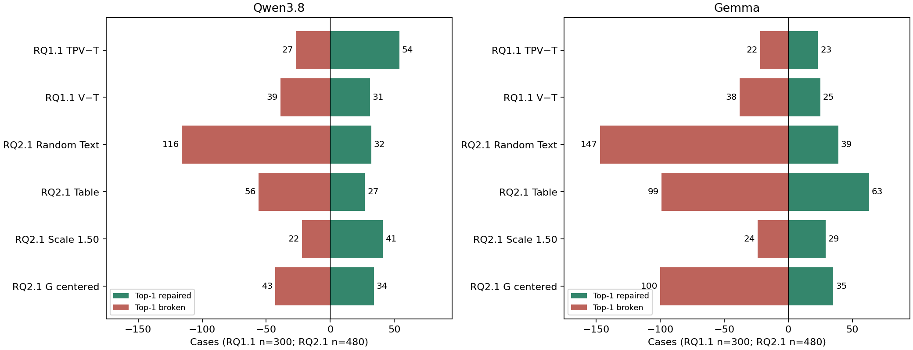

**F11｜收益沿数据集与根因层级分布，而非均匀分布。** Qwen TPV在AIOPS-2025的MRR增加约0.1330，在AIOPS-2022只增加约0.0225。AIOPS-2022内部，pod根因从0.0877升至0.2171，node根因则从0.3678降至0.3276。主数据集内部也需要细分证据与实体层级，而非只按模型分类。

### 12.3 Token节省究竟来自哪里

**F12｜全视觉最稳定的节省发生在输入端。** T→V输入下降Qwen 59.9%、Gemma 70.1%；输出却是Qwen增加8.4%、Gemma减少10.7%。同一表示压缩的输入收益具有一致方向，输出响应则相反。

**F13｜Qwen的TPV平均输出更短，但多数case的输出实际更长。** T/TPV输出均值为170.8/163.5，中位数却为154.5/162.0；逐case比较，134个变短、162个变长、4个相同，配对变化中位数为+4 tokens。T有2条超过512 tokens的回答，TPV没有，最大值为2446/314。平均节省与多数case变长同时出现，体现了少数长回答对平均成本的影响；Gemma则有178个case变短、118个变长、4个相同。

**F14｜文字截图的token表现同样依赖模型。** Qwen S比T输入增加约5.2%、输出减少12.5%，同时MRR从0.3093降至0.2228；Gemma S输入大幅下降，但MRR从0.3011降至0.1883。截图是一种独立的像素编码控制，其成本—诊断取舍与真实图表不同。

**F15｜结构化的C在这批输入里几乎没有压缩输入。** C相对T的输入仅减少Qwen约0.15%、Gemma约0.10%；MRR点估计增加0.0109/0.0214。输出分别增加约4.9%、减少约5.5%。当前C的主要变化是组织方式，而不是大规模token压缩。

**F16｜短输出和正确诊断是两条不同的优化轴。** Qwen的S/H平均输出149.5/153.4，都低于T的170.8，但其MRR也分别低于T；TPV的163.5更长一些，却有最高的0.3819 MRR。仅按输出长度排序，会选到不同于诊断质量最好的表示。

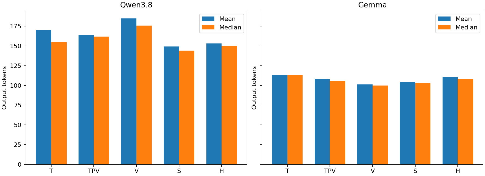

### 12.4 QA告诉了我们哪些更细的视觉作用

**F17｜原评分对模型已答对内容的低估规模可观。** 语义V2相对原严格评分恢复2,921条整题正确，包含取消overall必填、显示精度、格式与合法多解处理。P4不再全零；主数据集T/V区域全对率为Qwen 21.75%/8.07%、Gemma 23.16%/11.23%。评分协议本身曾是显著的测量瓶颈。

**F18｜精确读取与多步骤全对之间有很大落差。** P4文本步骤正确率约74%，整题区域全对率只有约22%–23%；V的步骤正确率约55%–58%，整题只有8%–11%。逐步正确率与整题正确率共同反映错误如何随多步任务累积。

**F19｜把“所需证据变成图”和“增加旁边图像”分开后，出现了不同响应。** P2的T/PathV/ContextV为Qwen 56.25%/44.44%/59.03%、Gemma 53.47%/36.11%/55.90%；P3也有相近顺序。单区域时Qwen ContextV却低于T（49.49%对67.24%）。额外视觉上下文的影响会随当前任务和模型变化。

**F20｜真实图表比文字截图更适合这批视觉QA。** 主数据集P1的V/S为Qwen 45.73%/27.65%、Gemma 51.19%/15.36%；P2至P4的V也都高于S。S与V都使用图像，但内容在像素中的组织方式明显影响读取成绩。

**F21｜更准确地评分后，QA依然不是RCA成绩的强预测变量。** 主数据集T/V与配对变化的六个主要Spearman相关绝对值均小于0.068；原124-case根因相关连接子集重新评分后同样未出现显著关联。由此把一般区域读取能力与最终诊断成绩区分开，仍有直接的数据依据。

### 12.5 信息筛选：哪些作用由工具真正带来

**F22｜同预算随机选信息造成大幅退化，筛选确实提供诊断价值。** RQ2.1 Random Text相对P0的480-case平均MRR下降Qwen 0.1962、Gemma 0.2307，Top-1修复/破坏为32/116和39/147。文本条件不涉及绘图不可执行，因此这一负向效应直接落在内容选择上。

**F23｜工具名称或算法出处本身不是收益保证，具体排序决定结果。** P_SIGMA Text的两个模型均显著退化；P_TRACE_SC和P_DIVERSITY Text则呈正向点估计。正式请求检查已确认这些策略实际改变输入，当前观察对应真实内容干预，而非旧RQ2的工具名称切换。

**F24｜选择策略常只改变一部分case的最终诊断。** P_TRACE_SC Text相对P0，Qwen有393/480、Gemma424/480个case的RR不变；P_DIVERSITY分别有316/480、351/480不变。Trace策略的收益/损害较集中，diversity影响的case范围更广。这些RR相同不代表输入没有改变。

**F25｜适合文本的选择策略，不一定适合同预算图像。** 五数据集宏均值中，Gemma Diversity Text由P0的0.5130升至0.5501，但对应Vision由0.3491降至0.2953；Qwen也呈现Text略升、Vision下降的方向。内容选择与表示容量/读取方式之间存在实际耦合。

**F26｜视觉差距不只是画图失败造成的。** 只在每个策略双方均可执行的同case子集比较，Vision仍低于Text：如Coverage为Qwen −0.1954、Gemma −0.2380；Diversity为−0.1357/−0.1801。这一补充分析隔离了未发请求的条件，仍观察到模型使用图像的性能差距。

| 模型 | 筛选策略 | 可执行配对cases | 同子集V−T的MRR |
| --- | --- | --- | --- |
| Gemma | P0 | 480 | -0.1566 |
| Gemma | P_COVERAGE | 411 | -0.2380 |
| Gemma | P_DIVERSITY | 417 | -0.1801 |
| Gemma | P_LOG_FREQ | 423 | -0.1546 |
| Gemma | P_RANDOM | 390 | -0.1662 |
| Qwen3.8 | P0 | 480 | -0.1371 |
| Qwen3.8 | P_COVERAGE | 411 | -0.1954 |
| Qwen3.8 | P_DIVERSITY | 417 | -0.1357 |
| Qwen3.8 | P_LOG_FREQ | 423 | -0.1341 |
| Qwen3.8 | P_RANDOM | 390 | -0.1274 |

**F27｜异常筛选规则存在数据集适配差异。** AIOPS-2025中Random Text点估计略高于P0，但在其他数据集大幅下降。这一反向子结果与第4章AIOPS-2025对TPV更敏感相呼应：当前摘要和表示对于不同数据分布，保留下来的有效线索并不相同。

### 12.6 剪影、布局与分辨率揭示的设计规律

**F28｜多数新剪影没有带来共同正向变化，部分剪影方向相反。** 十一种新剪影中，六种在两模型上宏MRR都低于S0；两种都略高（Trace成对条形、Log矩阵）；三种方向相反（Metrics时间柱、Metrics叠线、G分层图）。这给出了明确的图形家族响应，而不是只有“哪个均值最高”。这些分类按点估计，不代表每项差异都显著。

**F29｜完整表格化与内部致密化是不同失败模式。** S_TABLE在两模型都约损失0.074的480-case MRR，Qwen原family Holm p=0.0027；S_DENSITY_COMPACT只压缩卡片内留白，平均MRR也没有提高，输入token完全不变。前者改变视觉语法，后者只改变相同画布中的空间密度。

**F30｜相同布局动作在两个Solver上经常方向相反。** 十个编排条件中五个呈现相反的宏MRR变化方向；只有scale1.25和1.50两项都为正向点估计，三项都为负向。Gemma的拓扑居中和竖版布局破坏Top-1的case分别为100和86，远多于修复的35和40。固定Solver是编排优化中可直接利用的条件变量。

**F31｜Qwen的实际视觉token预算增加时，MRR上升而输出长度几乎不变。** scale0.75/1.00/1.25/1.50的宏MRR为0.3236/0.3664/0.4015/0.4137；scale1.00→1.50输入增加55.3%，输出185.6→184.3。1.00→1.25与1.25→1.50每额外1,000输入tokens对应的点估计MRR增量约0.0304与0.0081，后段呈现边际收益减小。Gemma四个scale输入几乎不变，MRR变化也更小；processor后的实际输入比源PNG大小更贴近模型获得的视觉预算。

**F32｜分辨率收益集中在一部分case，且数据集间响应幅度差异很大。** Qwen scale1.50相对D0有86个case的RR提高、47个下降、347个不变；RE2-TT的MRR由0.4741升至0.6019，AIOPS-2022则几乎不变。源图放大伴随部分case的修复，同时也保留了明确的负向和不变子群。

### 12.7 由这些发现形成的研究主线

这些实验串起的是一个具体的诊断过程：**选择决定哪些线索可用，表示决定读取这些线索的代价，编排与分辨率改变证据组织和视觉预算，Solver把这些输入转成有双向修复/破坏的根因排序。** F07–F08指向内容覆盖；F01–F06及F28–F32指向表示交互和模型适配；F12–F16把输入压缩、典型输出和长尾输出分开；F17–F21把测量修复与真正的任务差异分开。

后续Composer可以围绕这些已观察到的瓶颈学习：优先保留可诊断证据、在合法容量内选择编码和布局、按固定Solver分配视觉预算，同时分别追踪准确率、平均/中位输出及长回答。现有强T/C/TPV和固定dashboard仍构成清楚的对照。**本次仅扩展已有结果的统计和报告，未启动RQ3或新增模型调用。**

## 13. 可复核附件与复现说明

所有图均由分析脚本从表格生成，采用相对路径嵌入。分享时应连同本目录的 `assets/` 一起发送。

### 13.1 主要表格与检查记录

- [本次 76,800 条记录核验结果](assets/verification.json)
- [源文件路径、文件 SHA256 和 record SHA256](assets/source_provenance.csv)
- [逐逻辑条件的原始分析数据（QA列保留原strict记录）](assets/per_record.csv)；QA主结果使用下方单独列出的V2逐条评分
- [RQ1.1 全部 arms×模型×数据集：MRR、AC@1/3/5、AVG@3/5、输入/输出/图像 tokens、运行指标](assets/rq11_performance_cost_runtime_all_arms_datasets.csv)
- [RQ1.1 预注册配对比较](assets/rq11_rq1_registered_primary.csv)、[析因主效应和交互](assets/rq11_factorial_effects.csv)、[Shapley](assets/rq11_shapley_contributions.csv)
- [RQ1.1 故障类型](assets/rq11_fault_breakdown.csv)、[根因层级](assets/rq11_granularity_breakdown.csv)、[证据覆盖](assets/rq11_input_only_evidence_coverage.csv)
- [QA V2逐条评分](assets/qa_semantic_v2_per_record.csv)、[数据集×模型×P×表示](assets/qa_semantic_v2_by_level_condition.csv)、[P×R两难度轴](assets/qa_semantic_v2_by_reasoning.csv)、[各区域步骤](assets/qa_semantic_v2_by_region.csv)、[fault分层](assets/qa_semantic_v2_by_fault.csv)
- [QA V2配对检验](assets/qa_semantic_v2_paired_effects.csv)、[QA–RCA关联](assets/qa_semantic_v2_qa_rca_correlations.csv)、[root-connected子集关联](assets/qa_semantic_v2_root_connected_correlations.csv)、[子集逐case配对](assets/qa_semantic_v2_root_connected_pairs.csv)
- [QA V2校验](assets/qa_semantic_v2_verification.json)、[本报告QA来源哈希及版本映射](assets/qa_semantic_v2_source_manifest.json)、[综合报告验证](assets/report_verification.json)
- [反事实 CVI](assets/rq11_counterfactual_visual_influence.csv)
- [RQ2.1 完整性能/成本/运行汇总](assets/rq21_aggregates.csv)、[五数据集等权结果](assets/rq21_dataset_macros.csv)
- [RQ2.1 全部配对检验](assets/rq21_paired_comparisons.csv)、[桥梁校准](assets/rq21_bridge_comparisons.csv)、[事件组敏感性](assets/rq21_event_group_sensitivity.csv)、[细分统计](assets/rq21_strata.csv)
- [RQ2.1 可执行子集描述性结果](assets/rq21_feasible_only.csv)、[剔除审计元数据后的请求相同性检查](assets/selection_request_equality_without_audit_metadata.csv)
- [最终异常计数](assets/runtime_counts.csv)、[最终状态分布](assets/status_counts.csv)
- [新增跨表示/设计配对统计](assets/extra_paired_contrasts.csv)、[输出分布及排名深度](assets/extra_rank_depth_and_output_distribution.csv)、[根因证据覆盖与成绩](assets/extra_root_coverage_outcomes.csv)
- [同可执行case的Text/Canvas比较](assets/extra_selection_paired_executable_twins.csv)、[跨模型设计方向](assets/extra_cross_model_directions.csv)、[补充统计来源/family](assets/extra_findings_provenance.json)
- [G在八个背景中的条件效应](assets/extra_topology_conditional_effects.csv)、[TPV输出逐case增减](assets/extra_tpv_output_paired_direction.csv)

### 13.2 原始结果位置

```text
RQs/RQ1_1/results/rq1_1_v3_formal_480_v1/
RQs/RQ1_1/results/rq1_1_counterfactual_v3_formal_v1/
RQs/RQ2_1/results/exp_evidence_selection_formal_v1/
RQs/RQ2_1/results/exp_silhouette_encoding_formal_p0_v2/
RQs/RQ2_1/results/exp_canvas_composition_formal_p0_v2/
RQs/RQ2_1/results/analysis_p0_v2/
```

生成本报告的临时分析脚本已在仓库清理时删除；这里保留最终报告、图表、汇总表、校验文件和原始实验结果路径。QA章节使用已经验证的V2评分，不会重新退回旧严格分数。

本报告更新新增模型调用**0**。QA章节使用已完成的V2离线评分；新增32项配对比较、输出分布、证据覆盖及跨设计统计，整理为32项综合发现。原始结果、模型配置、prompts、renderer及实验内scorer均未修改；旧重复报告已删除，历史细节可从Git记录恢复。RQ3.1尚未启动模型实验。
