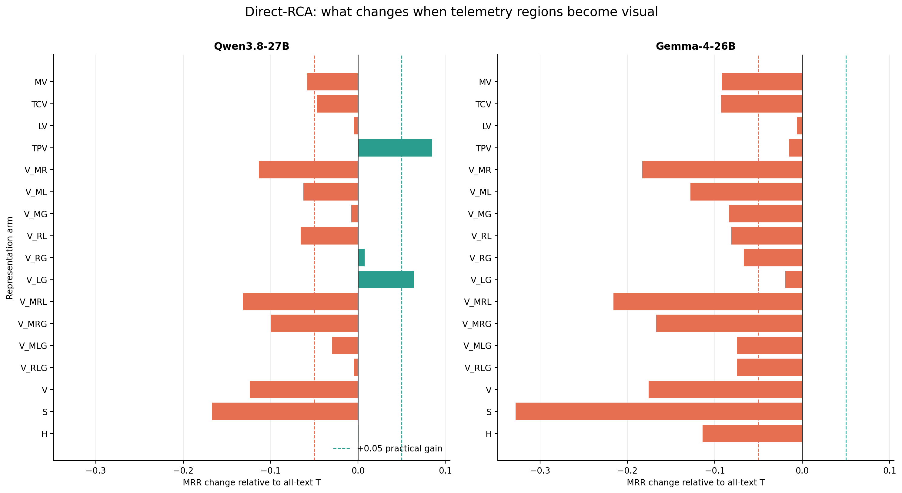
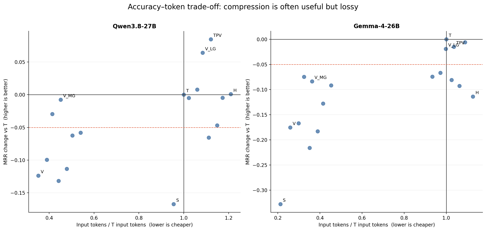
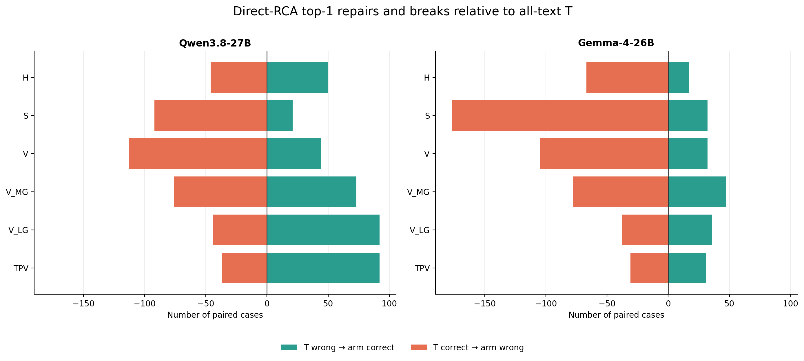
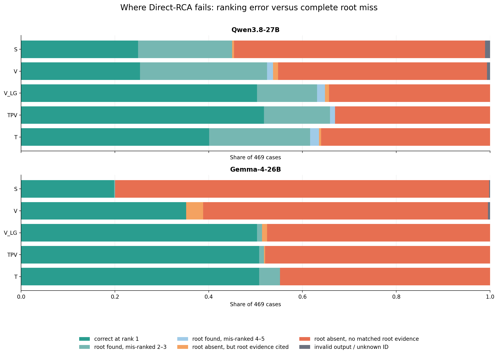
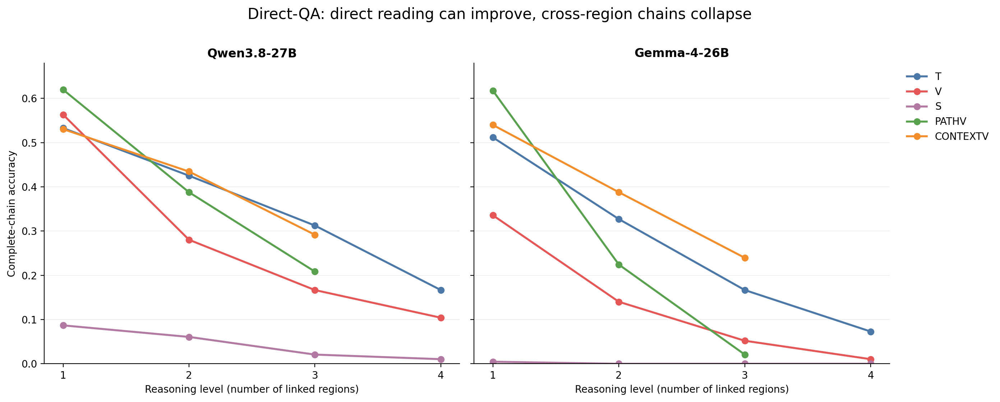
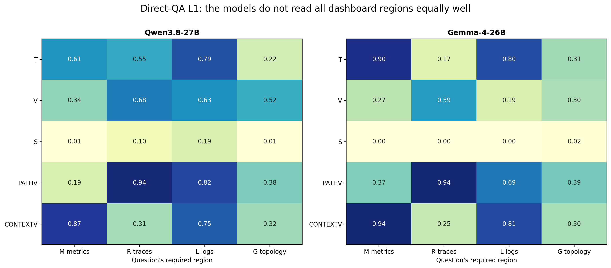
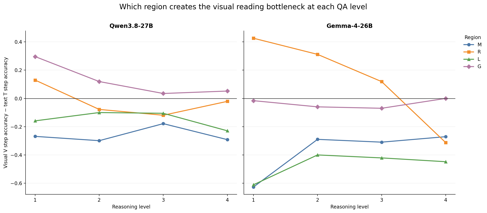
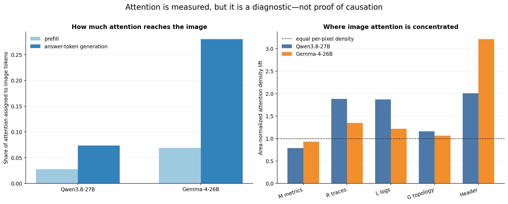
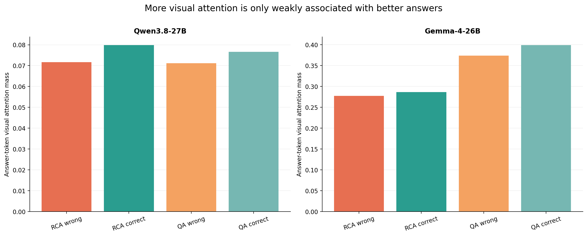
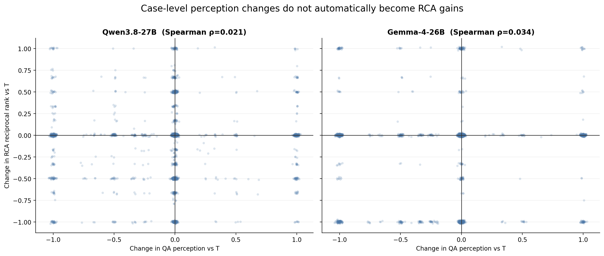

# RQ1.1 Direct-RCA 与 Direct-QA 实验结果

日期：2026-09-01（在 2026-08-29 定稿结果上增加 failure-mode、attention、联合机制与 evidence-field 解释）  
状态：Direct-RCA 全量推理完成；Direct-QA 最终可见性审计、L4 扩展和统一重评分完成。RQ1.1 是探索性研究，本报告不将结果表述为 untouched confirmation。

## 1. 面向非项目成员的结论摘要

RQ1.1 研究的问题是：在一次模型调用、信息内容对等的前提下，把 metrics、traces、logs 和 topology 从文本改成视觉表示，会怎样改变模型的 RCA 准确率、直接读取和跨区域 perception、token 成本以及 attention 分配？

结果并不是“图像整体更好”，而是强烈依赖模型和被视觉化的区域：

1. **Qwen3.8 能从视觉 topology 获益。** 全文本 `T` 的 MRR 为 `0.499`；只将 topology 视觉化的 `TPV` 为 `0.583`，提高 `+0.0847`；将 logs 和 topology 视觉化的 `V_LG` 为 `0.563`，提高 `+0.0640`。这两个差异在本报告采用的全非 T 探索性 Holm family 中仍显著。
2. **完整 dashboard 并没有提高 RCA。** Qwen 的完整视觉 `V` 为 `0.375`，较 T 下降 `−0.1238`；Gemma 的 V 为 `0.352`，较 T 的 `0.527` 下降 `−0.1756`。
3. **Gemma 没有视觉 arm 超过全文本。** `LV=0.521`、`TPV=0.512`、`V_LG=0.508` 最接近 T，但都未形成正向实际增益。
4. **真正的图表优于“把文字截图成图片”，但仍不必然优于文本。** Pixel-text 截图 `S` 的 MRR 为 Qwen `0.331`、Gemma `0.199`，数值上均低于真正 dashboard V，且显著低于 T。这说明视觉条件的差异不只是“把 token 换成像素”。
5. **完整视觉显著节省 input token，但当前属于有损压缩。** 相对 T，V 的平均 input token 在 Qwen 上减少 `64.8%`，Gemma 上减少 `74.1%`；然而 MRR 同时明显下降。Qwen 的 `V_MG` 将 input token 减少约 `54.9%`，总体 MRR 仅下降 `0.0078`，是当前最接近 accuracy-preserving compression 的 arm，但其数据集分层效应不稳定，不能称为普遍 Pareto improvement。
6. **视觉有助于单区域读取，但跨区域组合仍是瓶颈。** Qwen 的 QA 在 L1 上 `V=56.34%`，高于 `T=53.29%`；两模型的 required-region visual `PathV` 在 L1 都约为 `62%`。从 L2 开始，T 通常显著高于 V，且 L4 最弱。
7. **Attention 强度不等于信息利用质量。** 在 Direct-RCA 的完整 V 中，答案 token 分给图像的 attention mass 平均为 Qwen `7.38%`、Gemma `28.03%`。Gemma 对图像 attention 更高，但视觉 RCA 与 QA 更弱，因此不能把 attention 较大直接解释为视觉证据被正确利用。
8. **模型在视觉内部偏向 traces/logs 和标题，而不是面积最大的 metrics。** 经过像素面积归一化后，Qwen V 的生成期 density lift 为 M `0.79`、R `1.88`、L `1.87`、G `1.16`、header `2.01`；Gemma 为 M `0.93`、R `1.35`、L `1.22`、G `1.06`、header `3.21`。标题仍有明显的 per-pixel attention sink，但它不是诊断证据。
9. **Perception 与 RCA 的关系存在但很弱。** 在相同 case、model 和 representation 上，QA aggregate 与 RCA MRR 的 Spearman 相关为 Gemma `0.081`、Qwen `−0.012`。Gemma 在至少答对一道 QA 的 representation 中 AC@1 为 `0.490`，完全未答对时为 `0.391`；Qwen 对应为 `0.387` 和 `0.369`。这表明 perception 是必要机制之一，但现有 QA 只能覆盖 RCA 所需能力的一部分。

## 2. 实验、表示与指标说明

### 2.1 四类 telemetry 区域

#### M — Metrics：系统指标随时间怎样变化

M 区域最多显示 12 条 label-blind 选出的 metric series，例如 CPU、内存、restart count、request latency 或网络指标。每条序列被统一表示为 64 个相对时间 bin；`missing` 表示该 bin 没有可用采样，并不等于数值为 0。模型可以从中判断：

- 指标是上升、下降、尖峰还是长期偏离；
- 最大异常发生在哪里、方向是正还是负；
- 异常只出现一两个 bin，还是连续出现在许多 bin；
- 不同实体的异常大致谁先出现、谁后出现。

每个 panel 还给出 baseline、peak、signed-z 和 `MET-Z`：

- **Baseline** 是用于描述正常状态的前段数据中心值。
- **Peak** 是相对 baseline 偏离最明显的观测值。
- **Signed-z** 是“peak 距 baseline 大约多少个正常波动尺度”，正号表示高于 baseline，负号表示低于 baseline。当前 renderer 默认用 baseline mean/std，并对稀疏或近乎平坦的序列采用 family-level spread floor 和 `±999` clipping；因此它是用于排序和显示的 z-like deviation，不应被当成教科书条件下无限精确的正态 z-score。
- **MET-Z** 是从 SIRCL 选择并适配的 3σ metric analyzer。它使用一个**由公开 telemetry 推断、而非由 injection label 给出**的时间切分，把数据分为 `regular`（切分前）和 `current`（切分后）两段，然后计算：

```text
regular_mean, regular_std_dev
current_mean, current_std_dev
deviation_sigma = |current_mean − regular_mean| / regular_std_dev
```

当 `deviation_sigma > 3` 时，`fluctuating_3sigma=true`，意思是 current mean 相对 regular mean 的变化超过了三个 baseline 标准差。它是异常筛选信号，不等于根因概率：一个下游服务也可能因为真正根因而产生很大的 MET-Z。

这里还需要更正原来的简写：**M 没有直接给模型一个预计算的 `persistence` 标量，也没有把 metric onset 作为 M fact 单独输出。** “持续性”只能从 64-bin 序列中看连续偏离了多久；标签盲推断的 service onset 和传播排序主要显示在 G 区域。因此模型仍需读取曲线，而不是照抄一个已经算好的答案。

#### R — Traces：一次请求经过哪些操作，慢在本地还是慢在下游

Trace 由一组有 parent/child 关系的 spans 构成。RQ1.1 按匿名 entity 和 operation 汇总 baseline window 与 current/fault window 的调用次数及延迟，并使用 `TRC-L` analyzer 排序异常 operation。`TRC-L` 是所选 trace 特征方案的名字；这里的核心是 **exclusive latency + count fold change**，不是把字母 L 当成 logs。

需要区分两种延迟：

- **Inclusive latency（InL）**：一个 span 从开始到结束的总时间，既包括该 operation 自己执行的时间，也包括等待所有 child spans 的时间。
- **Exclusive latency（ExL，也可理解为 local latency）**：从 inclusive latency 中减去 child spans 的持续时间，近似表示这个 operation 自己消耗的时间：

```text
ExL(span) = InL(span) − Σ InL(direct child spans)
```

为什么这个区分对 RCA 有用？假设 `A → B`，A 调用 B：

- 如果 A 的 InL 很高、但 ExL 基本不变，而 B 的 ExL 明显升高，那么 A 很可能只是等待慢掉的 B；B 更像本地异常源。
- 如果 A 自己的 ExL 也明显升高，那么问题可能发生在 A 的本地处理，而不只是下游等待。

TRC-L 对每个 entity/operation 计算 p95：把 95% 的 span 都压在其下、只留下最慢 5% 的延迟阈值。它还计算：

```text
dC = log2((count_current + 1) / (count_baseline + 1))
dX = log2((ExL_p95_current + 1) / (ExL_p95_baseline + 1))
rank_score = max(0, dC) + max(0, dX)
```

`dC=+1` 约等于调用数翻倍，`dC=−1` 约等于减半；`dX` 对 exclusive-latency p95 作同样比较。只把正向增长加进 `rank_score`，是为了突出“调用突然增多”或“本地处理突然变慢”的 operation。没有可比较 baseline 的新 operation 会保留透明的显示信息，但不会靠一个极端 fold change 自动占据异常榜首。

ExL 仍然是近似证据，不是完美的 CPU self-time：异步调用、并行 children、丢 span 和 instrumentation 误差都可能影响它。因此报告把它用于区分 local 与 downstream symptom，而不把最高 TRC-L score 直接当成 root label。

#### L — Logs：把大量重复日志压缩成仍可阅读的事件模式

原始日志通常有大量重复行，例如同一错误模板只改变 request ID、status code 或 latency。RQ1.1 采用 Denum 的“稳定文本骨架与数值变量分离”思想，但**不输出二进制**。它把日志整理为可阅读的 template graph：

- `LT01…`：case-local template ID；
- entity：哪一个匿名 service/pod/node 产生了该日志；
- relative bin：它在相对时间窗口的哪个位置出现；
- level/severity：例如 error、warning 或 unknown；
- count/multiplicity：相同模板在该 entity 和 bin 中出现了多少次；
- normalized template：保留稳定文本，把变化数字变成有类型的变量；
- numeric preview：保留诊断数字的样本数、first、last、distinct 和 most-common 值。

例如许多条 `request timed out after 1200/1250/... ms, status=504` 可以压成一条 template、出现次数和一组 latency/status 数字摘要。这样可以去掉重复文本噪声，同时不把“504”或“timeout after 1200 ms”这类诊断信号丢掉。

`LOG-R` 是与模板图同时提供的 rate analyzer。它比较切分前后的 error-keyword rate 和总 log rate，并标记 new errors、error burst、newly appearing logs 或 volume drop。Dashboard/direct arms 最多显示 8 条经过确定性选择的 log rows：先覆盖 LOG-R 分数较高的 entities，再按 template frequency 补齐。因此 L 是从全部 canonical logs 构建的压缩图的**有限可见投影**，不是把每一条 raw log 原样塞进图片。

#### G — Graph/topology：谁调用谁，以及异常出现的粗略顺序

G 区域包含两类不同但互补的信息：

1. **具体调用边**：`A → B` 的权威含义是 caller A invokes callee B。A 是 B 的上游 caller，B 是 A 的下游 dependency。箭头只表示系统调用关系，不表示已经证明 A 导致 B 或 B 导致 A。
2. **Propagation/onset rows**：按每个 entity 最早可用的异常 onset 排序，并显示 anomaly severity 和来源。`R` 后缀表示 onset 从 trace latency 推断，`M` 表示 trace 不可用时从 metric 推断，`no onset` 表示没有达到可用门槛。

Onset 也是从公开 telemetry 估计出来的：优先把 trace latency 分 bin，寻找相对 baseline 首次稳定越过阈值的位置；trace 未覆盖的 entity 再用其最异常 metric 的首次持续 crossing 补充。它不读取真实 injection timestamp。这个顺序可以帮助模型提出“较早异常的下游 dependency 可能使上游 caller 变慢”的假设，但采样粒度通常不足以证明毫秒级传播，更不能仅凭最早 onset 宣布因果关系。

图中的 propagation bar 从估计 onset 画到 observation window 结束，是为了让 onset 位置容易比较，**不表示已经验证该 entity 在整段时间里持续异常**。显式 caller→callee edge key 才是调用方向的权威来源；曲线位置或空间邻近不能替代 edge key。

所有 service、pod 和 node 均使用每个 case 独立生成的数字 ID。模型看不到原始实体名、root-cause label、fault type、原始 case ID、数据集名或绝对 injection time。预测在 evaluator-private 环境中映射回自然实体名后评分。

### 2.2 RCA 指标

- `MRR`：真实根因排名倒数的平均值；第一名为 1，第二名为 1/2，未进入结果为 0。它是 Direct-RCA 的主要指标。
- `AC@K`：真实根因是否出现在前 K 个预测中。
- `AVG@K`：项目沿用的 top-K 排名质量指标；比单纯命中更重视根因排在列表前部。
- `valid rate`：输出能否解析为合法、已知的 case-local ID。

### 2.3 QA 指标

QA 的 `accuracy` 不是 RCA 的 AC@1 或 MRR：

- `complete-chain accuracy`：全部推理步骤都正确才记 1。
- `step accuracy`：各步骤的平均正确率。
- `correct-prefix accuracy`：从第一步开始连续正确的前缀长度比例。

最终 QA 使用 deterministic visibility-aware scorer。它不调用模型判分：文本 arm 使用其显示的高精度值，视觉 arm 使用画布上真实显示的舍入精度；缺失必需可视字段、被截断 metric name、未显示 `entry_index` 等问题在看模型回答前成组排除。原始轨迹和原始严格分数均保留。

### 2.4 后文会用到的几个白话概念

- **诊断信号（signal）**：能让真实根因往排名前面移动的可见证据。本报告用相对 T 的 reciprocal-rank 提升和 top-1 repair 作为可观察代理，不假设已经看到了模型内部真正的因果机制。
- **噪声（noise）**：让非根因变得更显眼、让真实根因掉名次，或诱发无可见事实支持的关系。本报告用 reciprocal-rank 下降、top-1 break 和 unsupported claim 作为代理。
- **Repair**：T 没把根因排第一，但换一种表示后排第一。**Break** 正好相反：T 原本正确，换表示后错了。
- **根因漏掉（root absent）**：真实根因完全不在返回列表里。**错排（mis-ranking）**：模型找到了根因，但只放在第 2–5 名。
- **Perception bottleneck（感知瓶颈）**：证据就在输入里，但模型没有准确读出数值、实体、边或时间关系。**Composition bottleneck（组合瓶颈）**：单项能读出来，但连续跨 M/R/L/G 查询时不能把前一步结果正确带入下一步。
- **Attention mass**：某部分收到的 attention 总量；面积大的区域天然可能拿到更多。**Density lift**：先按像素面积归一化，再与有效 evidence 区域平均密度比较；`1.0` 是平均水平，`2.0` 表示单位像素 attention 为平均值的两倍。
- **Grounding matcher**：一个保守的确定性程序，用于检查 reason 里出现的实体、边、template、bin 和数值能否在输入事实中找到。它能发现明显的无依据陈述，但漏匹配不等于模型一定没有使用相关证据。

## 3. Direct-RCA

### 3.1 Arms

16 个 factorial arms 中，每个 M/R/L/G 区域只能出现一次：

- `T`：M/R/L/G 全部为自然语言文本。
- `MV`、`TCV`、`LV`、`TPV`：分别只把 M、R、L、G 视觉化。
- `V_MR`、`V_ML`、`V_MG`、`V_RL`、`V_RG`、`V_LG`：两个区域视觉化。
- `V_MRL`、`V_MRG`、`V_MLG`、`V_RLG`：三个区域视觉化。
- `V`：四个区域都位于真实 telemetry dashboard。

两个机制控制不进入 exact-once factorial：

- `S`：把 T 的 incident evidence 按同一字节顺序渲染为 pixel-text screenshot。
- `H`：完整 dashboard A 后接与 T 字节级一致的文本 B，即固定 `A+B`，允许事实重复编码。

每模型运行 `469 cases × 18 arms = 8,442` 条，共 `16,884` 条。两模型均完整，基础设施错误为 0，attention 采集为 `16,884/16,884`。

### 3.2 Performance

#### Qwen3.8-27B

| Arm | MRR | AC@1 | AC@3 | AC@5 | AVG@3 | AVG@5 |
|---|---:|---:|---:|---:|---:|---:|
| T | 0.499 | 0.401 | 0.616 | 0.635 | 0.515 | 0.562 |
| MV | 0.440 | 0.326 | 0.563 | 0.597 | 0.459 | 0.513 |
| TCV | 0.452 | 0.354 | 0.569 | 0.586 | 0.469 | 0.516 |
| LV | 0.494 | 0.401 | 0.601 | 0.627 | 0.507 | 0.555 |
| TPV | **0.583** | **0.518** | **0.659** | **0.670** | **0.596** | **0.625** |
| V_MR | 0.385 | 0.275 | 0.510 | 0.531 | 0.407 | 0.456 |
| V_ML | 0.436 | 0.318 | 0.567 | 0.588 | 0.461 | 0.512 |
| V_MG | 0.491 | 0.394 | 0.601 | 0.610 | 0.514 | 0.552 |
| V_RL | 0.433 | 0.326 | 0.563 | 0.582 | 0.451 | 0.504 |
| V_RG | 0.506 | 0.424 | 0.606 | 0.612 | 0.525 | 0.559 |
| V_LG | **0.563** | **0.503** | 0.631 | 0.648 | 0.571 | 0.601 |
| V_MRL | 0.367 | 0.249 | 0.507 | 0.529 | 0.387 | 0.443 |
| V_MRG | 0.399 | 0.281 | 0.544 | 0.552 | 0.425 | 0.475 |
| V_MLG | 0.469 | 0.358 | 0.599 | 0.618 | 0.490 | 0.541 |
| V_RLG | 0.494 | 0.412 | 0.591 | 0.606 | 0.509 | 0.547 |
| V | 0.375 | 0.254 | 0.525 | 0.537 | 0.399 | 0.454 |
| S | 0.331 | 0.249 | 0.450 | 0.450 | 0.346 | 0.388 |
| H | 0.499 | 0.409 | 0.610 | 0.623 | 0.516 | 0.559 |

#### Gemma-4-26B-A4B-it

| Arm | MRR | AC@1 | AC@3 | AC@5 | AVG@3 | AVG@5 |
|---|---:|---:|---:|---:|---:|---:|
| T | **0.527** | **0.507** | **0.552** | **0.552** | **0.532** | **0.540** |
| MV | 0.436 | 0.426 | 0.448 | 0.448 | 0.438 | 0.442 |
| TCV | 0.435 | 0.418 | 0.454 | 0.458 | 0.437 | 0.446 |
| LV | 0.521 | 0.507 | 0.537 | 0.539 | 0.525 | 0.530 |
| TPV | 0.512 | 0.507 | 0.518 | 0.518 | 0.514 | 0.516 |
| V_MR | 0.344 | 0.337 | 0.356 | 0.356 | 0.345 | 0.350 |
| V_ML | 0.399 | 0.392 | 0.407 | 0.407 | 0.402 | 0.404 |
| V_MG | 0.443 | 0.441 | 0.446 | 0.446 | 0.444 | 0.445 |
| V_RL | 0.446 | 0.431 | 0.465 | 0.473 | 0.447 | 0.457 |
| V_RG | 0.461 | 0.456 | 0.465 | 0.465 | 0.462 | 0.463 |
| V_LG | 0.508 | 0.503 | 0.514 | 0.514 | 0.510 | 0.511 |
| V_MRL | 0.311 | 0.303 | 0.322 | 0.322 | 0.313 | 0.317 |
| V_MRG | 0.360 | 0.360 | 0.360 | 0.360 | 0.360 | 0.360 |
| V_MLG | 0.453 | 0.452 | 0.454 | 0.454 | 0.453 | 0.453 |
| V_RLG | 0.453 | 0.450 | 0.452 | 0.461 | 0.451 | 0.455 |
| V | 0.352 | 0.352 | 0.352 | 0.352 | 0.352 | 0.352 |
| S | 0.199 | 0.198 | 0.200 | 0.200 | 0.200 | 0.200 |
| H | 0.413 | 0.401 | 0.431 | 0.431 | 0.416 | 0.422 |

Gemma 平均只返回 `1.01–1.43` 个候选；Qwen 通常返回约 `3.08–3.28` 个。因此 Gemma 的 AC@3/AC@5 几乎不能在 AC@1 上继续增长。这是模型行为，不是 scorer 把列表截成了一个。

### 3.3 Paired effects 与区域贡献

所有差异都在相同 case 上配对，正值表示优于 T。这里的 arm-wise Holm 值是在每模型 17 个非 T arms 中进行的探索性校正；factorial main effect 则在 M/R/L/G 四个区域中校正。

| Model | Comparison | ΔMRR | Holm p | 结论 |
|---|---|---:|---:|---|
| Qwen | TPV − T | **+0.0847** | 0.00021 | topology visual 有实质且显著增益 |
| Qwen | V_LG − T | **+0.0640** | 0.00798 | logs+topology visual 有实质且显著增益 |
| Qwen | H − T | +0.0007 | 1.000 | 重复图文没有增益 |
| Qwen | V − T | −0.1238 | 2.09e-7 | 完整视觉显著下降 |
| Qwen | S − T | −0.1673 | 4.25e-16 | pixel-text 显著下降 |
| Gemma | LV − T | −0.0059 | 0.868 | 近似持平，无增益 |
| Gemma | TPV − T | −0.0149 | 0.492 | 近似持平，无增益 |
| Gemma | V_LG − T | −0.0192 | 0.492 | 近似持平，无增益 |
| Gemma | V − T | −0.1756 | 1.38e-11 | 完整视觉显著下降 |
| Gemma | S − T | −0.3280 | 2.38e-25 | pixel-text 显著下降 |

Factorial conditional main effects：

| Model | M visual | R visual | L visual | G visual |
|---|---:|---:|---:|---:|
| Qwen | −0.0826 | −0.0706 | −0.0157 | **+0.0467** |
| Gemma | −0.0956 | −0.0798 | −0.0093 | +0.0152 |

Qwen 的 G main effect 经 Holm 校正后 `p=0.00105`；Gemma 的 G effect `p=0.0552`。M 和 R 对两模型均为稳定负效应。G 的 Qwen 平均效应略低于项目预设的 `+0.05` practical threshold，但 TPV 与 V_LG 两个具体 arms 均超过该阈值。

下图把各 arm 相对全文本 T 的变化画在同一坐标上。横轴的 0 表示与 T 一样；向右是提升，向左是下降。最重要的不是“有图片”这一共同点，而是**哪一块证据被改成了图片**。



### 3.4 数据集异质性

下表列关键 arms 的 MRR。RE2-OB/TT 是接近饱和的参考集，不承担 headline claim。

| Model/Arm | AegisLab | AIOPS-2022 | AIOPS-2025 | RE2-OB | RE2-TT |
|---|---:|---:|---:|---:|---:|
| Qwen T | 0.434 | 0.255 | 0.215 | 0.809 | 0.820 |
| Qwen TPV | **0.558** | **0.283** | **0.357** | **0.903** | **0.857** |
| Qwen V_LG | **0.515** | 0.255 | **0.362** | **0.885** | **0.840** |
| Qwen V | 0.404 | 0.202 | 0.214 | 0.588 | 0.489 |
| Gemma T | **0.516** | **0.293** | 0.199 | 0.843 | **0.824** |
| Gemma TPV | 0.472 | 0.230 | 0.215 | **0.878** | 0.811 |
| Gemma V_LG | 0.510 | 0.245 | **0.224** | 0.833 | 0.767 |
| Gemma V | 0.375 | 0.150 | 0.194 | 0.611 | 0.456 |

Qwen TPV 的方向在五个数据集上都为正，但增益主要来自 AegisLab 和 AIOPS-2025。Gemma 的 topology effect 则明显不具备跨数据集稳定性。

### 3.5 Token 成本

| Model | Arm | Avg input | Text | Image | Avg output | 相对 T input |
|---|---|---:|---:|---:|---:|---:|
| Qwen | T | 13,937 | 13,937 | 0 | 165 | — |
| Qwen | TPV | 15,621 | 13,520 | 2,101 | 162 | +12.1% |
| Qwen | V_LG | 15,106 | 13,005 | 2,101 | 172 | +8.4% |
| Qwen | V_MG | 6,291 | 4,190 | 2,101 | 176 | **−54.9%** |
| Qwen | V | 4,902 | 2,801 | 2,101 | 177 | **−64.8%** |
| Qwen | S | 13,312 | 2,110 | 11,202 | 148 | −4.5% |
| Qwen | H | 16,862 | 14,761 | 2,101 | 156 | +21.0% |
| Gemma | T | 15,291 | 15,291 | 0 | 113 | — |
| Gemma | TPV | 15,841 | 14,755 | 1,085 | 111 | +3.6% |
| Gemma | V_LG | 15,260 | 14,175 | 1,085 | 110 | −0.2% |
| Gemma | V_MG | 5,545 | 4,460 | 1,085 | 106 | **−63.7%** |
| Gemma | V | 3,966 | 2,880 | 1,085 | 102 | **−74.1%** |
| Gemma | S | 3,249 | 2,162 | 1,087 | 103 | **−78.7%** |
| Gemma | H | 17,230 | 16,145 | 1,085 | 114 | +12.7% |

TPV/V_LG 的 Qwen accuracy gain 不是 token-saving result；它们使用的总 input token 反而略高于 T。V 是强压缩但有害，H 则增加 token 而不提高 Qwen MRR、并降低 Gemma MRR。

下图同时画出平均 input token 与 MRR。理想位置是“左上角”：token 更少、MRR 更高。V 和 S 很靠左，但也明显向下；Qwen V_MG 最接近“明显省 token、准确率大致保留”，而 Qwen TPV/V_LG 是“准确率更高、但不省 token”。



### 3.6 输出与运行完整性

- 两模型均完成 `8,442/8,442` 记录；run summary 中 infrastructure errors 均为 0。
- Qwen 有 19 条 unknown case-local ID，整体 invalid/parse-failure rate 为 `0.225%`；Gemma 有 6 条，为 `0.071%`。
- 所有 requests 的 `finish_reason=stop`，Direct-RCA 没有 input/output truncation。
- 单 cell 最高 parse failure 为 Qwen S 的 `1.07%`，远低于项目 `5%` whole-experiment tolerance。

### 3.7 提升和下降究竟是怎样发生的

只看平均 MRR 会掩盖一个重要事实：一个 arm 可能同时救回很多 case，又破坏很多原本正确的 case。下图把两者拆开。蓝色 repair 是“全文本没排第一，换表示后排第一”；红色 break 是反方向。



| Model/arm | Repairs | Breaks | 净修复 | RR 提升 / 下降 / 不变 |
|---|---:|---:|---:|---:|
| Qwen TPV | **92** | 37 | **+55** | 123 / 67 / 279 |
| Qwen V_LG | **92** | 44 | **+48** | 120 / 74 / 275 |
| Qwen V_MG | 73 | 76 | −3 | 108 / 114 / 247 |
| Qwen V | 44 | **113** | **−69** | 80 / 167 / 222 |
| Qwen S | 21 | 92 | −71 | 35 / 148 / 286 |
| Gemma TPV | 31 | 31 | 0 | 33 / 46 / 390 |
| Gemma V_LG | 36 | 38 | −2 | 40 / 52 / 377 |
| Gemma V | 32 | **105** | **−73** | 32 / 119 / 318 |
| Gemma S | 32 | **177** | **−145** | 33 / 191 / 245 |

这解释了 Qwen TPV/V_LG 的增益为什么可信：它们不是靠少数 case 大幅跳升，而是 repair 明显多于 break。相反，完整 V 不是“偶尔看错一张图”；它在 469 个 case 中破坏了 113 个原本正确的 Qwen top-1。

下一张图进一步区分“根因找到了但排得靠后”和“根因完全没进列表”。`Root absent, no matched evidence` 是保守 matcher 下的证据遗漏代理，不等于已经证明模型完全没看到根因。



以 Qwen 为例：

- T 有 `188/469` 个 top-1 正确，另有 `101` 个根因位于第 2–3 名，`169` 个 case 根因完全缺席且 reason 中没有匹配到 root evidence。
- TPV 把 top-1 提高到 `243/469`，并把第 2–3 名错排降到 `66`；“根因缺席且无匹配证据”也降至 `155`。因此 topology 图既在帮助模型发现根因，也在帮助它把已经发现的根因往前排。
- V_LG 的 top-1 为 `236/469`，模式与 TPV 接近。
- 完整 V 的 top-1 只有 `119/469`，第 2–3 名错排升到 `127`，而“根因缺席且无匹配证据”升到 `209`。它既削弱了证据读取，也增加了把中间传播节点误当根因的机会。

Gemma 的失败形态不同。它通常只返回一个候选，所以错了以后很少还能在第 2–5 名找到根因：T 的 top-1 为 `238`，完整 V 降为 `165`，V 中有 `285` 个 case 根因完全缺席。Gemma 的主要问题不是“列表内部排序差一点”，而是视觉条件下**候选生成过早收缩**。

### 3.8 什么时候视觉增强了 RCA 信号

当前证据支持三种较具体的帮助机制：

1. **Topology 把分散的调用边压成可扫视的结构。** Qwen TPV 在 1–5、6–10、超过 10 条显示边的 case 中，ΔMRR 分别为 `+0.0590`、`+0.0987`、`+0.0895`。边数达到 6 条以后增益更明显，符合“关系稍复杂时，空间结构比逐行读取 caller→callee 更方便”的解释；但这是描述性分层，边数还可能和数据集、故障类型共同变化。
2. **Topology 帮助分清异常源和传播节点。** TPV 的 `123` 个 RR improvement 中有 `92` 个直接变成 top-1。轨迹中常见的修复是：文本 arm 注意到多个异常服务，却把较晚出现的下游节点放在前面；图形 arm 利用 earliest-onset 和有向连接，把上游候选提到第一。
3. **Logs 与 topology 在 Qwen 上互补。** LV 单独近似 T，TPV 单独增益最大，而 V_LG 仍有 `+0.0640` MRR。可见日志说明“发生了什么”，拓扑说明“异常从哪里传来”，这两类信息一起出现时没有像视觉 metrics/traces 那样抵消 topology 的优势。

这种帮助并不适用于所有 root granularity。Qwen TPV 对 service、pod、pod+service、node 的 ΔMRR 分别为 `+0.0990`、`+0.1294`、`+0.0219`、`−0.0268`；V_LG 对 node 为 `−0.0693`。也就是说，当前图对 service/pod 较友好，却不能稳定表达 node-level 根因。该分层与数据集高度混杂，只能作为后续改图线索。

小样本 fault-type 分层也显示 topology 更常帮助 network delay/loss/corrupt、partition、container kill 和 JVM latency；但多数 cell 只有 5–9 个 case，且比较很多，不能把这些数值写成已确认的 fault-type 规律。

### 3.9 什么时候视觉掩盖信号或增加噪声

1. **精确数值从可复制文本变成密集小图后，读取更难。** M visual 的 conditional main effect 在 Qwen/Gemma 上分别为 `−0.0826/−0.0956`。QA 的区域分解也显示，metrics 从文本变成完整图后，L1 accuracy 大幅下降。这里的主要噪声不是多了一条错误事实，而是正确事实变得更难精确提取。
2. **全视觉把四种难度叠加。** V 同时要求读曲线、trace table、log rows 和有向图。某一个区域读错就可能把一个视觉上显眼但只是传播节点的服务推到前面。Qwen V 比 T 多 `69` 个净 top-1 breaks，Gemma多 `73` 个。
3. **Pixel-text S 把文本接口的优势丢掉，却没有获得图表结构。** 它需要 OCR 式读取长行、顺序和值，但不像真实图表那样利用位置、形状和连线；因此它是两边缺点的叠加，而不是“低成本视觉版 T”。
4. **冗余 A+B 并不会自动融合。** Qwen H 与 T 基本相同，Gemma H 明显下降。模型可能在两份重复证据间重新分配 attention，或过早依赖其中一份；更多输入不等于更多可用信号。
5. **过强视觉关注也可能关注错地方。** 完整 V 中 Gemma 的图像 attention 很高，却出现更多 root omission。后面的 attention 分析显示标题、trace/log 区域能获得很高密度，但 attention 高不保证抽取的实体和值正确，也不保证最终因果排序正确。

### 3.10 配对轨迹中的代表性例子

以下只使用 opaque incident ID，避免暴露 private label；它们用于解释机制，不用于替代总体统计：

- `INC-09BEA9D63577`：Qwen T 把根因放第 2，TPV 提到第 1。TPV 的 reason 明确使用了较早 onset 和 topology 方向，是“结构帮助纠正顺序”的例子。
- `INC-0E6F68EDF409`：Qwen T 完全漏掉根因，V_LG 把可映射到 service root 的 pod 放到第 1；reason 同时引用 restart/log 变化和传播顺序，是视觉 signal 成功传递到 ranking 的例子。
- `INC-058FC5DD18AD`：Qwen T 原本第 1，完整 V 后根因缺席；V 选择了视觉上突出的中间服务，并在 reason 中给出 matcher 找不到的边 `650→887`，是“显著性噪声 + unsupported relation”的例子。
- `INC-0E6F68EDF409` 的 Gemma：T 为第 1，V 却返回错误的单一候选；其 reason 仍描述了看似相关的 pod evidence。这说明即使 perception 读到部分正确证据，最后的候选压缩和因果归因仍可能失败。

## 4. Direct-QA：单区域读取与跨区域组合

### 4.1 Levels 与条件

- `L1`：从 M/R/L/G 中一个区域直接读取事实。
- `L2`：按有序路径连接两个区域，如 M→G。
- `L3`：连续连接三个区域。
- `L4`：连续连接全部四个区域。

表示条件：

- `T`：全部 evidence 为文本。
- `V`：全部 evidence 为真实 dashboard。
- `S`：T evidence 的 pixel-text screenshot。
- `PathV`：问题真正需要的区域为 visual，其他区域为 text。
- `ContextV`：问题需要的区域为 text，只有无关上下文为 visual。

L4 时 PathV 等于 V、ContextV 等于 T，因此只运行 T/V/S。

最终 denominator：L1 `426 questions/426 cases`，L2 `214 questions/191 cases`，L3 `96 questions/85 cases`，L4 `96 questions/96 cases`。一个 case 有多道题时先在 case 内 macro-average，case 才是统计单位。

### 4.2 Complete-chain accuracy

#### Qwen3.8-27B

| Level | T | V | S | PathV | ContextV |
|---|---:|---:|---:|---:|---:|
| L1 | 0.533 | 0.563 | 0.087 | **0.620** | 0.531 |
| L2 | 0.429 | 0.270 | 0.060 | 0.385 | **0.435** |
| L3 | **0.318** | 0.165 | 0.024 | 0.224 | 0.294 |
| L4 | **0.167** | 0.104 | 0.010 | — | — |

#### Gemma-4-26B-A4B-it

| Level | T | V | S | PathV | ContextV |
|---|---:|---:|---:|---:|---:|
| L1 | 0.512 | 0.336 | 0.005 | **0.617** | 0.540 |
| L2 | 0.330 | 0.147 | 0.000 | 0.228 | **0.380** |
| L3 | 0.182 | 0.059 | 0.000 | 0.018 | **0.259** |
| L4 | **0.073** | 0.010 | 0.000 | — | — |

主要 interpretation：

- Qwen 的 V 在 L1 比 T 高 `+0.0305`，两模型 PathV 的 L1 都达到约 `0.62`。图像能够帮助部分直接读取。
- 从 L2 开始，完整 V 明显弱于 T；任务越长，complete-chain 越容易因一个步骤失败而归零。
- ContextV 在多数格子中接近或高于 T，尤其 Gemma L2 为 `+0.0497`、L3 为 `+0.0765`。这说明“prompt 中存在图片”本身不是主要伤害来源；问题更集中在**必须从视觉区域抽取并组合所需证据**。
- S 在所有 levels 都非常差。真正 dashboard 虽然不如 T，但明显优于把相同文本直接截图。



### 4.3 Step 与 prefix

| Model | Level | T step / prefix | V step / prefix |
|---|---|---:|---:|
| Qwen | L1 | 0.533 / 0.533 | 0.563 / 0.563 |
| Qwen | L2 | 0.592 / 0.524 | 0.503 / 0.408 |
| Qwen | L3 | 0.578 / 0.473 | 0.500 / 0.373 |
| Qwen | L4 | 0.576 / 0.359 | 0.453 / 0.318 |
| Gemma | L1 | 0.512 / 0.512 | 0.336 / 0.336 |
| Gemma | L2 | 0.470 / 0.403 | 0.342 / 0.274 |
| Gemma | L3 | 0.510 / 0.327 | 0.298 / 0.186 |
| Gemma | L4 | 0.521 / 0.354 | 0.263 / 0.148 |

即便 L4 complete-chain 很低，step accuracy 仍有 Qwen T `57.6%`、V `45.3%` 和 Gemma T `52.1%`、V `26.3%`。这说明模型不是完全看不懂，而是错误在多步链中累积。

### 4.4 QA token trade-off

完整 V 相对 T 的 input token 减少约：

- Qwen：L1 `67.7%`、L2 `70.1%`、L3 `71.1%`、L4 `71.3%`。
- Gemma：L1 `77.1%`、L2 `79.3%`、L3 `80.2%`、L4 `80.3%`。

但 L2–L4 的 complete-chain accuracy 同时下降，因此 V 是有损压缩。更有希望的是 selective representation：Qwen L2 ContextV 在减少约 `24.5%` input token 时与 T 基本相同；Gemma L2 ContextV 减少约 `33.3%` token，同时 accuracy 提高 `+0.0497`。这些结果支持“视觉化不需要精确读取的上下文”作为后续方向。

### 4.5 QA 输出完整性与 caveat

- 最终统一 corpus 每模型有 3,968 条结果。
- Qwen 有 10 条 invalid/parse failure、0 truncation；Gemma 有 9 条 invalid/parse failure、4 truncations。
- 唯一越过 5% cell threshold 的是 Qwen L4-V：`7/96=7.29%` strict output/region-order parse failures。因此该 cell 的结果只能作为探索性描述，不能单独承担正式正向结论。
- QA 是经过 response-blind visibility eligibility 和 deterministic post-hoc semantic rescoring 的条件准确率；它不应被表述为未经筛选的 469-case unconditional perception accuracy。

### 4.6 Perception 失败不是一个单一问题

L1 可以把“模型看不懂图”拆成更具体的区域能力。下图中的每一格都是该区域的直接读取 accuracy。



最清楚的四个模式是：

1. **Trace visual 是最成功的直接读取表示。** Qwen 的 R 从 T `0.546` 提高到 V `0.676`，PathV 达到 `0.935`；Gemma 从 `0.167` 提高到 `0.593`，PathV 达到 `0.944`。表格中的行对齐和突出字段，确实比长文本序列更容易定位。
2. **Metric visual 对精确读取最不友好。** Qwen 的 M 从 T `0.612` 降到 V `0.343`，PathV 只有 `0.194`；Gemma从 `0.896` 降到 `0.269`。曲线能表达趋势，但 exact QA 要求读出具体数值、bin 或 metric，图上舍入、刻度和密集 panel 都会增加提取误差。
3. **Logs 的自然语言文本仍然很强。** Qwen L 的 T 为 `0.786`，V 为 `0.627`；Gemma为 `0.802` 对 `0.190`。Denum-readable text 保留 template 和数字，模型可以直接匹配，而视觉 log rows 仍需要定位和 OCR 式读取。
4. **Topology 的收益具有模型差异。** Qwen G 从 T `0.224` 提高到 V `0.520`；Gemma从 `0.312` 轻降到 `0.296`。这与 Qwen 在 RCA 的 TPV 增益一致，也解释了为什么该结论不能推广到所有 VLM。

但 L1 的 trace 优势没有完整传到高 level。下一张图显示同一个区域作为链中一步时，V 相对 T 的 step-accuracy 变化。正值表示视觉更容易，负值表示更难。



- Qwen 的 R 在 L1 为正，但到了 L2/L3 轻度转负，L4 接近零；Gemma 的 R 在 L1–L3 仍为正，到 L4 也转负。
- M 和 L 在两模型的大多数 level 都持续为负。
- Qwen G 在 L1 最明显为正，高 level 仍有小幅优势；Gemma G 接近持平或略负。

这正是 composition bottleneck：模型可以直接从 trace 表读一行，但当题目要求“先从 metrics 找实体，再到 trace 找 edge，最后去 topology 找另一端”时，必须正确保存中间 ID、切换区域并遵循方向；每一步小错误都会传下去。

### 4.7 视觉是修复问题，还是制造新问题

相对 T 的 complete-chain repair/break 进一步说明，选择性视觉比全视觉更稳：

| Model/level | V repair / break | PathV repair / break | ContextV repair / break |
|---|---:|---:|---:|
| Qwen L1 | 101 / 88 | **95 / 58** | 30 / 31 |
| Qwen L2 | 26 / 57 | 36 / 44 | **16 / 14** |
| Qwen L3 | 4 / 18 | 8 / 18 | **5 / 7** |
| Gemma L1 | 71 / 146 | **125 / 80** | **41 / 29** |
| Gemma L2 | 15 / 55 | 23 / 45 | **21 / 8** |
| Gemma L3 | 4 / 15 | 2 / 16 | **10 / 3** |

L1 PathV 常能把所需区域变成更合适的视觉表示；高 level 时，PathV 需要从多个视觉区精确抽取，break 又开始超过 repair。ContextV 恰好相反：**所需证据继续以文本提供，只把不需要精确回答的上下文压进图里**，因此高 level 更稳定。这也是当前最具体的 token-saving 机制：视觉不一定负责回答，而是负责把背景信息压缩成较短、仍可参考的上下文。

### 4.8 视觉 perception 的主要失败模式

综合 answer、step、prefix 和轨迹，失败可分为：

- **Exact-value extraction**：找对 panel/实体，却抄错舍入数值、符号或 bin。最常见于 M。
- **Set incompleteness**：topology 题找到一个 upstream/downstream，却漏掉同层其他邻居。exact-match 因此判整步错误。
- **Direction reversal**：把 caller→callee 当成 callee→caller，或把 upstream/downstream 对调。
- **Cross-region identity loss**：前一步读出的数字 ID 在切换到下一区域时被替换、抄错或对应到另一个 entity。
- **Error propagation**：第一步错后，后续步骤即使按错误 anchor 正确查询，complete chain 仍为零。
- **Pixel-text OCR burden**：S 中长行、标点、数字 ID 和模板被当作像素读；它既缺少文本 token 的直接可访问性，也缺少曲线和边的视觉结构。

“第一处错误”经常出现在 G，但不能简单解释为 topology 最难：G 在路径中出现频繁，而且完整邻居集合和方向的评分要求更严格。更可靠的判断是上面的 region-conditioned step accuracy。

## 5. Attention 分析

### 5.1 记录方法和限制

每次原始调用均在同一 forward/generation 中记录两种 attention，没有增加模型调用：

- `prefill`：最后一个 prompt query 对此前 prompt keys 的 attention。
- `generation-target`：结构化答案中的 service-ID 或 QA answer-value tokens 对此前 prompt keys 的 attention。

记录的是第一个注册的 full-attention layer、跨 head 平均的相关性诊断，不是全部层的完整机制，也不是隐藏 chain-of-thought。Attention 不能单独证明一个证据导致了预测。

视觉区域使用 processor 的真实 token geometry。每个视觉 token 的 attention 先按其 patch 覆盖像素面积分配，再与 M/R/L/G/header 的精确像素边界求交。`density lift=1` 表示该区域每像素 attention 等于实际 evidence 区域的平均值；大于 1 表示在控制面积后更密集。这样不会因为 M 区域面积大就机械地获得更多 attention。

### 5.2 Direct-RCA 的完整 dashboard V

| Model | Prefill visual mass | Answer-token visual mass | M density | R density | L density | G density | Header density |
|---|---:|---:|---:|---:|---:|---:|---:|
| Qwen | 0.0278 | 0.0738 | 0.79 | **1.88** | **1.87** | 1.16 | **2.01** |
| Gemma | 0.0690 | 0.2803 | 0.93 | **1.35** | **1.22** | 1.06 | **3.21** |



发现：

- 两模型在生成最终 ID 时都比 prefill 更依赖图像，尤其 Gemma。
- 控制面积后，metrics 的 attention density 最低；traces/logs 高于平均，topology 略高于平均。
- Header 在两模型中都是最高或接近最高的非空区域。它很可能混合了首 patch、位置、全局摘要和标题识别效应，不能当作诊断 evidence use。
- Gemma 给图像的 attention mass 是 Qwen 的约 3.8 倍，但完整 V 的 RCA/QA 更差。因此“attention 更多”与“视觉理解更好”不是同一件事。

在 V arm 中，answer-token visual mass 与 MRR 的 Spearman 相关为 Qwen `0.359`、Gemma `0.112`。Gemma 的 trace density 与 MRR 相关为 `0.290`，其余区域接近零或为负；Qwen 的 M density 为 `0.147`，R/L density 反而轻度负相关。这些均为探索性相关，不能视为因果 mediation。

把 V 分成 top-1 正确和错误后，可以看到“关注质量”比总量更重要：

| Model | Outcome | Visual mass | M density | R density | L density | G density | Header density |
|---|---|---:|---:|---:|---:|---:|---:|
| Qwen | top-1 correct | 0.0798 | 0.80 | 1.83 | 1.77 | 1.16 | 2.11 |
| Qwen | top-1 wrong | 0.0717 | 0.79 | 1.90 | 1.90 | 1.16 | 1.98 |
| Gemma | top-1 correct | 0.2863 | 0.92 | **1.75** | 1.18 | 1.01 | 2.94 |
| Gemma | top-1 wrong | 0.2771 | 0.94 | 1.13 | 1.24 | 1.09 | **3.36** |



Qwen 正确 case 的 visual mass 只比错误 case 高约 `0.8` 个百分点，而且错误 case 对 R/L 的密度反而略高；这说明热点可能落在明显但非根因的异常上。Gemma 正确 case 的 R density 明显更高，而错误 case 的 header density 更高，提示“把 attention 分给真正的 trace evidence”可能比“总共分给图片多少”更有解释力。不过这些是条件均值，不能排除 case 难度等混杂因素。

### 5.3 Text attention

T arm 在生成 service ID 时，按 text token 数归一化后的 M/R/L/G focus：

| Model | M | R | L | G |
|---|---:|---:|---:|---:|
| Qwen | 0.37 | 1.10 | **1.64** | 0.98 |
| Gemma | 0.56 | **1.24** | 0.67 | 0.99 |

Qwen 的文本选择更偏向 logs 和 traces；Gemma 更偏向 traces。M 虽然占据最多 token 和 raw mass，但单位 token focus 较低，与视觉中 M 的 per-pixel density 较低相呼应。

### 5.4 QA attention

完整 V 的 answer-token visual mass 随 level 的范围：

- Qwen：`6.2%–8.0%`。
- Gemma：`35.8%–38.2%`。

在 L1–L4 的完整 V 中，面积归一化后两模型总体仍更关注 R/L，而不是 M。Gemma 始终给图像更高 attention，却没有得到更好的 complete-chain accuracy。QA 再次表明主要问题不是模型完全忽略图片，而是视觉读取精度和跨区域 composition 不足。

按 QA 是否整条回答正确再分组：

- Qwen V 的 visual mass 为正确 `0.0766`、错误 `0.0712`；required-region density 为 `1.53` 对 `1.39`，irrelevant-region density 为 `1.30` 对 `1.38`。
- Gemma V 的 visual mass 为正确 `0.3989`、错误 `0.3737`；required-region density 为 `2.11` 对 `1.78`。

这两个 full-V 对比方向合理：正确时对所需区域更集中。但在 PathV 中方向反过来：Qwen 的 required density 为正确 `1.12`、错误 `1.21`；Gemma为 `1.04` 对 `1.12`。最合理的白话解释是：**模型在难题上可能更用力地看，却仍然没看懂**。因此 attention density 不是 confidence，也不能拿一个阈值直接判断对错。

### 5.5 标题热点与 attention sink

Header density 为 Qwen `2.01`、Gemma `3.21`，但标题只包含 dashboard 类型、匿名 incident 和时间窗口，不含根因。这个热点至少可能混合三种效应：

1. 视觉序列开头或首 patch 的位置偏好；
2. 标题的高对比、大字号和全局布局锚点；
3. 模型先识别“这是一张什么图”，再读取细节的正常过程。

当前数据不能把三者分开，所以报告将 header 称为 **attention sink 候选**，而不是已证明的无效计算。它确实提醒我们：热图左上角很红不能解释为模型在利用诊断信息。后续若要确认，需要做保持内容不变的标题位置交换、空白标题或等面积 sham；本轮没有据此重跑。

### 5.6 Attention 能说什么、不能说什么

本报告把 attention 当成“模型在该层、该 query 下把计算权重分到哪里”的诊断量。它适合回答：图像有没有被访问、所需区域是否比无关区域更密集、正确与错误 case 的分布是否不同。它不能单独回答：某个 patch 是否导致了最终预测、模型是否真正理解了该 patch、删掉该 patch 后答案是否会变化。

这个限制与既有研究一致：[Attention is not Explanation](https://aclanthology.org/N19-1357/) 发现 attention 与其他重要性度量可能不相关，替代 attention 分布也可能给出相同预测；[Attention is not *not* Explanation](https://aclanthology.org/D19-1002/) 则指出 attention 是否有解释价值取决于具体问题和验证方法。因此这里采用折中做法：保留 attention 作为相关性诊断，但把配对 arm intervention、repair/break 和准确率放在结论的更高层级。

## 6. Perception 与 RCA 的联合解释

将 QA 和 RCA 按相同 `case × model × representation` 对齐后：

| Model | 对齐 case-representations | Spearman(QA aggregate, MRR) | RCA AC@1：至少一道 QA 对 | RCA AC@1：QA 全错 |
|---|---:|---:|---:|---:|
| Qwen | 2,709 | −0.012 | 0.387 | 0.369 |
| Gemma | 2,709 | 0.081 | 0.490 | 0.391 |

如果只看“某种表示相对 T 让 QA 变化多少、RCA reciprocal rank 又变化多少”，change-score Spearman 仍然接近零：Qwen `0.021`、Gemma `0.034`。



去掉 perception 或 RCA 不变的配对，只看两者都发生变化的 case-representation：

| Model | Perception↑ / RCA↑ | Perception↑ / RCA↓ | Perception↓ / RCA↑ | Perception↓ / RCA↓ |
|---|---:|---:|---:|---:|
| Qwen | 48 | 86 | 78 | 164 |
| Gemma | 21 | 52 | 52 | 172 |

最理想的左上象限（两者都改善）确实存在，但不是多数。两个值得特别解释的“矛盾象限”是：

- **Perception↑ / RCA↓**：模型更准确地回答了抽中的事实题，却把它用于了错误的因果判断，或 QA 没覆盖真正关键证据。例如能正确读出下游 latency spike，不代表它能判断该 spike 是根因还是传播结果。
- **Perception↓ / RCA↑**：模型可能利用了 QA 没问到的全局结构、强先验或另一条证据；也可能只是排名偶然修复。因此这个象限不能直接证明视觉 reasoning 成功。

关系很弱，尤其 Qwen 几乎为零。可能原因包括：

1. QA 只抽取少量确定性事实，不能覆盖 RCA 所需的异常筛选、证据权衡和候选排序。
2. RCA 可以依赖一个未被该 case 的 QA 抽中的强信号，因此 QA 错而 RCA 对。
3. 模型可以准确读取事实但错误地解释其因果方向，因此 QA 对而 RCA 错。
4. Qwen 的 topology visual 增益可能更多来自空间关系和整体结构，而不是当前 QA exact-chain 所覆盖的局部读取能力。

因此，当前结果支持“perception 是 RCA 的一个环节”，但不支持“提高现有 QA 分数就必然提高 RCA”的强结论。

### 6.1 专门筛出的 root-connected topology 问题

为了避免“普通 QA 没问到根因传播关系”这一解释，我们又做了一次不调用
模型的 post-hoc 分析：只保留包含 topology 步骤、且题目所引用的可见
`caller → callee` 边至少有一端属于可接受 root service family 的问题。
这里必须称为 **root-connected call-graph proxy**，不能称为已验证的真实
故障传播链，因为数据只有根因标签和图上调用边，没有逐 case 的真实因果
传播路径标注。

三个 headline 数据集上的结果仍然没有稳定正相关：

| Model | Cases | Spearman(QA, RCA RR) | p | Spearman(ΔQA, ΔRR) | p |
|---|---:|---:|---:|---:|---:|
| Qwen3.8 | 54 | −0.154 | 0.266 | +0.152 | 0.272 |
| Gemma | 54 | +0.136 | 0.328 | −0.088 | 0.528 |

同一个 case 内比较“QA 答对的表示”和“QA 答错的表示”，Qwen 的平均
`RR(correct−wrong)` 为 `−0.031`（`n=31`, Pratt-Wilcoxon `p=0.460`），
Gemma 为 `+0.003`（`n=24`, `p=0.871`）。更严格的 L2–L4 跨区域子集在
headline 数据上只有 17 个 case，统计功效很低，两个模型方向也不一致。

因此能成立的结论不是“传播链 perception 与 RCA 永远无关”，而是：
**当前可用的、与 root family 相连的调用图 QA 正确率，与 one-stage RCA
performance 没有表现出可复现的稳定正关系，不能用作 RCA 的替代指标。**
完整审计结果在 `tmp/rq1_1_root_chain_analysis/report.md`。

更精确地说，当前链路至少有三个相互独立的瓶颈：

```text
可见事实 → 准确读出实体/值/边 → 选择诊断相关证据 → 区分根因与传播并排序
             perception             evidence selection         causal ranking
```

Direct-QA 主要测第一段和部分跨区组合；Direct-RCA 还需要后两段。Gemma `INC-0E6F68EDF409` 的 V 轨迹就是例子：reason 中出现了相关 evidence，但最后只输出一个错误候选。因此“perception 能力”不应被当成 RCA 的替代指标，而应当作为定位失败发生在哪一段的诊断工具。

## 7. 与已有研究的关系

以下文献用于解释可能机制，不用于替代 CanvasRCA 自己的配对结果：

- [On the Perception Bottleneck of VLMs for Chart Understanding](https://aclanthology.org/2025.findings-emnlp.573/) 把 chart failure 拆成视觉编码与信息抽取瓶颈。我们的 M exact-value 下降、R direct-read 提升，说明“图表”不是单一模态：不同编码可以产生相反的 extraction difficulty。
- [VLM²-Bench](https://aclanthology.org/2025.acl-long.372/) 强调在视觉中连接匹配线索本身就是独立难题。这与 L1 尚可、L2–L4 complete chain 快速下降一致；这里的对应关系是解释性类比，不是对其 benchmark 结论的复现。
- [Visual Graph Understanding](https://aclanthology.org/2025.acl-long.1482/) 显示 VLM 对复杂关系图仍有明显弱点。CanvasRCA 同时看到 Qwen topology visual 的 RCA 增益和 QA 中邻居集合/方向错误，说明“整体结构有用”与“每条边都能精确读对”可以同时成立。
- [Words or Vision](https://openaccess.thecvf.com/content/CVPR2025/html/Deng_Words_or_Vision_Do_Vision-Language_Models_Have_Blind_Faith_in_CVPR_2025_paper.html) 发现 VLM 的文本偏好会受内容相关性和顺序影响。我们的 H 无增益、ContextV 常优于 PathV，与“简单增加视觉输入并不会自动融合”方向一致。
- [DashboardQA](https://aclanthology.org/2026.findings-eacl.177/) 和 [ChartMuseum](https://papers.nips.cc/paper_files/paper/2025/hash/ca20efa9cf3703186d91424cf4876f8b-Abstract-Datasets_and_Benchmarks_Track.html) 都把多区域 dashboard/chart 的 grounding 与视觉复杂度视为重要挑战。RQ1.1 的跨区域 composition gap 提供了 RCA 场景中的对应证据。

## 8. 最终 findings

1. **“Vision 是否有用”不是一个整体 yes/no 问题。** 同一模型、同一 case 和同一批事实，仅改变哪个区域视觉化，就可以从 Qwen TPV 的 `+0.0847` MRR 变成完整 V 的 `−0.1238`。表示设计本身就是实验变量。
2. **Topology 是当前最可靠的视觉增强信号，但结论只在 Qwen 上成立。** TPV 有 92 repairs、37 breaks，说明它主要在纠正异常传播顺序和根因/下游混淆；Gemma没有复现，不能写成通用 VLM 规律。
3. **Logs+topology 是 Qwen 的有效组合。** 日志提供事件语义，拓扑提供关系和方向；V_LG 的 92 repairs/44 breaks 表明两者的组合没有被其他视觉区域的精确读取负担抵消。
4. **Metrics visual 当前主要掩盖精确信号。** 曲线保留了趋势，却让 bin、数值和 metric identity 更难精确抽取。它在 QA 和 RCA 的 region effect 中都为负，因此不是一个只发生在 scorer 上的假象。
5. **Trace visual 对直接读取有帮助，但对最终 RCA 不稳定。** L1 R accuracy 大幅改善，而 TCV 的 RCA MRR 下降；这说明“读到 latency/error”与“把它解释成根因而非传播”是两种能力。
6. **完整 dashboard 的主要问题是错误累积和显著性竞争。** 四个区域同时视觉化后，模型需要在多个热点间选择。Qwen V 同时增加错排和 root omission；Gemma则更常过早压缩成一个错误候选。
7. **视觉最明确的效率价值是压缩上下文，而非自动提高准确率。** V 可减少约 65%–74% input token，但当前损失过大；ContextV 显示更可行的方向是：关键事实保留文本，把不要求精确回答的背景视觉化。
8. **S 证明 token 变少不是视觉推理成功的充分条件。** 把同样文本截成图片会丢掉文本 token 的直接访问性，又没有图表结构，因此 S 的低成本伴随最严重的 perception/RCA 损失。
9. **Perception 是必要环节，但不是 RCA 的充分条件。** QA 与 RCA 的 case-level/change-score 相关都很弱；模型还必须选择相关 evidence、区分 root 与 propagation、生成完整候选列表。
10. **Attention 说明模型确实访问了视觉输入，却不能说明它理解正确。** Gemma visual mass 更高但 performance 更低；错误 case 也可能对某区域 attention 更密集。Attention 必须和配对准确率、repair/break、grounding 一起读。
11. **标题热点应被隔离报告，而不是解释成诊断 reasoning。** Header 单位像素 attention 很高，但没有 root evidence；它是位置/布局/全局识别效应的混合候选。
12. **下一轮设计的优先级已经很明确。** 保留 topology 的空间结构；提高 M 的数值/刻度可读性；保留 R 的行对齐优势但强化 root-vs-propagation 指引；减少 header 显著性；优先研究 selective representation，而不是继续堆叠完整 dashboard 或重复 A+B。

## 9. 限制

- RQ1.1 是 exploratory、repeated-exposed evaluation，不是 untouched heldout confirmation。
- 两个模型的 tokenizer 和视觉 processor 不同；绝对 token 数不能直接用来比较模型优劣，只比较各自相对 T 的变化。
- QA 使用 post-hoc visibility-aware deterministic scorer；虽然没有读取模型响应来决定 eligibility，但绝对数仍应同时报告 denominator 和 scorer version。
- Qwen L4-V 未通过 95% parse gate，不能承担正式正向结论。
- Attention 只来自一个注册层且是相关性测量；它不等于梯度 attribution、causal intervention 或隐藏 reasoning trace。Correct/wrong attention 对比还可能被 case 难度混杂。
- Grounding matcher 是保守规则系统；`root absent, no matched evidence` 是可复算的 failure proxy，不是对模型内部证据使用的完整观察。
- Fault type、root granularity 和 topology-edge 分层属于探索性分析，部分 cell 很小且变量相互混杂，不承担显著性结论。
- RE2-OB/TT 接近饱和，不支撑 headline generalization。

## 10. 权威 artifacts

- Direct-RCA trajectories：`RQs/RQ1_1/results/rq1_1_v8_single_stage_formal_469_20260827/trajectories/direct_rca/`
- Direct-RCA run summaries：`RQs/RQ1_1/results/rq1_1_v8_single_stage_formal_469_20260827/run_direct_rca_*.json`
- Attention artifacts：`RQs/RQ1_1/results/rq1_1_v8_single_stage_formal_469_20260827/attention/`
- Final QA rescore：`RQs/RQ1_1/results/rq1_1_direct_qa_final_rescore_20260829/unified_l1_l4_visibility_aware_v1/`
- 本报告的可复算分析脚本：`tmp/rq1_1_findings_analysis/analyze.py`
- 本报告的深度 failure/attention/联合分析脚本：`tmp/rq1_1_findings_analysis/deep_analysis.py`
- 本报告的全部汇总表：`tmp/rq1_1_findings_analysis/outputs/`
- 本报告图表：`docs/RQ1_1_findings_assets/`

Direct-RCA 两模型使用相同 run-contract SHA256：

```text
90225239851410fc6af32d037642bf22c78f557b546e464d5d43498cbe9d9a50
```

当前 unified QA `summary.json` SHA256：

```text
44739c5f3b8c015fcc149cb965131b1151b44d75521f70a24cf430f4ebce8bb6
```
