# RQ1 formal result report

Generated: 2026-08-26  
Scope: all locally available formal RQ1 result sets for Qwen3.6-27B, Gemma-4-26B-A4B-it, and Qwen3.8-27B. Preliminary smoke tests, qualification gates, pilots, and results from the superseded inference-v1 runtime are excluded.

## Reader's guide (no project background assumed)

CanvasRCA studies whether a vision-language model (VLM) can diagnose a microservice incident more accurately when the same telemetry is presented as a real dashboard instead of, or in addition to, text. A **case** is one incident. Its telemetry contains metrics (numeric time series), traces (request-flow and latency records), logs (event messages), and a directed service-call topology. **Root-cause analysis (RCA)** asks the model to rank up to five candidate entities from most to least likely to have originated the incident.

The report covers two different endpoints:

- **Question answering (QA)** asks narrowly scoreable questions about visible telemetry, such as reading one displayed value or linking a metric observation to a topology neighbor. It measures perception and cross-region reasoning; it is not an RCA score.
- **RCA** asks for the ranked root-cause list. Its main score is mean reciprocal rank (MRR), explained in Section 3.6.

An **experimental arm** is one controlled way of presenting an otherwise matched case to the model. For example, `T` presents incident evidence as natural-language text, while `V` presents it as a real rendered dashboard. One **case-arm record** is the saved outcome for one incident under one such condition. The compact arm codes are fully expanded in Section 3.2; they are labels for input representations, not model names or performance metrics.

All ordinary representation comparisons preserve the same model-visible atomic incident facts: the same candidates, displayed values and precision, time bins, missing-value markers, concrete caller-to-callee edges, and legends. What changes is how those facts are represented. `H` intentionally repeats the same facts in both image and text, while the counterfactual experiment intentionally manipulates only the image to test causality. **Label-blind** construction means the code selecting, rendering, or manipulating evidence cannot read the evaluator's ground-truth root cause. **Frozen** or **preregistered** means a roster, rule, or threshold was fixed before inspecting the corresponding result. A positive difference written as `A-B` means arm A scored higher than arm B.

The **headline set** contains 289 cases from AegisLab, AIOPS-2022, and AIOPS-2025. RE2-OB is reported separately because text baselines nearly saturate it, and RE2-TT is a separate out-of-distribution (OOD) slice, meaning its conditions differ from the primary evaluation distribution. Results described as *Qwen3.8-specific* were reproduced for that model but not for both Qwen and Gemma architectures.

## 1. Executive summary

This audit consolidates **85,827 formal case-arm records** over 469 frozen evaluation cases (96 AegisLab, 100 AIOPS-2022, 93 AIOPS-2025, 90 RE2-OB, 90 RE2-TT). The inferential headline set is the 289 non-saturated AegisLab/AIOPS cases; RE2-OB is a saturated pipeline reference and RE2-TT is OOD.

The strongest positive RCA result is narrow but real: in two-stage `matched_rca`, Qwen3.8's routed visual-text arm `R` (metric charts and topology as images; logs and traces as text) reaches headline MRR **0.3807**, versus **0.3192** for natural-language text `T` and **0.3182** for flat structured JSONL `F`. The paired gains are `R-T=+0.0615` (Holm `p=0.0056`, `dz=0.173`) and `R-F=+0.0625` (Holm `p=0.0056`, `dz=0.162`). It clears the registered `+0.05` effect threshold, and no headline dataset has an effect at or below `-0.05`. This is therefore a **Qwen3.8-specific routed visual-text result**, not a cross-architecture result: Gemma has `R-T=-0.0307`, while Qwen3.6 has `+0.0113` on an incomplete 414-case run.

The broader evidence is mixed. The real-dashboard-only arm `V` and redundant image-plus-identical-text hybrid `H` usually do not beat text on RCA; pixel-text `P` (the text evidence rendered into an image without charts) is generally weakest. Cross-region QA does contain a second, task-specific positive result: one-stage Gemma passes both registered depth hypotheses on jointly scoreable Level-2/3 cases (`H-T=+0.1087`) and the Level-3-versus-Level-1 interaction (`+0.1667`), both statistically significant after Holm correction for multiple comparisons. Its factorial visual main effects nevertheless stay below the registered +0.10 region threshold, and the pattern does not transfer to the Qwen models. The causal counterfactual RCA experiment changes rankings but does not produce a statistically reliable causal visual benefit.

Attention is genuinely present and nearly complete: all **73,936 visual requests** have diagnostics collected during the same prompt-processing forward pass (“same-prefill”), and all **188,806 grids and overlays** exist. Qwen3.6 lacks 48 raw token-vector files in the counterfactual result set, but their grids, overlays, and embedded regional diagnostics remain. On full dashboards, the final prompt query puts most mass on metrics, then topology, with very little on traces/logs. Attention distributions for correct and incorrect RCA outputs are nearly identical, so attention alone does not explain success.

## 2. Status and validity

The 5% rule applies only to missing/infrastructure cases: if more than 5% of whole cases lack a complete matched set of arms because the serving or execution infrastructure failed, that model-experiment combination is formally incomplete. Parse failures (the model did not produce the required JSON) and output truncations (generation hit its output-token ceiling) remain model outcomes and are not silently excluded. In the table, `case_n` is the number of registered cases, `excluded_cases` counts distinct cases with an infrastructure problem in at least one required arm, `passes_5pct` reports the infrastructure gate, and `all_ineligible_cases` counts cases that were label-blindly ineligible for every arm of an intervention rather than lost to runtime failure.

| experiment                | model           |   case_n |   excluded_cases |   exclusion_rate | passes_5pct   |   all_ineligible_cases |
|:--------------------------|:----------------|---------:|-----------------:|-----------------:|:--------------|-----------------------:|
| cross_region              | gemma-4-26b-a4b |      469 |                0 |           0      | True          |                      0 |
| cross_region              | qwen3.6-27b     |      469 |                0 |           0      | True          |                      0 |
| cross_region              | qwen3.8-27b     |      469 |                0 |           0      | True          |                      0 |
| direct_rca                | gemma-4-26b-a4b |      469 |                0 |           0      | True          |                      0 |
| direct_rca                | qwen3.6-27b     |      469 |                0 |           0      | True          |                      0 |
| direct_rca                | qwen3.8-27b     |      469 |                0 |           0      | True          |                      0 |
| ledger_handoff_rca        | gemma-4-26b-a4b |      469 |                0 |           0      | True          |                      0 |
| ledger_handoff_rca        | qwen3.6-27b     |      469 |                0 |           0      | True          |                      0 |
| ledger_handoff_rca        | qwen3.8-27b     |      469 |                0 |           0      | True          |                      0 |
| legacy_q9                 | gemma-4-26b-a4b |      469 |                0 |           0      | True          |                      0 |
| legacy_q9                 | qwen3.6-27b     |      469 |                0 |           0      | True          |                      0 |
| legacy_q9                 | qwen3.8-27b     |      469 |                0 |           0      | True          |                      0 |
| matched_rca               | gemma-4-26b-a4b |      469 |                0 |           0      | True          |                      0 |
| matched_rca               | qwen3.6-27b     |      469 |               55 |           0.1173 | False         |                      0 |
| matched_rca               | qwen3.8-27b     |      469 |                0 |           0      | True          |                      0 |
| typed_two_stage           | gemma-4-26b-a4b |      469 |                0 |           0      | True          |                      0 |
| typed_two_stage           | qwen3.6-27b     |      469 |                0 |           0      | True          |                      0 |
| typed_two_stage           | qwen3.8-27b     |      469 |                0 |           0      | True          |                      0 |
| visual_counterfactual_rca | gemma-4-26b-a4b |      469 |                0 |           0      | True          |                     53 |
| visual_counterfactual_rca | qwen3.6-27b     |      469 |                0 |           0      | True          |                     53 |
| visual_counterfactual_rca | qwen3.8-27b     |      469 |                0 |           0      | True          |                     39 |

`matched_rca / qwen3.6-27b` is the only combination over the infrastructure ceiling: 55 distinct cases (11.73%) have input-context overflow. Its registered claim is incomplete; its numbers are descriptive and comparisons use the 414 whole-case complete subset (234 headline cases). Counterfactual `protocol_ineligible` records are label-blind eligibility outcomes, not runtime failures.

## 3. Experiments and arm semantics

### 3.1 What each experiment asks

| Experiment | Pipeline | Representation conditions | Plain-language purpose and scored endpoint |
|---|---|---|---|
| `legacy_q9` | one model call | `T/P/V/H` | Nine direct-reading QA operations. Tests whether the model can read facts that are explicitly visible; exact answer accuracy is not RCA accuracy. |
| `cross_region` | one model call | 16 M/R/L/G text-versus-visual combinations, plus `P/V/H` | QA at reasoning Levels 1–3. Tests whether the model can read one region and connect facts across two or three telemetry regions. |
| `typed_two_stage` | Stage 1 selector, then Stage 2 answerer | the same 19 conditions as `cross_region` | Repeats the cross-region QA through an intermediate typed evidence ledger to measure evidence-selection and handoff loss. It still does not diagnose root causes. |
| `direct_rca` | one model call | `T/F/V/P/H/R` | The model reads the original representation and directly returns a ranked top-five root-cause list. |
| `matched_rca` | Stage 1 selector, then Stage 2 diagnosis | `T/F/V/P/H/R` | End-to-end RCA through a compact grounded evidence ledger; the final endpoint is the ranked top-five root-cause list. |
| `visual_counterfactual_rca` | Stage 1, then Stage 2 | `H_factual/H_targeted/H_placebo/H_neutral` | Holds hybrid text fixed while manipulating the image, testing whether image semantics causally move the evidence ledger and RCA ranking. |
| `ledger_handoff_rca` | one shared Stage 1, then three Stage 2 handoffs | `L_txt/L_vis/L_hyb` | Gives Stage 2 the same normalized ledger in text, pixels, or both, isolating whether ledger representation changes RCA after evidence selection. |

A **one-stage** pipeline directly produces the QA answer or RCA ranking from the original evidence. A **two-stage** pipeline first asks the model to select observations (Stage 1), then a deterministic label-blind binder copies the exact public facts into a normalized **evidence ledger**. Stage 2 receives only that ledger, the same candidate list, and the common task instructions; it cannot reopen the original dashboard or text. Thus a two-stage failure can arise from evidence selection, binding, handoff compression, or final reasoning. “Calls per case-arm” counts model requests, not CPU preprocessing; ordinary two-stage arms use two requests.

### 3.2 Main representation-arm dictionary

| Code | Full name | What the model sees | What the comparison is intended to isolate |
|---|---|---|---|
| `T` | natural-language **text-only** | The complete incident evidence serialized as deterministic prose in metrics → traces → logs → topology order. No incident dashboard image is supplied. | The primary non-visual baseline. |
| `F` | **flat structured text** | The same atomic facts as stable, ordered JSON Lines (JSONL) records: one machine-readable fact object per line. There is no narrative and no visual/spatial layout. | Whether structure alone, without prose or dashboard layout, explains an effect. |
| `V` | real **visual dashboard only** | The renderer-v12 telemetry dashboard with metric curves, trace/log tables, propagation plot, and the concrete directed edge key. It receives the common task shell and candidates but no incident-evidence prose. | The effect of genuine dashboard encoding. |
| `P` | **pixel-text pseudo-dashboard** | The exact `T` incident-fact lines rendered into image pages, with only headings and lossless wrapping added. It contains no metric curves or graph layout. | A control for moving text through the visual/optical-character-recognition (OCR) channel; `P` must not be called a real dashboard. |
| `H` | redundant **hybrid image + text** | Image first, then strict `A+B`: `A` is byte/hash-identical to the `V` image and `B` is byte-identical to `T`. The same facts are intentionally encoded twice. | Incremental value of adding the real dashboard when the complete text is already present. |
| `R` | **routed visual-text** | Metrics and directed topology are visual; logs and traces are text. Each incident fact appears exactly once rather than being duplicated. | Whether assigning each evidence type to a selected representation is better than all-text or flat structured input. |

The raw QA protocol calls the four global arms `T_QA`, `P_QA`, `V_QA`, and `H_QA`; the tables shorten them to `T`, `P`, `V`, and `H`. Every arm also receives the same candidate order, task definition, field legends, answer schema, and decoding contract.

### 3.3 M/R/L/G region notation and the 16 factorial cells

The cross-region experiments divide telemetry into four evidence regions:

- `M` = **metrics**: numeric time-series panels and their displayed summaries;
- `R` = **traces**: request/span counts, errors, latency, and operation-flow evidence;
- `L` = **logs**: event/error counts and normalized log-template evidence;
- `G` = **directed topology graph**: concrete caller → callee edges and neighbor relationships.

The four-letter region order is always `M-R-L-G`. A lowercase suffix `t` means that region is supplied as text; `v` means it is supplied as a crop from the real dashboard. Therefore `Mt-Rt-Lt-Gt` means all four regions are textual, `Mv-Rt-Lt-Gt` means only metrics are visual, and `Mv-Rv-Lv-Gv` means all four controlled regions are visual. These 16 combinations form a 2×2×2×2 factorial design, allowing one region's average visual effect to be estimated across the eight matched settings of the other three regions.

Two symbols that both use the letter `R` must not be confused: a standalone RCA arm named `R` means **routed visual-text**, while `R` inside `Mt-Rv-Lt-Gt` means the **trace region**. The all-visual factorial crop cell `Mv-Rv-Lv-Gv` is also not the same as global arm `V`: the former is a controlled four-crop canvas, whereas `V` preserves the complete real-dashboard layout.

### 3.4 Counterfactual image conditions

All four counterfactual conditions start from hybrid `H`, keep its text, candidates, prompt, layout, and request budget fixed, and change only the image:

| Code | Meaning | Why it exists |
|---|---|---|
| `H_factual` | the correctly matched real dashboard | Reference condition. |
| `H_targeted` | a label-blind swap of the complete visual identities of a high-evidence and a low-evidence candidate | Tests whether a semantically directed image change moves the ledger/ranking in the predicted direction. It never uses the ground-truth root label to choose the swap. |
| `H_placebo` | a matched swap between similarly weak candidates | Controls for generic disruption caused by swapping equally sized/structured visual content. |
| `H_neutral` | a neutral sham canvas with incident visual evidence removed while geometry and visual budget are preserved | Tests how much of the result remains when the image carries no incident evidence. |

Changing a ranking under these conditions demonstrates visual sensitivity. It demonstrates useful causal visual evidence only if the targeted change exceeds the placebo/sham behavior in the registered direction; it does not by itself show higher factual RCA accuracy.

### 3.5 Ledger-handoff conditions

Here `L_` means **ledger**, not the log region:

- `L_txt`: the normalized Stage-1 evidence ledger supplied to Stage 2 as typed text;
- `L_vis`: the same ledger rendered losslessly as pixels;
- `L_hyb`: the ledger image first, followed by byte-identical ledger text.

Stage 1 is physically shared across these three conditions, so any Stage-2 difference concerns transport/representation of the same selected evidence, not different original observations.

### 3.6 Metrics and statistical notation

**QA metrics.** At the question level, `complete_chain_accuracy` is 1 only when the complete answer chain is exactly correct. The reported case value is the mean across that case's eligible questions, and the table averages those case values, so it may lie between 0 and 1. Level 1 reads one region directly; Level 2 uses an answer from one region to query a second; Level 3 makes a dependent chain across three distinct regions. `step_accuracy` scores individual steps, while `correct-prefix accuracy` asks how far the chain remains correct before its first error. `query_membership_valid` checks that returned answer slots correspond to the supplied questions; the short query IDs are bookkeeping labels, not evidence the model must infer.

**RCA metrics.** At the case level, `AC@K` (accuracy at K) is 1 when any accepted root-cause label appears within the first K ranked predictions and 0 otherwise; the table reports its mean, i.e. the fraction of cases solved within K. `AVG@K` is the mean of cumulative `AC@1` through `AC@K`; for example, a root ranked second has `AVG@3=(0+1+1)/3`. `MRR` (mean reciprocal rank) averages `1/rank` of the first accepted prediction, with 0 for a top-five miss. Thus rank 1 contributes 1.0, rank 2 contributes 0.5, and rank 5 contributes 0.2. These metrics use the granularity-aware scorer: service-level aliases are handled as registered, while pod/node labels retain their stricter matching rules.

**Paired comparisons.** `A-B` is computed case by case, so a positive delta favors A. `n` is the number of paired scoreable cases. `p` is the paired Wilcoxon signed-rank p-value; `p_holm` is the value after Holm correction for the registered family of multiple comparisons. Paired Cohen's `dz` is a standardized effect size. `improve`, `degrade`, and `tie` count cases where A scores above, below, or equal to B. For top-1 transitions, a `repair` is wrong in the baseline but correct in the comparison arm, a `break` is the reverse, and `net_correction=repair-break`.

The preregistered cross-region labels `P1`, `P2`, and `P3` are **hypotheses**, not representation arms: P1 tests the hybrid-minus-text gain on jointly scoreable Level-2/3 cases; P2 tests whether that gain is larger at Level 3 than Level 1; P3 tests visual main effects of individual M/R/L/G regions.

## 4. Performance

All full per-dataset/per-arm metrics are in [performance.csv](../tmp/rq1_result_analysis/performance.csv); the whole-case paired version used below is [performance_paired_complete.csv](../tmp/rq1_result_analysis/performance_paired_complete.csv). “Whole-case paired” means a case enters an arm comparison only when every required arm has a terminal record. `accuracy` in QA means exact complete-chain question accuracy, not RCA `AC@1`. The `headline_289` rows pool only the three primary datasets defined in the reader's guide.

### 4.1 RCA headline results

| experiment                | model           | arm        |   n |   ac@1 |   ac@3 |   ac@5 |   avg@3 |   avg@5 |    mrr |
|:--------------------------|:----------------|:-----------|----:|-------:|-------:|-------:|--------:|--------:|-------:|
| direct_rca                | gemma-4-26b-a4b | F          | 289 | 0.3322 | 0.4464 | 0.481  |  0.3922 |  0.4242 | 0.389  |
| direct_rca                | gemma-4-26b-a4b | H          | 289 | 0.2872 | 0.4291 | 0.4671 |  0.3599 |  0.3986 | 0.3557 |
| direct_rca                | gemma-4-26b-a4b | P          | 289 | 0.218  | 0.2284 | 0.2353 |  0.2226 |  0.227  | 0.2236 |
| direct_rca                | gemma-4-26b-a4b | R          | 289 | 0.2768 | 0.3772 | 0.3945 |  0.3264 |  0.3522 | 0.3223 |
| direct_rca                | gemma-4-26b-a4b | T          | 289 | 0.3149 | 0.4602 | 0.5087 |  0.3933 |  0.4332 | 0.3889 |
| direct_rca                | gemma-4-26b-a4b | V          | 289 | 0.2457 | 0.2941 | 0.3114 |  0.2745 |  0.2893 | 0.2725 |
| direct_rca                | qwen3.6-27b     | F          | 289 | 0.2526 | 0.4602 | 0.5467 |  0.3599 |  0.4263 | 0.3604 |
| direct_rca                | qwen3.6-27b     | H          | 289 | 0.2491 | 0.4464 | 0.5087 |  0.3587 |  0.4131 | 0.351  |
| direct_rca                | qwen3.6-27b     | P          | 289 | 0.2007 | 0.4048 | 0.4325 |  0.3103 |  0.3578 | 0.2961 |
| direct_rca                | qwen3.6-27b     | R          | 289 | 0.263  | 0.4464 | 0.5052 |  0.3645 |  0.4138 | 0.3573 |
| direct_rca                | qwen3.6-27b     | T          | 289 | 0.2907 | 0.4671 | 0.5675 |  0.3829 |  0.4443 | 0.3882 |
| direct_rca                | qwen3.6-27b     | V          | 289 | 0.2457 | 0.4637 | 0.5156 |  0.361  |  0.4166 | 0.3511 |
| direct_rca                | qwen3.8-27b     | F          | 289 | 0.2388 | 0.436  | 0.5052 |  0.3449 |  0.4014 | 0.3401 |
| direct_rca                | qwen3.8-27b     | H          | 289 | 0.2457 | 0.4118 | 0.4913 |  0.331  |  0.3869 | 0.3339 |
| direct_rca                | qwen3.8-27b     | P          | 289 | 0.173  | 0.3841 | 0.4948 |  0.2757 |  0.3543 | 0.2849 |
| direct_rca                | qwen3.8-27b     | R          | 289 | 0.2249 | 0.4498 | 0.5363 |  0.346  |  0.4187 | 0.3437 |
| direct_rca                | qwen3.8-27b     | T          | 289 | 0.2526 | 0.4429 | 0.5052 |  0.3518 |  0.4083 | 0.3483 |
| direct_rca                | qwen3.8-27b     | V          | 289 | 0.1972 | 0.4152 | 0.5087 |  0.3103 |  0.3848 | 0.3122 |
| ledger_handoff_rca        | gemma-4-26b-a4b | L_hyb      | 289 | 0.2872 | 0.301  | 0.3045 |  0.293  |  0.2969 | 0.2931 |
| ledger_handoff_rca        | gemma-4-26b-a4b | L_txt      | 289 | 0.2907 | 0.3391 | 0.346  |  0.3149 |  0.326  | 0.3122 |
| ledger_handoff_rca        | gemma-4-26b-a4b | L_vis      | 289 | 0.2595 | 0.2664 | 0.2699 |  0.263  |  0.2651 | 0.2631 |
| ledger_handoff_rca        | qwen3.6-27b     | L_hyb      | 289 | 0.2907 | 0.5329 | 0.609  |  0.4221 |  0.4934 | 0.4149 |
| ledger_handoff_rca        | qwen3.6-27b     | L_txt      | 289 | 0.2734 | 0.526  | 0.609  |  0.4083 |  0.4796 | 0.4014 |
| ledger_handoff_rca        | qwen3.6-27b     | L_vis      | 289 | 0.2388 | 0.4983 | 0.5744 |  0.3783 |  0.4519 | 0.3696 |
| ledger_handoff_rca        | qwen3.8-27b     | L_hyb      | 289 | 0.2388 | 0.5052 | 0.5779 |  0.3968 |  0.4637 | 0.379  |
| ledger_handoff_rca        | qwen3.8-27b     | L_txt      | 289 | 0.2526 | 0.5156 | 0.5467 |  0.4048 |  0.4581 | 0.3795 |
| ledger_handoff_rca        | qwen3.8-27b     | L_vis      | 289 | 0.2042 | 0.474  | 0.5363 |  0.3518 |  0.4215 | 0.3375 |
| matched_rca               | gemma-4-26b-a4b | F          | 289 | 0.3218 | 0.391  | 0.3945 |  0.3633 |  0.3751 | 0.3548 |
| matched_rca               | gemma-4-26b-a4b | H          | 289 | 0.3183 | 0.391  | 0.3945 |  0.3633 |  0.3758 | 0.3538 |
| matched_rca               | gemma-4-26b-a4b | P          | 289 | 0.2284 | 0.3114 | 0.3114 |  0.2734 |  0.2886 | 0.2647 |
| matched_rca               | gemma-4-26b-a4b | R          | 289 | 0.2837 | 0.3529 | 0.3599 |  0.3264 |  0.3391 | 0.3182 |
| matched_rca               | gemma-4-26b-a4b | T          | 289 | 0.3183 | 0.3806 | 0.3875 |  0.3552 |  0.3682 | 0.3489 |
| matched_rca               | gemma-4-26b-a4b | V          | 289 | 0.2976 | 0.3495 | 0.3564 |  0.3287 |  0.3391 | 0.3234 |
| matched_rca               | qwen3.6-27b     | F          | 234 | 0.2179 | 0.4274 | 0.5299 |  0.3291 |  0.3991 | 0.3315 |
| matched_rca               | qwen3.6-27b     | H          | 234 | 0.2051 | 0.4786 | 0.5513 |  0.3547 |  0.4248 | 0.3415 |
| matched_rca               | qwen3.6-27b     | P          | 234 | 0.2009 | 0.4145 | 0.4786 |  0.3162 |  0.3718 | 0.3078 |
| matched_rca               | qwen3.6-27b     | R          | 234 | 0.2521 | 0.4744 | 0.5085 |  0.3718 |  0.4239 | 0.3569 |
| matched_rca               | qwen3.6-27b     | T          | 234 | 0.2308 | 0.4487 | 0.5299 |  0.3519 |  0.4137 | 0.3456 |
| matched_rca               | qwen3.6-27b     | V          | 234 | 0.2222 | 0.4829 | 0.5299 |  0.3661 |  0.4291 | 0.3487 |
| matched_rca               | qwen3.8-27b     | F          | 289 | 0.2042 | 0.4464 | 0.481  |  0.3356 |  0.391  | 0.3182 |
| matched_rca               | qwen3.8-27b     | H          | 289 | 0.1869 | 0.4533 | 0.4948 |  0.331  |  0.3931 | 0.3129 |
| matched_rca               | qwen3.8-27b     | P          | 289 | 0.1696 | 0.3806 | 0.436  |  0.2803 |  0.3377 | 0.2727 |
| matched_rca               | qwen3.8-27b     | R          | 289 | 0.2491 | 0.526  | 0.564  |  0.4037 |  0.4623 | 0.3807 |
| matched_rca               | qwen3.8-27b     | T          | 289 | 0.2007 | 0.4533 | 0.5017 |  0.331  |  0.3958 | 0.3192 |
| matched_rca               | qwen3.8-27b     | V          | 289 | 0.2111 | 0.4464 | 0.5052 |  0.331  |  0.3972 | 0.3241 |
| visual_counterfactual_rca | gemma-4-26b-a4b | H_factual  | 236 | 0.3093 | 0.3983 | 0.4068 |  0.3616 |  0.3797 | 0.3524 |
| visual_counterfactual_rca | gemma-4-26b-a4b | H_neutral  | 236 | 0.3347 | 0.3941 | 0.3983 |  0.3672 |  0.3788 | 0.3617 |
| visual_counterfactual_rca | gemma-4-26b-a4b | H_placebo  | 236 | 0.3051 | 0.4025 | 0.4195 |  0.3616 |  0.3831 | 0.3534 |
| visual_counterfactual_rca | gemma-4-26b-a4b | H_targeted | 236 | 0.2881 | 0.3771 | 0.4068 |  0.3404 |  0.3661 | 0.3363 |
| visual_counterfactual_rca | qwen3.6-27b     | H_factual  | 236 | 0.2119 | 0.4195 | 0.5381 |  0.3206 |  0.3975 | 0.328  |
| visual_counterfactual_rca | qwen3.6-27b     | H_neutral  | 236 | 0.2119 | 0.4534 | 0.5551 |  0.3475 |  0.4254 | 0.3441 |
| visual_counterfactual_rca | qwen3.6-27b     | H_placebo  | 236 | 0.1992 | 0.3898 | 0.5551 |  0.298  |  0.3898 | 0.3189 |
| visual_counterfactual_rca | qwen3.6-27b     | H_targeted | 236 | 0.1907 | 0.4364 | 0.572  |  0.3192 |  0.4136 | 0.3281 |
| visual_counterfactual_rca | qwen3.8-27b     | H_factual  | 250 | 0.176  | 0.464  | 0.5    |  0.3307 |  0.396  | 0.3097 |
| visual_counterfactual_rca | qwen3.8-27b     | H_neutral  | 250 | 0.164  | 0.456  | 0.492  |  0.3267 |  0.392  | 0.3028 |
| visual_counterfactual_rca | qwen3.8-27b     | H_placebo  | 250 | 0.176  | 0.452  | 0.488  |  0.324  |  0.3864 | 0.3042 |
| visual_counterfactual_rca | qwen3.8-27b     | H_targeted | 250 | 0.152  | 0.432  | 0.488  |  0.296  |  0.368  | 0.2835 |

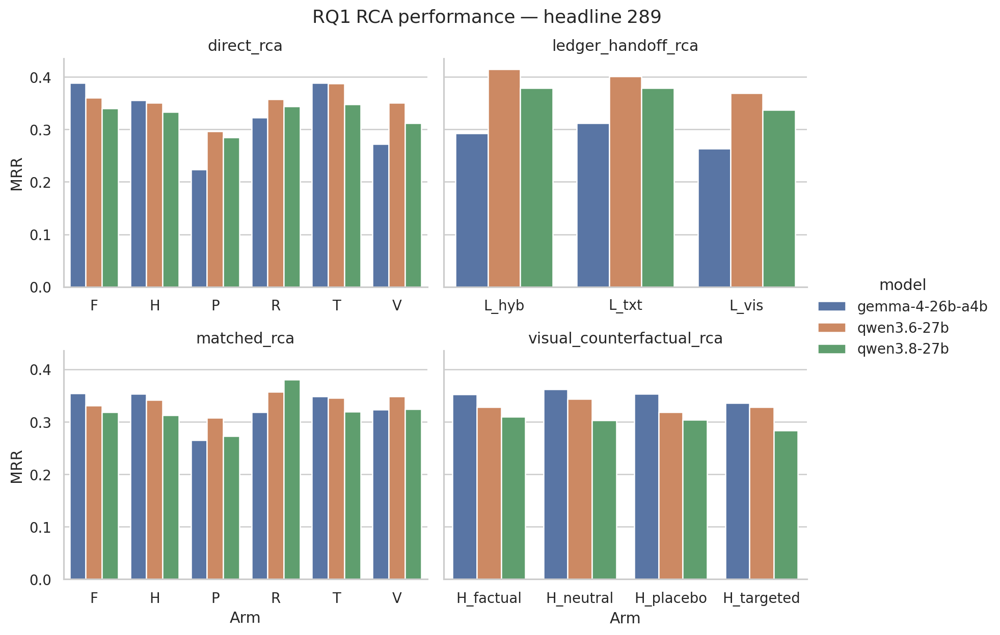

### 4.2 RCA dataset heterogeneity

Cells are MRR. AC@1/3/5 and AVG@3/5 for every dataset remain in the complete CSV above.

Show all RCA experiment × model × arm dataset MRR

| experiment                | model           | arm        |   aegislab |   aiops2022 |   aiops2025 |   headline_289 |   re2_ob |   re2_tt |
|:--------------------------|:----------------|:-----------|-----------:|------------:|------------:|---------------:|---------:|---------:|
| direct_rca                | gemma-4-26b-a4b | F          |     0.516  |      0.4103 |      0.2349 |         0.389  |   0.8028 |   0.7194 |
| direct_rca                | gemma-4-26b-a4b | H          |     0.4075 |      0.3923 |      0.2627 |         0.3557 |   0.7269 |   0.6802 |
| direct_rca                | gemma-4-26b-a4b | P          |     0.2396 |      0.2712 |      0.1559 |         0.2236 |   0.5481 |   0.3333 |
| direct_rca                | gemma-4-26b-a4b | R          |     0.4622 |      0.275  |      0.2289 |         0.3223 |   0.8028 |   0.6476 |
| direct_rca                | gemma-4-26b-a4b | T          |     0.4967 |      0.4198 |      0.2443 |         0.3889 |   0.8022 |   0.7135 |
| direct_rca                | gemma-4-26b-a4b | V          |     0.3828 |      0.2417 |      0.1918 |         0.2725 |   0.7417 |   0.5652 |
| direct_rca                | qwen3.6-27b     | F          |     0.5005 |      0.2932 |      0.288  |         0.3604 |   0.7991 |   0.7083 |
| direct_rca                | qwen3.6-27b     | H          |     0.5005 |      0.287  |      0.2654 |         0.351  |   0.7393 |   0.6778 |
| direct_rca                | qwen3.6-27b     | P          |     0.3991 |      0.2158 |      0.276  |         0.2961 |   0.6157 |   0.4833 |
| direct_rca                | qwen3.6-27b     | R          |     0.4602 |      0.284  |      0.3297 |         0.3573 |   0.6778 |   0.5302 |
| direct_rca                | qwen3.6-27b     | T          |     0.5679 |      0.3362 |      0.2586 |         0.3882 |   0.7902 |   0.7139 |
| direct_rca                | qwen3.6-27b     | V          |     0.4726 |      0.286  |      0.2957 |         0.3511 |   0.6337 |   0.5246 |
| direct_rca                | qwen3.8-27b     | F          |     0.4571 |      0.3018 |      0.2604 |         0.3401 |   0.6667 |   0.6207 |
| direct_rca                | qwen3.8-27b     | H          |     0.4776 |      0.2817 |      0.2416 |         0.3339 |   0.6315 |   0.5707 |
| direct_rca                | qwen3.8-27b     | P          |     0.4104 |      0.191  |      0.2565 |         0.2849 |   0.4746 |   0.3704 |
| direct_rca                | qwen3.8-27b     | R          |     0.4717 |      0.2607 |      0.3009 |         0.3437 |   0.5183 |   0.4641 |
| direct_rca                | qwen3.8-27b     | T          |     0.4727 |      0.327  |      0.2427 |         0.3483 |   0.6213 |   0.5961 |
| direct_rca                | qwen3.8-27b     | V          |     0.4292 |      0.2525 |      0.2557 |         0.3122 |   0.5531 |   0.4561 |
| ledger_handoff_rca        | gemma-4-26b-a4b | L_hyb      |     0.434  |      0.26   |      0.1832 |         0.2931 |   0.8167 |   0.5463 |
| ledger_handoff_rca        | gemma-4-26b-a4b | L_txt      |     0.4062 |      0.3173 |      0.2097 |         0.3122 |   0.7667 |   0.5087 |
| ledger_handoff_rca        | gemma-4-26b-a4b | L_vis      |     0.4062 |      0.2033 |      0.1796 |         0.2631 |   0.6889 |   0.4556 |
| ledger_handoff_rca        | qwen3.6-27b     | L_hyb      |     0.4747 |      0.3885 |      0.3817 |         0.4149 |   0.7874 |   0.5919 |
| ledger_handoff_rca        | qwen3.6-27b     | L_txt      |     0.483  |      0.3512 |      0.3713 |         0.4014 |   0.7943 |   0.5998 |
| ledger_handoff_rca        | qwen3.6-27b     | L_vis      |     0.4698 |      0.3337 |      0.3048 |         0.3696 |   0.7722 |   0.5409 |
| ledger_handoff_rca        | qwen3.8-27b     | L_hyb      |     0.4696 |      0.363  |      0.3025 |         0.379  |   0.692  |   0.563  |
| ledger_handoff_rca        | qwen3.8-27b     | L_txt      |     0.5104 |      0.3443 |      0.2821 |         0.3795 |   0.7389 |   0.5957 |
| ledger_handoff_rca        | qwen3.8-27b     | L_vis      |     0.454  |      0.2985 |      0.2591 |         0.3375 |   0.613  |   0.5241 |
| matched_rca               | gemma-4-26b-a4b | F          |     0.4618 |      0.3603 |      0.2384 |         0.3548 |   0.7889 |   0.6556 |
| matched_rca               | gemma-4-26b-a4b | H          |     0.4861 |      0.3283 |      0.2446 |         0.3538 |   0.8204 |   0.6402 |
| matched_rca               | gemma-4-26b-a4b | P          |     0.3524 |      0.225  |      0.2168 |         0.2647 |   0.6657 |   0.4744 |
| matched_rca               | gemma-4-26b-a4b | R          |     0.4236 |      0.2933 |      0.236  |         0.3182 |   0.8139 |   0.5467 |
| matched_rca               | gemma-4-26b-a4b | T          |     0.4878 |      0.315  |      0.2419 |         0.3489 |   0.8083 |   0.6291 |
| matched_rca               | gemma-4-26b-a4b | V          |     0.4509 |      0.32   |      0.1953 |         0.3234 |   0.7944 |   0.53   |
| matched_rca               | qwen3.6-27b     | F          |     0.4183 |      0.351  |      0.2722 |         0.3315 |   0.7406 |   0.7083 |
| matched_rca               | qwen3.6-27b     | H          |     0.4776 |      0.346  |      0.2767 |         0.3415 |   0.7244 |   0.6781 |
| matched_rca               | qwen3.6-27b     | P          |     0.4386 |      0.2962 |      0.2627 |         0.3078 |   0.7048 |   0.6013 |
| matched_rca               | qwen3.6-27b     | R          |     0.4634 |      0.3228 |      0.3466 |         0.3569 |   0.7917 |   0.6113 |
| matched_rca               | qwen3.6-27b     | T          |     0.4902 |      0.3447 |      0.2828 |         0.3456 |   0.707  |   0.7026 |
| matched_rca               | qwen3.6-27b     | V          |     0.5049 |      0.3378 |      0.2916 |         0.3487 |   0.7846 |   0.6119 |
| matched_rca               | qwen3.8-27b     | F          |     0.3788 |      0.3217 |      0.252  |         0.3182 |   0.6781 |   0.6374 |
| matched_rca               | qwen3.8-27b     | H          |     0.3536 |      0.3182 |      0.2651 |         0.3129 |   0.7056 |   0.6315 |
| matched_rca               | qwen3.8-27b     | P          |     0.2981 |      0.2662 |      0.2536 |         0.2727 |   0.6537 |   0.6019 |
| matched_rca               | qwen3.8-27b     | R          |     0.4595 |      0.36   |      0.3215 |         0.3807 |   0.7019 |   0.6157 |
| matched_rca               | qwen3.8-27b     | T          |     0.3415 |      0.3217 |      0.2935 |         0.3192 |   0.7167 |   0.6333 |
| matched_rca               | qwen3.8-27b     | V          |     0.4    |      0.2762 |      0.2973 |         0.3241 |   0.6294 |   0.5407 |
| visual_counterfactual_rca | gemma-4-26b-a4b | H_factual  |     0.4826 |      0.3191 |      0.2348 |         0.3524 |   0.8463 |   0.6189 |
| visual_counterfactual_rca | gemma-4-26b-a4b | H_neutral  |     0.4778 |      0.3298 |      0.2581 |         0.3617 |   0.8222 |   0.6074 |
| visual_counterfactual_rca | gemma-4-26b-a4b | H_placebo  |     0.5151 |      0.2837 |      0.2217 |         0.3534 |   0.8444 |   0.6139 |
| visual_counterfactual_rca | gemma-4-26b-a4b | H_targeted |     0.4535 |      0.2908 |      0.2384 |         0.3363 |   0.8046 |   0.6417 |
| visual_counterfactual_rca | qwen3.6-27b     | H_factual  |     0.4017 |      0.3454 |      0.243  |         0.328  |   0.7843 |   0.7078 |
| visual_counterfactual_rca | qwen3.6-27b     | H_neutral  |     0.4042 |      0.4025 |      0.2525 |         0.3441 |   0.7883 |   0.7633 |
| visual_counterfactual_rca | qwen3.6-27b     | H_placebo  |     0.3505 |      0.3791 |      0.2559 |         0.3189 |   0.7448 |   0.6965 |
| visual_counterfactual_rca | qwen3.6-27b     | H_targeted |     0.3634 |      0.3695 |      0.2708 |         0.3281 |   0.7415 |   0.6994 |
| visual_counterfactual_rca | qwen3.8-27b     | H_factual  |     0.3757 |      0.2746 |      0.2647 |         0.3097 |   0.6833 |   0.6519 |
| visual_counterfactual_rca | qwen3.8-27b     | H_neutral  |     0.3658 |      0.2719 |      0.2581 |         0.3028 |   0.7037 |   0.6574 |
| visual_counterfactual_rca | qwen3.8-27b     | H_placebo  |     0.3563 |      0.2801 |      0.2663 |         0.3042 |   0.6985 |   0.6352 |
| visual_counterfactual_rca | qwen3.8-27b     | H_targeted |     0.3601 |      0.2377 |      0.2344 |         0.2835 |   0.6852 |   0.6176 |

The routed-arm-minus-text (`R-T`) Qwen3.8 gain is concentrated in AegisLab (`+0.1181`), but remains positive on AIOPS-2022 (`+0.0383`) and AIOPS-2025 (`+0.0280`). Gemma reverses on AegisLab (`-0.0642`). In the following modifier table, `value` is the dataset name, `delta` is paired `R-T` MRR, and `repair_n`/`break_n` count top-1 corrections/regressions.

| model           | value     |   n |   delta |      p |   cohen_dz |   repair_n |   break_n |
|:----------------|:----------|----:|--------:|-------:|-----------:|-----------:|----------:|
| qwen3.6-27b     | aegislab  |  41 | -0.0268 | 0.6885 |    -0.0728 |          4 |         5 |
| qwen3.6-27b     | aiops2022 | 100 | -0.0218 | 0.171  |    -0.0618 |          8 |         7 |
| qwen3.6-27b     | aiops2025 |  93 |  0.0638 | 0.1164 |     0.167  |         12 |         7 |
| gemma-4-26b-a4b | aegislab  |  96 | -0.0642 | 0.2357 |    -0.1197 |         11 |        18 |
| gemma-4-26b-a4b | aiops2022 | 100 | -0.0217 | 0.6105 |    -0.0671 |          6 |         8 |
| gemma-4-26b-a4b | aiops2025 |  93 | -0.0059 | 0.5934 |    -0.0151 |          8 |         9 |
| qwen3.8-27b     | aegislab  |  96 |  0.1181 | 0.0027 |     0.2924 |         15 |         7 |
| qwen3.8-27b     | aiops2022 | 100 |  0.0383 | 0.2714 |     0.1061 |         10 |         7 |
| qwen3.8-27b     | aiops2025 |  93 |  0.028  | 0.433  |     0.0981 |          8 |         5 |

### 4.3 QA headline results

Show all Legacy-Q9, cross-region and typed-two-stage arms

| experiment      | model           | arm         |   n |   complete_chain_accuracy |   level_1_complete_chain_accuracy |   level_2_complete_chain_accuracy |   level_3_complete_chain_accuracy |   step_accuracy |   query_membership_valid |
|:----------------|:----------------|:------------|----:|--------------------------:|----------------------------------:|----------------------------------:|----------------------------------:|----------------:|-------------------------:|
| cross_region    | gemma-4-26b-a4b | H           | 289 |                    0.7122 |                            0.9273 |                            0.5874 |                            0.413  |          0.7636 |                   1      |
| cross_region    | gemma-4-26b-a4b | Mt-Rt-Lt-Gt | 289 |                    0.6701 |                            0.955  |                            0.5019 |                            0.2536 |          0.6742 |                   1      |
| cross_region    | gemma-4-26b-a4b | Mt-Rt-Lt-Gv | 289 |                    0.6003 |                            0.8235 |                            0.4981 |                            0.2391 |          0.6442 |                   1      |
| cross_region    | gemma-4-26b-a4b | Mt-Rt-Lv-Gt | 289 |                    0.6217 |                            0.7924 |                            0.5353 |                            0.3116 |          0.6742 |                   1      |
| cross_region    | gemma-4-26b-a4b | Mt-Rt-Lv-Gv | 289 |                    0.5617 |                            0.6678 |                            0.5316 |                            0.2899 |          0.6505 |                   1      |
| cross_region    | gemma-4-26b-a4b | Mt-Rv-Lt-Gt | 289 |                    0.7191 |                            0.9481 |                            0.5279 |                            0.5217 |          0.7705 |                   1      |
| cross_region    | gemma-4-26b-a4b | Mt-Rv-Lt-Gv | 289 |                    0.6759 |                            0.8339 |                            0.5353 |                            0.587  |          0.7572 |                   1      |
| cross_region    | gemma-4-26b-a4b | Mt-Rv-Lv-Gt | 289 |                    0.6678 |                            0.7855 |                            0.5465 |                            0.6014 |          0.7641 |                   1      |
| cross_region    | gemma-4-26b-a4b | Mt-Rv-Lv-Gv | 289 |                    0.6211 |                            0.6955 |                            0.5093 |                            0.6377 |          0.7514 |                   1      |
| cross_region    | gemma-4-26b-a4b | Mv-Rt-Lt-Gt | 289 |                    0.6753 |                            0.9654 |                            0.513  |                            0.2464 |          0.6857 |                   1      |
| cross_region    | gemma-4-26b-a4b | Mv-Rt-Lt-Gv | 289 |                    0.6315 |                            0.8443 |                            0.5167 |                            0.2609 |          0.669  |                   1      |
| cross_region    | gemma-4-26b-a4b | Mv-Rt-Lv-Gt | 289 |                    0.6338 |                            0.7993 |                            0.5613 |                            0.2826 |          0.6967 |                   1      |
| cross_region    | gemma-4-26b-a4b | Mv-Rt-Lv-Gv | 289 |                    0.5871 |                            0.699  |                            0.5428 |                            0.3116 |          0.6696 |                   1      |
| cross_region    | gemma-4-26b-a4b | Mv-Rv-Lt-Gt | 289 |                    0.7295 |                            0.9723 |                            0.539  |                            0.4928 |          0.7953 |                   1      |
| cross_region    | gemma-4-26b-a4b | Mv-Rv-Lt-Gv | 289 |                    0.6609 |                            0.8651 |                            0.513  |                            0.4275 |          0.748  |                   1      |
| cross_region    | gemma-4-26b-a4b | Mv-Rv-Lv-Gt | 289 |                    0.6782 |                            0.8131 |                            0.5725 |                            0.4928 |          0.7843 |                   1      |
| cross_region    | gemma-4-26b-a4b | Mv-Rv-Lv-Gv | 289 |                    0.5698 |                            0.6194 |                            0.5204 |                            0.4855 |          0.7232 |                   1      |
| cross_region    | gemma-4-26b-a4b | P           | 289 |                    0.4804 |                            0.7855 |                            0.3048 |                            0.0652 |          0.4954 |                   1      |
| cross_region    | gemma-4-26b-a4b | V           | 289 |                    0.4054 |                            0.4913 |                            0.3792 |                            0.1449 |          0.5675 |                   1      |
| cross_region    | qwen3.6-27b     | H           | 289 |                    0.7468 |                            0.9654 |                            0.6171 |                            0.3986 |          0.8085 |                   1      |
| cross_region    | qwen3.6-27b     | Mt-Rt-Lt-Gt | 289 |                    0.7093 |                            0.9758 |                            0.5502 |                            0.3333 |          0.7186 |                   1      |
| cross_region    | qwen3.6-27b     | Mt-Rt-Lt-Gv | 289 |                    0.6632 |                            0.8651 |                            0.5465 |                            0.3406 |          0.6984 |                   1      |
| cross_region    | qwen3.6-27b     | Mt-Rt-Lv-Gt | 289 |                    0.7249 |                            0.9204 |                            0.6208 |                            0.3696 |          0.7659 |                   1      |
| cross_region    | qwen3.6-27b     | Mt-Rt-Lv-Gv | 289 |                    0.692  |                            0.8443 |                            0.6171 |                            0.3623 |          0.7526 |                   1      |
| cross_region    | qwen3.6-27b     | Mt-Rv-Lt-Gt | 289 |                    0.7457 |                            0.955  |                            0.5836 |                            0.529  |          0.7912 |                   1      |
| cross_region    | qwen3.6-27b     | Mt-Rv-Lt-Gv | 289 |                    0.7099 |                            0.9066 |                            0.5613 |                            0.4928 |          0.7612 |                   1      |
| cross_region    | qwen3.6-27b     | Mt-Rv-Lv-Gt | 289 |                    0.7047 |                            0.8685 |                            0.5836 |                            0.4855 |          0.7895 |                   1      |
| cross_region    | qwen3.6-27b     | Mt-Rv-Lv-Gv | 289 |                    0.6753 |                            0.8201 |                            0.5688 |                            0.4565 |          0.7734 |                   1      |
| cross_region    | qwen3.6-27b     | Mv-Rt-Lt-Gt | 289 |                    0.707  |                            0.9792 |                            0.5576 |                            0.2899 |          0.718  |                   1      |
| cross_region    | qwen3.6-27b     | Mv-Rt-Lt-Gv | 289 |                    0.6805 |                            0.9308 |                            0.5428 |                            0.3043 |          0.7024 |                   1      |
| cross_region    | qwen3.6-27b     | Mv-Rt-Lv-Gt | 289 |                    0.7053 |                            0.8858 |                            0.6208 |                            0.3261 |          0.7457 |                   1      |
| cross_region    | qwen3.6-27b     | Mv-Rt-Lv-Gv | 289 |                    0.6678 |                            0.827  |                            0.6022 |                            0.3116 |          0.7203 |                   1      |
| cross_region    | qwen3.6-27b     | Mv-Rv-Lt-Gt | 289 |                    0.722  |                            0.9516 |                            0.5688 |                            0.4493 |          0.7791 |                   1      |
| cross_region    | qwen3.6-27b     | Mv-Rv-Lt-Gv | 289 |                    0.6811 |                            0.8962 |                            0.5428 |                            0.413  |          0.7486 |                   1      |
| cross_region    | qwen3.6-27b     | Mv-Rv-Lv-Gt | 289 |                    0.6932 |                            0.8547 |                            0.5836 |                            0.4493 |          0.7837 |                   1      |
| cross_region    | qwen3.6-27b     | Mv-Rv-Lv-Gv | 289 |                    0.6211 |                            0.7647 |                            0.5279 |                            0.4058 |          0.7336 |                   1      |
| cross_region    | qwen3.6-27b     | P           | 289 |                    0.6667 |                            0.9481 |                            0.5056 |                            0.2464 |          0.6522 |                   1      |
| cross_region    | qwen3.6-27b     | V           | 289 |                    0.594  |                            0.7336 |                            0.5279 |                            0.2826 |          0.6984 |                   1      |
| cross_region    | qwen3.8-27b     | H           | 289 |                    0.3495 |                            0.4671 |                            0.2509 |                            0.2792 |          0.496  |                   1      |
| cross_region    | qwen3.8-27b     | Mt-Rt-Lt-Gt | 289 |                    0.4533 |                            0.6817 |                            0.2867 |                            0.2792 |          0.511  |                   1      |
| cross_region    | qwen3.8-27b     | Mt-Rt-Lt-Gv | 289 |                    0.3304 |                            0.4879 |                            0.2258 |                            0.2208 |          0.4291 |                   1      |
| cross_region    | qwen3.8-27b     | Mt-Rt-Lv-Gt | 289 |                    0.331  |                            0.4394 |                            0.2294 |                            0.2922 |          0.4614 |                   1      |
| cross_region    | qwen3.8-27b     | Mt-Rt-Lv-Gv | 289 |                    0.3189 |                            0.4256 |                            0.233  |                            0.2468 |          0.4625 |                   1      |
| cross_region    | qwen3.8-27b     | Mt-Rv-Lt-Gt | 289 |                    0.3108 |                            0.4498 |                            0.1971 |                            0.2208 |          0.44   |                   1      |
| cross_region    | qwen3.8-27b     | Mt-Rv-Lt-Gv | 289 |                    0.3454 |                            0.4775 |                            0.2366 |                            0.2532 |          0.4533 |                   1      |
| cross_region    | qwen3.8-27b     | Mt-Rv-Lv-Gt | 289 |                    0.3137 |                            0.4152 |                            0.2115 |                            0.2727 |          0.4839 |                   1      |
| cross_region    | qwen3.8-27b     | Mt-Rv-Lv-Gv | 289 |                    0.3033 |                            0.4083 |                            0.2115 |                            0.2143 |          0.4798 |                   1      |
| cross_region    | qwen3.8-27b     | Mv-Rt-Lt-Gt | 289 |                    0.391  |                            0.5813 |                            0.2401 |                            0.2532 |          0.4706 |                   1      |
| cross_region    | qwen3.8-27b     | Mv-Rt-Lt-Gv | 289 |                    0.4273 |                            0.6263 |                            0.276  |                            0.2727 |          0.515  |                   1      |
| cross_region    | qwen3.8-27b     | Mv-Rt-Lv-Gt | 289 |                    0.3893 |                            0.5294 |                            0.3011 |                            0.2273 |          0.5248 |                   1      |
| cross_region    | qwen3.8-27b     | Mv-Rt-Lv-Gv | 289 |                    0.4348 |                            0.5779 |                            0.3297 |                            0.2792 |          0.5715 |                   1      |
| cross_region    | qwen3.8-27b     | Mv-Rv-Lt-Gt | 289 |                    0.3725 |                            0.5917 |                            0.2222 |                            0.1883 |          0.4856 |                   1      |
| cross_region    | qwen3.8-27b     | Mv-Rv-Lt-Gv | 289 |                    0.4337 |                            0.6401 |                            0.2724 |                            0.2662 |          0.5358 |                   1      |
| cross_region    | qwen3.8-27b     | Mv-Rv-Lv-Gt | 289 |                    0.3466 |                            0.4983 |                            0.2258 |                            0.2143 |          0.5219 |                   1      |
| cross_region    | qwen3.8-27b     | Mv-Rv-Lv-Gv | 289 |                    0.3108 |                            0.4533 |                            0.2079 |                            0.1623 |          0.4908 |                   1      |
| cross_region    | qwen3.8-27b     | P           | 289 |                    0.466  |                            0.7474 |                            0.2975 |                            0.1688 |          0.4746 |                   1      |
| cross_region    | qwen3.8-27b     | V           | 289 |                    0.2751 |                            0.3737 |                            0.2115 |                            0.1364 |          0.4487 |                   1      |
| legacy_q9       | gemma-4-26b-a4b | H           | 289 |                    0.9166 |                            0.9166 |                                   |                                   |          0.9166 |                   1      |
| legacy_q9       | gemma-4-26b-a4b | P           | 289 |                    0.7893 |                            0.7893 |                                   |                                   |          0.7893 |                   1      |
| legacy_q9       | gemma-4-26b-a4b | T           | 289 |                    0.9343 |                            0.9343 |                                   |                                   |          0.9343 |                   1      |
| legacy_q9       | gemma-4-26b-a4b | V           | 289 |                    0.7409 |                            0.7409 |                                   |                                   |          0.7409 |                   1      |
| legacy_q9       | qwen3.6-27b     | H           | 289 |                    0.927  |                            0.927  |                                   |                                   |          0.927  |                   1      |
| legacy_q9       | qwen3.6-27b     | P           | 289 |                    0.8931 |                            0.8931 |                                   |                                   |          0.8931 |                   1      |
| legacy_q9       | qwen3.6-27b     | T           | 289 |                    0.9246 |                            0.9246 |                                   |                                   |          0.9246 |                   1      |
| legacy_q9       | qwen3.6-27b     | V           | 289 |                    0.8712 |                            0.8712 |                                   |                                   |          0.8712 |                   1      |
| legacy_q9       | qwen3.8-27b     | H           | 289 |                    0.8931 |                            0.8931 |                                   |                                   |          0.8931 |                   1      |
| legacy_q9       | qwen3.8-27b     | P           | 289 |                    0.8562 |                            0.8562 |                                   |                                   |          0.8562 |                   1      |
| legacy_q9       | qwen3.8-27b     | T           | 289 |                    0.897  |                            0.897  |                                   |                                   |          0.897  |                   1      |
| legacy_q9       | qwen3.8-27b     | V           | 289 |                    0.8212 |                            0.8212 |                                   |                                   |          0.8212 |                   1      |
| typed_two_stage | gemma-4-26b-a4b | H           | 289 |                    0.5444 |                            0.782  |                            0.4275 |                            0.2302 |          0.6096 |                   1      |
| typed_two_stage | gemma-4-26b-a4b | Mt-Rt-Lt-Gt | 289 |                    0.5744 |                            0.8858 |                            0.3941 |                            0.1871 |          0.5848 |                   0.9965 |
| typed_two_stage | gemma-4-26b-a4b | Mt-Rt-Lt-Gv | 289 |                    0.5877 |                            0.8962 |                            0.4089 |                            0.223  |          0.6228 |                   1      |
| typed_two_stage | gemma-4-26b-a4b | Mt-Rt-Lv-Gt | 289 |                    0.4746 |                            0.6886 |                            0.3494 |                            0.2086 |          0.5582 |                   1      |
| typed_two_stage | gemma-4-26b-a4b | Mt-Rt-Lv-Gv | 289 |                    0.4942 |                            0.7128 |                            0.368  |                            0.2086 |          0.5975 |                   1      |
| typed_two_stage | gemma-4-26b-a4b | Mt-Rv-Lt-Gt | 289 |                    0.4227 |                            0.7232 |                            0.2082 |                            0.1367 |          0.5456 |                   1      |
| typed_two_stage | gemma-4-26b-a4b | Mt-Rv-Lt-Gv | 289 |                    0.4216 |                            0.7232 |                            0.1859 |                            0.1439 |          0.5623 |                   1      |
| typed_two_stage | gemma-4-26b-a4b | Mt-Rv-Lv-Gt | 289 |                    0.2445 |                            0.4775 |                            0.0372 |                            0.1079 |          0.4689 |                   1      |
| typed_two_stage | gemma-4-26b-a4b | Mt-Rv-Lv-Gv | 289 |                    0.2589 |                            0.5052 |                            0.0409 |                            0.0863 |          0.4729 |                   1      |
| typed_two_stage | gemma-4-26b-a4b | Mv-Rt-Lt-Gt | 289 |                    0.4954 |                            0.7612 |                            0.3569 |                            0.1439 |          0.5248 |                   1      |
| typed_two_stage | gemma-4-26b-a4b | Mv-Rt-Lt-Gv | 289 |                    0.5173 |                            0.8374 |                            0.3494 |                            0.1079 |          0.5473 |                   1      |
| typed_two_stage | gemma-4-26b-a4b | Mv-Rt-Lv-Gt | 289 |                    0.3518 |                            0.4879 |                            0.29   |                            0.1511 |          0.4602 |                   1      |
| typed_two_stage | gemma-4-26b-a4b | Mv-Rt-Lv-Gv | 289 |                    0.4256 |                            0.6125 |                            0.3309 |                            0.1223 |          0.5213 |                   1      |
| typed_two_stage | gemma-4-26b-a4b | Mv-Rv-Lt-Gt | 289 |                    0.3356 |                            0.5675 |                            0.1784 |                            0.0719 |          0.4781 |                   1      |
| typed_two_stage | gemma-4-26b-a4b | Mv-Rv-Lt-Gv | 289 |                    0.3587 |                            0.6332 |                            0.171  |                            0.0647 |          0.4902 |                   1      |
| typed_two_stage | gemma-4-26b-a4b | Mv-Rv-Lv-Gt | 289 |                    0.1747 |                            0.3529 |                            0.0223 |                            0.0288 |          0.3789 |                   1      |
| typed_two_stage | gemma-4-26b-a4b | Mv-Rv-Lv-Gv | 289 |                    0.2128 |                            0.4187 |                            0.0335 |                            0.036  |          0.4227 |                   1      |
| typed_two_stage | gemma-4-26b-a4b | P           | 289 |                    0.3927 |                            0.7197 |                            0.1747 |                            0.0288 |          0.3887 |                   1      |
| typed_two_stage | gemma-4-26b-a4b | V           | 289 |                    0.2439 |                            0.3806 |                            0.1375 |                            0.0719 |          0.4239 |                   1      |
| typed_two_stage | qwen3.6-27b     | H           | 289 |                    0.4867 |                            0.6609 |                            0.3941 |                            0.2464 |          0.583  |                   1      |
| typed_two_stage | qwen3.6-27b     | Mt-Rt-Lt-Gt | 289 |                    0.4233 |                            0.6505 |                            0.2639 |                            0.1957 |          0.4931 |                   1      |
| typed_two_stage | qwen3.6-27b     | Mt-Rt-Lt-Gv | 289 |                    0.4256 |                            0.6367 |                            0.2974 |                            0.1739 |          0.4954 |                   1      |
| typed_two_stage | qwen3.6-27b     | Mt-Rt-Lv-Gt | 289 |                    0.4539 |                            0.654  |                            0.3309 |                            0.1957 |          0.5525 |                   1      |
| typed_two_stage | qwen3.6-27b     | Mt-Rt-Lv-Gv | 289 |                    0.4377 |                            0.6367 |                            0.316  |                            0.1739 |          0.5311 |                   1      |
| typed_two_stage | qwen3.6-27b     | Mt-Rv-Lt-Gt | 289 |                    0.3535 |                            0.5813 |                            0.1673 |                            0.1739 |          0.4752 |                   1      |
| typed_two_stage | qwen3.6-27b     | Mt-Rv-Lt-Gv | 289 |                    0.3241 |                            0.5502 |                            0.1636 |                            0.1304 |          0.4406 |                   1      |
| typed_two_stage | qwen3.6-27b     | Mt-Rv-Lv-Gt | 289 |                    0.3178 |                            0.5536 |                            0.1375 |                            0.1304 |          0.4642 |                   1      |
| typed_two_stage | qwen3.6-27b     | Mt-Rv-Lv-Gv | 289 |                    0.3258 |                            0.5502 |                            0.1822 |                            0.1014 |          0.4625 |                   1      |
| typed_two_stage | qwen3.6-27b     | Mv-Rt-Lt-Gt | 289 |                    0.4562 |                            0.6782 |                            0.3309 |                            0.1522 |          0.5225 |                   1      |
| typed_two_stage | qwen3.6-27b     | Mv-Rt-Lt-Gv | 289 |                    0.4608 |                            0.6713 |                            0.3457 |                            0.1812 |          0.534  |                   1      |
| typed_two_stage | qwen3.6-27b     | Mv-Rt-Lv-Gt | 289 |                    0.489  |                            0.6886 |                            0.3792 |                            0.2029 |          0.5802 |                   1      |
| typed_two_stage | qwen3.6-27b     | Mv-Rt-Lv-Gv | 289 |                    0.4781 |                            0.6747 |                            0.3717 |                            0.1957 |          0.5692 |                   1      |
| typed_two_stage | qwen3.6-27b     | Mv-Rv-Lt-Gt | 289 |                    0.3547 |                            0.564  |                            0.1933 |                            0.1594 |          0.5017 |                   1      |
| typed_two_stage | qwen3.6-27b     | Mv-Rv-Lt-Gv | 289 |                    0.376  |                            0.5779 |                            0.2565 |                            0.1594 |          0.504  |                   1      |
| typed_two_stage | qwen3.6-27b     | Mv-Rv-Lv-Gt | 289 |                    0.3962 |                            0.6194 |                            0.2454 |                            0.1594 |          0.5346 |                   1      |
| typed_two_stage | qwen3.6-27b     | Mv-Rv-Lv-Gv | 289 |                    0.4158 |                            0.6125 |                            0.3011 |                            0.1812 |          0.5502 |                   1      |
| typed_two_stage | qwen3.6-27b     | P           | 289 |                    0.3662 |                            0.5744 |                            0.2639 |                            0.0942 |          0.4273 |                   1      |
| typed_two_stage | qwen3.6-27b     | V           | 289 |                    0.4544 |                            0.6471 |                            0.3829 |                            0.1522 |          0.5404 |                   1      |
| typed_two_stage | qwen3.8-27b     | H           | 289 |                    0.5098 |                            0.7855 |                            0.3154 |                            0.2338 |          0.583  |                   1      |
| typed_two_stage | qwen3.8-27b     | Mt-Rt-Lt-Gt | 289 |                    0.4544 |                            0.7474 |                            0.2616 |                            0.1364 |          0.5075 |                   1      |
| typed_two_stage | qwen3.8-27b     | Mt-Rt-Lt-Gv | 289 |                    0.4418 |                            0.7301 |                            0.2545 |                            0.1558 |          0.4983 |                   1      |
| typed_two_stage | qwen3.8-27b     | Mt-Rt-Lv-Gt | 289 |                    0.4614 |                            0.7336 |                            0.2975 |                            0.1299 |          0.5386 |                   1      |
| typed_two_stage | qwen3.8-27b     | Mt-Rt-Lv-Gv | 289 |                    0.4464 |                            0.7266 |                            0.2616 |                            0.1623 |          0.5161 |                   1      |
| typed_two_stage | qwen3.8-27b     | Mt-Rv-Lt-Gt | 289 |                    0.3564 |                            0.6159 |                            0.1792 |                            0.0844 |          0.4602 |                   1      |
| typed_two_stage | qwen3.8-27b     | Mt-Rv-Lt-Gv | 289 |                    0.3552 |                            0.6194 |                            0.172  |                            0.0844 |          0.4504 |                   1      |
| typed_two_stage | qwen3.8-27b     | Mt-Rv-Lv-Gt | 289 |                    0.361  |                            0.609  |                            0.1935 |                            0.0844 |          0.4827 |                   1      |
| typed_two_stage | qwen3.8-27b     | Mt-Rv-Lv-Gv | 289 |                    0.3922 |                            0.6194 |                            0.2509 |                            0.1169 |          0.5052 |                   1      |
| typed_two_stage | qwen3.8-27b     | Mv-Rt-Lt-Gt | 289 |                    0.4942 |                            0.7958 |                            0.2903 |                            0.1753 |          0.5456 |                   1      |
| typed_two_stage | qwen3.8-27b     | Mv-Rt-Lt-Gv | 289 |                    0.4815 |                            0.7785 |                            0.2832 |                            0.1818 |          0.5409 |                   1      |
| typed_two_stage | qwen3.8-27b     | Mv-Rt-Lv-Gt | 289 |                    0.4942 |                            0.7682 |                            0.3047 |                            0.1883 |          0.5588 |                   1      |
| typed_two_stage | qwen3.8-27b     | Mv-Rt-Lv-Gv | 289 |                    0.5058 |                            0.7785 |                            0.3297 |                            0.1948 |          0.5802 |                   1      |
| typed_two_stage | qwen3.8-27b     | Mv-Rv-Lt-Gt | 289 |                    0.4008 |                            0.6782 |                            0.1971 |                            0.1234 |          0.5023 |                   1      |
| typed_two_stage | qwen3.8-27b     | Mv-Rv-Lt-Gv | 289 |                    0.4025 |                            0.6678 |                            0.2294 |                            0.0974 |          0.4971 |                   1      |
| typed_two_stage | qwen3.8-27b     | Mv-Rv-Lv-Gt | 289 |                    0.4273 |                            0.6886 |                            0.2437 |                            0.1104 |          0.5444 |                   1      |
| typed_two_stage | qwen3.8-27b     | Mv-Rv-Lv-Gv | 289 |                    0.4325 |                            0.692  |                            0.2581 |                            0.1299 |          0.5502 |                   1      |
| typed_two_stage | qwen3.8-27b     | P           | 289 |                    0.4516 |                            0.7785 |                            0.2437 |                            0.0909 |          0.4775 |                   1      |
| typed_two_stage | qwen3.8-27b     | V           | 289 |                    0.4366 |                            0.692  |                            0.276  |                            0.1169 |          0.534  |                   1      |

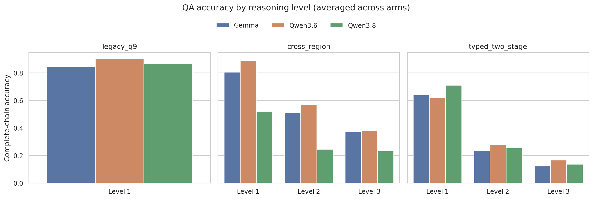

Legacy natural-language text `T` is already very strong (headline exact accuracy: Gemma 0.9343, Qwen3.6 0.9246, Qwen3.8 0.8970). Hybrid image-plus-text `H` is approximately tied only for the two Qwen models and is lower for Gemma; real-dashboard-only `V` and pixel-text `P` are lower for all three. In one-stage cross-region QA, `H` improves the per-case question-packet average by +0.0421 for Gemma and +0.0375 for Qwen3.6 but hurts Qwen3.8 by -0.1038. The preregistered depth test is different from that packet average: on cases where both Level 2 and Level 3 are jointly scoreable, Gemma has hypothesis P1 `+0.1087` (`n=138`, Holm `p<0.0001`) and hypothesis P2 `+0.1667` (Holm `p=0.00026`), so Gemma alone supports those two depth hypotheses. Qwen3.6 and Qwen3.8 do not pass both. Typed handoff improves the packet average for selected Qwen visual conditions, but no model reaches both +0.10 depth thresholds.

## 5. Paired arm and experiment comparisons

Tests use paired Wilcoxon signed-rank with Pratt zeros and paired Cohen's `dz`; Section 3.6 explains these columns. No confidence intervals are reported. Holm families follow the registered primary/secondary groupings, preventing a large menu of arm comparisons from being treated as independent chances to find significance.

Show registered and mechanism comparisons

| experiment                | model           | comparison             | metric                  |   n |    delta |       p |   p_holm |   cohen_dz |   improve |   degrade |   tie |
|:--------------------------|:----------------|:-----------------------|:------------------------|----:|---------:|--------:|---------:|-----------:|----------:|----------:|------:|
| cross_region              | gemma-4-26b-a4b | G_visual_main_effect   | complete_chain_accuracy | 289 | -0.06091 | 0       |  0       |   -0.47728 |        48 |       140 |   101 |
| cross_region              | gemma-4-26b-a4b | L_visual_main_effect   | complete_chain_accuracy | 289 | -0.0527  | 0.00014 |  0.00028 |   -0.20855 |        71 |       126 |    92 |
| cross_region              | gemma-4-26b-a4b | M_visual_main_effect   | complete_chain_accuracy | 289 |  0.00353 | 0.88523 |  0.88523 |    0.03507 |        85 |        92 |   112 |
| cross_region              | gemma-4-26b-a4b | P1: H-T on Level2+3    | mean_level2_3_accuracy  | 138 |  0.1087  | 2e-05   |  4e-05   |    0.38589 |        32 |         6 |   100 |
| cross_region              | gemma-4-26b-a4b | P2: (H-T)L3 - (H-T)L1  | accuracy_interaction    | 138 |  0.16667 | 0.00026 |  0.00026 |    0.30404 |        31 |         8 |    99 |
| cross_region              | gemma-4-26b-a4b | R_visual_main_effect   | complete_chain_accuracy | 289 |  0.0426  | 0       |  0       |    0.33086 |       129 |        60 |   100 |
| cross_region              | qwen3.6-27b     | G_visual_main_effect   | complete_chain_accuracy | 289 | -0.04015 | 0       |  0       |   -0.30705 |        46 |       109 |   134 |
| cross_region              | qwen3.6-27b     | L_visual_main_effect   | complete_chain_accuracy | 289 | -0.0168  | 0.00783 |  0.01566 |   -0.09203 |        66 |       103 |   120 |
| cross_region              | qwen3.6-27b     | M_visual_main_effect   | complete_chain_accuracy | 289 | -0.01838 | 0.00118 |  0.00354 |   -0.19501 |        62 |       104 |   123 |
| cross_region              | qwen3.6-27b     | P1: H-T on Level2+3    | mean_level2_3_accuracy  | 138 |  0.03623 | 0.0786  |  0.0786  |    0.12605 |        24 |        13 |   101 |
| cross_region              | qwen3.6-27b     | P2: (H-T)L3 - (H-T)L1  | accuracy_interaction    | 138 |  0.08696 | 0.03389 |  0.06779 |    0.18293 |        22 |        10 |   106 |
| cross_region              | qwen3.6-27b     | R_visual_main_effect   | complete_chain_accuracy | 289 |  0.00036 | 0.98895 |  0.98895 |    0.00269 |        85 |        86 |   118 |
| cross_region              | qwen3.8-27b     | G_visual_main_effect   | complete_chain_accuracy | 289 | -0.00043 | 0.71192 |  0.71192 |   -0.00312 |       101 |        99 |    89 |
| cross_region              | qwen3.8-27b     | L_visual_main_effect   | complete_chain_accuracy | 289 | -0.0395  | 0.00656 |  0.01311 |   -0.18747 |        90 |       126 |    73 |
| cross_region              | qwen3.8-27b     | M_visual_main_effect   | complete_chain_accuracy | 289 |  0.04988 | 1e-05   |  3e-05   |    0.28468 |       136 |        80 |    73 |
| cross_region              | qwen3.8-27b     | P1: H-T on Level2+3    | mean_level2_3_accuracy  | 154 | -0.01623 | 0.47561 |  0.47561 |   -0.04081 |        26 |        32 |    96 |
| cross_region              | qwen3.8-27b     | P2: (H-T)L3 - (H-T)L1  | accuracy_interaction    | 154 |  0.22078 | 3e-05   |  6e-05   |    0.35707 |        46 |        14 |    94 |
| cross_region              | qwen3.8-27b     | R_visual_main_effect   | complete_chain_accuracy | 289 | -0.04239 | 7e-05   |  0.00021 |   -0.29041 |        84 |       127 |    78 |
| direct_rca                | gemma-4-26b-a4b | H - T                  | mrr                     | 289 | -0.03322 | 0.08821 |  0.17643 |   -0.11429 |        30 |        44 |   215 |
| direct_rca                | gemma-4-26b-a4b | P - T                  | mrr                     | 289 | -0.16528 | 0       |  0       |   -0.36119 |        23 |        90 |   176 |
| direct_rca                | gemma-4-26b-a4b | R - F                  | mrr                     | 289 | -0.06667 | 0.01795 |  0.01795 |   -0.17325 |        38 |        59 |   192 |
| direct_rca                | gemma-4-26b-a4b | R - T                  | mrr                     | 289 | -0.06655 | 0.00888 |  0.01775 |   -0.17108 |        38 |        63 |   188 |
| direct_rca                | gemma-4-26b-a4b | V - T                  | mrr                     | 289 | -0.11638 | 0       |  1e-05   |   -0.2866  |        28 |        77 |   184 |
| direct_rca                | qwen3.6-27b     | H - T                  | mrr                     | 289 | -0.0372  | 0.00948 |  0.02843 |   -0.14492 |        29 |        52 |   208 |
| direct_rca                | qwen3.6-27b     | P - T                  | mrr                     | 289 | -0.0921  | 0       |  1e-05   |   -0.24442 |        32 |        83 |   174 |
| direct_rca                | qwen3.6-27b     | R - F                  | mrr                     | 289 | -0.00311 | 0.41571 |  0.41571 |   -0.00849 |        51 |        62 |   176 |
| direct_rca                | qwen3.6-27b     | R - T                  | mrr                     | 289 | -0.03091 | 0.03715 |  0.07431 |   -0.08245 |        46 |        70 |   173 |
| direct_rca                | qwen3.6-27b     | V - T                  | mrr                     | 289 | -0.03708 | 0.01128 |  0.02843 |   -0.1052  |        45 |        75 |   169 |
| direct_rca                | qwen3.8-27b     | H - T                  | mrr                     | 289 | -0.01442 | 0.16447 |  0.4934  |   -0.06114 |        27 |        38 |   224 |
| direct_rca                | qwen3.8-27b     | P - T                  | mrr                     | 289 | -0.06332 | 0.02039 |  0.10193 |   -0.17578 |        50 |        72 |   167 |
| direct_rca                | qwen3.8-27b     | R - F                  | mrr                     | 289 |  0.00363 | 0.59911 |  1       |    0.00985 |        62 |        55 |   172 |
| direct_rca                | qwen3.8-27b     | R - T                  | mrr                     | 289 | -0.00456 | 0.90588 |  1       |   -0.01229 |        53 |        54 |   182 |
| direct_rca                | qwen3.8-27b     | V - T                  | mrr                     | 289 | -0.03604 | 0.1136  |  0.45439 |   -0.09972 |        48 |        64 |   177 |
| ledger_handoff_rca        | gemma-4-26b-a4b | L_hyb - L_txt          | mrr                     | 289 | -0.01915 | 0.42299 |  0.42299 |   -0.04782 |        27 |        33 |   229 |
| ledger_handoff_rca        | gemma-4-26b-a4b | L_vis - L_txt          | mrr                     | 289 | -0.04913 | 0.04786 |  0.14357 |   -0.10398 |        31 |        49 |   209 |
| ledger_handoff_rca        | qwen3.6-27b     | L_hyb - L_txt          | mrr                     | 289 |  0.01349 | 0.09875 |  0.1975  |    0.06736 |        36 |        23 |   230 |
| ledger_handoff_rca        | qwen3.6-27b     | L_vis - L_txt          | mrr                     | 289 | -0.03183 | 0.21729 |  0.21729 |   -0.10647 |        47 |        58 |   184 |
| ledger_handoff_rca        | qwen3.8-27b     | L_hyb - L_txt          | mrr                     | 289 | -0.00052 | 0.89933 |  0.89933 |   -0.00261 |        24 |        25 |   240 |
| ledger_handoff_rca        | qwen3.8-27b     | L_vis - L_txt          | mrr                     | 289 | -0.04198 | 0.01011 |  0.03033 |   -0.15423 |        27 |        49 |   213 |
| legacy_q9                 | gemma-4-26b-a4b | H - T                  | complete_chain_accuracy | 289 | -0.01769 | 0       |  0       |   -0.24589 |        25 |        68 |   196 |
| legacy_q9                 | gemma-4-26b-a4b | P - T                  | complete_chain_accuracy | 289 | -0.14494 | 0       |  0       |   -0.966   |         4 |       196 |    89 |
| legacy_q9                 | gemma-4-26b-a4b | V - T                  | complete_chain_accuracy | 289 | -0.19339 | 0       |  0       |   -1.58441 |         3 |       254 |    32 |
| legacy_q9                 | qwen3.6-27b     | H - T                  | complete_chain_accuracy | 289 |  0.00231 | 0.28042 |  0.28042 |    0.06446 |        18 |        12 |   259 |
| legacy_q9                 | qwen3.6-27b     | P - T                  | complete_chain_accuracy | 289 | -0.03153 | 0       |  0       |   -0.44954 |         4 |        65 |   220 |
| legacy_q9                 | qwen3.6-27b     | V - T                  | complete_chain_accuracy | 289 | -0.05344 | 0       |  0       |   -0.62211 |        16 |       124 |   149 |
| legacy_q9                 | qwen3.8-27b     | H - T                  | complete_chain_accuracy | 289 | -0.00384 | 0.15636 |  0.15636 |   -0.10122 |         6 |        12 |   271 |
| legacy_q9                 | qwen3.8-27b     | P - T                  | complete_chain_accuracy | 289 | -0.04075 | 0       |  0       |   -0.45998 |         6 |        72 |   211 |
| legacy_q9                 | qwen3.8-27b     | V - T                  | complete_chain_accuracy | 289 | -0.07574 | 0       |  0       |   -0.90137 |         4 |       158 |   127 |
| matched_rca               | gemma-4-26b-a4b | H - T                  | mrr                     | 289 |  0.0049  | 0.96903 |  1       |    0.01262 |        34 |        34 |   221 |
| matched_rca               | gemma-4-26b-a4b | P - T                  | mrr                     | 289 | -0.0842  | 0.00471 |  0.02356 |   -0.18754 |        32 |        57 |   200 |
| matched_rca               | gemma-4-26b-a4b | R - F                  | mrr                     | 289 | -0.03662 | 0.04784 |  0.09568 |   -0.08935 |        25 |        42 |   222 |
| matched_rca               | gemma-4-26b-a4b | R - T                  | mrr                     | 289 | -0.03074 | 0.17935 |  0.17935 |   -0.07241 |        33 |        45 |   211 |
| matched_rca               | gemma-4-26b-a4b | V - T                  | mrr                     | 289 | -0.02555 | 0.42623 |  1       |   -0.06268 |        31 |        37 |   221 |
| matched_rca               | qwen3.6-27b     | H - T                  | mrr                     | 234 | -0.00406 | 0.7657  |  1       |   -0.01264 |        48 |        44 |   142 |
| matched_rca               | qwen3.6-27b     | P - T                  | mrr                     | 234 | -0.03775 | 0.01827 |  0.09133 |   -0.12485 |        33 |        55 |   146 |
| matched_rca               | qwen3.6-27b     | R - F                  | mrr                     | 234 |  0.02543 | 0.36715 |  0.7343  |    0.06612 |        51 |        43 |   140 |
| matched_rca               | qwen3.6-27b     | R - T                  | mrr                     | 234 |  0.01132 | 0.95496 |  0.95496 |    0.03074 |        47 |        48 |   139 |
| matched_rca               | qwen3.6-27b     | V - T                  | mrr                     | 234 |  0.00313 | 0.87158 |  1       |    0.00894 |        52 |        51 |   131 |
| matched_rca               | qwen3.8-27b     | H - T                  | mrr                     | 289 | -0.00634 | 0.69664 |  1       |   -0.02212 |        45 |        49 |   195 |
| matched_rca               | qwen3.8-27b     | P - T                  | mrr                     | 289 | -0.04648 | 0.04822 |  0.19286 |   -0.14462 |        46 |        65 |   178 |
| matched_rca               | qwen3.8-27b     | R - F                  | mrr                     | 289 |  0.06246 | 0.00521 |  0.00563 |    0.16193 |        80 |        48 |   161 |
| matched_rca               | qwen3.8-27b     | R - T                  | mrr                     | 289 |  0.06148 | 0.00282 |  0.00563 |    0.17307 |        80 |        47 |   162 |
| matched_rca               | qwen3.8-27b     | V - T                  | mrr                     | 289 |  0.0049  | 0.69685 |  1       |    0.01292 |        70 |        64 |   155 |
| typed_two_stage           | gemma-4-26b-a4b | G_visual_main_effect   | complete_chain_accuracy | 289 |  0.02537 | 0.00286 |  0.00286 |    0.21262 |       113 |        76 |   100 |
| typed_two_stage           | gemma-4-26b-a4b | L_visual_main_effect   | complete_chain_accuracy | 289 | -0.13452 | 0       |  0       |   -0.55005 |        60 |       157 |    72 |
| typed_two_stage           | gemma-4-26b-a4b | M_visual_main_effect   | complete_chain_accuracy | 289 | -0.07584 | 0       |  0       |   -0.52544 |        39 |       162 |    88 |
| typed_two_stage           | gemma-4-26b-a4b | P1: H-T on Level2+3    | mean_level2_3_accuracy  | 139 |  0.03957 | 0.15819 |  0.15819 |    0.11609 |        30 |        20 |    89 |
| typed_two_stage           | gemma-4-26b-a4b | P2: (H-T)L3 - (H-T)L1  | accuracy_interaction    | 139 |  0.17986 | 0.00051 |  0.00101 |    0.30983 |        36 |        12 |    91 |
| typed_two_stage           | gemma-4-26b-a4b | R_visual_main_effect   | complete_chain_accuracy | 289 | -0.18642 | 0       |  0       |   -0.76847 |        41 |       186 |    62 |
| typed_two_stage           | qwen3.6-27b     | G_visual_main_effect   | complete_chain_accuracy | 289 | -7e-05   | 0.68566 |  0.68566 |   -0.00071 |        76 |        75 |   138 |
| typed_two_stage           | qwen3.6-27b     | L_visual_main_effect   | complete_chain_accuracy | 289 |  0.01752 | 0.00368 |  0.00735 |    0.18269 |        95 |        62 |   132 |
| typed_two_stage           | qwen3.6-27b     | M_visual_main_effect   | complete_chain_accuracy | 289 |  0.04563 | 0       |  0       |    0.40208 |       119 |        42 |   128 |
| typed_two_stage           | qwen3.6-27b     | P1: H-T on Level2+3    | mean_level2_3_accuracy  | 138 |  0.08333 | 0.0001  |  0.0002  |    0.34943 |        29 |         6 |   103 |
| typed_two_stage           | qwen3.6-27b     | P2: (H-T)L3 - (H-T)L1  | accuracy_interaction    | 138 |  0.03623 | 0.20926 |  0.20926 |    0.08513 |        14 |         8 |   116 |
| typed_two_stage           | qwen3.6-27b     | R_visual_main_effect   | complete_chain_accuracy | 289 | -0.09508 | 0       |  0       |   -0.57506 |        28 |       142 |   119 |
| typed_two_stage           | qwen3.8-27b     | G_visual_main_effect   | complete_chain_accuracy | 289 |  0.00101 | 0.59731 |  0.59731 |    0.01214 |        53 |        60 |   176 |
| typed_two_stage           | qwen3.8-27b     | L_visual_main_effect   | complete_chain_accuracy | 289 |  0.01672 | 0.05738 |  0.11476 |    0.14609 |        71 |        52 |   166 |
| typed_two_stage           | qwen3.8-27b     | M_visual_main_effect   | complete_chain_accuracy | 289 |  0.04628 | 0       |  1e-05   |    0.33495 |        89 |        41 |   159 |
| typed_two_stage           | qwen3.8-27b     | P1: H-T on Level2+3    | mean_level2_3_accuracy  | 154 |  0.07143 | 0.00025 |  0.0005  |    0.30827 |        25 |         5 |   124 |
| typed_two_stage           | qwen3.8-27b     | P2: (H-T)L3 - (H-T)L1  | accuracy_interaction    | 154 |  0.06494 | 0.04986 |  0.04986 |    0.15953 |        18 |         8 |   128 |
| typed_two_stage           | qwen3.8-27b     | R_visual_main_effect   | complete_chain_accuracy | 289 | -0.08146 | 0       |  0       |   -0.37062 |        42 |       105 |   142 |
| visual_counterfactual_rca | gemma-4-26b-a4b | H_neutral - H_factual  | mrr                     | 236 |  0.00932 | 0.521   |  1       |    0.02421 |        27 |        22 |   187 |
| visual_counterfactual_rca | gemma-4-26b-a4b | H_placebo - H_factual  | mrr                     | 236 |  0.00099 | 0.68748 |  1       |    0.00309 |        23 |        20 |   193 |
| visual_counterfactual_rca | gemma-4-26b-a4b | H_targeted - H_factual | mrr                     | 236 | -0.0161  | 0.55459 |  1       |   -0.04803 |        25 |        29 |   182 |
| visual_counterfactual_rca | qwen3.6-27b     | H_neutral - H_factual  | mrr                     | 236 |  0.0161  | 0.6863  |  0.85098 |    0.05424 |        44 |        41 |   151 |
| visual_counterfactual_rca | qwen3.6-27b     | H_placebo - H_factual  | mrr                     | 236 | -0.00904 | 0.36456 |  0.85098 |   -0.04234 |        28 |        35 |   173 |
| visual_counterfactual_rca | qwen3.6-27b     | H_targeted - H_factual | mrr                     | 236 |  0.00014 | 0.23996 |  0.85098 |    0.00055 |        46 |        34 |   156 |
| visual_counterfactual_rca | qwen3.8-27b     | H_neutral - H_factual  | mrr                     | 250 | -0.00693 | 0.44725 |  0.75268 |   -0.02542 |        36 |        43 |   171 |
| visual_counterfactual_rca | qwen3.8-27b     | H_placebo - H_factual  | mrr                     | 250 | -0.00553 | 0.34589 |  0.75268 |   -0.0254  |        21 |        28 |   201 |
| visual_counterfactual_rca | qwen3.8-27b     | H_targeted - H_factual | mrr                     | 250 | -0.02627 | 0.13327 |  0.53307 |   -0.10737 |        23 |        34 |   193 |

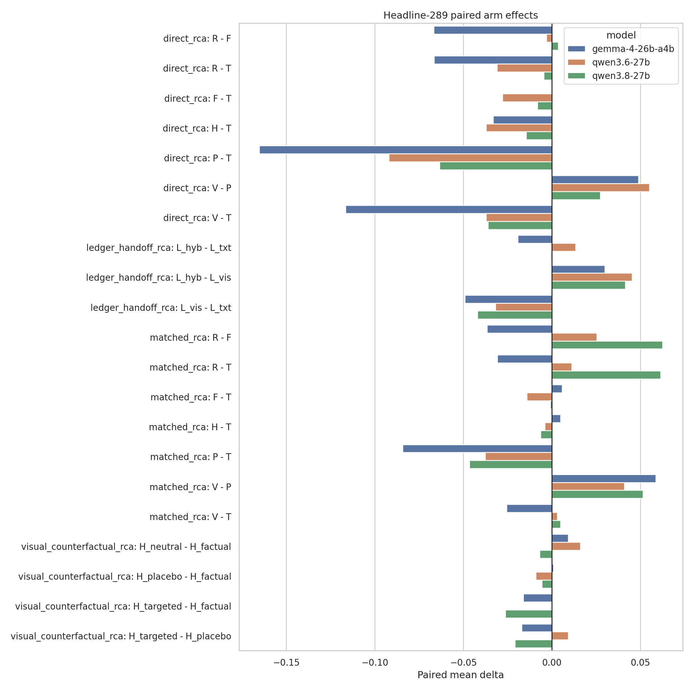

For matched RCA `R-T`, top-1 repairs exceed breaks only for Qwen3.8 (33 vs 19; net +14) and Qwen3.6 (24 vs 19; net +5, incomplete run). Gemma breaks 35 cases while repairing 25.

| model           |   n |   both_correct |   repair |   break |   both_incorrect |   net_correction |
|:----------------|----:|---------------:|---------:|--------:|-----------------:|-----------------:|
| qwen3.6-27b     | 234 |             35 |       24 |      19 |              156 |                5 |
| gemma-4-26b-a4b | 289 |             57 |       25 |      35 |              172 |              -10 |
| qwen3.8-27b     | 289 |             39 |       33 |      19 |              198 |               14 |

The full machine-readable paired table is [comparisons.csv](../tmp/rq1_result_analysis/comparisons.csv); fault/service/dataset effect modifiers are in [effect_modifiers.csv](../tmp/rq1_result_analysis/effect_modifiers.csv), and repair/break transitions in [arm_transitions.csv](../tmp/rq1_result_analysis/arm_transitions.csv).

## 6. Cost

The scientific cost comparison is **between arms within the same model**, not between models. Gemma and Qwen use different tokenizers and visual processors, so a raw Gemma-versus-Qwen token difference is not evidence that one representation is cheaper. The figures below therefore put arms on rows and models in separate columns. Each cell shows mean input tokens and, underneath, that arm's percentage of the experiment's all-text reference. Values below 100% save input tokens; values above 100% use more. Color is also keyed to this within-model percentage.

The reference is `T` for Legacy-Q9/direct/matched RCA, all-text `Mt-Rt-Lt-Gt` for cross-region and typed-two-stage QA, factual hybrid `H_factual` for counterfactual RCA, and text ledger `L_txt` for ledger handoff. Counterfactual arms are expected to be cost-matched rather than cheaper because they change image semantics while holding the input budget fixed.

### 6.1 Input-token cost by experimental arm

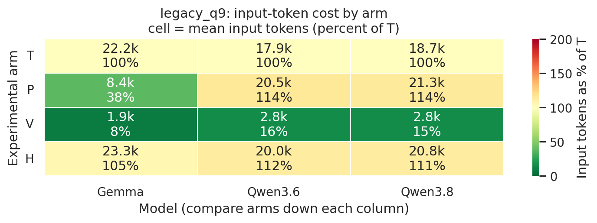

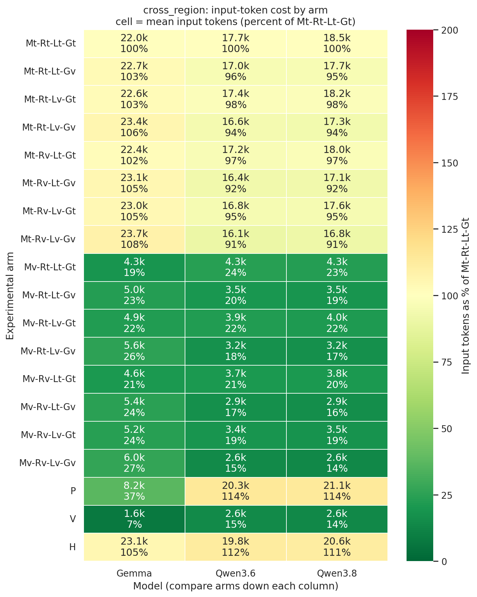

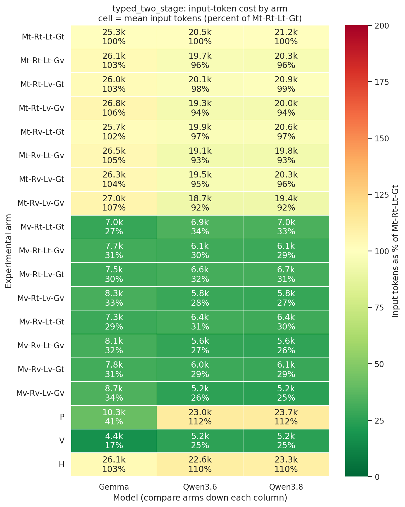

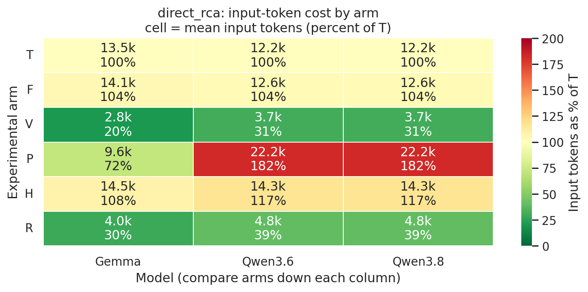

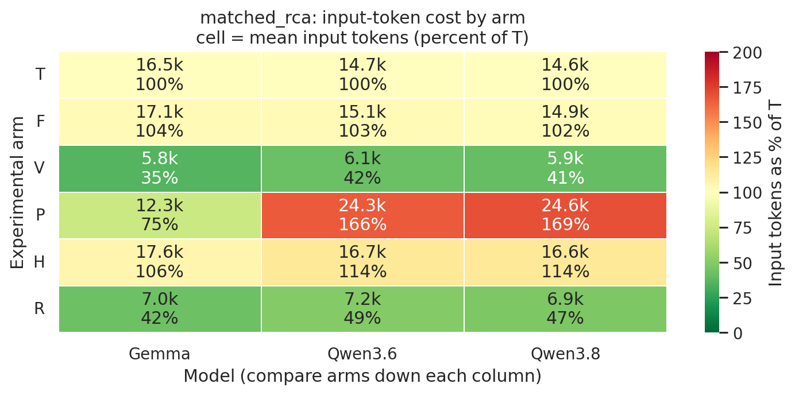

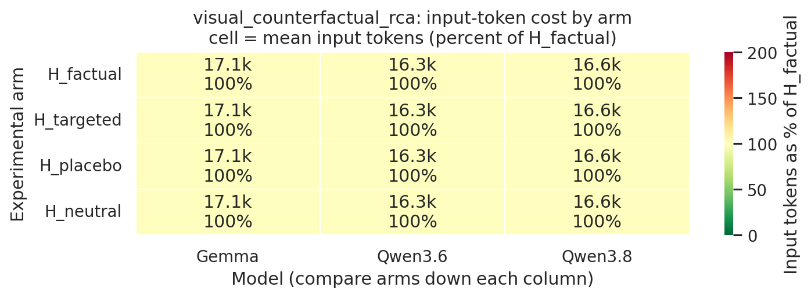

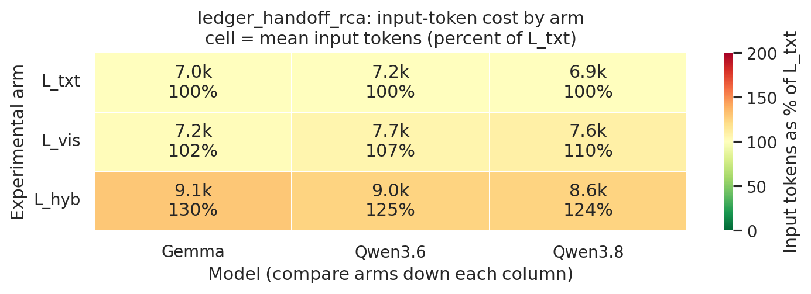

The main arm-level patterns are stable within each model. Real-dashboard `V` uses only 8–16% of the all-text input in Legacy-Q9/cross-region QA, 21–31% in direct RCA, and 35–42% in matched RCA. Routed `R` uses 30–40% of text input in direct RCA and 43–49% in matched RCA. Hybrid `H` costs 3–17% more input than the corresponding text baseline because it adds the image without removing text. Pixel-text `P` is tokenizer/processor dependent: it is cheaper for Gemma, but costs about 114% of text in Qwen QA, 182% in Qwen direct RCA, and 166–169% in Qwen matched RCA. The visual and hybrid ledger handoffs do not save tokens over `L_txt`.

The most important accuracy–cost joint result is Qwen3.8 matched RCA `R`: it raises MRR over `T` by +0.0615 while using **47.5%** of `T`'s mean input tokens. This is a within-model Pareto improvement for that experiment. It does not imply that all visual arms, or other model architectures, have the same benefit.

Show arm-centred mean input tokens and percent of reference (models are columns)

| experiment                | arm         | reference   |   Gemma input |   Gemma %ref |   Qwen3.6 input |   Qwen3.6 %ref |   Qwen3.8 input |   Qwen3.8 %ref |
|:--------------------------|:------------|:------------|--------------:|-------------:|----------------:|---------------:|----------------:|---------------:|
| legacy_q9                 | T           | T           |       22225.7 |        100   |         17926.4 |          100   |         18714.1 |          100   |
| legacy_q9                 | P           | T           |        8441.6 |         38   |         20482.5 |          114.3 |         21270.3 |          113.7 |
| legacy_q9                 | V           | T           |        1854.9 |          8.3 |          2792.6 |           15.6 |          2800.1 |           15   |
| legacy_q9                 | H           | T           |       23310.6 |        104.9 |         20011.8 |          111.6 |         20807.9 |          111.2 |
| cross_region              | Mt-Rt-Lt-Gt | Mt-Rt-Lt-Gt |       21988.5 |        100   |         17724.3 |          100   |         18517.5 |          100   |
| cross_region              | Mt-Rt-Lt-Gv | Mt-Rt-Lt-Gt |       22729.9 |        103.4 |         16953.3 |           95.7 |         17666.1 |           95.4 |
| cross_region              | Mt-Rt-Lv-Gt | Mt-Rt-Lt-Gt |       22609.5 |        102.8 |         17390.4 |           98.1 |         18189.9 |           98.2 |
| cross_region              | Mt-Rt-Lv-Gv | Mt-Rt-Lt-Gt |       23350.9 |        106.2 |         16619.4 |           93.8 |         17338.4 |           93.6 |
| cross_region              | Mt-Rv-Lt-Gt | Mt-Rt-Lt-Gt |       22358   |        101.7 |         17165.9 |           96.8 |         17968.3 |           97   |
| cross_region              | Mt-Rv-Lt-Gv | Mt-Rt-Lt-Gt |       23099.4 |        105.1 |         16394.9 |           92.5 |         17116.8 |           92.4 |
| cross_region              | Mt-Rv-Lv-Gt | Mt-Rt-Lt-Gt |       22979   |        104.5 |         16832   |           95   |         17640.7 |           95.3 |
| cross_region              | Mt-Rv-Lv-Gv | Mt-Rt-Lt-Gt |       23720.4 |        107.9 |         16061   |           90.6 |         16789.2 |           90.7 |
| cross_region              | Mv-Rt-Lt-Gt | Mt-Rt-Lt-Gt |        4250.4 |         19.3 |          4256.3 |           24   |          4330.5 |           23.4 |
| cross_region              | Mv-Rt-Lt-Gv | Mt-Rt-Lt-Gt |        4991.8 |         22.7 |          3485.4 |           19.7 |          3479   |           18.8 |
| cross_region              | Mv-Rt-Lv-Gt | Mt-Rt-Lt-Gt |        4871.4 |         22.2 |          3922.4 |           22.1 |          4002.8 |           21.6 |
| cross_region              | Mv-Rt-Lv-Gv | Mt-Rt-Lt-Gt |        5612.8 |         25.5 |          3151.5 |           17.8 |          3151.4 |           17   |
| cross_region              | Mv-Rv-Lt-Gt | Mt-Rt-Lt-Gt |        4619.9 |         21   |          3697.9 |           20.9 |          3781.3 |           20.4 |
| cross_region              | Mv-Rv-Lt-Gv | Mt-Rt-Lt-Gt |        5361.3 |         24.4 |          2927   |           16.5 |          2929.8 |           15.8 |
| cross_region              | Mv-Rv-Lv-Gt | Mt-Rt-Lt-Gt |        5240.9 |         23.8 |          3364   |           19   |          3453.6 |           18.7 |
| cross_region              | Mv-Rv-Lv-Gv | Mt-Rt-Lt-Gt |        5983.3 |         27.2 |          2593.1 |           14.6 |          2602.1 |           14.1 |
| cross_region              | P           | Mt-Rt-Lt-Gt |        8204.4 |         37.3 |         20280.4 |          114.4 |         21073.7 |          113.8 |
| cross_region              | V           | Mt-Rt-Lt-Gt |        1617.7 |          7.4 |          2590.5 |           14.6 |          2603.5 |           14.1 |
| cross_region              | H           | Mt-Rt-Lt-Gt |       23073.4 |        104.9 |         19809.7 |          111.8 |         20611.3 |          111.3 |
| typed_two_stage           | Mt-Rt-Lt-Gt | Mt-Rt-Lt-Gt |       25310.2 |        100   |         20453   |          100   |         21188.9 |          100   |
| typed_two_stage           | Mt-Rt-Lt-Gv | Mt-Rt-Lt-Gt |       26103   |        103.1 |         19659.1 |           96.1 |         20337.1 |           96   |
| typed_two_stage           | Mt-Rt-Lv-Gt | Mt-Rt-Lt-Gt |       26014.7 |        102.8 |         20087.5 |           98.2 |         20871.4 |           98.5 |
| typed_two_stage           | Mt-Rt-Lv-Gv | Mt-Rt-Lt-Gt |       26805.9 |        105.9 |         19315   |           94.4 |         20005.6 |           94.4 |
| typed_two_stage           | Mt-Rv-Lt-Gt | Mt-Rt-Lt-Gt |       25713.1 |        101.6 |         19857.4 |           97.1 |         20615.6 |           97.3 |
| typed_two_stage           | Mt-Rv-Lt-Gv | Mt-Rt-Lt-Gt |       26451.8 |        104.5 |         19086.9 |           93.3 |         19752   |           93.2 |
| typed_two_stage           | Mt-Rv-Lv-Gt | Mt-Rt-Lt-Gt |       26318.5 |        104   |         19496.3 |           95.3 |         20278.9 |           95.7 |
| typed_two_stage           | Mt-Rv-Lv-Gv | Mt-Rt-Lt-Gt |       27012.3 |        106.7 |         18742.9 |           91.6 |         19420.6 |           91.7 |
| typed_two_stage           | Mv-Rt-Lt-Gt | Mt-Rt-Lt-Gt |        6951   |         27.5 |          6939.2 |           33.9 |          7006.9 |           33.1 |
| typed_two_stage           | Mv-Rt-Lt-Gv | Mt-Rt-Lt-Gt |        7720.3 |         30.5 |          6146.6 |           30.1 |          6147.6 |           29   |
| typed_two_stage           | Mv-Rt-Lv-Gt | Mt-Rt-Lt-Gt |        7536.6 |         29.8 |          6550.6 |           32   |          6655.7 |           31.4 |
| typed_two_stage           | Mv-Rt-Lv-Gv | Mt-Rt-Lt-Gt |        8297.8 |         32.8 |          5794.7 |           28.3 |          5816.5 |           27.5 |
| typed_two_stage           | Mv-Rv-Lt-Gt | Mt-Rt-Lt-Gt |        7333.7 |         29   |          6355.2 |           31.1 |          6410.1 |           30.3 |
| typed_two_stage           | Mv-Rv-Lt-Gv | Mt-Rt-Lt-Gt |        8085.2 |         31.9 |          5556.5 |           27.2 |          5571   |           26.3 |
| typed_two_stage           | Mv-Rv-Lv-Gt | Mt-Rt-Lt-Gt |        7838.1 |         31   |          5963.4 |           29.2 |          6064.7 |           28.6 |
| typed_two_stage           | Mv-Rv-Lv-Gv | Mt-Rt-Lt-Gt |        8673.9 |         34.3 |          5227.2 |           25.6 |          5234   |           24.7 |
| typed_two_stage           | P           | Mt-Rt-Lt-Gt |       10315.8 |         40.8 |         22966.5 |          112.3 |         23721.8 |          112   |
| typed_two_stage           | V           | Mt-Rt-Lt-Gt |        4371.7 |         17.3 |          5211.7 |           25.5 |          5231.6 |           24.7 |
| typed_two_stage           | H           | Mt-Rt-Lt-Gt |       26115.2 |        103.2 |         22553.1 |          110.3 |         23303.6 |          110   |
| direct_rca                | T           | T           |       13452.2 |        100   |         12189.9 |          100   |         12189.9 |          100   |
| direct_rca                | F           | T           |       14051.1 |        104.5 |         12635.8 |          103.7 |         12635.8 |          103.7 |
| direct_rca                | V           | T           |        2755.6 |         20.5 |          3729   |           30.6 |          3729   |           30.6 |
| direct_rca                | P           | T           |        9648   |         71.7 |         22199.2 |          182.1 |         22199.2 |          182.1 |
| direct_rca                | H           | T           |       14537.3 |        108.1 |         14283.7 |          117.2 |         14283.7 |          117.2 |
| direct_rca                | R           | T           |        3976.7 |         29.6 |          4812.9 |           39.5 |          4812.9 |           39.5 |
| matched_rca               | T           | T           |       16519.1 |        100   |         14661   |          100   |         14558.5 |          100   |
| matched_rca               | F           | T           |       17129.8 |        103.7 |         15143.3 |          103.3 |         14917.6 |          102.5 |
| matched_rca               | V           | T           |        5822.2 |         35.2 |          6101.1 |           41.6 |          5904.9 |           40.6 |
| matched_rca               | P           | T           |       12307.5 |         74.5 |         24294.5 |          165.7 |         24595.7 |          168.9 |
| matched_rca               | H           | T           |       17584   |        106.4 |         16728.4 |          114.1 |         16607.5 |          114.1 |
| matched_rca               | R           | T           |        7020   |         42.5 |          7241.6 |           49.4 |          6912.1 |           47.5 |
| visual_counterfactual_rca | H_factual   | H_factual   |       17081.5 |        100   |         16308.7 |          100   |         16625.8 |          100   |
| visual_counterfactual_rca | H_targeted  | H_factual   |       17072.7 |         99.9 |         16302   |          100   |         16624.3 |          100   |
| visual_counterfactual_rca | H_placebo   | H_factual   |       17074.7 |        100   |         16297.6 |           99.9 |         16601.5 |           99.9 |
| visual_counterfactual_rca | H_neutral   | H_factual   |       17065.5 |         99.9 |         16288.9 |           99.9 |         16627.1 |          100   |
| ledger_handoff_rca        | L_txt       | L_txt       |        7003.3 |        100   |          7218.7 |          100   |          6909.6 |          100   |
| ledger_handoff_rca        | L_vis       | L_txt       |        7162   |        102.3 |          7688   |          106.5 |          7590.5 |          109.9 |
| ledger_handoff_rca        | L_hyb       | L_txt       |        9088.7 |        129.8 |          9005.6 |          124.8 |          8597.2 |          124.4 |

`mean_text_tokens` and `mean_image_tokens` are the two input components, `mean_input_tokens` is their recorded request-level input total, `mean_output_tokens` is generated text, and `mean_total_tokens` is input plus output. `mean_model_calls` distinguishes one-stage from two-stage pipelines. The following detailed table retains all components and uses one row per experiment/model/arm, but it is secondary to the arm-first comparison above.

Show every arm's full all-469 token components

| experiment                | model           | arm         |   n |   mean_text_tokens |   mean_image_tokens |   mean_input_tokens |   mean_output_tokens |   mean_total_tokens |   mean_model_calls |
|:--------------------------|:----------------|:------------|----:|-------------------:|--------------------:|--------------------:|---------------------:|--------------------:|-------------------:|
| cross_region              | gemma-4-26b-a4b | H           | 469 |          21988.5   |            1084.91  |            23073.4  |             163.516  |            23236.9  |                  1 |
| cross_region              | gemma-4-26b-a4b | Mt-Rt-Lt-Gt | 469 |          21988.5   |               0     |            21988.5  |             159.925  |            22148.4  |                  1 |
| cross_region              | gemma-4-26b-a4b | Mt-Rt-Lt-Gv | 469 |          20588.4   |            2141.49  |            22729.9  |             162.691  |            22892.6  |                  1 |
| cross_region              | gemma-4-26b-a4b | Mt-Rt-Lv-Gt | 469 |          21500.5   |            1109     |            22609.5  |             165.006  |            22774.5  |                  1 |
| cross_region              | gemma-4-26b-a4b | Mt-Rt-Lv-Gv | 469 |          20100.4   |            3250.49  |            23350.9  |             167.539  |            23518.4  |                  1 |
| cross_region              | gemma-4-26b-a4b | Mt-Rv-Lt-Gt | 469 |          21249     |            1109     |            22358    |             162.471  |            22520.5  |                  1 |
| cross_region              | gemma-4-26b-a4b | Mt-Rv-Lt-Gv | 469 |          19848.9   |            3250.49  |            23099.4  |             164.126  |            23263.5  |                  1 |
| cross_region              | gemma-4-26b-a4b | Mt-Rv-Lv-Gt | 469 |          20761     |            2218     |            22979    |             166.006  |            23145    |                  1 |
| cross_region              | gemma-4-26b-a4b | Mt-Rv-Lv-Gv | 469 |          19360.9   |            4359.49  |            23720.4  |             169.524  |            23889.9  |                  1 |
| cross_region              | gemma-4-26b-a4b | Mv-Rt-Lt-Gt | 469 |           3159.42  |            1091     |             4250.42 |             162.117  |             4412.53 |                  1 |
| cross_region              | gemma-4-26b-a4b | Mv-Rt-Lt-Gv | 469 |           1759.3   |            3232.49  |             4991.79 |             162.885  |             5154.68 |                  1 |
| cross_region              | gemma-4-26b-a4b | Mv-Rt-Lv-Gt | 469 |           2671.42  |            2200     |             4871.42 |             166.524  |             5037.95 |                  1 |
| cross_region              | gemma-4-26b-a4b | Mv-Rt-Lv-Gv | 469 |           1271.31  |            4341.49  |             5612.8  |             168.571  |             5781.37 |                  1 |
| cross_region              | gemma-4-26b-a4b | Mv-Rv-Lt-Gt | 469 |           2419.93  |            2200     |             4619.93 |             162.951  |             4782.88 |                  1 |
| cross_region              | gemma-4-26b-a4b | Mv-Rv-Lt-Gv | 469 |           1019.82  |            4341.49  |             5361.31 |             164.964  |             5526.27 |                  1 |
| cross_region              | gemma-4-26b-a4b | Mv-Rv-Lv-Gt | 469 |           1931.94  |            3309     |             5240.94 |             167.388  |             5408.33 |                  1 |
| cross_region              | gemma-4-26b-a4b | Mv-Rv-Lv-Gv | 469 |            532.827 |            5450.49  |             5983.32 |             171.06   |             6154.38 |                  1 |
| cross_region              | gemma-4-26b-a4b | P           | 469 |            532.827 |            7671.58  |             8204.41 |             162.275  |             8366.68 |                  1 |
| cross_region              | gemma-4-26b-a4b | V           | 469 |            532.827 |            1084.91  |             1617.74 |             169.676  |             1787.42 |                  1 |
| cross_region              | qwen3.6-27b     | H           | 469 |          17724.3   |            2085.39  |            19809.7  |             159.365  |            19969.1  |                  1 |
| cross_region              | qwen3.6-27b     | Mt-Rt-Lt-Gt | 469 |          17724.3   |               0     |            17724.3  |             158.925  |            17883.2  |                  1 |
| cross_region              | qwen3.6-27b     | Mt-Rt-Lt-Gv | 469 |          16432.4   |             520.955 |            16953.3  |             159.094  |            17112.4  |                  1 |
| cross_region              | qwen3.6-27b     | Mt-Rt-Lv-Gt | 469 |          17292.4   |              98     |            17390.4  |             159.431  |            17549.8  |                  1 |
| cross_region              | qwen3.6-27b     | Mt-Rt-Lv-Gv | 469 |          16000.5   |             618.955 |            16619.4  |             159.512  |            16778.9  |                  1 |
| cross_region              | qwen3.6-27b     | Mt-Rv-Lt-Gt | 469 |          17067.9   |              98     |            17165.9  |             158.881  |            17324.8  |                  1 |
| cross_region              | qwen3.6-27b     | Mt-Rv-Lt-Gv | 469 |          15776     |             618.955 |            16394.9  |             158.501  |            16553.4  |                  1 |
| cross_region              | qwen3.6-27b     | Mt-Rv-Lv-Gt | 469 |          16636     |             196     |            16832    |             160.2    |            16992.2  |                  1 |
| cross_region              | qwen3.6-27b     | Mt-Rv-Lv-Gv | 469 |          15344.1   |             716.955 |            16061    |             160.706  |            16221.7  |                  1 |
| cross_region              | qwen3.6-27b     | Mv-Rt-Lt-Gt | 469 |           2885.35  |            1371     |             4256.35 |             158.222  |             4414.57 |                  1 |
| cross_region              | qwen3.6-27b     | Mv-Rt-Lt-Gv | 469 |           1593.4   |            1891.96  |             3485.36 |             158.885  |             3644.24 |                  1 |
| cross_region              | qwen3.6-27b     | Mv-Rt-Lv-Gt | 469 |           2453.45  |            1469     |             3922.45 |             159.388  |             4081.83 |                  1 |
| cross_region              | qwen3.6-27b     | Mv-Rt-Lv-Gv | 469 |           1161.5   |            1989.96  |             3151.45 |             159.55   |             3311    |                  1 |
| cross_region              | qwen3.6-27b     | Mv-Rv-Lt-Gt | 469 |           2228.94  |            1469     |             3697.94 |             159.795  |             3857.74 |                  1 |
| cross_region              | qwen3.6-27b     | Mv-Rv-Lt-Gv | 469 |            936.998 |            1989.96  |             2926.95 |             160.537  |             3087.49 |                  1 |
| cross_region              | qwen3.6-27b     | Mv-Rv-Lv-Gt | 469 |           1797.04  |            1567     |             3364.04 |             160.038  |             3524.08 |                  1 |
| cross_region              | qwen3.6-27b     | Mv-Rv-Lv-Gv | 469 |            505.096 |            2087.96  |             2593.05 |             162.051  |             2755.1  |                  1 |
| cross_region              | qwen3.6-27b     | P           | 469 |            505.096 |           19775.3   |            20280.4  |             158.038  |            20438.4  |                  1 |
| cross_region              | qwen3.6-27b     | V           | 469 |            505.096 |            2085.39  |             2590.48 |             161.77   |             2752.25 |                  1 |
| cross_region              | qwen3.8-27b     | H           | 469 |          18517.5   |            2093.75  |            20611.3  |             169.625  |            20780.9  |                  1 |
| cross_region              | qwen3.8-27b     | Mt-Rt-Lt-Gt | 469 |          18517.5   |               0     |            18517.5  |             164.495  |            18682    |                  1 |
| cross_region              | qwen3.8-27b     | Mt-Rt-Lt-Gv | 469 |          17140.7   |             525.343 |            17666.1  |             167.111  |            17833.2  |                  1 |
| cross_region              | qwen3.8-27b     | Mt-Rt-Lv-Gt | 469 |          18091.9   |              98     |            18189.9  |             170.819  |            18360.7  |                  1 |
| cross_region              | qwen3.8-27b     | Mt-Rt-Lv-Gv | 469 |          16715.1   |             623.343 |            17338.4  |             170.93   |            17509.3  |                  1 |
| cross_region              | qwen3.8-27b     | Mt-Rv-Lt-Gt | 469 |          17870.3   |              98     |            17968.3  |             167.834  |            18136.2  |                  1 |
| cross_region              | qwen3.8-27b     | Mt-Rv-Lt-Gv | 469 |          16493.5   |             623.343 |            17116.8  |             166.985  |            17283.8  |                  1 |
| cross_region              | qwen3.8-27b     | Mt-Rv-Lv-Gt | 469 |          17444.7   |             196     |            17640.7  |             171.196  |            17811.9  |                  1 |
| cross_region              | qwen3.8-27b     | Mt-Rv-Lv-Gv | 469 |          16067.8   |             721.343 |            16789.2  |             170.277  |            16959.5  |                  1 |
| cross_region              | qwen3.8-27b     | Mv-Rt-Lt-Gt | 469 |           2959.5   |            1371     |             4330.5  |             172.834  |             4503.33 |                  1 |
| cross_region              | qwen3.8-27b     | Mv-Rt-Lt-Gv | 469 |           1582.68  |            1896.34  |             3479.02 |             170.458  |             3649.48 |                  1 |
| cross_region              | qwen3.8-27b     | Mv-Rt-Lv-Gt | 469 |           2533.84  |            1469     |             4002.84 |             174.081  |             4176.92 |                  1 |
| cross_region              | qwen3.8-27b     | Mv-Rt-Lv-Gv | 469 |           1157.02  |            1994.34  |             3151.36 |             169.407  |             3320.77 |                  1 |
| cross_region              | qwen3.8-27b     | Mv-Rv-Lt-Gt | 469 |           2312.28  |            1469     |             3781.28 |             172.906  |             3954.19 |                  1 |
| cross_region              | qwen3.8-27b     | Mv-Rv-Lt-Gv | 469 |            935.463 |            1994.34  |             2929.81 |             167.761  |             3097.57 |                  1 |
| cross_region              | qwen3.8-27b     | Mv-Rv-Lv-Gt | 469 |           1886.62  |            1567     |             3453.62 |             172.778  |             3626.4  |                  1 |
| cross_region              | qwen3.8-27b     | Mv-Rv-Lv-Gv | 469 |            509.802 |            2092.34  |             2602.14 |             189.866  |             2792.01 |                  1 |
| cross_region              | qwen3.8-27b     | P           | 469 |            509.802 |           20563.9   |            21073.7  |             161.618  |            21235.4  |                  1 |
| cross_region              | qwen3.8-27b     | V           | 469 |            509.802 |            2093.75  |             2603.55 |             170.716  |             2774.26 |                  1 |
| direct_rca                | gemma-4-26b-a4b | F           | 469 |          14051.1   |               0     |            14051.1  |              80.2132 |            14131.3  |                  1 |
| direct_rca                | gemma-4-26b-a4b | H           | 469 |          13452.2   |            1085.11  |            14537.3  |              83.4115 |            14620.8  |                  1 |
| direct_rca                | gemma-4-26b-a4b | P           | 469 |           1670.5   |            7977.51  |             9648.01 |              65.2601 |             9713.28 |                  1 |
| direct_rca                | gemma-4-26b-a4b | R           | 469 |           2891.55  |            1085.11  |             3976.66 |              75.4755 |             4052.13 |                  1 |
| direct_rca                | gemma-4-26b-a4b | T           | 469 |          13452.2   |               0     |            13452.2  |              83.42   |            13535.7  |                  1 |
| direct_rca                | gemma-4-26b-a4b | V           | 469 |           1670.5   |            1085.11  |             2755.61 |              70.8977 |             2826.51 |                  1 |
| direct_rca                | qwen3.6-27b     | F           | 469 |          12635.8   |               0     |            12635.8  |             114.073  |            12749.8  |                  1 |
| direct_rca                | qwen3.6-27b     | H           | 469 |          12189.9   |            2093.75  |            14283.7  |             104.416  |            14388.1  |                  1 |
| direct_rca                | qwen3.6-27b     | P           | 469 |           1635.27  |           20563.9   |            22199.2  |              95.629  |            22294.8  |                  1 |
| direct_rca                | qwen3.6-27b     | R           | 469 |           2719.15  |            2093.75  |             4812.89 |             100.153  |             4913.05 |                  1 |
| direct_rca                | qwen3.6-27b     | T           | 469 |          12189.9   |               0     |            12189.9  |             115.29   |            12305.2  |                  1 |
| direct_rca                | qwen3.6-27b     | V           | 469 |           1635.27  |            2093.75  |             3729.02 |             101.561  |             3830.58 |                  1 |
| direct_rca                | qwen3.8-27b     | F           | 469 |          12635.8   |               0     |            12635.8  |             162.326  |            12798.1  |                  1 |
| direct_rca                | qwen3.8-27b     | H           | 469 |          12189.9   |            2093.75  |            14283.7  |             142.288  |            14426    |                  1 |
| direct_rca                | qwen3.8-27b     | P           | 469 |           1635.27  |           20563.9   |            22199.2  |             170.817  |            22370    |                  1 |
| direct_rca                | qwen3.8-27b     | R           | 469 |           2719.15  |            2093.75  |             4812.89 |             145.753  |             4958.65 |                  1 |
| direct_rca                | qwen3.8-27b     | T           | 469 |          12189.9   |               0     |            12189.9  |             182.298  |            12372.2  |                  1 |
| direct_rca                | qwen3.8-27b     | V           | 469 |           1635.27  |            2093.75  |             3729.02 |             143.424  |             3872.44 |                  1 |
| ledger_handoff_rca        | gemma-4-26b-a4b | L_hyb       | 469 |           5918.2   |            3170.47  |             9088.67 |             392.273  |             9480.94 |                  2 |
| ledger_handoff_rca        | gemma-4-26b-a4b | L_txt       | 469 |           5918.2   |            1085.11  |             7003.3  |             392.976  |             7396.28 |                  2 |
| ledger_handoff_rca        | gemma-4-26b-a4b | L_vis       | 469 |           3991.49  |            3170.47  |             7161.96 |             388.243  |             7550.2  |                  2 |
| ledger_handoff_rca        | qwen3.6-27b     | L_hyb       | 469 |           5125.56  |            3880.07  |             9005.64 |             336.072  |             9341.71 |                  2 |
| ledger_handoff_rca        | qwen3.6-27b     | L_txt       | 469 |           5125.56  |            2093.12  |             7218.68 |             347.714  |             7566.4  |                  2 |
| ledger_handoff_rca        | qwen3.6-27b     | L_vis       | 469 |           3807.97  |            3880.07  |             7688.04 |             333.554  |             8021.59 |                  2 |
| ledger_handoff_rca        | qwen3.8-27b     | L_hyb       | 469 |           4815.81  |            3781.42  |             8597.23 |             288.859  |             8886.09 |                  2 |
| ledger_handoff_rca        | qwen3.8-27b     | L_txt       | 469 |           4815.81  |            2093.75  |             6909.56 |             276.414  |             7185.97 |                  2 |
| ledger_handoff_rca        | qwen3.8-27b     | L_vis       | 469 |           3809.09  |            3781.42  |             7590.51 |             295.755  |             7886.26 |                  2 |
| legacy_q9                 | gemma-4-26b-a4b | H           | 469 |          22225.7   |            1084.91  |            23310.6  |             364.126  |            23674.7  |                  1 |
| legacy_q9                 | gemma-4-26b-a4b | P           | 469 |            769.994 |            7671.58  |             8441.57 |             364.058  |             8805.63 |                  1 |
| legacy_q9                 | gemma-4-26b-a4b | T           | 469 |          22225.7   |               0     |            22225.7  |             363.211  |            22588.9  |                  1 |
| legacy_q9                 | gemma-4-26b-a4b | V           | 469 |            769.994 |            1084.91  |             1854.91 |             365.215  |             2220.12 |                  1 |
| legacy_q9                 | qwen3.6-27b     | H           | 469 |          17926.4   |            2085.39  |            20011.8  |             354.124  |            20365.9  |                  1 |
| legacy_q9                 | qwen3.6-27b     | P           | 469 |            707.186 |           19775.3   |            20482.5  |             356.168  |            20838.7  |                  1 |
| legacy_q9                 | qwen3.6-27b     | T           | 469 |          17926.4   |               0     |            17926.4  |             352.947  |            18279.3  |                  1 |
| legacy_q9                 | qwen3.6-27b     | V           | 469 |            707.186 |            2085.39  |             2792.57 |             353.951  |             3146.52 |                  1 |
| legacy_q9                 | qwen3.8-27b     | H           | 469 |          18714.1   |            2093.75  |            20807.9  |             345.991  |            21153.9  |                  1 |
| legacy_q9                 | qwen3.8-27b     | P           | 469 |            706.38  |           20563.9   |            21270.3  |             345.548  |            21615.9  |                  1 |
| legacy_q9                 | qwen3.8-27b     | T           | 469 |          18714.1   |               0     |            18714.1  |             345.94   |            19060.1  |                  1 |
| legacy_q9                 | qwen3.8-27b     | V           | 469 |            706.38  |            2093.75  |             2800.13 |             346.422  |             3146.55 |                  1 |
| matched_rca               | gemma-4-26b-a4b | F           | 469 |          17129.8   |               0     |            17129.8  |             420.8    |            17550.6  |                  2 |
| matched_rca               | gemma-4-26b-a4b | H           | 469 |          16498.9   |            1085.11  |            17584    |             405.546  |            17989.6  |                  2 |
| matched_rca               | gemma-4-26b-a4b | P           | 469 |           4330.01  |            7977.51  |            12307.5  |             426.945  |            12734.5  |                  2 |
| matched_rca               | gemma-4-26b-a4b | R           | 469 |           5934.87  |            1085.11  |             7019.98 |             393.691  |             7413.67 |                  2 |
| matched_rca               | gemma-4-26b-a4b | T           | 469 |          16519.1   |               0     |            16519.1  |             416.13   |            16935.2  |                  2 |
| matched_rca               | gemma-4-26b-a4b | V           | 469 |           4737.11  |            1085.11  |             5822.22 |             402.802  |             6225.02 |                  2 |
| matched_rca               | qwen3.6-27b     | F           | 469 |          15143.3   |               0     |            15143.3  |             367.241  |            15510.5  |                  2 |
| matched_rca               | qwen3.6-27b     | H           | 469 |          14634.8   |            2093.64  |            16728.4  |             348.955  |            17077.4  |                  2 |
| matched_rca               | qwen3.6-27b     | P           | 414 |           4023.98  |           20270.5   |            24294.5  |             345.92   |            24640.4  |                  2 |
| matched_rca               | qwen3.6-27b     | R           | 469 |           5148.31  |            2093.33  |             7241.64 |             345.224  |             7586.86 |                  2 |
| matched_rca               | qwen3.6-27b     | T           | 469 |          14661     |               0     |            14661    |             355.635  |            15016.6  |                  2 |
| matched_rca               | qwen3.6-27b     | V           | 469 |           4007.82  |            2093.33  |             6101.15 |             342.239  |             6443.39 |                  2 |
| matched_rca               | qwen3.8-27b     | F           | 469 |          14917.6   |               0     |            14917.6  |             312.401  |            15230    |                  2 |
| matched_rca               | qwen3.8-27b     | H           | 469 |          14513.7   |            2093.75  |            16607.5  |             318.013  |            16925.5  |                  2 |
| matched_rca               | qwen3.8-27b     | P           | 469 |           4031.8   |           20563.9   |            24595.7  |             329.778  |            24925.5  |                  2 |
| matched_rca               | qwen3.8-27b     | R           | 469 |           4818.35  |            2093.75  |             6912.1  |             273.874  |             7185.97 |                  2 |
| matched_rca               | qwen3.8-27b     | T           | 469 |          14558.5   |               0     |            14558.5  |             326.083  |            14884.6  |                  2 |
| matched_rca               | qwen3.8-27b     | V           | 469 |           3811.16  |            2093.75  |             5904.91 |             292.478  |             6197.38 |                  2 |
| typed_two_stage           | gemma-4-26b-a4b | H           | 469 |          25030.2   |            1084.99  |            26115.2  |             355.925  |            26471.1  |                  2 |
| typed_two_stage           | gemma-4-26b-a4b | Mt-Rt-Lt-Gt | 469 |          25310.2   |               0     |            25310.2  |             351.674  |            25661.9  |                  2 |
| typed_two_stage           | gemma-4-26b-a4b | Mt-Rt-Lt-Gv | 469 |          23960.1   |            2142.92  |            26103    |             352.738  |            26455.8  |                  2 |
| typed_two_stage           | gemma-4-26b-a4b | Mt-Rt-Lv-Gt | 469 |          24905.7   |            1109     |            26014.7  |             363.298  |            26378    |                  2 |
| typed_two_stage           | gemma-4-26b-a4b | Mt-Rt-Lv-Gv | 469 |          23553.9   |            3251.96  |            26805.9  |             347.599  |            27153.5  |                  2 |
| typed_two_stage           | gemma-4-26b-a4b | Mt-Rv-Lt-Gt | 469 |          24604.1   |            1109     |            25713.1  |             344.324  |            26057.5  |                  2 |
| typed_two_stage           | gemma-4-26b-a4b | Mt-Rv-Lt-Gv | 469 |          23199.5   |            3252.28  |            26451.8  |             342.339  |            26794.2  |                  2 |
| typed_two_stage           | gemma-4-26b-a4b | Mt-Rv-Lv-Gt | 469 |          24100.5   |            2218     |            26318.5  |             339.313  |            26657.8  |                  2 |
| typed_two_stage           | gemma-4-26b-a4b | Mt-Rv-Lv-Gv | 469 |          22651.1   |            4361.22  |            27012.3  |             355.93   |            27368.3  |                  2 |
| typed_two_stage           | gemma-4-26b-a4b | Mv-Rt-Lt-Gt | 469 |           5860     |            1091     |             6951    |             353.672  |             7304.67 |                  2 |
| typed_two_stage           | gemma-4-26b-a4b | Mv-Rt-Lt-Gv | 469 |           4486.05  |            3234.22  |             7720.26 |             354.524  |             8074.79 |                  2 |
| typed_two_stage           | gemma-4-26b-a4b | Mv-Rt-Lv-Gt | 469 |           5336.61  |            2200     |             7536.61 |             387.021  |             7923.64 |                  2 |
| typed_two_stage           | gemma-4-26b-a4b | Mv-Rt-Lv-Gv | 469 |           3954.74  |            4343.06  |             8297.79 |             420.733  |             8718.52 |                  2 |
| typed_two_stage           | gemma-4-26b-a4b | Mv-Rv-Lt-Gt | 469 |           5133.66  |            2200     |             7333.66 |             348.143  |             7681.8  |                  2 |
| typed_two_stage           | gemma-4-26b-a4b | Mv-Rv-Lt-Gv | 469 |           3742.21  |            4342.95  |             8085.16 |             348.245  |             8433.41 |                  2 |
| typed_two_stage           | gemma-4-26b-a4b | Mv-Rv-Lv-Gt | 469 |           4529.07  |            3309     |             7838.07 |             378.702  |             8216.77 |                  2 |
| typed_two_stage           | gemma-4-26b-a4b | Mv-Rv-Lv-Gv | 469 |           3221.86  |            5452.02  |             8673.88 |             375.637  |             9049.52 |                  2 |
| typed_two_stage           | gemma-4-26b-a4b | P           | 469 |           2563.06  |            7752.7   |            10315.8  |             351.006  |            10666.8  |                  2 |
| typed_two_stage           | gemma-4-26b-a4b | V           | 469 |           3286.7   |            1084.99  |             4371.69 |             391.499  |             4763.19 |                  2 |
| typed_two_stage           | qwen3.6-27b     | H           | 469 |          20467.7   |            2085.39  |            22553.1  |             325.109  |            22878.2  |                  2 |
| typed_two_stage           | qwen3.6-27b     | Mt-Rt-Lt-Gt | 469 |          20453     |               0     |            20453    |             323.957  |            20776.9  |                  2 |
| typed_two_stage           | qwen3.6-27b     | Mt-Rt-Lt-Gv | 469 |          19138.2   |             520.955 |            19659.1  |             326.271  |            19985.4  |                  2 |
| typed_two_stage           | qwen3.6-27b     | Mt-Rt-Lv-Gt | 469 |          19989.5   |              98     |            20087.5  |             323.842  |            20411.3  |                  2 |
| typed_two_stage           | qwen3.6-27b     | Mt-Rt-Lv-Gv | 469 |          18696.1   |             618.955 |            19315    |             323.9    |            19638.9  |                  2 |
| typed_two_stage           | qwen3.6-27b     | Mt-Rv-Lt-Gt | 469 |          19759.4   |              98     |            19857.4  |             322.211  |            20179.6  |                  2 |
| typed_two_stage           | qwen3.6-27b     | Mt-Rv-Lt-Gv | 469 |          18468     |             618.955 |            19086.9  |             322.74   |            19409.7  |                  2 |
| typed_two_stage           | qwen3.6-27b     | Mt-Rv-Lv-Gt | 469 |          19300.3   |             196     |            19496.3  |             320.716  |            19817    |                  2 |
| typed_two_stage           | qwen3.6-27b     | Mt-Rv-Lv-Gv | 469 |          18026     |             716.955 |            18742.9  |             321.497  |            19064.4  |                  2 |
| typed_two_stage           | qwen3.6-27b     | Mv-Rt-Lt-Gt | 469 |           5568.16  |            1371     |             6939.16 |             324.36   |             7263.52 |                  2 |
| typed_two_stage           | qwen3.6-27b     | Mv-Rt-Lt-Gv | 469 |           4254.67  |            1891.96  |             6146.62 |             324.075  |             6470.7  |                  2 |
| typed_two_stage           | qwen3.6-27b     | Mv-Rt-Lv-Gt | 469 |           5081.56  |            1469     |             6550.56 |             323.164  |             6873.72 |                  2 |
| typed_two_stage           | qwen3.6-27b     | Mv-Rt-Lv-Gv | 469 |           3804.76  |            1989.96  |             5794.71 |             322.533  |             6117.25 |                  2 |
| typed_two_stage           | qwen3.6-27b     | Mv-Rv-Lt-Gt | 469 |           4886.16  |            1469     |             6355.16 |             321.787  |             6676.94 |                  2 |
| typed_two_stage           | qwen3.6-27b     | Mv-Rv-Lt-Gv | 469 |           3566.55  |            1989.96  |             5556.5  |             322.772  |             5879.28 |                  2 |
| typed_two_stage           | qwen3.6-27b     | Mv-Rv-Lv-Gt | 469 |           4396.36  |            1567     |             5963.36 |             321.441  |             6284.8  |                  2 |
| typed_two_stage           | qwen3.6-27b     | Mv-Rv-Lv-Gv | 469 |           3139.2   |            2087.96  |             5227.15 |             322.45   |             5549.6  |                  2 |
| typed_two_stage           | qwen3.6-27b     | P           | 469 |           3191.23  |           19775.3   |            22966.5  |             323.827  |            23290.4  |                  2 |
| typed_two_stage           | qwen3.6-27b     | V           | 469 |           3126.36  |            2085.39  |             5211.75 |             321.738  |             5533.49 |                  2 |
| typed_two_stage           | qwen3.8-27b     | H           | 469 |          21209.8   |            2093.75  |            23303.6  |             335.482  |            23639.1  |                  2 |
| typed_two_stage           | qwen3.8-27b     | Mt-Rt-Lt-Gt | 469 |          21188.9   |               0     |            21188.9  |             334.67   |            21523.6  |                  2 |
| typed_two_stage           | qwen3.8-27b     | Mt-Rt-Lt-Gv | 469 |          19811.8   |             525.343 |            20337.1  |             333.446  |            20670.5  |                  2 |
| typed_two_stage           | qwen3.8-27b     | Mt-Rt-Lv-Gt | 469 |          20773.4   |              98     |            20871.4  |             350.761  |            21222.2  |                  2 |
| typed_two_stage           | qwen3.8-27b     | Mt-Rt-Lv-Gv | 469 |          19382.2   |             623.343 |            20005.6  |             333.034  |            20338.6  |                  2 |
| typed_two_stage           | qwen3.8-27b     | Mt-Rv-Lt-Gt | 469 |          20517.6   |              98     |            20615.6  |             333.051  |            20948.7  |                  2 |
| typed_two_stage           | qwen3.8-27b     | Mt-Rv-Lt-Gv | 469 |          19128.7   |             623.343 |            19752    |             331.904  |            20083.9  |                  2 |
| typed_two_stage           | qwen3.8-27b     | Mt-Rv-Lv-Gt | 469 |          20082.9   |             196     |            20278.9  |             332.051  |            20611    |                  2 |
| typed_two_stage           | qwen3.8-27b     | Mt-Rv-Lv-Gv | 469 |          18699.2   |             721.343 |            19420.6  |             331.405  |            19752    |                  2 |
| typed_two_stage           | qwen3.8-27b     | Mv-Rt-Lt-Gt | 469 |           5635.88  |            1371     |             7006.88 |             334.994  |             7341.88 |                  2 |
| typed_two_stage           | qwen3.8-27b     | Mv-Rt-Lt-Gv | 469 |           4251.25  |            1896.34  |             6147.59 |             333.964  |             6481.55 |                  2 |
| typed_two_stage           | qwen3.8-27b     | Mv-Rt-Lv-Gt | 469 |           5186.69  |            1469     |             6655.69 |             333.689  |             6989.38 |                  2 |
| typed_two_stage           | qwen3.8-27b     | Mv-Rt-Lv-Gv | 469 |           3822.2   |            1994.34  |             5816.54 |             332.902  |             6149.44 |                  2 |
| typed_two_stage           | qwen3.8-27b     | Mv-Rv-Lt-Gt | 469 |           4941.14  |            1469     |             6410.14 |             332.994  |             6743.13 |                  2 |
| typed_two_stage           | qwen3.8-27b     | Mv-Rv-Lt-Gv | 469 |           3576.7   |            1994.34  |             5571.04 |             332.723  |             5903.76 |                  2 |
| typed_two_stage           | qwen3.8-27b     | Mv-Rv-Lv-Gt | 469 |           4497.67  |            1567     |             6064.67 |             331.311  |             6395.98 |                  2 |
| typed_two_stage           | qwen3.8-27b     | Mv-Rv-Lv-Gv | 469 |           3141.62  |            2092.34  |             5233.96 |             331.804  |             5565.77 |                  2 |
| typed_two_stage           | qwen3.8-27b     | P           | 469 |           3157.85  |           20563.9   |            23721.8  |             333.569  |            24055.3  |                  2 |
| typed_two_stage           | qwen3.8-27b     | V           | 469 |           3137.88  |            2093.75  |             5231.62 |             331.783  |             5563.41 |                  2 |
| visual_counterfactual_rca | gemma-4-26b-a4b | H_factual   | 416 |          15996.5   |            1084.97  |            17081.5  |             408.079  |            17489.6  |                  2 |
| visual_counterfactual_rca | gemma-4-26b-a4b | H_neutral   | 416 |          15980.5   |            1084.97  |            17065.5  |             415.087  |            17480.6  |                  2 |
| visual_counterfactual_rca | gemma-4-26b-a4b | H_placebo   | 416 |          15989.7   |            1084.97  |            17074.7  |             406.668  |            17481.4  |                  2 |
| visual_counterfactual_rca | gemma-4-26b-a4b | H_targeted  | 416 |          15987.8   |            1084.97  |            17072.7  |             406      |            17478.7  |                  2 |
| visual_counterfactual_rca | qwen3.6-27b     | H_factual   | 416 |          14221.9   |            2086.74  |            16308.7  |             354.82   |            16663.5  |                  2 |
| visual_counterfactual_rca | qwen3.6-27b     | H_neutral   | 416 |          14202.2   |            2086.74  |            16288.9  |             344.127  |            16633    |                  2 |
| visual_counterfactual_rca | qwen3.6-27b     | H_placebo   | 416 |          14210.9   |            2086.74  |            16297.6  |             346.81   |            16644.4  |                  2 |
| visual_counterfactual_rca | qwen3.6-27b     | H_targeted  | 416 |          14215.3   |            2086.74  |            16302    |             349.216  |            16651.2  |                  2 |
| visual_counterfactual_rca | qwen3.8-27b     | H_factual   | 430 |          14532.8   |            2092.93  |            16625.8  |             318.556  |            16944.3  |                  2 |
| visual_counterfactual_rca | qwen3.8-27b     | H_neutral   | 430 |          14534.1   |            2092.93  |            16627.1  |             318.674  |            16945.8  |                  2 |
| visual_counterfactual_rca | qwen3.8-27b     | H_placebo   | 430 |          14508.6   |            2092.93  |            16601.5  |             312.337  |            16913.9  |                  2 |
| visual_counterfactual_rca | qwen3.8-27b     | H_targeted  | 430 |          14531.4   |            2092.93  |            16624.3  |             318.367  |            16942.7  |                  2 |

For ledger handoff, the table's pipeline cost assigns the shared Stage 1 to each arm for an end-to-end arm comparison. The physical experiment called Stage 1 once and reused it across three handoffs; [cost.csv](../tmp/rq1_result_analysis/cost.csv) also records incremental and one-third-amortized totals. Wall time is intentionally not compared because some calls ran on H100 and others on RTX Pro 6000. No cost number includes wall time.

## 7. Runtime and output integrity

The runtime columns separate causes rather than merging them into one “error rate.” `expected_n` is the number of registered case-arm records expected for that experiment/model. `missing_record_n` means no terminal artifact exists; `vllm_response_failure_n` means the inference server failed to return a usable response; `input_context_overflow_n` means prompt plus reserved output exceeded the model context; `timeout_n` means the request exceeded its allowed time; `output_truncation_n` means generation reached its output ceiling; `parse_failure_n` means the returned text did not satisfy the required JSON schema; `infrastructure_other_n` covers other execution failures; and `protocol_ineligible_n` is a preregistered, label-blind inability to construct a valid intervention rather than a runtime error. `infra_rate` includes only infrastructure exclusions. Despite its compact historical name, `parse_rate` is the **parse-failure fraction**, not the parse-success fraction; `trunc_rate` is likewise the output-truncation fraction.

| experiment                | model           |   expected_n |   missing_record_n |   vllm_response_failure_n |   input_context_overflow_n |   timeout_n |   output_truncation_n |   parse_failure_n |   infrastructure_other_n |   protocol_ineligible_n |   infra_rate |   trunc_rate |   parse_rate |
|:--------------------------|:----------------|-------------:|-------------------:|--------------------------:|---------------------------:|------------:|----------------------:|------------------:|-------------------------:|------------------------:|-------------:|-------------:|-------------:|
| cross_region              | gemma-4-26b-a4b |        8,911 |                  0 |                         0 |                          0 |           0 |                     0 |                 0 |                        0 |                       0 |       0      |       0      |       0      |
| cross_region              | qwen3.6-27b     |        8,911 |                  0 |                         0 |                          0 |           0 |                     0 |                 0 |                        0 |                       0 |       0      |       0      |       0      |
| cross_region              | qwen3.8-27b     |        8,911 |                  0 |                         0 |                          0 |           0 |                     1 |                 1 |                        0 |                       0 |       0      |       0.0001 |       0.0001 |
| direct_rca                | gemma-4-26b-a4b |        2,814 |                  0 |                         0 |                          0 |           0 |                     0 |                 0 |                        0 |                       0 |       0      |       0      |       0      |
| direct_rca                | qwen3.6-27b     |        2,814 |                  0 |                         0 |                          0 |           0 |                     0 |                 0 |                        0 |                       0 |       0      |       0      |       0      |
| direct_rca                | qwen3.8-27b     |        2,814 |                  0 |                         0 |                          0 |           0 |                     4 |                14 |                        0 |                       0 |       0      |       0.0014 |       0.005  |
| ledger_handoff_rca        | gemma-4-26b-a4b |        1,407 |                  0 |                         0 |                          0 |           0 |                     0 |                 0 |                        0 |                       0 |       0      |       0      |       0      |
| ledger_handoff_rca        | qwen3.6-27b     |        1,407 |                  0 |                         0 |                          0 |           0 |                     0 |                 1 |                        0 |                       0 |       0      |       0      |       0.0007 |
| ledger_handoff_rca        | qwen3.8-27b     |        1,407 |                  0 |                         0 |                          0 |           0 |                     0 |                 1 |                        0 |                       0 |       0      |       0      |       0.0007 |
| legacy_q9                 | gemma-4-26b-a4b |        1,876 |                  0 |                         0 |                          0 |           0 |                     0 |                 0 |                        0 |                       0 |       0      |       0      |       0      |
| legacy_q9                 | qwen3.6-27b     |        1,876 |                  0 |                         0 |                          0 |           0 |                     0 |                 0 |                        0 |                       0 |       0      |       0      |       0      |
| legacy_q9                 | qwen3.8-27b     |        1,876 |                  0 |                         0 |                          0 |           0 |                     0 |                 0 |                        0 |                       0 |       0      |       0      |       0      |
| matched_rca               | gemma-4-26b-a4b |        2,814 |                  0 |                         0 |                          0 |           0 |                     0 |                 0 |                        0 |                       0 |       0      |       0      |       0      |
| matched_rca               | qwen3.6-27b     |        2,814 |                  0 |                         0 |                         55 |           0 |                     0 |                 2 |                        0 |                       0 |       0.0195 |       0      |       0.0007 |
| matched_rca               | qwen3.8-27b     |        2,814 |                  0 |                         0 |                          0 |           0 |                     0 |                 7 |                        0 |                       0 |       0      |       0      |       0.0025 |
| typed_two_stage           | gemma-4-26b-a4b |        8,911 |                  0 |                         0 |                          0 |           0 |                    15 |                19 |                        0 |                       0 |       0      |       0.0017 |       0.0021 |
| typed_two_stage           | qwen3.6-27b     |        8,911 |                  0 |                         0 |                          0 |           0 |                     0 |                 0 |                        0 |                       0 |       0      |       0      |       0      |
| typed_two_stage           | qwen3.8-27b     |        8,911 |                  0 |                         0 |                          0 |           0 |                     1 |                 1 |                        0 |                       0 |       0      |       0.0001 |       0.0001 |
| visual_counterfactual_rca | gemma-4-26b-a4b |        1,876 |                  0 |                         0 |                          0 |           0 |                     0 |                 0 |                        0 |                     212 |       0      |       0      |       0      |
| visual_counterfactual_rca | qwen3.6-27b     |        1,876 |                  0 |                         0 |                          0 |           0 |                     0 |                 8 |                        0 |                     212 |       0      |       0      |       0.0043 |
| visual_counterfactual_rca | qwen3.8-27b     |        1,876 |                  0 |                         0 |                          0 |           0 |                     0 |                 1 |                        0 |                     156 |       0      |       0      |       0.0005 |

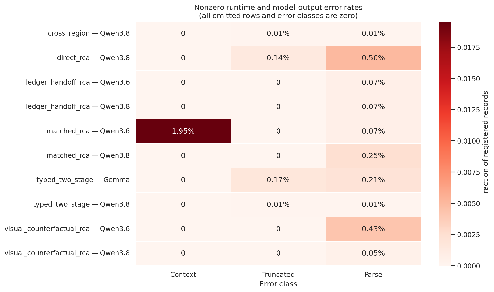

There are no missing records, vLLM response failures, timeouts, or uncategorized infrastructure failures in the consolidated lineages. The only infrastructure class is 55 Qwen3.6 matched-RCA context overflows (`prompt + 8192 > 32768`). The largest model-output issue is Gemma typed-two-stage (15 truncations, 19 parse failures; some overlap), still far below 5% and scored as model behavior. Qwen3.8 direct RCA has 14 parse failures, four of which are truncated. Detailed per-arm/per-dataset rates are in [runtime.csv](../tmp/rq1_result_analysis/runtime.csv).

## 8. Detailed case statistics

### 8.1 Typed Stage-1 binding

| experiment                | model           |   supported |   unsupported |   binding_rate |
|:--------------------------|:----------------|------------:|--------------:|---------------:|
| ledger_handoff_rca        | gemma-4-26b-a4b |       22263 |           108 |         0.9952 |
| ledger_handoff_rca        | qwen3.6-27b     |       18150 |           600 |         0.968  |
| ledger_handoff_rca        | qwen3.8-27b     |       13524 |           255 |         0.9815 |
| matched_rca               | gemma-4-26b-a4b |       43245 |          1628 |         0.9637 |
| matched_rca               | qwen3.6-27b     |       36198 |          1009 |         0.9729 |
| matched_rca               | qwen3.8-27b     |       31410 |           692 |         0.9784 |
| typed_two_stage           | gemma-4-26b-a4b |       32012 |         11863 |         0.7296 |
| typed_two_stage           | qwen3.6-27b     |       37617 |          6330 |         0.856  |
| typed_two_stage           | qwen3.8-27b     |       39265 |          5974 |         0.8679 |
| visual_counterfactual_rca | gemma-4-26b-a4b |       26311 |           188 |         0.9929 |
| visual_counterfactual_rca | qwen3.6-27b     |       21480 |           297 |         0.9864 |
| visual_counterfactual_rca | qwen3.8-27b     |       20012 |           171 |         0.9915 |

The **binding rate** is the fraction of Stage-1 selectors that a deterministic program can match to an exact public evidence record. It is high for RCA (96.4–99.3%) but materially lower for typed QA: Gemma 72.96%, Qwen3.6 85.60%, Qwen3.8 86.79%. This helps explain why typed QA can underperform direct QA even when its Stage 2 is well-formed. A failed individual binding is recorded as `unsupported` rather than invalidating an entire ledger; `supported` and `unsupported` in the table are selector counts, not case counts.

### 8.2 Fault types and canonical root labels

For the strongest formal cell (`matched_rca`, Qwen3.8, `R`, headline), the following tables show groups with at least five cases. `root_service` is the first registered service-level accepted label when available, otherwise the first accepted label. Accepted aliases are not treated as independent multi-root causes.

Fault-type outcomes

| fault_type                |   n |   correct_n |    ac1 |    mrr |   wrong_n |
|:--------------------------|----:|------------:|-------:|-------:|----------:|
| network loss              |   5 |           3 | 0.6    | 0.8    |         2 |
| network corrupt           |   6 |           3 | 0.5    | 0.75   |         3 |
| NetworkPartition          |   6 |           3 | 0.5    | 0.6944 |         3 |
| JVMMemoryStress           |  14 |           8 | 0.5714 | 0.6905 |         6 |
| ContainerKill             |   6 |           3 | 0.5    | 0.6667 |         3 |
| k8s容器cpu负载            |   9 |           5 | 0.5556 | 0.6389 |         4 |
| HTTPResponseDelay         |   7 |           2 | 0.2857 | 0.4762 |         5 |
| k8s容器网络丢包           |   9 |           3 | 0.3333 | 0.463  |         6 |
| node节点CPU故障           |   5 |           1 | 0.2    | 0.4333 |         4 |
| HTTPResponseReplaceCode   |  13 |           3 | 0.2308 | 0.4231 |        10 |
| node 磁盘写IO消耗         |   6 |           2 | 0.3333 | 0.4167 |         4 |
| node 磁盘空间消耗         |   5 |           1 | 0.2    | 0.4067 |         4 |
| k8s容器网络资源包损坏     |  10 |           3 | 0.3    | 0.4033 |         7 |
| k8s容器网络延迟           |  10 |           2 | 0.2    | 0.39   |         8 |
| io fault                  |   5 |           0 | 0      | 0.3667 |         5 |
| k8s容器进程中止           |   5 |           1 | 0.2    | 0.35   |         4 |
| network delay             |   7 |           1 | 0.1429 | 0.3333 |         6 |
| HTTPRequestReplaceMethod  |  15 |           2 | 0.1333 | 0.3056 |        13 |
| HTTPRequestAbort          |   6 |           1 | 0.1667 | 0.3056 |         5 |
| node memory stress        |  12 |           3 | 0.25   | 0.2917 |         9 |
| k8s容器内存负载           |   8 |           1 | 0.125  | 0.2917 |         7 |
| k8s容器读io负载           |   9 |           1 | 0.1111 | 0.2593 |         8 |
| cpu stress                |   8 |           1 | 0.125  | 0.2292 |         7 |
| HTTPRequestDelay          |   7 |           1 | 0.1429 | 0.2143 |         6 |
| dns error                 |   5 |           1 | 0.2    | 0.2    |         4 |
| node 内存消耗             |   5 |           1 | 0.2    | 0.2    |         4 |
| node 磁盘读IO消耗         |   5 |           1 | 0.2    | 0.2    |         4 |
| jvm latency               |   5 |           0 | 0      | 0.18   |         5 |
| node cpu stress           |   6 |           1 | 0.1667 | 0.1667 |         5 |
| k8s容器网络资源包重复发送 |   7 |           0 | 0      | 0.1    |         7 |
| pod failure               |  10 |           0 | 0      | 0.0833 |        10 |
| memory stress             |   6 |           0 | 0      | 0.0833 |         6 |

Canonical-root outcomes

| root_service          |   n |   correct_n |    ac1 |    mrr |   wrong_n |
|:----------------------|----:|------------:|-------:|-------:|----------:|
| ts-preserve-service   |   5 |           3 | 0.6    | 0.7667 |         2 |
| frontend              |   6 |           4 | 0.6667 | 0.75   |         2 |
| ts-assurance-service  |   5 |           3 | 0.6    | 0.7    |         2 |
| ts-config-service     |   6 |           3 | 0.5    | 0.6944 |         3 |
| ts-seat-service       |   6 |           3 | 0.5    | 0.6389 |         3 |
| mysql                 |   6 |           3 | 0.5    | 0.5833 |         3 |
| checkoutservice       |  21 |           7 | 0.3333 | 0.4683 |        14 |
| cartservice           |  12 |           3 | 0.25   | 0.4611 |         9 |
| ts-route-plan-service |   6 |           2 | 0.3333 | 0.4167 |         4 |
| adservice             |  16 |           4 | 0.25   | 0.3792 |        12 |
| node-4                |   5 |           1 | 0.2    | 0.3667 |         4 |
| ts-order-service      |   5 |           0 | 0      | 0.3667 |         5 |
| node-6                |  12 |           3 | 0.25   | 0.3611 |         9 |
| emailservice          |   6 |           1 | 0.1667 | 0.3333 |         5 |
| node-5                |  12 |           3 | 0.25   | 0.3194 |         9 |
| node-3                |   7 |           2 | 0.2857 | 0.3143 |         5 |
| recommendationservice |   5 |           0 | 0      | 0.2567 |         5 |
| tidb-tikv             |  10 |           0 | 0      | 0.2167 |        10 |
| shippingservice       |  10 |           1 | 0.1    | 0.2    |         9 |
| currencyservice       |   6 |           1 | 0.1667 | 0.2    |         5 |
| productcatalogservice |   8 |           1 | 0.125  | 0.1875 |         7 |
| ts-basic-service      |  19 |           0 | 0      | 0.136  |        19 |
| node-1                |   6 |           0 | 0      | 0      |         6 |

Complete outcome tables are [statistics_fault_type.csv](../tmp/rq1_result_analysis/statistics_fault_type.csv), [statistics_service.csv](../tmp/rq1_result_analysis/statistics_service.csv), [statistics_error_reason.csv](../tmp/rq1_result_analysis/statistics_error_reason.csv), and [statistics_prediction_service.csv](../tmp/rq1_result_analysis/statistics_prediction_service.csv). The error taxonomy distinguishes top-1 correct, rank 2–3, rank 4–5, top-5 miss, parse failure, and truncation. A universal semantic “reasoning error” label cannot be inferred from root/injection labels alone and is therefore not invented.

## 9. Attention analysis

### 9.1 What was actually captured

| model           |   visual_requests |   collected |   grids |   grids_present |   overlays |   overlays_present |   raw_probe_present |   raw_probe_missing |
|:----------------|------------------:|------------:|--------:|----------------:|-----------:|-------------------:|--------------------:|--------------------:|
| gemma-4-26b-a4b |             24645 |       24645 |   63449 |           63449 |      63449 |              63449 |               24645 |                   0 |
| qwen3.6-27b     |             24590 |       24590 |   62259 |           62259 |      62259 |              62259 |               24542 |                  48 |
| qwen3.8-27b     |             24701 |       24701 |   63098 |           63098 |      63098 |              63098 |               24701 |                   0 |

The probe is from the same generation **prefill** (the forward pass that processes the prompt before output tokens are generated), not a second model call. It averages per-head softmax attention from the final prompt query to visual-token keys at the registered layer, then maps tokens to 16×16 image grids. `visual_requests` counts requests containing an image; `collected` counts embedded attention summaries; `grids_present` and `overlays_present` count stored heatmap artifacts; `raw_probe_present` counts retained token-level vectors. All grids and overlays exist. Qwen3.6's 48 missing raw probes are confined to 12 cases × four counterfactual conditions; their derived grids, overlays, and regional diagnostics are still present. Token-level re-analysis is unavailable for those 48 only.

### 9.2 Full-dashboard distribution

`mass` is the probability mass across the four dashboard regions and sums to one: for example, `M_mass` is attention assigned to metric panels. `focus` divides mass by the region's share of image area, so 1 means proportional-to-area, values above 1 are over-focus, and values below 1 are under-focus. `entropy` measures how diffuse the attention map is, `blank_mass` is attention on blank canvas, and `top10_evidence_precision` is the fraction of the most-attended 10% of patches that overlap an evidence-bearing region.

| model           |   M_mass |   R_mass |   L_mass |   G_mass |   M_focus |   R_focus |   L_focus |   G_focus |   entropy |   blank_mass |   top10_evidence_precision |
|:----------------|---------:|---------:|---------:|---------:|----------:|----------:|----------:|----------:|----------:|-------------:|---------------------------:|
| gemma-4-26b-a4b |   0.6288 |   0.0228 |   0.0409 |   0.3075 |    0.9672 |    0.4899 |    0.8726 |    1.2072 |    0.8581 |       0.1611 |                     0.8397 |
| qwen3.6-27b     |   0.6239 |   0.0377 |   0.0409 |   0.2975 |    0.9594 |    0.8096 |    0.8724 |    1.1657 |    0.8415 |       0.1466 |                     0.9024 |
| qwen3.8-27b     |   0.6676 |   0.0291 |   0.0258 |   0.2774 |    1.0276 |    0.6239 |    0.5516 |    1.0862 |    0.8562 |       0.1284 |                     0.9162 |

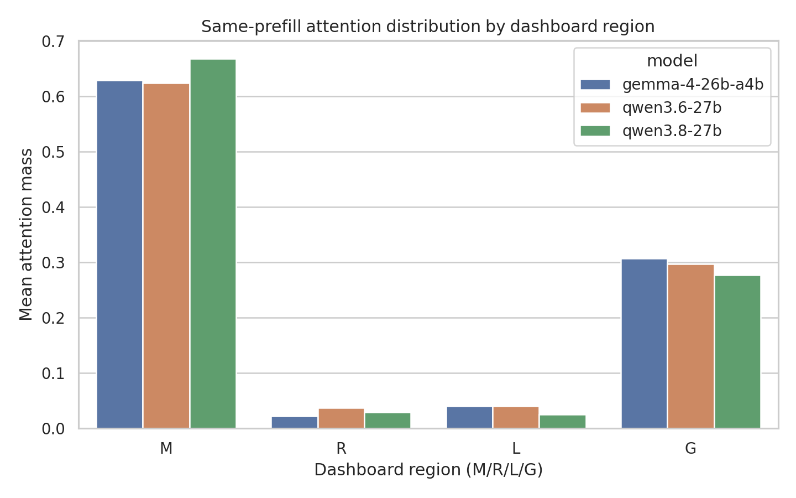

Across models, metrics receive 62.4–66.8% of full-dashboard attention and topology 27.7–30.8%; logs and traces each receive only about 2–4%. Area-normalized focus changes the interpretation: topology is consistently over-focused (1.09–1.21), metrics roughly area-proportional, while logs/traces are under-focused. Qwen3.8 is the most metric-heavy and gives the least mass to logs/traces.

Routed `R` exposes only metrics and topology visually:

| model           |   M_mass |   G_mass |   blank_mass |   top10_evidence_precision |
|:----------------|---------:|---------:|-------------:|---------------------------:|
| gemma-4-26b-a4b |   0.6052 |   0.307  |       0.1556 |                     0.8565 |
| qwen3.6-27b     |   0.5617 |   0.3243 |       0.1604 |                     0.9256 |
| qwen3.8-27b     |   0.6621 |   0.2749 |       0.112  |                     0.9488 |

### 9.3 Attention, correctness, fault type, and service

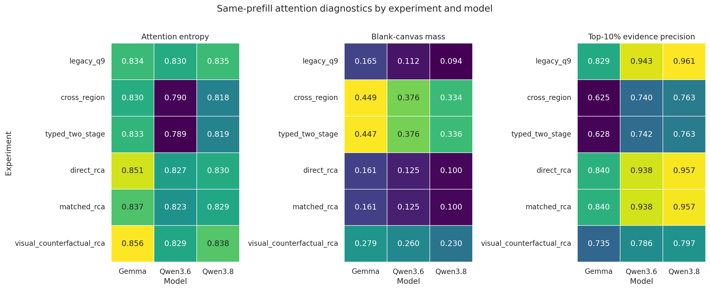

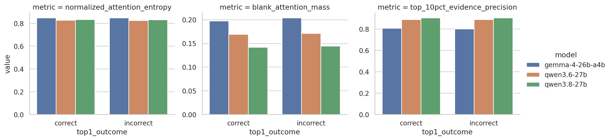

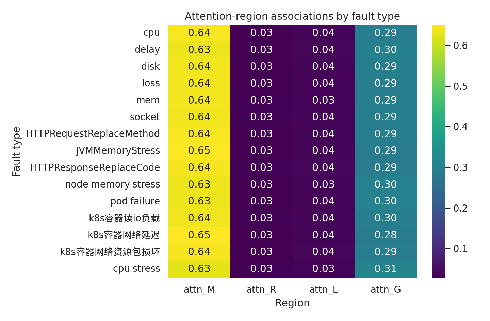

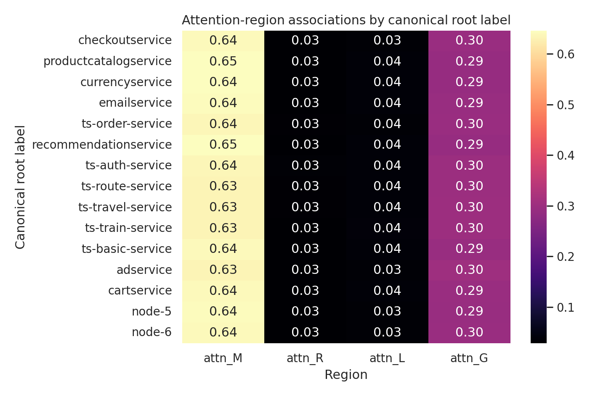

The correct/incorrect curves are nearly indistinguishable: entropy, blank mass, and top-10%-patch evidence precision differ by only a few thousandths after aggregation. Fault- and root-label heatmaps reveal associations with the composition of those cases, not attention *to* the named service. The current atlas has region masks but no entity/service spatial masks, so claims such as “the model attended to service X” are not supported. Full tables are [attention_summary.csv](../tmp/rq1_result_analysis/attention_summary.csv), [attention_fault_type.csv](../tmp/rq1_result_analysis/attention_fault_type.csv), [attention_service.csv](../tmp/rq1_result_analysis/attention_service.csv), and [attention_correctness.csv](../tmp/rq1_result_analysis/attention_correctness.csv).

Representative same-prefill overlays are shown full-width rather than compressed into a three-column panel:

**Qwen3.6**

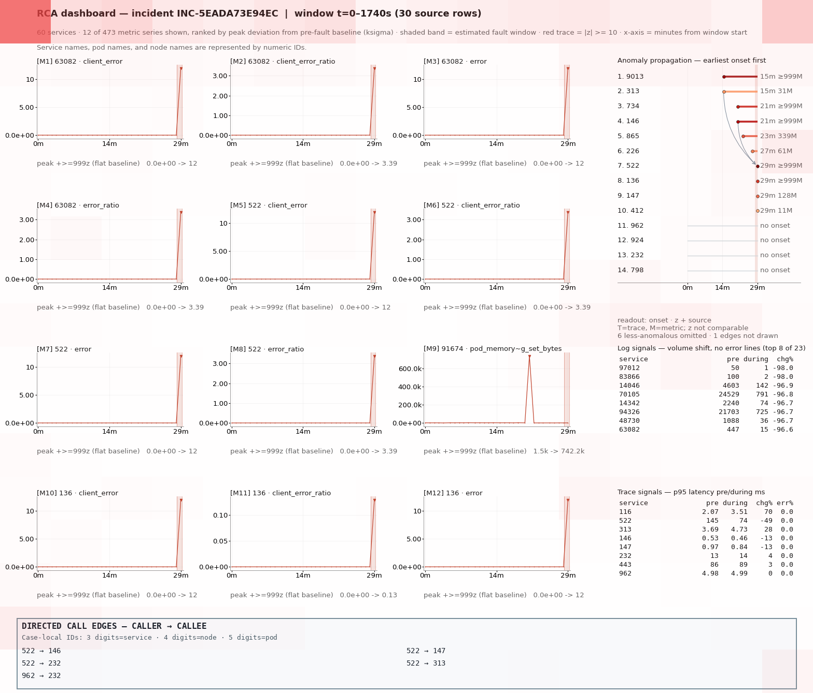

**Gemma**

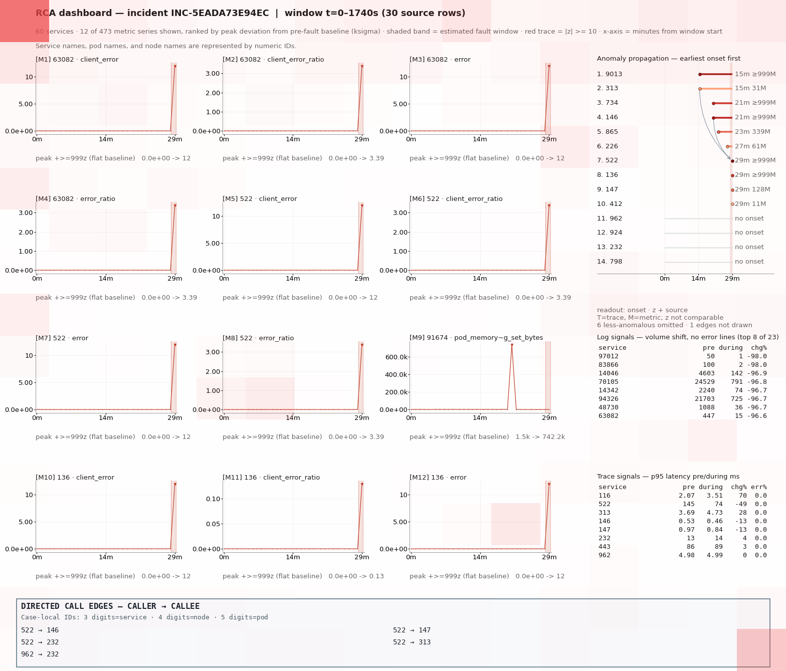

**Qwen3.8**

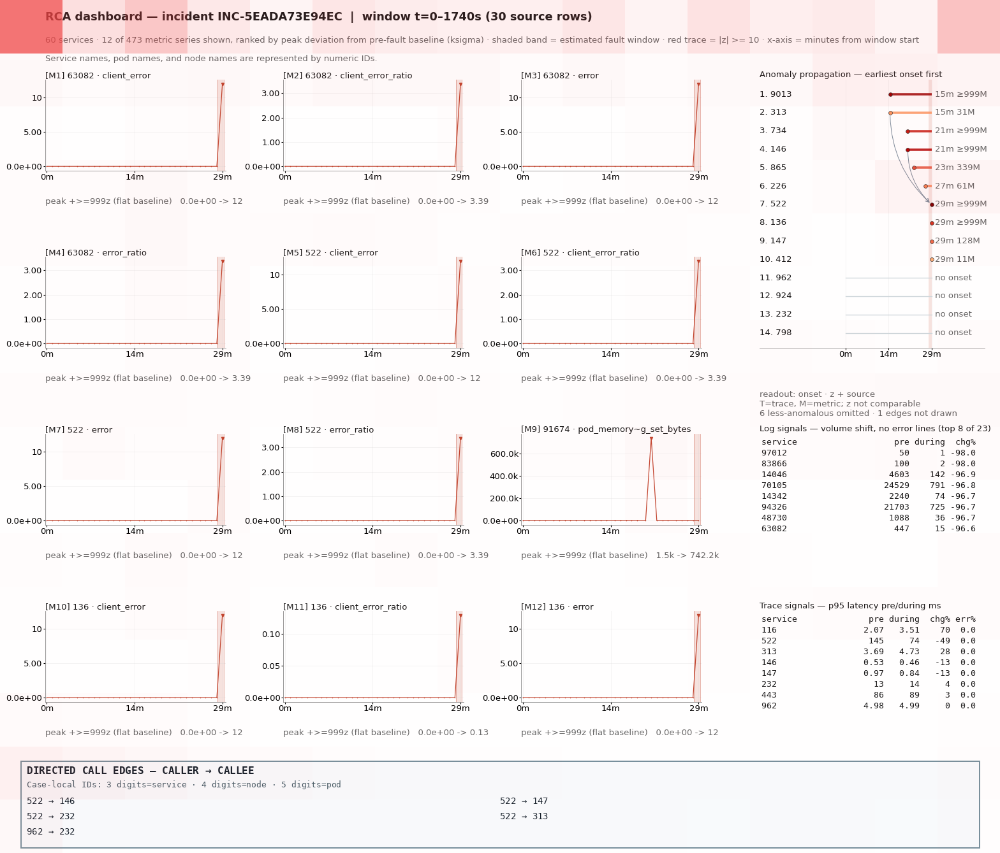

### 9.4 Interpretation limits from prior work

Raw attention is not a causal explanation. [Jain and Wallace (NAACL 2019)](https://aclanthology.org/N19-1357/) show that attention can be weakly related to gradient importance and that different distributions can yield equivalent outputs. [Abnar and Zuidema (ACL 2020)](https://aclanthology.org/2020.acl-main.385/) explain that information mixes across layers and find rollout/flow closer to ablation and gradient measures than raw single-layer attention. [NOTICE (NAACL 2025)](https://aclanthology.org/2025.naacl-long.571/) further shows that grounding roles differ across VLM architectures. Accordingly, this report treats attention as a descriptive diagnostic and relies on factual/targeted/placebo/neutral counterfactuals for causal visual influence.

The result pattern is also consistent with two broader warnings: [Parcalabescu and Frank (ICLR 2025)](https://proceedings.iclr.cc/paper_files/paper/2025/hash/37294f033582ac0064bf90fa557c2573-Abstract-Conference.html) find text contributions dominate images in tested VLM decoders, and [VLM2-Bench (ACL 2025)](https://aclanthology.org/2025.acl-long.372/) identifies persistent difficulty linking explicit visual cues. [DashboardQA (Findings EACL 2026)](https://aclanthology.org/2026.findings-eacl.177/) independently reports that real dashboard grounding and reasoning remain difficult.

## 10. Findings by experiment

### Legacy-Q9

**Performance.** Text solves most direct-reading questions. Hybrid roughly preserves Qwen performance but does not improve it materially; image-only and pixel-text are worse. This is a perception baseline, not RCA evidence.

**Cost.** Within each model, image-only `V` uses only 8.3% (Gemma), 15.6% (Qwen3.6), and 15.0% (Qwen3.8) of the all-text `T` input tokens. That compression is accompanied by lower accuracy, so it is a cost-only saving rather than an accuracy–cost improvement. Redundant hybrid `H` costs 4.9–11.6% more input than `T`. Pixel-text `P` is tokenizer-dependent: it costs only 38.0% of `T` for Gemma but about 114% for both Qwen models, while remaining less accurate.

### Cross-region one-stage QA

**Performance.** Hybrid helps Gemma and Qwen3.6 modestly on the packet average but hurts Qwen3.8. Level 3 is much harder than Level 1. Gemma alone passes the registered P1 and P2 depth tests (`+0.1087` and `+0.1667`); neither Qwen model passes both, and no factorial region main effect reaches the registered +0.10 P3 threshold. Factorial signs are unstable: Gemma benefits from visual traces but loses from visual logs/topology; Qwen3.8 benefits from visual metrics but loses from visual traces/logs. The defensible result is Gemma-specific multimodal depth complementarity, not an architecture-general region benefit.

**Cost.** Full visual `V` uses 7.4% (Gemma), 14.6% (Qwen3.6), and 14.1% (Qwen3.8) of the all-text factorial reference input. The factorial map shows that most of this compression comes from rendering the metrics region visually; switching only the smaller log, trace, or topology regions has a much smaller and architecture-dependent token effect. Hybrid `H` costs 4.9–11.8% more than all-text. Its modest Gemma/Qwen3.6 gains therefore buy accuracy with extra tokens, while Qwen3.8 pays extra and loses accuracy; there is no architecture-general Pareto improvement.

### Typed two-stage QA

**Performance.** Typed handoff improves selected Qwen visual conditions but generally reduces direct QA accuracy for Gemma and Qwen3.6. Its binding deficit, especially Gemma's 72.96%, is a real mechanism bottleneck. It should not replace direct perception measurement.

**Cost.** Full visual `V` uses 17.3% (Gemma), 25.5% (Qwen3.6), and 24.7% (Qwen3.8) of the all-text input; hybrid `H` costs 3.2–10.3% more than all-text. Pixel-text costs 40.8% for Gemma but about 112% for the Qwen models. The cheaper visual transport does not offset the observed accuracy and binding losses, so the typed visual arms are not an accuracy–cost win.

### Direct RCA

**Performance.** No model supports a positive routed-dashboard claim. `T` or `F` is best/near-best; `P` is worst. Qwen3.8 `R-T=-0.0046`, Gemma `-0.0666`, Qwen3.6 `-0.0309`. One-stage visual evidence does not improve RCA.

**Cost.** Routed `R` reduces mean input to 29.6% (Gemma) and 39.5% (both Qwen models) of `T`; full visual `V` reduces it further to 20.5% and 30.6%. Flat structured `F` costs approximately the same as `T`, while redundant `H` costs 8.1–17.2% more. These are substantial token savings for `R/V`, but because MRR does not improve they support only a cost–accuracy trade-off, not a superior RCA representation. `P` is especially inefficient for Qwen at about 182% of `T` while also performing worst.

### Matched two-stage RCA

**Performance.** Qwen3.8 is the single positive result (`R-T=+0.0615`, `R-F=+0.0625`, both Holm-significant); the net top-1 correction is +14. Gemma is negative and Qwen3.6 is small, non-significant, and formally incomplete due to 11.73% infrastructure exclusion. Therefore the supported claim is model- and pipeline-specific.

**Cost.** Routed `R` uses 42.5% (Gemma), 49.4% (Qwen3.6), and 47.5% (Qwen3.8) of `T` input; full visual `V` uses 35.2–41.6%. Qwen3.8 `R` is therefore the one clear accuracy–cost Pareto improvement in RQ1: it raises MRR while cutting input tokens by 52.5% relative to `T`. Gemma receives a similar token reduction but loses MRR, and Qwen3.6 remains formally incomplete. Hybrid costs 6.4–14.1% more than `T`, while Qwen pixel-text costs 165.7–168.9% and provides no compensating gain.

### Visual counterfactual RCA

**Performance.** Targeted transplant lowers Qwen3.8 MRR by 0.0263 relative to factual, more than placebo (-0.0055), but the registered paired tests are not significant after Holm correction. Gemma and Qwen3.6 show no coherent targeted effect. Images influence rankings, but the current experiment does not establish reliable causal benefit.

**Cost.** Factual, targeted, placebo, and neutral conditions all consume approximately 99.9–100.0% of factual input within each model. This is the intended matched-cost control: the observed ranking changes cannot be attributed to one counterfactual condition receiving a materially different token budget. The experiment is a causal sensitivity probe, not a token-saving method.

### Ledger handoff RCA

**Performance.** Text ledger is equal or better than visual ledger across models. Hybrid ledger recovers some visual loss; Qwen3.8 `L_hyb-L_vis=+0.0415` is significant, but `L_hyb-L_txt≈0`. Pixelizing a structured ledger adds no independent value.

**Cost.** Visual ledger `L_vis` costs 2.3% (Gemma), 6.5% (Qwen3.6), and 9.9% (Qwen3.8) more input than text ledger `L_txt`; hybrid ledger costs 24.4–29.8% more. Because `L_txt` is also equal or better in RCA performance, it dominates the visual ledger on both accuracy and token cost. Qwen3.8's hybrid recovery over `L_vis` is not a Pareto gain over `L_txt`: it returns to approximately the same MRR while spending 24.4% more input.

## 11. Cross-experiment conclusions

1. **Representation routing matters more than simply adding an image.** Only Qwen3.8's two-stage routed arm clears the RCA threshold; full `V`, redundant `H`, and pseudo-dashboard `P` do not.
2. **Two stages are not automatically better.** Matched-vs-direct changes vary by arm/model and mostly fail multiplicity correction. The benefit appears when Qwen3.8 combines typed evidence selection with the routed representation.
3. **Visual contribution is architecture-dependent.** Gemma, Qwen3.6, and Qwen3.8 frequently disagree on the sign of visual main effects.
4. **The visual bottleneck is cross-region use, not merely perception.** Level-1 text accuracy is near saturation, while Level-3 and typed binding fall sharply; the Gemma P1/P2 result shows that hybrid evidence can partially repair this on scoreable deep chains without making the effect architecture-general.
5. **Attention exposure is not sufficient evidence of useful reasoning.** Models heavily attend to metrics/topology, yet correct and incorrect cases have almost identical attention diagnostics.
6. **Pixel-text is a useful negative control.** It usually costs many visual tokens while losing accuracy, showing that “text rendered as an image” is not the dashboard advantage claimed by the project.
7. **Token compression and accuracy must be reported separately.** Real visual and routed arms frequently reduce input tokens by 50–90%, but most also lose performance. The only clear joint improvement is Qwen3.8 matched two-stage `R`; the counterfactual arms correctly hold cost constant, and text ledger dominates visual/hybrid ledger handoff.

## 12. Missing data and non-claims

- Qwen3.6 matched RCA exceeds the 5% infrastructure ceiling and cannot support a formal claim; its complete-subset numbers are retained for diagnosis.
- Forty-eight Qwen3.6 counterfactual requests lack raw token vectors. Their derived grids/overlays exist, but token-level re-analysis is impossible.
- There is no service/entity spatial atlas; attention can be grouped by cases whose root label is X, but cannot be localized to X.
- Root cause and injection labels do not define causal propagation paths, anomaly duration, or semantic reasoning-error classes. Those labels were not fabricated.
- Accepted labels are aliases/granularity alternatives, not evidence of multi-root incidents; Recall@K is therefore not reported as an independent metric.
- Wall-time comparisons are omitted because hardware differs. GPU active time is preserved in trajectories but is not used as a cross-hardware cost claim.
- Results use repeated exposed evaluation data, not a newly untouched confirmation set.
- Attention is single registered-layer/final-query attention, not rollout, gradient attribution, or activation patching.

## 13. Reproducibility artifacts

- Analysis program: [analyze_rq1.py](../tmp/rq1_result_analysis/analyze_rq1.py)
- Report builder: [build_report.py](../tmp/rq1_result_analysis/build_report.py)
- Record-level compact table: [records.parquet](../tmp/rq1_result_analysis/records.parquet)
- Artifact audit: [summary.json](../tmp/rq1_result_analysis/summary.json)
- Performance: [performance.csv](../tmp/rq1_result_analysis/performance.csv)
- Cost: [cost.csv](../tmp/rq1_result_analysis/cost.csv)
- Runtime: [runtime.csv](../tmp/rq1_result_analysis/runtime.csv)
- Paired statistics: [comparisons.csv](../tmp/rq1_result_analysis/comparisons.csv)
- Attention inventory: [attention_inventory.csv](../tmp/rq1_result_analysis/attention_inventory.csv)

All tables and figures are regenerated from immutable trajectory/private artifacts; no model inference was performed for this report.
