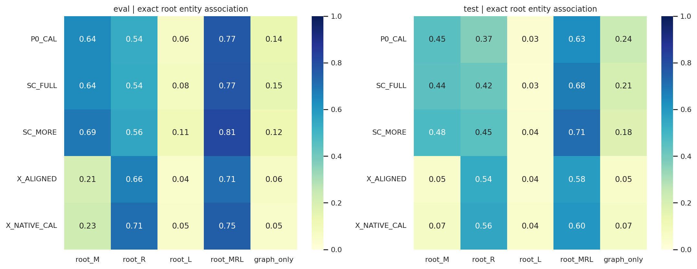

# CanvasRCA 下一步：从证据排序转向可计算诊断见证，再验证选择性视觉

## 2026-09-25 执行授权

用户授权启动RQ3.4正式后台队列，启动后助手停止监控。四项资格已通过；正式顺序和推进阈值不变：先screen60三个实验，满足原预注册条件才进入check120，不直接扩展RQ480。只新增运维串行入口及执行授权，原科学输入/模型/评分保持；以 `RQs/RQ3_4/results/integrated_v1/formal_queue_status.json` 记录真实状态，续跑使用原子done/fail旗标。详见RQ3.4协议DD-RQ34-07。下方“正式禁用”保留为此前状态，由本节明确替代。

## 2026-09-24 最新合并计划：原诊断路线＋可核验推理，统一为 RQ3.4

根据用户最新要求，不将 auto reasoning 另做一条与 MRR 主线分离的路线。将原本的**输出／类型契约、宿主—实例归因、证据优先级、实体—时间绑定**与新核验器合并。MRR 仍优先；事实可靠性独立衡量，不能因答案“自洽”就宣称找到了正确根因。

当前权威：[RQ3.4 完整实验协议](../../RQs/RQ3_4/descriptions/RQ3_4_experiments.md)与[机器可读设计登记](../../RQs/RQ3_4/configs/integrated_round_v1.json)。此处为项目级路线摘要，数值及规则以这两个文件为准。

| 实验 | 固定与变化 | 目的 | 最多新增正式调用 |
|---|---|---|---:|
| 输出契约 | SIRCL 原请求／数字 ID 适配／备选提名提示 | 分离格式、类型和短列表损失 | 360 |
| 证据与推理 | 优先级P × 宿主scope H × 可核验关系K，全2×2×2；另有TPV/MORE | 找到各自作用及交互，不顺序挑冠军 | 1,200 |
| 图文与绑定 | 固定P1H1；G文本／图像 × 无追加／普通重述／可核验关系 | 区分重复提醒、关系编译和视觉；复用两个条件 | 480 |
| 条件式锁定复核 | 六个固定条件，旧check120 | 检查预注册统一方法是否可复现收益 | 1,440 |

前三项统一使用旧 screen60（三主数据集各20），不是按失败选样；复核使用旧 check120（各40），两组都明确为已暴露开发资料。Qwen 为主要模型，Gemma 作跨模型检验；一次 RCA 调用、无训练、无 attention、无需重新转换 raw data。

P 改善实际变化／持续性／去冗余的选择顺序；H 提供有来源的宿主、焦点实例及 peer 观测；K 仅编译相同已选事实能支持的类型、数值、时间及公开关系，不预言根因。三个因素独立控制，K 不暗中改变选择，H 不暗中启用新排名。主方法固定为 P1H1K1_G，不看成绩换成最好组合。

全部回答做相同的输出后核验 sidecar，不改原答案或评分，不自动删除候选或重采样。证据不足返回 unknown；数量绑定不明确时不能把局部 latency onset 与 G 总体 onset 当同一个量。核验误报、覆盖、解释长度与 MRR/repair/break 一起分析。

**调用量：首轮正式2,040＋三个smoke54＝2,094；若达到预登记推进条件，再加复核1,440＋smoke18。合计最多3,552次计划新调用，复用可减少，不含未预知修复重试。** 不叠加此前聊天里的738-call独立建议；不重置已授权大RQ的40,000调用账目。启动前核对既有消耗和余量。

**最新执行状态：相对时钟修复及用户授权的定向GPU补验已完成，四项注册smoke路径当前资格均为 `passed`，正式实验仍禁用。** 最新45项CPU测试、120请求身份等价、72逻辑单元持久化及36对跨模型公开输入检查通过。18个改变输入单元通过16次新调用＋2次相同请求复用完成，54个未改输入单元直接引用；原失败和模型错误保留。详见 [RQ3.4 问题记录](../issues/RQ3_4_qualification_2026-09-24.md)。资格通过不等于MRR有效，不自动恢复上一轮阴性全量分支或启动本轮正式实验。

按上一轮实测吞吐，代码就绪后首轮暂按2–4小时预留，条件式复核再加1–2小时；新 scope 准备尚未实测，不能保证时长。该安排的目标是用一个有界轮次同时回答原问题与新问题，不回到无限增加选择器或布局的探索。

以下较早更新和 RQ3.3 v2–v4 方案保留历史，若与本节冲突，以本节及 RQ3.4 登记为准。

---

## 2026-09-24 执行更新：Witness 完成，下一步转向可追溯事实核验

**当前权威状态：**RQ3.3 的校准、screen、budget、check 及阴性后的机制诊断已完成；并非仍停在下文保留的 v4 静态阶段。完整结果见 [RQ3.3 分析](../experiment_reports/RQ3_3_Results_Analysis_2026-09-24.md)。W_G 未通过登记的开发扩展条件，不自动扩大原队列。

用户授权自主决定下一步，并指出 ID、数值和关系自洽检查本身具有价值。结合其指定 CARS 与 SAT-LM/LINC，新增 [RQ3.4 协议](../../RQs/RQ3_4/descriptions/RQ3_4_experiments.md)：先做零模型调用的公开事实核验，区分候选错误、事实矛盾、证据不足和未支持因果断言。首轮 CPU 审计已完成，见 [findings](../../RQs/RQ3_4/findings/exp_claim_verification_cpu_findings.md)。不修改旧答案、旧评分或旧模型配方。

后续不以“满足约束”替代高 MRR：优先验证强 TPV 上的可靠实体／数值／关系绑定及可核验关系编译，设置等信息文本、普通事实重述和普通规则实现对照。事实核验可以独立提供可靠性价值；能否修复排名、是否误伤原正确案例仍需受控实验。当前未启动新 GPU 队列、训练或自动多轮修复。以下 v2–v4 内容保留为 RQ3.3 实施历史，不是继续扩大阴性分支的授权。

---

初稿：2026-09-22；本次修订：**2026-09-23，v4（信息保留、联合统计与可用性对照）**，沿用原文件路径。新研究编号：**RQ3.3**。方法暂名：**CanvasRCA-Witness**。

**状态：已编写 RQ3.3 实验代码，本轮仅做源码静态检查；未运行 CPU 回归、preparation、smoke、模型调用或训练。** 实现及完整执行协议位于 [RQs/RQ3_3/descriptions/RQ3_3_experiments.md](../../RQs/RQ3_3/descriptions/RQ3_3_experiments.md)。本文不改变 RQ1.1、RQ2.1、Tournament、RQ3.1、RQ3.2 的原始结果及其历史状态。运行资格尚待用户下一步授权后核查，不把静态通过写成端到端通过。

**v2 的研究调整延续：**保留 TPV 基础的方向不变，但不再假设“追加好的证据包”就足够。优先检验此前没有被干净隔离的三个环节：**测量语义是否明确、确定性比较是否已算好、跨源观测是否属于同一请求/可比群体**；另控制追加位置造成的上下文干扰。用 60-case 维度筛查、另一批 120-case 锁定检查替代原开发矩阵。事件级关系图只作为条件式机制实验，不立即另造主 renderer。v3 为节点重排增加同绘图器校准控制，计划最坏调用量由 **20,430 修订为20,670**；全 RQ 硬上限仍为 40,000。

**v3 的实施约束：**原 TPV 的 G 已是 PNG，不能重绘后声称只改节点位置。因此 `W_G_SCENE_CAL` 与 `W_G_RELAYOUT` 使用同一图语法、完整属性 ledger 与 geometry，二者仅位置不同；主方法仍使用原 G。`W_FRONT` 在原 task 后、原 guide/evidence 前插入，保留父版候选原位置。语义校准必须读取真实历史 request 并应用来源已核验的 exact-span 补丁；此轮不分析真实cases，故不会伪造这份审计。请求群体仅在状态字段不可用时使用延迟分群，不因已知错误组样本少而悄悄换定义。完整细节、源码对应及未来命令见 RQ-local 协议。

**v4 最新实施权限和差异：**用户授权更新计划、代码与源码静态检查，然后停止；**不运行 CPU 回归、preparation、注册 CLI、smoke 或模型调用**。新增 marginal 请求汇总控制、RAW 证据对四条件和局部/远处绑定重复；预算比较增加1024档。保留原五项实验及六个可选择方法，不增加训练或互信息估计器。计划量 **23,190**、硬上限 **40,000**。当前入口使用 [research_v2.json](../../RQs/RQ3_3/configs/research_v2.json) 与独立 `witness_v2` 结果命名空间；v1 是未执行的旧注册，不与新协议混跑。以下正文按 v4 更新，v2/v3 段落仅保留变更由来。

## 1. 先给结论：下一步不再整体替换 P0，也不再以全视觉为默认终点

我们已经有足够证据停止两类低收益探索：继续增加一批通用异常排序器，以及再次把大量 M/R/L 数值和长字段塞入新的全视觉 Dashboard。

建议的下一步是：

> **完整保留 TPV 已经有效的基础输入，把来源可靠的观测编译成“测量对象明确、比较量已算好、关联范围可核查”的诊断见证。先检验这是否帮助模型区分宿主/实例与故障源/受害者，再用同事实强文本对照检验关系视觉的增量。**

这里的“诊断见证”（diagnostic witness）指一组有来源、可以共同核查某个诊断问题的观测，不是根因标签、选择器推荐答案或模型生成的解释。

本次路线相对 RQ3.2 的实质变化如下。

| 之前的做法 | 本次改变 | 为什么不是再换一个名字 |
| --- | --- | --- |
| 保留约一半 P0，再重新竞争剩余名额 | **保留全部 TPV 基础事实、原始顺序及原 G 图**，只追加有界见证 | 先移除“新增一点、同时删掉关键旧证据”这个已观察到的破坏来源 |
| 用强度、稀有度、层次标签代理区分力 | 每个见证必须对应一个具体竞争问题及来源支持的比较关系 | 不再把两个同名指标并排就称为竞争根因比较 |
| 大矩阵跑完后再发现方法整体无效 | 先进行小规模语义校准与固定 cohort 的方法检验，未达门槛就不扩大 | 把算力优先用于能否提高 MRR，而非积累更多负例 |
| 全视觉或最多一个文本模态是主路线 | 采用已获用户认可的 **TPV 式选择性视觉**：M/R/L 文本＋G 图像 | 不再主动放弃目前最有依据的强表示 |
| 以覆盖更多实体解释进步 | 同时要求新增提名、排序修复及 break 控制 | coverage 不是诊断质量的替代品 |
| “Contrast text”仍靠 O/C 引用跳转 | 真正局部并列的文本对照；图像获得同样的事实及关系 | 正面回答“为什么不用文本做 contrast” |
| 新统计量主要帮助 CPU 排名，Solver 仍读旧字段 | 在保留操作数的前提下，显式提供可复算的比较结果 | 把“找到两条相关信息”与“已经完成可靠比较”分开 |
| 按 service/operation 分别汇总，再让模型自行联结 | 合格时形成同请求、同 operation、同窗口的条件观测 | 避免把不属于同一执行过程的异常拼成故事 |
| 假定旧事实未删除就不会退化 | 同事实比较追加前置/后置；统计 break 与引用变化 | 信息保留不等于模型有效利用不受干扰 |

主方法仍是冻结 Solver、一次调用；最多一张图，候选列表放在文本中。不训练、不恢复淘汰赛、不启动多 Agent、不新增 attention 文件。两次调用只作为有界诊断对照，不自动成为主方法。

MRR 是第一优先级。输入压缩、好看的图、较完整的解释，都不能补偿明显的诊断退化。长期目标仍是 test MRR≥0.65、两个 AIOPS 各≥0.60，但下面的计划不保证达到这些数值。

## 2. 对全部既有实验的重新判断

### 2.1 强基线并没有被新方法稳定超过

下表是 RQ3.2 的 **test 实验内全-arm共同样本**，不是将不同时期、不同分母的成绩混在一起。Qwen 为 341 个、Gemma 为 360 个；Qwen 的请求超时按报告既定口径排除，模型输出失败仍计入。

| 方法 | Qwen MRR | Qwen AC@1 | Qwen AC@5 | Gemma MRR |
| --- | ---: | ---: | ---: | ---: |
| 原 T | 0.3240 | 0.2111 | 0.4751 | 0.3171 |
| 原 TPV | **0.3763** | **0.2845** | 0.4956 | **0.3292** |
| SIRCL_TEXT | **0.3815** | 0.2815 | **0.5161** | 0.2648 |
| SC C-Contrast | 0.3241 | 0.2405 | 0.4751 | 0.2861 |
| SC M-Text | 0.3288 | 0.2463 | 0.4633 | 0.2444 |
| SC V-Contrast | 0.2396 | 0.1554 | 0.3754 | 0.1611 |

来源：[RQ3.2 报告，第 5 节及样本级附件](../experiment_reports/RQ3_2_Results_Analysis_2026-09-22.md)。不同 pair 的检验可用 n 不同，不能把本表均值差直接当作该 pair 的已报告统计量。

这里有一个重要的数学边界：**即使把 Qwen TPV 当前前五里的根因全部排到第一，只重排已有五个候选而不引入新候选，MRR 上限也只有 0.4956。** 所以达到 0.65 不能只靠 reranking；必须同时提高根因进入有效候选排名的概率。AC@5 命中表明答案曾提名该实体，不自动证明模型正确理解了诊断信号。

RQ3.1 的 360-case test 得到同方向结果：Qwen TPV=0.3843、SIRCL_TEXT=0.3739，而 X 对比表格=0.3095、全视觉=0.2761；Gemma 紧凑文本=0.3352，而 X 对比表格=0.2472、全视觉=0.1611。因此这不是 SC 某一个 ablation 偶然不佳，而是连续两版方法都没有解决基础问题。[RQ3.1 报告](../experiment_reports/RQ3_1_Results_Analysis_2026-09-19.md)

### 2.2 RQ1.1 的成功不是“图片一般都好”，而是关系与数值应区别承载

三个主数据集 300 cases 上，Qwen T→TPV 的 MRR 为 0.3093→0.3819；T→全视觉 V 则为 0.3093→0.2658。Gemma TPV 相对 T 没有复现同样收益。

更有价值的是跨其他模态背景的 factorial 结果：

| 改变 | Qwen 平均 ΔMRR | Gemma 平均 ΔMRR | 对下一步的意义 |
| --- | ---: | ---: | --- |
| G 文本→图像 | +0.0561 | +0.0454 | 关系表达有跨背景的正向证据，不只一个 TPV 数字 |
| M 文本→图像 | −0.0503 | −0.0546 | 数值/曲线读取可能抵消视觉收益 |
| R 文本→图像 | 约 −0.0325 | 约 −0.0312 | 长 operation 与延迟比较不宜默认图像化 |

这些是原实验定义下的条件平均效应，不是所有 renderer、模型和任务的普适定律。新的假设应是“**把图用于关系绑定，把文字用于精确比较**”，而非“继续增加图像占比”。[RQ1.1/RQ2.1 findings，第 4、12 节](../experiment_reports/RQ1_1_RQ2_1_findings/findings.md)

其他结果也必须进入设计：44 个缺少根因直接关联已展示 M/R/L 的案例几乎全部失败，但根因仍在候选列表中；QA 与 RCA 弱关联不说明感知无关；全视觉明显减少输入，却不保证减少输出或提高 MRR。本轮不再运行独立 QA。

RQ1.1 已经有**定向图像证据移植**，不能把“模型是否看图”当成完全未研究的问题。其主域 CVI 为 Qwen +0.2599、Gemma +0.1764，说明排名会响应定向图像变化；但响应可能来自显著异常或身份线索，不证明模型恢复了故障传播。下一轮更有价值的问题是：**图是否改善真实观测之间的正确绑定，而不只是改变了答案。**[原 findings，第 6 节](../experiment_reports/RQ1_1_RQ2_1_findings/findings.md)

### 2.3 RQ2.1：更换筛选器和布局，不等于增加诊断能力

八种选择策略确实产生了部分不同内容，但没有稳定、跨模型、经原多重比较支持的统一新赢家。Diversity/Trace-SC 在文本下局部有收益，Coverage/Random 及部分视觉化条件明显退化。

例如五数据集宏均值中，Gemma Diversity Text 从 P0 的 0.5130 到 0.5501，而对应 Vision 从 0.3491 到 0.2953。说明同一选择变化可能适合文字，却超过图像承载或读取能力。五数据集宏均值也不能冒充三个困难数据集上的进步。

分辨率提高对 Qwen 部分数据域有帮助，但没有稳定改善 AIOPS-2022；Gemma 的实际 processor geometry 又不随源 PNG 同比例变化。紧凑间距、表格型剪影、拓扑居中等也没有构成统一改进路线。

**决策：暂停广泛布局、颜色、剪影、分辨率搜索。** 新实验首先固定已经有依据的 TPV 表示；只为一个具体机制设置少量受控视觉干预。

### 2.4 淘汰赛提供的是可迁移的设计线索，不是可直接合并的专家成绩

38 轮累计 AC@1 覆盖：Qwen 394/480、Gemma 414/480；AC@5 均为 464/480。它们是多次尝试的联合覆盖，不是一个方法的单次准确率。后期方法只看到此前未淘汰者，新增数不能跨轮当作方法强弱排名。

但可以提炼实际证据变化与成功模式：

| 观察 | 支持的设计线索 | 本次对应动作 |
| --- | --- | --- |
| R2 稳健资源偏离、R3 Trace-SC 修复不同案例；R3 对 AegisLab 更有用 | 资源型、调用型信号不能被一种分数完全替代 | 保留原资源证据，再补来源可靠的调用见证 |
| R10→R11 同事实，M 改为文本后新增成功 43/37 | 已选证据也可能没有被有效使用 | 首版不再把追加的精确数值送入小字体图表 |
| node 反复误选成 pod/service | 需要区分影响范围与候选层级 | 宿主自身＋同宿主/异宿主实例对照 |
| R33 某些日志调整有收益，但根因没有自己的日志 | 竞争上下文与非根因证据也影响排名 | 衡量见证是否排除了一个具体替代解释，不只数 root logs |
| R35 部分成功伴随请求下降、执行耗时相对稳定 | “最慢”之外存在活性、流量和错误组成线索 | 追加带分母的流量/错误与实际状态转移 |
| 后期大量方法仍不能覆盖少数案例 | 继续替换异常排名的边际收益很低 | 用一次有界诊断区分观测不足、解释错误与单次求解限制 |

R11 同时改变承载、tokens 和画布负载，不能独占归因于“更会读数字”。Qwen 最终未覆盖的 86 个案例中 70 个曾进前五，Gemma 66 个中 50 个曾进前五；但这与当前单次 AC@5 上限是不同统计问题。[Tournament 报告，第 2、4、8 节](../experiment_reports/Tournament_Analysis_2026-09-15.md)

**本次新增的实施范围核查：**R29–R36 的登记明确说明，条件残差、低秩、分布变化、日志守恒、operation mix、图扩散等只改变选择；新分数、系数、配对说明均停留在 CPU/audit 侧，Solver 继续接收固定字段。这批方法读取的是完整的**既有派生池**，其中 TRC-L 的 operation cohort 已经过滤，并非全量 per-case 的全部请求。[历史登记](../../RQs/RQ3/descriptions/RQ3_experiments.md)

因此，不能再把“条件残差”“时间窗口”“peer 对比”“图传播”称为我们从未考虑的点；也不能从这些轮次的低增量断言模型已经拿到、并否定了它们背后的完整诊断关系。真正尚未充分隔离的是：**同一批观测，CPU 算出的关系是否进入输入，以及聚合前的请求身份是否还保留。**这只是新实验的理由，不是给旧失败找一个已经证实的唯一解释。

### 2.5 RQ3.1→RQ3.2：修复了入口，却没有修复完整诊断链

RQ3.2 的 exact-root 口径下，test 中至少存在根因 M/R/L 的案例从 P0 227/360 到 SC 243/360；51 个 node 根因中，含自身 Metrics 的数量从 X 的 2 到 SC 的 33，P0 为 28。这是实际改善。

但 SC 仍会删除旧信号。三主 eval 中，Gemma 在“P0 有根因 M、SC 删除它”的 26 cases 上，MRR 从 0.3846 到 0.0385；而新增根因 M 的收益不够抵消。Qwen SC_FULL 相对完全去 backbone 的改善 +0.0761 有对应 Holm 支持，相对 P0_CAL 仅 +0.0175、p=1.0。

**由此推断：50% 基础保留不是足够安全的出发点。** 这不是声称所有 P0 事实都有用，而是现在没有可靠规则知道删哪一条不会损害诊断。完整保留再补充，比继续替换更适合先验证增益。



注意：RQ3.1 报告的部分 coverage 使用 accepted-ID/祖先关联口径，不能与上面 exact-root 数字直接相减。后续必须同时保留 exact 与 granularity-aware 两套列。

### 2.6 不能把实现偏差误当成理论已被完整检验

RQ3.2 报告与代码核查已确认：

| 实际行为 | 为什么影响下一步 |
| --- | --- |
| SC 配对按语义键后取匿名 ID 排序前两项 | 没有真正选择最能区分竞争解释的两个观测 |
| 区分补充主要用 strength/semantic frequency | 强度与稀有度不能直接等同诊断区分度 |
| P0_MORE 实际重新选池，backbone=0 | 现有数字不能回答“仅给 P0 多一点预算如何” |
| C-Contrast 使用 compact catalogue，不是局部并列对照表 | 对比文本基线仍有改进空间 |
| 文本 NO_GROUPING 在实际请求中不改变输入 | 不能用该结果证明分组无用 |
| 新统计继承了 first-half/second-half、median、child-union 等不对应说明 | Solver 可能把正确数字按错误统计语义解读 |
| strict-pair 只保证池里存在 peer，未保证最终双侧同时入选 | 不是完整双侧包的干净消融 |
| REDUNDANT_NOISE 加在最终选择后 | 测的是输入干扰，不是 selector 抗噪 |

其中公共分界与中点相差超过 1 秒的 contexts 为 eval 444/480、test 339/360。一个 ListProducts 案例还同时出现了不同时间/聚合/投影来源的 trace 记录。**目前不能把它们全部定性为同一个单位 bug，更不能说修一个 bug 就能达到高 MRR。** 必须回到 per-case 来源核对。

历史结果继续保留，数值描述其实际执行的 pipeline；只限制超过实际干预范围的解释。本次不整体宣布旧实验无效。[RQ3.2 报告，第 10 节](../experiment_reports/RQ3_2_Results_Analysis_2026-09-22.md)

## 3. 要解决的不是一个 gap，而是五个可分辨的 gap

| 环节 | 可观察失败 | 需要的改进 | 判定依据 |
| --- | --- | --- | --- |
| G1：源观测 | 所需根因机制在公开遥测中没有记录 | 界定可观测性，不编造健康/停止/传播事实 | 源表、采集支持与覆盖审计 |
| G2：选择 | 池里有关键观测，最终未选入或被替换 | 保住原证据，补实际缺口 | item-level 增删、直接/机制关联覆盖 |
| G3：语义 | 单位、窗口、实体、聚合被混淆 | 让字段说明与来源一致，去除真正重复与含混引用 | source→fact→visible 字段审计 |
| G4：利用 | 图表存在，但数值/实体/关系被误读 | 选择性视觉、局部可读文本及绑定测试 | 可验证引用、同事实表示对照 |
| G5：排序 | 读到了真信号，却选受害者或错误层级 | 针对竞争解释的见证，必要时仅做两调用诊断 | AC@5→AC@1、竞争者变化及依据分析 |

不能仅从最终 reason 倒推出 G1–G5 的唯一原因。一个失败可能同时包含多个环节；标注“确认”“支持但未隔离”“尚不明确”，不把每个错误强行分配给一类。

v2 将 G3/G4 再拆开记录：**测量角色错误**（把配置申请量当实际消耗）、**计算错误**（计数/率/变化量）、**关联错误**（把不同请求或宿主拼接）、**访问错误**（字段存在但未被引用或错绑定）。不得因为 reason 没提到某条证据，就断言模型没有读取它。

### 3.1 具体案例如何改变方法，而不是只讲故事

| 案例 | 已观察到的变化/错误 | 方法上的直接后果 |
| --- | --- | --- |
| `INC-90722DCD5A51`，Tournament R11 | 同样的 node load/free-memory/write-await，文本化后两个模型改为 node | 数值保留文本；需要宿主与实例范围关系，不继续新增相似曲线 |
| `INC-DB6E9CFCBBEA`，R33 | ready 1→0、restart 0→1；没有根因 R/L 仍可命中 | 状态转移可以单独构成有效入口，不要求多源齐全 |
| `INC-11AFCDDD7B6E`，R35 | 新增资源/调用/日志；请求量下降与执行代理相对稳定 | 在耗时旁保留流量、错误、观测支持，而非只按延迟排序 |
| `INC-3015F112D266`，RQ3.2 | TPV 命中；SC_M 被巨大 CPU 信号吸引，reason 又使用不能支持该候选的调用关系 | 原始强信号不能被删除；见证应检验资源尖峰能否解释受影响请求 |
| `INC-0915D5F0EB5B`，RQ3.2 | 文本正确但 onset 解释矛盾；图像误绑定 pod 的观测 | MRR 与依据分开；简化引用距离，不靠更多规则提示修复事实归属 |
| `INC-1D51AFFCB615`，RQ3.2 | 持续 I/O 与尖峰的区分中，视觉命中而文本失误 | 视觉可能有局部形状价值，但单例不支持重回全视觉路线 |
| `INC-27CBD1F8668A`，R38 | top-1 正确但伴随错误证据/关系解释 | 不能用正确答案替代 grounding 检查 |

这些来自既有报告的原始记录抽查，不是新实验。后续选择器不能读取这些 case ID、故障类型或历史成功标记。

### 3.2 三个不能寄予厚望的“快速修复”

1. **只放宽 scorer。** 在本次只读样本级核查中，Qwen SC_C 的 29 个输出失败中仅 3 个原始候选列表含可接受根因；SC_M/SC_V 对应也只见 3/2 个。删去非法 ID 不能解释整体 MRR 差距，更不能事后为新方法改变计分标准。
2. **只要求输出五个候选。** Gemma SC_M/SC_V 在 test 几乎都只给一个，但这不是格式失败；更长列表可能提高 AC@5，却不自动改善 top-1 或依据。保持冻结输出契约，不靠强制填满提高数字。
3. **只重排当前 top-5。** 受 0.4956 的既有提名上限约束；必须允许新证据使当前排名外的候选获得合理支持，但不裁剪公共候选全集。

## 4. Related work：借用诊断结构，避免借来一个名字

### 4.1 已发表工作给出的可操作启示

| 工作与核验来源 | 可借鉴的内容 | 本项目的具体选择 |
| --- | --- | --- |
| [MicroHECL，ICSE 2021 **SEIP**](https://2021.icse-conferences.org/details/icse-2021-Software-Engineering-in-Practice/35/MicroHECL-High-Efficient-Root-Cause-Localization-in-Large-Scale-Microservice-Systems)；[论文](https://arxiv.org/html/2103.01782) | 延迟、错误、流量不应被当作同一种异常；分析方向依赖观测类型 | PATH 与 LIVENESS 见证分别保留耗时、计数、错误；不照搬其训练组件和传播剪枝假设 |
| [CRISP，USENIX ATC 2022](https://www.usenix.org/conference/atc22/presentation/zhang-zhizhou) | 有真实 span 支持的关键路径比独立聚合延迟更接近请求贡献；异步/并行需要处理 | 只有满足 span/时钟/父子关系条件时才做路径比较，不将两个 p95 相减称为 exclusive latency |
| [Too Many Cooks，ISSRE 2025](https://doi.org/10.1109/ISSRE66568.2025.00014)；[会议记录](https://issre.github.io/2025/program_research.html) | 更多数据源可能带来重复和干扰，效果依方法与数据而异 | 补充少量回答具体问题的观测，而非各模态无条件扩容 |
| [故障传播感知 RCA 评估，FSE 2026 作者项目](https://operationspai.github.io/revisiting-rca-evaluation/) | 显著异常、传播症状、遥测中断与可观测性限制需要区分 | 对“受影响最严重者就是根因”做具体反证；不把 AegisLab 再包装为新应用 |
| [VLM 图表感知瓶颈，Findings of EMNLP 2025](https://aclanthology.org/2025.findings-emnlp.573/) | 图表理解的感知与信息提取存在瓶颈 | 不从人类看图优势直接推断小型 VLM 的数值读取优势 |

这些工作支持研究问题，不证明我们的新启发式必然有效。需要复用某个算法时，实施阶段必须使用原代码或明确登记的最小适配，不能把工程启发式称为该系统复现。

### 4.2 本次扩展阅读：正式发表的研究提供哪些新维度

下列工作通过会议/期刊官网或正式出版记录核验；阅读全文中相关的方法、评测及适用条件后才作转化。表中的“可用启示”是本项目推论，不是原作者验证过 CanvasRCA。旧文献重新阅读不冒充首次发现。

| 正式工作、原文与实现 | 已核查内容；值得借鉴什么 | 不能直接移植的前提；本轮处理 |
| --- | --- | --- |
| **Nezha，ESEC/FSE 2023 Research Papers**：[会议](https://2023.esec-fse.org/details/fse-2023-research-papers/8/-Remote-Nezha-Interpretable-Fine-Grained-Root-Causes-Analysis-for-Microservices-on-)、[论文](https://doi.org/10.1145/3611643.3616249)、[作者代码](https://github.com/IntelligentDDS/Nezha) | §4–6：将观测变成请求内事件，比较参考/故障期模式；保持执行上下文，而非只有各模态独立序列 | 需要正常构建期及 trace/span 关联日志，并在增强插桩的两个应用上验证。我们不能假设已有这些字段；只在真实可联结部分形成请求见证，不复现其完整排名器 |
| **MicroRank，The Web Conference / WWW 2021**：[出版记录](https://doi.org/10.1145/3442381.3449905)、[作者论文与代码](https://github.com/IntelligentDDS/MicroRank) | §3–5及作者运行说明：联合利用正常/异常请求的覆盖，考虑请求类型不均衡；不是只挑最慢 span | 主要针对 latency，有完整 tracing 与参考窗口要求；间歇故障、断裂 traces 是限制。借鉴请求级分母与分组，不把普通失败比例叫作 MicroRank 复现 |
| **CIRCA，KDD 2022**：[出版记录](https://doi.org/10.1145/3534678.3539041)、[开放全文](https://arxiv.org/html/2206.05871)、[作者代码](https://github.com/NetManAIOps/CIRCA) | §4、5、7及附录 C.4：条件关系变化与边际异常不同；结构知识和回归外推假设都重要 | 淘汰赛 R29 已借鉴其残差，不能当新 selector。完整 CIRCA 需要结构图和统计模型；本轮不训练它，也不把简单比值或时间先后称为因果识别 |
| **Groot，ASE 2021 Research Papers**：[会议](https://conf.researchr.org/details/ase-2021/ase-2021-papers/60/Groot-An-Event-graph-based-Approach-for-Root-Cause-Analysis-in-Industrial-Settings)、[作者全文](https://taoxie.cs.illinois.edu/publications/ase21-groot.pdf) | §IV–VI：事件类型与条件关系比“哪些 service 相连”更具体；报告工业部署及经验 | 其事件规则、人工知识、部署活动与部分历史根因频次不能凭空获得。我们的可选事件图只画可核验关系，不照搬根因先验、补造发布事件或宣称其工业指标可迁移 |
| **PAL，ICML 2023 / PMLR 202**：[正式论文页及 PDF](https://proceedings.mlr.press/v202/gao23f.html) | §3–6：把可执行计算交给解释器，与让语言模型自行完成计算有区别；变量含义也重要 | 原任务是数学/符号推理，模型生成程序。我们仅借鉴计算分工，使用预写、可测试的 CPU 运算；不运行 LLM 生成代码，不据此预言 RCA 提升 |
| **Lost in the Middle，TACL 2024，期刊而非会议**：[正式论文及 PDF](https://aclanthology.org/2024.tacl-1.9/) | §2–5：控制内容位置与上下文长度，揭示更多可用内容不一定被有效利用 | 不是本轮 VLM/RCA 上的结论。用相同内容的追加位置对照检验，不修改冻结模型，也不假定前置一定更好 |

阅读可达性：Nezha 官网所链作者 PDF 本次浏览接口不可达，正文改从[AIOps 仓库保存的同标题、同 DOI 论文](https://www.aiops.cn/gitlab/aiops-nankai/model/nezha/-/raw/7cd85ba6ea6983a02c14878a94afdcd195c8c07a/FSE2023_Nezha.pdf?inline=false)读取；不由镜像域名推断其维护者身份。MicroRank 正文从其作者仓库的 `WWW2021_MicroRank.pdf` 读取。没有绕过登录或把摘要当完整方法。CIRCA/PAL 的数学证明、所有附录和代码均未逐行复现。本轮未复制或运行这些算法；未来若使用原组件，再冻结其版本、license 与适配差异。

另筛到 [LagRCA，FSE 2026 **Industry**](https://conf.researchr.org/details/fse-2026/fse-2026-industry-papers/18/Bridging-the-Delay-Lag-Aware-Spatio-Temporal-Causal-Inference-for-Microservice-Root-)：已核验官方记录并读摘要，**未完成全文方法核查，不作为本轮实现依据**。没有正式 venue 证据的文章不升级为顶会论文。已有 MicroHECL-SEIP、CRISP-ATC 等仍保留，以上扩展也不把“发在不同 track”混作同一种证据。

### 4.3 哪些确实不同，哪些只是重复旧探索

| 设计维度 | 我们已有的覆盖 | 本轮的新检验或决定 |
| --- | --- | --- |
| 异常排序、peer、窗口、方差、残差、图扩散 | Tournament 已有多轮；时间说明也曾修改 | 不再开一批同类 selector；先查原统计是否真的到达 Solver |
| **测量角色**：消耗/容量/配置/状态/结果 | 有指标名、单位及类型说明，但未干净隔离语义角色的增量 | 原值不动，只补来源可核验的短释义；与显式计算做 2×2 |
| **确定性计算分工**：操作数与算好结果 | 有 MET-Z/TRC-L 等统计；新算法分数常只参与排序 | 同一组输入操作数，测试显式提供率、变化、范围计数是否减少误判；不只是加异常分数 |
| **观测单位**：请求/执行片段而非独立实体摘要 | 有 trace、operation 与对比 bundle，不等于保留请求级联合分布 | 同 operation、同窗口内的请求群体比较，独立测新增联合信息 |
| **图的语义对象**：观测事件而非纯 service 拓扑 | 做过拓扑/布局及来源邻居，未干净比较这种对象变化 | 小型事件 ledger/截图/真实图三对照；不画假因果边，不立即替换主图 |
| **上下文访问路径**：位置与比较所需跳转 | 做过布局及部分文字化，文本 NO_GROUPING 曾为空干预 | 固定事实与包，只把追加块前置/后置，保持基础内部阅读顺序 |
| 任务分解、核验、检索案例及测试时多样本 | 有部分历史探索；目前主线仍是单次 RCA | 两调用诊断有界保留；不把检索已知答案、投票或试到答对当 one-shot 方法 |
| 主动探测/干预、配置与代码行为语义 | 当前离线 corpus 不提供完整能力 | 是真正不同的后续方向，但需要新数据与权限；本轮不虚构故障恢复/重启实验，不从 injection 文件提取提示 |

**优先级：测量语义＋显式计算 > 合格请求群体 > 上下文位置 > 条件式事件图。** 前三者首先追求 MRR；最后一项才探索新的视觉机制。它们不是六套需要全跑的方法，更不是把文献模块全部拼成新框架。

### 4.4 两篇较新的相关预印本：作为竞争背景，不作为主要方法依据

[Beyond Fault Localization: A Trajectory-Level Study of LLM Agents for Microservice RCA](https://arxiv.org/html/2608.21310) 已直接研究遗漏、误解、错误生成及 evidence grounding/verification。其 DiagGuard 采用多步 Agent 路线，成本不能与我们一次调用直接等同。**因此“我们发现 LLM 会误读证据，加入检查”本身不足以成为主要创新。** 可争取的区别是：预先编译可核验见证、无需第二次模型诊断，以及同事实文本/视觉的独立增量。该文当前按 arXiv 预印本记录，不升级为正式会议论文。

[How Far Can Root Cause Analysis Go on Real-World Telemetry Data?](https://arxiv.org/html/2607.13548) 讨论异常提取和领域知识，并报告不同条件下的诊断困难。它提醒我们，知识或规则的开发数据与测试数据必须分开；利用正确答案反推解释，只能做诊断，不能当成 label-blind 方法的证据。本计划不从 test 的根因标签生成知识库。该文同样按预印本处理。

### 4.5 与 SIRCL、EvoRCA 的边界

2026-09-22 初稿的核查对象包括本地 `/home/lglsj/Downloads/RL-SLM-RCA-main/` 与 `/home/lglsj/Downloads/self-evolving-RCA-updated/`。EvoRCA 以实际 `docs/methodology.md` 为准，不依据可能落后的 README；当时检查的 git HEAD 为 `cdbfb30`。本次复用该版本笔记，不声称重新审计了其后续改动，也不把本地未公开工作当成已经发表的结论。

SIRCL 已有工具选择与文本上下文组织；EvoRCA 的本地路线也包含固定模型、诊断谓词、事实表及建议块。**“不训练”“one-shot”“做对比”都不是我们的充分区别。**

本项目应把边界落在：

- 不从历史根因频次学习候选 prior，不以演化根因规则或硬删候选为主方法。
- 编译的是可追溯的具体观测及比较关系，而非推荐根因的 advice score。
- 针对数值与关系采用不同承载，并用同事实、同组织的强文本对照检验视觉增量。
- 用 break、机制删除、绑定错误和锁定事件评估形成完整证据链。

这仍是待验证的方法贡献；若实际只得到“追加一些文字更好”，论文贡献必须相应收窄。

### 4.6 信息论启示：作为可检验设计，不作为新术语包装

复用2026-09-23已核验的原文阅读：

| 论文 | 实际依据与转化 | 不直接移植的部分 |
| --- | --- | --- |
| [LSMI，ICML 2025](https://proceedings.mlr.press/v267/yang25aj.html) | 独有、冗余与协同信息不能仅用单个来源强度概括；转化为同背景证据对四条件 | 其训练的概率/熵估计器不在本轮使用；RR交互不是PID估计 |
| [COMI，ICLR 2026](https://proceedings.iclr.cc/paper_files/paper/2026/hash/4d893f766ab60e5337659b9e71883af4-Abstract-Conference.html) | 相关性、冗余与分组预算应同时考虑；转化为小规模预算曲线和绑定重复控制 | MIG是该方法的相关性减冗余代理，不是我们已经可测的根因条件互信息；不移植其训练/软token合并 |
| [Layer-wise Information Deficiency，EMNLP 2025](https://aclanthology.org/2025.emnlp-main.1644/) | 输入存在与特定模型可用的信息有区别；保留SEM/EXEC/位置/表示的干净对照 | 不新增层激活、attention存储或其问题似然指标，不以MRR冒充usable-information估计 |

同遥测的确定性画图/计算不能创造新的源观测信息；公共测量释义可以提供外部定义，COHORT可以保留旧边际汇总没有的联合观测。四者不可混称“新增信息”。预算tokens不是Shannon bits，匿名根因ID跨case也不是可直接估计互信息的统一类别。报告经验诊断效用及干预，不声称找到充分统计量、信道容量或理论率失真界。

方法主线不变：先保留TPV，再追加来源可靠的见证；不假设所有重复都有害，也不强迫单侧信号配对。新增对照只检验是否存在组合收益和绑定便利，不据此预定结果。文献提供假设，CanvasRCA旧实验提供问题线索，新实验才提供效果证据。

## 5. 方法规格：CanvasRCA-Witness

### 5.1 核心输入与不可改动的基础

```text
完整 canonical per-case public telemetry
              ├─ 冻结 P0 / TPV 基础输入 ──────────┐
              └─ 有来源的比较见证池 → 有界追加 ──┤
                                                ↓
                       精确遥测文本 + 原 G 图（或同事实 G 文本）
                                                ↓
                                一次冻结 Solver 调用 → 原 scorer
```

保留全部 TPV 既有事实、文本顺序、候选全集及原 G 图。不在 renderer 中二次选数据，不重新绘制原图，不以追加内容为理由删除原来的曲线/条目。基础请求是独立历史对照；新增方法的额外内容当然会改变完整请求。

追加池直接来自完整 processed per-case，不限于旧 MET-Z/TRC-L/LOG-R/Denum 的 top-k。可以复用其已核验计算，不能将历史选中 packet 误当完整池。

主要视觉条件不把新增数值再次挤进图片。原 G 没有包含的新实体/关系，在追加文本中明确提供；不假装它们已经画进原图。由此牺牲一定新图形表达自由度，换来清楚的第一轮方法对照。

### 5.2 只做三类可执行见证

| 类型 | 一个见证实际包含什么 | 它要区分的具体问题 |
| --- | --- | --- |
| `SCOPE` | 一个实体的当前/参考观测；来源明确的宿主/实例关系；至多两个真正可比 peer 的同语义观测 | 异常是宿主共享影响，还是局部实例行为？ |
| `PATH` | 同一实际 trace/operation 对齐的调用两侧观测，方向、计数、错误以及有来源支持的耗时；必要时补一项资源观测 | caller 本地变化，还是与 callee/路径变化共同出现？ |
| `LIVENESS` | 同实体/operation 的请求量与错误分母、状态转移或恢复；至多一项可比较耗时/资源观测 | 流量/可用性改变是否比高资源尖峰更能说明异常请求？ |

每包 2–4 个主要观测单元，外加必要的公开关系。一个单元是一条 series 摘要、一个 operation profile 或一个带计数的状态/template group，不按拆出来的 JSON fact 数制造“覆盖”。

2026-09-23 CPU资格修正：日志必须先按实体×模板×级别做公共统计，不能让动态请求ID、时间戳或每次测量数值生成数十万个完整消息候选。明确状态码及实体绑定保留；数值槽保留分阶段n/min/median/max、模板计数及实体日志分母、首末相对观测时间。所有源行仍有索引，不借此对全源做隐藏top-k。此项修复影响未通过资格的新Witness输入，旧实验及父版不动。速度验收需分别计单次见证构造和全实验多预算/消融准备；增加worker不能代替修复重复扫描和重复tokenization。

**SCOPE 资格：** peer 来自真实部署关系。同服务异宿主、同宿主异服务是不同对照，不混作一种。仅有名字相似不算 peer；没有 peer 时可形成实体自身前后状态＋资源的单侧见证，不因此排除 node。

**PATH 资格：** 原生 trace/parent-span/operation 绑定必须有来源。优先使用同请求比较；不匹配的汇总只报告各自观测，不相减、不合成为“本地 CPU 执行时间”。调用图不等同故障传播图。

**LIVENESS 资格：** 请求下降需要可比窗口和计数支持；错误率必须带分母；restart 等计数器先识别重置。没有日志/trace 不等于健康或请求停止。只有实际观测支持时才使用“相对稳定”。

不向模型展示选择器分数、根因概率或“已排除某候选”。包标题使用“宿主/实例观测”“调用两侧观测”等中性名称，不写“真正源头”。

### 5.3 与 SC 不同的选择单位：问题，而非稀有实体

在 CPU 侧为全部合格实体构造见证，不先用模型答案选两名嫌疑人，不只围绕 P0 的前几名扩展。

每个见证绑定一个公开问题键：`类型 × 关系/实体范围 × 指标语义 × 分析区间`。它回答的必须是表 5.2 的某个问题；语义键相同但窗口、单位不同，不算重复，也不能直接比较。

默认确定性选择顺序：

1. 排除来源不完整、单位不可比较或关系无法证实的组合；合法单侧见证仍保留。
2. 首先选择尚未被基础输入或已选见证回答的问题类型/范围。
3. 同问题内优先真实的比较差异，而非孤立最大数值：同单位变化方向/幅度、实际错误组成差异、状态变化，以及对应的观测支持。
4. 比较幅度只在同类型、同语义的候选中取秩，不跨 CPU、延迟、日志频次相加。
5. 同等条件按观测支持率、较小增量 token 成本、最后稳定 source-key hash 排序。
6. 贪心加入完整见证；不拆包塞满。相同源观测可以共享一次正文，邻近列出其关系，不能造成反复跳转。

第一遍在存在合格项时分别考虑 SCOPE、PATH、LIVENESS 各一包；剩余名额按上面的新增问题排序。没有某类遥测时不伪造该类，不因此减少其他类的资格。

这里的“比较差异”是观测差异，不是估计的信息增益、因果效应或根因概率。baseline 波动为零时不生成无穷 Z 分数；可用尺度不存在时保留绝对变化及状态，不硬与其他指标排序。

为避免实施时又退化成一句模糊的“相关性打分”，v1 将比较量限定如下：

- 数值 peer：先分别计算同一统计量的 current−reference，再比较两者的变化；只在同 metric 语义、单位、区间内对差异绝对值取秩。保留原始两侧值，不能只给差值。
- 状态：直接保留实际状态转换及发生顺序；计数器用经过重置处理的增量，不把状态枚举当连续异常分数。
- 请求/错误：比较同窗口单位时间计数及带分母的错误比例；“请求减少”和“错误占比增加”分别作为观测，不合成一个未经校准的概率。
- 路径：有真实同请求关联时比较各自变化和支持请求数；耗时、流量、错误的维度不互相换算。无法建立可靠时间先后时，不用 onset 排名声称传播方向。

同一问题内按“比较量同类秩、有效观测支持、增量成本、source hash”排序；不同问题优先按未覆盖类型/范围轮转。异常对象与有观测支持的相对稳定对象可以成对，**不要求两边都异常**。没有对照时，单侧包使用自身 reference/current，而非寻找一个只是名字相似的对象。

去重以真实源观测和统计定义为依据，而非短名字相同。排序不使用匿名 ID 字典序；ID 重匿名化后选择的物理观测集合必须等变，不能偷偷改变策略。

### 5.4 预算：先保护基础，再限制追加

默认追加上限 **2,048 tokens、最多 4 个见证**；预算敏感性采用 **1,024/2包、2,048/4包、4,096/8包**。0追加复用TPV。准备时由小到大构造，较大档保留较小档全部见证前缀；有请求群体时也保留同一群体，普通P0扩容同样保留前缀。这不是模型总输入上限，也不是对原TPV进行压缩。

共同证据集合按两模型 tokenizer 的追加文本成本较大者计算，且完整请求必须满足两模型各自 context 限制及冻结输出预留。单位说明、包标题、关系字段也计入追加预算。

如果某个完整见证放不下，就不加入它；**不删原 TPV 内容、不截断半个见证、不因为视觉条件较省 token 就让它比 TextTwin 多拿证据**。追加为零也是合法结果，记录 fallback 比例；不能只统计成功追加的 cases。

如果基础条件自身不可执行，单独记录，不通过修改该 case 基础内容来让新方法占便宜。上下文限制与基础完整性通过 CPU/tokenizer preflight 处理，不恢复昂贵的全量续跑重建机制。

### 5.5 文本和图像都必须有公平的机会

新方法的默认 `W_G`：原 TPV 的 M/R/L 文本＋原 G 图＋局部并列见证文本。

严格文本孪生 `W_T`：完全相同的 M/R/L、见证及组织；只将 G 的全部对应关系替换为可读的紧凑 typed edge/host ledger。为这个 ledger 提供明确的调用/部署方向和实体类型，不故意使用难读扁平 JSON。

`P0_T_TWIN` 与 TPV 同理，仅改变 G 的承载。原紧凑全文本 `C_LEGACY` 另作强端到端对照，不把 serializer 不同造成的收益混入 G 的效应。

这使核心 2×2 可以成立：

|  | G 强文本 | G 图像 |
| --- | --- | --- |
| P0 原内容 | P0_T_TWIN | TPV |
| P0＋见证 | W_T | W_G |

新增指南仅解释新增字段，保留 SIRCL-style RCA 方法、候选和输出契约。不新增大段因果口号，不要求输出隐藏思维链，不要求凑足五项，不给文本条件附图像阅读说明。

### 5.6 v2：见证必须区分“观测”“定义”“计算”，不写成隐含答案

在同一个见证内分开三层：

1. **OBS：观测。** 实体、metric/operation、参考/当前窗口、值与单位、来源。它是所有配对条件共有的基础。
2. **SEM：测量定义。** 例如“CPU request 是配置的申请量，不是实测 CPU 使用量”；只在源 schema/采集文档可证明时提供。未知则保留原字段，不靠名字猜测。它是公共定义，不是对当前候选的健康判断。
3. **EXEC：可复算比较。** 给出操作数和结果，例如 `errors 12 / requests 100 = 12%`、`current-reference`、有同源部署观测支持的 `affected peers 2 / observed peers 5`。不输出“所以 node 是根因”。

这些字段名是实现契约，不要求把 OBS/SEM/EXEC 缩写塞进 prompt。模型读简短自然语言或表格即可，不增加无助诊断的术语说明。

**SEM 的定义表如何建立：**从本项目 public schema 与采集器/指标官方文档建立版本化字典，键为规范指标语义，不是 dataset、case 或 fault type。记录来源与无法识别项；数值单位转换是共同正确性前提，不能在一个 arm 中故意用错单位。各语义角色的例子包括实际使用量、配置额度、可用容量、累计计数、离散状态和服务结果；它们不自动决定根因方向。匿名 ID 和真实应用名隔离不变。

例如 Kubernetes 明确将资源 request/limit 作为容器的资源配置管理；使用该定义前仍需确认我们的原字段确实映射到这个属性，而不是 HTTP 请求数或另一个同名指标。[官方资源管理文档](https://kubernetes.io/docs/concepts/configuration/manage-resources-containers/)

**EXEC v1 运算白名单：**同单位前后差值；正分母的比值/错误率；同窗口采集支持下的请求速率；已观测状态转换次数；同语义 peer 的观测支持数与变化计数；同请求的明确父子/先后关系。阈值必须在 CPU 验收前固定，并用于所有 arms。首版不引入回归拟合、额外 predictor、learned reward 或自由程序执行。

同语义数值变化的覆盖计数默认使用参考有效 bins 的 `median±3×1.4826×MAD`：参考至少 8 个有效 bins，当前至少 3 个；在同方向越界的当前 bins 至少占有效当前 bins 的一半，才记为该定义下的持续变化。MAD=0 不用任意 epsilon 放大，状态使用明确转换，计数器使用源重置规则；无法稳健计算的比较不生成。该规则只是可复算的观测谓词，不是因果模型或异常算法的创新主张；其资格失败不得删除基础事实。

同事实计算消融中，运算所用的全部值、窗口、分母及判据必须在 RAW 也可获得；因此计数所需的多个 peer 若放不进共同证据包，该计数只能标为**新增聚合信息**，不得混入“只替模型算了一遍”的条件。相同输入数值的确定性展开不增加源观测，但会改变 token 与可用计算结构；这两种成本都记录。

### 5.7 v2：请求群体是新增信息轴，不伪装成等信息重排

`COHORT` 仅在有可靠 trace/parent-span、operation 和结果字段时启用：

- 当前公共窗口内，按规范 operation、调用方向/路径类型分组；不按根因或故障类型分组。比较群体来自同一分析区间，避免将业务流量组成变化直接当作延迟机制。
- 有语义明确状态码时，比较记录为成功/错误的请求；错误组优先。只有缺少这种可用分组时，才用同 operation 参考延迟阈值划分快/慢：参考至少 20 个合格请求，固定参考 p95，当前两组各至少 5 个。
- 状态分组同样要求每组至少 5 个可联结请求；阈值只决定能否展示可靠比较，不触发根因推荐。样本不足、断裂关联时退回普通见证，记录 CPU 侧资格原因，不把空洞的 missing 说明塞入模型。
- 展示群体大小、参与实体/operation 的支持计数、同定义延迟/错误观测及实际关系；计数均按请求去重。请求执行顺序只能来自真实父子链接或可比时钟；不能把同时间窗的两条日志硬配到同一次调用。
- 仅缺 logs 中的 trace ID 时，仍可做合法 trace-only 群体；不要求 M/R/L 同时齐全。node/state 单侧入口保留，防止再次牺牲 AIOPS 稀疏遥测案例。

这不同于重新排序同一 TRC-L 摘要：它可能保留原 marginal summary 中不存在的联合观测。`W_COHORT−W_SEM_EXEC` 应称**请求级信息增量**，不能称纯布局/计算效应。先保留两者共同选中的普通见证，再把合格群体添加到两者预留的预算内；不得为它删除基础或共同见证。无空间/无资格时两条件相同，允许真实 no-op。

### 5.8 v2：不以保留原文推断“不会 break”

默认追加块仍在基础证据之后。唯一位置变体将完整追加块移到公共任务/候选之后、基础证据之前；基础 M→R→L→G 的相对顺序、原 G 像素、所有词句与追加内部组织不变。不重复抄写证据，不另加“重点注意此处”。

逐模型核对实际 token 化成本；同一字符串集合不保证边界处 token 数绝对相等，有少量差异如实记录，不用无意义 padding 强行相等。该实验检验序列访问与显著性，不检验新选择器。如果前置收益显著却新增见证没有收益，后续方向应是输入利用而非继续扩大证据池。

## 6. 实验前必须完成的短程工作

### 6.1 建立“成败模式账目”，但不再完整重分析一遍所有历史

复用已有 per-record、模式表和 case notes，为后续每个修复/破坏记录五列：

`源观测是否存在 → 是否被选中 → 统计/身份是否正确表达 → reason 是否正确引用 → 排名变化`。

从已有结果中先固定 30 个源语义核查案例（三主数据集各 10），涵盖正常、状态、node/pod、trace 双版本及低覆盖；这是工程诊断集，不能冒充随机估计。另设随机 hash 的方法开发集，不用这 30 个案例的标签制定专用规则。

对历史 method 的解释只使用实际运行过的 case×round，禁止为已淘汰 case 填造后续结果。根因标签仅供离线分析；方法不读取“哪个专家答对过”。

### 6.2 公共统计兼容性验收

逐项核对时间单位、duration 单位、公开分界、mean/median/quantile、计数窗口、counter reset、真实 parent-child 关系。引用 per-case 原始字段和行/事件索引，不重新处理全量 raw data。

新增见证必须显式继承已核验的公共区间；统计量不同就使用不同字段名及短说明。只有确为同一源、同一窗口、同一聚合的重复才去重，不能把真实时间差异误删。

时间说明和数值重算分成不同校准条件：先看解释是否误导，再看来源投影是否确实有错。不得在一个“修 bug”arm 中同时换选择器、改窗口、改单位、改 prompt。

当前校准针对 RQ3.2 已记录的风险，不预设 TPV 基础有错。若来源审计确实发现父版基础存在单位等实质错误，暂停该路径并单独登记共同校准版本；原历史请求和结果仍不覆盖，不能一边改基础一边声称与旧 TPV 完全同输入。本计划没有预授权借这种情况重绘或重新筛选父版。

### 6.3 先回答“可实施吗”，不要为不存在的数据写一套空框架

在上述工程诊断集及将冻结的开发身份清单上，先做一次有界 CPU 资格审计，不读取新封存事件的遥测：

| 能力 | 必须实际检查 | 不满足时的处理 |
| --- | --- | --- |
| 指标语义 | 原字段的单位、实际用量/配置/状态角色能否溯源 | 不补猜测性释义，保留基础 |
| 显式计算 | 操作数、分母、参考支持与预期公式可否复算 | 不生成结果，不删除原值 |
| 请求群体 | trace ID、parent、operation、结果码、群体支持是否够用 | 退回单来源见证；不为了齐全丢掉 node/状态 |
| 事件关系 | 每条边是实际关联、部署关系还是同钟先后；是否混用 | 无来源边不画；不能用 call edge 推出因果箭头 |
| 上下文空间 | 两 tokenizer 下基础＋所有比较层是否可执行 | 为同事实 arms 统一选包；不偷偷各自裁切 |

资格率按数据集、模态、根因层级**离线分别报告**；层级标签不参与构造。首批 CPU 工作目标在 30 分钟内获得这一张能力表及若干可读输入，而不是先跑全量 preparation。若样本扫描达不到这个时间目标，先报告测得瓶颈并复用 case 索引，不通过缩减诊断数据冒充优化。

优先实现通用且确实可用的部分。COHORT 若在 60-case 筛查集几乎全部为空干预，保留资格分析并省去相同请求的重复调用，不新增一个有名字却没有输入作用的 arm。资格好也不是效果好；必须继续用真实 RCA 检验。

## 7. 新 RQs 与五项有边界的实验

研究问题建议为：

- **RQ3.3-A：**在保留强基线证据的前提下，测量语义、显式比较计算及请求关联形成的诊断见证，是否比同预算普通扩容更能提高单次 RCA？
- **RQ3.3-B：**相同证据及比较组织下，选择性关系视觉是否改善准确率、身份/关系绑定和非语义稳健性？
- **RQ3.3-C：**改善来自新增根因提名、竞争排序还是可读性，能否在锁定回归及真正未用事件上保持？

下面五项是执行实验，不将每个工程检查都另立一个论文 RQ。

### 实验一：`exp_semantic_calibration`

目的：先确定 RQ3.2 的语义风险有多大，避免在错误统计理解上继续设计。

三主数据集各 20，共最多 60 个 eval cases；可与实验二的 60-case 筛查部分重合，但不能进入其锁定检查部分。事件组不拆分，数量不足时减少而非拆组。两个模型、四条件，最多 **480 calls**：

| Arm | 控制 |
| --- | --- |
| `TPV_BRIDGE` | 原请求，兼容则直接引用历史结果 |
| `SC_TEXT_AS_RUN` | 原 SC 文本实际输入，不按理想设计重构 |
| `SC_TEXT_GUIDE_FIXED` | 同一数值、集合和顺序，仅修正实际窗口/聚合的阅读说明 |
| `SC_TEXT_SOURCE_FIXED` | 在上一条件上，只修经过源数据证实的投影问题，保持 item 身份和选择不变 |

最后一项若没有被确认的源投影错误，就不发“修复”请求；可复用条件不得制造独立样本。校准是工程诊断，不把修复自己引入的语义错误包装成主要学术贡献。

**退出条件：**来源投影一致、说明准确且 request-level 干预确实发生。若问题尚不能定位，不进入大规模新方法试验；保留已完成历史结果，不整体重跑 RQ3.2。

### 实验二：`exp_witness_development`

目的：用少数可解释的输入变化，先识别有希望的维度，再检验一个锁定方案。**本节替代 v1 的八方法组合探索，不与旧开发矩阵叠加执行。**

#### A. 60-case 维度筛查，不做难例淘汰

三个主数据集各目标 20，共最多 60；按来源重叠组及 seed 42 冻结，同一模型的全部条件使用同一 cohort。两个模型顺序运行，每模型540 calls，合计最多 **1,080**：

| Arm | 相对控制的唯一关键变化 | 是否新增源信息 |
| --- | --- | --- |
| `TPV` | 原强基线 | 否 |
| `P0_MORE_TRUE` | 完整保留基线，沿原生剩余排名扩容 | 是 |
| `W_RAW` | 基础＋未加 SEM/EXEC 的局部见证观测 | 是，相对 TPV |
| `W_SEM` | W_RAW＋源定义支持的测量释义 | 不新增遥测；增加公共语义知识 |
| `W_EXEC` | W_RAW＋从同一组可见操作数算出的结果 | 不新增源观测；增加显式计算 |
| `W_SEM_EXEC` | 同时启用 SEM 与 EXEC | 上述二者组合 |
| `W_COHORT` | W_SEM_EXEC＋合格请求群体统计 | 是，联合信息增量 |
| `W_FRONT` | W_SEM_EXEC 的追加整体前置 | 否，位置干预 |
| `W_COHORT_MARGINAL` | 同一批合格请求，只提供共同边际统计，不展示分组后的边/耗时联合统计 | 机制控制；不参与方法择优 |

所有 W 条件先使用同一 TPV 基础及原 G 图。前四个 W 构成完整 **SEM×EXEC 的 2×2**，可测二者是否互相依赖：

`交互 = RR(SEM_EXEC) − RR(SEM) − RR(EXEC) + RR(RAW)`。

不能为 W_EXEC 重新挑一批更容易计算的观测；共同选包在模型运行前完成。默认 2,048 的预算为所有 W 变体预留新增字段空间，必要时统一减少**追加包**数量，所有 arm 的基础 TPV 均不减。COHORT 只使用另留的剩余空间；不足时保持共同输入。以最长变体决定共同包的数量，是为了识别干预，不声称各方法均已达到最佳部署效率。

P0_MORE_TRUE 同样遵守追加上限，不用虚假填充实现精确 token 匹配。它必须从父版算法的完整原生排序扩展，各区域固定轮转；拿不到完整排名就先做忠实适配，不使用 RQ3.2 的重选实现。实际 tokens、源单元数和机制覆盖分别报告。

这一轮的判断优先看配对 RR/repair/break，而不是计算更多派生 accuracy。特别检查：新进入 top-5 的根因是否对应新增机制；已有 top-1 是否被语义口号/附加信息破坏；same-fact 的计算或位置干预是否改变了错误绑定。

**联合统计控制细则。** Joint与Marginal共享普通见证、同一请求并集、operation、区间、分组规则、各群体样本数、合并边支持数及合并耗时中位数；Joint另展示群体内部的耗时/边支持。合并中位数直接从这些请求重算，不能取两组中位数的平均。请求按ID去重，两组互斥；不改用全部请求作为Marginal分母。较长的两种投影共同满足512-token群体预留和完整context，无资格则两者共同无追加。实际tokens单列，不加无意义padding，不宣称等信息或纯长度无关的互信息效应。Marginal与Joint差值检验“提供这些联合统计”的效用；Marginal−SEM_EXEC帮助判断普通新增汇总的作用。无论结果如何，Marginal不扩大六个部署候选的搜索池。

#### B. 只选择一次编译方案与预算

从六个 W 条件中按 **Qwen 三主数据集等权 MRR**选一个全局条件；均值差≤0.01 时依次选择更低实际输入 tokens、较少可选转换、最后注册 ID 字典序。Gemma 不参与选择，完整保留为跨模型结果。不允许按 case、dataset、root type 选择不同条件，不把 SEM、COHORT、FRONT 的单独赢家再未经测试地全部拼接。

默认预算为2,048。唯一可选预算检查在这同一批60 cases上，为**选定W_G与P0_MORE_TRUE**各补1,024和4,096条件、两个模型，最多 **480 calls**；2,048复用筛查。按Qwen三主macro MRR选择三个档位，在最高值0.01以内选最小预算，不按MRR/token比值择优。可预先跳过整项并锁默认预算，不能先看一个档位再挑着补跑。TextTwin只使用锁定预算，不再替文本选另一档。绘制0/1,024/2,048/4,096的实际输入、输出与MRR/AC/repair-break曲线；`1−RR`只称经验诊断损耗，不称理论率失真函数。候选方法、公共基础、源统计、模型与评分不随预算改变。

此时冻结编译配置 `W_LOCK`。后文 `W_G/W_T` 均指这一个配置在两种 G 承载下的对应输入，不再默认一定启用全部新模块。若所有 W 均不优于 TPV，可记录筛查阴性，直接进入有界失败诊断；不为完成计划硬推全量。

#### C. 另一批 120-case 锁定检查

三个主数据集各目标 40，共最多 120；与筛查、语义校准及人工定向诊断集**无事件组交叉**。身份清单在筛查前登记，未满足数量时减少而非拆组。它仍来自历史已暴露 eval，不称全新 heldout。

一次运行 `TPV / SIRCL_TEXT / P0_MORE_TRUE / W_T / W_G` 五条件、两个模型，最多 **1,200 calls**。不再基于这批结果选择变体或预算。

此实验最坏为 **1,080＋480＋1,200＝2,760 calls**。先完成一个有边界的 cohort，再分析；不挑先完成或先成功的样本宣布胜利。CPU 资格、全部负结果及真实空干预均保留。

#### 扩大实验的规则

Qwen 的 120-case 锁定检查同时满足：

- W_G 相对 TPV 的 macro ΔMRR 至少 +0.03；相对 P0_MORE_TRUE 至少 +0.01；相对 SIRCL_TEXT 不低于 −0.02。
- AC@1 不下降，AC@1 repairs 多于 breaks；AC@5 不下降。
- 任一主数据集相对 TPV 的 ΔMRR 不低于 −0.03。
- 提升不是非法候选处理、评分规则、失败过滤或比较对象不同造成；见证源语义审核通过。

这是**开发推进规则**，不是显著性或统计非劣证明。Gemma 若明显退化，限定模型适用范围，不能用 Qwen 平均掩盖。W_T 通过而 W_G 未通过时，仅支持文本改进，不能宣布视觉路线成功；应停下总结再决定下一版，不擅自替换本轮视觉主方法。

检查不通过，不回筛查集改选第二名再试；后续大矩阵不自动启动。转入第 7.6 节诊断，或记录本轮没有进展。试错的每一步都应回答具体机制问题，不能重回“再试八种总有一种好”。

### 实验三：`exp_witness_effectiveness`

只有实验二支持扩展后才启动。锁定一个方法、一个预算、全部字段语义和 prompt，不按 dataset 或 case 选不同专家。

全部 RQ480、两个模型，七条件：

| Arm | 作用 |
| --- | --- |
| `C_LEGACY` | 既有无损紧凑全文本强对照 |
| `TPV` | 既有选择性视觉强对照 |
| `SIRCL_TEXT` | 原生工具文本对照 |
| `P0_MORE_TRUE` | 同追加预算的原策略扩容 |
| `P0_T_TWIN` | 与 TPV 同 M/R/L，仅 G 为强文本 |
| `W_T` | 同见证、同组织的强文本 |
| `W_G` | 本次主部署方案 |

最多 **7×480×2＝6,720 calls**。完整请求、模型、采样及评分契约相同的历史/开发结果可以复用；不得仅凭 arm 同名复用，也不把复用当独立重复。

需要回答：不仅是否超过 TPV，还是否超过单纯扩容及强文本。对 baseline 前五外→前五、前五内→第一、原第一→错误分别统计，避免一个总 MRR 掩盖不同改进路径。

CPU 异常计数、原生 BARO 组件排名作为零模型调用参考；NaN/单位适配须保留已核验版本。它们不进入 Solver 推荐答案，也不与 Solver 事后择优融合。

### 实验四：`exp_visual_and_diagnostic_mechanisms`

#### A. 同事实的视觉、组织及见证构成

从 eval 三主数据集按冻结组/hash 各取最多 40、共最多 120 个，不按提升挑样。W_T/W_G 主条件已经存在，追加七条件、两个模型，最多 **1,680 calls**：

| 条件 | 唯一主要变化 | 验收要求 |
| --- | --- | --- |
| `W_T_FLAT` | 取消追加见证的局部并列组织 | 事实与关系全部保留；真实文本必须改变 |
| `W_G_FLAT` | 同上，仍保留原 G 图 | 不能通过删说明或字段制造差异 |
| `W_G_SCREENSHOT` | 将同内容 G 文本 ledger 作为截图，M/R/L 和追加见证不变 | 区分真实关系图与文字像素化，不混称 Dashboard |
| `W_G_SCENE_CAL` | 将原 G 事实投影为可重排的同绘图器标准场景 | 保留全部节点、边、属性 ledger；与原 G 的重绘变化单列 |
| `W_G_RELAYOUT` | 相对 W_G_SCENE_CAL 只改变节点空间位置 | 两者方向、节点、关系、字号、像素预算固定；不允许遮挡 |
| `W_NO_SCOPE` | 移除 SCOPE 选择资格，按固定规则用其他合格见证补位 | 是内容消融；实际不足预算单列，不冒充等事实 |
| `W_NO_FLOW` | 移除 PATH/LIVENESS 资格，按固定规则补位 | 同上，不用 ground truth 决定补什么 |

同事实干预的事实顺序可因组织改变，但身份、数值和关系不能变。自然空干预保留并报告；如果某个算法在构造正例上也没有动作，不能把它当有效实验提交。

2×2 的选择效应、G 表示效应及交互用实验三四个条件计算；七个条件解释其具体来源，而非重新挑一个 renderer 冠军。原PNG不能直接编辑节点坐标，故新增同绘图器控制是区分“重绘”和“位置”的必要校准，不是增加一轮布局搜索。

#### B. 依据依赖、绑定稳健性及采样波动

三主数据集各最多 30，共最多 90 个 hash cases；在 W_T、W_G 两种承载分别进行六种条件：

1. 删除一个有离线审核支持的根因关联见证；
2. 删除模态、规模和 token 尽量匹配的非目标见证；
3. 完整一致地重匿名化 ID；
4. 重排候选列表；
5. 相同输入独立重复一次；
6. 相同输入再独立重复一次。

最多 **90×2 承载×6 条件×2 模型＝2,160 calls**。

删除针对完整追加见证，不从基础 TPV 中另删任意一条 fact 来冒充整包干预。共享观测仍由其他包或基础提供时，必须报告有效移除量；没有合格独占目标及匹配对照就记不适用。根因关联不自动等于机制因果正确，离线标签只构造分析干预。

ID 与候选顺序干预固定选择后的事实，只改变公开身份/顺序；另做不调用模型的 selector 等变测试。重复请求有独立 replicate 身份，不走相同请求结果复用，不取最好答案。

本轮不再混入定义含糊的“噪声”LLM arm。CPU 可以在源池加入完全重复观测，检查去重与选择不变性；若未来要研究真正无关但显著的干扰，需另行定义什么事实在无标签条件下算干扰。

#### C. 条件式新视觉对象：事件关系，而非再调一版布局

只有请求/事件关系资格审计通过、且基础见证方法值得继续时，在预注册的 60-case 筛查 cohort 上增加以下三条件，两模型最多 **360 calls**。这是探索性机制组，不参与已锁定主方法的选择，也不以它替换 test 的 W_G。

- `EVENT_TEXT`：原 TPV＋同一组见证；新增的观测事件及关联用邻接 ledger 写在文本。
- `EVENT_SCREEN`：把该 ledger 原文移入 PNG 的附加区域，原 G 作为不重绘的原尺寸区域保留。
- `EVENT_GRAPH`：与 EVENT_SCREEN 相同 PNG 尺寸、原 G 区域及可用附加区域；将 ledger 的相同事件/关系画成真实局部关系图。

图节点是“实体×观测类型×相对区间”，不是“根因/受害者”标签。边只允许经源验证的同请求父子关联、部署隶属、同实体或可比时钟下的先后，明确区分这些关系，不将先后与调用合成为故障传播因果箭头。最多一个 PNG；不新增截图页或交互动作。所有条目及关系都要在三条件真实可见；放不下则该组三条件共同不适用，不各自删字段。

EVENT_GRAPH−EVENT_SCREEN 比较相同图像处理 geometry 下的真实关系编码与文字像素；EVENT_GRAPH−EVENT_TEXT 比较强文本与图像的完整效果。后者的 tokenizer/图像处理不同本就是表示成本，必须记录。新增图像区域可能使 processor 缩放原 G，故**不能把 EVENT_GRAPH−普通 W_G 说成仅改变图对象**；前两个控制是必要的，不省掉校准图再归因。

如果图只更醒目却更常错误绑定，停止这条图分支；如果关系绑定和 MRR 均改善，再另行登记后续部署版本。本计划不把一个新“事件图”名字当作新的因果 RCA 算法。

#### D. 新增：同背景的证据对效用交互（`pairs` stage）

复用预注册mechanism90，不按收益或根因挑样；Text/G各四条件、两模型，最多 **1,440 calls**。每case从锁定方法选中的见证内按物理来源hash选一对合格观测a、b，两个模型与两个承载共用身份：

| 条件 | 内容 |
| --- | --- |
| PAIR_00 | 固定背景E |
| PAIR_10 | E+a |
| PAIR_01 | E+b |
| PAIR_11 | E+a+b |

E始终完整保留原TPV（Text控制仅替换G承载），保留其他追加RAW观测。四条件均关闭SEM、EXEC和COHORT；这组研究不是已锁定部署方法的四个不同checkpoint，而是固定RAW投影的证据干预。共同真实关系作为相同背景提供，request-parent只保留端点/方向，不额外带可能泄漏被删观测的support计数。删除a/b的所有追加副本及其依赖关系，不能仅删除某个打印位置。

资格采用保守、可审计的规则：若某候选观测的实体×M/R/L区域已在父版事实出现，则不用于此PAIR；R/L不得与另一选中摘要共享源事件，M的不同列可共享时间行。此规则避免旧曲线或摘要已经直接提供目标观测，但会减少适用数。标题、包顺序与公共关系属于四输入共同背景，即便目标包的观测被移除也不删除其标题或关系。它不证明其他证据完全不含相关线索，更不声称删除了根因的一切信息。无合格对、四输入不能共同满足预算/context时，整组记N/A，不改pair、不裁基础、不按成功挑替代case。报告各数据集资格率及适用域，CPU资格后才能知道实际n。

每case计算 `J=RR11−RR10−RR01+RR00`，并报告两背景下的条件增量、AC@1转移、repair/break及普通重复波动。正J是该背景和RR尺度下的效用交互，**不是Shannon互信息/PID，也不是物理故障因果效应**。有上下界的RR可能产生饱和效应，因此负J不能自动称冗余。按case配对检验，两个承载与模型不扩增病例数；另做事件组均值敏感性。不把单次结果里的正J直接用作selector奖励或挑选规则。

#### E. 新增：局部绑定重复 vs 远处同内容重复（`binding` stage）

同mechanism90、两承载、两个模型，新增LOCAL/REMOTE两条件，共最多 **720 calls**。普通W_T/W_G复用主实验。

- `BIND_LOCAL`：每个追加观测旁重复已经可解码的实体类型、数字ID、单位、reference/current区间。
- `BIND_REMOTE`：同一组caption、同一次数及内部顺序，集中放在追加区开头；不贴“关键根因”或优先级。
- 保留全部原观测、词句、数值及原G像素。两条件caption多重集合完全相同；不重复SEM定义或增添机制解释。共用一个最多512 tokens的**绑定专用额外开销**，不借它添加观测。caption或完整上下文不足时两条件共同N/A，不能重新筛包。

LOCAL−REMOTE主要检验关联距离/组织；各自减原W同时包含重复和额外长度，不能冒称纯位置效应。实际token数仍可能因边界不同略异，真实报告。检查MRR、AC@1、可核验实体/单位/关系误归属和代价；没有引用不等于没有读取，不能从最终reason推断隐藏思维链。不增加人工研究经费或模型裁判。

这两个stage只在开发门槛通过后进入机制实验，不参与本轮方法择优；不因得到一个有利组合就回头修改已锁定test方法。未来若要把局部重复纳入部署，需要另行登记方法版本，不能直接合并单项赢家。

### 实验五：`exp_witness_locked_generalization`

方法及预算锁定后，在旧 360-case test 上运行实验三相同七方法、两模型，最多 **5,040 calls**。它是**已暴露数据的锁定回归评估**，不是再次宣称独立 test；本计划已经从它的模式获得启发。

新的独立事件另行审计，目标三个主数据集各最多 30，共最多 90；七方法、两模型最多 **1,260 calls**。只读取身份、来源窗口和使用历史来确定资格，先封存，再运行。

必须排除所有旧 eval/test/train、旧 SFT/validation、探索访问、别名和重叠窗口的传递组。`unused` 目录名不是未暴露证明。不能因数量不足拆组、放宽重叠或根据成绩替换病例。

实际资格数量不足就减小样本并报告；没有足够独立事件，就把跨事件泛化留作待补证据，不把旧 test 改名为新 test。不会为了完成此计划自动生成新故障或购买数据。

### 7.6 条件式两调用诊断：只在方法没有进展时定位瓶颈

如果开发门槛未通过，在预先 hash 的 60 个主数据集 eval cases、两个模型上做以下比较，而不是继续盲目加新选择器：

第一步共享一次 TPV 结果。随后从同一个结果分别建立三个第二调用分支；使用筛查已选定的见证编译器，不在核验阶段再选择新策略：

| 分支 | 第二调用输入 | 区分什么 |
| --- | --- | --- |
| `REPEAT` | 原 TPV 请求独立重采样，不含前次答案 | 单纯再次采样 |
| `VERIFY_SAME` | 原证据＋第一次答案＋简短核验要求 | 多一次核验是否已经有效 |
| `VERIFY_WITNESS` | 与 VERIFY_SAME 相同，再加冻结见证 | 新证据是否在核验时才被有效利用 |

每个 case 最多一次共享首调用＋三次分支调用，共 **60×4×2＝480 calls**。每个两调用 pipeline 只输出自己的第二次结果，不选三个分支里的正确答案；包含错误第一次答案的 cases 也不剔除。

如果 VERIFY_SAME 已修复而见证没有额外作用，优先判断是求解/核验限制；如果加入见证才修复，说明一次调用如何使用新增证据仍需研究；如果都不修复且源观测不足，就不再假定换提示词能解决。

该控制不使用根因提示，不把两次调用结果写成 one-shot 性能，也不自动放宽主方法为多 Agent。它归入实验一的诊断扩展，不额外制造第六套大型实验。

## 8. 数据、统计与定性分析

### 8.1 当前数据身份

| 集合 | 当前构成 | 本计划角色 |
| --- | --- | --- |
| eval | 480：三个主数据集各 100，RE2-OB/TT 各 90 | 开发暴露、全条件比较；不称独立确认 |
| 旧 test | 360：三个主数据集各 120 | 锁定回归；已经被 RQ3.1/3.2 使用 |
| train | 300：两个 AIOPS 各 150 | 不训练，不擅自重命名为独立 test |
| unused 清单 | AIOPS-2022 171、AIOPS-2025 30、AegisLab 1,202 | 只是资格审计起点，不等于都可独立验证 |

来源为 RQ3.1 的 `data_registration_v1`。旧 validation 已取消；不重新创建一个“从未看过”的 140-case validation 标签。TrainTicket 的训练留出历史事实保留，但本轮不训练。

小开发集与机制集不使用 RE2 是因为优先定位困难主域的具体机制，不以此隐藏 RE2 的效果。正式 RQ480 对两个 RE2 均完整报告，含负结果；不以 RE2 的高分拉高主要有效性判断。

v2 在新请求前同时冻结筛查集、锁定检查集及其余 eval 的身份。若恰好能取 60＋120，则尚有 120 个主域 eval 不参与本轮配置选择/开发门槛；实际按事件组给出数量。这些集合都已被历史研究暴露，但**是否用于本轮选择**仍需区分。工程诊断集若额外占用 cases，计入开发暴露并扣除，不能偷偷扩大“未参与本轮选择”样本。

### 8.2 统计协议

- Primary：case-level MRR；同时 AC@1/3/5、AVG@3/5、repair/break、排名移动。
- 五数据集分别、三主 macro、五数据集 macro、pooled、两 AIOPS 分别与合并，明确分母。
- 两模型分开；一个 case 的多 arm、重复调用不是新增独立病例。
- 配对 Pratt-Wilcoxon、paired Cohen's dz、Holm；沿用不报告 CI 的规则。
- 主要 family：W_G 对 TPV、SIRCL_TEXT、P0_MORE_TRUE，跨两模型共六个比较；视觉 family：W_G 对 W_T 以及 P0 的 G 对照，跨两模型共四个比较。其他组织/机制列为独立、完整登记的 secondary families。
- 每个数据集层面的检验另列预注册 family，不看到结果再把有利子群抽为 primary。
- 重叠事件组补充 group-average 敏感性分析；它改变权重，不制造独立样本。
- 主表使用实验内共同可评分 cohort，具体 paired test 用对应交集并给 n；超时终态与模型失败分开。另报告固定注册分母的端到端完成效用，不把基础设施错误解释成模型知识不足。

上述主要 family 在**锁定后的旧 test360**作为主要效果检验，明确称已暴露回归；新事件同样成组报告，若适用数量太少则只作有限外部证据。RQ480 的筛查、门槛检查、剩余部分和全体成绩分别给出，不把选择后的全体 p 值称无偏确认。SEM×EXEC 的三个效应、COHORT−SEM_EXEC、FRONT−SEM_EXEC 为预登记的开发机制 family，跨两模型共十项，Holm 校正；小样本不显著不作“无效”的定论。

v4增补：Joint−Marginal、Marginal−SEM_EXEC在筛查完整共同cohort报告（含自然空干预），并提供已预定义的请求群体资格分层。PAIR主检验为J对0，跨两模型×两承载×三个数据集/主域pooled/两AIOPS合并组成单一Holm family；事件组敏感性单独family。Binding的LOCAL−REMOTE及二者对原W是明确secondary family；N/A使用各对共同适用样本，同时列注册分母，不能连带删除其他机制实验的case。预算分析给每档同病例成本/准确率表及`1−MRR`，预算ID必须进入任务与分析键，不能把多个档位覆盖成一条记录。

“实质性准确率提升”仍要求 ΔMRR≥0.05 且 Holm-adjusted p<0.05。开发推进门槛 +0.03 是不同用途，不能替代最终标准。

### 8.3 不只报告根因有没有出现

每个方法分别统计：候选包含根因；G-only；根因自身 M/R/L；与该故障机制有来源支持的观测；模型可见；正确引用；最终排名。前三类可自动完成，机制关联需要审核，不能仅靠 `cpu`/`memory` 关键词当真值。

公开 reason 核查分成实体、单位/数值、时间、调用关系、部署关系，以及结论是否超过观测。正确 top-1＋错误 reason 单独保留。

不预算付费工程师研究。项目作者可做盲于方法名称的有限样本审计；若只有一名审核者，明确为探索性单人审核，不捏造一致性系数。确定性字段核验可覆盖全量，不能用 LLM 自评替代真实依据检查。

#### 用更少实验得到更多规律：固定六张分析表

1. **能力×结果：**SEM/EXEC/COHORT 的实际资格和生效比例，及同一 case 上的 RR 变化。缺少可执行请求群体的 cases 仍留在端到端分母中；另给适用子集，不能只报后者。
2. **语义×计算：**四个相同 OBS 条件的主效应与交互。如果只加数字计算无效、加语义后才有效，提示测量理解与计算存在配合，不能简化为“模型不会算术”。
3. **失败转移矩阵：**前五外→前五、2–5→1、1→2–5、1→前五外；同时给实际候选数量，避免把 Gemma 的短列表误读成与 Qwen 相同的排序机会。
4. **修复/破坏的共同特征：**node 自身证据、状态转换、trace 联结率、请求组成、原输入长度、追加量及可核验关系。只用预先定义的公开特征分层；fault type/root granularity 另在 evaluator-private 列解释。
5. **依据一致性：**抽查 repairs、breaks、双方成功、双方失败四组，记录归属错误、错误计算、跨请求拼接与无支持因果句。不能只展示漂亮的成功图；标签与方法名对审核者尽量分阶段揭示。
6. **干扰与表面身份：**追加前后位置、原候选顺序和重匿名化的 case-level 变化，与真正相同输入重复分开。RQ3.2 重匿名化已有明显个体扰动，因此不凭均值接近就称稳健。

这些分析以已运行的成对记录完成，不再为每一个新发现增加 LLM arm。先报告 n 和效应方向，再判断是否需要独立机制实验。无需训练一个“哪个方法会成功”的分类器，更不能用这张表按 test 的 dataset/fault label 路由。

### 8.4 成本与运行

记录输入文字、图像、输出 token，追加开销、CPU 选择/渲染及已有 latency。不为新计划增加重型性能/attention 基础设施。仅同模型比较绝对 token；跨模型报告相对自身基线比例。

MRR 优先，不承诺追加证据后更省 token。若确实提升准确率，再画 accuracy–cost Pareto；不要为了“省成本”提前删掉本次正在保护的基础证据。

本地冻结模型与有效推理配置继承当前统一实现；不因换计划自动升级模型。最多 8 个独立核心 CPU worker，有界队列，AIOPS 尽量按 cloudbed 分配；不逐 arm 重新扫描全量 raw data。

保留完成/失败终态及原子落盘，续跑只跳过已完成单元，不重建所有完成请求、不重 hash 大文件。300 秒请求超时记录后继续，其他基础设施错误沿当前 fail-fast 决策。不得恢复自动重跑直到答对。

## 9. 调用预算与节奏

下表按所有阶段均获准推进、历史结果一律不能复用的最坏情况计算；实际应该更少。

| 工作 | 最大新增 calls |
| --- | ---: |
| 四条件语义校准：60×4×2 | 480 |
| 维度筛查（含Marginal机制控制）：60×9×2 | 1,080 |
| 可选预算：60×2策略×2新增档×2模型 | 480 |
| 另一批锁定检查：120×5×2 | 1,200 |
| RQ480 七方法：480×7×2 | 6,720 |
| 120-case 七项组织/构成条件（含同绘图器重排校准）：120×7×2 | 1,680 |
| 90-case 两承载六项干预/重复：90×2×6×2 | 2,160 |
| 90-case RAW证据对：90×2承载×4条件×2模型 | 1,440 |
| 90-case 绑定重复：90×2承载×2条件×2模型 | 720 |
| 条件式事件表示三条件：60×3×2 | 360 |
| 条件式两调用诊断：60×4×2 | 480 |
| 360-case 锁定回归：360×7×2 | 5,040 |
| 最多 90 新事件：90×7×2 | 1,260 |
| 五个逻辑 smoke，每个最多 18 calls | 90 |
| **计划工作量上限** | **23,190** |

新大RQ的新增调用硬上限仍是 **40,000**，包含失败请求、重试与必要修复。23,190是当前计划量，不另建替代硬上限；v4在v3的20,670上增加2,520。所有新控制属于原五项实验，不追加nominal smoke绕过限制，不改旧实验结果，也不因余额充足恢复淘汰赛。

如果开发失败，后续480、机制、360及新事件矩阵均不自动启动。第一批筛查Qwen最多540 calls、两模型1,080；加上480语义校准、480预算和1,200锁定检查，正式扩大前最多 **3,240 calls**，smoke另计。预算未用完不是继续低价值分支的理由。

尚无本方法 CPU 见证生成的实测吞吐，因此不承诺几天完成。实施时先测 preparation 与小批请求耗时，分别估计 CPU、推理和写盘，不拿纯 GPU tokens/s 代替整个项目 ETA。

## 10. 实施顺序与验收，防止再发生“计划做了、实际没做”

本节是未来执行顺序，**不是本次自动执行授权**。

1. 固定源语义核查清单、开发 groups、arm 表、预算与统计 family；保存桥梁指针，不重写旧结果。
2. 先完成 6.3 的 CPU 能力表，再实现 witness pool、测量定义、运算白名单和 TPV 追加接口；不复制另一套全视觉 renderer。条件式事件图暂不优先开发。
3. 静态检查：标签边界、单位/时间、真实比较关系、所有 ablation 的实际作用、预算、失败终态与复用身份。
4. 小范围 CPU 回归：构造案例证明每个动作改变预期字段；真实案例检查两模型 tokenizer、原图保留、P0 基础事实完全保留。
5. 人工读完整 prompt、局部对照文本、原 G 图及可见关系；图中的所有实体仍与候选一致。
6. 每实验一个有界 smoke，默认总计≤18 calls、≤600 秒，两个模型顺序运行；若未来用户另行指定时间，以明确更新后的协议为准。timeout-only 的项目 qualification 不等于全部条件已 live 验证。
7. 先完成语义校准；60-case 筛查及唯一预算比较后锁定一个方案，再运行另一批 120-case 检查。整轮结束后形成结论，不轮流观察成功 cases 后改变 cohort。
8. 通过后锁定方法，完成 RQ480；再做机制与旧 test 回归、新事件评估。
9. 写完整 findings，保留失败、空干预和数据不足；最后才决定是否进入论文写作或提出新的授权方案。

必须有以下可机器核查的对应关系：

`source rows → statistic definition → witness members → selected facts → visible text/graph → full request → output → score`。

验收不能只看 hash 变了。需要明确：选择变了哪些观测；组织是否只改顺序/位置；原图是否原样；同事实比较是否真的同一集合。尤其新增：

- `P0_MORE_TRUE` 前缀必须等于 P0 原选集，新增项必须来自父版剩余排名。
- W 不得删除任何 TPV 基础事实；共享引用不得让字段实际不可见。
- 更换匿名映射不得更换被选物理观测。
- 缺 peer 不得误删有意义的单侧状态/资源事实。
- 对比文本不得退化成若干需要跨页追踪的 O/C 编号。
- 条件失败不静默 fallback 成更强默认输入；可执行但无追加的情况按注册零追加处理。
- 上下文超限不得通过删除基础证据让 W 看起来既强又省。
- SEM 必须来自公共测量定义，不包含故障标签暗示；全部 arms 的共同基础不能保留已确认错误的单位。
- EXEC 的 RAW 操作数必须完整可得；新 source 聚合与同事实计算分开。
- COHORT 的请求连接可回溯到真实 ID；不能按相近时间或同名 operation 猜测跨源一对一关联。
- SEM×EXEC 四个条件的 OBS 集合/顺序完全一致；FRONT 只改变追加整体位置。
- 筛查集与检查集无重叠事件组；同一个锁定配置用于全部 datasets，不引入事后专家路由。

## 11. 预期 storyline：先有方法进步，再谈顶会贡献

建议围绕以下可被推翻的主张组织，而不是先预定一篇“视觉必胜”的论文：

> **Microservice RCA 的难点不仅是找到异常，而是将不同测量、不同请求和不同实体层级的观测组成有效比较。CanvasRCA 先用可核验计算与真实关联降低模型自行计算和拼接证据的负担，再将数值与关系分别交给适合的承载。这些改动是否提高一次诊断的 MRR，以及视觉是否具有独立价值，必须分别验证。**

需要争取的三项贡献：

1. **诊断发现：**将遗漏、语义错配、读取/绑定和竞争排序分开，以跨轮成功/失败与受控干预支持，而非用 attention 或 AC@5 猜测隐藏推理。
2. **方法：**有界、来源可追溯、保护基线证据的见证编译器，明确区分源观测、测量定义、计算结果和请求关联；证明优于同预算普通扩容，而非只优于被削弱的全视觉或弱文本。简单调用计算器或给字段加注释本身不够构成顶会创新，贡献须来自诊断问题、系统化编译和可复现的净收益。
3. **视觉机制：**在同事实、同组织、同 Solver 下，关系图何时改善排名、绑定或稳健性；用真实图/文本/截图及布局干预解释，而非以图像占比证明视觉价值。

顶会竞争力最需要的不是再多几千个负例，而是下列证据同时成立：W 在困难主域有稳定 MRR 增益；相对简单扩容仍有优势；视觉相对强文本有独立价值；新事件上的收益不依赖已暴露 test 调参；失败与成本边界透明。

若只有语义修复有效，应将其作为必要工程改正，不包装成新 RCA 算法。若 W_T 明显优于 W_G，应保留文本结果并调整视觉主张，不能为保持项目名字而部署较差方法。若新见证仍无效，优先使用有界诊断确认观测/求解限制，不再默认“换一个 selector 或上 RL 就会解决”。

**用户另行授权后的下一项实际工作不是跑完23,190 calls，而是获得CPU能力表、完成来源与真实输入审核，并用第一批最多1,080 calls区分：缺的是新观测、测量语义、计算结果、联合统计，还是输入利用方式。** 校准与预算也计入后，以另一批锁定检查决定是否扩大。这样即便没有达到预期MRR，也能知道下一步应改哪一环，而不是再得到一个无法解释的“新Dashboard更差”。

## 12. 本计划的证据索引与记录边界

### 本地权威材料

- [RQ1.1 与 RQ2.1 findings](../experiment_reports/RQ1_1_RQ2_1_findings/findings.md)：表示 factorial、覆盖、成本、选择/剪影/编排。
- [Tournament 分析](../experiment_reports/Tournament_Analysis_2026-09-15.md)：实际运行 cohort、首次成功、共同输入、失败类型及案例记录。
- [RQ3.1 结果](../experiment_reports/RQ3_1_Results_Analysis_2026-09-19.md)：360-case、X 表格/图像、CPU 基线与旧 test 暴露。
- [RQ3.2 结果](../experiment_reports/RQ3_2_Results_Analysis_2026-09-22.md)：完成矩阵、paired statistics、exact/accepted coverage、语义及 ablation 核查。
- [RQ3.2 原计划](CanvasRCA_RQ3_2_Research_Plan_2026-09-20.md)：本计划修订的设计起点，保留历史。
- [项目规则](../../Codex.md)与 [CONSOLIDATED devlog](../../devlog/CONSOLIDATED.md)。

本轮另读取了 RQ3.2 selector/representation、继承 prompt 路径、数据注册及部分原始 conversations；对已落盘样本记录做只读汇总。未重新运行 inference、未改变 scorer、未打开 unused 遥测来找新案例、未创造新的实验成绩。

v2 另外复核了上述四组报告、RQ1.1 图像反事实及 RQ3.2 重复/重匿名化结果，并读取 Tournament 后期选择器的登记边界。新增阅读记录集中在第 4.2 节；前一轮的源码/逐例笔记继续作为前一轮证据，不伪称本轮又完整重算了一遍全部历史。正式计划仍须在实施前完成数据身份与可用字段的 CPU 核查，本文不是已通过资格测试的声明。

报告数字优先使用各报告既定共同分母；少量补充计算明确标成只读诊断，而非新 preregistered 发现。文献只用于形成下一步假设；新方法的效果、调用耗时和顶会接受可能性均尚未得到实验验证。
