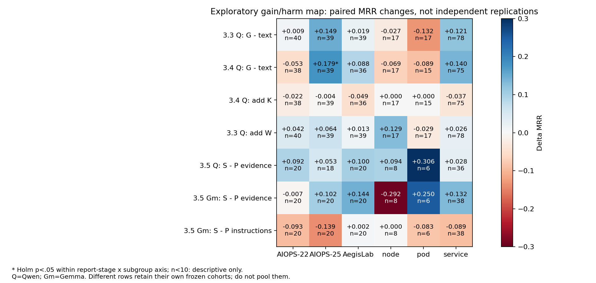

# RQ3.6 下一步计划：定位修复与破坏，保留有效诊断能力，再验证视觉增量

## 最新执行修订：历史核对后的三个精确机制实验

资格前CPU完整名册审计后，取消0/180适用的异宿主peer条件：最新正式上限 **12240**（4320+3600+4320），54次smoke，累计最坏23211。仅减少空干预，没有添加新条件填额度。详细协议顶部减项记录优先于下文初始规模。

2026-09-27用户批准继续实现并在测试通过后全量运行。三个后继是G成分逐项消融、固定pod锚点的host/peer析因与修复、固定观测的关系类型×绑定×承载。条件数12/10/12，各180暴露例×两模型，共12240正式逻辑单元；真实相同输入复用。硬上限40000不重置。完整数字协议、历史前驱边界、独立统计families和运行方式以 `RQs/RQ3_6/descriptions/RQ3_6_experiments.md` 顶部为准。旧14条件B不启动，旧A和资格不覆盖后继。

当前三个新实验静态、CPU三例204请求、各180例全容量检查已通过；三个bounded smoke分别18/18逻辑完成，实际调用18/16/18，真实输入图片及完整回答审核通过。当前合同`78a10ce7e1645bc526198927bdd7c9380ec509865f5115f050da7574e67a46c3`，正式授权已登记；实时状态见`RQs/RQ3_6/results/mechanisms_v2/formal_queue_status.json`。未宣称正式实验完成或有新科学结论。下方段落保留历史修订过程，不是当前运行入口。

## 当前修订入口：历史去重审计（2026-09-27，优先于下文）

旧B已暂停且没有正式结果；此前提出的三个宽泛新问题不能整体称为全新。第二次核对补入旧RQ3 SEARCH13/24/31、Tournament R16及RQ3.4 P×H×K/图文关系提示结果，见[三问题历史审计](../issues/RQ3_6_historical_question_audit_2026-09-27.md)。后继应取消泛泛复测G图文、整体去摘要、加宿主、标实体类型、通用重述/核验提示；仅保留尚未分离的组成/交互与针对已证实破坏的修复。12960正式单元只是去重前初拟规模，三个新v2配置不可执行，需完成具体修订、静态/CPU/GPU资格后才能启动。累计40000调用上限不变；原结果和资格有效性保持历史状态。本次核对没有新模型调用。

## 2026-09-27：阶段 B 的已授权修订（优先于下文旧 B）

最新执行授权：用户已授权全量B后台队列，启动确认后不持续监控。仅B的180例×14条件×两模型，Qwen→Gemma；不启动C/D。此前“资格后停止/无正式授权”是已被本次授权取代的历史状态，科学配置与通过测试的合同不变。实时执行状态见 `RQs/RQ3_6/results/visual_mechanisms_v1/formal_queue_status.json`。

执行状态：B代码、静态检查、CPU回归和GPU smoke已完成；10项单元、84份CPU请求检查通过，GPU18/18完成，276.903秒。人工检查完整输入/输出与PNG已完成。发现并修复了关联观测资格和画布容量问题，全部修订发生在模型调用前。[资格记录](../issues/RQ3_6_stage_B_qualification_2026-09-27.md)。目前停止，正式B和C/D均未启动；下面旧状态仅作历史。

本次只授权实现、静态审查、CPU回归及一个有界GPU smoke；通过后停止。A的输出、输入、分数、配置和报告全部保留，C/D不自动实施或运行。原B九条件保留，新增五条件，正式工作量从3240变为最多5040 calls（180病例×14条件×两模型），不是本次正式运行授权。累计40,000上限继续继承A的10,899次，不能重置。全部阶段均推进的原规划上限相应由19,272更新为21,072次（其中A已发生，不能再次相加）。

新增的动机来自既有输入/回答的事后核查：G图像减少对G第一名的追随，收益集中在具有根因关联操作证据的一组；同时存在把pod升级到service/node的错误。它们是待验证假设，不是因果定论，也不能按真实根因类型路由。

### B1：排除弱文本、位置及图像通道解释

固定P0、父版D_P、M/R/L文本、候选、统计与输出；条件为B0_T、B0_G，以及：

- `B0_ORDER_T`：只按数字实体/字段排序完整G记录，保留rank、onset、severity与全部边；不宣称这会消除显式rank偏置。
- `B0_REL_T`：按实体邻接关系组织全部G记录；字段不省略、排序固定。它是强关系文本，不新增推断的传播边。
- `B0_REL_S`：上述G关系文本原字逐行截图，仅损失无语义的换行；不称为真实dashboard。

原图对原文本、关系文本对原文本、原图对关系文本、原图对截图为四个预注册配对对照，跨两模型为8项Holm family。换序是次要位置干预。解释重点包括实际首位ID与G rank1的对应、局部Trace利用、层次错误、公开reason与排名矛盾；不能只凭MRR改善称为视觉因果推理。

### B2：修复范围错绑，而不是扩大布局搜索

保留原W、合格W、去peer及MORE。合格W从完整公共候选池出发，沿用P1H1的公开排序/预算，先排除没有实际变化或只含静态配置/时钟的锚点；同字段peer必须具有同单位/同时间段和显式共有宿主或服务归属。无peer保留单侧观测。非同字段的关联观测同样须有实际变化，避免旧包通过宿主动态锚点顺带带入不相干的启动时间/静态limit；同字段peer允许不变，作为该字段的有限对照。不得从operation字符串猜调用边。这是在模型调用前完成的资格规则收紧，W_OLD完整保留用于检验损失。

新增`W_SCOPE_T`、`W_SCOPE_G`：与W_QUAL选择完全相同的包和观测，不追加新来源、不重新挑选。将已有calls、hosts、owns分类型绑定到数字service/node/pod；观测数值仍在共同文本中，图额外把已有观测的实体/语义标签绑定到实体节点。文本条件提供相同绑定和关系；图节点和空间邻近不构成额外因果断言。这个实验研究关系与观测绑定，不声称全视觉。

图含真实节点/有向关系及保留所有G字段的可见明细；继承的G基线PNG原字节不动。新图与截图使用独立固定2304×3072画布、20px字体、26px行距，scope图区域1100px。此规格在模型调用前依据CPU容量失败修订，详见资格记录；不按模型成绩调整。几何计入token核算，不把它们与旧图差值称为纯布局效果。Scope文本/图事实相同，像素文本/真实图保持区别。禁止删字段、缩短事实来解决溢出；容量错误应在CPU阶段暴露。

原B的W_QUAL_G对B0_G/W_OLD_G/MORE/W_QUAL_T四对照继续作为独立主family，跨两模型8项。Scope_G−Scope_T、Scope_T−W_QUAL_T、Scope_G−W_QUAL_G跨两模型6项secondary family；其中后两项是绑定/表达整包变化。去peer为独立信息消融family，不声称等信息。所有子组探索统一校正，检验差值的交互，不用“某组显著另一组不显著”判断差异。

CPU先覆盖三主数据集各一例×14条件×两模型，并加入稀疏/孤立实体、长字段、相反方向边、常量、相容/不相容peer、全部无合格包等单元测试。检查所用源字段、真实PNG、跨模型相同输入、私有标签扰动、实际像素绑定、完整输出持久化和flag续跑。一个逻辑smoke以这三例×W_QUAL_T/B0_REL_S/W_SCOPE_G×两模型组成18个单元，总600秒。原G路径由既有资格及此次CPU覆盖，不能声称每一条件都进行过GPU验证。smoke表现不用于选择方法。D的固定hash重复性检查可在B结果分析前单独申请前移，不隐含追加本次调用。

主问题仍是提高MRR并辨认视觉增量。若强文本解释了旧图收益，应保留负结果；若新绑定图也无净收益，不自动扩大C/D、不以更多布局或训练填补结论。

最新状态（2026-09-26，取代以下启动/暂停状态）：阶段A正式check120已完成，并完成[离线分析报告](../experiment_reports/RQ3_6_Stage_A_Analysis_2026-09-26.md)。2640新增正式调用，累计10899；Qwen24超时涉及23例，主共同分母97，Gemma120。B–D仍未启动。报告提供后续建议，不追溯改变本计划的注册比较或正式评分；以下执行/资格条目作为历史保留。

执行状态更新（2026-09-26，覆盖下方历史暂停状态）：用户已单独授权阶段A全量check120。队列已后台启动，Qwen→Gemma，11条件、最多2640正式调用；B–D不自动运行。启动时累计8259次，当前资格/源码与2640个小flag检查耗时0.074秒，无旧请求重建。启动命令及状态见 `RQs/RQ3_6/results/replication_v1/launch_A_check120.sh` 和 `formal_queue_status.json`。按用户要求，启动确认后不持续监控。

日期：2026-09-26。状态：**阶段A已实现并通过静态、CPU与GPU资格检查；正式实验未启动，B–D仍为条件式后续计划**。计划最初由全部历史报告复读和离线统计形成；随后用户授权本轮实现和资格检查，并明确通过后停止。详细执行协议见 [RQ3.6 experiments](../../RQs/RQ3_6/descriptions/RQ3_6_experiments.md)，结果见 [资格记录](../issues/RQ3_6_qualification_2026-09-26.md)。本轮仅18次smoke调用，不训练、不新增attention、不重做raw preparation。

实施时确认了父版Trace单位标签的错误：存储微秒被字段标成毫秒，S分支已做×0.001转换。本轮独立`parent_trace_unit_labels_v1`仅修P侧/父版对照的单位名和字段后缀，不改变值、排名、选择或G图，不修改历史结果。因而受此修复的六条件是显式校准后继，不能直接复用文字不同的旧请求；所有新指令组件仍按下面的完整块交叉设计执行。

本计划接替 RQ3.5 的后续研究建议，不追溯修改任何已完成实验的协议、分数或有效性。RQ3.5 尚未运行的 J 扩量、J 视觉化不再是默认下一步；其代码与登记保留。

## 1. 决定：不是再提出一个“大一统新选择器”，而是保住增益、定位破坏

下一步分三个优先级：

1. **先复核证据包×诊断指令的正向组合，并拆出导致退化的指令组件。** RQ3.5 的 `E_S_D_P` 是值得跟进的候选，不是已经胜出的冠军；Gemma 的负向指令效应比很多新方法的正向效果更有统计依据。
2. **保留 Qwen 上反复出现的 W_NO_K/G 图像线索，针对其具体破坏点修订，而不是把有效骨干替换掉。** 重点是动态观测与配置量的区别、宿主与实例的范围、调用关系与故障传播的区别。
3. **最后才组合证据、合格补充和选择性视觉。** 同事实强文本始终在场；只有组合确有净修复，才扩到 RQ480、旧 test 回归和新事件。

暂不投入：新的选择器名单、全视觉主路线、大规模布局/分辨率搜索、更多普遍成立的 K 断言、当前低覆盖 J 的全量视觉化、SFT/RL、自动多轮诊断。

判断方式改为：

> 一个改动在哪里修复、在哪里破坏？变化是否稳定，能否追溯到某一项实际输入变化？能否只修改有害组件，同时保留有益部分？

总体未显著不等于没有值得研究的规律；子组显著也不自动等于发现了可部署的路由规则。**正向和负向使用同样的证据要求。**

## 2. 重读全部报告后的证据地图

以下覆盖本目录的七份报告，其中第一份同时包含 RQ1.1 和 RQ2.1。数值保留各自原报告的样本与检验口径，不跨轮拼成“性能学习曲线”。

| 历史阶段 | 值得保留的正向证据 | 需要定位的破坏/不足 | 本轮决定 |
|---|---|---|---|
| [RQ1.1](../experiment_reports/RQ1_1_RQ2_1_findings/findings.md) | 三主数据集 Qwen TPV .3093→.3819；选择性 G 承载有效 | 全视觉与 Metrics 图像化常退化；不同模型的交互不同 | 保留 TPV；数字密集 M/R/L 不默认转图 |
| [RQ2.1](../experiment_reports/RQ1_1_RQ2_1_findings/findings.md) | Trace-SC、Diversity 有净增益点估计；Qwen scale1.5 有收益 | SIGMA、表格截图式承载、部分布局显著有害；scale 收益偏 RE2，并非 AIOPS 普遍改善 | 从差异病例找机制，不恢复设计空间穷举 |
| [Tournament](../experiment_reports/Tournament_Analysis_2026-09-15.md) | 资源、Trace、日志、承载分别修复不同失败；R11 同事实 Metrics 文本化有大量新增成功 | 后期新增少；node 层次错误、根因已出现但仍选错突出；幸存集合不同 | 当作机制发现材料，不按淘汰数排序“专家” |
| [RQ3.1](../experiment_reports/RQ3_1_Results_Analysis_2026-09-19.md) | X 找到部分 P0 漏掉的证据 | 360-case 上根因 M 从207例降到67例，node根因M从28/51降到2/51；文本也未胜出 | 不整体替换骨干，不把新图美化当选择问题的补救 |
| [RQ3.2](../experiment_reports/RQ3_2_Results_Analysis_2026-09-22.md) | 保留骨干优于去掉骨干；Metrics文本比全视觉更有希望 | 覆盖增加未转为整体 MRR；统计、窗口、分组与真实实现混有变化 | 分开验证事实正确、诊断相关、模型利用；不得用 coverage 代替质量 |
| [RQ3.3](../experiment_reports/RQ3_3_Results_Analysis_2026-09-24.md) | Qwen check：W_G .4398，TPV .4000、MORE .4304；8 repair/2 break | Gemma 无对应收益；资源追加可能把 pod 故障推成 node；候选包分数饱和 | 保留 W/G，局部手术，不因未过边界阈值全盘放弃 |
| [RQ3.4](../experiment_reports/RQ3_4_Results_Analysis_2026-09-25.md) | Qwen 不加K .4468，对TPV .4163；G相对同事实T有+.0723点估计 | 加K降至.4219；真断言减少部分解释矛盾，却可能破坏排名 | K首先用于离线核验，不默认进入诊断输入 |
| [RQ3.5](../experiment_reports/RQ3_5_Screen_Analysis_2026-09-26.md) | E_S_D_P在两模型上均有正向点估计；Qwen W_NO_K仍有净修复 | Gemma换指令MRR显著下降；J仅28/60例有包、scope为0，实际生效子集也未有稳定收益 | 优先复核A；B保留W，不默认扩张J |

### 2.1 几条应改变下一步的具体解释

**A. “更真实”不等于“更能诊断”。**

RQ3.4 的 K 可以证明实体类型、数值大小或局部先后，但这些关系可能不具有区别竞争根因的作用。把它们显式强调，反而可能压过原来很强的操作级延迟。这不是要求放弃自动核验，而是区分：**检测不实陈述**和**提供有效诊断依据**是两项能力。

**B. “根因被选到”不等于“故障机制被选到”。**

节点的 memory request、某个时刻 readiness=1、一般活动量，都可能涉及正确实体，却不能代替持续资源压力、restart 转移或同类实例对照。下一轮记录实际机制字段，不再主要追求 root-associated fact 数。

**C. “前五命中”与“首位正确”有不同失败位置。**

Gemma 在同 S 证据下，从 D_P 换 D_S：AC@1 都是28.3%，AC@5却从56.7%降到35.0%，平均候选数3.6→2.3。这是备选排名丢失，不能等价解释成每个案例的第一判断都变坏，也不能用强制补足五个ID解决。

**D. 视觉可能帮助关联排序，同时伤害某些层次的比较。**

Qwen 的 G 图像多次对 service/AIOPS-2025有正向线索，而 node/pod 有不同甚至反向变化。需要检验是否与关系结构、节点类型及数字证据竞争有关；不能按 dataset 名或真实根因类型部署两套路由。

**E. 目前 SIRCL/P0 的“证据效应”是整包效应。**

它包含选中对象、统计量、时间切分、单位表达和序列化，不是纯 selector 的因果效应。原工具应作为注明来源的基线。方法贡献不能是复制其 prompt，也不能将公共接口改善冒充新的筛选算法。

## 3. 本次新增的对称离线统计

### 3.1 可复算材料与口径

- [逐组统计](RQ3_6_gain_harm_assets/subgroup_tests.csv)：3,311行，包含正向、负向、无变化及不足10例的描述性小组。
- [逐病例配对差值](RQ3_6_gain_harm_assets/paired_deltas.csv)：17,502条比较记录，**不是17,502个独立病例**。
- [事件组敏感性](RQ3_6_gain_harm_assets/group_sensitivity.csv)、[共同病例与排除表](RQ3_6_gain_harm_assets/cohorts.json)、[来源与脚本hash](RQ3_6_gain_harm_assets/provenance.json)。
- 复算脚本：[analyze_gain_harm_review.py](../../RQs/RQ3_5/scripts/analyze_gain_harm_review.py)。读取报告CSV，不重新评分、调用模型或重建旧请求。

这是**事后探索性分析**。每个报告阶段×分层轴内，对本次列出的全部比较、两模型和所有可检验子组统一 Holm；n<10只描述。数据集、根因层次、具体故障类型均完整保留，不挑有利小组。不同轴、阶段的探索不是一个新的确认性结论族。

根因层次按 gold numeric root IDs 的既有3/4/5位类型契约重建，并与RQ3.4/3.5的私有标签核查一致；旧 metadata 中部分只有service根因却标mixed的行不沿用。只改变本次分层，**不改变任何RR或旧报告**。pod+service合法标签集合单列，不混入纯service。

RQ3.3–3.5采用各阶段全部arm的共同完成病例；较早阶段使用本次涉及arm的共同完成病例。模型失败和注册设计不可执行保留原分；基础设施缺失不填零。分母可能与旧报告的单对配对不同，不能混用。

图中正负均展示；星号只表示本次事后family的校正结果。多轮使用相同病例，不是独立复现。

### 3.2 新的、可定位的正向线索

| 比较/模型 | 子集 | N | ΔMRR | Top-1 repair/break | 本次Holm p | 判断 |
|---|---|---:|---:|---:|---:|---|
| RQ3.4 完整G−完整T / Qwen | AIOPS-2025 | 39 | +.1795 | 11/0 | .0457 | 值得优先复核的局部视觉收益；39个事件组口径方向及检验相同 |
| 同一比较 / Qwen | AIOPS-2022 | 38 | −.0526 | 2/3 | 1.000 | 反向趋势；尚不能声称两个数据集效果差异显著 |
| 同一比较 / Qwen | service根因 | 75 | +.1400 | 21/4 | .1874 | 效应较大但未校正显著，不能因此丢弃 |
| RQ3.3 W_G−TPV / Qwen | node根因 | 17 | +.1294 | 2/0 | 1.000 | 小样本资源/范围线索 |
| 同一比较 / Qwen | pod根因 | 17 | −.0294 | 0/1 | 1.000 | 要同时解释的破坏，不能隐藏 |

这里最有价值的不是宣布“图对AIOPS-2025总是更好”，而是已经有一批**相同追加证据、换G承载便修复排名**的病例，可以用来定位关系读取的条件。RQ3.3的G−T在AIOPS-2025也为+.1487，但校正不显著；两轮有重复病例/相近输入，不能合并p值当独立重复。

### 3.3 明确的退化与尚待复核的退化

| 改动/模型 | 分组 | N | ΔMRR | 本次Holm p | 后续处理 |
|---|---|---:|---:|---:|---|
| RQ1.1 Metrics转图 / Gemma | pod根因 | 38 | −.3289 | .0266 | M保留文本；不再把M视觉化当默认优化 |
| RQ1.1 Trace转图 / Qwen | AegisLab | 100 | −.1308 | .0217 | 操作/耗时等数字字段优先可直接读取的文本 |
| RQ2.1 SIGMA−P0 / Gemma | AegisLab | 100 | −.2617 | .00043 | 不用统一偏离排序替换多来源骨干 |
| RQ2.1 SIGMA−P0 / Qwen | AegisLab | 100 | −.1278 | .00974 | 同上，追查实际删掉的字段/机制 |
| RQ2.1 topology-centered−D0 / Gemma | AegisLab | 100 | −.1700 | .0415 | 不是越突出拓扑越好；不扩大此布局 |
| RQ3.4 加K / Qwen | service根因 | 75 | −.0367 | 1.000 | 4 break/2 repair，作为组件副作用线索，不称已证实普遍退化 |
| RQ3.5 S证据−P证据、固定D_P / Gemma | node根因 | 8 | −.2917 | 不检验 | 1 repair/3 break，必须进入反例审查；不能基于8例宣布方法规律 |

另外，RQ3.5原登记factor family中，Gemma D_S相对D_P的平均指令效应为−.0692、Holm p=.0241；事件组等权后为−.0628、p=.0727。该结果使用**原报告登记family**，不是本表事后family，不能混在一起比较p值。

具体fault-type小组在本次宽family下未形成校正显著的新局部结果。某些大点估计仅有几例，保留为假设，不因为不显著认定其无价值，也不事后合并成有利的“故障族”来求显著。

### 3.4 将MRR增益精确拆开

每个case定义：

`RR = 1[rank=1] + (1/rank)·1[2≤rank≤5]`。

因此 `ΔMRR = ΔAC@1 + Δtail-RR`，是可精确复算的分解，不是推理正确性的证明。下一轮必须同时报告：

- 前五外→前五：新增提名；
- 前五内→第一：排序修复；
- 原第一→后移或消失：关键破坏；
- 原2–5→消失：备选丢失；
- rank变化但解释仍错：质量与解释分开。

不能只计算“修复病例中的平均提升”，那会按结果筛选而必然得到正效应。所有检验先在完整配对子集完成；repair/break的条件分组用于机制描述。

## 4. 用成对反例来决定改哪个组件

以下不是新模型推理，来自报告中已有的原始输入/输出审计。

| 病例 | 已观察的帮助或破坏 | 可以定位什么 | 不能直接推断什么 |
|---|---|---|---|
| `INC-27F3…`，ContainerKill，root419 | restart0→1，peer同字段保持0；W将未命中修复为第一 | 有语义的状态转移＋同字段peer值得保留 | 不是任何“正常peer”都能证明宿主健康 |
| `INC-9D1784608F61`，node disk fill | root1847晚于service365显示onset，追加资源/归属后修复 | 根因不一定是最早显示异常者；宿主观测有价值 | 不能把一个具体资源值当通用node判据 |
| `INC-6D1C8225111D`，HTTP delay | root386巨大exclusive latency仍在；K强调318pagefaults后根因消失 | 真但次要的断言可能竞争诊断权重 | 单次变坏不能证明稳定因果；需重复/组件删除 |
| `INC-9ACC…`，node root5529 | S证据仍有I/O异常，却把pod76890排前 | 不是纯召回问题，而是层次与证据强度竞争 | 不能据此永远优先node |
| `INC-8201EB3924F3`，pod kill | operation `112.626/AddItem`被解释为调用边；换指令修复 | operation文本与权威entity/edge字段的绑定可测 | 一例不能说明某整套指令总是坏 |
| `INC-BF08743A4A7D`，ContainerKill | Qwen被新966延迟吸引，忽略其负关联，root从第一到第四；Gemma却修复 | 同补充有模型异质性，负向对照也需要被正确使用 | 不能简单合并两模型胜者 |
| `INC-1B936A4C6354`，IO fault | D_S抓住404I/O，D_P被别的pod内存吸引 | 父版指令也会破坏；必须保留反例 | 不能由平均指令退化推成“始终用D_P必正确” |

缩写case只作表中索引，完整ID及原证据见对应原报告，实施前从报告索引展开，不凭前缀挑新样本。

## 5. 本轮主方法候选：保留骨干的合格动态补充，而不是专家集成

本轮暂称 `W_QUAL`，不预先宣称它是最终主方法。

### 5.1 不变的边界

- 固定模型、一次RCA调用；不训练、不让LLM先选根因再检索。
- 候选全集与输出JSON不变，候选仍在文本；不补齐答案、不重排已有模型答案。
- 基础M/R/L事实不删除。新补充最多2,048 tokens；无合格包则不追加。
- G只在文本或一张真实图间切换；本轮不是全视觉部署路线。
- 自动核验继续做离线sidecar，明确区分不实、支持、不足以判断；不删候选、不按核验结果挑答案。
- 完整per-case public数据可访问，不以旧top-k冒充完整池；不再次处理raw大表，不展开大量原始日志。

### 5.2 对旧W做两项可消融的修改

**修改一：补充必须围绕一个实际变化的诊断观测，而不是容易证明的配置事实。**

可用锚点：restart等观测状态转移；可解释的资源水平/波动变化；operation级耗时、请求量或错误组成变化。沿用冻结的公共统计和方向，避免重新设计一个跨模态任意加权异常分数。

以下不得单独成为入选锚点：静态memory request/limit、正常配置相等、调用边存在、任意小数大小关系、仅凭日志/trace缺失得出的“健康”。这些字段若是必要解释上下文可保留，但不占动态覆盖资格，不赋予额外根因权重。

这不是断言静态配置没有诊断价值：端口等配置若与实际错误观测相互印证，可以成为对应包的关联上下文。配置类故障要专门审查break，防止资格过滤误伤；若真正有用的配置事实被删掉，记录反例并在唯一一次有界修订中处理，而不是修改评分掩盖损失。

**修改二：对照范围必须与变化的语义匹配。**

- node资源锚点：展示其实际资源变化及公开归属；有兼容peer观测时才加peer。
- pod状态/资源锚点：展示该pod与同字段、同时段、同单位的可比较peer；不将“相同配置”写成“未受影响”。
- operation锚点：绑定记录的实体字段；operation名称里的数字不生成调用边。
- 没有可靠peer时保留单侧观测，不要求完整双侧配对，更不造零或正常值。
- 已观测“peer未发生该项变化”仅适用于该字段，不外推为整体健康。

### 5.3 精确到可实施的选择过程

1. 从旧W的公开候选池及已有索引构造原候选，保留全部来源；新增字段入口必须另登记，不能混进这次资格规则消融。
2. 将每包拆成anchor、同字段对照、必要关系、其他上下文。资格筛选在原排序之前；若无合格anchor，不进入补充候选。
3. 合格包仍按旧W已经冻结的排序及稳定tie-break选取。本轮不同时“修分数饱和”、加新阈值、换排序和改排版，否则无法定位收益来源。
4. 每包最多一个主要变化锚点、两个真实peer/关联观测及必要关系；不同单位不直接作差。最多四包、总追加不超过2,048 tokens，每次只提交完整包。
5. 基础证据中已出现的anchor不能仅凭重复自身再得一包；但新的同字段peer/归属可以使该包有实际增量。逐包记录新事实和重复事实。
6. 所有eligible/no-op/拒绝原因落盘；无合格包就退回原输入，不将其当失败或补入“看起来有用”的配置量。

优先复用旧W的公共变化资格判定，不在本轮拍脑袋新增阈值；源代码若没有明确定义可复用的变化判定，先在CPU产物中登记字段语义、阈值、缺失处理及例子，再冻结一次，不边看模型成绩边调。

它可能失败：过滤掉的弱信号或配置变化也可能有用，合格包数量可能减少。这正是要保留原W、MORE和去peer条件的原因。**不保证W_QUAL优于旧W。**

## 6. 四个有边界的实验

### A：复核整包收益，拆解负向指令效应

名称：`exp_evidence_instruction_replication`。

首先进行零调用源码/输入审计：把当前D_P与D_S精确分成“领域/字段阅读与诊断规则”`G_P/G_S`，和“形成假设、VERIFY/REVISE措辞”`V_P/V_S`。两者**都已有verify流程**，不得把差异误写成“有推理与无推理”。RQ3.5实现位置：`RQs/RQ3_5/src/exps.py::crossed_parts`；D_P保留详细MET-Z/TRC-L/LOG-R规则，D_S使用不同背景和压缩后的诊断步骤。

冻结两个原块的字节边界，只交叉整块，不额外撰写一篇更长的提示词；task、候选、输出契约、证据及公共封装保持一致。

在既有check120上完成以下11条件，两模型顺序运行：

| 条件 | 用途 |
|---|---|
| `E_P_D_P`, `E_P_D_S`, `E_S_D_P`, `E_S_D_S` | 原2×2证据整包/指令复核 |
| `E_S_G_P_V_S`, `E_S_G_S_V_P` | 与两个S证据原条件共同构成指令组件2×2 |
| `T_NATIVE`, `SIRCL_IDS_NATIVE` | 原生接口校准与来源基线 |
| `TPV`, `MORE`, `W_NO_K` | 同病例强部署对照，不能只战胜弱文本 |

最坏 **11×120×2=2,640 calls**。已有相同请求可复用，不能重抽模型输出直到趋势变好。旧screen60是发现材料，不为了好看重新命名为独立test；check120也早已用于其他研究，是**新条件在另一批已暴露病例上的复核**。

特别处理：P0与S证据有数值/单位/时间统计差异。CPU审计抽查全部共同operation、异常量纲和时间边界。若源数据证明实现单位错误，单独版本化修复并记录受影响事实，不能带已知错误继续新调用；若差异是合法统计定义，保留并明确整包比较。任何必要修复导致无法复用旧请求时计入新调用，不覆盖旧桥梁。**不凭某一例数字大1000倍就自动重写整批历史结果。**

输出必须含：MRR与AC@1/tail-RR分解、候选数、首位稳定但尾部消失、未知ID、normal stop/截断；解释重点是错读字段/关系与支持证据，而非猜隐藏思维链。

### B：只修W中可能导致破坏的组件，并检验G的条件收益

名称：`exp_qualified_witness_and_graph`。

使用固定P0 M/R/L、固定D_P，不因A的临时结果换底座。既有screen60＋check120共180例，两模型；先冻结全部条件再运行。共九条件：

| 补充 | G全文本 | G原图 |
|---|---|---|
| 无 | `B0_T` | `B0_G`（TPV校准） |
| 原W_NO_K | `W_OLD_T` | `W_OLD_G` |
| W_QUAL | `W_QUAL_T` | `W_QUAL_G` |
| W_QUAL去掉peer观测 | `W_Q_NO_PEER_T` | `W_Q_NO_PEER_G` |

另一个条件为原 `MORE`，保留与W相同追加上限的加量对照。最坏 **9×180×2=3,240 calls**。

关键控制：

- 同一行的T/G拥有相同关系事实及补充；T保留类型、方向、字段、时间与分组，不用弱化文本制造视觉优势。
- `W_Q_NO_PEER`使用W_QUAL选定的同一包和同一anchor，只移除peer值及其专属说明，不重新选包、不补齐空余budget。这是有意信息消融，不叫等信息。
- W_QUAL对原W首先是资格/组成变化，token和包数也可能变化；MORE只有同上限，不是严格同token。逐项报告，不把更短输入自动等价为更聪明选择。
- 旧G图片能原字节复用就复用，不加新布局、放大图或改变分辨率；新说明不得偷偷提示哪些实体“更可能根因”。

主要回答：过滤配置型干扰是否减少break；真实peer是否帮助node/pod区分；G优势是否来自service依赖结构；资格规则有没有把有益的弱资源/日志信号一起过滤掉。

### C：有限组合，不按病例挑专家

名称：`exp_evidence_witness_composition`。只有A或B出现值得复核的净增益且输入机制成立，才开展。

固定S的M/R/L证据、D_P，以及**与B相同的P0 G事实**。这样同一个P0拓扑可以直接与两种证据骨干组合，不另外设计一个S专用图。

四条件：S＋公共G文本、S＋公共G图像、S＋W_QUAL＋公共G文本、S＋W_QUAL＋公共G图像。同180例，两模型，最坏 **1,440 calls**。

必须把“不加W的S＋公共G文本”与A的原`E_S_D_P`比较，单列替换G事实的校准影响。不能把G集合变化误归到视觉，也不能把校准条件称为原生SIRCL。

B/C共同提供 `证据骨干P/S × W资格补充无/有 × G文本/图像` 的八锚点空间；计算条件效应和交互，不称为全部RCA方法的固有贡献。

候选方法是固定规则和固定输入编译器。不得使用真实fault type、root层次、case ID、历史成功情况或模型本轮回答来决定用P还是S、用图还是文。

### D：稳定性和锁定评估

名称：`exp_locked_gain_preservation`。

先在按hash固定的30例（三主数据集各10）做有界稳健性：

- 四个指定条件：E_S_D_P、TPV、W_OLD_G、W_QUAL_G；每条件两次额外独立调用，两模型，共480 calls。
- W_QUAL的T/G两条件：一致重匿名化、候选顺序重排，各一次，两模型，共240 calls。
- 合计 **720 calls**。case才是统计单位；重复调用不当额外病例，不取最好一次。改ID时同步全部事实、候选、关系与评分映射。

这30例由公共身份hash决定，不挑修复病例。研究版仍保留原采样配方；测量的是实际输出波动，不要求字节重复。

然后锁定单一证据骨干和是否使用W_QUAL。先以三主数据集等权Qwen MRR作研发判断，同时披露Gemma；不得用RE2饱和结果抵消主数据集严重退化。两个骨干/有无W差距在.01以内时，优先较少新处理、较低实际输入输出开销的方案。这个规则只用于选部署候选，所有条件完整报告；不作为统计成功标准。

锁定评估固定六方法：TPV、MORE、E_S_D_P、SIRCL_IDS_NATIVE、最终编译器的同事实强文本、最终编译器的G图像。最后两个是固定一对，不按case取胜者。

- RQ480全部：最坏5,760 calls，合法复用会减少实际调用。
- 既有test360：最坏4,320 calls，称**已暴露的锁定回归**。
- 真正未使用事件：来源历史/别名/重叠窗口组审计后，最多每主数据集30、合计90；最坏1,080 calls。不足则按实际数量，不拿旧validation改名。

**不能为了达到MRR目标反复查看这批新事件再调同一版本。** 若新事件失败，保留结果并登记新问题，不将该集合继续当独立验证。

## 7. 怎样识别“为什么好/为什么坏”而不做事后叙事

### 7.1 固定五个错误环节

对同case的rank变化追踪：

1. **观测缺口**：根因对应机制在public源数据是否存在；没有则本轮输入工程不能凭空补出。
2. **选择缺口**：源中有，但不在实际输入；区分被预算丢掉、资格过滤、统计聚合、接口绑定。
3. **阅读/绑定缺口**：输入确有明确事实，reason引用的数值、实体、方向、单位错误。
4. **诊断权重缺口**：事实被正确引用，但弱异常、配置或受害者症状压过更有区分力的证据。此类需要组件干预/重复性支持，不能只凭文字猜测。
5. **答案形成缺口**：合理备选消失、同实体重复、未知候选等；与第一候选是否正确分开。

每条可定性标签记录原输入位置、输出位置、对照变化、支持/疑似/无法判断。纯sidecar无告警不能等于解释正确。

### 7.2 对称抽样

每个主比较同时抽 repair、break、双方均对、双方均错；每个数据集每组按hash最多两例。某组无样本如实空缺，不找替代来凑正面故事。先审核与rank相关的可观察断言，再看其是否对应被改变的组件。

对关键break：验证根因机制仍在输入、竞争者新增了什么、有没有实际单位/归属错误；对关键repair同样要求，不能因为答对就放过错误理由。单一actor自动审核称“证据审计”，不虚构两名标注者或互标一致性。

### 7.3 不按结果做统计分组

计划的公共观察条件包括：有无操作级trace、可核验host映射、有无同字段peer、有无离散状态变化、关系图分叉度、原候选规模。阈值在推理前冻结，不用历史RR调到显著。gold fault type和root层次只用于评估分层，不输入方法。

“某组显著、另一组不显著”不代表组间差异显著。正式机制分析必须直接检验 `ΔRR` 的组间交互；对root层次控制dataset构成、按事件组做敏感性，报告共线和样本不足。连续结构特征优先保留连续值，不搜索最有利切点。

## 8. 统计与进退规则

### 8.1 统计口径

Primary为MRR；AC@1/3/5、AVG@3/5、head/tail-RR、repair/break、新增/丢失前五为secondary。五数据集分别、三主数据集macro、五数据集macro、两AIOPS分别/合并、pooled各标清分母。

配对Pratt-Wilcoxon、paired Cohen's dz、Holm；不报告CI。事件组等权是敏感性，不替代case成绩。模型输出失败保留注册计分，基础设施缺失单列共同配对排除，不自动套5%接受门槛。

预登记family：

- A主family：原证据效应、原指令效应、交互×两模型，共6项。组件G/V的主效应及交互×两模型另6项；原生校准为单独secondary family。
- B主family：W_QUAL_G对B0_G、W_OLD_G、MORE，以及W_QUAL_G对W_QUAL_T，跨两模型共8项。peer消融另family；dataset/root层次/公共可观测性异质性完整登记、统一校正，不见结果再拆。
- C主family：证据、资格补充、G承载及二阶/三阶交互，跨两模型共同登记；G集合校准另列。
- D主family：固定视觉方法对TPV、MORE、E_S_D_P、SIRCL_IDS_NATIVE和同事实文本，跨两模型共10项，旧test与真正新事件分开为不同评估层；不能事后选其中成功的一层充当全部结论。

探索性更细fault子组仍保留，但不偷偷升级成预注册确认性分析。不合并重复病例跨轮p值；更换新任务编号不会让旧样本变新。

### 8.2 阶段投入规则，而非自动后台gate

**先看MRR及其修复/破坏构成，再看成本。** 不把格式改善、可见事实增加、告警减少当MRR改善。

- 大点估计、机制一致但尚不显著：允许一次预先有界的复核，不立即丢弃，也不追加样本直到p<.05。
- 负向校正显著且组件差异清楚：优先停用/修改该组件，再登记新版本；同时核查事件组、基础设施和错分层是否造成假象。
- 负向未显著但反复出现同类break：安排对应组件消融，不宣称“没有影响”。
- 总增益主要来自tail、AC@1无改善：称“备选保留改善”，仍有MRR价值，但不宣传首位诊断突破。
- 总增益主要来自RE2：不能满足本项目主要准确率目标。
- A/B都没有可复核净增益：不自动开展C/D全矩阵，优先完成观测/机制审计；不默认加新selector、训练或二次调用。

本轮不再使用“比门槛少0.0005所以全部停止”的机械判断。推进理由必须写明效应大小、break代价、模型/数据集异质性、重复性及还缺哪条证据，且不更改原始统计family。

论文“实质性提升”继续要求ΔMRR≥.05且校正p<.05；小而可靠、或大而待验证的结果照实报告。长期目标test≥.65、两个AIOPS≥.60不变，但当前证据离该目标尚远，本计划不作必达承诺。

## 9. 工作量与优先执行次序

| 工作 | 最大新增调用 |
|---|---:|
| A：11条件×check120×两模型 | 2,640 |
| B：9条件×180×两模型 | 3,240 |
| C：4条件×180×两模型 | 1,440 |
| D：稳定性/非语义干预 | 720 |
| D：六方法RQ480全量，未假定复用 | 5,760 |
| D：六方法旧test360 | 4,320 |
| D：六方法最多90新事件 | 1,080 |
| 四个逻辑smoke，每个最多18 | 72 |
| **全部条件均推进时的规划上限** | **19,272** |

19,272是工作量，不是新的硬门槛，也不是新的40,000授权。实际执行前读取原累计调用记录，smoke、失败、被清理的旧正式调用和必要重试均计入所属大RQ的40,000累计上限；不能由RQ3.6名字重置额度。预算不足先缩减未执行次要分支，不能覆盖旧消耗。

最先只实施：零调用数据/指令审计→静态/CPU→A的bounded smoke→A check120。**不一开始提交19,272 calls的整条大队列。** A完成后基于完整结果决定B的实施优先级；C/D都条件式推进。

CPU复用per-case数据与现有可用索引，八worker有界内存/独立核心、尽量分散cloudbed。一次建case索引，各arm复用；不逐arm扫描大日志表。保留轻量done/fail、writer drain、只续未完成单元；不恢复全量重建请求或大文件校验。模型推理配方、8192输出适配器和scorer不变，不增加attention。

每个逻辑smoke按届时项目有效规则执行，聚合≤18 calls、≤600秒；定向补验按明确授权处理，不切分名义smoke绕开限制。真实输入、图和完整conversation必须人工检查；正确根因与否不是资格门槛。

当前没有这些新条件的真实耗时，不给出未经测量的完成日期。可用旧请求wall作容量参考，但并发排队时间不是孤立部署延迟；先测CPU增量和首个完整阶段吞吐再估总时长。

## 10. 可以争取的故事与交付标准

不是“不断换方案终于找到一个高分表”，而是：

> **RCA失败不仅因为少了证据，还因为事实语义、实体范围、诊断程序与表示之间不匹配。真但不相关的补充会破坏本来正确的判断；具有诊断语义的观测与局部对照能够修复特定失败。CanvasRCA通过受控组件实验保留这些修复、减少破坏，并验证图像是否在关系绑定和候选排序上提供强文本无法替代的增量。**

这段是待检验的主线，不是已完成贡献。需要形成四项证据：

1. 最终固定方法相对强基线有实际MRR提升，而不是跨arm oracle覆盖。
2. 修复与破坏均有逐病例、分数据集和分机制证据；显著与不显著都报告。
3. 同内容、同对比分组的强文本控制下，视觉的条件增量可定位；若无增量，收窄视觉结论。
4. 方法锁定后在非本轮调参事件上复核，明确旧test暴露与新事件数量限制。

第一篇不要求RL，不要求付费人工研究，不要求一个模型在所有子组都最佳。也不能把提示词移植、某些字段核验成功或一张更漂亮的图当作足够创新。若结果支持，真正的方法贡献应是**可追溯的诊断证据资格与范围约束，以及它与视觉关系承载的协同**；若结果不支持，就保留为被推翻的假设，不继续堆叠组件。

本次到此停止：新增的是计划与离线分析附件，没有启动本计划的实验。
