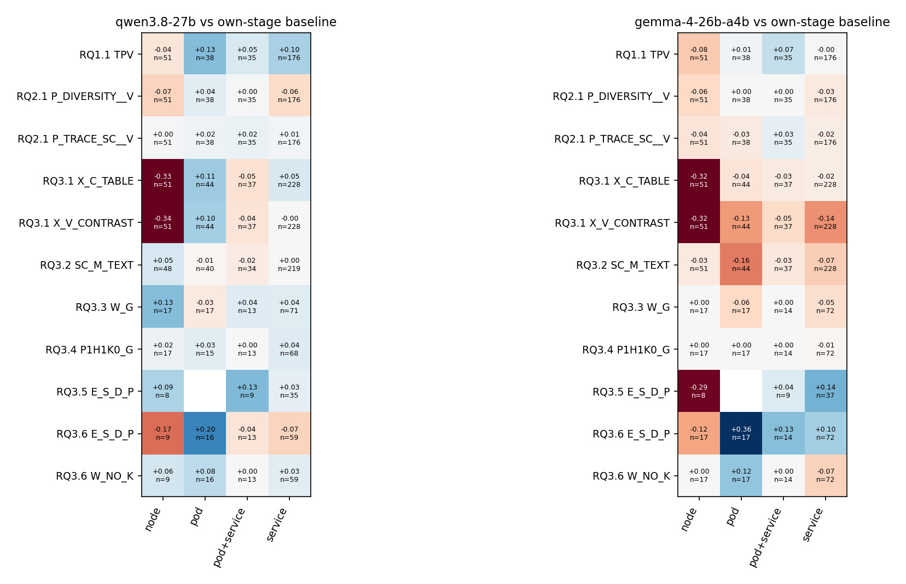
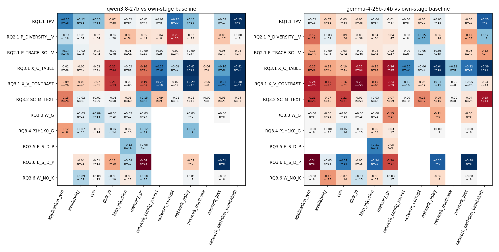
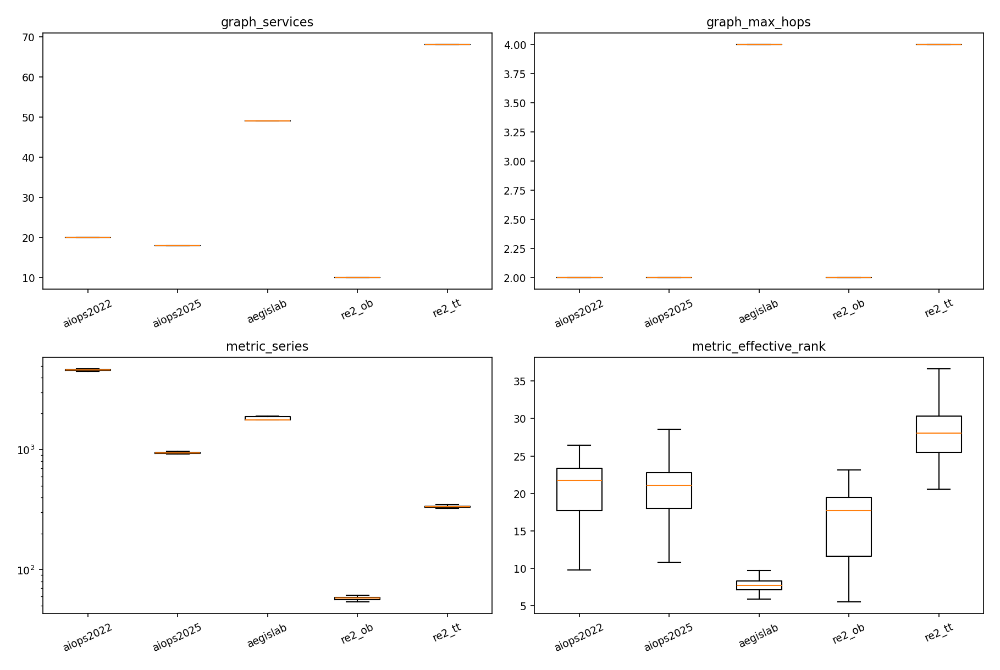
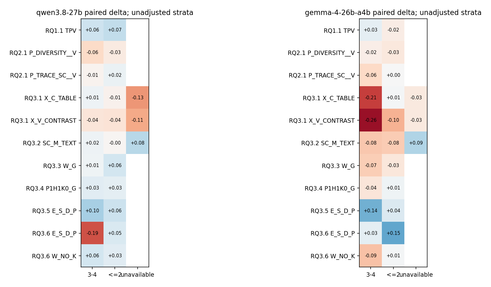
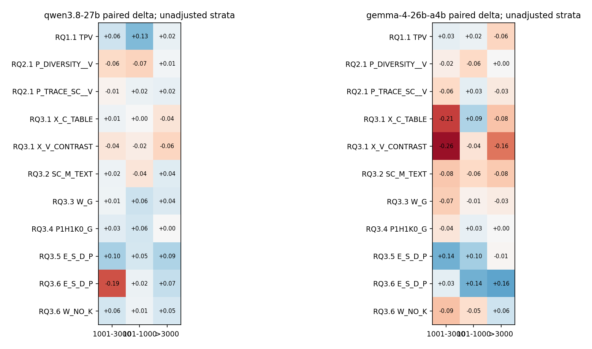
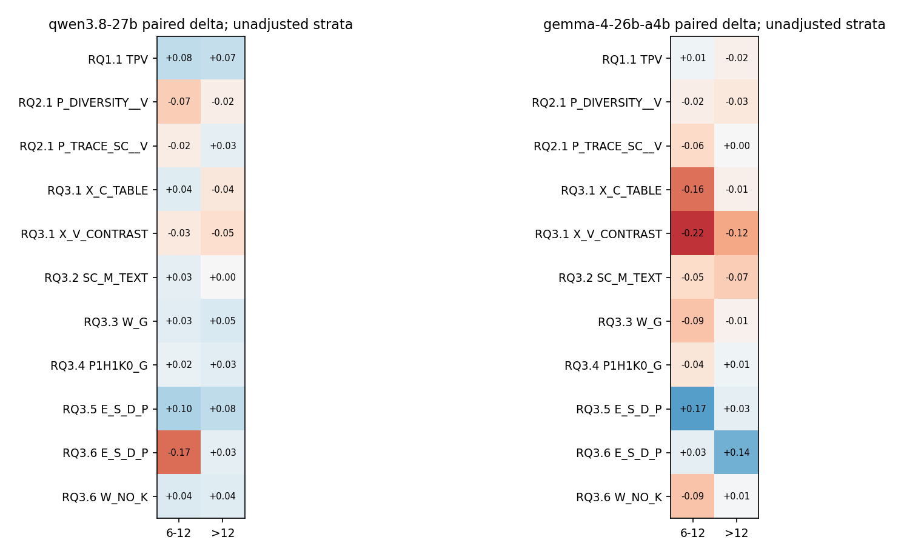

# 跨实验方法能力画像：根因层级、故障类型、依赖图与 Metrics 复杂度

日期：2026-09-26。覆盖 RQ1.1、RQ2.1、Tournament、RQ3.1–RQ3.6 已完成阶段；最新阶段为 RQ3.6 A。**只做离线分析，不新增模型调用，不修改原输入、输出、评分或实验队列。**

## 1. 结论先行

这次分析支持建立“方法—故障模式”的画像，但不支持按所有实验的最高 MRR 拼出一个通用冠军。

1. **node 是持续、明确的短板，不只是某一个新方法失败。** Tournament 累积38轮后，Qwen/Gemma 的 node Top-1 联合覆盖只有25/51、22/51；曾进前五分别为45/51、43/51。许多病例存在排序与层次竞争问题，但前五命中本身不证明理由正确。
2. **TPV 的优势有层级与模型边界。** RQ1.1 中，Qwen 的 service MRR从T的0.3958升至TPV的0.4934，pod从0.0877升至0.2171；node反而从0.2719降至0.2353。Gemma没有复制同样的service增益。这些分层点估计不能扩大成已确认的普适优势。
3. **X 不是完全没有捕捉到信号，而是发生了严重的能力交换。** RQ3.1 test 中，X-table明显偏向网络延迟、丢包等模式，却几乎失去了node诊断能力。丢掉它的全部设计信息，和直接推广它，都是损失。
4. **SC 和最新S证据呈现不同方向的互补。** SC在Qwen的内存/GC与部分node病例上有正向迹象；最新S证据在pod、丢包上有正向迹象，却牺牲了内存及node。应研究保留哪些具体观测，而非机械拼接方法名。
5. **依赖图的hop深度几乎就是数据集身份。** A22和RE2-OB全是2-hop，AegisLab和RE2-TT全是4-hop；A25除18例无可用边和1例1-hop外，其余201例是2-hop。当前不能可信地宣布某方法“擅长4-hop、害怕2-hop”。
6. **Metrics数量、变化丰富度、冗余和诊断难度不是一回事。** A22中位数4,612条series，A25为937条，但两者抽样时序形状的有效秩中位数接近。列数不能独自解释难度，也不是模型实际收到的上下文长度。

最有价值的后续方向是：**保住资源/内存等直接机制证据，同时利用操作级/网络行为证据区分传播症状；再判断表示是否帮助读取和绑定。** 当前分析没有证据支持按真实fault type或真实root level给方法路由——这些标签在部署时不可用。

## 2. 分析覆盖范围与可比较性

### 2.1 本次纳入了什么

| 来源 | 逻辑记录 | 不同cases | 条件数（阶段＋arm） |
|---|---:|---:|---:|
| RQ1.1 direct RCA＋counterfactual | 22,080 | 480 | 23 |
| RQ2.1 选择、剪影、编排 | 37,440 | 480 | 39 |
| Tournament 38轮 | 10,789 | 480 | 38 |
| RQ3.1 模型条件 | 26,360 | 840 | 54 |
| RQ3.1 已完成CPU排名基线 | 1,440 | 360 | 4 |
| RQ3.2 | 27,280 | 840 | 41 |
| RQ3.3 | 4,080 | 180 | 29 |
| RQ3.4 | 3,720 | 180 | 25 |
| RQ3.5 A/B screen | 1,440 | 60 | 12 |
| RQ3.6 A check | 2,640 | 120 | 11 |
| **合计** | **137,269** | **840个唯一case** | **276** |

逻辑记录包含历史复用、机制条件的不适用终态、独立重复及CPU排名；**不是137,269次新增推理，也不是137,269个独立病例。** RQ3.3 budget含引用的既有结果。QA、训练、smoke、弃用RQ2和未运行阶段不计入RCA方法画像。BARO使用补算后的NaN适配CPU版本，不采用被其取代的排名。

276指阶段化的条件身份，包含反事实干预和重复条件，不是276个可部署算法。部分历史CPU基线未保存AVG@3/5，本次保留空值，不臆造缺失指标。

840例由既有480 eval和360 test组成。后续screen/check是其中的子集，不另算新病例。各方法仅对实际运行过的病例统计；没有补造“后期方法在早期已淘汰病例上的结果”。

### 2.2 比较规则

- 原始per-case MRR、AC@1/3/5、AVG@3/5原样继承。模型格式/非法候选失败保留原零分；基础设施缺失不是诊断零分。
- 常规阶段按该实验×模型的全arm共同完整病例比较；条件式机制干预保留适用集合，并仅在有共同观测时配对。
- 先给**各方法绝对成绩**，再给**同阶段、同病例相对基线的变化**。同名TPV在不同阶段的请求、采样和病例可能不同，不能合并成一次实验。
- 所有五个数据集分别、两个AIOPS合并、三主数据集合并、全部实际病例合并均落表。主文大部分数值使用三主数据集，避免RE2掩盖困难。
- 本文的`main_three`与`aiops_combined`都是**病例加权pooled**，不是数据集等权macro。RQ3.6的Qwen分母32/35/30不等，因此与上一报告macro总值有轻微差异。
- 配对检验：Pratt-Wilcoxon、paired Cohen’s dz；Holm family为“study×stage×scope×分层维度”，包含该维度的全部分层、条件与模型。另做原事件/重叠窗口group均值敏感性分析。不报告CI。
- 这是大范围**事后探索**。本次Holm family不同于历史报告的预注册主比较；不能用新的p值替换旧报告的检验结论。跨不同分层维度/阶段的检验也不构成全项目一个统一错误率保证。

各基线的选择与排除病例见[方法目录](Cross_Experiment_Method_Profile_2026-09-26_assets/method_catalog.csv)、[分母审计](Cross_Experiment_Method_Profile_2026-09-26_assets/cohorts.csv)。最新Qwen主分析97例，Gemma120例；不能据两列直接推断模型强弱。

## 3. root level：层级必须定义清楚

### 3.1 统一分层和原报告分层的关系

本次跨历史使用canonical private标签的**完整可接受根因名称集合**，结合公共实体映射判定层级，分为service、node、pod、pod+service，互不重复计数。这里只在离线评价侧读取标签。

`pod+service`表示答案别名/可接受名称跨两个层级，**不表示同时有两个物理根因**。不把service标签可宽松接受pod的评分规则解释成“已精准找到了某个pod”。

| 数据集 | 唯一cases | service | node | pod | pod+service |
|---|---:|---:|---:|---:|---:|
| AIOPS-2022 | 220 | 78 | 60 | 82 | 0 |
| AIOPS-2025 | 220 | 106 | 42 | 0 | 72 |
| AegisLab | 220 | 220 | 0 | 0 | 0 |
| RE2-OB | 90 | 90 | 0 | 0 | 0 |
| RE2-TT | 90 | 90 | 0 | 0 | 0 |

**层级与数据集高度耦合：纯pod层几乎就是A22的相应子集，node只在两个AIOPS。** AegisLab的PodKill仍可采用service级答案；注入对象类型与评价答案粒度不是一回事。

与上一份RQ3.6报告的一个口径差别：其中7个check病例的冻结评测只保留了service可接受名，而canonical标签还含pod别名。本次统一画像把它们放入混合层。因此Qwen的service分母66→59、混合6→13；Gemma79→72、混合7→14。node/pod分母不变，任何单例得分都没变。原报告不改写；[逐例对照](Cross_Experiment_Method_Profile_2026-09-26_assets/granularity_reconciliation.csv)和[原生评价层级表](Cross_Experiment_Method_Profile_2026-09-26_assets/native_granularity_profiles.csv)同时保留。

### 3.2 当前RQ3.6的主要方法

下表为本次统一层级口径，三主数据集。Qwen各列N为service59/node9/pod16/混合13；Gemma为72/17/17/14。其余5个条件也在完整附表中。

| 模型 | 方法 | service MRR | node MRR | pod MRR | pod+service MRR |
|---|---|---:|---:|---:|---:|
| Qwen | E_P_D_P | .5492 | .3889 | .3229 | .2436 |
| Qwen | E_S_D_P | .4816 | .2222 | .5208 | .2051 |
| Qwen | E_S_G_S_V_P | .4257 | .4444 | .4583 | .1026 |
| Qwen | TPV | .5734 | .2222 | .2344 | .2692 |
| Qwen | MORE | .5932 | .2222 | .3125 | .2308 |
| Qwen | W_NO_K | .6073 | .2778 | .3125 | .2692 |
| Gemma | E_P_D_P | .3412 | .3725 | .2794 | .1810 |
| Gemma | E_S_D_P | .4442 | .2549 | .6373 | .3095 |
| Gemma | E_S_G_S_V_P | .4081 | .4118 | .4804 | .1786 |
| Gemma | TPV | .4097 | .2941 | .3529 | .1429 |
| Gemma | MORE | .4491 | .2941 | .4118 | .2143 |
| Gemma | W_NO_K | .3403 | .2941 | .4706 | .1429 |

`E_S_D_P`相对`E_P_D_P`：Qwen/Gemma在pod上分别有4/6例Top-1修复，均无Top-1破坏；node分别0修复2破坏、1修复2破坏。这是有用的机制线索，但本次完整层级family下均未显著。**不能把node与pod的点估计差异直接称为已经证实的交互。**

固定S证据，改用`G_S`领域说明后，node上升、pod下降；说明“证据偏好”与“如何解释证据”可能相互抵消。当前只支持进一步拆解，不支持用gold层级决定提示词。

### 3.3 历史中最稳定的层级规律

| 阶段与比较 | Qwen观察 | Gemma观察 | 解释 |
|---|---|---|---|
| RQ1.1 TPV−T，service | .3958→.4934，N176 | .3281→.3239，N176 | Qwen偏好不自动跨模型 |
| RQ1.1 TPV−T，node | .2719→.2353，N51 | .2941→.2157，N51 | TPV不是node专长方法 |
| RQ2.1 BARO-V−P0-V，pod | .1425→.2588，N38 | .1842→.3421，N38 | 稳健M排名值得保留为局部线索 |
| RQ2.1 BARO-V−P0-V，node | .2114→.1078，N51 | .1961→.1569，N51 | 同一个M选择器也会交换层级能力 |
| RQ3.1 X-table−T，node | .3464→.0196，N51 | .3235→.0000，N51 | 严重node盲区；不是仅仅图像读取问题 |
| RQ3.2 SC-M-text−T，node | .3090→.3583，N48 | .3235→.2941，N51 | 资源保留修复了部分X式盲区，但未形成双模型优势 |
| RQ3.3 W-G−TPV，node | .1765→.3059，N17 | .2941→.2941，N17 | 见证补充存在模型依赖 |

其中RQ3.1 X-table的node退化在本次校正后明确：Qwen Δ=-.3268、Holm p=.00018；Gemma Δ=-.3235、p=.00122，group敏感性亦显著。其余表中正向点估计不应自动称为显著。



图中RQ1.1/RQ3.1/RQ3.2相对本阶段T，RQ2.1相对P0-V，RQ3.3/3.4与RQ3.6的W相对TPV，RQ3.5/3.6的S相对E_P_D_P。只显示N≥8；空白不是零效果。每行基线不同，不能横跨研究当排行榜。

## 4. fault type：哪些信号能被哪些方法抓到

### 4.1 类型定义

CPU、packet loss等在这里称**fault type / 故障注入类型**。保留原始类型，不将所有网络错误合成一类。为了阅读，另外映射到CPU、memory/GC、disk/I/O、可用性、应用/JVM、HTTP注入、丢包、延迟、损坏、重复、分区/带宽、网络配置/socket、时钟等family。

例如`HTTPResponseDelay`仍属于HTTP注入，**不并入NetworkDelay**；GC和内存压力在family表合并，但原始类型成绩可分别查询。完整映射和各数据集N见[fault类型字典](Cross_Experiment_Method_Profile_2026-09-26_assets/fault_crosswalk.csv)。

### 4.2 X的正向价值集中在哪？

RQ3.1既有360-case test，所有比较同一组病例、同一模型：

| 故障family | N | Qwen T→X-table | Gemma T→X-table |
|---|---:|---:|---:|
| 网络延迟 | 15 | .1278→.5444 | .0889→.7333 |
| 网络丢包 | 23 | .2536→.4130 | .2101→.4348 |
| 分区/带宽 | 14 | .3036→.7143 | .3929→.7857 |
| 内存/GC | 59 | .3969→.2322 | .4096→.1525 |
| 磁盘/I/O | 53 | .3553→.1368 | .3428→.0943 |

网络延迟的Top-1修复/破坏为Qwen **6/0**、Gemma **10/0**。进一步分开来源：

- A22的网络延迟8例：Qwen .0833→.3542；Gemma 0→.6250。
- A25的网络延迟6例：Qwen .0417→.7222；Gemma .0556→.8333。
- 剩余1例AegisLab网络延迟不单独推断。

因此其正向迹象不只是两个数据集比例变化造成的。不过，15例family在全类型、全方法Holm后未显著（Qwen p=.8202、Gemma p=.4553）；这些是**具有具体修复案例、值得复核的候选规律**，不是确认的网络诊断SOTA。

结合[RQ3.1原报告](RQ3_1_Results_Analysis_2026-09-19.md)与[RQ3.2计划中的证据审计](../experiment_plans/CanvasRCA_RQ3_2_Research_Plan_2026-09-20.md)：X提高了根因关联Trace的选中机会，却大幅减少node/资源Metrics。结果与“操作行为有用、资源证据被牺牲”一致。**这是组成变化与表现的关联，不能仅靠fault分组完成因果证明。**

### 4.3 SC和最新S的能力互补

| 阶段 | 组别 | Qwen | Gemma |
|---|---|---|---|
| RQ3.2 SC-M-text对T | 内存/GC | N55，.3712→.5212；Top-1修复16、破坏3 | N59，.4266→.3559；修复5、破坏5 |
| RQ3.6 S对P，固定父版指令 | 内存/GC | N15，.4889→.1500；修复0、破坏4 | N17，.3578→.1569；修复0、破坏3 |
| RQ3.6 S对P，固定父版指令 | 丢包 | N8，.5000→.8125；修复3、破坏0 | N8，.3333→.8125；修复5、破坏1 |

这张表非常重要：**“选择更广”不等于“资源信号保留更好”；增加根因owner记录也不等于选中了内存故障所需的内存观测。** 这些小组在本次宽family校正下均未显著，后续需要用具体选中字段和竞争者证据解释，而非把小组成绩当路由标签。

当前CPU与磁盘组也有差异。RQ3.6 Gemma固定父版指令时，S的CPU MRR由.5024升至.7143（N14），磁盘由.5389到.5111（N15）；Qwen对应CPU .4958→.4861（N12），磁盘 .5500→.4333（N10）。不能统称“S更擅长所有资源故障”。

### 4.4 简单CPU方法提供的线索

以下是**已完成CPU排名结果的再统计**，不是这次重新运行BARO，也不是LLM方法：

| 方法 | 内存/GC MRR，N59 | 磁盘/I/O MRR，N53 | 网络延迟 MRR，N15 |
|---|---:|---:|---:|
| ANOMALY_MAGNITUDE | .3172 | .0852 | .2389 |
| ANOMALY_COUNT | .4347 | .3799 | .1467 |
| BARO_COMPONENT_V2 | .5232 | .2560 | .1967 |
| X_INTERNAL | .2127 | .0940 | .4722 |

稳健资源偏离、异常计数、X内部排序的偏好确实不同。BARO的memory成绩是有用的资源保留参照，但它只是原登记组件，不是完整BARO系统。X内部排序在网络延迟有优势、在资源类较弱，也提示偏好在进入LLM之前就已存在。原算法/评分契约沿用，不能用这些点估计直接宣称CPU方法显著超过LLM。



全方法、全部family的MRR与N在[可读附表](Cross_Experiment_Method_Profile_2026-09-26_assets/all_method_fault_tables.md)；原始每一种fault type及各数据集的六项指标见[完整画像CSV](Cross_Experiment_Method_Profile_2026-09-26_assets/method_profiles.csv)。

## 5. 依赖图规模与hop：这批数据真正能回答多少

### 5.1 计算的是哪张图

使用完整per-case公共`graph.json`，依据公共部署映射和项目实体名称规则去除host节点、把pod投影到service，合并重复有向边，同时保留孤立节点。

它是**观测到的服务/调用实体投影图**，不是经过人工确认的全部部署清单。部分公共图还可能含operation类端点；名称投影也不是完美的service inventory解析器。因此这些数量不能当作生产系统真实服务总数的权威测量，更不是Dashboard最终画出的节点数。

定义：

- 规模：观测节点数、活跃节点数、边数、孤立比例。
- hop深度：所有可达点对中，**有向最短路长度的最大值**。
- 另存弱连通直径、强连通分量压缩后的DAG深度。
- 根因位置：入口SCC到对应service/pod的最小距离；node根因不擅自换成某个所辖service。

**最短路hop不是故障实际传播跳数，不是最长trace，也不是任意循环能走多少步。** 无边图记为不可计算，不记0-hop健康系统。

### 5.2 实际分布

| 数据集 | 唯一cases | 观测节点数范围／中位数 | 边数中位数 | 最大有限hop分布 |
|---|---:|---:|---:|---|
| AIOPS-2022 | 220 | 10–20／20 | 28 | 全部2 |
| AIOPS-2025 | 220 | 16–20／18 | 15 | 201例2；1例1；18例不可计算 |
| AegisLab | 220 | 49–50／49 | 58 | 全部4 |
| RE2-OB | 90 | 10–11／10 | 9 | 全部2 |
| RE2-TT | 90 | 68–69／68 | 55 | 全部4 |

举例：RQ1.1主数据集中，Qwen TPV在≤2-hop组MRR=.3083（N193），在3–4-hop组=.5308（N100）。看起来“深图更容易”，但后一组恰好全是AegisLab。**这个差别不是TPV偏好深图的证据。**

图节点最多的RE2-TT又是历史上较容易的来源，也说明“节点多→更难”不成立为这批数据的单调规律。所有方法按图规模/hop的成绩已经落表；适合用于查找案例，不适合直接训练一个“看到20节点就用方法A”的规则。





### 5.3 更有价值的图问题

从已有错误看，比“整张图多大”更贴近诊断的问题是：

1. 根因自身是否可观测，还是只看到受影响邻居？
2. 根因与最显著受害者相距几步、属于相同还是不同部署层级？
3. 多个异常是否都可由同一宿主/依赖解释，还是只有局部pod具有直接机制证据？
4. 选中的关系到底是调用、部署还是归属，模型是否混用了它们？

这四项不是本报告已证明的数值结论，而是结合已核查失败案例得到的更合理分析轴。真实故障传播路径没有ground truth时，不能凭调用图补造“传播hop”。

## 6. Metrics：把数量和复杂度分开

### 6.1 本次实际测量的维度

| 维度 | 计算含义 | 边界 |
|---|---|---|
| series数、时间点数、有效单元数 | 完整per-case Metrics的规模 | 不是模型实际输入tokens |
| 缺失比例、全缺失列数 | 观测完整程度 | 缺失不填成0，不据此推断停止/恢复 |
| 动态series比例 | 有足够有效点、超过数值容差的非恒定列比例 | 不等于异常比例 |
| 有效秩 | 标准化时序Gram谱的熵指数 | 形状多样性代理，不是root-cause互信息 |
| 高相关冗余比例 | 抽样series正相关≥.9的pair比例 | 不把反向变化自动当重复 |
| 归一化总变差 | 路径变化量／幅值范围的中位数 | 未消除counter趋势，不等于故障强度 |

规模与missingness使用全部Metrics。形状代理每case最多按固定hash选128条动态series、最多均匀取64个实际时间点；要求采样列≥90%有效，少量缺点仅为离线形状计算作列中位数填充。没有修改任何模型输入。有效秩受时间点数量上限影响，跨数据集直接比较尤其需要谨慎。

### 6.2 规模与形状的实际分布

以下均为每数据集所有不同病例的中位数：

| 数据集 | series | 时间点 | 动态列比例 | 缺失比例 | 形状有效秩 |
|---|---:|---:|---:|---:|---:|
| AIOPS-2022 | 4,612 | 40 | 32.7% | 0.261% | 21.77 |
| AIOPS-2025 | 937 | 32 | 52.8% | 0.104% | 21.10 |
| AegisLab | 1,777 | 33 | 59.7% | 0% | 7.73 |
| RE2-OB | 58 | 1,441 | 75.2% | 0% | 17.74 |
| RE2-TT | 334.5 | 1,441 | 87.7% | 0% | 28.08 |

可以确定的是：**4,612列不代表有4,612种独立变化；937列也不代表RCA更容易。** AegisLab的列数高于A25，但抽样形状较集中。这些结构差异可能影响选择器，但不是已经完成的因果解释。

RQ1.1中，Metrics的`>3000`、`1001–3000`、`101–1000`三个箱恰好分别对应A22、AegisLab、A25，各100例。若只按这些箱画MRR，就只是在给数据集改名。附图保留该描述，但不把它用作复杂度因果证据。





### 6.3 如何防止“伪专长”

补充分析以**同case的新方法−本阶段基线ΔMRR**为响应，在数据集内部把复杂度转为百分位，同时控制数据集、根因层级、fault family，并按冻结事件/窗口组聚类。

只在数据集内部有足够变化时估计：离散特征至少两个水平各8例；较连续特征至少30例且四分位间距非零；至少10个事件组；残差化后单例不能贡献超过20%的特征平方和。达不到条件就记录“支持不足”，而不是输出看似精确的斜率。特别是A25唯一1-hop病例不能承担一个hop偏好结论。

这仍是探索性关联，不消除所有应用、cloudbed、采样粒度和指标语义混杂。完整结果及支持不足项见[数据集内调整表](Cross_Experiment_Method_Profile_2026-09-26_assets/within_dataset_feature_interactions.csv)。**不能因为原始分箱曲线明显，就宣称已找到了稳定的Metrics复杂度阈值。**

3,663个方法×特征检查中，2,088个满足上述支持条件，1,575个不满足。校正后只有两项图相关关联：RQ3.2 Gemma的SC-V相对T随观测图规模增大而相对更差（支持来自AegisLab/A22，N200，Holm p=.0194）；同研究test中SIRCL-text相对T随根因入口距离增大而相对更差（N283，p=.0437）。**没有Metrics复杂度项通过本次校正。** 这不证明复杂度无影响；说明现有观测还不足以确认一个稳定的方法偏好。两项图关联也不是跨研究复制，不能作为部署阈值。

更贴近方法改进的指标仍是：入选指标中是否有正确机制、重复症状占多少名额、有效根因观测是否被替换，以及模型是否把数值绑到正确实体。原池的复杂度是背景，**进入模型的证据复杂度才是选择器实际改变的对象**；两者不应混写。

## 7. Tournament：用剩余集回答互补性，不能回答全体专长

38轮的方法都保留了各root level/fault family上的条件MRR、AC@1/3/5、本轮新增数，以及与上一轮共同剩余病例的ΔMRR。完整表见[逐轮能力画像](Cross_Experiment_Method_Profile_2026-09-26_assets/tournament_survivor_profiles.csv)。

| 方法／轮次 | Qwen本轮首次成功的node/pod/service | Gemma本轮首次成功的node/pod/service |
|---|---:|---:|
| R2 稳健偏离 | 2/3/19 | 1/4/31 |
| R3 Trace-SC | 2/2/21 | 2/2/38 |
| R11 Metrics文本化 | 5/7/29 | 6/6/23 |
| R18 log surprise | 0/0/2 | 3/0/3 |
| R21 方差变化 | 1/1/2 | 0/1/2 |
| R22 传播前沿 | 0/0/6 | 0/0/2 |
| R35 图扩散 | 0/0/5 | 0/0/0 |

表中未列混合层，故三列相加不一定等于该轮总新增。service也含RE2。不同轮面对不同剩余集合，不能据新增数量对方法排强弱。

R10→R11的351份配对输入（Qwen187、Gemma164）选中事实集合不变，Metrics改文字后新增43/37个Top-1成功。这是重要的承载瓶颈线索；它同时改变token和图上内容，不足以孤立证明“数字读取”是唯一原因。

累计node覆盖：

| 模型 | node总数 | 曾排第一 | 曾进前三 | 曾进前五 |
|---|---:|---:|---:|---:|
| Qwen | 51 | 25 | 37 | 45 |
| Gemma | 51 | 22 | 39 | 43 |

也就是说，Qwen至少20个node病例曾进前五但始终未到第一，Gemma至少21个。这里“至少”对应已运行的多次观测，不表示一次部署能获得这些候选。这个结果与最新S/pod-node取舍共同提示：**故障源与受影响实体的竞争，比继续增加异常排序算法更值得针对性分析。**

## 8. 数字背后的具体失败机制

以下沿用[RQ3.6阶段A已审核的输入与公开reason](RQ3_6_Stage_A_Analysis_2026-09-26.md)，本次没有生成解释、补推理或改答案。

| 病例 | 已观察事实与结果 | 对画像的意义 |
|---|---|---|
| INC-CEDB66058BB8，AegisLab JVM内存 | P保留根因memory从约7.55e8到1.67e9；S保留了该实体CPU/page-fault，却未保留相同内存机制信号。Qwen由正确变失败，竞争实体有更长延迟 | “同一个owner有更多记录”不能代替机制保留；与S内存组退化一致 |
| INC-BA41A280E858，A22 pod读I/O | 追加宿主await .48→13.18后，Qwen从正确pod改选node，RR 1→.5 | 宿主压力可以是局部故障的结果；追加真实证据也可能导致层级误选 |
| INC-7F84D3BE3772，node磁盘 | Qwen W由0→1；原输入已有磁盘事实 | 增益未必来自首次发现证据，也可能来自关联、定位与竞争排序 |
| INC-392EE028390B，A25 I/O | 相同观测下领域说明变化后Gemma由0→1，关键观测包括write-WAL 15.34→48.33 | 指令改变使用观测的方法；不是新选择器发现了新数值 |
| INC-03AEF8BDD4EF，A25 CPU | 领域说明变化后把共享依赖排到局部异常实例之前，RR 1→.5 | 泛化传播叙事可能盖过直接本地执行异常 |

这些例子支持把方法效果拆成四个问题：**有没有观测、有没有保留正确机制、有没有正确绑定实体/关系、有没有排对竞争者**。公开reason只提供可观察依据，不是模型隐藏推理过程的完整记录。

## 9. 每个数据集，以及两个AIOPS合并后看到什么

### 9.1 数据集画像

- **A22：**纯pod与node同时存在，资源/网络组都有覆盖；层级取舍最容易在这里观测。选择器不能让pod增加的收益掩盖node退化。Metrics数量大，但不能把全部失败归因于大输入——模型实际只接收筛选结果。
- **A25：**service与pod别名集合多，部分病例无调用边，Metrics独立信号不能以Trace/Log齐全为准入条件。丢包、延迟中X/S有正向迹象，node与可用性仍是困难。
- **AegisLab：**本轮canonical答案都归service，不能用它验证node/pod层级优势。HTTP/JVM/内存条件差异明显；“根因在图中”不等于选中了对应内存或请求语义。
- **RE2-OB：**较少Metrics列、2-hop、service标签；高覆盖不证明对复杂资源/宿主层次问题有效。
- **RE2-TT：**观测图节点更多、4-hop，但历史较容易。不能把大图等同难题，不能与AegisLab当成两个完全不同应用的迁移证明。

### 9.2 两AIOPS合并的配对结果

| 阶段 | 方法 | Qwen AIOPS pooled MRR | Gemma AIOPS pooled MRR |
|---|---|---:|---:|
| RQ3.1 test | T | .2806 | .2215 |
| 同阶段 | TPV | .3326 | .2292 |
| 同阶段 | X-table | .2617 | .2250 |
| RQ3.2 test | T | .2744 | .2312 |
| 同阶段 | TPV | .3244 | .2292 |
| 同阶段 | SC-M-text | .2739 | .1625 |
| RQ3.6 A | E_P_D_P | .3674 | .2862 |
| 同阶段 | E_S_D_P | .4104 | .4375 |
| 同阶段 | TPV | .3769 | .2875 |
| 同阶段 | W_NO_K | .4080 | .2938 |

这些行只能在同阶段内比较：旧test中每模型AIOPS最多240例；最新check中Qwen67、Gemma80。最新S在两AIOPS合并后改善，但Qwen在AegisLab从P的.6539降到S的.4639，抵消了整体收益。**一个总MRR确实会掩盖“改善AIOPS、破坏Aegis”的交换。** 这不授权按数据集名称部署不同方法，而是要求找出可公开识别的机制差异。

## 10. 应如何利用这份画像

本报告不改计划、不启动实验；以下是分析建议，而非已实施决定。

1. **保留双向约束，而非只追求新增覆盖。** 每个新规则都列资源/node/内存的break和网络/pod的repair，避免再次出现X式能力置换。
2. **优先检查具体机制字段。** 对内存是用量、GC、分配还是page-fault，对I/O是await、读写吞吐、空间还是WAL；不能只检查owner是否出现。
3. **把网络/操作级正信号从失败方法中分离出来。** X/S的网络增量值得保留为假设；不是直接复活整个X，也不是依据事后gold挑专家。
4. **增加“故障范围”的可观测约束。** 同宿主其他实例是否也受影响、本地执行与外部等待是否可分，必须有真实观测支持；宿主有异常不自动意味着宿主是源头。
5. **视觉继续比较同内容的读取与关系绑定。** 已有证据支持承载有作用，但全视觉、实体绑定图、宿主见证没有统一收益；不要用更强选择器冒充视觉收益。
6. **暂不把graph size或Metrics列数作为路由器。** 现有尺度几乎是数据集指纹；先需要同应用、同机制下有足够规模/深度变化的验证。
7. **未来确认使用单独冻结的检验，而不是继续切这份数据找显著性。** 本轮大量分层适合形成少量假设；不能把逐步筛出的最佳分组反过来当独立证据。

最明确的研究命题是：**方法之间交换的不是抽象“信息量”，而是不同故障机制所需的证据；图像是否有用，也取决于这些证据是否被正确保留、比较和绑定。**

## 11. 完整结果在哪里，如何复算

本报告主文选有解释价值的条件；**所有纳入方法都在附件，不只报告冠军**：

| 文件 | 内容 |
|---|---|
| [全方法root层级表](Cross_Experiment_Method_Profile_2026-09-26_assets/all_method_root_tables.md) | 各研究、阶段、模型、全部arm的MRR及N |
| [全方法fault-family表](Cross_Experiment_Method_Profile_2026-09-26_assets/all_method_fault_tables.md) | 全部方法的故障家族画像 |
| [method_profiles.csv](Cross_Experiment_Method_Profile_2026-09-26_assets/method_profiles.csv) | 每方法×各数据集/合并范围×原始fault type/root/图/Metrics分层，六项评分 |
| [paired_profiles.csv](Cross_Experiment_Method_Profile_2026-09-26_assets/paired_profiles.csv) | 同阶段配对Δ、N、repair/break、dz、p/Holm、事件组敏感性 |
| [paired_case_features.csv](Cross_Experiment_Method_Profile_2026-09-26_assets/paired_case_features.csv) | 支持差值与模式分析的逐病例记录 |
| [case_features.csv](Cross_Experiment_Method_Profile_2026-09-26_assets/case_features.csv) | 840例离线公共特征、离线标签分层及来源签名 |
| [within_dataset_feature_interactions.csv](Cross_Experiment_Method_Profile_2026-09-26_assets/within_dataset_feature_interactions.csv) | 调整数据集/root/fault后的复杂度关联及支持不足标记 |
| [tournament_survivor_profiles.csv](Cross_Experiment_Method_Profile_2026-09-26_assets/tournament_survivor_profiles.csv) | 每轮实际剩余集表现、新增数、上一轮共同病例差值 |
| [source_manifest.json](Cross_Experiment_Method_Profile_2026-09-26_assets/source_manifest.json) | 历史报告表/终态summary的读取来源与hash |
| [feature_definition.json](Cross_Experiment_Method_Profile_2026-09-26_assets/feature_definition.json) | 特征定义、分箱和计算边界 |

运行方式（只读历史实验与processed corpus，写本报告assets）：

```bash
cd /home/lglsj/CanvasRCA_nibi
source scripts/env_local.sh
"$CANVASRCA_PYTHON" docs/experiment_reports/Cross_Experiment_Method_Profile_2026-09-26_assets/analyze.py
"$CANVASRCA_PYTHON" docs/experiment_reports/Cross_Experiment_Method_Profile_2026-09-26_assets/present.py
```

公共图/Metrics只按唯一case读取，特征抽取使用8个独立物理核心worker；840例首次提取约11秒，后续汇总复用该小表。未读取全量原始日志、未重建preparation或请求、未加入任何续跑核验逻辑。分析一致性检查验证逻辑记录不重复、病例覆盖、分层N加总和加权MRR回算一致；原始研究的有效性仍由各自报告及冻结合同决定，本次不重新分类旧结果。
