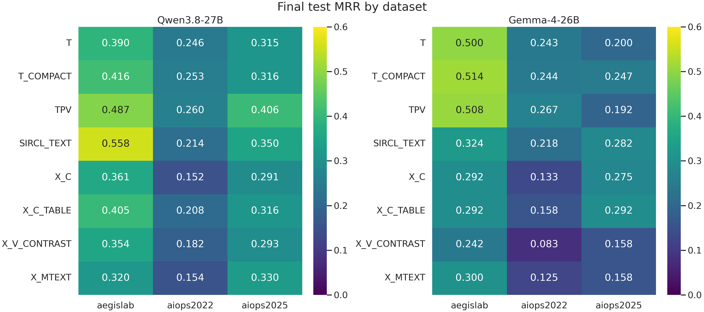
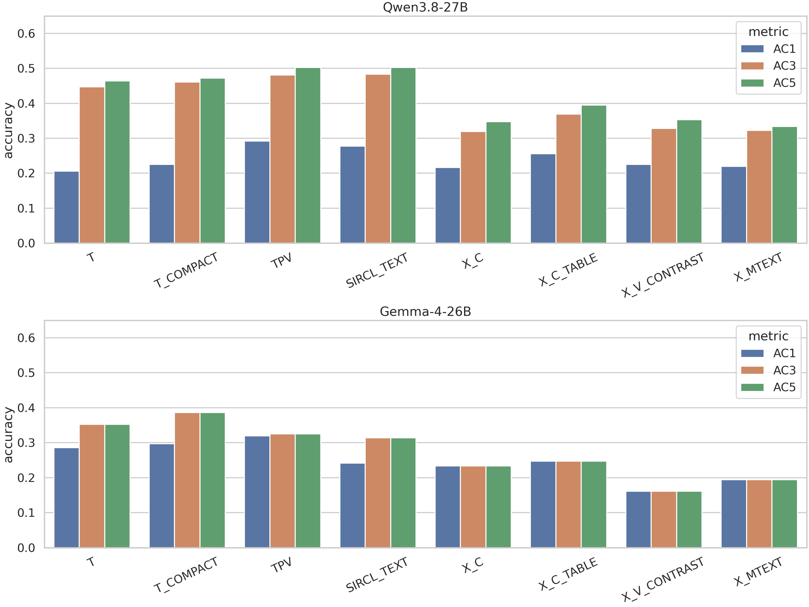
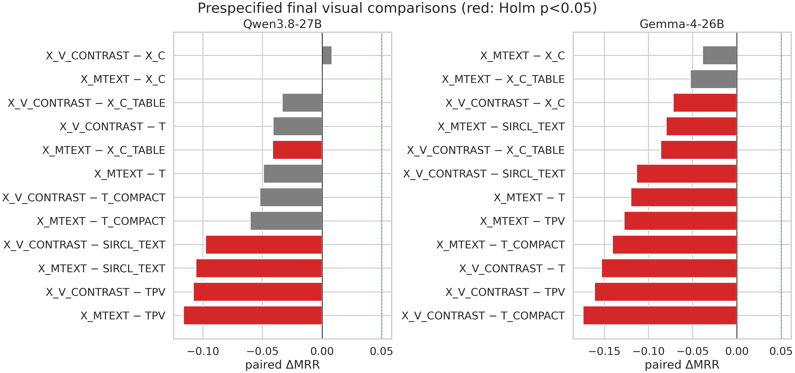
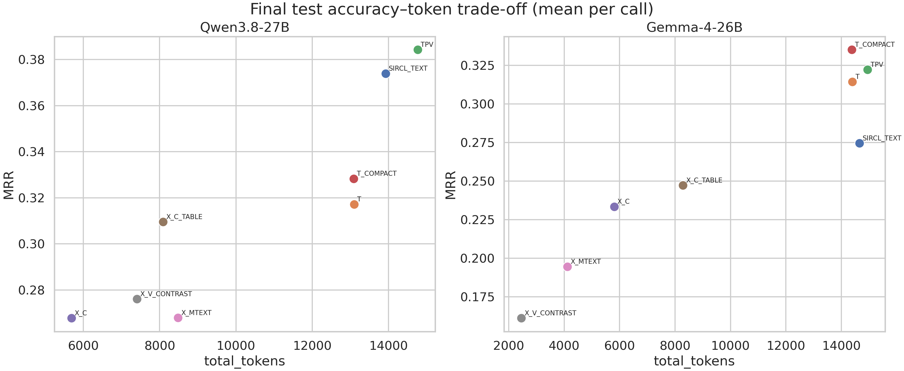
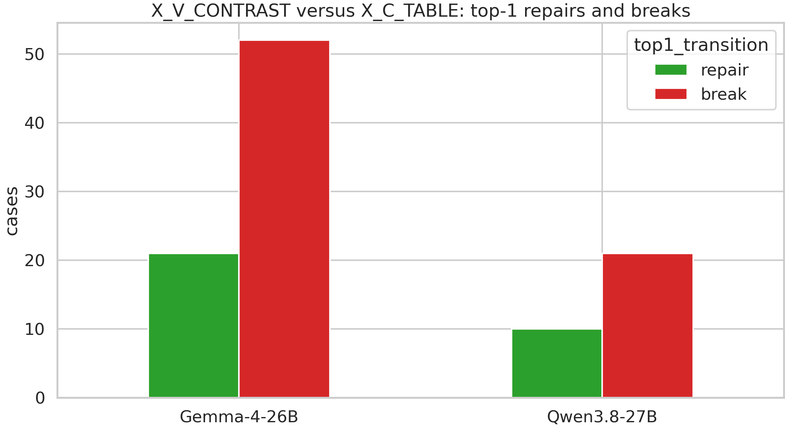
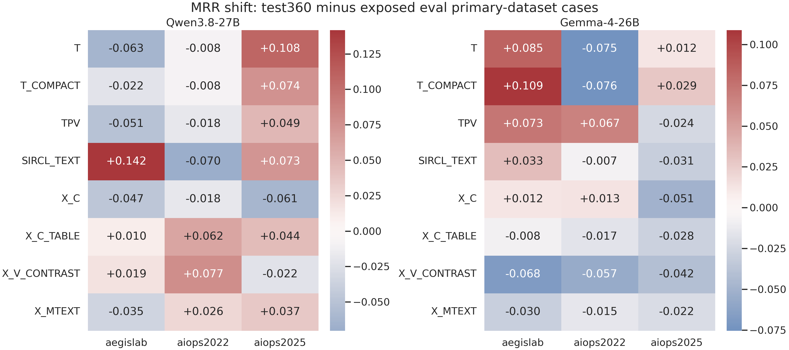

# RQ3.1 结果统计与机制分析

**日期：2026-09-19**  
**状态：完整结果分析；不包含 attention。**  
**主要数据：** 360 个 test cases（AegisLab、AIOPS-2022、AIOPS-2025 各 120），8 个方法、2 个模型，共 5,760 条模型调用记录。所有登记请求均已落盘；没有基础设施缺失或错误。

## 1. 一句话结论

RQ3.1 的新对比式证据编译器 `X` 显著压缩了输入，但没有提高 RCA 准确率。Qwen 上最强固定方法仍是旧的选择性视觉基线 `TPV`（MRR 0.3843），Gemma 上是 `T_COMPACT`（0.3352）；锁定的新视觉方法 `X_V_CONTRAST` 分别只有 0.2761 和 0.1611。其主要瓶颈首先是**证据选择**：X 在 76/360 cases（21.1%）中没有选入任何直接关联根因实体的事实，尤其严重损害 node-level 故障；其次才是表示问题：在相同 X 事实下，直接表格通常优于视觉图，且把表格简单截图会产生很大的退化。

这批结果支持一个更窄但可靠的结论：**视觉在 RCA 中可以有选择性价值，但只有在诊断证据先被保留下来、视觉组织又与模型能力相匹配时才有价值。压缩、画图和“对比”本身都不保证更好的诊断。**

## 2. 实验对象与解释边界

### 2.1 方法名称

| Arm | 含义 |
|---|---|
| `T` | 原自然语言全文基线 |
| `T_COMPACT` | 原事实的紧凑文本表示 |
| `TPV` | topology 使用视觉，其余模态为文本的既有强基线 |
| `SIRCL_TEXT` | SIRCL-style 工具和文本证据方案 |
| `X_C` | X 选择器得到的紧凑文本 |
| `X_C_TABLE` | 相同 X 事实的直接结构化表格文本 |
| `X_V_CONTRAST` | 相同 X 事实的对比式真实 dashboard |
| `X_MTEXT` | metrics 为文本，其余 X 事实位于同一张图中 |

X 是从 per-case public telemetry 直接建立证据池、形成可比较 evidence bundles，再在预算内选择事实的方案。它不是对 MET-Z/TRC-L/LOG-R 既有面板结果的二次筛选。

### 2.2 数据地位

- test 集不含 RE2；三个数据集各 120 cases，因此 pooled 结果不会被容易且饱和的 RE2 拉高。
- 其中 140 cases 曾作为旧 validation 使用，另有 220 个后来加入。因此本报告把 360 cases 称为 **test360**，但不把它夸大为整个项目历史上完全未见的测试集。
- 旧 validation 与新增 cases 的分层结果单独保存；它们只能用于检查结果是否明显依赖暴露历史，不能证明因果。
- 根因标签只用于离线评分和分层分析，没有进入选择器、prompt 或 dashboard。
- 所有模型错误输出均作为真实端到端结果保留；没有重采样到正确为止。

### 2.3 统计口径

- 统计单位是 case。
- 配对比较使用 Pratt-Wilcoxon signed-rank test 和 paired Cohen's dz。
- 预注册视觉 family 对 24 个比较统一做 Holm 校正。
- 项目定义的实质性准确率增益要求同时满足 `Delta MRR >= 0.05` 和 Holm-adjusted `p < 0.05`。
- 不报告 confidence interval。
- 机制子集、oracle、事后分层和未登记为主 family 的比较均明确标为探索性，不把它们包装成确认性结论。

完整可复算表见 [分析资产目录](RQ3_1_Results_Analysis_2026-09-19_assets)。

## 3. 最终准确率结果

### 3.1 Qwen3.8-27B

| Arm | MRR | AC@1 | AC@3 | AC@5 | 平均总 tokens | 模型失败 |
|---|---:|---:|---:|---:|---:|---:|
| `TPV` | **0.3843** | **0.2917** | 0.4806 | 0.5028 | 14,768.6 | 0 |
| `SIRCL_TEXT` | 0.3739 | 0.2778 | **0.4833** | **0.5028** | 13,928.2 | 25 |
| `T_COMPACT` | 0.3282 | 0.2250 | 0.4611 | 0.4722 | 13,089.9 | 0 |
| `T` | 0.3171 | 0.2056 | 0.4472 | 0.4639 | 13,102.0 | 0 |
| `X_C_TABLE` | 0.3095 | 0.2556 | 0.3694 | 0.3944 | 8,092.3 | 37 |
| `X_V_CONTRAST` | 0.2761 | 0.2250 | 0.3278 | 0.3528 | 7,408.2 | 3 |
| `X_MTEXT` | 0.2679 | 0.2194 | 0.3222 | 0.3333 | 8,483.5 | 2 |
| `X_C` | 0.2678 | 0.2167 | 0.3194 | 0.3472 | **5,692.3** | 32 |

Qwen 的关键现象是：`TPV` 和 `SIRCL_TEXT` 在排名质量上最好；X 的直接表格接近 `T`，但 X 的真实视觉并未超过直接表格。`X_V_CONTRAST` 相比 `T` 少 0.0411 MRR，相比 `TPV` 少 0.1082。

### 3.2 Gemma-4-26B-A4B-it

| Arm | MRR | AC@1 | AC@3 | AC@5 | 平均总 tokens | 模型失败 |
|---|---:|---:|---:|---:|---:|---:|
| `T_COMPACT` | **0.3352** | 0.2972 | **0.3861** | **0.3861** | 14,379.4 | 0 |
| `TPV` | 0.3222 | **0.3194** | 0.3250 | 0.3250 | 14,946.3 | 0 |
| `T` | 0.3144 | 0.2861 | 0.3528 | 0.3528 | 14,397.9 | 0 |
| `SIRCL_TEXT` | 0.2745 | 0.2417 | 0.3139 | 0.3139 | 14,655.4 | 2 |
| `X_C_TABLE` | 0.2472 | 0.2472 | 0.2472 | 0.2472 | 8,288.5 | 3 |
| `X_C` | 0.2333 | 0.2333 | 0.2333 | 0.2333 | 5,813.9 | 8 |
| `X_MTEXT` | 0.1944 | 0.1944 | 0.1944 | 0.1944 | 4,122.1 | 4 |
| `X_V_CONTRAST` | 0.1611 | 0.1611 | 0.1611 | 0.1611 | **2,460.0** | 5 |

Gemma 在 X 的视觉与混合 arm 中始终只返回一个候选，因此 MRR、AC@1、AC@3 和 AC@5 完全相等。这里不是 scorer 丢掉了第二至第五名，而是模型根本没有输出它们。它说明同一设计不能假设会在不同 VLM 上诱发相同的排名行为。

AVG@3/5 与上述结论一致，没有出现指标反转。Qwen 的 `TPV` 为 0.4028/0.4428，`SIRCL_TEXT` 为 0.3926/0.4350，`T` 为 0.3398/0.3894，`X_V_CONTRAST` 为 0.2815/0.3078；Gemma 的最高值仍为 `T_COMPACT` 的 0.3435/0.3606。完整 AVG 数值保存在逐 arm 汇总表中。

### 3.3 分数据集 MRR

| Model | Arm | AegisLab | AIOPS-2022 | AIOPS-2025 |
|---|---|---:|---:|---:|
| Qwen | `TPV` | 0.4875 | **0.2597** | **0.4056** |
| Qwen | `SIRCL_TEXT` | **0.5576** | 0.2144 | 0.3496 |
| Qwen | `T_COMPACT` | 0.4160 | 0.2528 | 0.3160 |
| Qwen | `T` | 0.3903 | 0.2458 | 0.3153 |
| Qwen | `X_C_TABLE` | 0.4051 | 0.2076 | 0.3158 |
| Qwen | `X_V_CONTRAST` | 0.3540 | 0.1815 | 0.2926 |
| Gemma | `T_COMPACT` | **0.5139** | 0.2444 | 0.2472 |
| Gemma | `TPV` | 0.5083 | **0.2667** | 0.1917 |
| Gemma | `T` | 0.5000 | 0.2431 | 0.2000 |
| Gemma | `X_C_TABLE` | 0.2917 | 0.1583 | **0.2917** |
| Gemma | `X_V_CONTRAST` | 0.2417 | 0.0833 | 0.1583 |

没有一个方法在两个模型和三个数据集上同时占优。AegisLab 明显容易于两个 AIOPS 集；AIOPS-2022 是 X 视觉最困难的域。项目停止条件要求 test MRR 不少于 0.65，且 AIOPS-2022/2025 均不低于 0.60；本轮任何固定方法都没有接近该标准。

## 4. 确认性配对统计：视觉没有取得登记的增益

预注册 family 比较 `X_V_CONTRAST`、`X_MTEXT` 与六个文本/既有视觉对照。在 24 个 Holm 校正比较中，**没有任何一个达到实质性正增益标准**。

代表性结果：

| Model | 比较（左减右） | Delta MRR | Holm p | dz | 解释 |
|---|---|---:|---:|---:|---|
| Qwen | `X_V_CONTRAST - T` | -0.0411 | 0.6116 | -0.078 | 无证据优于全文 |
| Qwen | `X_V_CONTRAST - T_COMPACT` | -0.0522 | 0.2288 | -0.101 | 方向为负 |
| Qwen | `X_V_CONTRAST - TPV` | -0.1082 | 0.00027 | -0.227 | 显著弱于 TPV |
| Qwen | `X_V_CONTRAST - SIRCL_TEXT` | -0.0978 | 0.00060 | -0.195 | 显著弱于 SIRCL |
| Qwen | `X_V_CONTRAST - X_C` | +0.0083 | 1.0000 | +0.025 | 同 X 事实下无视觉增益 |
| Qwen | `X_V_CONTRAST - X_C_TABLE` | -0.0335 | 0.0910 | -0.114 | 表格方向更好 |
| Gemma | `X_V_CONTRAST - T` | -0.1532 | <0.0001 | -0.365 | 显著退化 |
| Gemma | `X_V_CONTRAST - X_C` | -0.0722 | 0.0115 | -0.216 | 显著弱于同事实文本 |
| Gemma | `X_V_CONTRAST - X_C_TABLE` | -0.0861 | 0.00371 | -0.247 | 显著弱于同事实表格 |

这直接回答了“为什么不只做文本 contrast”这个致命问题：**按当前实现，没有证据证明 Canvas contrast 比同内容文本 contrast 更好。** 不能以输入更短代替准确率证据，也不能把 X 选择器和视觉组织的效果混在一起。

探索性地看，Qwen 的 `TPV-T` 为 +0.0671 MRR（未校正 p=0.0053，dz=0.155），`SIRCL_TEXT-T` 为 +0.0568（p=0.0290）。这与“选择性地把 topology 视觉化可能有价值”一致，但它们不属于上述 24 项确认性 family，不能借此宣称新的 X 方法成功。

## 5. 成本：大幅压缩输入，但 Qwen 输出和延迟没有同步下降

### 5.1 相对 T 的变化

| Model | Arm | 总 tokens 变化 | 输出 tokens 变化 | MRR 变化 | 观察 |
|---|---|---:|---:|---:|---|
| Qwen | `TPV` | +12.72% | -0.96% | +0.0671 | 准确率提高但输入更贵 |
| Qwen | `SIRCL_TEXT` | +6.31% | -33.38% | +0.0568 | decode 明显更短，但有 6.94% 无效答案 |
| Qwen | `T_COMPACT` | -0.09% | +3.71% | +0.0111 | 几乎不是压缩 |
| Qwen | `X_C_TABLE` | **-38.24%** | +11.69% | -0.0076 | 当前最好 accuracy-compression 折中，但格式失败偏高 |
| Qwen | `X_V_CONTRAST` | -43.46% | +4.70% | -0.0411 | 输入更省，输出反而略增 |
| Qwen | `X_C` | -56.55% | +23.51% | -0.0494 | 最短文本未带来更短回答 |
| Gemma | `X_C_TABLE` | -42.43% | +6.85% | -0.0671 | 压缩伴随准确率下降 |
| Gemma | `X_V_CONTRAST` | **-82.91%** | -8.39% | -0.1532 | 大幅压缩但诊断损失很大 |

Qwen 的 `X_C_TABLE` 值得保留为压缩基线：总 token 少约 38%，MRR 只比 T 低 0.0076。但它有 37/360（10.3%）无效输出，因此还不能直接称为可靠部署方案。`X_V_CONTRAST` 的总 token 更少，却没有降低 Qwen 的 output tokens 或 wall time；这再次说明 input 压缩不等同于 decode 成本降低。

Gemma 的视觉总 token 很低，部分原因是其图像 processor 的 token 预算以及只输出一个候选。跨模型不能直接把绝对 token 当成同一硬件成本单位。

## 6. 第一瓶颈：X 经常没有保留根因实体的直接证据

离线 evaluator-private 审计检查“选中的事实中是否存在直接绑定 ground-truth entity 的公开事实”。它不要求选择器知道标签，只在事后用标签核对覆盖。

X 在 284/360 cases（78.9%）中保留了至少一条根因实体相关事实，另有 76 cases（21.1%）没有。分数据集为：

| 数据集 | 有根因实体相关事实 | 有根因对比 bundle |
|---|---:|---:|
| AegisLab | 118/120（98.3%） | 96/120（80.0%） |
| AIOPS-2022 | 78/120（65.0%） | 48/120（40.0%） |
| AIOPS-2025 | 88/120（73.3%） | 73/120（60.8%） |

父版 P0 对根因实体相关事实的覆盖率分别是 94.2%、81.7% 和 85.8%。因此 X 并非单纯“用更聪明的方法重新组织相同有效信号”；它更经常在进入 Solver 之前就丢掉了根因实体的直接证据。

| Model/Arm | 无直接根因事实（n=76）MRR | 有直接根因事实（n=284）MRR |
|---|---:|---:|
| Qwen `X_C_TABLE` | 0.0044 | 0.3912 |
| Qwen `X_V_CONTRAST` | 0.0132 | 0.3464 |
| Qwen `X_C` | 0.0000 | 0.3394 |
| Gemma `X_C_TABLE` | 0.0000 | 0.3134 |
| Gemma `X_V_CONTRAST` | 0.0000 | 0.2042 |

这不是严格因果估计：是否有根因事实也与数据集和故障难度相关。但差距大到足以确认“选择覆盖”是必须先修复的工程瓶颈。Qwen `X_V_CONTRAST` 中根因事实数与 RR 的 Spearman rho=0.482（p=2.6e-22）；选中事实总数与 RR 无显著关系（rho=-0.038）。换句话说，**不是多塞事实就好，而是要保住对的事实。**

同时要注意定义边界：“无直接根因事实”不等于所有间接传播信号都不存在。少数 case 仍可能通过邻接受害者、拓扑关系或模型先验猜中；因此该指标是证据覆盖诊断，不是充分必要条件。

## 7. Granularity：新选择器几乎失去了 node-level RCA

test360 包含 service 228、node 51、pod 44、mixed 37 个 roots。

| Model | Arm | Service MRR | Pod MRR | Node MRR | Mixed MRR |
|---|---|---:|---:|---:|---:|
| Qwen | `T` | 0.3816 | 0.0758 | 0.3464 | 0.1667 |
| Qwen | `TPV` | **0.4671** | 0.1477 | 0.3105 | **0.2568** |
| Qwen | `X_C_TABLE` | 0.4292 | **0.1837** | 0.0196 | 0.1216 |
| Qwen | `X_V_CONTRAST` | 0.3800 | 0.1780 | **0.0039** | 0.1270 |
| Gemma | `T` | 0.3509 | 0.2652 | 0.3235 | 0.1351 |
| Gemma | `TPV` | **0.3596** | **0.2955** | 0.2941 | **0.1622** |
| Gemma | `X_C_TABLE` | 0.3289 | 0.2273 | 0.0000 | 0.1081 |
| Gemma | `X_V_CONTRAST` | 0.2149 | 0.1364 | **0.0000** | 0.0811 |

X 并非全面无用：Qwen 的 X table 在 pod 上略高于 TPV/T，在 service 上也仍有可用信号；真正灾难性的是 node。选择器偏向高异常的 service/pod trace bundles，而 node 指标如果没有被组织成能够与其 pods/服务直接竞争的 bundle，就会在视觉显著性和最终排序中被淹没。

### 7.1 Fault-type 的具体差异

Fault-type 分层进一步表明平均分掩盖了强烈异质性。以 Qwen `TPV` 且样本数至少 5 的类型为例，AIOPS-2025 的 network corrupt（MRR 0.9375）、pod kill（0.7500）和 AegisLab 的 JVMMemory（0.7500）较容易；AIOPS-2022 的 packet duplicate、node CPU、node disk write，以及 AIOPS-2025 的 JVM GC 在该 arm 上 MRR 为 0。由于不少 fault-type 的样本很少，这些数字用于定位模式，不用于宣称某一类故障的总体难度。完整计数和所有 arms 的分层值见 `fault_type_metrics.csv`。

## 8. 第二瓶颈：相同 X 事实下，当前视觉组织不如直接表格

在 Qwen 上，`X_V_CONTRAST` 相比 `X_C_TABLE` 只有 10 个 top-1 repairs，却产生 21 个 breaks；Gemma 为 21 repairs、52 breaks。按数据集：

| Model | 数据集 | Repairs | Breaks |
|---|---|---:|---:|
| Qwen | AegisLab | 4 | 6 |
| Qwen | AIOPS-2022 | 3 | 7 |
| Qwen | AIOPS-2025 | 3 | 8 |
| Gemma | AegisLab | 13 | 19 |
| Gemma | AIOPS-2022 | 2 | 11 |
| Gemma | AIOPS-2025 | 6 | 22 |

这说明“把竞争证据放在相邻位置”在一些 case 中确实有用，但当前视觉语法的破坏更多。主要失败形式是：模型被一个极端 trace/pod 数值吸引，忽略了跨层次的 node 指标或与真正根因绑定的其他证据；或者视觉条件促使模型只给一个过早收敛的候选。

### 8.1 像素化本身不是价值来源

100-case 机制子集上，把 `X_C_TABLE` 原样截图：

- Qwen：MRR 0.4958 降到 0.3653，Delta=-0.1305，p=0.000331，dz=-0.339；3 repairs、18 breaks。
- Gemma：0.4200 降到 0.1000，Delta=-0.3200，p=2.1e-7，dz=-0.604；3 repairs、35 breaks。

因此，节省文本 token 或把文字送入 vision encoder 并不会自动改善 RCA。Canvas 的论文价值只能来自真正有帮助的图形组织，而不能来自“文字变成像素”。

## 9. 机制实验：哪些设计因素有迹象，哪些没有

这些实验运行在开发/机制子集，属于机制支持而非 test 上的最终确认。

### 9.1 对比分组

取消候选对比分组（`NO_GROUPING`）后，Qwen `X_V` MRR 下降 0.0367，Gemma 下降 0.0700。方向上支持相邻对比布局，但在当前样本和多重比较下证据不足以称为稳定增益。

### 9.2 共同时间对齐

取消跨卡片共同时间轴后，Qwen 变化 +0.0125，Gemma -0.0300。方向不一致，因此不能声称共同时间对齐已被证明有用。

### 9.3 对比式选择

取消“区分竞争根因”优先、只保留相关性选择时，Qwen 视觉反而 +0.0155，Gemma 视觉 -0.0400；文本条件也不一致。当前 contrast score 没有稳定地优于更简单的相关性选择。

### 9.4 证据移除

移除 evaluator-private 的根因关联 bundle 通常使结果下降，但效应噪声较大；移除匹配数量的非目标 bundle 有时反而改善。后者支持“无关或重复证据会制造噪声”，但还不足以给出一个可靠的固定删减规则。

### 9.5 Budget curve

Qwen table 在 50% 预算时下降 0.108 MRR（p=0.029），75% 预算只下降 0.002；Qwen `X_C` 与视觉也大致显示 75% 比 50% 安全。Gemma 的预算响应不单调且总体更易退化。结论是：存在压缩余地，但“越少越好”不成立，阈值还依赖模型和表示。

### 9.6 冗余负载

Gemma visual 在增加 25% 和 50% 重复显示负载后分别下降约 0.061 和 0.102 MRR；Qwen 变化较小。视觉对重复事实造成的拥挤可能具有模型依赖性。

### 9.7 非语义稳健性

重匿名化使 Qwen/Gemma `X_V` 分别下降约 0.041/0.060；候选顺序重排使 Qwen `X_C` 上升 0.065（p=0.0009），而视觉变化接近零。后者提示纯文本 contrast 对候选顺序存在明显敏感性，视觉可能降低这种特定敏感性；但重匿名化结果也表明视觉并未消除所有非语义波动。

### 9.8 重复调用

Gemma 重复调用的汇总结果一致；Qwen 的 MRR 波动约在 -0.005 到 +0.005。主方法之间的差距远大于这一规模，因此最终负结果不能主要归咎于采样噪声。

## 10. 简单 CPU 基线揭示的问题

| CPU baseline | MRR | AC@1 | AC@3 | AC@5 |
|---|---:|---:|---:|---:|
| `ANOMALY_COUNT` | **0.3483** | **0.2139** | **0.4528** | **0.5917** |
| `BARO_COMPONENT`（NaN 修正版） | 0.2626 | 0.1333 | 0.3389 | 0.5306 |
| `X_INTERNAL` | 0.2178 | 0.1250 | 0.2861 | 0.3889 |
| `ANOMALY_MAGNITUDE` | 0.1693 | 0.0889 | 0.2083 | 0.3306 |

最简单的异常计数排序 MRR 0.3483，高于两个模型的 `X_V_CONTRAST`，AC@5 甚至达到 0.5917。这并不代表它已经是最佳 RCA 系统：它不生成解释，且 top-1 仍低。但它说明 X 的复杂选择和视觉推理尚未稳定超越“哪个实体积累了更多异常”这一朴素规则。

BARO 在 AIOPS-2022 的 AC@5 较高（0.6167）而 MRR 较低，说明它经常察觉到根因信号，却排不进第一位。这与本项目对“候选竞争与排序”问题的关注一致。

## 11. 模型输出失败不是基础设施错误

5,760 次请求全部完成，没有服务器、网络或持久化错误。共有 121 条模型级无效答案：120 条输出了候选列表之外或重复的 ID，1 条 JSON 未闭合。

- Qwen：`SIRCL_TEXT` 25、`X_C` 32、`X_C_TABLE` 37、`X_MTEXT` 2、`X_V_CONTRAST` 3；T/TPV/T_COMPACT 为 0。
- Gemma：共 21 条，分散在五个非父版 arms。

Qwen 的 X 文本有时把 operation path（如 `/api...`）或 `node-xxxx` 字符串复制进候选数组，而冻结 schema 要求 case-local 数字 ID。视觉和混合 arms 明显减少了这种错误，这是视觉的一个局部可靠性优势；不过准确率损失仍然更大。不能通过更宽松 scorer 把非候选字符串自动映射为答案，否则会改变冻结输出契约。

按 experiment x model 计，Qwen 总有效率 96.53%、Gemma 99.27%，均超过 95% 完整性门槛；但 Qwen 的 SIRCL、X_C 和 X table 单 arm 有效率低于 95%，相应 arm 的部署可靠性必须单列。

## 12. 定性案例分析

### 12.1 视觉 repair：相邻比较帮助纠正受害者

`INC-559F0B2CEFB9`（AIOPS-2022，容器读 I/O 负载）中，Qwen table 把 pod `85184` 的 CFS throttling 当作根因，实际是受影响症状；[视觉条件的完整 conversation](../../RQs/RQ3_1/results/formal_direct_per_case_v3_text_contrast/exp_final_test/conversations/b71a46c482d8e8da116a24a777dbe790b91069ed0bcc32c1db1429f9c02f5d8b.md)利用异常发生先后和 hosting relation，把第一名改为正确 service `474`。这是 Canvas contrast 预期机制的正例：并列呈现使“最显著异常”和“最早、最符合关系的源头”可以直接比较。

但这类 repair 只有 10 个，而相对 table 的 break 有 21 个，不能用代表性成功截图替代总体统计。

### 12.2 视觉 break：最醒目的 trace/pod 掩盖 node 根因

`INC-E74A7A5234DB`（AIOPS-2022，node 磁盘读 I/O）中，[table 条件](../../RQs/RQ3_1/results/formal_direct_per_case_v3_text_contrast/exp_final_test/conversations/65b790a3b05d83d3e7de748557aee0c7eda75b267dae6de4415338f80403a662.md)正确把 node `4829` 放在第一位，理由是 `system.io.r_s` 的极端变化并结合下游 latency。[视觉条件](../../RQs/RQ3_1/results/formal_direct_per_case_v3_text_contrast/exp_final_test/conversations/9d025b189abece213f7b62621cbeb53edcfbcf5cc3544a5c8a3c17d8b551f717.md)却选择 pod `924`，并在 reason 中明确把 node 指标说成“unpaired public context”。这不是缺少候选列表，而是图中的高显著 trace/pod signal 压过了跨层次 node 证据。

类似地，`INC-641C662F70D0` 中 [table](../../RQs/RQ3_1/results/formal_direct_per_case_v3_text_contrast/exp_final_test/conversations/f4593fb93005370e01d54ae5c993847f0e02f82fa3d498eb92c1ea197f1f7ee7.md)正确选择 service `590`，[视觉](../../RQs/RQ3_1/results/formal_direct_per_case_v3_text_contrast/exp_final_test/conversations/f0e5e3663493de319dd01583a82f2a7887ab0ad7a46172380bc58fb6b04bd6e7.md)被 pod `68939` 的巨大 non-child wall-time 吸引而选错。它展示了视觉 salience 的双刃剑：醒目对比可以帮助发现异常，也可能强化受害者而非根因。

### 12.3 无直接根因事实时的偶然命中

`INC-19E8CFE48BBE` 被审计为 X 未选择直接绑定根因实体的事实，但 [Qwen visual](../../RQs/RQ3_1/results/formal_direct_per_case_v3_text_contrast/exp_final_test/conversations/c53808c5402148a0b08d27840c3f7a578e1dfd912a54e68bc088878088de7489.md)仍命中第一名。公开 reason 依赖一个非常突出的 trace outlier。该案例说明“无直接事实”不等于绝无间接信号，也可能包含 shortcut 或幸运排序；不能把单例成功解释为选择覆盖不重要。

### 12.4 错误 reasoning 的常见模式

综合 repairs、breaks、node failures 和公开 reasons，失败主要分为：

1. **选择失败**：根因实体或其关键机制未进入有限预算，Solver 只能在受害者中排序。
2. **源头—受害者混淆**：把最大 latency、error 或异常分数直接当成 origin。
3. **层次混淆**：node fault 被收缩为某个 pod/service；反之也会发生。
4. **关系过度解释**：把 call/hosting edge 当成足够的因果传播证据。
5. **负向变化误读**：把 latency 下降或流量消失当成组件自身故障，而没有检查是否是上游停止请求。
6. **过早收敛**：特别是 Gemma，在 X 条件下只输出一个候选，失去 AC@3/5 的恢复空间。
7. **schema/实体绑定失败**：从证据中复制 operation 名而不是候选数字 ID。

## 13. 方法互补性与不可部署的 oracle headroom

若事后对每个 case 从 8 个 arms 中挑最好结果：

- Qwen oracle MRR 0.6846，AC@1 union 0.5889；仍有 19.7% cases 所有 arm 都失败。
- Gemma oracle MRR 0.6630，AC@1 union 0.6333；仍有 29.7% 全失败。
- 仅四个 X arms 的 Qwen oracle MRR 0.3981，Gemma 0.3472。

这说明不同表示确实覆盖不同案例，存在适应性选择的理论空间；但 oracle 使用了答案后的信息，不是可部署方法，也不能当作实际性能。更重要的是，X-only oracle 仍远低于全部方法 oracle：当前 X evidence universe/selection 已经丢失了一部分 P0、TPV 或 SIRCL 能用的信号。

## 14. Eval 到 test 的选择稳定性

开发/eval 阶段 `X_V_CONTRAST` 略高于 `X_MTEXT`，因此被锁定；test 上 Qwen 仍只高 0.0081（0.2761 vs 0.2679），而 Gemma 的排序反转（0.1611 vs 0.1944）。这说明冠军选择并未跨模型稳定迁移。

test360 中旧 validation 140 cases 与后来新增 220 cases 的结果并未呈现一种统一的“旧集更容易”模式。例如 Qwen X visual 在两组上分别为 0.2457 和 0.2954；因此不能用数据暴露史单独解释 X 的低表现。详细趋势见下图。

## 15. 对研究主张的影响

### 15.1 当前证据支持的主张

1. **证据选择是视觉 RCA 的先决瓶颈。** 根因关联事实未被选择时，任何表示几乎都无法恢复答案。
2. **视觉的价值是条件性的。** Qwen 的 TPV 强于全文，表明选择性视觉可能有效；但新的全 dashboard contrast 不如同事实 table。
3. **视觉能改变而非单向改善模型注意到的信号。** 它既修复源头—受害者比较，也会放大显著但错误的 victim signal。
4. **像素传输与图形组织必须分开。** table screenshot 大幅退化，真实图形的价值不能由截图控制替代。
5. **成本和准确率是独立目标。** X 大幅减少 input/total tokens，但没有可靠减少 Qwen output tokens，也没有提高准确率。
6. **跨模型行为不可直接迁移。** Gemma 在 X 视觉条件下单候选化，Qwen 则通常返回约 3 个候选。
7. **简单基线仍很强。** 任何后续复杂方法必须超过异常计数、TPV、SIRCL 和直接 X table，而不只是超过较弱的全视觉版本。

### 15.2 当前方法不能支撑的主张

- 不能声称 Canvas contrast 优于文本 contrast。
- 不能声称 X 是当前最佳 RCA 方法。
- 不能声称压缩 input 自动降低端到端成本或 latency。
- 不能用跨 arm oracle 作为单次诊断能力。
- 不能进入 RL 并期待训练自动修复一个尚未验证的动作空间。

## 16. 下一步建议

优先级应为：

1. **先修选择覆盖，不先调 renderer。** 从完整 public pool 建立 root-agnostic 的层次覆盖约束，确保 node、pod、service 都有可比较入口，并保留 P0 的强信号。
2. **将 X table 作为第一诊断对照。** 新 selector 先在 table/text 下超过 P0/SIRCL/异常计数，才能把剩余差异归因于视觉。
3. **把 source-victim competition 显式化。** 每个高异常 service/pod 都要有宿主、同类实例、caller/callee 和时间先后的反证位，而不是只显示最高异常。
4. **限制视觉显著性。** 极端 trace score 不应自动获得最大的视觉权重；node-level resource evidence需要在同一竞争单元中可见。
5. **修复模型可用性而不改 scorer。** prompt/renderer 可明确候选数字 ID 与 observation/operation ID 的不同，但不能放宽冻结答案语义。
6. **设置 promotion gate。** 后续视觉设计必须至少不弱于同事实 table，并在 AIOPS-2022/2025 分别报告；仅节省 token 不足以晋级。
7. **暂缓 Composer RL。** 当前选择空间把关键证据漏掉，reward learning 很可能只学会数据集捷径或在受损 evidence pool 中优化。应先得到一个无需训练、可稳定超过强基线的固定编译器。

## 17. 审计与复现

- 最终 summary SHA256：`ba4bcef15ca965d01fa2726204ea0683af17e9ed239eeecb3f93d2a4ba71162c`
- BARO 修正版 summary SHA256：`a853e5925a8df108ef6c403481931e5f42e77b6f87980df17f08712da1d0df69`
- 分析审计：[analysis_audit.json](RQ3_1_Results_Analysis_2026-09-19_assets/analysis_audit.json)
- 最终逐 arm 汇总：[final_arm_metrics.csv](RQ3_1_Results_Analysis_2026-09-19_assets/final_arm_metrics.csv)
- Holm 配对统计：[final_pairwise_holm.csv](RQ3_1_Results_Analysis_2026-09-19_assets/final_pairwise_holm.csv)
- 机制比较：[mechanism_comparisons.csv](RQ3_1_Results_Analysis_2026-09-19_assets/mechanism_comparisons.csv)
- 根因可见性：[root_evidence_visibility.csv](RQ3_1_Results_Analysis_2026-09-19_assets/root_evidence_visibility.csv)
- Granularity：[root_granularity_metrics.csv](RQ3_1_Results_Analysis_2026-09-19_assets/root_granularity_metrics.csv)
- Fault type：[fault_type_metrics.csv](RQ3_1_Results_Analysis_2026-09-19_assets/fault_type_metrics.csv)
- CPU baselines：[cpu_baselines.csv](RQ3_1_Results_Analysis_2026-09-19_assets/cpu_baselines.csv)
- 逐调用派生表：[final_call_records.csv](RQ3_1_Results_Analysis_2026-09-19_assets/final_call_records.csv)
- 可复算脚本：`RQs/RQ3_1/scripts/analyze_rq31_results.py`

本报告没有分析 attention，因为 RQ3.1 按磁盘预算决定未记录 attention。所有 qualitative claims 来自公开 conversation、模型输出、可见 evidence manifest 和受控输入干预，不假装恢复模型隐藏思维链。
