# RQ3.2 完成实验：定量、定性与诊断模式分析

日期：2026-09-22。范围：**仅本次 RQ3.2 `formal_signal_cover_v2`**。本报告没有混入 RQ1.1、RQ2.1、RQ3.1 或淘汰赛的旧成绩；T、TPV、SIRCL_TEXT 均取本次 RQ3.2 的记录。没有启动新模型调用、修改评分器、修改实验输入或重新分类历史产物。

## 0. 核心结论

**RQ3.2 没有找到稳定超过强基线的统一 SC 方法，但产生了明确的正向机制证据和可以定位的失败模式。**

1. **基础保留有价值。** Qwen 三主数据集上，SC_FULL 对 SC_NO_BACKBONE 的配对 ΔMRR 为 +0.0761，Holm p=0.0053；但对 P0_CAL 只有 +0.0175，p=1.0000。保住旧证据，比完全替换更可靠；这不等于 SC 已超过 P0。
2. **SC 修复了 X 的 node 证据入口，却没有解决整体诊断。** test 的 51 个 node 根因案例中，包含根因自身 Metrics 的数量从 X 的 2 提升到 SC 的 33，P0 为 28。与此同时，部分原有根因 Metrics 仍被替换掉。
3. **“平均 coverage 持平”掩盖了破坏。** 三主 eval 中，Gemma 在 P0 有根因 Metrics、SC 删除它的 26 个案例上，MRR 从 0.3846 降到 0.0385；新增根因 Metrics 的 21 个案例改善远不足以抵消这一损失。这是关联分层，不是随机化因果效应。
4. **全视觉是本次最明显的性能瓶颈。** test 上 SC_V_CONTRAST 对 SC_C_CONTRAST 的配对 ΔMRR：Qwen −0.0757、Gemma −0.1250，均通过对应 Holm family。这个结论针对本次实际 renderer、prompt 和模型，不是“视觉必然不行”。
5. **Metrics 文本化能修复一部分全视觉损失。** test 上 SC_M_TEXT 对 SC_V_CONTRAST：Qwen +0.0918、Gemma +0.0833；但 SC_M_TEXT 仍没有超过 TPV。
6. **局部最佳方法依赖数据集和模型。** Qwen test 的 AIOPS-2022 上 SC_C_CONTRAST 较强，AIOPS-2025 上 TPV 较强，AegisLab 上 SIRCL_TEXT 较强；不存在已验证的统一赢家。
7. **排名正确与解释正确必须分开。** 实际案例出现正确 top-1 配上自相矛盾的先后关系，也出现图中可见的指标被错误归给另一 pod。不能用 MRR 代替依据核验。
8. **根因关联观测移除比匹配非目标移除更有破坏性。** 在适用的五数据集机制子集上，Qwen M-Text 和 Gemma 两种承载均有显著的目标/非目标差异。这是本轮最有价值的机制结果之一。
9. **有些 arm 的实际含义与计划不同。** 文本 NO_GROUPING 是实测空干预；C-Flat/C-Contrast 实际均有比较引用；P0_MORE 不是原 P0 排序扩容；公共时间说明也未随对齐统计更新。这些问题必须限制机制归因，不能把对应数字解释成计划中本来想测的效应。
10. **输入节省不是免费收益。** Gemma 全视觉显著减少输入，却损失准确率；Qwen M-Text 比 TPV 的平均输入还更多。没有出现“更高 MRR 且整体更便宜”的统一部署新方案。

下面分别给出统计口径、所有条件、机制干预、模式与案例证据。

## 1. 数据、完成状态与统计口径

### 1.1 什么进入本报告

纳入依据是当前注册任务矩阵、`resume/<model>.jsonl` 的终态，以及原子完成标记，不是遍历 outputs 后把所有旧文件相加。逐个核对当前 call key 与模型专属 summary 的集合完全一致；同时检查引用的 conversation、prompt、trajectory、PNG 等文件存在。此次没有重新推理、重建请求或对全部大文件重算 hash。

机制实验旧噪声版本留下 130 条非当前逻辑条目，其中大部分请求在新版本下内容一致而合法复用；有 **1 个不属于当前任务的 output** 被排除。原始文件未改。

四项实验共 **27,280 个逻辑单元**，不是 27,280 个独立 cases，也不是历史所有尝试的模型调用总量：

- 26,995 个有输出且可按原评分器计分，其中 346 个为模型输出失败；失败不从成绩分母剔除。
- 129 个请求超时：125 个新 `request_timeout` 标签，另 4 个旧 `failed` 标签的错误内容也是 `timed out`。
- 156 个不适用干预：两模型各 78，无合格根因观测或匹配删除对象，不是模型失败。
- 没有未解释的缺失任务。队列完成与“所有请求都成功”不是同一件事。

| phase | model | registered | scored | model_failure | request_timeout | failed | not_applicable |
| --- | --- | --- | --- | --- | --- | --- | --- |
| selection | qwen3.8-27b | 4800 | 4757 | 122 | 39 | 4 | 0 |
| selection | gemma-4-26b-a4b | 4800 | 4800 | 17 | 0 | 0 | 0 |
| representation | qwen3.8-27b | 5280 | 5221 | 84 | 59 | 0 | 0 |
| representation | gemma-4-26b-a4b | 5280 | 5280 | 15 | 0 | 0 | 0 |
| mechanisms | qwen3.8-27b | 1400 | 1314 | 27 | 8 | 0 | 78 |
| mechanisms | gemma-4-26b-a4b | 1400 | 1322 | 0 | 0 | 0 | 78 |
| test | qwen3.8-27b | 2160 | 2141 | 79 | 19 | 0 | 0 |
| test | gemma-4-26b-a4b | 2160 | 2160 | 2 | 0 | 0 | 0 |

### 1.2 三种分母，分别回答不同问题

**主表（whole-case）**：在每个实验×模型内，任一 arm 请求超时的 case 从该实验的所有 arm 一并排除。模型输出失败保留原评分。这使表内横向比较使用同一批 cases。Qwen 的选择/表示/test 主表分别为 439/426/341 cases；Gemma 为 480/480/360。三主数据集对应 Qwen 273/268/341，Gemma 300/300/360。由于超时散布到多个 arm，case 排除比例会大于请求超时比例；没有引入新的 5% 接受门槛。

**配对检验**：每一项比较只取该两条件均有评分的交集，最大化使用观测，因此 n 可能大于主表。不能用主表两个均值相减去核对不同 n 的配对 Δ。

**敏感性分析**：另提供各 arm 可用结果均值，以及固定注册分母、超时按端到端零效用处理的结果。后者不是把基础设施问题认作模型答错，只是展示系统完成性对部署效用的影响。

机制实验按每项干预实际适用的配对集合分析，不要求全部 14 条件同时适用。

### 1.3 统计方法与暴露边界

- case 是统计单位。MRR、AC@1/3/5、AVG@3/5直接使用已落盘 scorer，不重新放宽标准。
- 双侧 Pratt-Wilcoxon、paired Cohen’s dz；同 family 跨两个模型做 Holm。不报告置信区间。
- test 主 family 为三个 SC 承载对 T/TPV/SIRCL_TEXT，共 18 项；承载间比较为另一 family。选择、规则消融、表示、机制、交互分别列出 secondary families。数据集分层是明确标记的探索性分析；没有看到 p 值后删掉不利比较。
- 具体 family 清单在本次分析脚本落实，可逐项追溯；这不是声称新分析选择已经事前登记。`p_holm` 为相应 family、相应 scope 的校正结果。
- 五数据集 macro、三主数据集 macro、pooled、AIOPS 合并均在附件中分别保存，不混用。主表中的 `primary` 是共同样本的 pooled；`primary_macro` 才是三数据集等权。
- eval480 是开发暴露集；test360 早已用于 RQ3.1，本次只能称锁定回归评估。配置中 `unused_manifest=null`，额外全新 90-case 独立事件验证没有运行。
- 重叠事件组另做 group-average 敏感性分析；它改变加权对象而非创造独立样本。fault/根因标签仅在本次离线分析使用。

## 2. 实验一：证据选择到底改善了什么？

所有条件走同一新文本接口。下表为各模型、同实验全-arm共同样本；主数据集是 AIOPS-2022、AIOPS-2025、AegisLab。

| model | arm | all | primary | aiops | aiops2022 | aiops2025 | aegislab |
| --- | --- | --- | --- | --- | --- | --- | --- |
| gemma-4-26b-a4b | P0_CAL | 0.4792 | 0.2767 | 0.2150 | 0.2200 | 0.2100 | 0.4000 |
| gemma-4-26b-a4b | P0_MORE | 0.3833 | 0.1867 | 0.1300 | 0.1700 | 0.0900 | 0.3000 |
| gemma-4-26b-a4b | SC_COVER | 0.4771 | 0.2900 | 0.2350 | 0.2500 | 0.2200 | 0.4000 |
| gemma-4-26b-a4b | SC_FULL | 0.4469 | 0.2450 | 0.1625 | 0.2200 | 0.1050 | 0.4100 |
| gemma-4-26b-a4b | SC_MORE | 0.4723 | 0.2817 | 0.2000 | 0.2300 | 0.1700 | 0.4450 |
| gemma-4-26b-a4b | SC_NO_BACKBONE | 0.3979 | 0.2067 | 0.1500 | 0.1800 | 0.1200 | 0.3200 |
| gemma-4-26b-a4b | SC_NO_STRATA | 0.4583 | 0.2867 | 0.2100 | 0.2500 | 0.1700 | 0.4400 |
| gemma-4-26b-a4b | SC_STRICT_PAIR | 0.4771 | 0.2900 | 0.2500 | 0.2300 | 0.2700 | 0.3700 |
| gemma-4-26b-a4b | X_ALIGNED | 0.3906 | 0.2200 | 0.1900 | 0.1600 | 0.2200 | 0.2800 |
| gemma-4-26b-a4b | X_NATIVE_CAL | 0.4181 | 0.2357 | 0.2060 | 0.1400 | 0.2720 | 0.2950 |
| qwen3.8-27b | P0_CAL | 0.4839 | 0.2972 | 0.2489 | 0.2480 | 0.2498 | 0.3892 |
| qwen3.8-27b | P0_MORE | 0.4627 | 0.2736 | 0.2278 | 0.2224 | 0.2333 | 0.3606 |
| qwen3.8-27b | SC_COVER | 0.4727 | 0.2810 | 0.2412 | 0.2365 | 0.2461 | 0.3566 |
| qwen3.8-27b | SC_FULL | 0.5048 | 0.3251 | 0.2829 | 0.2537 | 0.3124 | 0.4055 |
| qwen3.8-27b | SC_MORE | 0.5047 | 0.3149 | 0.2785 | 0.2452 | 0.3122 | 0.3842 |
| qwen3.8-27b | SC_NO_BACKBONE | 0.4422 | 0.2458 | 0.1936 | 0.1717 | 0.2157 | 0.3452 |
| qwen3.8-27b | SC_NO_STRATA | 0.4969 | 0.2996 | 0.2480 | 0.2309 | 0.2654 | 0.3979 |
| qwen3.8-27b | SC_STRICT_PAIR | 0.4965 | 0.3105 | 0.2797 | 0.2470 | 0.3127 | 0.3691 |
| qwen3.8-27b | X_ALIGNED | 0.4388 | 0.2429 | 0.1829 | 0.1130 | 0.2536 | 0.3573 |
| qwen3.8-27b | X_NATIVE_CAL | 0.4716 | 0.2817 | 0.2258 | 0.1417 | 0.3109 | 0.3883 |

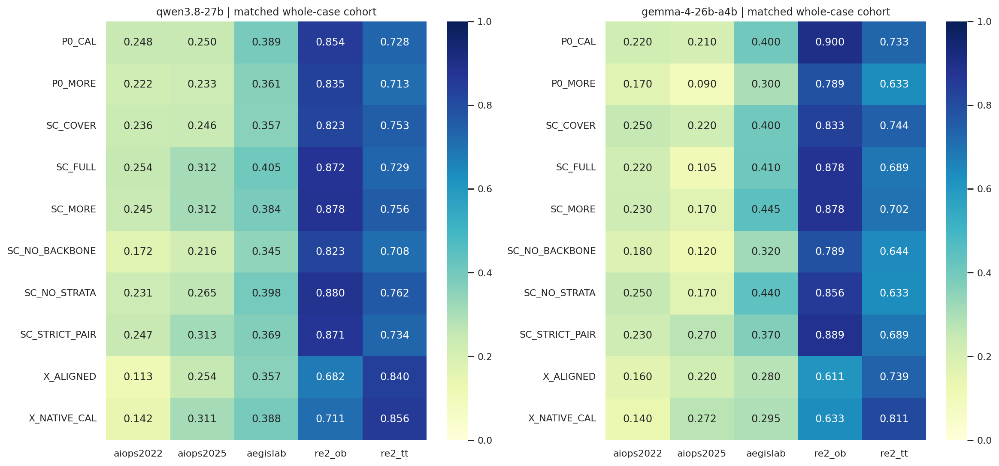

图 1：选择实验五数据集 MRR。RE2 的高分不能替代 AIOPS 与 AegisLab 的结果。

### 2.1 配对规则检验

正 Δ 表示表中 a 优于 b。

| model | a | b | n | delta | p_holm | dz | repairs | breaks |
| --- | --- | --- | --- | --- | --- | --- | --- | --- |
| qwen3.8-27b | SC_FULL | P0_CAL | 294 | 0.0175 | 1.0000 | 0.0598 | 17 | 10 |
| qwen3.8-27b | X_ALIGNED | X_NATIVE_CAL | 295 | -0.0469 | 0.3691 | -0.1468 | 14 | 22 |
| qwen3.8-27b | SC_FULL | X_ALIGNED | 293 | 0.0869 | 0.0146 | 0.1638 | 52 | 41 |
| qwen3.8-27b | SC_FULL | SC_NO_BACKBONE | 292 | 0.0761 | 0.0053 | 0.2460 | 30 | 5 |
| qwen3.8-27b | SC_FULL | SC_NO_STRATA | 292 | 0.0199 | 1.0000 | 0.0712 | 19 | 7 |
| qwen3.8-27b | SC_FULL | SC_COVER | 294 | 0.0368 | 0.3691 | 0.1399 | 17 | 6 |
| qwen3.8-27b | SC_FULL | SC_STRICT_PAIR | 291 | 0.0160 | 1.0000 | 0.0655 | 16 | 8 |
| qwen3.8-27b | SC_MORE | SC_FULL | 292 | 0.0013 | 1.0000 | 0.0050 | 7 | 14 |
| gemma-4-26b-a4b | SC_FULL | P0_CAL | 300 | -0.0317 | 1.0000 | -0.0753 | 22 | 32 |
| gemma-4-26b-a4b | X_ALIGNED | X_NATIVE_CAL | 300 | -0.0157 | 1.0000 | -0.0466 | 15 | 19 |
| gemma-4-26b-a4b | SC_FULL | X_ALIGNED | 300 | 0.0250 | 1.0000 | 0.0393 | 64 | 57 |
| gemma-4-26b-a4b | SC_FULL | SC_NO_BACKBONE | 300 | 0.0383 | 1.0000 | 0.0805 | 40 | 29 |
| gemma-4-26b-a4b | SC_FULL | SC_NO_STRATA | 300 | -0.0417 | 0.1921 | -0.1368 | 8 | 21 |
| gemma-4-26b-a4b | SC_FULL | SC_COVER | 300 | -0.0450 | 0.3691 | -0.1236 | 13 | 27 |
| gemma-4-26b-a4b | SC_FULL | SC_STRICT_PAIR | 300 | -0.0450 | 0.2969 | -0.1342 | 10 | 24 |
| gemma-4-26b-a4b | SC_MORE | SC_FULL | 300 | 0.0367 | 0.6930 | 0.1055 | 24 | 13 |

### 2.2 发现

**F01｜SC 的主要收益是避免 X 式的大幅证据替换，不是已经形成更好的统一选择器。** Qwen SC_FULL 对 X_ALIGNED 改善 0.0869，对去 backbone 改善 0.0761；对 P0 的改善很小且不显著。Gemma 上 SC_FULL 反而低于 P0，方向不迁移。

**F02｜单独对齐分析时间并没有使 X 恢复。** X_ALIGNED 相比 X_NATIVE_CAL 在两个模型三主数据集均为负方向。它说明“把时间分界改一致”不足以解决选择问题，不能据此断言旧时间分界更科学；两个实现仍有其他统计表达差异。

**F03｜本轮没有证实扩大 SC 容量会带来稳健收益。** Qwen SC_MORE−SC_FULL 的配对 Δ仅 +0.0013；Gemma +0.0367，但校正后均不显著。锁定文件以当时三主数据集等权可用均值 0.331825 对 0.328708 选择 SC_FULL；该选择未读 test。它是按注册预算规则选择，不是证明全局最优。

**F04｜不同模型对补充规则的偏好不同。** Qwen 更偏向 SC_FULL；Gemma 描述性上 SC_COVER、SC_STRICT_PAIR、SC_NO_STRATA 都高于 SC_FULL。不能将这一现象简化为“对比机制有效/无效”；实际的对比补充和 strict-pair 实现见第 10 节。

**F05｜多数选择器确实改变了内容，但不同不自动意味着有诊断价值。** 840 个 eval+test contexts 中，SC_FULL 与 SC_COVER 完全同语义 inventory 仅 6 个，和 NO_STRATA 仅 10 个；与 STRICT_PAIR 有 189 个相同。自然重合应保留，不能为制造效果删掉这些 cases。

## 3. 证据组成：修复了哪些盲区，又丢掉了什么？

以下统计的是**已选事实中与 evaluator 根因 ID 的关联**，不是“与故障机制相关”的人工标注，更不是已经逐像素验证的视觉可读率。`exact` 使用根因别名映射中的直接 ID；另保存 granularity-aware accepted-ID coverage，后者也允许 service 根因的合法 pod 命中，二者不能混用。G 中出现根因单独记录，不代替 M/R/L。

| partition | arm | n | root_M | root_R | root_L | root_MRL | accepted_M | graph_only |
| --- | --- | --- | --- | --- | --- | --- | --- | --- |
| eval | P0_CAL | 480 | 307 | 258 | 31 | 369 | 340 | 65 |
| eval | SC_FULL | 480 | 306 | 259 | 37 | 371 | 343 | 71 |
| eval | SC_MORE | 480 | 329 | 267 | 51 | 391 | 369 | 58 |
| eval | X_ALIGNED | 480 | 101 | 319 | 19 | 343 | 136 | 31 |
| eval | X_NATIVE_CAL | 480 | 108 | 340 | 23 | 360 | 139 | 23 |
| test | P0_CAL | 360 | 162 | 133 | 11 | 227 | 207 | 85 |
| test | SC_FULL | 360 | 159 | 150 | 9 | 243 | 206 | 74 |
| test | SC_MORE | 360 | 172 | 161 | 14 | 257 | 223 | 66 |
| test | X_ALIGNED | 360 | 18 | 195 | 14 | 210 | 57 | 19 |
| test | X_NATIVE_CAL | 360 | 24 | 201 | 15 | 217 | 67 | 25 |


图 2：直接根因关联覆盖率。根因是 service 时，accepted-ID 指标可包含其合法 pod，因此与 exact 指标数值不同。

**F06｜node 单侧证据保留是 SC 的真实改善。** eval 的 51 个 node 案例：P0/X_NATIVE/SC 分别含 20/1/27 个根因 Metrics；test 的 51 个分别为 28/2/33。SC 不再像 X 一样几乎完全绕开 node 自身遥测。这是必要条件层面的进展，不等于已经解决 node RCA。

**F07｜SC 增加了直接遥测覆盖，却没有对应增加整体 MRR。** test 中 exact-root M/R/L 至少一项覆盖从 P0 的 227/360 到 SC 的 243/360；但根因 Metrics 为 162→159，Trace 为 133→150，Logs 为 11→9。覆盖改善主要是来源重新分配，不是各类关键证据均改善。

**F08｜“保留一半”仍可能删除决定性证据。** 三主 eval 中：P0 有而 SC 无根因 Metrics 26 cases；P0 无而 SC 新增 21 cases。以下是同两方法共同有评分的实际分层：

| model | p0_root_M | target_root_M | n | p0_mrr | target_mrr | delta |
| --- | --- | --- | --- | --- | --- | --- |
| qwen3.8-27b | False | False | 135 | 0.1628 | 0.1865 | 0.0237 |
| qwen3.8-27b | False | True | 21 | 0.2635 | 0.3008 | 0.0373 |
| qwen3.8-27b | True | False | 24 | 0.3556 | 0.2361 | -0.1194 |
| qwen3.8-27b | True | True | 114 | 0.4898 | 0.5251 | 0.0354 |
| gemma-4-26b-a4b | False | False | 138 | 0.0652 | 0.0507 | -0.0145 |
| gemma-4-26b-a4b | False | True | 21 | 0.0952 | 0.1429 | 0.0476 |
| gemma-4-26b-a4b | True | False | 26 | 0.3846 | 0.0385 | -0.3462 |
| gemma-4-26b-a4b | True | True | 115 | 0.5391 | 0.5435 | 0.0043 |

这些分层表明要关注 **删除造成的 break**，不能只数新增 coverage。它们尚不能证明删去某一 metric 就导致失败，因为同一 case 的其他证据也可能改变。

**F09｜多样性规则没有自动形成强对比包。** SC 的 bundle 平均数量在 eval 为 2.28、test 为 2.07，而 X 为 17.46/18.45。数量减少本身未必坏，但当前 SC 的对比仅是同语义对象配对，无法直接等同于完整宿主—实例或本地执行—外部等待机制。六类 signal tags 来自词汇和统计规则，仅是工程代理标签，不是验证过的故障机制分类。

## 4. 实验二：表示及选择×表示交互

| model | arm | primary | aiops | aiops2022 | aiops2025 | aegislab |
| --- | --- | --- | --- | --- | --- | --- |
| gemma-4-26b-a4b | P0_C_CONTRAST | 0.2550 | 0.2025 | 0.2250 | 0.1800 | 0.3600 |
| gemma-4-26b-a4b | P0_M_TEXT | 0.3167 | 0.2500 | 0.2900 | 0.2100 | 0.4500 |
| gemma-4-26b-a4b | P0_V_CONTRAST | 0.1700 | 0.1000 | 0.0800 | 0.1200 | 0.3100 |
| gemma-4-26b-a4b | P0_V_STANDARD | 0.2133 | 0.1550 | 0.1700 | 0.1400 | 0.3300 |
| gemma-4-26b-a4b | SC_C_CONTRAST | 0.2700 | 0.1950 | 0.2400 | 0.1500 | 0.4200 |
| gemma-4-26b-a4b | SC_M_TEXT | 0.2467 | 0.1750 | 0.2400 | 0.1100 | 0.3900 |
| gemma-4-26b-a4b | SC_V_CONTRAST | 0.1567 | 0.1150 | 0.1400 | 0.0900 | 0.2400 |
| gemma-4-26b-a4b | SC_V_STANDARD | 0.1833 | 0.1500 | 0.1800 | 0.1200 | 0.2500 |
| gemma-4-26b-a4b | SIRCL_TEXT | 0.2778 | 0.2708 | 0.2317 | 0.3100 | 0.2917 |
| gemma-4-26b-a4b | T | 0.3100 | 0.2575 | 0.2983 | 0.2167 | 0.4150 |
| gemma-4-26b-a4b | TPV | 0.2811 | 0.2142 | 0.2300 | 0.1983 | 0.4150 |
| qwen3.8-27b | P0_C_CONTRAST | 0.2973 | 0.2797 | 0.2509 | 0.3082 | 0.3339 |
| qwen3.8-27b | P0_M_TEXT | 0.3188 | 0.2718 | 0.2485 | 0.2949 | 0.4167 |
| qwen3.8-27b | P0_V_CONTRAST | 0.2951 | 0.2360 | 0.1841 | 0.2874 | 0.4180 |
| qwen3.8-27b | P0_V_STANDARD | 0.2624 | 0.2046 | 0.1744 | 0.2344 | 0.3826 |
| qwen3.8-27b | SC_C_CONTRAST | 0.3000 | 0.2694 | 0.2504 | 0.2883 | 0.3636 |
| qwen3.8-27b | SC_M_TEXT | 0.3297 | 0.2699 | 0.2424 | 0.2971 | 0.4540 |
| qwen3.8-27b | SC_V_CONTRAST | 0.2371 | 0.1817 | 0.1415 | 0.2214 | 0.3525 |
| qwen3.8-27b | SC_V_STANDARD | 0.2345 | 0.1657 | 0.1357 | 0.1952 | 0.3778 |
| qwen3.8-27b | SIRCL_TEXT | 0.3417 | 0.3056 | 0.3239 | 0.2875 | 0.4167 |
| qwen3.8-27b | T | 0.3052 | 0.2456 | 0.2676 | 0.2238 | 0.4291 |
| qwen3.8-27b | TPV | 0.3963 | 0.3285 | 0.2976 | 0.3590 | 0.5374 |

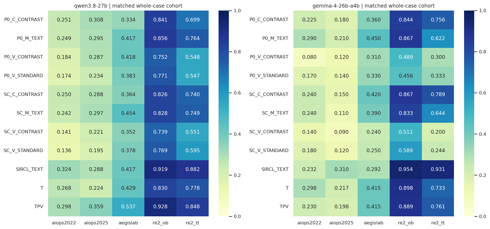

图 3：同一阶段、同一模型、全-arm共同 cases 的表示实验结果。

**F10｜同一 SC 内容下，全视觉的损失在两个模型上重现。** 三主 eval 的 V-Contrast 相对 C-Contrast：Qwen −0.0776（p=0.0036），Gemma −0.1133（p≈0.0001）；M-Text 相对全视觉改善 +0.0986/+0.0900。test 中相同方向再次出现，见下一节。

**F11｜“对比布局”本身没有显示稳定收益。** SC V-Contrast 对 V-Standard 的三主配对差值仅 −0.0016（Qwen）和 −0.0267（Gemma），均不显著。现有结果更支持“Metrics 的承载方式是瓶颈”，而不是“换成 Contrast 排版就能解决诊断”。

**F12｜选择与表示不是可相加的独立模块。** 使用四个条件同-case交集计算：

`interaction = (SC_visual − SC_text) − (P0_visual − P0_text)`。

Qwen 三主数据集，全视觉相对文本的交互为 −0.0724（n=281，Holm p=0.0120）；Gemma 的 M-Text 相对文本交互为 −0.0850（n=300，p=0.0128）。SC 的内容变化没有在各承载方式上带来相同收益，反而可能加重某种承载的缺点。

**F13｜文本对照需要按真实实现理解。** 选择阶段的 C-Flat 实际调用 natural-text catalogue，它已含比较引用；C-Contrast 是 compact catalogue＋O/C引用，不是把两个对象的数值直接局部并列的强对比表。因此二者差值混合了措辞/紧凑程度等变化，不能命名为“从无对比到有对比”的纯效应。

## 5. 实验四：锁定 test360 的最终表现

先呈现最终效果，再回到机制实验解释原因。test 没有 RE2，每个主数据集注册 120 cases。Qwen 六-arm共同有评分的 341 cases 为 112 AIOPS-2022、113 AIOPS-2025、116 AegisLab；Gemma 保留全部 360。两个模型的均值不视为同一独立样本。

| model | arm | n | mrr | ac@1 | ac@3 | ac@5 | avg@3 | avg@5 |
| --- | --- | --- | --- | --- | --- | --- | --- | --- |
| gemma-4-26b-a4b | SC_C_CONTRAST | 360 | 0.2861 | 0.2861 | 0.2861 | 0.2861 | 0.2861 | 0.2861 |
| gemma-4-26b-a4b | SC_M_TEXT | 360 | 0.2444 | 0.2444 | 0.2444 | 0.2444 | 0.2444 | 0.2444 |
| gemma-4-26b-a4b | SC_V_CONTRAST | 360 | 0.1611 | 0.1611 | 0.1611 | 0.1611 | 0.1611 | 0.1611 |
| gemma-4-26b-a4b | SIRCL_TEXT | 360 | 0.2648 | 0.2361 | 0.3028 | 0.3028 | 0.2713 | 0.2839 |
| gemma-4-26b-a4b | T | 360 | 0.3171 | 0.2889 | 0.3528 | 0.3528 | 0.3241 | 0.3356 |
| gemma-4-26b-a4b | TPV | 360 | 0.3292 | 0.3222 | 0.3361 | 0.3361 | 0.3315 | 0.3333 |
| qwen3.8-27b | SC_C_CONTRAST | 341 | 0.3241 | 0.2405 | 0.3959 | 0.4751 | 0.3187 | 0.3765 |
| qwen3.8-27b | SC_M_TEXT | 341 | 0.3288 | 0.2463 | 0.4106 | 0.4633 | 0.3314 | 0.3818 |
| qwen3.8-27b | SC_V_CONTRAST | 341 | 0.2396 | 0.1554 | 0.3255 | 0.3754 | 0.2434 | 0.2938 |
| qwen3.8-27b | SIRCL_TEXT | 341 | 0.3815 | 0.2815 | 0.4956 | 0.5161 | 0.4008 | 0.4452 |
| qwen3.8-27b | T | 341 | 0.3240 | 0.2111 | 0.4575 | 0.4751 | 0.3460 | 0.3977 |
| qwen3.8-27b | TPV | 341 | 0.3763 | 0.2845 | 0.4721 | 0.4956 | 0.3939 | 0.4346 |

### 5.1 每个数据集与 AIOPS 合并

| model | arm | aiops2022 | aiops2025 | aiops | aegislab | all |
| --- | --- | --- | --- | --- | --- | --- |
| gemma-4-26b-a4b | SC_C_CONTRAST | 0.1917 | 0.1750 | 0.1833 | 0.4917 | 0.2861 |
| gemma-4-26b-a4b | SC_M_TEXT | 0.1750 | 0.1500 | 0.1625 | 0.4083 | 0.2444 |
| gemma-4-26b-a4b | SC_V_CONTRAST | 0.1083 | 0.1000 | 0.1042 | 0.2750 | 0.1611 |
| gemma-4-26b-a4b | SIRCL_TEXT | 0.2014 | 0.2722 | 0.2368 | 0.3208 | 0.2648 |
| gemma-4-26b-a4b | T | 0.2528 | 0.2097 | 0.2313 | 0.4889 | 0.3171 |
| gemma-4-26b-a4b | TPV | 0.2542 | 0.2042 | 0.2292 | 0.5292 | 0.3292 |
| qwen3.8-27b | SC_C_CONTRAST | 0.2942 | 0.3015 | 0.2979 | 0.3750 | 0.3241 |
| qwen3.8-27b | SC_M_TEXT | 0.2853 | 0.2627 | 0.2739 | 0.4353 | 0.3288 |
| qwen3.8-27b | SC_V_CONTRAST | 0.1799 | 0.2307 | 0.2054 | 0.3060 | 0.2396 |
| qwen3.8-27b | SIRCL_TEXT | 0.2060 | 0.3580 | 0.2823 | 0.5740 | 0.3815 |
| qwen3.8-27b | T | 0.2493 | 0.2994 | 0.2744 | 0.4203 | 0.3240 |
| qwen3.8-27b | TPV | 0.2693 | 0.3791 | 0.3244 | 0.4770 | 0.3763 |

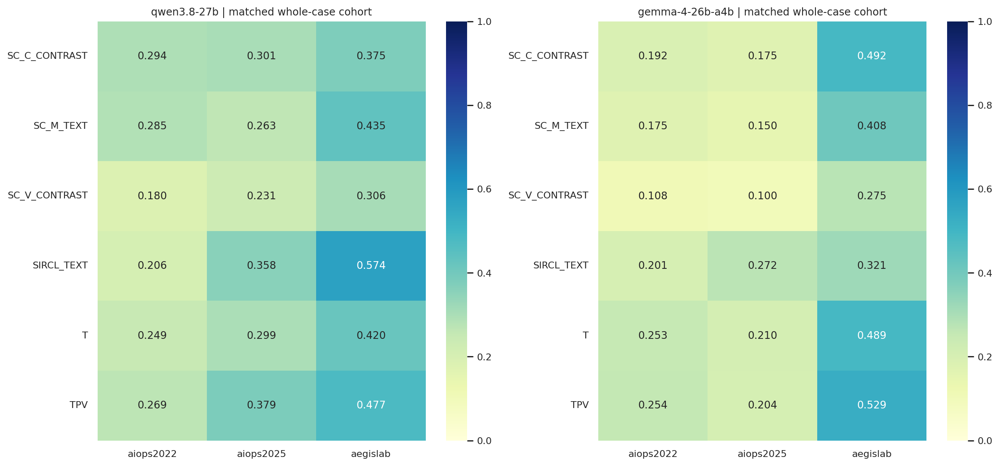

图 4：锁定 test 上各方法的 MRR；数据集差异明显大于部分方法的平均差异。

**F14｜强基线仍然领先，但哪个基线最强取决于数据域。** Qwen 共同样本上 SIRCL_TEXT=0.3815、TPV=0.3763，高于最佳 SC 的 0.3288；Gemma TPV=0.3292，高于 SC 文本的 0.2861。SIRCL_TEXT 对 Qwen 的 AegisLab 很强，但 AIOPS-2022 较弱；SC_C_CONTRAST 的 Qwen AIOPS-2022 描述性 MRR=0.2942，确有局部价值，不能由整体负结果抹去。

**F15｜更高 AC@1 并不总意味着更高 MRR。** Qwen SC_C_CONTRAST 相对 T：共同样本 AC@1 从 0.2111 到 0.2405，而 MRR 几乎不动（0.3240→0.3241）。它改进一些第一名，但候选尾部/其他 case 的退化抵消了收益。

**F16｜新方法距长期目标仍有明显差距。** 本次最强单一条件的总体 MRR 仍在约 0.38（Qwen）/0.33（Gemma），并未达到 test≥0.65、两个 AIOPS 各≥0.60。这里报告实际观察，不把多条件 union/oracle 当部署方法。

### 5.2 配对差异、效应量和修复/破坏

下表 n 是每对条件的交集，不是六-arm共同样本。`repairs/breaks` 指 AC@1 的修复/破坏数量。

| model | a | b | n | delta | p_holm | dz | repairs | breaks | enters5 | loses5 |
| --- | --- | --- | --- | --- | --- | --- | --- | --- | --- | --- |
| qwen3.8-27b | SC_C_CONTRAST | TPV | 354 | -0.0605 | 0.2570 | -0.1404 | 37 | 55 | 43 | 54 |
| qwen3.8-27b | SC_V_CONTRAST | TPV | 357 | -0.1413 | <0.0001 | -0.3363 | 17 | 64 | 31 | 77 |
| qwen3.8-27b | SC_M_TEXT | TPV | 356 | -0.0460 | 0.6321 | -0.1138 | 32 | 45 | 39 | 51 |
| qwen3.8-27b | SC_M_TEXT | SC_C_CONTRAST | 352 | 0.0110 | 0.4864 | 0.0347 | 20 | 16 | 41 | 43 |
| qwen3.8-27b | SC_V_CONTRAST | SC_C_CONTRAST | 353 | -0.0757 | 0.0013 | -0.1895 | 20 | 47 | 39 | 71 |
| qwen3.8-27b | SC_M_TEXT | SC_V_CONTRAST | 355 | 0.0918 | <0.0001 | 0.2653 | 44 | 11 | 59 | 27 |
| gemma-4-26b-a4b | SC_C_CONTRAST | TPV | 360 | -0.0431 | 0.5409 | -0.0945 | 32 | 45 | 29 | 47 |
| gemma-4-26b-a4b | SC_V_CONTRAST | TPV | 360 | -0.1681 | <0.0001 | -0.3675 | 15 | 73 | 11 | 74 |
| gemma-4-26b-a4b | SC_M_TEXT | TPV | 360 | -0.0847 | 0.0090 | -0.1910 | 24 | 52 | 20 | 53 |
| gemma-4-26b-a4b | SC_M_TEXT | SC_C_CONTRAST | 360 | -0.0417 | 0.0642 | -0.1135 | 17 | 32 | 17 | 32 |
| gemma-4-26b-a4b | SC_V_CONTRAST | SC_C_CONTRAST | 360 | -0.1250 | <0.0001 | -0.2803 | 16 | 61 | 16 | 61 |
| gemma-4-26b-a4b | SC_M_TEXT | SC_V_CONTRAST | 360 | 0.0833 | 0.0003 | 0.2119 | 44 | 14 | 44 | 14 |

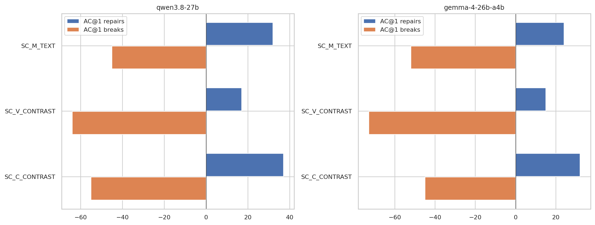

图 5：相对 TPV，新方法确实修复了一些病例，但破坏更多既有正确病例。

**F17｜SC_M_TEXT 不是“没有任何作用”，而是净收益不足。** Qwen 对 TPV 修复 32 个 top-1、破坏 45 个；Gemma 修复 24、破坏 52。全视觉损害更大：Qwen 17 修复对 64 破坏，Gemma 15 对 73。后续优化需要减少已正确案例的破坏，而非只找少量漂亮成功例。

### 5.3 超时、分母与事件组敏感性

Qwen 按各 arm 可用结果算，TPV=0.3816、SIRCL=0.3790、SC_M_TEXT=0.3337、SC_C_CONTRAST=0.3177、SC_V_CONTRAST=0.2418；固定 360 分母、超时零效用时分别为 0.3806/0.3748/0.3309/0.3132/0.2404。与全-arm共同样本结论相同：SC 未超过强基线。

事件组等权后，SC_C/SC_V/SC_M 相对 TPV 的 Qwen Δ 分别 −0.0967/−0.1651/−0.0768；Gemma 为 −0.0337/−0.1784/−0.0898。负方向并非仅由某几个重叠事件被重复计数造成。这里只把 group 均值作为稳健性检查，不将它与 per-case 效应量混为一谈。

## 6. 错误模式与哪些故障适合哪些方法

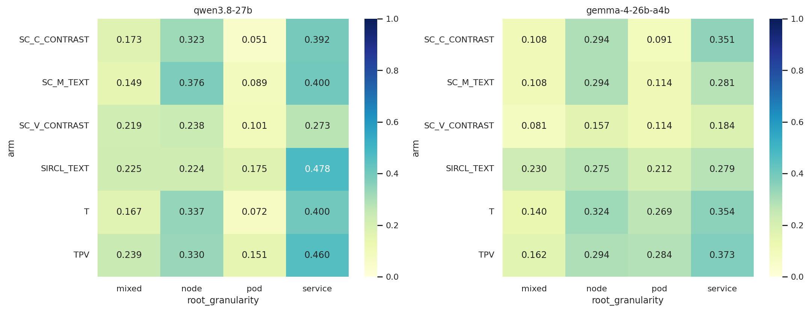

图 6：根因粒度分层。此图使用各 arm 有评分的 cases，因此为描述性图，n 在附表中逐项列出。mixed 表示登记的可接受标签跨粒度，不意味着本实验改为多根因任务。

**F18｜严格 pod 定位仍是薄弱点。** test 的 44 个纯 pod 根因 cases 均来自 AIOPS-2022。Qwen 各 arm 可用样本的 MRR：SC_C=0.0511、SC_M=0.0891、SC_V=0.1008，TPV=0.1512、SIRCL=0.1750；Gemma SC_C=0.0909、SC_M/SC_V=0.1136，TPV=0.2841。相邻 service/host 上出现强信号不等于能够定位正确 pod。

**F19｜node 保留改善有局部兑现。** Qwen node 子集中 SC_M_TEXT 描述性 MRR=0.3765，高于 TPV=0.3301；但 SC_V=0.2380。Gemma node 子集 SC 文本与 M-Text 均为 0.2941，与 TPV 相同。入口改善能留下有用信号，但承载和模型仍决定能否利用。

### 6.1 Fault-type 的收益与退化

以下对 SC_M_TEXT 与 TPV 做同-case比较。小样本仅描述模式，不据此给某个数据集/故障硬编码路由；完整表含全部 fault types。

| model | dataset | fault_type | n | a_mrr | b_mrr | delta |
| --- | --- | --- | --- | --- | --- | --- |
| qwen3.8-27b | aegislab | JVMMemoryStress | 16 | 0.8594 | 0.7500 | 0.1094 |
| qwen3.8-27b | aegislab | NetworkPartition | 13 | 0.3269 | 0.6154 | -0.2885 |
| qwen3.8-27b | aiops2022 | k8s容器内存负载 | 12 | 0.5694 | 0.3750 | 0.1944 |
| qwen3.8-27b | aiops2022 | k8s容器进程中止 | 11 | 0.1818 | 0.2576 | -0.0758 |
| qwen3.8-27b | aiops2025 | dns error | 8 | 0.0250 | 0.0312 | -0.0062 |
| qwen3.8-27b | aiops2025 | network corrupt | 8 | 0.5625 | 0.8542 | -0.2917 |
| qwen3.8-27b | aiops2025 | node disk fill | 8 | 0.5000 | 0.3750 | 0.1250 |
| gemma-4-26b-a4b | aegislab | JVMMemoryStress | 16 | 0.6875 | 0.6250 | 0.0625 |
| gemma-4-26b-a4b | aegislab | NetworkPartition | 13 | 0.0769 | 0.4615 | -0.3846 |
| gemma-4-26b-a4b | aiops2022 | k8s容器内存负载 | 13 | 0.3077 | 0.3462 | -0.0385 |
| gemma-4-26b-a4b | aiops2022 | k8s容器进程中止 | 11 | 0.0000 | 0.2727 | -0.2727 |
| gemma-4-26b-a4b | aiops2025 | dns error | 8 | 0.0000 | 0.0000 | 0.0000 |
| gemma-4-26b-a4b | aiops2025 | network corrupt | 8 | 0.3750 | 0.6250 | -0.2500 |
| gemma-4-26b-a4b | aiops2025 | node disk fill | 8 | 0.1250 | 0.3750 | -0.2500 |

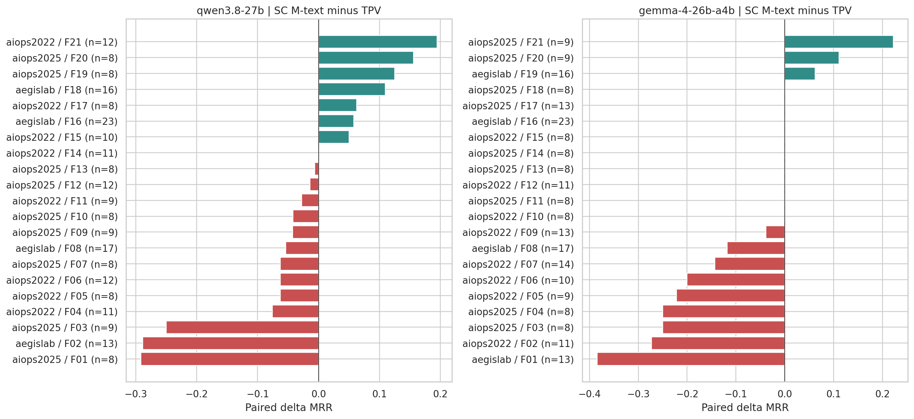

图 7：n≥8 的故障类别，SC_M_TEXT 相对 TPV 的配对 ΔMRR。F 编号与故障名称的对应关系见 fault_plot_labels CSV；编号在各模型内独立。

**F20｜资源变化比网络/语义故障更容易从 SC 补充中获益。** JVMMemoryStress 上两模型均正向；Qwen 的容器内存、node disk fill、JVM GC 也有收益。NetworkPartition 与 network corrupt 则两模型均有明显负方向。这个模式支持资源观测保留有价值，但网络故障需要更具体的请求、状态或关联证据，不能只靠资源/异常多样性。

**F21｜极难模式不是换个承载就普遍解决。** Gemma DNS error 在 SC_M 和 TPV 均为 0；Qwen 为 0.0250 与 0.0312。AIOPS-2022 网络包重复的改善也很有限。这是优先检查信号入口与身份绑定的方向，不是直接归因于模型算力。

### 6.2 输出形态、合法性与 confidence

| model | arm | n | single | mean_candidates | unknown_id_calls | reason_root_mentioned |
| --- | --- | --- | --- | --- | --- | --- |
| gemma-4-26b-a4b | SC_C_CONTRAST | 360 | 356 | 1.0444 | 2 | 0.5639 |
| gemma-4-26b-a4b | SC_M_TEXT | 360 | 360 | 1.0000 | 0 | 0.4222 |
| gemma-4-26b-a4b | SC_V_CONTRAST | 360 | 360 | 1.0000 | 0 | 0.3222 |
| gemma-4-26b-a4b | SIRCL_TEXT | 360 | 231 | 1.7389 | 0 | 0.3611 |
| gemma-4-26b-a4b | T | 360 | 281 | 1.4806 | 0 | 0.5611 |
| gemma-4-26b-a4b | TPV | 360 | 337 | 1.1250 | 0 | 0.5500 |
| qwen3.8-27b | SC_C_CONTRAST | 355 | 21 | 4.2704 | 29 | 0.5268 |
| qwen3.8-27b | SC_M_TEXT | 357 | 16 | 3.8515 | 12 | 0.4958 |
| qwen3.8-27b | SC_V_CONTRAST | 358 | 15 | 3.7207 | 10 | 0.4358 |
| qwen3.8-27b | SIRCL_TEXT | 356 | 0 | 3.3287 | 26 | 0.4860 |
| qwen3.8-27b | T | 356 | 0 | 3.1994 | 0 | 0.5281 |
| qwen3.8-27b | TPV | 359 | 0 | 3.2813 | 0 | 0.5292 |

**F22｜Gemma 的单候选行为压缩了 top-k 指标的含义。** SC_M/SC_V 全部 360 次均只给一个候选；SC_C 有 356/360 次为单候选。结果中正确根因几乎只可能在第一名，故 AC@1/3/5、MRR 相等。它不说明模型能可靠排好五个候选。Qwen 通常输出 3–4 个，因此两个模型的 AC@5 除知识能力外，还受回答形态影响。

**F23｜新增上下文伴随更多不合法 ID。** test Qwen 的模型失败：SC_C 29、SC_M 13、SC_V 11、SIRCL 26，而 T/TPV 为 0。unknown/duplicate 要分开看：SC_M 12 次有不在候选表的 ID，另 1 次为其他解析/候选规则失败。全实验模型失败 346 次中，344 次原错误类别为 unknown/duplicate entity，2 次 JSON 字符串未闭合。本报告保留原计分，没有把失败过滤掉来抬高新方法分数。

**F24｜高 confidence 不是可靠质量信号。** test 全部条件的 Qwen high 输出 1,547 次，AC@1 仅 0.2683；Gemma high 2,019 次，AC@1 0.2600。此为跨 arm 的描述性结果，不是独立样本的校准检验。reason 中提到根因 ID 也不能替代解释正确率：它可能只是提及或排除该实体。

### 6.3 方法互补的诊断上界

只在所有六方法均有评分的 test cases 上取 union：Qwen（341）AC@1 联合覆盖 56.0%、AC@5 联合覆盖 80.1%，事后最优 RR 均值 0.6649；Gemma（360）为 56.4%、61.9%、0.5880。AIOPS 合并则 Qwen AC@5=72.0%，Gemma=52.1%。

Qwen 尚有 68 个共同 test cases 在六方法中都没进前五，其中 63 个来自 AIOPS；Gemma 为 137 个，其中 115 个 AIOPS。**这显示信号/解释仍有未覆盖区域，也显示已有方法互补；不提供可部署 oracle，更不证明一个无需标签的路由器能取得这些上界。**

## 7. 实验三：证据依赖、稳健性和重复调用

| model | a | n | delta | p_holm | repairs | breaks |
| --- | --- | --- | --- | --- | --- | --- |
| qwen3.8-27b | REMOVE_TARGET__C_CONTRAST | 78 | -0.0190 | 1.0000 | 5 | 6 |
| qwen3.8-27b | REMOVE_TARGET__M_TEXT | 79 | -0.1017 | 0.0449 | 1 | 7 |
| qwen3.8-27b | REMOVE_MATCHED_NONTARGET__C_CONTRAST | 77 | -0.0080 | 1.0000 | 3 | 3 |
| qwen3.8-27b | REMOVE_MATCHED_NONTARGET__M_TEXT | 76 | 0.0180 | 1.0000 | 1 | 2 |
| qwen3.8-27b | NO_GROUPING__C_CONTRAST | 96 | 0.0073 | 1.0000 | 1 | 0 |
| qwen3.8-27b | NO_GROUPING__M_TEXT | 98 | -0.0219 | 1.0000 | 2 | 5 |
| qwen3.8-27b | REDUNDANT_NOISE__C_CONTRAST | 97 | 0.0002 | 1.0000 | 3 | 5 |
| qwen3.8-27b | REDUNDANT_NOISE__M_TEXT | 98 | -0.0476 | 1.0000 | 3 | 8 |
| qwen3.8-27b | REANONYMIZE__C_CONTRAST | 96 | 0.0392 | 1.0000 | 11 | 8 |
| qwen3.8-27b | REANONYMIZE__M_TEXT | 98 | 0.0291 | 1.0000 | 11 | 7 |
| qwen3.8-27b | REPLICATE_1__C_CONTRAST | 97 | 0.0124 | 1.0000 | 1 | 0 |
| qwen3.8-27b | REPLICATE_1__M_TEXT | 97 | -0.0098 | 1.0000 | 0 | 2 |
| qwen3.8-27b | REPLICATE_2__C_CONTRAST | 96 | 0.0125 | 1.0000 | 1 | 0 |
| qwen3.8-27b | REPLICATE_2__M_TEXT | 97 | -0.0155 | 1.0000 | 0 | 2 |
| gemma-4-26b-a4b | REMOVE_TARGET__C_CONTRAST | 81 | -0.2012 | 0.0157 | 2 | 19 |
| gemma-4-26b-a4b | REMOVE_TARGET__M_TEXT | 81 | -0.1605 | 0.0449 | 2 | 15 |
| gemma-4-26b-a4b | REMOVE_MATCHED_NONTARGET__C_CONTRAST | 80 | 0.0125 | 1.0000 | 4 | 3 |
| gemma-4-26b-a4b | REMOVE_MATCHED_NONTARGET__M_TEXT | 80 | 0.0250 | 1.0000 | 4 | 2 |
| gemma-4-26b-a4b | NO_GROUPING__C_CONTRAST | 100 | 0.0200 | 1.0000 | 2 | 0 |
| gemma-4-26b-a4b | NO_GROUPING__M_TEXT | 100 | 0.0100 | 1.0000 | 4 | 3 |
| gemma-4-26b-a4b | REDUNDANT_NOISE__C_CONTRAST | 100 | 0.0300 | 1.0000 | 7 | 4 |
| gemma-4-26b-a4b | REDUNDANT_NOISE__M_TEXT | 100 | 0.0100 | 1.0000 | 3 | 2 |
| gemma-4-26b-a4b | REANONYMIZE__C_CONTRAST | 100 | 0.0400 | 1.0000 | 7 | 3 |
| gemma-4-26b-a4b | REANONYMIZE__M_TEXT | 100 | -0.0200 | 1.0000 | 1 | 3 |
| gemma-4-26b-a4b | REPLICATE_1__C_CONTRAST | 100 | 0.0000 | 1.0000 | 1 | 1 |
| gemma-4-26b-a4b | REPLICATE_1__M_TEXT | 100 | -0.0100 | 1.0000 | 0 | 1 |
| gemma-4-26b-a4b | REPLICATE_2__C_CONTRAST | 100 | 0.0100 | 1.0000 | 3 | 2 |
| gemma-4-26b-a4b | REPLICATE_2__M_TEXT | 100 | 0.0000 | 1.0000 | 1 | 1 |

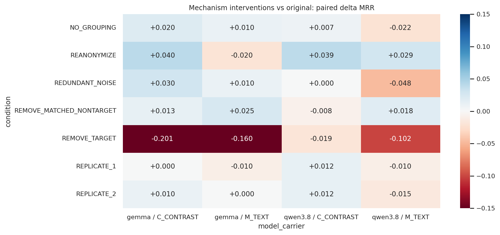

图 8：机制干预相对原条件的配对 ΔMRR。C-Contrast 的 NO_GROUPING 已确认是同输入重复，不能解释为分组效应。各单元的适用 n 不同。

### 7.1 有证据支持的依赖关系

**F25｜移除根因关联事实比匹配非目标移除更有破坏性。** 直接比较两种删除条件：Qwen M-Text Δ=−0.1237（n=78，p=0.0038）；Gemma C-Contrast −0.2163（n=80，p=0.0081），M-Text −0.1875（n=80，p=0.0082）。这支持 Solver 确实利用了部分与根因关联的输入，而非对输入完全不敏感。

但删除的是**第一条根因关联 M/R/L fact**，不是人工认证的完整因果机制包；匹配的是 region 与 field。删除还会清理相关 bundle/引用。故这是“该可见观测及相关引用”的输入干预效应，不是某个真实故障机制的物理因果贡献。

**三主数据集单独检验时功效不足。** 仅约 39–41 个适用 cases；Qwen M-Text 目标/匹配删除 Δ=−0.1513，p=0.0525，其余也未通过对应校正。五数据集显著性不能直接写成三个困难数据集均已证明。

### 7.2 自然波动与真实干预

**F26｜同输入重复波动小于多数大规模表示退化。** 两次额外重复相对基线的平均 Δ大致在 −0.0155 到 +0.0125，绝大多数 case 的 RR 不变。这不能保证任意运行完全确定，但使 0.08–0.17 量级的成体系退化较难由单纯采样解释。

**F27｜ID 重匿名化会扰动 Qwen 的个体排名，即使均值接近。** C-Contrast 有 43/96 个 RR 改变，M-Text 35/98；对应普通重复只有 2/96–97、3–5/97。Gemma 重匿名化 RR 改变 10/100 与 4/100。均值不显著不等于逐 case 稳健。变换后的原始 ID 不可直接与原 ID 比较 top-1 字符串；这里仅比较经过正确映射评分后的 RR。

**F28｜添加低相关观测没有一致的模型无关效应。** Qwen 文本几乎不变、M-Text 平均下降约 0.0476；Gemma 为小幅正向，均未通过对应多重比较。当前实现是在 SC 选择完成后添加最多 12 条 reservoir facts、最多 2 条 log，不是重新运行“噪声池→选择器”。因此它测的是最终上下文/显示负载敏感性，不是选择器抗噪能力。

### 7.3 空干预的核验

基于落盘 `inputs.parts` 的规范化 hash，而非 call key：C-Contrast NO_GROUPING 与基线在 Qwen 的全部 96 个可配对 cases、Gemma 的全部 100 个完全相同。两次 replicate 也逐项验证为同输入。M-Text NO_GROUPING 全部改变了图像输入。

所以 C-Contrast NO_GROUPING 的 +0.0073/+0.0200 是输出波动，不能当作“取消比较组织有效”。这个发现来自真实模型输入，不只是阅读 arm 名称。

## 8. 成本与效率：输入和输出必须分开

| model | arm | mrr | text_tokens | image_tokens | input_tokens | output_tokens | total_tokens | wall_time_s |
| --- | --- | --- | --- | --- | --- | --- | --- | --- |
| gemma-4-26b-a4b | SC_C_CONTRAST | 0.29 | 12715.29 | 0.00 | 12715.29 | 111.55 | 12826.84 | 21.75 |
| gemma-4-26b-a4b | SC_M_TEXT | 0.24 | 10754.80 | 1088.89 | 11843.69 | 105.34 | 11949.02 | 20.90 |
| gemma-4-26b-a4b | SC_V_CONTRAST | 0.16 | 1270.90 | 1082.80 | 2353.70 | 98.89 | 2452.59 | 20.87 |
| gemma-4-26b-a4b | SIRCL_TEXT | 0.26 | 14584.82 | 0.00 | 14584.82 | 70.16 | 14654.98 | 26.71 |
| gemma-4-26b-a4b | T | 0.32 | 14284.84 | 0.00 | 14284.84 | 112.34 | 14397.18 | 29.70 |
| gemma-4-26b-a4b | TPV | 0.33 | 13754.04 | 1084.40 | 14838.44 | 107.18 | 14945.62 | 29.32 |
| qwen3.8-27b | SC_C_CONTRAST | 0.32 | 11782.55 | 0.00 | 11782.55 | 197.11 | 11979.66 | 134.78 |
| qwen3.8-27b | SC_M_TEXT | 0.33 | 9901.89 | 5207.57 | 15109.46 | 165.60 | 15275.05 | 126.54 |
| qwen3.8-27b | SC_V_CONTRAST | 0.24 | 1257.11 | 9646.21 | 10903.31 | 172.96 | 11076.27 | 128.69 |
| qwen3.8-27b | SIRCL_TEXT | 0.38 | 13826.64 | 0.00 | 13826.64 | 108.57 | 13935.21 | 109.60 |
| qwen3.8-27b | T | 0.32 | 12946.66 | 0.00 | 12946.66 | 158.83 | 13105.49 | 124.00 |
| qwen3.8-27b | TPV | 0.38 | 12538.06 | 2078.25 | 14616.31 | 163.18 | 14779.48 | 126.20 |

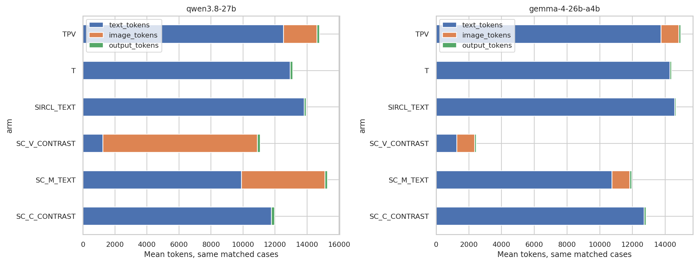

图 9：test 共同 cases 的平均文本、图像及输出 tokens。图像已包含在 input 中，不重复加总。

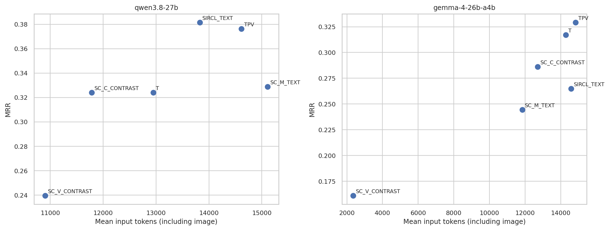

图 10：本次实际准确率—输入 token 散点；不是美元成本或跨模型硬件 FLOPs 比较。

**F29｜视觉压缩最强的地方也可能损失最多信息利用能力。** Gemma SC_V 的输入约 2,354 tokens，TPV 约 14,838，减少约 84.1%；MRR 同时从 0.3292 到 0.1611。Qwen SC_V 对 TPV 输入约减少 25.4%，输出反而增加约 6.0%，MRR 明显下降。

**F30｜M-Text 不保证省成本。** Qwen SC_M 约 15,109 input，高于 TPV 的 14,616；output 为 165.6 对 163.2，基本没有节省。Gemma SC_M 比 TPV 节省约 20.2% input，但 output 只减少约 1.7%，且准确率下降。Qwen SC_C 输入少约 19.4%，输出却多约 20.8%。

**F31｜本轮图像 token 负载在两个模型上很不相同。** SC_V 的平均图像 tokens：Qwen 约 9,646、Gemma 约 1,083；SC_M 为约 5,208/1,089。高密度小字图在不同 processor 下的有效可读性可能不同，但本轮没有单独随机化分辨率，不能把跨模型差异全部归因于视觉 token 上限。

26,995 个有输出记录均满足 `input=text+image`、`total=input+output`。合计记录到 342,304,008 input 和 3,841,751 output tokens；这是**当前纳入记录的已知总量**，不包括 129 个超时的未知服务端用量、被替代结果、smoke 或其他未形成当前输出的尝试，不能当作完整实际执行总成本。

latency 表为已有 `wall_time_s` 均值，受并发、CPU准备、排队和运行阶段影响，不是匹配负载下的服务基准；本次没有新增 TTFT/TPOT/GPU-seconds 测量，也没有 attention 产物。

## 9. 定性复核：排名、证据与公开 reason 不总一致

从固定关键比较中按最大正/负 RR 差选代表案例，再阅读实际 prompt、response、conversation 和 PNG。它们是定向错误分析，不是随机抽样的解释质量率；没有把这些样例外推成全体错误比例。

### A：视觉也能帮助抓住 node 资源故障

`INC-1D51AFFCB615` · aiops2022 · node 磁盘写IO消耗。比较：SC_C_CONTRAST vs SC_V_CONTRAST；RR=0.000 对 1.000。

两条件使用相同 SC 事实。图像条件将 node 8952 排第一，文本条件把 ShipOrder pods 放在前面。实际图中 8952 的 I/O 队列呈持续抬高，而 8104 的同类曲线主要是孤立脉冲：这支持“持续形状比较可能帮助宿主/受害者区分”的局部假设。两曲线 x 轴还分别使用秒和 bins，因此不能仅凭本例宣布严格时间对齐带来因果收益。

[条件 A conversation](../../RQs/RQ3_2/results/formal_signal_cover_v2/exp_signal_locked_generalization/conversations/02eda39c496087e89800a1ddd440fa7584af97424bea4868b9b5dc1b52fe4a2e.md) · [条件 B conversation](../../RQs/RQ3_2/results/formal_signal_cover_v2/exp_signal_locked_generalization/conversations/aec11530d0b901c5d2d8c042e1f9e7979bc65d2615ea5841a04662ef434ed9b0.md)。

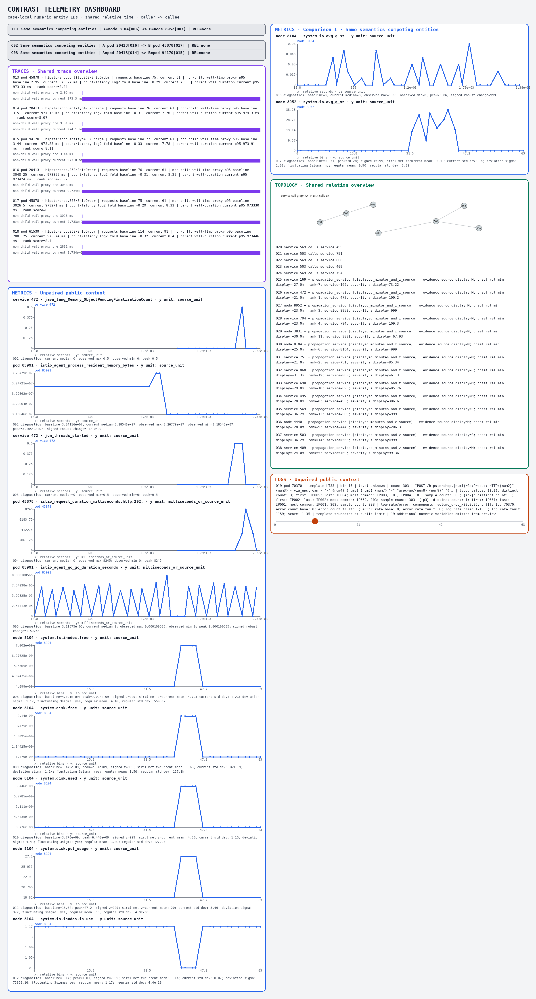

图：该次模型实际接收的原 PNG，未重新渲染、裁剪或改字。可打开原图放大。

### B：正确答案也会配上矛盾解释；图像错误可定位到实体绑定

`INC-0915D5F0EB5B` · aegislab · JVMMemoryStress。比较：SC_C_CONTRAST vs SC_V_CONTRAST；RR=1.000 对 0.000。

文本将 service 216 排第一，却先称 5.4m 为最早，又承认 702/337 在 5.0m；理由内部不一致。全视觉选择 pod 35630，并把 O08 的 node-utilization、O09 的 restart 都归给它。实际 PNG 中 O08 属于 service 216，O09 属于 pod 23941，35630 只出现在日志 O19。这是具体的跨区域身份绑定错误，不是凭低分猜“模型没看懂”。

[条件 A conversation](../../RQs/RQ3_2/results/formal_signal_cover_v2/exp_signal_locked_generalization/conversations/ac19566cdf7c879333a1b66ce3bc55aec207fda1d39947e3b5f2a8ce360db7b0.md) · [条件 B conversation](../../RQs/RQ3_2/results/formal_signal_cover_v2/exp_signal_locked_generalization/conversations/3b5599fdf4eb3b88c6c66761df5b5e59de96cec0ccc4e05d8f6917f346d066c8.md)。

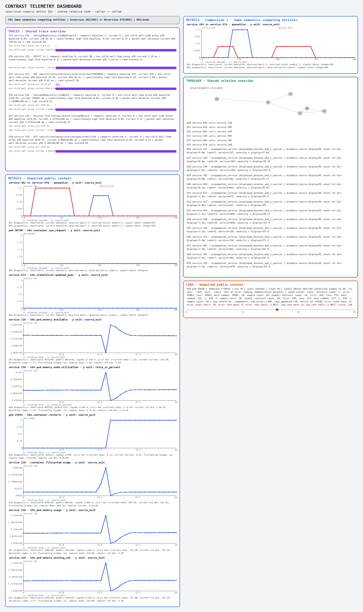

图：该次模型实际接收的原 PNG，未重新渲染、裁剪或改字。可打开原图放大。

### C：SC 选错根因时，不一定是正确实体没出现

`INC-3015F112D266` · aegislab · HTTPResponseAbort。比较：SC_M_TEXT vs TPV；RR=0.000 对 1.000。

SC_M 将 908 排第一，TPV 正确选择 358。SC 图中仍有 358 的 trace O13/O17 和相关日志；SC 的公开 reason 将 804→213/634 的边作为 908 起源的支持，又把 non-child proxy 说成“actively waiting”。该关联不由所引边直接支持，proxy 也不等于实测等待。这是已有根因相关观测仍排名失败的实例，不宜全部归为 selection miss。

[条件 A conversation](../../RQs/RQ3_2/results/formal_signal_cover_v2/exp_signal_locked_generalization/conversations/e10097e40750611a97edc557af5891ee0c05cd61b276a7ee12c3c12a0e8e2ac0.md) · [条件 B conversation](../../RQs/RQ3_2/results/formal_signal_cover_v2/exp_signal_locked_generalization/conversations/f6da97ebc055e3e58ddc7f16b0c6462ce7a41668fd479fc48aa95926885484e7.md)。

### D：SC 的资源线索与早期关联能够修复一部分病例

`INC-0CD087EF23F0` · aegislab · JVMMemoryStress。比较：SC_M_TEXT vs TPV；RR=1.000 对 0.000。

JVMMemoryStress case 中 SC_M 选择正确 394，TPV 选择 880。SC reason 引用 394 的资源变化和 G 的 onset；TPV 追逐 880 的 CPU/latency。说明上下文竞争确实会改变排名，但 SC 引用的 filesystem 峰值并非直接证明 JVM 内存故障，正确 ID 不等于故障机理解释已验证。

[条件 A conversation](../../RQs/RQ3_2/results/formal_signal_cover_v2/exp_signal_locked_generalization/conversations/d10b57e160db27839f92c295103e33e34f95b56cf61949f5da69eba5d6c6fc4d.md) · [条件 B conversation](../../RQs/RQ3_2/results/formal_signal_cover_v2/exp_signal_locked_generalization/conversations/a841e91b2a4294603c5431134af78cea07dc1f51551fb676e1361a96f4334697.md)。

### E：错误粒度也会藏在“正确排名”里

`INC-526924866F4E` · aiops2022 · k8s容器写io负载。比较：SC_M_TEXT vs TPV；RR=0.000 对 1.000。

真实根因 ID 为五位 pod 84816；TPV 虽然 top-1 正确，reason 却称它为 node，并将三位 ID 称为 pod。SC_M 的 reason 又把四位 8220 称为 service，并混淆 calls 与 hosts。这一例说明必须同时核查 ID 和实体类型，不能仅凭命中就称诊断可核验。

[条件 A conversation](../../RQs/RQ3_2/results/formal_signal_cover_v2/exp_signal_locked_generalization/conversations/d64b5bd9db034e04ad6fd1d66f879a6722fb85e7788352fa6636e48942aa32d8.md) · [条件 B conversation](../../RQs/RQ3_2/results/formal_signal_cover_v2/exp_signal_locked_generalization/conversations/c0bf8be973281b186955d7d85f407ea59ed17a8c3eb1908a286575efdf571a84.md)。

### 9.1 视觉检查的共同线索

两张全视觉例图都保留了实际曲线，但大量 R/G/L 字段仍依赖很小的正文阅读；部分页面左右列高度差较大，存在大块空白。Trace 每行的当前条形几乎都填满本行，可帮助前后比较，却不适合凭条长直接跨行比较绝对耗时。图像并非没有数据，问题在于同一屏上曲线、长文本、引用、图边和类型绑定的阅读负担。

这些是样例图及 renderer 的具体观察，不是全量视觉错误率，也不是将读取困难等同于字段缺失。

## 10. 解释结果前必须明确的实现范围

本节是本次分析读代码与实际 artifact 得到的发现；**没有修复、重跑、覆盖原结果，也没有批量宣布历史实验失效**。凡受影响的机制命题，仅报告真实执行条件下的结果，不把它提升为计划所述理想方法的效果。

| 项目 | 核查到的实际行为 | 对结论的影响 |
| --- | --- | --- |
| P0_MORE | `select_signal_cover(mode="p0_more")` 令 backbone=0，从完整新池选取；后续候选还按 strength/semantic frequency 排序 | 不是“P0 同排序只多25%容量”，不能拿它解释纯容量效应 |
| C-Flat/C-Contrast | selection 调 `X_T` natural catalogue，已含比较引用；C-Contrast 调 `X_C` compact catalogue，不是现有 `X_C_TABLE` 局部并列表 | 无法干净回答“真正文本对比 vs 图像对比”的全部问题 |
| C-Contrast NO_GROUPING | grouping 参数只进入 renderer，没有移除 compact text 的 bundles，落盘输入逐项相同 | 只提供额外重复调用观测，不是文本组织消融 |
| 时间说明 | 新请求继承“first half/second half”说明；aligned pool 实际采用 P0 public split。444/480 eval、339/360 test 的 split 与中点相差超过1秒 | 对齐统计条件的阅读指南不准确；相关效应不能全归于选择策略 |
| 混合统计语义 | SC 包含 inherited P0 的 MET-Z/TRC-L 字段与 direct-pool 统计；说明仍统一说 median、child-interval union | 数字或指标名称相似不代表完全相同的统计对象 |
| SC 配对 | `_build_bundles` 按语义键分组，并取排序最前的两个匿名实体；不是按竞争诊断区分力求最优 pair | 当前方法更接近规则覆盖＋同语义配对，不是完整实现的竞争解释优化 |
| 区分补充 | 主要为 public strength / 同语义候选频次；coverage 使用层次×signal tags 的新增组合 | 强度与稀有度代理不能直接称为诊断区分度 |
| Strict pair | 有同语义不同实体即获得资格，容量截断不保证两侧都最终入选 | “完整双侧包必须入选”的反向消融不够严格 |
| REMOVE_TARGET | 首个根因关联 fact；非目标匹配 region/field | 结论限定为观测依赖，不是完整机制包因果贡献 |
| REDUNDANT_NOISE | 在最终已选事实后添加 reservoir facts，不重新选择 | 反映上下文/显示负载，不是 selector 抗噪 |

### 10.1 同名 trace 双版本值得优先核查

在 SC_FULL 的已选事实中，仅移除 `entity:` 这类公开名字替换前缀，就能找到同实体、同 operation 的双版本记录：eval 的 AIOPS-2022 有 54 cases、AIOPS-2025 有 54；test 为 55/64。**这只是同语义键共存，不自动判为错误重复**，因为窗口或统计方法可以不同。

但实际样例 `INC-0060628741E9` 中，同 pod 的 ListProducts，一条 inherited R 记录 current proxy≈481,296.6 ms、baseline≈2,513 ms；另一条 direct-pool 记录 current≈2.51 ms、baseline≈481.17 ms，请求基线/当前计数也不同。模型输入却没有明确区分这两套统计的不同对象和时间来源。

来源代码显示 direct trace 对 AIOPS/Aegis 采用已登记的 stored-duration×0.001 投影；P0 事实被直接继承。本次没有重新扫描 raw/per-case 源表去证明每个差异的唯一原因，因此不能将所有共存记录定性为同一个单位 bug。它是**有 artifact 支持的统计兼容性风险**，应先核对，再解释为故障的真实“矛盾信号”。

### 10.2 对旧结果与下一步的含义

本报告的 performance 数值仍准确描述当前实际 pipeline。时间指南错误、空干预和不匹配 ablation 的存在，使得“SC 理论本身无效”“文本对比已穷尽”“某个机制已被完整消融”这些归因得不到当前执行的支持。应保存本轮负结果，并在下一次用户授权修改时优先做最小语义修复，而非继续增加新 arm。

## 11. 本轮形成的研究认识

1. **保留、读取、排序是不同问题。** node 入口修复与总体 MRR 未同步增长；根因观测被删案例明显退化；同一内容下全视觉再损失。这三条证据共同支持分层诊断瓶颈，而不是一个统一“模型不够聪明”的解释。
2. **好的统一方法必须控制 break。** SC 的新增案例有意义，但当前固定50%保留策略不足以保障重要旧信号；下一版优先验证“哪些证据不能随意替换”，比继续扩充异常排序器更有根据。
3. **视觉的研究价值应落在具体操作上。** 持续资源形状、局部对比、身份绑定都有可检验样例，但总体上新全视觉承载不够好。对比一个真正局部并列、同统计语义的强文本条件，比继续将紧凑引用文本称为已经完善的对比基线更必要。
4. **证据依赖已经出现可发表的测量方向。** 目标/非目标删除差异，以及同输入重复和重匿名化扰动的对比，比 attention 热点更直接地刻画输入—输出关系；还需要在困难数据集扩大有效覆盖并修正干预含义。
5. **不能只凭 AC@5 来宣布“信号已经被理解”。** Qwen 有些根因进入前五但不是第一；Gemma 通常不输出足够候选。排名、引用正确性、实体绑定和反事实敏感性必须联合观察。
6. **不建议立即扩大实验或启动 RL 来掩盖语义问题。** 最先应该处理已定位的时间/统计说明与对照实现问题，然后才有条件判断统一选择器是否需要改规则。本次分析没有启动这些工作。

总的来说：RQ3.2 的价值不在于交付了新的最高 MRR，而在于它把“保护旧信号确有用”“新增覆盖仍会丢失决定性证据”“全视觉读取与绑定存在明显损耗”“部分答案确实依赖根因观测”四条现象分开测了出来；同时找到了必须修正的实验解释边界。

## 12. 附件、可复现性与文件索引

- [完整性与终态计数](RQ3_2_Results_Analysis_2026-09-22_assets/completion_audit.csv)

- [全部 arms × 数据集/合并口径 × 分母的指标](RQ3_2_Results_Analysis_2026-09-22_assets/arm_metrics.csv)

- [全部配对检验、效应量、Holm与repair/break](RQ3_2_Results_Analysis_2026-09-22_assets/paired_statistics.csv)

- [逐故障类别原始均值](RQ3_2_Results_Analysis_2026-09-22_assets/fault_metrics.csv)

- [关键比较的逐故障配对变化](RQ3_2_Results_Analysis_2026-09-22_assets/paired_fault_effects.csv)

- [根因粒度统计](RQ3_2_Results_Analysis_2026-09-22_assets/granularity_metrics.csv)

- [逐case逐selector证据组成](RQ3_2_Results_Analysis_2026-09-22_assets/evidence_composition.csv)

- [P0→各方法根因Metrics保留/增删分层](RQ3_2_Results_Analysis_2026-09-22_assets/root_metric_transitions.csv)

- [选择×表示交互](RQ3_2_Results_Analysis_2026-09-22_assets/selection_representation_interactions.csv)

- [真实输入同一性、重复与机制扰动](RQ3_2_Results_Analysis_2026-09-22_assets/intervention_identity_summary.csv)

- [逐case干预输入核查](RQ3_2_Results_Analysis_2026-09-22_assets/intervention_input_identity.csv)

- [候选数量、未知ID与reason提及](RQ3_2_Results_Analysis_2026-09-22_assets/answer_patterns.csv)

- [多方法互补上界（非部署成绩）](RQ3_2_Results_Analysis_2026-09-22_assets/diagnostic_union_not_deployable.csv)

- [候选数/token与成绩的描述性相关](RQ3_2_Results_Analysis_2026-09-22_assets/exploratory_correlations.csv)

- [定向样例与完整conversation/PNG定位](RQ3_2_Results_Analysis_2026-09-22_assets/representative_pairs.json)

- [同operation双版本证据清单](RQ3_2_Results_Analysis_2026-09-22_assets/trace_same_operation_pairs.json)

- [当前有效逻辑单元的结果重建](RQ3_2_Results_Analysis_2026-09-22_assets/logical_results.csv)

- [带离线标签分层的逐单元分析表](RQ3_2_Results_Analysis_2026-09-22_assets/scored_cases_enriched.csv)

- [token口径核查](RQ3_2_Results_Analysis_2026-09-22_assets/token_accounting_check.json)

- [分析来源与零新增调用记录](RQ3_2_Results_Analysis_2026-09-22_assets/analysis_provenance.json)

分析入口（都只读原实验，只写派生分析结果）：

```bash
cd /home/lglsj/CanvasRCA_nibi
source scripts/env_local.sh
export PYTHONPATH="$PWD/src:$PWD"
/home/lglsj/CanvasRCA/venvs/tools/bin/python RQs/RQ3_2/scripts/analyze_rq32_results.py
/home/lglsj/CanvasRCA/venvs/tools/bin/python RQs/RQ3_2/scripts/analyze_rq32_patterns.py
/home/lglsj/CanvasRCA/venvs/tools/bin/python RQs/RQ3_2/scripts/write_rq32_report.py
```

第一次重建会顺序读取840个已存在的prepared contexts提取离线元数据，不做preparation。若派生逐单元与metadata表已经生成，可给第一个脚本加 `--reuse-derived`，跳过大context读取。

来源入口：[运行状态](../../RQs/RQ3_2/results/formal_signal_cover_v2/formal_queue_status.json)、[方法锁定](../../RQs/RQ3_2/results/formal_signal_cover_v2/method_lock.json)、[注册配置](../../RQs/RQ3_2/configs/research_v2.json)、[实验协议及修订](../../RQs/RQ3_2/descriptions/RQ3_2_experiments.md)、[原计划](../experiment_plans/CanvasRCA_RQ3_2_Research_Plan_2026-09-20.md)。

仅为离线统计与定向审阅；没有对全部输入进行新的逐像素验收，没有盲法双人标注，也没有将公开 reason 当作隐藏思维链。所有数字对应本报告明示的实际方法与数据分母。
