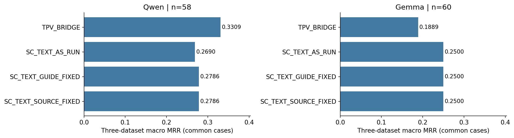
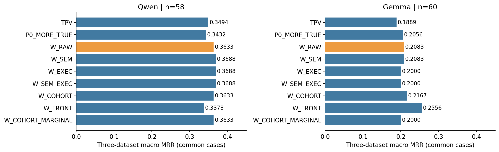
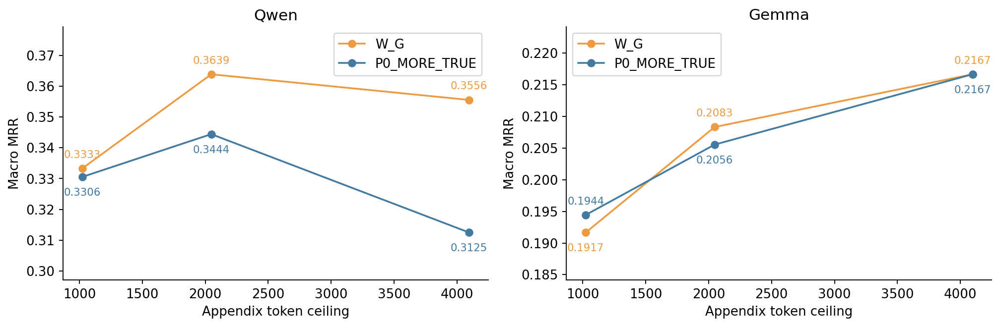
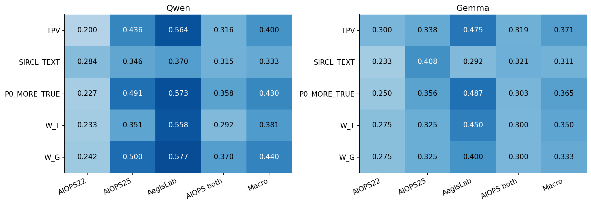
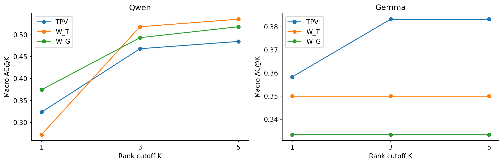
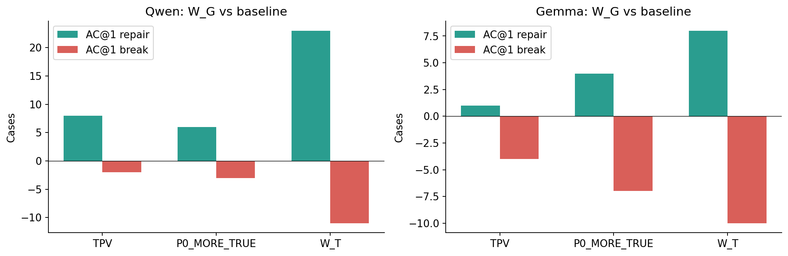
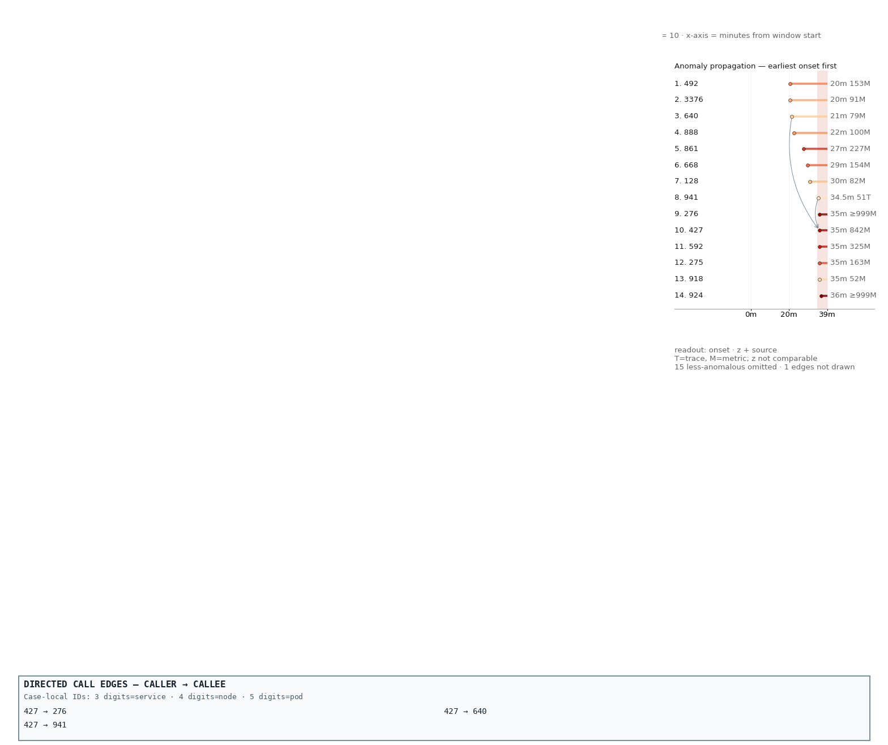
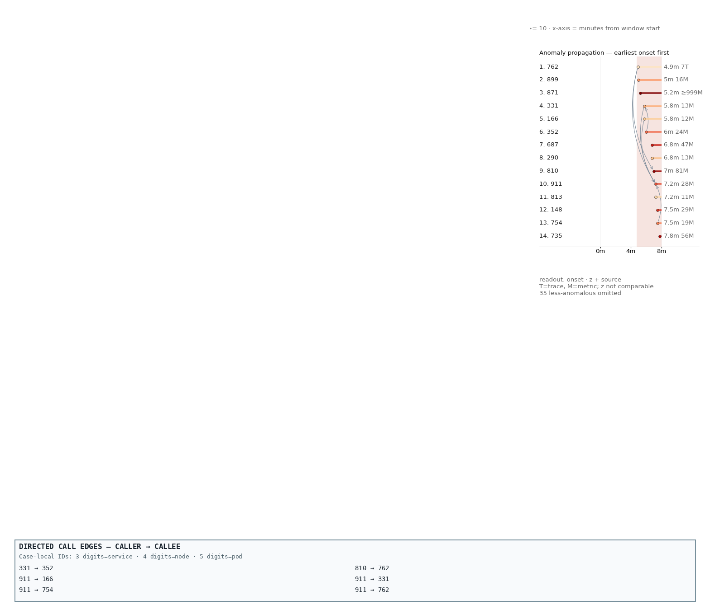
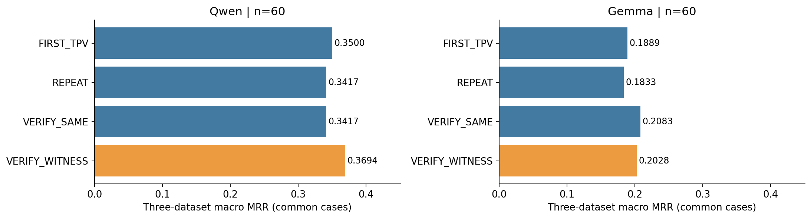
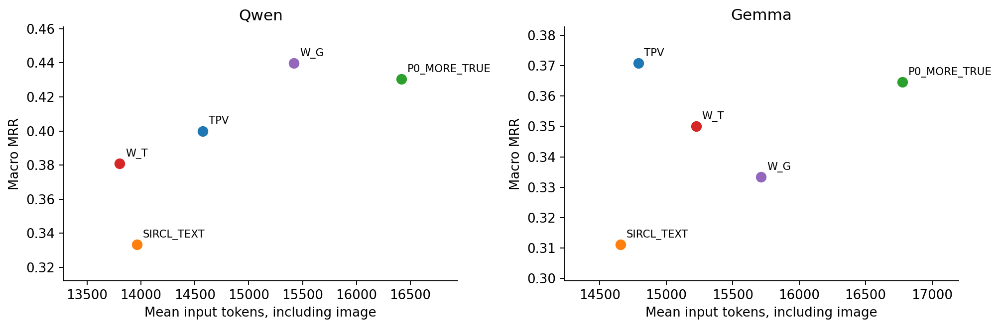

# RQ3.3 本轮实验完整分析：见证追加的有限收益、竞争症状与实体绑定瓶颈

日期：2026-09-24。对象：`RQs/RQ3_3/results/witness_v2`。性质：**完成的开发实验及条件式诊断分析，不是 RQ480 全量效果或 360-case test 报告。**

## 0. 先说结论

本轮不是异常崩溃后留下半套结果，而是按注册规则完成了 **calibration → screen → budget → check → diagnostic**，于本地时间 **2026-09-24 16:01:36** 正常结束。锁定方案为 **W_RAW、2048-token 附加证据预算**。它没有通过扩大实验的全部条件，因此后续效果、机制与泛化实验没有启动。

最重要的结果如下，MRR 为三个主数据集等权宏平均；check 的 Qwen 使用共同可评分的 118 cases，Gemma 使用 120 cases。

| 方法 | Qwen MRR | Gemma MRR | 解释 |
|---|---:|---:|---|
| TPV | 0.4000 | **0.3708** | 原 M/R/L 文本＋G 图像 |
| SIRCL_TEXT | 0.3333 | 0.3111 | 原生工具文本对照；存在下文单列的输出 ID 问题 |
| P0_MORE_TRUE | 0.4304 | 0.3646 | 保留 TPV，沿原工具排序增加证据 |
| W_T | 0.3808 | 0.3500 | 见证追加＋G 改为文本 ledger |
| W_G | **0.4398** | 0.3333 | 保留 TPV 的 G 图，追加 RAW 文本见证 |

**总体判断：保留底座、追加见证获得了局部修复，但还没有得到值得直接扩成主方法的、稳定可迁移的增益。** Qwen 有净收益，Gemma 反向；Qwen 相对普通扩充证据的额外收益很小。以下发现比一个“没通过”的标签更有用：

1. **保留原证据、补入遗漏的宿主资源信号，确实能修复部分 Qwen 错误。** W_G 相对 TPV 修复 8 个 AC@1、破坏 2 个；不是全部原地踏步。
2. **但追加更多原工具证据已经实现了相当一部分提升。** Qwen 的 TPV→MORE 为 +0.0304，MORE→W_G 仅 +0.0094；后者才是新选择规则需要解释的增量。
3. **根因观测存在与模型利用之间仍有很大的差距。** 在基础 M/R/L 不含根因兼容实体、见证新增了相关观测的 11 cases 中，Qwen MRR 从 0.0455 升至 0.2455，Gemma 仍为 0。
4. **保留旧证据不等于保留旧判断。** 原文本和 G 像素未改，模型仍会被追加的竞争异常吸引，甚至把原本正确的 pod 改判为 node。
5. **视觉影响更像条件性的排序变化，不是简单增加根因覆盖。** Qwen W_G 比 W_T 的 MRR 高约 0.059，但 AC@5 略低；Gemma 没有相同收益。
6. **显式释义、预先计算及前置证据没有共同、稳定的正效应。** 前置对 Gemma 有探索性收益，对 Qwen 则退化。
7. **联合统计条件的有效覆盖不足是一个实验发现。** 57/60 cases 有合格来源候选，只有 10/60 实际追加了 cohort；不能将 60-case 总体无提升当成对联合信息价值的充分否定。
8. **公开解释暴露了可操作的错误类型。** 数字引用正确但错误判断源头/受害者、service/node 类型混淆、把同刻或较晚 onset 说成最早，以及 JSON 排名与 reason 不一致，均出现在真实记录中。

本次只做离线读取、统计、绘图和文档整理；**没有新模型调用，没有更改评分器、阈值、实验输入或历史结果。**

## 1. 数据、完成状态与分母

### 1.1 实际完成了什么

| 阶段 | 注册 cases | 条件与模型 | 逻辑单元 | done | request timeout |
|---|---:|---|---:|---:|---:|
| calibration | 60 | 4 条件×2 模型 | 480 | 478 | 2 |
| screen | 同一 60 | 9 条件×2 模型 | 1,080 | 1,078 | 2 |
| budget | 同一 60 | 新增 1024/4096 两档×2 条件×2 模型 | 480 | 480 | 0 |
| check | 另 120 | 5 条件×2 模型 | 1,200 | 1,197 | 3 |
| diagnostic | 回到 screen 的 60 | 4 条件×2 模型 | 480 | 480 | 0 |
| **合计** | **180 个不同案例** | 不把重复 arm 当新 case | **3,720** | **3,713** | **7** |

这里的 done 表示请求产物完整落盘，**不等于答案正确或通过输出候选校验**。

调用数据库记录了 **3,161 次正式实际调用＝3,154 次成功返回＋7 次基础设施失败**。再加本版 smoke 的 86 次实际调用及旧尝试仅计预算的 53 次，总累计 **3,300 calls**。成功逻辑单元中的 **559 次**通过同请求复用完成，而不是重新调用。五项 smoke 合计 90 个逻辑单元；smoke 结果不进入效果统计。

后续 `effectiveness`、`organization`、`interventions`、`pairs`、`binding`、`regression` 未运行；`events` 未获执行资格；`fresh` 没有已审核的可用 roster。不能把“当前队列完成”理解为“全部最初规划的实验都跑完了”。

### 1.2 数据集与配对排除

screen：AIOPS-2022、AIOPS-2025、AegisLab 各 20；check：各 40。两者不共享注册的完整事件/窗口连接组，但都来自历史已经使用过的 eval，因此是 **repeated-exposed development**，不是 untouched test。RE2 两数据集没有进入这轮已执行阶段。

| 阶段的全条件共同集合 | Qwen：22 / 25 / Aegis | Qwen n | Gemma n |
|---|---|---:|---:|
| calibration | 20 / 20 / 18 | 58 | 60 |
| screen | 20 / 20 / 18 | 58 | 60 |
| budget 六条件 | 20 / 20 / 20 | 60 | 60 |
| check 五条件 | 40 / 39 / 39 | 118 | 120 |
| diagnostic 四条件 | 20 / 20 / 20 | 60 | 60 |

有明确记录的请求 timeout 在每项配对比较中做共同 case 排除，不作为模型零分、不自动补跑；输出非法则保留原零分。不同阶段的排除案例并不完全相同，所以不能把 screen 与 calibration 的 TPV 数值差当成方法变化。budget 分析文件额外收录 2048 与 TPV 的引用行；本报告的调用统计没有把这些引用重复计数。

主表的 macro MRR 是三个数据集 MRR 的算术平均；AIOPS 合并和 pooled 是相应 case 均值。Qwen check 的 macro 0.4398 与 pooled 0.4381 是不同权重下的两个正确数字。全部分母、排除 ID 见[分母登记](RQ3_3_Results_Analysis_2026-09-24_assets/denominators.json)。

### 1.3 运行与追溯契约

- 当前注册：`rq33_witness_v2`；模型 Qwen3.8-27B、Gemma-4-26B-A4B，冻结的本地推理配方。
- 单请求输出上限 8192 tokens；请求超时 300 秒；不记录 attention。
- 契约 hash：`569ba594f36c0074e788153d0c2f22da30f2153c822ee267cd1684880d194aa9`。
- 仓库 HEAD：`de302772477f2ae20bb080fd3834c822e5c79df2`，工作树有既有未提交改动；故不能只靠 commit 复现，实际来源以冻结契约、源码迁移记录和请求 artifacts 为准。
- 统一 granularity-aware scorer；service 标签可按契约接受所属 pod，node/pod 按相应粒度匹配。某些案例的接受集合含多个标签，本报告 MRR 是**第一个被接受预测的 reciprocal rank**，不是全部根因召回率。

## 2. 各个条件到底改变了什么

本轮主路线是 **TPV 基础＋附加见证**，不是重新画一张全视觉 M/R/L/G dashboard。基础 M/R/L 在文本中，G 在图中；见证也是文本。这一点直接决定视觉结果的解释范围。

| 条件 | 相对变化 | 不应混淆的含义 |
|---|---|---|
| P0_MORE_TRUE | 原工具完整排名尾部，按 M/R/L 轮转追加 | 控制“只是给了更多信息” |
| W_RAW | 前后观测、区间、样本数、必要真实关系 | 基本见证，不额外写根因建议 |
| W_SEM | 同一批观测增加核验过的测量定义 | 释义，不是重新选择 |
| W_EXEC | 同一批观测增加由可见操作数计算的差/比/比例 | 外置计算，不是新来源 |
| W_SEM_EXEC | 两项组合 | 可分析二因素条件效应 |
| W_COHORT | 有资格且放得下时追加分群联合统计 | 真正增加条件关联信息 |
| W_COHORT_MARGINAL | 相同请求并集的合并统计 | 区分联合与边际信息 |
| W_FRONT | 同一 SEM_EXEC 见证前置 | 检查输入位置，而非更换候选顺序 |
| W_T | 锁定见证，G 替换为同事实文本 ledger | 对照 G 的承载方式 |
| W_G | 锁定见证，保留原 G 图片 | **并非所有见证都在图中** |

追加内容来自独立的 per-case 公共数据入口；TPV 不是它唯一可见的候选池。检查阶段对 Qwen/Gemma 共 **476 个 arm×case 配对**逐项比较输入 parts：W_G、P0_MORE_TRUE 都完整保留 TPV 原 parts 的顺序与内容，G 图 hash 相同。这排除了“新方法偷偷删除了原证据”作为本轮这些比较的原因，但不排除上下文干扰。

## 3. 校准：说明更精确了，但没有挽救旧 SC 方法



上述图使用四条件共同集合。针对真正的 guide 干预，AS_RUN 与 GUIDE_FIXED 两臂自身均有 60 个完整配对：

| 比较 | 模型 | n | 配对 ΔMRR | AC@1 repair / break | Holm p |
|---|---|---:|---:|---:|---:|
| GUIDE_FIXED − AS_RUN | Qwen | 60 | +0.0061 | 2 / 3 | 1.0000 |
| GUIDE_FIXED − AS_RUN | Gemma | 60 | 0.0000 | 1 / 1 | 1.0000 |
| SOURCE_FIXED − GUIDE_FIXED | 两模型分别 | 各 60 | 0.0000 | 0 / 0 | 1.0000 |

SOURCE_FIXED 与 GUIDE_FIXED 的 **120 份完整请求相同**：来源审计没有确认需要修正的数值，因此 `source_patches=[]`。这是登记的合法无干预复用，不是两个独立实验发现。

Qwen 在共同 58-case 集合上 SC 从 0.2690 到 0.2786，仍低于该集合 TPV 的 0.3309；Gemma SC 在共同 60-case 集合为 0.2500，高于该较难筛查集的 TPV 0.1889。不能将后者推广成 SC 全面更好，也不能拿它和 check 的 TPV 0.3708 直接相减。

**发现：旧 SC 的整体不足没有被“一段更精确的阅读说明”解决。** 释义正确性有必要，但不是已证实的大 MRR 增长来源；来源修复这次实际上没有形成新处理。

## 4. 筛查：增加加工不等于增加效用



| 条件 | Qwen macro MRR，n=58 | Gemma macro MRR，n=60 |
|---|---:|---:|
| TPV | 0.3494 | 0.1889 |
| P0_MORE_TRUE | 0.3432 | 0.2056 |
| W_RAW | 0.3633 | 0.2083 |
| W_SEM | 0.3688 | 0.2083 |
| W_EXEC | 0.3688 | 0.2000 |
| W_SEM_EXEC | 0.3688 | 0.2000 |
| W_COHORT | 0.3633 | 0.2167 |
| W_FRONT | 0.3378 | 0.2556 |
| W_COHORT_MARGINAL | 0.3633 | 0.2000 |

### 4.1 为什么选了 RAW，而不是表中最高的 SEM/EXEC？

只用 Qwen 三数据集等权 MRR，从六个注册 W 候选中选。RAW 与最高值差 0.0056，在预注册的 0.01 容忍带内；继续按输入开销、变换数量和固定 ID 决定，最终锁定更简单的 RAW。Gemma 不参与调参，不能看到 W_FRONT 更好后更换方法。

### 4.2 相同分数不是工具又失效了

RAW→SEM：可比较的 Qwen 59 cases 中 58 个请求不同，Gemma 60 cases 中 59 个不同；RAW→EXEC 两模型各 60 个请求都不同。SEM/EXEC 的总体分数接近，不能归因为“只有名字变了”。

SEM×EXEC 的可配对四条件中，Qwen n=59：以 RAW 为基准，单独增加 SEM 的效应 +0.00565，单独增加 EXEC +0.00565，交互 −0.00565；合用没有把两个收益相加。Gemma n=60：SEM 0、EXEC −0.00833、交互 0。这是 RR 尺度上的小样本描述，不是对知识、计算和信息量的普适分解。

### 4.3 前置效果有明显模型差异

相对同事实的 SEM_EXEC，Qwen FRONT 从 0.3688 降到 0.3378，Gemma 从 0.2000 升到 0.2556。Gemma 的收益主要出现在 AegisLab（0.3000→0.4250）及 AIOPS-2025（0.1000→0.1417），AIOPS-2022 不变。说明**上下文位置值得研究，但没有两模型统一的“放前面就更好”规则**。

这些筛查比较经过注册的宽 Holm family 校正后均不显著，不能据此事后选 Gemma 专用最优方案。

### 4.4 联合统计：应先看实际处理覆盖，而不是只看总平均

| 数据集 | screen cases | 有合格 cohort 候选 | 最终实际追加 |
|---|---:|---:|---:|
| AIOPS-2022 | 20 | 20 | 10 |
| AIOPS-2025 | 20 | 18 | 0 |
| AegisLab | 20 | 19 | 0 |
| 合计 | 60 | 57 | 10 |

源码要求在**不移除普通见证、保留嵌套前缀**的条件下，joint 和 marginal 都落入 512-token reserve 及总预算。有来源不代表放得下；50/60 cases 的 COHORT、MARGINAL、SEM_EXEC 最终请求相同。尤其 AIOPS-2025 和 AegisLab 有候选却未实际追加，说明部署约束压缩了这项实验的适用范围。

实际追加的 AIOPS-2022 十例中，Qwen：SEM_EXEC 0.2667，joint 与 marginal 都为 0.2333；Gemma 的全部 screen joint−marginal 差 +0.0167 相当于净增加一个 top-1 命中。没有证据支持一个稳定的联合统计收益，也没有足够覆盖证明它没用。下一版若研究此方向，应先解决“合格联合摘要能真正进入输入”的问题，而不是继续扩无干预样本。

## 5. 预算：更多上下文并不单调更好



| 方法 | Qwen 1024 | Qwen 2048 | Qwen 4096 | Gemma 1024 | Gemma 2048 | Gemma 4096 |
|---|---:|---:|---:|---:|---:|---:|
| W_RAW / W_G | 0.3333 | **0.3639** | 0.3556 | 0.1917 | 0.2083 | 0.2167 |
| P0_MORE_TRUE | 0.3306 | **0.3444** | 0.3125 | 0.1944 | 0.2056 | 0.2167 |

这里两模型均为同一组 60 cases、每数据集 20；2048 使用已完成的兼容结果。Qwen 的 1024 相对最佳差超过 0.01，4096 没有超过 2048，故按规则选 2048。

2048→4096，Qwen W_G 的 AC@5 从 0.4667 到 0.5000，但 AC@1 从 0.3000 到 0.2667，MRR 下降。**新增内容可以把根因送入候选尾部，同时降低首位判断质量。** P0 扩容在 Qwen 上退化更明显，Gemma 则小幅增长；单一最佳长度不能从一个模型推广到另一个模型。

这些是经验的效用—token 曲线，不是 Shannon 率失真函数；token 不等于 bit，`1−MRR` 也不是对原遥测重构失真的测量。

## 6. 确认阶段：提升存在，但增量不够独立、也不够稳定



### 6.1 Qwen，五条件共同 n=118

| 方法 | AIOPS-22，40 | AIOPS-25，39 | AegisLab，39 | 两 AIOPS，79 | 三数据集 macro |
|---|---:|---:|---:|---:|---:|
| TPV | 0.2000 | 0.4359 | 0.5641 | 0.3165 | 0.4000 |
| SIRCL_TEXT | **0.2842** | 0.3462 | 0.3697 | 0.3148 | 0.3333 |
| P0_MORE_TRUE | 0.2271 | 0.4915 | 0.5726 | 0.3576 | 0.4304 |
| W_T | 0.2333 | 0.3513 | 0.5577 | 0.2916 | 0.3808 |
| W_G | 0.2425 | **0.5000** | **0.5769** | **0.3696** | **0.4398** |

W_G 相对 TPV 三个数据集方向均正，但 AIOPS-2022 仍只有 0.2425，低于 SIRCL_TEXT 的 0.2842。AIOPS-2025 的主要收益，P0_MORE 已经实现大部分（0.4359→0.4915）；W_G 再到 0.5000。AegisLab 原 TPV 已较强，追加的提升只有 0.0128。

### 6.2 Gemma，五条件共同 n=120

| 方法 | AIOPS-22，40 | AIOPS-25，40 | AegisLab，40 | 两 AIOPS，80 | 三数据集 macro |
|---|---:|---:|---:|---:|---:|
| TPV | **0.3000** | 0.3375 | 0.4750 | 0.3187 | **0.3708** |
| SIRCL_TEXT | 0.2333 | **0.4083** | 0.2917 | **0.3208** | 0.3111 |
| P0_MORE_TRUE | 0.2500 | 0.3563 | **0.4875** | 0.3031 | 0.3646 |
| W_T | 0.2750 | 0.3250 | 0.4500 | 0.3000 | 0.3500 |
| W_G | 0.2750 | 0.3250 | 0.4000 | 0.3000 | 0.3333 |

Gemma W_G 在三数据集均低于 TPV，最大下降出现在 AegisLab（−0.075）。因此不能用 Qwen 的改进描述跨模型迁移成功。

### 6.3 Top-K 与 repair/break

| 模型 / 方法 | AC@1 | AC@3 | AC@5 | AVG@3 | AVG@5 |
|---|---:|---:|---:|---:|---:|
| Qwen TPV | 0.3235 | 0.4682 | 0.4848 | 0.4199 | 0.4459 |
| Qwen MORE | 0.3489 | 0.5190 | 0.5274 | 0.4510 | 0.4815 |
| Qwen W_T | 0.2722 | 0.5184 | **0.5355** | 0.3996 | 0.4522 |
| Qwen W_G | **0.3746** | 0.4934 | 0.5184 | **0.4538** | 0.4779 |
| Gemma TPV | **0.3583** | **0.3833** | **0.3833** | **0.3750** | **0.3783** |
| Gemma MORE | **0.3583** | 0.3667 | 0.3750 | 0.3639 | 0.3683 |
| Gemma W_T | 0.3500 | 0.3500 | 0.3500 | 0.3500 | 0.3500 |
| Gemma W_G | 0.3333 | 0.3333 | 0.3333 | 0.3333 | 0.3333 |





| W_G 相对 | 模型 | AC@1 修复 / 破坏 | 新进前五 / 丢出前五 | MRR 改善 / 退化 |
|---|---|---:|---:|---:|
| TPV | Qwen | 8 / 2 | 8 / 4 | 12 / 5 |
| P0_MORE_TRUE | Qwen | 6 / 3 | 6 / 7 | 11 / 9 |
| W_T | Qwen | 23 / 11 | 14 / 16 | 31 / 23 |
| TPV | Gemma | 1 / 4 | 1 / 7 | 1 / 7 |
| P0_MORE_TRUE | Gemma | 4 / 7 | 4 / 9 | 4 / 9 |
| W_T | Gemma | 8 / 10 | 8 / 10 | 8 / 10 |

Qwen 相对 TPV 的 8 个首位修复中，4 个原本已在前五，4 个原本不在前五。相对 W_T，23 个首位修复中有 15 个原已在前五。G 图像在这里更接近**改变候选排序的表示条件**，而不是稳定扩大前五覆盖。它也产生明显破坏，不能只展示 23 个成功案例。

### 6.4 为什么没有扩量

注册的 Qwen check 判据逐项为：

| 判据 | 实际值 | 判定 |
|---|---:|---|
| W_G−TPV macro ≥0.03 | +0.0398077 | 通过 |
| W_G−MORE macro ≥0.01 | **+0.0094124** | **未通过** |
| W_G−SIRCL macro ≥−0.02 | +0.1064815 | 通过 |
| 各数据集 W_G−TPV ≥−0.03 | 最小 +0.0128205 | 通过 |
| AC@1、AC@5 不降；repair>break；来源审核 | 均满足 | 通过 |

唯一触发停止的数值判据是 MORE 对照差值。距离门槛仅 **0.0005876 MRR**，所以不应把它写成“见证已被证明毫无价值”；同样不能四舍五入成 0.01 后改判通过。注册判据是开发推进规则，不是显著性或非劣性检验。

### 6.5 配对统计与事件组敏感性

以下 Δ 为 case-pooled 配对均值，与前面的 dataset-macro 选择分数略有不同。Pratt-Wilcoxon 双侧，Cohen's dz；check 的 64 项预注册比较共同 Holm 校正。

| 模型 | W_G 相对 | n | ΔMRR | dz | 原始 p | Holm p |
|---|---|---:|---:|---:|---:|---:|
| Qwen | TPV | 118 | +0.0398 | 0.1550 | 0.0882 | 1.0000 |
| Qwen | MORE | 118 | +0.0095 | 0.0392 | 0.6462 | 1.0000 |
| Qwen | SIRCL | 118 | +0.1052 | 0.2134 | 0.0193 | 0.9051 |
| Qwen | W_T | 118 | +0.0586 | 0.1287 | 0.1923 | 1.0000 |
| Gemma | TPV | 120 | −0.0375 | −0.1732 | 0.0347 | 1.0000 |
| Gemma | MORE | 120 | −0.0313 | −0.1019 | 0.1716 | 1.0000 |
| Gemma | SIRCL | 120 | +0.0222 | 0.0440 | 0.8091 | 1.0000 |
| Gemma | W_T | 120 | −0.0167 | −0.0429 | 0.6374 | 1.0000 |

Qwen W_G−TPV 按 94 个事件组先组内平均，Δ 为 +0.0325，原始 p=0.1356、组层独立 family 的 Holm p=0.8137。方向保留，证据仍不足。

calibration、screen、budget、check、diagnostic 的注册比较 family 分别包含 32、176、112、64、48 项；本轮没有一项 case-level 注册比较达到 Holm p<0.05。**不显著不等于相同，也不能反过来只报告未校正的显著项。** 探索性故障/实体分层只作描述，没有在看结果后缩小 family。

## 7. 证据究竟选到了什么：覆盖不是同一种东西

本节只在 evaluator-private 离线分析使用标签；模型输入没有因此改变。根因关联按现有 granularity-aware 命中关系确定。候选名单或 G 中出现根因，不计作根因 M/R/L 遥测；新增见证提到一个兼容实体，也不等于已找到该故障的充分机制。

### 7.1 直接遥测覆盖的四格结果

| 基础 M/R/L 有根因兼容实体 | 新见证有根因兼容实体 | Qwen n | TPV→W_G MRR | Gemma n | TPV→W_G MRR |
|---|---|---:|---:|---:|---:|
| 无 | 无 | 22 | 0.0114→0.0455 | 23 | 0→0 |
| 无 | 有 | 11 | **0.0455→0.2455** | 11 | **0→0** |
| 有 | 无 | 42 | 0.4345→0.4226 | 43 | 0.5116→0.4419 |
| 有 | 有 | 43 | 0.6512→0.7035 | 43 | 0.5233→0.4884 |

这比“根因有没有出现在任何地方”更有解释力：

- Qwen 最有希望的新增来源是原本没有根因直接遥测的那 11 例，但改善后仍远未解决。
- 对 Gemma，补到直接观测并不自动成为可利用信号。
- 原本已有相关遥测时，追加不相关或竞争性上下文仍可能破坏诊断。
- 这是选择后分层的描述性关联，不是随机干预估计；故障类型、数据集和可观测性共同影响这四组。

在全部 120 个 check 输入中，见证关联根因实体的 cases：AIOPS-2022 **10/40**，AIOPS-2025 **26/40**，AegisLab **18/40**。这部分包含已经在基础证据中的实体；真正补上“原无直接遥测”的只有 11 例，不能称为新增了 54 例的诊断信号。

### 7.2 选择分数的区分度不足

120 cases 一共选了 480 个包：SCOPE 309（64.4%），LIVENESS 116（24.2%），PATH 55（11.5%）。其中 **454/480＝94.6% 的 `comparison_rank` 都为 1.0**；另 20 个为 0，其余仅 6 个处于中间。

源码的优先级还包括类型/问题覆盖、持续支持、观测支持数和 token 成本，因此不能说“完全随机”。但该分布表明：**同语义组内取最大秩后，再跨组选择，会让大量各组第一名难以区分；结构、支持、长度及固定 source tie-break 承担了相当多实际选择工作。** 一条在自身小组内排第一的轻微资源变化，不因此就比另一机制更有诊断力。

PATH 的 55 条展示关系中，19 条只有 1–3 对支持 span。它们是有来源的真实关系，不是伪造边；但真实存在与足以代表故障期传播是两件事。

选择中最常见的观测包括 log template（68）、`jvm.system.cpu.load_1m`（38）、`queueSize`（27）、`node_memory_usage_rate`（20）等。这些计数不是重要性排名；例如同宿主负载会在多个 service 指标上重复出现，机制名覆盖不保证独立证据覆盖。

### 7.3 按实体粒度与故障分层

| 接受标签粒度 | Qwen n | Qwen TPV→W_G | Gemma n | Gemma TPV→W_G |
|---|---:|---:|---:|---:|
| node | 17 | 0.1765→0.3059 | 17 | 0.2941→0.2941 |
| pod | 17 | 0.1912→0.1618 | 17 | 0.4706→0.4118 |
| service | 78 | 0.5032→0.5288 | 79 | 0.3861→0.3418 |
| 同时接受 pod/service 标签 | 6 | 0.2500→0.4167 | 7 | 0.1429→0.1429 |

Qwen 的 node 组有改善，但 W_T=0.3333、SIRCL_TEXT=0.3725 仍高于 W_G；增加 node 可见性和使用图像不是同一个收益。pod 组出现反向退化，提示“选宿主异常”可能修复 node 案例、却将 pod 故障上归因给宿主。

故障类别保留原始名称，不把不同数据集同名标签强行合并。几个有价值但样本较小的切片：

- AIOPS-2022 容器网络丢包（n=3）：Qwen TPV/W_G 均为 0，而 SIRCL_TEXT 为 0.4444；这类细节没有被当前追加规则解决。
- AIOPS-2022 容器网络延迟（n=6）：Qwen TPV 0.1667、W_G 0.2083、W_T 0.3889、SIRCL_TEXT 0.4167；对这些 cases，图像条件不是最强。
- AIOPS-2025 `pod failure`（n=8）：Qwen 0.1875→0.1250，Gemma 0→0.1250；模型对同类可用性信号反应不同。
- AegisLab `JVMMemoryStress`（n=8）：Qwen W_T 0.6875，高于 TPV/W_G 的 0.5625；Gemma W_T 0.7500，高于 TPV 0.6875、W_G 0.5000。这是值得验证的文本承载线索，不足以直接据 fault label 路由。
- 两个数据集内的若干 node memory 类切片仍接近或等于 0，且每类只有约 2 例；不能用某个磁盘修复案例宣称 node 故障已解决。

完整逐故障、粒度、数据集结果见[全表附录](RQ3_3_Results_Analysis_2026-09-24_assets/full_tables.md)，包含小样本和负结果。

## 8. 真实案例：成功、失败和“答对但解释仍有问题”

审查对象包含 W_G 相对 TPV 的全部 **15 个模型×case AC@1 转换**（Qwen 10、Gemma 5），外加同一共同难例的两模型回答。下文重点案例核对了 actual input、projection、完整 conversation；三张原 PNG 逐字节复制并核对了输入 image SHA。没有将人工挑选的案例当总体发生率。

全部 17 份配对索引、五臂分数与原始 reason 见[案例附录](RQ3_3_Results_Analysis_2026-09-24_assets/case_audits.md)。

### 8.1 真正补上宿主信号：INC-83BCD48B2886

AIOPS-2022，node CPU 爬升，接受根因 node `3376`。Qwen：TPV=0、MORE=0、W_T=1/3、W_G=1；SIRCL_TEXT 也为 1。

RAW 追加中明确给出 `3376 system.load.15` 的 reference/current 中位数 **1.335→2.49**，以及 pod `66131` 的 throttled periods **1→3**。W_G 的 reason 精确引用这两对数值，将 node 排到第一。原 TPV 则围绕 service `941` 和高延迟 pods 解释故障。

这是**新增独立资源观测＋保留关系图**可以有用的具体证据；但 reason 随后把图说成证明传播方向，超过观测本身能够保证的因果范围。正确根因与完全正确的因果解释仍需分开。



图只是继承的 G 区域，不含追加的 load/throttling 数字；这些数字实际在文本里。大量空白是保留原画布几何后的实际输入，不能将此例写成“新 dashboard 把资源曲线画得更好了”。

### 8.2 同一规则的反面：INC-BA41A280E858

AIOPS-2022，pod `46218` 读 I/O 负载。Qwen TPV 和 MORE 均为 1，W_G 变成 1/2。

基础文本仍保留 `46218` 的文件系统变化；新见证突出宿主 `5360` 的平均 I/O 队列 **0.03→7.53**、iowait **0.08→5.81**、await **0.48→13.18**。模型读到了真实变化，但把宿主排第一、真实 pod 放第二，并在 reason 中错误地把五位数 `46218` 称为 node。

这个错误不是“证据被删除”，也不是所有数字都看错；更像**资源影响范围与故障起点未被区分**。上例 node 修复与本例 pod 破坏构成同一选择偏好的正反面。

### 8.3 较大症状压过异常源：INC-D9ABFB644D29

AegisLab，JVMException，接受 service `959`（其合法 pod `96209` 可命中）。Qwen TPV/MORE=1，W_G/W_T=0。

基础已经有 `96209` 的高异常和错误日志。见证新增竞争 service `457` 的 p99 **0.0735→7.4875**，以及其他服务的延迟/队列变化。W_G 最终选择 `457`，强调高延迟及所谓错误日志；本次新增观测没有根因兼容实体。

**增加可解释的强异常仍可能增加错误归因。** 新规则需要的不只是变化幅度或跨模态覆盖，而是辨别该变化对哪个故障解释有排他性。

### 8.4 图上明确写对，reason 却读反：INC-50C26A55D214

AegisLab，PodKill，接受 service `762`。Gemma TPV/W_T=1，W_G=0，改选 `871`。

实际 G 图写的是 **762：4.9m，871：5.2m**；W_G reason 却声称 `871` 在 4.9m 最早、`762` 在 5.2m，恰好反过来。它还把三位 service ID `871` 称为 node。基础 `871` 指标显示值几乎都为 0.000694，但相对极小 baseline variance 的统计分数非常大；reason 将其描述为 massive spike。



这是有明确像素和输入依据的**实体—时间绑定错误与统计显著性过度解释**，不是“可能模型没有看图”的猜测。本例也不能证明图像总体有害；它指出后续视觉需要解决的具体关系读取问题。

### 8.5 命中不代表 reason 自洽：INC-D93BC27D5F39

AIOPS-2025，JVM exception，根因 service `918`。Qwen 从 TPV 的第 2 位提升到 W_G 的第 1 位，但 W_G reason 后半段又把 `17255` 称为 origin。JSON 排名正确，不自动使这个 explanation 成为忠实的推理证据。

另一个修复例 INC-D87134FF9ACF 中，评分接受集合含 `380` 与 `96210`；模型正确输出 `380`，同时在解释中排斥 `96210`。这提醒我们：**当前任何一个接受标签命中与恢复完整故障解释不是同一任务。** 本报告保留原评分，不自行改定义。

### 8.6 共同难例：INC-0060628741E9

AIOPS-2022，recommendationservice 网络延迟，根因 `786`。Qwen W_G/TPV/MORE/W_T 均为 0，SIRCL_TEXT 为 1/2；Gemma 五臂均为 0。

追加选择了 node `1720` 的磁盘占用 **6.38→6.32**、node `8624` 内存 **20684.5→21078.5**、cart 相关日志/资源，以及只有一对支持 span 的 SET/GetCart 关系，没有补到根因兼容实体。微小变化可以在本语义组内取得 rank=1，而原候选竞争仍未被解决。

本例支持检查**跨机制排序的实际区分力**，不支持把这些真实观测统称为无效数据；例如磁盘变化相对其 MAD 可能很显著，但显著不等于与本次网络故障有关。

## 9. 输出行为与对照公平性

### 9.1 Gemma 的前五覆盖受输出数量约束

check 中，Gemma W_G 和 W_T 各有 **119/120** 个回答只给 1 个候选，其余各 1 个给 3 个；TPV 有 109/120 个单候选回答。Qwen W_G 的 119 个成功返回中，98 个给 3 个、10 个给 4 个、11 个给 5 个。

因此 Gemma W_G 的 AC@1=AC@5=MRR=0.3333，是它实际回答行为的结果，**不代表前五重排已经完美，也不代表额外候选毫无价值**。本轮契约允许少于五个，不能事后把合法短列表当运行失败补跑。

### 9.2 SIRCL 对照存在实际的 ID 表达风险

正式 3,154 个唯一成功返回里有 **19 个模型输出失败**，原评分均保留零分，没有删除。这一比例约 0.60%，与请求超时分开。

check 中 Qwen SIRCL_TEXT 有 **13/120** 个 `unknown/duplicate entity`：

- 12 个含非法 `node-...` 字符串，其中 11 个是给已有 numeric node ID 加了 `node-` 前缀，另 1 个用了 `node-6`；
- 1 个为重复候选；
- Qwen MORE 另有 1 个重复候选；其余 check 条件没有记录候选/格式失败。

实际 SIRCL prompt 仍保留 `cartservice-0`、`node-6` 这样的名字示例，同时提供了纯数字完整候选列表；这与错误前缀的形式相符，属于**值得修订的本地适配风险**，但本轮没有随机化示例文本，不能断言它是唯一原因。

13 个 SIRCL 失败中，4 个的第一项本身是合法根因命中，却因列表其他位置非法或重复而按冻结契约整条零分。这里只做行为分解，**不剥离坏候选、不重算正式分数**。因此 W_G 相对 SIRCL 的差值混合了证据方法与输出契约遵循差异，不能全归因为新见证更懂故障。

本轮完成输出没有因达到 8192 output cap 而截断的证据；check 各 arm 的平均输出约为 68–181 tokens。低 MRR 的主要现象不是普遍长输出耗尽预算。

### 9.3 解释质量的自动核查边界

对 check 公开 reason 做严格词面筛查：`service/pod/node/host + ID` 与私有类型表不一致。Qwen TPV/W_G 分别在 16/118、15/118 个回答触发，Gemma 分别 42/120、39/120。**这只是待人工审核的候选数量，不是已确认错误率**：尤其 “node” 可能指一般图节点。第 8 节只将有上下文与实际输入支持的例子判为错误，不用自动匹配替代完整解释审核。

## 10. 两调用诊断：再想一次与补信息不能混在一起

该阶段使用 screen 的 60 cases，不是 diagnostic30。FIRST_TPV 为第一轮；REPEAT 不见旧答案、独立重复；VERIFY_SAME 看同一第一轮答案并核验；VERIFY_WITNESS 在同样核验条件下添加冻结见证。只评分最后一次回答，不取最好分支。



| 最终回答条件 | Qwen MRR | Qwen AC@1 | Gemma MRR | Gemma AC@1 |
|---|---:|---:|---:|---:|
| FIRST_TPV | 0.3500 | 0.2667 | 0.1889 | 0.1833 |
| REPEAT | 0.3417 | 0.2500 | 0.1833 | 0.1833 |
| VERIFY_SAME | 0.3417 | 0.2500 | 0.2083 | 0.1833 |
| VERIFY_WITNESS | 0.3694 | 0.2833 | 0.2028 | 0.1833 |

Qwen VERIFY_WITNESS−VERIFY_SAME 为 +0.0278（2 个 AC@1 修复、0 破坏），但 Holm p=1；Gemma 为 −0.0056。单纯 REPEAT 在两个模型上都略低于首次回答。Gemma VERIFY_SAME 增加一些次位命中，没有新增 top-1。

**发现：增加一次调用本身不是高 MRR 的可靠解决方案；当前见证核验也没有表现出稳定的大幅修复。** 这并不证明所有多步方法无效，只是当前相同背景、固定核验指令与见证不足以支撑升级架构。

| 整个两调用策略 | Qwen 总输入 / 总输出 | Gemma 总输入 / 总输出 |
|---|---:|---:|
| REPEAT | 29,242 / 316 | 29,689 / 217 |
| VERIFY_SAME | 29,429 / 321 | 29,826 / 220 |
| VERIFY_WITNESS | 30,277 / 317 | 30,749 / 222 |

FIRST_TPV 的平均输入/输出分别约 Qwen 14,621/160、Gemma 14,844/109。两调用成本约翻倍，不能只计算第二轮或共享第一轮的物理复用成本来声称部署便宜。

## 11. 成本和速度

### 11.1 同一 check 集合的实际 token

| 模型 | 方法 | 总输入，含图 | 其中图像 | 输出 |
|---|---|---:|---:|---:|
| Qwen | TPV | 14,571 | 2,091 | 163 |
| Qwen | MORE | 16,418 | 2,091 | 163 |
| Qwen | W_T | 13,802 | 0 | 181 |
| Qwen | W_G | 15,420 | 2,091 | 162 |
| Gemma | TPV | 14,790 | 1,085 | 110 |
| Gemma | MORE | 16,778 | 1,085 | 111 |
| Gemma | W_T | 15,224 | 0 | 117 |
| Gemma | W_G | 15,714 | 1,085 | 115 |



- W_G 比 MORE 少约 **6.1%（Qwen）/6.3%（Gemma）输入**，但两者本就有不同实际预算利用率，不能称严格等 token 处理。
- W_G 比 TPV 多约 **5.8%/6.2% 输入**；本轮主方法不是相对 TPV 的输入压缩方法。
- Qwen W_G 比 W_T 多约 1619 输入 tokens，同时少约 18 输出 tokens；Gemma 的输入同样更高。原 G 图不比这份简短 ledger 更省输入。
- Qwen W_G 相对 TPV 的输出差不足 1 token，Gemma 反而增加；没有稳定的输出节省结论。

这里的相对比例在各模型内部计算，不把 Qwen 与 Gemma 的 token 当作相同硬件成本。没有商业 API 费用。

### 11.2 Preparation 不再是之前的二十多分钟单例，但还不等于快速在线 RCA

180 个已准备案例（每个数据集 60）实际记录：

| 数据集 | 单例准备中位数 | p95 | 最慢 | 平均日志处理 | 平均全部选择方案 |
|---|---:|---:|---:|---:|---:|
| AIOPS-2022 | 74.4 s | 159.7 s | 172.0 s | 44.1 s | 33.1 s |
| AIOPS-2025 | 30.3 s | 66.3 s | 73.0 s | 4.9 s | 24.5 s |
| AegisLab | 61.4 s | 167.0 s | 185.7 s | 14.7 s | 44.9 s |

这些包含多预算、多消融的准备，受八 worker 竞争影响，不是最简部署单条路径时延。120-case check preparation 队列在该次恢复日志中耗时约 **18.5 分钟**。

模板化日志确实限制了对象膨胀：三个数据集 60 例分别约 2273 万→33.7 万、940 万→32.9 万、676 万→21.3 万模板组；这是带汇总统计的投影，不是原日志字节级压缩等价。AIOPS-2022 日志处理仍是主要成本，AegisLab 的多选择方案预构建占比较大。

check 记录的 W_G 平均请求 wall time 为 Qwen 136.6 s、Gemma 43.5 s；TPV 为 137.0/42.0 s。它们包含批处理、排队及运行调度条件，不是受控单请求 latency 基准。diagnostic 第二次调用的 wall time 较低也不能据此声称核验更快。没有新测 GPU-seconds、能耗或 TTFT，不补造这些指标。

## 12. 从本轮归纳出的诊断瓶颈

| 瓶颈 | 本轮证据 | 更精确的含义 |
|---|---|---|
| 输入观测不足 | 原无直接遥测、见证补入的 11 例 | 有些错误确实可以通过补信号改善 |
| 入选关联不够 | 仅 54/120 的附加内容关联根因实体 | 完整 public pool 不等于预算内选得准 |
| 跨机制排名不够细 | 94.6% 选中包的 comparison_rank=1 | 各小组第一名不构成有效全局优先级 |
| 因果方向/范围混淆 | node 修复与 pod→node 破坏并存 | 共享资源异常既可能是源，也可能是局部故障影响 |
| 实体与时间绑定 | Gemma 对 762/871 的 onset 读反 | 同事实图像仍可能被错误关联 |
| 统计量被过度解读 | 几乎不变的显示值＋极端标准化分数 | 统计显著不等于物理影响大或故障起点 |
| 输出契约不匹配 | SIRCL 的 node-ID 前缀及整条零分 | 一部分基线差距不是选择质量本身 |
| 候选生成过窄 | Gemma 119/120 单候选 | 前五覆盖有限不完全等于没有感知到其他信号 |
| 实际处理覆盖不足 | 57 个有 cohort 候选，仅 10 个显示 | 联合信息假设还未在广泛案例上被真正检验 |

这些关系中，精确数字、原图和原回答可直接核对；“为什么模型因某个片段改变了内部判断”仍是推断。没有依据移除/随机干预的阶段结果时，不能将案例叙述升级为完整机制因果证明。

## 13. 信息论视角：本轮真正新增了哪些认识

1. **确定性计算可能增加可用性，但不创造源信息。** SEM/EXEC 可以改变冻结 Solver 的解码难度，本轮却未产生稳定收益。问题不只是模型少算了一次减法。
2. **联合关联与边际统计必须先有真实差异才可检验。** COHORT 只有十例发生输入变化，不能拿名义 60 例估计联合信息的效用，更不能称测得了条件互信息。
3. **更多输入可以同时提高提名覆盖、降低排序效用。** Qwen 4096 相对 2048 的 AC@5 上升而 AC@1、MRR 下降，是本轮直接观察到的现象；不是形式上“信息越多必然越差”。
4. **实体—观测绑定属于信息利用的关键环节。** onset 的交换说明单个数值都存在仍可能错误组成解释；这比简单的“图像是否包含根因”更细。
5. **证据与先验解释发生竞争。** 原输入完整保留后仍出现破坏，说明有效方法还要防止新症状压倒原有强证据，不能只最大化选择集合大小。

证据对 `E/E+a/E+b/E+a+b` 和绑定 LOCAL/REMOTE 的正式机制实验没有启动；本报告没有估计 PID、互信息或三者的理论最优。以上是有实验对应的效用层启示。

## 14. 接下来更值得做什么

本节为本轮分析导出的建议，**不是已授权启动的新队列，也不修改现有阴性结论**。

### 第一优先级：把可复核的两个错误入口拆开

**A. 输出/类型契约。** 对所有对照使用同一明确数字候选约束，保留原 SIRCL 诊断方法但纠正名字示例适配；另用配对条件测“允许短列表”和“要求覆盖若干候选”的影响。先判断零分和短列表损失，不把它混入证据选择收益。旧分数继续保留，不能直接删前缀后当正式新结果。

**B. 宿主—实例归因。** 利用本轮 node 修复/pod 破坏的成对模式，要求输入提供可验证的宿主关系、同宿主其他实例对照和局部变化范围。目标不是让每个案例都加入更多 node 指标，而是区分“共享宿主先异常”与“局部 pod 制造共享资源压力”。不能从 fault label 或已知正确答案路由。

### 第二优先级：改善优先级，而非再扩算法列表

先用本轮离线 artifacts 审计 rank=1 的大量并列：哪些只是语义组第一、哪些具有持续变化和独立机制支持；将实际影响规模、时间支持和冗余分开，不直接合并不同物理量。保留 TPV/MORE 强底座，以净 repair−break 和同预算性能作为指标。固定四包配额、固定512 reserve是否让稀疏/密集case受限，也应作为明确的容量问题处理，而不是隐式换筛选器。

### 第三优先级：聚焦视觉绑定，不重新自由搜索全部布局

保留 W_T 同事实强文本对照。针对 762/871 这种可核验错误，测试实体类型、时间和关系局部邻近是否减少错绑；同时保留文本邻近绑定条件，避免把说明改善冒充视觉收益。当前 Qwen W_G 高 MRR/略低 AC@5 的模式，应重点解释“候选已经提名后如何被排到第一”。

**不建议现在直接扩大当前 W_RAW 到全部后续阶段，也不建议用增加第二次调用或马上训练来掩盖这些未解决问题。** 当前最稳妥的可保留成果是 TPV 骨架、真实附加资源信号、完整原始记录与上述可验证失败模式；需要重新注册的改进应有针对性地解决它们。

## 15. 产物与复现

- [完整配对表：各 arm、各数据集、全部登记指标、成本及逐故障分层](RQ3_3_Results_Analysis_2026-09-24_assets/full_tables.md)
- [全部原始配对显著性检验](RQ3_3_Results_Analysis_2026-09-24_assets/registered_paired_tests.csv)；[事件组敏感性](RQ3_3_Results_Analysis_2026-09-24_assets/registered_event_group_tests.csv)
- [样本级输出审计](RQ3_3_Results_Analysis_2026-09-24_assets/response_audit.csv)；[模型非法输出拆解](RQ3_3_Results_Analysis_2026-09-24_assets/invalid_answer_details.json)
- [全部修复/破坏案例与 conversations](RQ3_3_Results_Analysis_2026-09-24_assets/case_audits.md)
- [见证的实际选中内容](RQ3_3_Results_Analysis_2026-09-24_assets/check_selected_evidence.json)；[输入无干预统计](RQ3_3_Results_Analysis_2026-09-24_assets/input_noops.csv)
- [基础输入保留审核](RQ3_3_Results_Analysis_2026-09-24_assets/backbone_input_audit.csv)；[直接遥测覆盖四格](RQ3_3_Results_Analysis_2026-09-24_assets/root_coverage_changes.csv)
- [准备耗时原表](RQ3_3_Results_Analysis_2026-09-24_assets/preparation_timings.csv)；[两调用成本](RQ3_3_Results_Analysis_2026-09-24_assets/two_call_costs.csv)
- [离线分析脚本](RQ3_3_Results_Analysis_2026-09-24_assets/analyze.py)；[来源 hash](RQ3_3_Results_Analysis_2026-09-24_assets/sources.json)；[三张实际输入图的 SHA 记录](RQ3_3_Results_Analysis_2026-09-24_assets/image_sources.json)
- 运行权威：[结束状态](../../RQs/RQ3_3/results/witness_v2/formal_queue_status.json)、[方法锁定](../../RQs/RQ3_3/results/witness_v2/method_lock.json)、[不扩量决定](../../RQs/RQ3_3/results/witness_v2/expansion_decision.json)、[实验协议](../../RQs/RQ3_3/descriptions/RQ3_3_experiments.md)。

复算图表和附录，不启动任何实验：

```bash
cd /home/lglsj/CanvasRCA_nibi
export CANVASRCA_STANDALONE=0
source scripts/env_local.sh
"$CANVASRCA_PYTHON" docs/experiment_reports/RQ3_3_Results_Analysis_2026-09-24_assets/analyze.py
```

脚本只读现有小型状态、analysis、outputs、inputs、projections 和 private scoring metadata，输出仅在本报告 assets 目录。没有重新准备180个case、重建历史请求或扫描大型 per-case 源文件；只有报告展示的三张 PNG 做内容hash核对。

**最终结论：本轮已经证明“保留底座、补证据”可以获得局部修复，但离稳定的高 MRR 还有距离。最有价值的下一步，不是继续增加异常摘要，而是同时解决选择优先级、宿主/实例归因、实体—时间绑定及输出契约四个已被实际记录定位的问题。**
