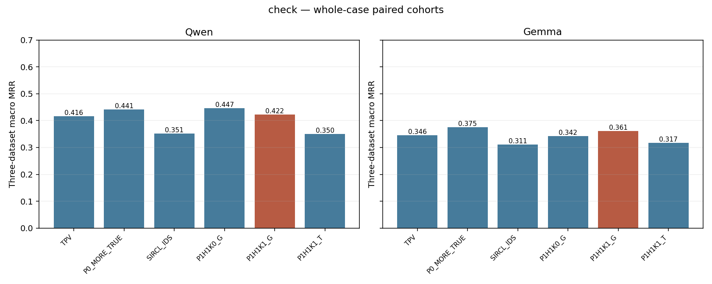
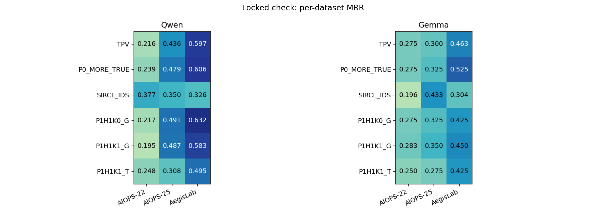
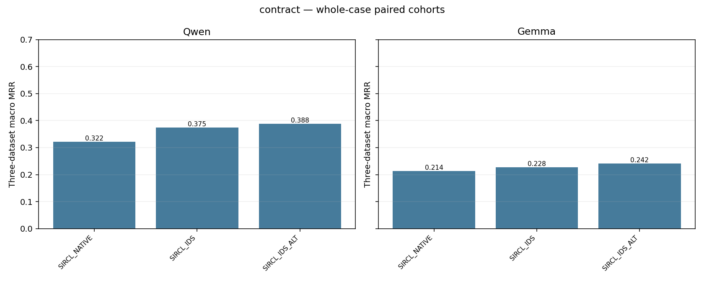
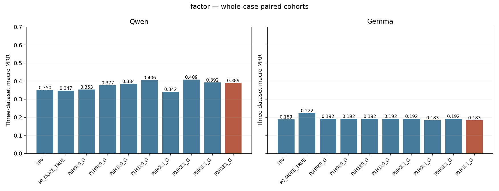
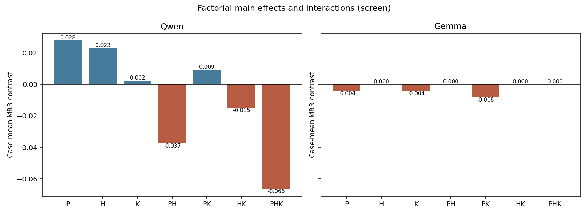
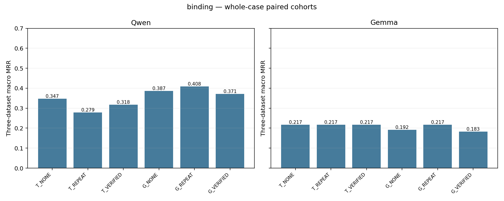
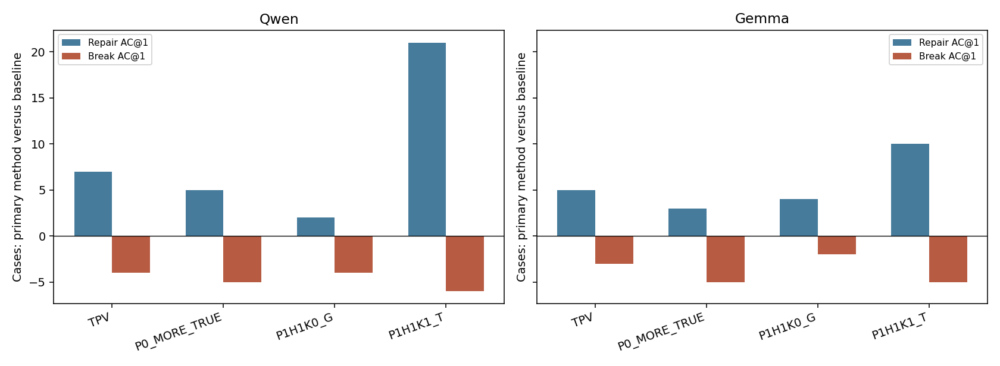
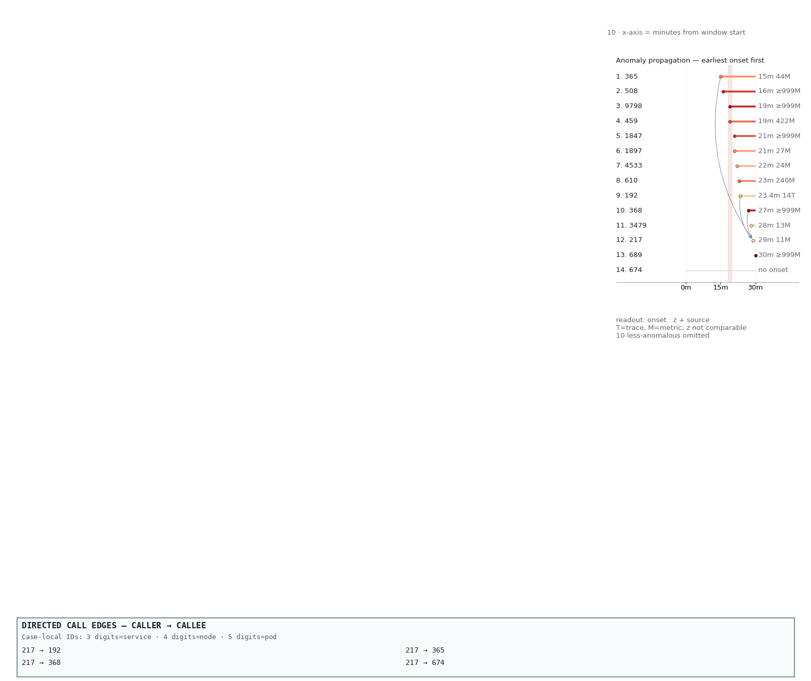
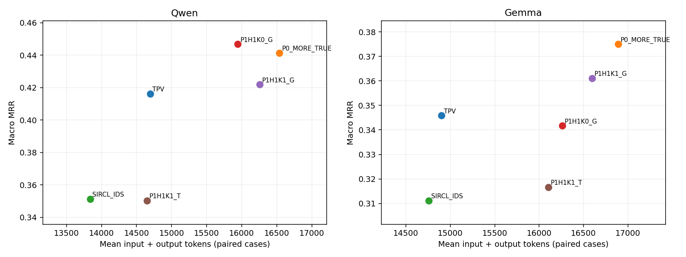

# RQ3.4：证据优先级、宿主范围与可核验关系的综合实验分析

日期：2026-09-25。对象：`RQs/RQ3_4/results/integrated_v1/` 已完成正式队列。本文不是 RQ3.1、RQ3.2 或另一项目的结果报告。

本次仅离线分析已有输入、原始回答、评分、conversation、图像和核验记录；没有新增模型调用，没有更改输入、评分器、失败状态或实验配置。报告附带可复算脚本、完整数值表和八张统计图。

## 0. 先说结论

**这一轮找到了具体的局部修复机制，但没有找到稳定超过强基线的新主方法。** 预注册主方法 `P1H1K1_G` 在 screen60 上达到推进条件，然而在后续 check120 上，相对 TPV 的三数据集等权 MRR 仅提高 Qwen **0.0056**、Gemma **0.0153**；两模型均低于简单增加原排序证据的 `P0_MORE_TRUE`。主要配对比较经 Holm 校正后均不显著。

有研究价值的发现不止“没有显著提升”：

1. **候选契约确实会损失诊断成绩。** Qwen 的 SIRCL 原生适配条件中，候选契约失败由 11/58 降到数字 ID 条件的 1/58；改善不依赖输出更长的候选列表。
2. **P/H/K 的输入干预真实发生了，Gemma 的低响应不是又一次“各 arm 输入相同”。** P 在 60/60 个 screen cases 改变追加观测集合，H 在 59/60 改变；但 Gemma 的八组合有 49/60 个 case 返回完全相同的候选排名。
3. **Qwen 的证据优先级与宿主范围有局部收益，可核验关系并非稳定的额外增益。** check 上不加 K 的 `P1H1K0_G` MRR 为 **0.4468**，高于完整主方法的 **0.4219**；但它仅比 MORE 高 **0.0055**，也没有形成统计上可靠的胜出。
4. **“关系正确”与“关系有诊断价值”是两件事。** K 可减少部分可识别的 reason 冲突，却也会把模型引向 page fault、配置量或局部 onset 等竞争线索，忽略保留下来的巨大操作延迟。
5. **选择性视觉更像在改变候选排序，而非稳定增加根因提名。** check 上 Qwen 的 G 图像条件相对同内容 G 文本条件修复 21 个 AC@1、破坏 6 个；其中 13 个修复原本已在文本答案前五。但是图像条件的 AC@5 略低。
6. **新增根因实体的遥测并不等于补到了故障机制。** Qwen 中“原骨干无根因直接关联 M/R/L、追加内容有”的 11 个 cases，完整主方法 MRR 仍为 0；Gemma 对应 12 个也为 0。
7. **node/pod 与网络类难例尚未系统解决。** 在 Qwen 的单一 node 根因子组，SIRCL_IDS 为 0.4510，完整主方法仅 0.2059；单一 pod 子组分别为 0.5333 与 0.2500。
8. **当前收益不能包装成 token 压缩。** 完整方法相对 TPV 的输入增加约 11%；相对 G 文本条件，Qwen 图像条件输出稍短，但总输入更多，Gemma 则输入和输出都增加。

最直接的研究判断是：**保留 TPV/MORE 强骨干；把“有依据的宿主—实例对照”和“数学正确但诊断相关性不足的关系提示”分开看待。** 本轮不支持将所有模块叠加后直接升级为最终方法，也不支持将 SMT 核验通过当成正确 RCA 的保证。

## 1. 实际完成了什么：范围、完整性与统计分母

### 1.1 四项登记阶段均已结束

正式队列于 **2026-09-25 16:05:20，America/Toronto** 标记 `completed`。最终服务日志中的退出发生在队列完成、无在途请求、收到停止信号之后，不属于本轮推理中途崩溃。

| 实验 | 数据范围 | 条件数 | 两模型逻辑单元 | done | 请求超时 fail |
|---|---|---:|---:|---:|---:|
| 输出／候选契约校准 | screen60 | 3 | 360 | 358 | 2 |
| P×H×K 完整因子实验 | 同一 screen60 | 10，含两个基线 | 1,200 | 1,199 | 1 |
| 图文与关系承载 | 同一 screen60 | 6 | 720 | 718 | 2 |
| 锁定方法复核 | check120 | 6 | 1,440 | 1,433 | 7 |
| 合计 | 不是 3,720 个独立病例 | — | **3,720** | **3,708** | **12** |

screen60 为 AIOPS-2022、AIOPS-2025、AegisLab 各 20 个；check120 各 40 个。本轮不包含 RE2，不是 RQ480 全量，也不是旧 360-case test。两批均属于此前暴露过的开发资料；check 是按本轮规则锁定方法后的复核，不能因名字叫 check 就变成新的独立 test。

完整请求复用后，共有 **3,460 份唯一完整模型回答**、**12 次请求超时**，即 **3,472 次新增正式调用**。3,708 个 done 中有 **248 个逻辑单元复用完整回答**，不应算作独立采样。当前调用数据库的 6,867 条还包含历史与资格测试，不能全部记到这轮正式实验成本中。

12 个超时均保留 fail，没有自动重试到成功。3,460 个完整回答的 `finish_reason` 均为 `stop`；其中 **17 个模型输出失败**为 16 个非法／重复候选类错误和 1 个 JSON 解析错误，按原评分保留，不能当基础设施缺失排除。该 JSON 错误不是输出上限截断。

### 1.2 配对分析采用同一实验、同一模型的共同 cases

某 case 任一条件基础设施失败时，在该实验×模型的全部条件比较中一起排除，不能让每个 arm 各用一个有利分母。

| 阶段 | Qwen 配对 n | Qwen：2022 / 2025 / AegisLab | Gemma 配对 n | Gemma：各数据集 |
|---|---:|---|---:|---|
| 契约 | 58 | 19 / 19 / 20 | 60 | 20 / 20 / 20 |
| 因子 | 59 | 20 / 20 / 19 | 60 | 20 / 20 / 20 |
| 图文 | 58 | 20 / 20 / 18 | 60 | 20 / 20 / 20 |
| check | 113 | 38 / 39 / 36 | 120 | 40 / 40 / 40 |

因此，复用同一回答的两个阶段仍可能显示不同聚合 MRR：**因子实验 Qwen 用 59 个 cases，图文实验用 58 个**。这不是旧回答被改写。完整排除清单在 [denominators.json](RQ3_4_Results_Analysis_2026-09-25_assets/denominators.json)，全部失败在 [failures.csv](RQ3_4_Results_Analysis_2026-09-25_assets/failures.csv)。

请求超时占新增正式调用 12/3,472＝0.35%；但 check 的 Qwen 配对排除了 7/120＝5.83% 的 cases。两个分母不能混用。这是缺失范围的披露，不重新引入“低于 5% 自动有效”的门槛，也不假设这些缺失与 case 难度无关。

### 1.3 指标与检验

- 主表的 **macro MRR**：三个数据集各自计算 MRR，再等权平均。
- **pooled**：每个 case 等权；Qwen 排除后各数据集数量不同，故 pooled 与 macro 略有差异。
- 两个 AIOPS 既分别报告，也按实际保留病例合并；不引入 RE2 拉高总体。
- 直接读取原始 per-case MRR、AC@1/3/5、AVG@3/5，不通过本次分析改变评分。
- 配对 Pratt-Wilcoxon、paired Cohen’s dz；各登记阶段内跨模型共同做 Holm。完整因子七项效应×两模型另列 secondary family。
- 按冻结重叠事件组先平均 case 差值，再做组级敏感性分析。check 为 Qwen 91 组、Gemma 96 组。组级分析也没有产生经 Holm 校正的主要显著优势。
- 不报告 CI。统计不显著表示证据不足，不表示两方法已被证明等效。

所有条件、分数据集与 AVG 指标的完整表见 [full_tables.md](RQ3_4_Results_Analysis_2026-09-25_assets/full_tables.md)，精确数值见 [paired_arm_metrics.csv](RQ3_4_Results_Analysis_2026-09-25_assets/paired_arm_metrics.csv)。

## 2. 本轮方法究竟改变了什么

| 名称 | 实际含义 |
|---|---|
| TPV | 保留强骨干：M/R/L 文本，G 使用原真实图像；候选名单在文本中 |
| MORE / P0_MORE_TRUE | 同一骨干，按原排序真实增加证据，检验“只是多给信息” |
| P | 改变追加证据优先级，利用变化幅度、持续性、冗余等公共量 |
| H | 增加宿主—实例范围对照，区分 node 与局部 pod/service 的异常范围 |
| K | 从实际可见观测编译、核验关系，并以文本追加；不是训练或额外 LLM |
| P1H1K0_G | P、H 开启，不加入 K 的消融 |
| P1H1K1_G | **预注册主方法**；不是统计后挑出的冠军 |
| P1H1K1_T | 同一选中内容和关系，G 改用文本承载 |
| SIRCL_IDS | 原工具文本路径＋数字匿名 ID／候选闭集适配 |

追加 evidence packs 最多四个，其中 scope packs 最多两个；追加原始观测受 2,048-token 预算约束，K 另有最多 512-token 预算。P0 的基础部分不被替换。**K 对照固定原始观测，但不是严格等 token 对照**；NONE、普通重述 REPEAT、可核验关系 VERIFIED 用于进一步区分作用。

本轮不是重新搜索 Dashboard 布局，不是全视觉实验。所有 `_G` 条件沿用原 G 图，M/R/L 及追加证据仍主要以文本进入；没有新 attention、训练或多阶段诊断。

### 2.1 确认干预不是“改名不改输入”

离线核对冻结 input/projection 得到：

| 干预 | 60-case 完整 screen 中的实际变化 | 解释 |
|---|---|---|
| P：H=0、K=0 下切换 | 60/60 追加观测集合不同；平均 Jaccard 0.0566 | 明显改变证据，不是缓存坍缩 |
| H：P=1、K=0 下切换 | 59/60 集合不同，1 个自然空干预 | 无合格对照时不人为制造差异 |
| K：P=1、H=1 下切换 | 60/60 原始观测集合相同，60/60 完整输入不同 | 只加入关系文本，不暗改操作数或图像 |

P 将追加内容涉及根因实体的 cases 从 21/60 提高到 33/60；进一步加 H 为 35/60。但这只是**直接关联遥测的入选**，不等于故障机制覆盖，也不等于正确诊断。

所有因子条件均保留 TPV 原始输入片段；K 的原始追加内容 hash 和图像 hash 一致；图文六条件共享同一追加观测及关系来源；两模型对应 case/arm 的公开文本与图像身份一致。检查结果见 [input_integrity_audit.csv](RQ3_4_Results_Analysis_2026-09-25_assets/input_integrity_audit.csv) 和 [intervention_effectiveness.csv](RQ3_4_Results_Analysis_2026-09-25_assets/intervention_effectiveness.csv)。

## 3. 锁定复核：哪种方法表现最好

### 3.1 核心总体表

以下为三数据集等权指标。Qwen n=113，Gemma n=120。粗体为该模型本表最高观测 MRR，不表示显著胜出或事后升级主方法。

| 模型 | 方法 | MRR | AC@1 | AC@3 | AC@5 |
|---|---|---:|---:|---:|---:|
| Qwen | TPV | 0.4163 | 0.3390 | 0.4814 | 0.5077 |
| Qwen | MORE | 0.4414 | 0.3648 | 0.5253 | 0.5340 |
| Qwen | SIRCL_IDS | 0.3513 | 0.2648 | 0.4599 | 0.4691 |
| Qwen | P1H1K0_G | **0.4468** | 0.3838 | 0.5065 | 0.5246 |
| Qwen | P1H1K1_G，主方法 | 0.4219 | 0.3651 | 0.4802 | 0.4889 |
| Qwen | P1H1K1_T | 0.3503 | 0.2335 | 0.4979 | 0.5067 |
| Gemma | TPV | 0.3458 | 0.3417 | 0.3500 | 0.3500 |
| Gemma | MORE | **0.3750** | 0.3750 | 0.3750 | 0.3750 |
| Gemma | SIRCL_IDS | 0.3111 | 0.2750 | 0.3667 | 0.3667 |
| Gemma | P1H1K0_G | 0.3417 | 0.3417 | 0.3417 | 0.3417 |
| Gemma | P1H1K1_G，主方法 | 0.3611 | 0.3583 | 0.3667 | 0.3667 |
| Gemma | P1H1K1_T | 0.3167 | 0.3167 | 0.3167 | 0.3167 |



**主要判断：** Qwen 的 P/H 消融有正向线索，但简单 MORE 已达到很接近的 MRR；Gemma 反而以 MORE 最好。完整 P/H/K 没有证明其复杂性带来了额外可靠收益。

### 3.2 各数据集与两个 AIOPS 合并

| 模型 | 方法 | AIOPS-2022 | AIOPS-2025 | AegisLab | 两 AIOPS 合并 |
|---|---|---:|---:|---:|---:|
| Qwen | TPV | 0.2158 | 0.4359 | 0.5972 | 0.3273 |
| Qwen | MORE | 0.2390 | 0.4786 | 0.6065 | 0.3604 |
| Qwen | SIRCL_IDS | **0.3772** | 0.3504 | 0.3264 | **0.3636** |
| Qwen | P1H1K0_G | 0.2171 | **0.4915** | **0.6319** | 0.3561 |
| Qwen | 主方法 G | 0.1952 | 0.4872 | 0.5833 | 0.3431 |
| Qwen | 主方法 T | 0.2478 | 0.3077 | 0.4954 | 0.2781 |
| Gemma | TPV | 0.2750 | 0.3000 | 0.4625 | 0.2875 |
| Gemma | MORE | 0.2750 | 0.3250 | **0.5250** | 0.3000 |
| Gemma | SIRCL_IDS | 0.1958 | **0.4333** | 0.3042 | 0.3146 |
| Gemma | P1H1K0_G | 0.2750 | 0.3250 | 0.4250 | 0.3000 |
| Gemma | 主方法 G | **0.2833** | 0.3500 | 0.4500 | **0.3167** |
| Gemma | 主方法 T | 0.2500 | 0.2750 | 0.4250 | 0.2625 |

Qwen 各数据集 n=38/39/36，AIOPS 合并 n=77；Gemma n=40/40/40，合并 n=80。



三个重要模式：

- **没有统一赢家。** Qwen 中 SIRCL_IDS 在 AIOPS-2022 最好，P/H 在 AIOPS-2025 与 AegisLab 较好；Gemma 的偏好又不同。应研究公开可观测特征，而不是用 dataset 名称直接写路由规则。
- **AIOPS-2022 是新组合没有解决的主要瓶颈。** 完整主方法甚至低于 TPV，不能用 AegisLab 的较高值掩盖。
- **主方法没有达到既定高 MRR 目标。** 这里还是已暴露开发复核，绝非 test≥0.65、两个 AIOPS≥0.60 的达成证据。

### 3.3 预注册比较与统计证据

以下 Δ 是 case-pooled 配对差值，因此与上方 macro 相减略有不同；Holm family 包含这六项。

| 模型 | 主方法相对 | ΔMRR | Cohen dz | 原始 p | Holm p |
|---|---|---:|---:|---:|---:|
| Qwen | TPV | +0.0063 | +0.0229 | 0.8136 | 1.0000 |
| Qwen | MORE | −0.0192 | −0.0678 | 0.3846 | 1.0000 |
| Qwen | SIRCL_IDS | +0.0678 | +0.1269 | 0.1858 | 1.0000 |
| Gemma | TPV | +0.0153 | +0.0577 | 0.5254 | 1.0000 |
| Gemma | MORE | −0.0139 | −0.0533 | 0.7281 | 1.0000 |
| Gemma | SIRCL_IDS | +0.0500 | +0.0946 | 0.3440 | 1.0000 |

即便某项点估计超过 0.05，也未同时满足显著性条件。把事件组作为单位后，Qwen 对 SIRCL 的原始 p 降至 0.0282，但 family 校正后为 0.1693，不能只挑这一原始 p 报告。

探索性补充中，Qwen 不加 K 相对 MORE 的 pooled Δ 只有 +0.0052；G 相对 T 为 +0.0723，原始 p=0.0619，八项探索比较校正后 p=0.4952。完整比较与效应量见 [registered_comparisons.csv](RQ3_4_Results_Analysis_2026-09-25_assets/registered_comparisons.csv) 及 [additional_patterns.json](RQ3_4_Results_Analysis_2026-09-25_assets/additional_patterns.json)。

## 4. 契约校准：一部分“RCA 差”确实来自输出接口

| 条件 | Qwen macro MRR | Gemma macro MRR | Qwen 候选契约失败 |
|---|---:|---:|---:|
| SIRCL_NATIVE | 0.3218 | 0.2139 | 11/58 |
| SIRCL_IDS | 0.3750 | 0.2278 | 1/58 |
| SIRCL_IDS_ALT | 0.3877 | 0.2417 | 1/58 |



Qwen 平均候选数分别为 **3.47、3.38、3.41**。因此数字 ID 适配的收益不能简单解释成“多列几个答案碰对”。原回答中的 `node-` 前缀等与匿名数字闭集不一致，会把本来可能指向合理实体的答案变成非法结果；本轮通过 prompt 契约适配研究这一损失，没有事后放宽 scorer。

但契约修正并非普适提升：Gemma 在 AegisLab 的 IDS 从 0.4750 降到 0.3500，ALT 又到 0.4833。Qwen 的 IDS−NATIVE pooled Δ=+0.0523、dz=0.1892，经本阶段 Holm 校正 p=0.9774；小样本及正负变化并存，不宜将点估计写成已证实的普遍收益。

**得到的工程事实比效果结论更明确：** 新匿名化任务应把候选类型和合法 ID 契约说清；否则“算法比较”会混入输出接口不兼容。另一方面，ALT 未使 Gemma 稳定输出多候选，模型的提名行为仍是独立问题。

## 5. P×H×K：为什么叠满三个组件并不是最好

### 5.1 全部八组合，没有只展示冠军

| 条件 | Qwen macro MRR，n=59 | Gemma macro MRR，n=60 |
|---|---:|---:|
| TPV | 0.3501 | 0.1889 |
| MORE | 0.3471 | **0.2222** |
| P0H0K0_G | 0.3529 | 0.1917 |
| P1H0K0_G | 0.3772 | 0.1917 |
| P0H1K0_G | 0.3841 | 0.1917 |
| P1H1K0_G | 0.4056 | 0.1917 |
| P0H0K1_G | 0.3415 | 0.1917 |
| P1H0K1_G | **0.4088** | 0.1833 |
| P0H1K1_G | 0.3921 | 0.1917 |
| P1H1K1_G，主方法 | 0.3893 | 0.1833 |



Qwen 主方法相对 TPV 的 macro Δ=+0.0392、相对 MORE +0.0423，因此按原开发推进规则进入 check；这是**推进资格，不是显著性结论**。check 中相对 TPV 的增益随后缩小到 +0.0056。样本差异、推进选择效应和生成波动都可能参与，不能从这两批直接认定唯一原因。

### 5.2 平均主效应与交互

主效应为在其余因素四个背景下平均的 1−0 差；二阶交互为平均差分之差；三阶为完整三重差分。不是回归编码下的半效应系数，也不是对所有 Dashboard 的普适贡献。

| 效应 | Qwen pooled MRR 对比量 | Gemma pooled MRR 对比量 |
|---|---:|---:|
| P | +0.0279 | −0.0042 |
| H | +0.0230 | 0.0000 |
| K | +0.0025 | −0.0042 |
| P×H | −0.0374 | 0.0000 |
| P×K | +0.0092 | −0.0083 |
| H×K | −0.0148 | 0.0000 |
| P×H×K | −0.0664 | 0.0000 |



Qwen P、H 的平均效应方向为正，K 接近零；负交互说明某些组件的收益不能简单相加。三阶交互原始 p=0.0247，但七项效应×两模型 Holm 后为 **0.3462**；仍只作为需复核的结构性线索。

### 5.3 Gemma 的“几乎不动”是重要模型差异

八组合中：

| 在一个 case 的八个条件之间 | Qwen，n=59 | Gemma，n=60 |
|---|---:|---:|
| 完整候选序列都相同 | 6 | 49 |
| Top-1 都相同 | 32 | 50 |
| RR 都相同 | 38 | 59 |

输入审计已排除普遍空干预。这个现象说明：**本轮追加内容对 Gemma 的排名影响很弱，或其短候选输出使 RR 对部分变化不敏感**。它不证明 Gemma 没读追加内容；reason 可以变化，而排名不变。

不能因此只保留 Qwen 结果。跨模型差异本身揭示了“给定正确观测与关系，模型是否实际改变诊断”的瓶颈。

## 6. 图文与 VERIFIED：视觉收益和关系提示必须分开

固定 P1H1 的选中观测，比较 G 的承载，以及不追加关系、普通重述、已核验关系。

| 条件 | Qwen macro MRR，n=58 | Gemma macro MRR，n=60 |
|---|---:|---:|
| T_NONE | 0.3472 | 0.2167 |
| T_REPEAT | 0.2790 | 0.2167 |
| T_VERIFIED | 0.3182 | 0.2167 |
| G_NONE | 0.3870 | 0.1917 |
| G_REPEAT | **0.4083** | 0.2167 |
| G_VERIFIED | 0.3713 | 0.1833 |



### 6.1 VERIFIED 没有稳定超过普通重述

Qwen 文本条件 VERIFIED 比 REPEAT 好，但图像条件反而更差；Gemma 文本三者相同，图像 VERIFIED 更差。Qwen G_REPEAT−T_REPEAT 的 pooled Δ=+0.1264，但原始 p=0.0630、Holm p=0.6300，尚不能按较大的点差宣布成功。

这将问题收窄为：**核验通过只保证特定断言与可见操作数自洽，不保证它比简单重述更能帮助根因排序。** 文本长度、重复、显著性与候选竞争都是可能的中介；没有本轮 attention，因此不凭想象指定唯一中介。

### 6.2 check 中，视觉的积极线索主要是排序修复

主方法 G 对同方法 T：

| 模型 | AC@1 修复 | AC@1 破坏 | 新进前五 | 跌出前五 | 原在第 2–5 名、现到第 1 名 |
|---|---:|---:|---:|---:|---:|
| Qwen，113 cases | 21 | 6 | 12 | 14 | 13 |
| Gemma，120 cases | 10 | 5 | 11 | 5 | 0 |

Qwen 的 macro AC@1 从 0.2335 到 0.3651，但 AC@5 从 0.5067 到 0.4889。因此这不是“图像发现了更多根因”的简单故事，而是**在一部分已提名根因的病例中，更有利地重新排序，同时也损失另一部分提名**。

该对照只涉及 G 的选择性视觉承载。不能将其扩大成全视觉获胜、所有时间序列应画图，或新布局具有优势。本轮没有改变 G 画法来测试这些问题。

## 7. 新方法修复了谁，又破坏了谁

### 7.1 check 的转移计数

所有行都是“完整主方法相对所列条件”，同一模型固定配对病例。

| 模型 | 对照 | AC@1 修复 / 破坏 | RR 提升 / 降低 / 不变 | 新进 / 跌出前五 |
|---|---|---|---|
| Qwen | TPV | 7 / 4 | 10 / 9 / 94 | 6 / 8 |
| Qwen | MORE | 5 / 5 | 8 / 12 / 93 | 5 / 10 |
| Qwen | P1H1K0_G | 2 / 4 | 5 / 8 / 100 | 3 / 7 |
| Gemma | TPV | 5 / 3 | 6 / 4 / 110 | 6 / 4 |
| Gemma | MORE | 3 / 5 | 4 / 5 / 111 | 4 / 5 |
| Gemma | P1H1K0_G | 4 / 2 | 5 / 2 / 113 | 5 / 2 |



Qwen 对 TPV 的 7 个 Top-1 修复中，4 个原本就在前五。新方法并未大规模解决“根因从未被提名”；且对 MORE 丢失前五的数量是新增的两倍。**只列成功故事会高估方法效用，必须同时说明删除或挤走了什么正确提名。**

### 7.2 实体层次

以下按 evaluator-private 根因层次分组，只保留单一层次子组；混合 service/pod 可接受标签另存 CSV，不强塞进某一类。

| 模型 | 根因层次 | n | TPV | MORE | SIRCL_IDS | 不加 K | 完整方法 G |
|---|---|---:|---:|---:|---:|---:|---:|
| Qwen | node | 17 | 0.1882 | 0.2059 | **0.4510** | 0.2059 | 0.2059 |
| Qwen | pod | 15 | 0.2167 | 0.2667 | **0.5333** | 0.2500 | 0.2500 |
| Qwen | service | 75 | 0.5167 | 0.5344 | 0.2967 | **0.5522** | 0.5156 |
| Gemma | node | 17 | 0.2941 | 0.2941 | 0.2941 | 0.2941 | 0.2941 |
| Gemma | pod | 17 | 0.4118 | 0.4118 | 0.2549 | 0.4118 | **0.4314** |
| Gemma | service | 79 | 0.3608 | **0.4051** | 0.3165 | 0.3544 | 0.3797 |

Qwen SIRCL 与 TPV 路径存在明显互补，但它们同时改变证据与 prompt，不能把差异单独归功于纯文本或某一个工具。H 已覆盖绝大多数病例，也没有系统消除 node/pod 瓶颈；可能缺的是**对应故障机制的观测**，而不只是多一条 hosts 边。

### 7.3 具体故障模式

下表列出 Qwen n≥4 的代表性子组，完整两模型全部 fault types 见 [check_strata.csv](RQ3_4_Results_Analysis_2026-09-25_assets/check_strata.csv)。这些小子组是描述性线索，不是独立显著发现，也不以 fault label 路由部署方法。

| 故障标签 | n | TPV | MORE | 不加 K | 完整 G | 观察 |
|---|---:|---:|---:|---:|---:|---|
| ContainerKill | 5 | 0.5000 | 0.8000 | 0.7000 | 0.8000 | restart 与局部实例范围可能有用，但 MORE 同样有效 |
| JVMMemoryStress | 8 | 0.5625 | 0.5625 | 0.7500 | 0.6250 | 新观测有积极线索；额外关系并未保留全部收益 |
| cpu stress | 4 | 0.6250 | 0.7500 | 0.7500 | 0.7500 | 更大原证据预算已达到同样成绩 |
| node disk fill | 4 | 0.2500 | 0.5000 | 0.5000 | 0.5000 | 可修复资源源头；SIRCL_IDS 仍为 0.6250 |
| k8s 容器网络资源包损坏 | 5 | 0.1000 | 0.2500 | 0.0500 | 0.0500 | 新的优先级／scope 组合没有覆盖这类关键区别；SIRCL 为 0.5333 |
| k8s 容器网络资源包重复发送 | 4 | 0.2500 | 0.3333 | 0.2500 | 0.0833 | K 存在破坏性例子 |
| pod failure | 8 | 0.1875 | 0.1250 | 0.1875 | 0.1875 | 没有总体改善 |

Gemma 的 ContainerKill 也从 TPV 0.6000 到主方法 0.8000；但 HTTPRequestDelay 四例，TPV／MORE／P/H/K 都为 0，SIRCL_IDS 为 0.5000。**资源与重启型修复，不能外推到操作延迟与网络机制。**

## 8. 证据覆盖：补到实体，不一定补到可诊断信号

本节“根因直接关联遥测”仅统计可见 M/R/L 的实体绑定，采用既有 granularity-aware 对应规则；不把候选列表、G 边端点或 hosts 关系计入。service 标签可接受其 pod 层次遥测。它仍是实体关联指标，不是故障机制正确性的判定。

按完整方法选中的追加观测分组，Qwen check 得到：

| TPV 原骨干有关联 M/R/L | 追加内容有关联 M/R/L | n | TPV MRR | 不加 K | 完整 G |
|---|---|---:|---:|---:|---:|
| 否 | 否 | 20 | 0.0375 | 0.0500 | 0.0250 |
| 否 | 是 | 11 | 0.0182 | 0.0000 | 0.0000 |
| 是 | 否 | 30 | 0.5083 | 0.4778 | 0.4361 |
| 是 | 是 | 52 | 0.5865 | 0.6699 | 0.6506 |

Gemma 对应“原无、追加有”的 12 个 cases，完整方法同样为 0；“原有、追加有”的 53 个则由 TPV 0.5377 到 0.5849。

**本轮追加机制更像增强已有证据充分的病例，而没有解决原骨干遗漏直接遥测的病例。** 这与“覆盖数提高就会提高 MRR”的直觉不同。

可能原因需分层区分：

1. 追加的是根因的其他指标，例如内存配置量而非网络时延，实体对了但机制不对。
2. 追加数值可见，却不足以区分同宿主影响、局部实例异常和调用受害者。
3. 正确证据只是少量附录，仍被骨干中显著的竞争症状压过。

前两项有后文具体输入例子；第三项是与结果相容的解释，未通过本轮 attention 或进一步受控干预单独证明。分组本身还与难度、数据集相关，因此不能将条件 MRR 当成单纯“根因证据可见”的因果效应。

## 9. 可核验关系与回答可靠性：有作用，但不是 RCA 正确性的替代

### 9.1 编译出来的关系主要是什么

check120 主方法共登记 1,850 条关系断言，平均 15.42 条/case：

| 类型 | 数量 | 占比 |
|---|---:|---:|
| 数值小于关系 `less_than` | 710 | 38.4% |
| 实体类型 `type` | 546 | 29.5% |
| 相对时间先后 `before` | 476 | 25.7% |
| 显式调用／部署等 `relation` | 118 | 6.4% |

**这主要是算术、身份与先后关系编译器，不是故障传播因果模型。** 输入中的 `A earlier than B` 不能推出 A 是全局最早，更不能推出 A 导致 B 故障。两个数相等也不自动证明对应实例健康。

case 复查还发现：不同 scope packs 可重复同一观测，进而出现重复比较；不变的 `memory_request`、readiness 等可能消耗预算，却不足以排除 CPU 或网络机制。核验保证比较操作正确，并不筛掉这些低区分度陈述。

### 9.2 既有回答核验器的计数

下面是固定规则从自然语言中**成功抽取并判为冲突的断言告警**。不是完整 hallucination 真值，不是人工标注错误率；没有抽取到的表达、单位混淆及因果跳跃可能遗漏。`unknown` 也不当作正确。

| 模型 | 条件 | 至少一项冲突告警的回答 | 抽取断言数 | 冲突断言数 | 告警但 AC@1 正确 |
|---|---|---:|---:|---:|---:|
| Qwen，n=113 | TPV | 17 | 194 | 18 | 7 |
| Qwen | 不加 K | 17 | 234 | 23 | 8 |
| Qwen | 完整 G | 11 | 222 | 15 | 6 |
| Qwen | 完整 T | 16 | 323 | 16 | 2 |
| Gemma，n=120 | TPV | 41 | 247 | 45 | 12 |
| Gemma | 不加 K | 42 | 266 | 50 | 10 |
| Gemma | 完整 G | 34 | 287 | 45 | 7 |
| Gemma | 完整 T | 31 | 277 | 37 | 6 |

相对不加 K，完整 G 的告警回答从 Qwen 15.0% 降到 9.7%、Gemma 35.0% 降到 28.3%。Qwen 的平均 reason 字符数反而从 461 到 483，Gemma 从 398 到 413，因此不是简单的“少说话就少被抓错”。但抽取覆盖与措辞变化仍可能影响计数，不能直接宣布真实错误率按同样幅度下降。

更关键的是，**Qwen 的告警减少与 MRR 降低同时发生**。说明可核验的表达改善与正确根因排名是不同目标。也不能遇到核验告警就删除答案：Qwen 完整方法 11 个告警回答中有 6 个 AC@1 正确，Gemma 34 个中有 7 个。

### 9.3 Gemma 的候选提名非常短

check120 主方法中，Gemma **118/120 只给一个候选**，平均 1.05 个；Qwen 平均 3.22 个。因此 Gemma 的 AC@3/5 与 AC@1 接近，主要反映当前输出行为，不能解释成其余四个候选已被逐一推理排除。所有完整输出均 `stop`，不是普遍截断导致。

Gemma 主方法 120 个回答均自报 high confidence，而 AC@1 仅 43/120。该字段不是校准后的正确概率，不适合作为自动接受或奖励依据。

原始计数与 reason 见 [answer_quality.csv](RQ3_4_Results_Analysis_2026-09-25_assets/answer_quality.csv)、[response_audit.csv](RQ3_4_Results_Analysis_2026-09-25_assets/response_audit.csv)。后者包含逻辑复用行，统计独立调用成本时必须去重。

## 10. 逐 case 复查：具体怎样修复，怎样失败

以下是有目的选取的机制例子，不是随机错误率抽样。读了原始输入、完整模型回答、conversation 与对应 G 图；标签只用于离线判断。原始回答和追加输入摘录、conversation 链接见 [case_source_excerpts.md](RQ3_4_Results_Analysis_2026-09-25_assets/case_source_excerpts.md)。所有排名变化仍受单次采样波动影响，公开 reason 不是模型隐藏思维的完整记录。

### 10.1 单实例重启对照帮助修复：INC-27F3CF9F35C3

- AegisLab，ContainerKill，目标 service `419`。
- Qwen TPV 提名 `84519, 713, 750`，未命中；P1H1K0_G 与完整方法均将 `419` 放第一。
- 追加观测显示 pod `77815` restart 从 0 到 1，而同 node `9129` 的 `45263`、`45946` 保持 0；原骨干还保留了 `419` 的资源变化。
- 这是“单实例变化、共宿主 peers 未出现同种变化”的具体观测，不只是给出一条 hosts 边。它提供了与宿主级广泛故障不同的解释方向。
- 然而完整回答仍将三位数字 `419` 称作 pod。**排名修复不代表解释每一处都正确。**

### 10.2 资源源头可压过更早的下游症状：INC-9D1784608F61

- AIOPS-2025，node disk fill，目标 node `1847`。
- Qwen TPV 选择更早出现异常的 service `365`；P/H 与完整方法改为 `1847`。
- 原观测包含 filesystem usage 从约 53.68 升至峰值 81.7；G 中 `365` onset 为 15 分钟，`1847` 为 21 分钟。故“最早显示异常的实体必是根因”在此并不成立。
- 追加宿主—实例上下文与原 node 资源证据共同提供另一种解释，但本轮不能精确分摊二者各自贡献。
- 完整 reason 将 `9.028e5 bytes` 写成约 “902 MB”，存在约三数量级的单位／换算错误。**答对根因与正确复述诊断量必须分别计分与审核。**



这是原输入图的原字节副本，不是本次重画。大片空白来自 TPV 屏蔽 M/R/L 图区、让其走文本的原设计；本轮不是在此偷偷换成新紧凑布局。

### 10.3 真关系也能干扰强证据：INC-6D1C8225111D

- AegisLab，HTTPRequestDelay，可接受根因 `386/860`。
- Qwen TPV 与不加 K 均把 `386` 放第一；加入 K 后改成 `318, 133, 364`，根因跌出列表。
- 同一保留的 trace 事实中，`386` POST 的 exclusive p95 从 **3,877.22 ms** 到 **3,668,419.41 ms**。不是新方法删掉了这条强延迟证据。
- 追加包还包含 `318` page faults 从约 140,432 到 151,363，以及一些 peers 的相同 memory request、readiness=1。K 进一步强调 page faults 比较与 `318` 的调用边。
- 最终 reason 转而围绕 `318` 的 page faults 和向下游传播展开。调用边和数值比较可核验，但这些真断言不足以推翻 `386` 的操作级巨大延迟。

这个例子将失败定位到**已选证据的诊断权重与解释竞争**，而不是信息池根本没有 root cause 信号。相同原始事实、只加 K 的受控差异比“从所有失败里猜模型没看见”更有信息量；但仍需重复调用才能估计这个方向的稳定性。

### 10.4 scope 可以修正 node→pod，但仍会错绑指标：INC-CCCFF766DA4B

- AIOPS-2022，pod read I/O，目标 pod `57600`。
- Gemma TPV 与不加 K 选 node `7458`；完整方法改为 `57600`。此 case 不纳入 Qwen 主表，因为 Qwen 其他条件有超时，按 whole-case 规则排除。
- 追加包展示 `57600` working set 31.62→46.47 MB、memory fail count 约 3,222,490→8,467,334；同宿主 peer 的相应观测较稳定，并明确 node/pod 归属。
- 完整 reason 却把可见 node 层磁盘信息归到 pod 身上。局部身份提示帮助了排名，不等于所有指标绑定均被解决。

### 10.5 局部先后关系被扩大成全局根因：INC-B63AC53AB86F

- AIOPS-2022，容器网络延迟，目标 pod `92244`。
- Gemma TPV／不加 K 首位正确；加入 K 后改选 service `128`。
- 编译关系包含 `224 earlier than 128`、`128 earlier than 111`。最终回答把 `128` 描述成最早的故障点，与局部关系的适用范围不符。
- 原正确回答也曾把 `92244` 叫 service。这个 case 同时显示：**实体类型错误未必改变排名，正确的部分时间关系也未必阻止错误因果叙事。**

### 10.6 五个例子共同指向的错误结构

| 层次 | 有帮助的情况 | 失败情况 |
|---|---|---|
| 观测 | 实际 restart、资源变化、操作级耗时进入上下文 | 只有同实体的配置量或不相关 metric，不能解释当前故障 |
| 对照 | 同语义 peers 对照区分单实例与广泛宿主影响 | 相等的 memory request/readiness 被扩大成全面健康 |
| 关系 | 正确 hosts 归属减少 node/pod 混淆 | 调用边被当故障传播证据，局部 before 被当全局最早 |
| 排名 | 原已提名的根因升到第一 | 真但次要的关系挤走强根因证据 |
| 解释 | 可引用来源与实体 | 正确 Top-1 仍伴随单位错误或实体类型错误 |

因此，下一步最值得改善的不是“能否再生成更多真关系”，而是**哪些关系能够区分当前候选解释、哪些关系只是容易证明却不重要**。

## 11. 成本与时间：把输入、图像、输出分开

check 配对集的 per-request 均值；input 已包含 image，不能再相加一次。

| 模型 | 方法 | 总 input tokens | 其中 image | output tokens | 记录 wall 秒 |
|---|---|---:|---:|---:|---:|
| Qwen | TPV | 14,529.6 | 2,090.8 | 163.3 | 134.2 |
| Qwen | MORE | 16,375.4 | 2,090.8 | 161.9 | 134.7 |
| Qwen | SIRCL_IDS | 13,733.9 | 0 | 103.1 | 117.7 |
| Qwen | 不加 K | 15,784.8 | 2,090.8 | 158.9 | 133.9 |
| Qwen | 完整 G | 16,091.0 | 2,090.8 | 163.7 | 134.7 |
| Qwen | 完整 T | 14,472.6 | 0 | 176.6 | 138.2 |
| Gemma | TPV | 14,789.5 | 1,085.0 | 111.5 | 39.0 |
| Gemma | MORE | 16,777.9 | 1,085.0 | 112.1 | 40.2 |
| Gemma | SIRCL_IDS | 14,688.4 | 0 | 69.3 | 28.3 |
| Gemma | 不加 K | 16,142.1 | 1,085.0 | 117.6 | 41.3 |
| Gemma | 完整 G | 16,474.0 | 1,085.0 | 121.3 | 42.8 |
| Gemma | 完整 T | 15,984.3 | 0 | 117.8 | 41.3 |



- 完整 G 相对 TPV：Qwen 输入 +10.75%，Gemma +11.39%。本轮本来就是补充证据，不是压缩器。
- 完整 G 相对完整 T：Qwen 输入 +11.18%、输出 −7.30%；Gemma 输入 +3.06%、输出 +2.91%。不能只选 Qwen 输出减少一项就宣称整个方法更省。
- 不加 K 的 Qwen 输入比 MORE 少约 3.61%，MRR 点估计略高，是值得保留的局部准确率—成本线索；但没有统计上可靠的优势。
- 两模型使用各自 tokenizer 与图像处理配方；不同模型 token 数不等于同单位硬件成本。

这里 wall/TTFT 包含并发请求下的服务等待。Qwen check 平均 TTFT 约 92–94 秒，不能据此断言单请求 prefill 本身需要如此久；更不能把并发 wall 当成纯 decode 时间。图文实验部分回答又复用了因子阶段，其记录时间来自不同队列负载，不适合直接比较为严格界面延迟实验。

去重后的 3,460 份完整正式回答记录 input **53,732,895**、output **453,194** tokens。这不含超时未完整记录的消耗，也不含旧实验与资格测试，故不是全部硬件成本。本轮未补测能耗或 attention。

## 12. 如何理解这一轮的进展

### 12.1 已经收窄的问题

**第一，不能再把低 MRR 简单归因于“证据总量不够”。** MORE 是强对照，新方法完整组合在它之下；而多个失败 case 的关键 trace 一直在输入中。

**第二，不能把更多根因实体观测当成机制覆盖。** 追加池确实扩大了关联实体覆盖，但原骨干遗漏根因直接遥测的病例并未获救。需要检查追加的是 restart/资源耗尽/操作延迟，还是仅仅同实体配置与一般活动。

**第三，自动推理的两个用途应分开。** 后验发现错误 ID、单位、关系冲突有价值；把所有可证明事实前置给 Solver 是另一项干预。后一项可能减少表达冲突，也可能降低诊断 MRR，不能由前一项的价值直接推出。

**第四，视觉的潜在线索更具体了。** 在相同补充证据与关系下，G 图对 Qwen 的优势主要体现为把既有前五候选提到第一。未来若研究视觉，应围绕候选关系绑定与排序，而不是重新用“图像更直观”解释所有结果。

**第五，跨模型不稳定不能忽略。** Qwen 会对附录和关系做较多排名调整，Gemma 经常保持一个强确信候选。模型是否利用新增证据，是独立于选择器是否选对的第二道门槛。

### 12.2 基于当前证据的最小后续建议

这些是报告建议，本次没有修改计划、启动新实验或授权扩容：

1. 继续以 TPV 和 MORE 为必须战胜的对照，不将不加 K 的最好点估计直接宣布为最终冠军。
2. 将 P/H 的修复与破坏做成同病例的机制清单，优先检查 node/pod 资源、restart 与操作延迟，不扩大通用选择器名单。
3. 若继续 K，优先针对**诊断相关性和错误外推**：何种关系能排除某一竞争解释；哪些真比较必须不被描述为健康、最早或因果。先解决 case 10.3/10.5 展示的问题，而不是增加更多关系条数。
4. 将后验核验保留为可追溯审计，不自动删除“有 reason 告警但 Top-1 正确”的答案，不把 solver satisfiable 作为 RCA 奖励。
5. 视觉后续比较维持同事实强文本，单独看 top-5→top-1 修复与错误实体绑定，同时承认额外图像 token 成本。
6. 任何改版仍需在非调参病例上锁定验证。当前 screen/check 不应不断复用后改称独立 test，也不应因效果不理想直接跳到 RL。

**本轮最有用的结论不是“SMT 无用”或“视觉无用”，而是：事实正确性、诊断相关性、模型实际利用和最终根因排序是四个不同环节。现在的系统改善了其中一些环节，却没有把这些改善稳定转化成 MRR。**

## 13. 复现、来源与文件索引

正式权威记录：

- [冻结登记 registration.json](../../RQs/RQ3_4/results/integrated_v1/registration.json)
- [完成状态 formal_queue_status.json](../../RQs/RQ3_4/results/integrated_v1/formal_queue_status.json)
- [推进规则实际判断](../../RQs/RQ3_4/results/integrated_v1/expansion_decision.json)
- [实验协议](../../RQs/RQ3_4/descriptions/RQ3_4_experiments.md)
- [四阶段原分析目录](../../RQs/RQ3_4/results/integrated_v1/analysis)

本轮正式 contract hash：`bbab76d1f70d479ebdb27cd5d274282ffb51e0350f4efab86f734a99392abdf9`。

本报告产物：

- [离线复算脚本](RQ3_4_Results_Analysis_2026-09-25_assets/analyze.py)：只读原记录，写报告 assets；不加载大型 preparation、不重建请求、不调用模型。
- [完整指标表](RQ3_4_Results_Analysis_2026-09-25_assets/full_tables.md)、[CSV](RQ3_4_Results_Analysis_2026-09-25_assets/paired_arm_metrics.csv)。
- [主要配对检验](RQ3_4_Results_Analysis_2026-09-25_assets/registered_comparisons.csv)、[因子效应](RQ3_4_Results_Analysis_2026-09-25_assets/factorial_effects.csv)、[探索性条件效应](RQ3_4_Results_Analysis_2026-09-25_assets/conditional_factor_effects_exploratory.csv)。后者的逐数据集原始 p 仅供探索，不作为显著发现。
- [repair/break 与排名转移](RQ3_4_Results_Analysis_2026-09-25_assets/check_rank_transitions.csv)、[全部分层](RQ3_4_Results_Analysis_2026-09-25_assets/check_strata.csv)。
- [选中证据明细](RQ3_4_Results_Analysis_2026-09-25_assets/selected_evidence_features.json)、[回答审核明细](RQ3_4_Results_Analysis_2026-09-25_assets/response_audit.csv)、[定性例子和原 conversation](RQ3_4_Results_Analysis_2026-09-25_assets/case_source_excerpts.md)。
- [小型权威文件身份清单](RQ3_4_Results_Analysis_2026-09-25_assets/source_manifest.json)、[运行计数摘要](RQ3_4_Results_Analysis_2026-09-25_assets/analysis_summary.json)。

复算命令，在实际项目目录运行：

```bash
cd /home/lglsj/CanvasRCA_nibi
source scripts/env_local.sh
/home/lglsj/CanvasRCA/venvs/tools/bin/python -B \
  docs/experiment_reports/RQ3_4_Results_Analysis_2026-09-25_assets/analyze.py
```

报告中的原图仅为对应模型输入 PNG 的字节副本；脚本对这些例图核对登记 hash。既有原始 artifacts 与历史 qualification 记录均保持不变。
