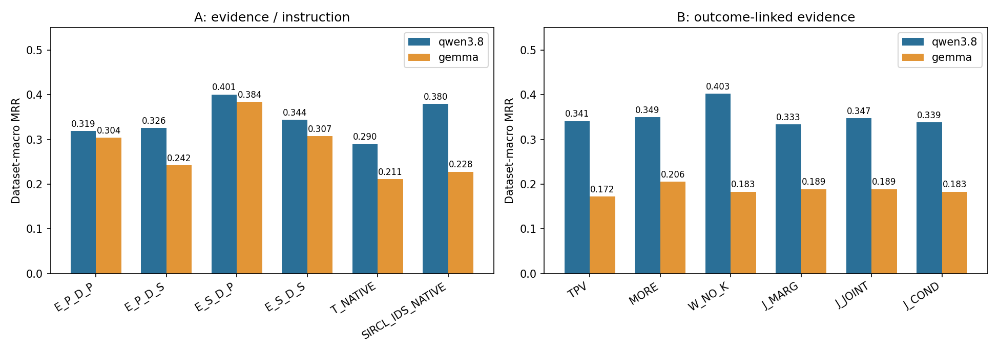
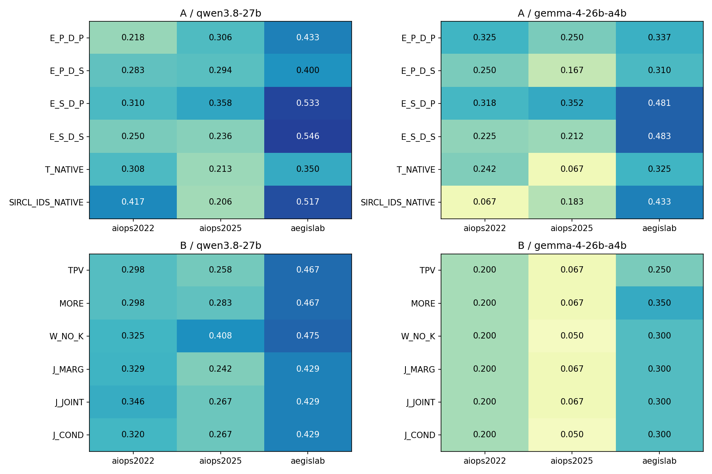
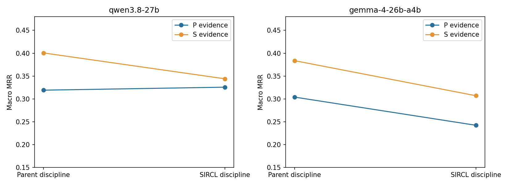
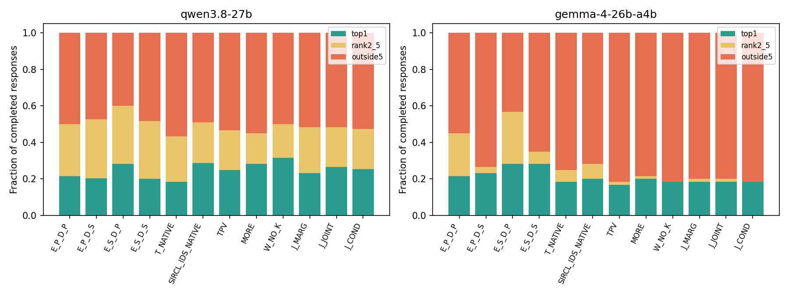
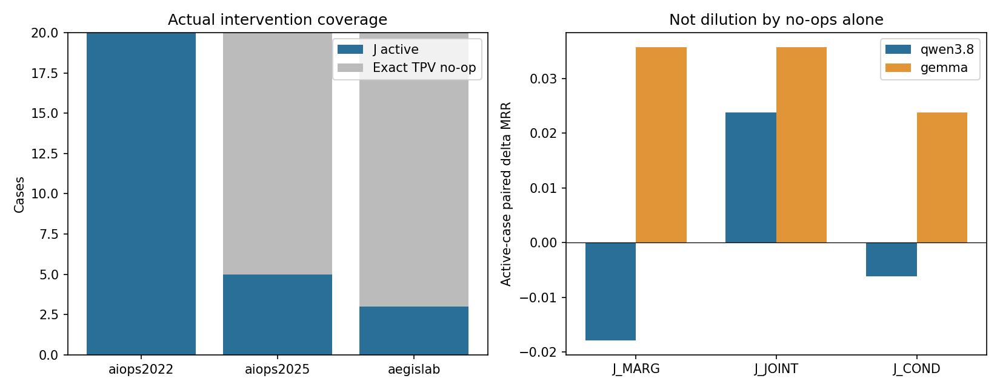
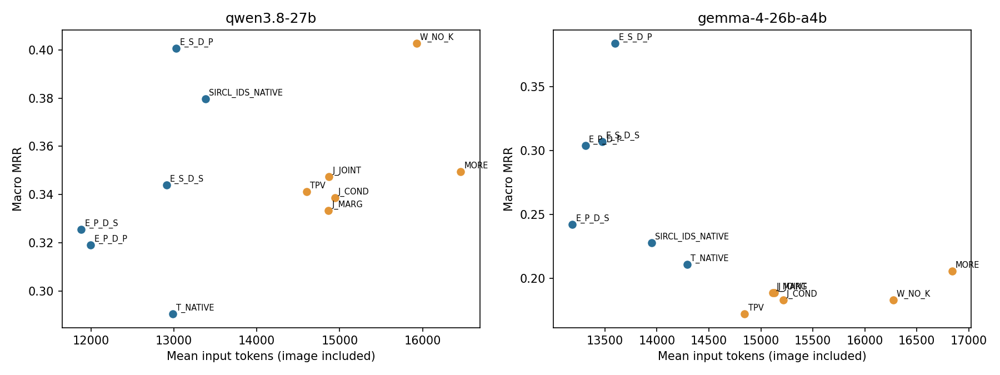

# RQ3.5 A/B screen60：证据、诊断指令与联合统计的阶段结果分析

日期：2026-09-26。状态：**A/B 的 60-case screening 已完成；这是开发阶段结果，不是整个 RQ3.5、check120 或独立 test 的最终结果。**

本次只读取已完成记录并执行离线分析，没有新增模型调用，没有修改原始输入、评分器、失败标签或旧结果，没有启动下一阶段。

## 1. 最重要的发现

1. **最有价值的新线索是“SIRCL 证据＋父版诊断指令”，不是当前的联合统计增强。** 在 A 的共同完整病例上，`E_S_D_P` 的三数据集 macro MRR 为 Qwen **0.4006**、Gemma **0.3836**，相对同接口的 `E_P_D_P` 分别增加 **0.0815、0.0797**。这个正向趋势值得复核，但本轮多重比较尚未确认其为稳定提升。
2. **证据与诊断指令应拆开继承。** SIRCL 证据在父版指令下更好，并不意味着 SIRCL 的整套指令也更好。Gemma 的 SIRCL 指令主效应是 MRR **−0.0692**，case-level Holm p=**0.0241**；按重叠事件组做敏感性分析后，同 family 校正 p=**0.0727**，因此它是较强的退化信号，但对统计单位有一定敏感性。
3. **Gemma 的主要变化之一是“少报候选”。** 同一 SIRCL 证据下，父版指令→SIRCL 指令令平均候选数从 **3.60 降至 2.30**，AC@1 均为 **28.3%**，AC@5 却从 **56.7% 降至 35.0%**。因此，MRR 退化不能简单描述成“Top-1 推理全面变差”。
4. **联合统计 J 尚未解决诊断瓶颈。** `J_COND` 对 TPV 的 macro ΔMRR 为 Qwen **−0.0024**、Gemma **+0.0111**，没有稳定优于 TPV/MORE/W_NO_K。即便只看真正加入了 J 的病例，增益也很小，不只是被无变化病例稀释。
5. **J 的覆盖面有明显结构限制。** 60 例中只有 **28 例**获得合格统计包：AIOPS-2022 为 20/20，AIOPS-2025 为 5/20，AegisLab 为 3/20。全部 **105 个已选包都是 request-family**，scope-family 在本轮候选池和输入中均为零。当前证据主要检验请求级关联，并未实证检验宿主—实例 scope 诊断的价值。
6. **局部成功并不等于解释正确，也不等于模型利用了新增统计。** 一个相同的 J 增强在 Qwen 上把正确根因从第一降到第四，却在 Gemma 上修复了 Top-1；Gemma 的理由仍主要引用原有 restart 证据。应保留这种跨模型相反响应，不将成功样例包装成联合统计机制已成立。
7. **下一步宜优先复核证据×指令的有希望组合，暂不扩张 J 的视觉化实验。** Qwen 的既有 `W_NO_K` 仍是强对照；Gemma 在共同文本接口下的改善尤其值得研究。先澄清证据统计、单位与指令共同作用，再决定是否投入 check120；本报告没有自动执行这一建议。



## 2. 本轮到底测了什么？

### 2.1 数据与推理契约

- 三个主数据集各 20 个，共 **60 个相同病例**：AIOPS-2022、AIOPS-2025、AegisLab。
- 本轮没有 RE2，没有打开 check120、test360 或新的独立事件。
- 这些是 **repeated-exposed screening** 病例；原有探索经历不会因本轮重新登记而消失。
- Qwen3.8-27B 与 Gemma-4-26B-A4B 分别运行。一个条件一次 Solver 调用；原有采样和 context-safe **8,192 output-token** 请求适配保持不变。
- 数字匿名化、候选集合、granularity-aware scorer 保持；不强迫补足五个答案，不新增 attention。
- 两模型的同 case、同 arm 公开文本及图像身份一致；tokenizer、模型模板与图像处理按各自冻结配方运行。

协议来源：[实验登记](../../RQs/RQ3_5/descriptions/RQ3_5_experiments.md)、[配置](../../RQs/RQ3_5/configs/outcome_linked_v1.json)、[原计划](../experiment_plans/CanvasRCA_RQ3_5_Research_Plan_2026-09-25.md)。

### 2.2 A：证据×诊断指令，六条件

| Arm | 证据 | 诊断指令／用途 |
|---|---|---|
| E_P_D_P | P0 | 父版指令，公共交叉接口的基线 |
| E_P_D_S | 与上行相同 P0 | SIRCL INITIAL/VERIFY/REVISE 指令 |
| E_S_D_P | SIRCL 工具证据 | 父版指令 |
| E_S_D_S | 与上行相同 SIRCL | SIRCL 指令 |
| T_NATIVE | 原 T | 原生文本桥梁 |
| SIRCL_IDS_NATIVE | 原生 SIRCL 证据 | 数字 ID 适配后的原生桥梁 |

**A 的四个交叉条件都是文本，不是新 Dashboard。** 公共接口使用无损的分区域文本块。固定证据后切换指令不会换事实；但是 P0→SIRCL 这个“证据因素”包含选取、统计投影和原生序列化差异，不是纯粹只换一个 top-k 排序。

### 2.3 B：保留 TPV，补入结果关联证据，六条件

| Arm | 变化 |
|---|---|
| TPV | M/R/L 文本＋原 G 图片 |
| MORE | 既有 P0_MORE_TRUE 扩容对照 |
| W_NO_K | 继承 RQ3.4 的 P1H1K0_G，不加入 K 约束包 |
| J_MARG | 在 TPV 上补入局部事件 X 与入口结果 Y 的边际计数 |
| J_JOINT | 同一批统计包，提供 X/Y 四格联合计数 |
| J_COND | 同一批统计包，再提供条件比例及其差值 |

J 保留整个 TPV 输入，额外文本在任务结尾前插入；最多四包、每实体最多两包、两 tokenizer 下均不超过登记预算。三个 J 条件使用相同包选择。不存在合格包时，**直接复用完整 TPV 请求与答案**，不重新随机采样制造差异。

本轮 B 没有画 J 图。G 图片在这些条件间保持，抽查的 PNG 确实只有 G 区域及具体边清单；其他区域留白是父版 TPV 承载，不是少画了本应放入图像的 M/R/L。因此，本轮 B 是联合统计**文本补充**的试验，不是“联合统计画成图是否更好”的试验。

## 3. 完成情况、失败与分析分母

### 3.1 运行与结果完整性

| 阶段 | 完成的逻辑单元 | 请求超时 | 计划单元 |
|---|---:|---:|---:|
| A / Qwen | 358 | 2 | 360 |
| A / Gemma | 360 | 0 | 360 |
| B / Qwen | 359 | 1 | 360 |
| B / Gemma | 360 | 0 | 360 |
| 合计 | **1,437** | **3** | **1,440** |

队列状态为 `completed_screen_ab`，结束于 **2026-09-26 15:11:46（America/Toronto）**，本次正式队列经过 **57.31 分钟**。GPU 释放是这一阶段正常结束，而非此处发现的新崩溃。

实际新增正式调用 **1,248 次**：1,245 个完成的独立请求＋3 次超时；另有 **192 个逻辑单元**复用已有答案，即 32 个无 J 病例×三个 J 条件×两个模型。不能把 1,437 份逻辑完成记录全部当作独立采样。

三次超时分别是：

| 实验／模型／arm | Case | 数据集 |
|---|---|---|
| A / Qwen / SIRCL_IDS_NATIVE | INC-7E5014ED408C | AIOPS-2025 |
| A / Qwen / E_P_D_S | INC-8201EB3924F3 | AIOPS-2025 |
| B / Qwen / J_COND | INC-91DCB951C96E | AIOPS-2022 |

这是 **3/1,248=0.240%** 的实际发起请求，不引入新的“5% 可接受门槛”。超时不计作模型答错，不用零分偷偷填补主比较。

1,437 份完成记录的 raw finish reason 全为 `stop`，没有输出截断；JSON 均可解析、未知候选 ID 为零。另有 **1 份 Qwen/SIRCL_IDS_NATIVE 重复候选 ID**，按原评分结果保留为模型输出失败，没有删掉或重新采样。

分析核对了 8,622 项必要文件存在性、原始 score 与汇总一致性、模型间输入一致性、固定证据下的交叉条件、B 的 TPV 保留及无操作复用。未执行昂贵的全量重建或大文件重新 hash。完整记录见 [integrity.json](RQ3_5_Screen_Analysis_2026-09-26_assets/integrity.json)。

### 3.2 为什么表中有 58、59、60？

主表统一采用**实验×模型内六个 arm 都完整的共同病例**：A/Qwen 58 例，B/Qwen 59 例，Gemma 两实验均为 60 例。这样同一张表不会每行换分母。

| 统计表 | Qwen 分布：A22 / A25 / Aegis | Gemma 分布 |
|---|---|---|
| A 六条件主表 | 20 / 18 / 20 | 20 / 20 / 20 |
| B 六条件主表 | 19 / 20 / 20 | 20 / 20 / 20 |
| A/B 跨阶段共同表 | 19 / 18 / 20 | 20 / 20 / 20 |

预注册检验按其 **family 涉及的完整条件**配对：A 四格主效应的 Qwen 为 59 例，原生校准 family 为另一个 59 例，B 主 family 为 59 例。探索性单对比较可用该对的全部完整病例。本文明确标注这些分母；它们不是互相矛盾的数据。

主表 MRR/AC 使用三个数据集等权 macro；pooled 和两个 AIOPS 合并另列。60 个病例合并重叠事件后为 **50 个事件组**，补充事件组敏感性分析，不把两个模型、多个 arm 当作新病例。

## 4. A 的完整表现：证据与指令的组合影响很大

### 4.1 三数据集 macro 指标

| Arm | Qwen MRR | AC@1 | AC@3 | AC@5 | Gemma MRR | AC@1 | AC@3 | AC@5 |
|---|---:|---:|---:|---:|---:|---:|---:|---:|
| E_P_D_P | .3191 | 22.4% | 41.5% | 49.8% | .3039 | 21.7% | 38.3% | 45.0% |
| E_P_D_S | .3256 | 20.6% | 46.5% | 53.5% | .2422 | 23.3% | 25.0% | 26.7% |
| E_S_D_P | **.4006** | 27.4% | 53.1% | 58.5% | **.3836** | 28.3% | 46.7% | 56.7% |
| E_S_D_S | .3440 | 20.4% | 49.4% | 53.0% | .3069 | 28.3% | 33.3% | 35.0% |
| T_NATIVE | .2904 | 18.7% | 44.6% | 44.6% | .2111 | 18.3% | 25.0% | 25.0% |
| SIRCL_IDS_NATIVE | .3796 | **28.7%** | 45.7% | 51.3% | .2278 | 20.0% | 28.3% | 28.3% |

`E_S_D_P` 的优势不只体现在 MRR，还体现在候选覆盖。Qwen 的原生 SIRCL 则有更高的 Top-1 点估计，说明“最好的前五集合”和“最好的第一名”仍不是同一目标。

### 4.2 分数据集与两个 AIOPS 合并

每格为 **Qwen / Gemma MRR**；各模型沿用本实验共同病例。

| Arm | AIOPS-2022 | AIOPS-2025 | AegisLab | 两 AIOPS 合并 |
|---|---:|---:|---:|---:|
| E_P_D_P | .2183 / .3250 | .3056 / .2500 | .4333 / .3367 | .2596 / .2875 |
| E_P_D_S | .2833 / .2500 | .2935 / .1667 | .4000 / .3100 | .2882 / .2083 |
| E_S_D_P | .3100 / .3183 | .3583 / .3517 | .5333 / .4808 | .3329 / .3350 |
| E_S_D_S | .2500 / .2250 | .2361 / .2125 | .5458 / .4833 | .2434 / .2188 |
| T_NATIVE | .3083 / .2417 | .2130 / .0667 | .3500 / .3250 | .2632 / .1542 |
| SIRCL_IDS_NATIVE | .4167 / .0667 | .2056 / .1833 | .5167 / .4333 | .3167 / .1250 |

发现：

- SIRCL 证据＋父版指令在 AIOPS-2025 的两模型方向一致；AegisLab 也有正向变化。
- AIOPS-2022 的 Gemma 没有同样获益：.3250→.3183。不同故障机制和层次仍需保留独立分析。
- 原生 SIRCL 在 Qwen/AIOPS-2022 是 .4167，在 Gemma 却只有 .0667。**不可把某个模型上“优化过的 prompt”直接等同于跨模型最优 prompt。**
- 公共接口本身值得测量：Gemma 的 T_NATIVE 为 .2111，而同 P0 的 E_P_D_P 为 .3039。它不是新增了一个更好的选择器；内容表达、说明组织与调用契约共同影响了行为。对应校准检验见下一节。



### 4.3 配对统计：哪里有证据，哪里仍只是趋势？

A 的主 family 含两个模型×三个效应，统一 Holm 校正。证据效应是两个指令背景下 P0→SIRCL 的平均；指令效应是两个证据背景下父版→SIRCL 的平均；交互是差中之差。下表 Δ 为配对病例平均。

| 模型 | 效应 | N | ΔMRR | paired dz | Holm p |
|---|---|---:|---:|---:|---:|
| Qwen | 证据 | 59 | +.0551 | .135 | .8780 |
| Qwen | 指令 | 59 | −.0274 | −.127 | .8780 |
| Qwen | 交互 | 59 | −.0689 | −.181 | .2671 |
| Gemma | 证据 | 60 | +.0722 | .132 | .7031 |
| Gemma | 指令 | 60 | **−.0692** | **−.356** | **.0241** |
| Gemma | 交互 | 60 | −.0150 | −.038 | .8780 |

Gemma 的指令退化达到本项目 case-level 的幅度与校正显著性标准。但是事件组等权后 Δ=−.0628，Holm p=.0727；因此将其写成**值得优先复核的负向指令效应**，而不是对所有事件分组都稳健的定论。

原生校准 family 中，Gemma `E_P_D_P−T_NATIVE` 为 +.0928，但 Holm p=.0895；`E_S_D_S−SIRCL_IDS_NATIVE` 为 +.0792，Holm p=.4365。共同接口有明显点估计收益，现有样本不足以确证。

探索性简单效应进一步说明组合价值：

| 比较 | 模型 | N | ΔMRR | Top-1 repair / break | 新进入 / 丢失前五 | Holm p（探索性 family） |
|---|---|---:|---:|---:|---:|---:|
| E_S_D_P − E_P_D_P | Qwen | 60 | +.0992 | 10 / 6 | 14 / 8 | .6802 |
| E_S_D_P − E_P_D_P | Gemma | 60 | +.0797 | 12 / 8 | 19 / 12 | 1.0000 |
| E_S_D_S − E_S_D_P | Qwen | 60 | −.0775 | 0 / 5 | 4 / 9 | .3729 |
| E_S_D_S − E_S_D_P | Gemma | 60 | −.0767 | 3 / 3 | 2 / 15 | .1211 |

这里 Qwen 的 +.0992 使用这两个 arm 完整的 60 例；主表 +.0815 使用六 arm 共同的 58 例。二者均为原数据的正确汇总，不能混用分母来放大增益。



### 4.4 候选长度揭示了一个实际行为差异

| Gemma 条件 | 平均候选数 | 只输出一个候选 | AC@1 | AC@5 |
|---|---:|---:|---:|---:|
| E_P_D_P | 3.80 | 9/60 | 21.7% | 45.0% |
| E_P_D_S | 1.60 | 47/60 | 23.3% | 26.7% |
| E_S_D_P | 3.60 | 7/60 | 28.3% | 56.7% |
| E_S_D_S | 2.30 | 30/60 | 28.3% | 35.0% |
| T_NATIVE | 1.63 | 42/60 | 18.3% | 25.0% |
| SIRCL_IDS_NATIVE | 1.72 | 41/60 | 20.0% | 28.3% |

同 SIRCL 证据下，切换指令并没有改变 Top-1 总命中数，却丢失了大量靠后命中。相同输出格式与上限下的候选截短是**模型主动输出行为**，不是8192-token 截断；所有完成请求均正常 stop。

Qwen 的行为不同：同 P0 下换指令，平均候选数约 3.84→4.47，并不是两个模型都会趋向单候选。因此未来应把“首选是否正确”和“是否保留合理备选”分别研究，而不是通过强制输出五个 ID 人为改善分数。



## 5. B 的结果：联合统计尚未带来可靠增量

### 5.1 总体与分数据集结果

| Arm | Qwen MRR | AC@1 | AC@3 | AC@5 | Gemma MRR | AC@1 | AC@3 | AC@5 |
|---|---:|---:|---:|---:|---:|---:|---:|---:|
| TPV | .3411 | 25.4% | 47.3% | 47.3% | .1722 | 16.7% | 18.3% | 18.3% |
| MORE | .3494 | 28.8% | 45.6% | 45.6% | **.2056** | 20.0% | 21.7% | 21.7% |
| W_NO_K | **.4026** | **32.1%** | 50.7% | **50.7%** | .1833 | 18.3% | 18.3% | 18.3% |
| J_MARG | .3333 | 23.8% | 45.7% | 49.1% | .1889 | 18.3% | 20.0% | 20.0% |
| J_JOINT | .3474 | 27.2% | 43.9% | 47.4% | .1889 | 18.3% | 20.0% | 20.0% |
| J_COND | .3387 | 25.4% | 43.9% | 47.4% | .1833 | 18.3% | 18.3% | 18.3% |

上表的全部精确指标及 AVG@3/5 见 [完整表格](RQ3_5_Screen_Analysis_2026-09-26_assets/full_tables.md)。

| Arm | AIOPS-2022 Q/G | AIOPS-2025 Q/G | AegisLab Q/G | 两 AIOPS 合并 Q/G |
|---|---:|---:|---:|---:|
| TPV | .2982 / .2000 | .2583 / .0667 | .4667 / .2500 | .2778 / .1333 |
| MORE | .2982 / .2000 | .2833 / .0667 | .4667 / .3500 | .2906 / .1333 |
| W_NO_K | .3246 / .2000 | .4083 / .0500 | .4750 / .3000 | .3675 / .1250 |
| J_MARG | .3289 / .2000 | .2417 / .0667 | .4292 / .3000 | .2842 / .1333 |
| J_JOINT | .3465 / .2000 | .2667 / .0667 | .4292 / .3000 | .3056 / .1333 |
| J_COND | .3202 / .2000 | .2667 / .0500 | .4292 / .3000 | .2927 / .1250 |

Qwen 的 W_NO_K 相对 TPV，在两者全部完整的60例上 ΔMRR=+.0611，Top-1 repair/break=**4/0**，新进入/丢失前五=3/1；主要点估计增益来自 AIOPS-2025（+.1500）。但探索性 family 校正 p=.3299，不应直接宣布胜出。

Gemma 在 B 中有55–60/60病例只输出一个候选。J_COND 的59/60单候选使其 MRR、AC@1、AC@3、AC@5 都等于 .1833。其低 MRR 同时涉及首选质量与备选缺失，并非仅靠增加联合统计即可改善。

### 5.2 预注册 B 主比较

| 模型 | 比较 | N | 配对 ΔMRR | paired dz | Top-1 repair / break | Holm p |
|---|---|---:|---:|---:|---:|---:|
| Qwen | J_COND − TPV | 59 | −.0028 | −.019 | 1 / 1 | 1.0000 |
| Qwen | J_COND − MORE | 59 | −.0113 | −.068 | 0 / 2 | 1.0000 |
| Qwen | J_COND − W_NO_K | 59 | −.0650 | −.243 | 1 / 5 | .6958 |
| Gemma | J_COND − TPV | 60 | +.0111 | .081 | 1 / 0 | 1.0000 |
| Gemma | J_COND − MORE | 60 | −.0222 | −.097 | 1 / 2 | 1.0000 |
| Gemma | J_COND − W_NO_K | 60 | .0000 | 不定义：差值全零 | 0 / 0 | 1.0000 |

边际→联合→条件比例的次要比较也未确认收益。Qwen 的 `J_JOINT−J_MARG` 为 +.0141，而 `J_COND−J_JOINT` 为 −.0085；Gemma 分别为0与−.0056，四项 Holm p 均为1。

这意味着目前没有证据表明“把算好的条件比例直接给模型”优于只给四格计数。也不能因不显著就宣布它们等效；变化病例太少，需要先检查干预内容是否足够有诊断针对性。

## 6. J 为什么没有明显作用？输入层面的模式分析

### 6.1 干预覆盖不是均匀的

| 数据集 | 有 J 的病例 | 选中包数 | 局部实体涉及可接受根因的病例 | 选中的根因局部包数 |
|---|---:|---:|---:|---:|
| AIOPS-2022 | 20/20 | 78 | 6 | 12 |
| AIOPS-2025 | 5/20 | 17 | 4 | 5 |
| AegisLab | 3/20 | 10 | 1 | 1 |
| 合计 | **28/60** | **105** | **11** | **18** |

“涉及根因”使用 evaluator-private 标签离线分析，没有参与选择。实体匹配也不保证该包呈现了真正故障机制。

**32 个病例没有 J，但不是旧 RQ2 的“不同工具实际一套逻辑”。** 这次无变化有逐例公开可观测性判定、有 exact-request 复用；实际有干预的28例均有模型可见文本增量。它暴露的是适用范围，而不是用工具名或 audit 字段冒充输入变化。

### 6.2 统计包的内容比方法名称狭窄

- 105 包全部是 request-family；scope 候选及选中包均为零。不能将此解释为底层数据没有任何宿主关系，只能说当前严格绑定和状态规则没有产出合格 scope 包。
- X 中 **99 包**是“局部耗时高于参考 p95”，只有 **6 包**是显式局部错误。
- Y 中 **78 包**使用入口耗时阈值替代结果状态，**27 包**使用显式入口错误。
- AIOPS-2022 有 **39/78 包**的局部实体与入口实体相同，但 span 不同；代码已排除同一个根 span 自比。这不是非法数据，却削弱了“区分两个竞争组件”的解释；局部时长还是入口总时长的组成部分，正相关本身不能确定故障源。
- 最小结果组样本量在 A22/A25/AegisLab 的中位数为 **21/130/31**，最小值 **5/6/17**。本轮不是普遍靠一两个请求估计全部关系。
- **7 包为负关联、2 包为零关联。** 负关联可以提供有用反证，不能自动删除；但零关联或偏离目标机制的包占据上下文是否值得，需要重新衡量。

当前输入更多是在问“局部时长与入口慢/错是否一起出现”，尚未充分覆盖实例退出、状态变化、宿主资源故障，以及与请求时长不同的离散机制。

### 6.3 去掉无操作病例后，结论仍然有限

下表仅作事后机制描述，不能替代全部病例主分析。

| 在真正有 J 的病例上，相对 TPV | Qwen 配对 ΔMRR | Gemma 配对 ΔMRR |
|---|---:|---:|
| J_MARG | −.0179（N=28） | +.0357（N=28） |
| J_JOINT | +.0238（N=28） | +.0357（N=28） |
| J_COND | −.0062（N=27） | +.0238（N=28） |

因此，不能只靠“以后让更多病例有 J”解释或解决当前弱结果。

在**局部实体恰好涉及根因**的小分组中，Qwen 的 J_JOINT 为 +.1288（N=11），J_COND 为 +.0583（N=10）；Gemma 则分别为0与−.0303。这个差异值得查具体信号与解释，但标签定义的事后小组不能用于部署路由，也不支持宣称“选择到根因 J 就一定有效”。



## 7. 根因层次和故障类型：新的收益仍有代价

### 7.1 固定父版指令，换证据后的根因层次 MRR

| 根因标签层次 | Qwen N | P0→SIRCL | Gemma N | P0→SIRCL |
|---|---:|---:|---:|---:|
| node | 8 | .1250→.2188 | 8 | .5417→.2500 |
| pod | 6 | .2000→.5056 | 6 | .3333→.5833 |
| pod+service | 8 | .1250→.2750 | 8 | .1667→.2438 |
| service | 36 | .4259→.4537 | 38 | .2781→.4096 |

这里 `pod+service` 表示该病例可接受标签集合包含这两种层次，不把它自动解释成两个独立故障或多根因任务。

主要信号：pod 类在两模型上均改善；Gemma 却明显牺牲了 node。统一方法不能只靠服务／操作级证据提高总均值，再忽略宿主故障退化。Qwen 的 W_NO_K 在 B 的8个node病例上从TPV的 .2500升至 .5000，而J_COND仍为 .2500；已有上下文组织仍是重要对照。

### 7.2 故障分组的小样本线索

| 故障类型 | N | Qwen：P0→SIRCL（父版指令） | Gemma：P0→SIRCL（父版指令） |
|---|---:|---:|---:|
| HTTPResponseReplaceCode | 4 | .3333→.7083 | .3000→.7500 |
| HTTPRequestReplaceMethod | 5 | .3167→.4000 | .2400→.3733 |
| HTTPResponseDelay | 3 | .3333→.3333 | .4444→.2500 |
| network corrupt | 4 | .7083→.5000 | .6250→.5625 |
| node 磁盘写IO消耗 | 3 | .3333→.1667 | .6667→.3333 |

这些计数很小，且使用源数据原始故障名，没有将类似名称随意合并。它们指向**错误／操作证据与资源证据的竞争**：操作级信号能修复部分HTTP故障，却不保证更好地识别磁盘或网络源头。完整逐故障数据（包括N=1的组）保留在 [fault_granularity.csv](RQ3_5_Screen_Analysis_2026-09-26_assets/fault_granularity.csv)。

## 8. 具体轨迹：成功和失败究竟发生在哪里？

采用冻结 hash 从 repair/break 类别选出 **12 组比较、10 个不同病例**，检查公开回答及实际输入，路径和原文见 [qualitative_samples.json](RQ3_5_Screen_Analysis_2026-09-26_assets/qualitative_samples.json)。这是一位分析者的定性核查，不是双人盲标，也不用于估计全体错误率。

### 8.1 关键根因已在原输入里，换上下文后才排第一

**INC-6A048DD0C35E，AegisLab / NetworkBandwidth，Qwen，P0→SIRCL证据。**

- P0条件将716排第一、可接受根因807排第二，RR=.5；reason强调716最早onset及CPU异常，把807的延迟视为受害症状。
- SIRCL条件将807排第一，RR=1；实际Trace行包含 `807, SELECT ConsignRecord`，reason转而强调该操作极高耗时。
- P0的输入本身已有807的Trace。因此，这不是简单的“原来完全看不到根因，新选择器才找到”。更合理的观察是：**竞争上下文、统计表达与证据优先级发生了变化。**
- 正确ID不等于正确机制：新reason归因为数据库／锁竞争，数据集故障标签为网络带宽问题。

这个病例还暴露一个需单独控制的投影因素：P0将fault p95显示为 `30006458.63 ms`，SIRCL为约 `30006.3 ms`；两侧参考期样本数也不同（110/12与109/13）。源码中SIRCL采用登记的源时长×0.001投影。**本轮证据因素混有时间／单位统计差异，不能把全部收益归给证据排序算法。** 本报告不修改冻结桥梁、不反向重写历史；后续若要比较纯选择机制，应独立登记统计／单位对齐控制。

### 8.2 根因资源证据充分，模型仍被局部实例异常吸引

**INC-9ACC29B9B330，AIOPS-2022 / node磁盘写IO，Qwen。**

- P0将node5529排第一，RR=1；SIRCL将pod76890排第一、5529第二，RR=.5。
- SIRCL输入清楚列出5529的I/O util .03→10.93、await .11→21.56；不是node证据被删光。
- 回答同时承认宿主I/O异常，却优先选择文件系统用量120.57→89.34的pod，还用“排除其他宿主”推断归属。
- 失败位置是**宿主与实例的优先级／关系推断**，不能全归于召回不足。P0的正确回答也把5529叫作service，说明类型解释与排名应分别计量。

### 8.3 操作名里的数字可能被当成依赖证据

**INC-8201EB3924F3，AIOPS-2025 / podkill，Gemma，同SIRCL证据换指令。**

- SIRCL指令只输出112，RR=0；理由将 `112.626/AddItem` 解读为626依赖112。
- 实际Trace行的实体字段是626，exl p95约59,990.5ms。公开调用关系列出626由619、640调用，其下游为472/537/628/715；这部分输入并不支持将操作名中的112直接视为调用边。
- 父版指令将626排第一，RR=1，引用同一操作耗时和调用方向。
- 这是有来源的**字段归属与关系语义混淆**案例；公开reason足以定位错误断言，但不能恢复其隐藏推理过程。

### 8.4 有强J信号、排名修复，仍缺少“确实使用J”的可观察证据

**INC-7CA062069501，AIOPS-2025 / network corrupt，Qwen。**

- TPV RR=.5，J_COND RR=1，服务477升到第一。
- 实际J包：局部477、入口993，四格计数 `[65,0,392,917]`；`P(X|Y)=1`，`P(X|非Y)=.299465`，差值+.700535。这里确实有与入口错误关联的局部信号。
- 但新reason引用的是原TRC-L/MET-Z，还把五位ID41128称作node；没有复述联合计数或条件比较。
- 因此记录为“有合格J且排名修复”，不是“已证明正确进行条件概率推理”。

### 8.5 同一补充对Qwen有害、对Gemma有益

**INC-BF08743A4A7D，AegisLab / ContainerKill，可接受服务569及对应pod91353。**

- Qwen：TPV将91353排第一，J_COND将其排第四（RR 1→.25），转而选高延迟966。
- 实际966的局部耗时包四格为 `[12,1440,49,789]`：`P(X|入口错误)=.008264`，`P(X|无入口错误)=.058473`，差值 **−.050208**。另一个局部错误包差值为0。
- 新reason仍以966的4.5倍p95延迟作为源头依据，并未解释这个负关联；它还说拓扑确认911→966，但实际G具体边清单并无此边。R的operation文字提供了这一调用的线索，因此不能简单判成虚构调用，也不能据此宣称模型正确读取了G。
- Gemma同一增强将错误pod60680改为91353（RR 0→1），但理由引用的restart信息原本已经存在；W_NO_K也能修复该例。

该例提示：**统计反证存在、模型是否读到、是否改变排序、改变是否正确，是四个不同问题。** 不能因为Gemma成功就忽略Qwen被破坏，也不能因为负关联没有带来收益就认定它不是诊断信息。

### 8.6 父版指令也会失败，不应从平均值推成绝对规则

**INC-1B936A4C6354，AIOPS-2025 / IO fault，Gemma。**

SIRCL指令抓住404的I/O相关证据并排第一；父版指令却被另一pod内存变化吸引，RR 1→0。因此，新候选不是“永远用父版指令即可”，而是需要在独立病例上确认其净修复，并保留资源／层次反例。

## 9. 正确率、解释可靠性与自动核验不是一回事

原有literal sidecar能检查一部分明确的ID类型、数量和关系陈述，但它是**部分规则抽取**，未抽取到不等于没有错误，SAT也不等于根因正确。

本轮完成记录中，候选ID均合法，却仍有类型或关系断言被反驳。在所有Top-1正确的逻辑记录中：

| 实验／模型 | Top-1正确记录 | 至少一个literal反驳告警 |
|---|---:|---:|
| A / Qwen | 82 | 24 |
| A / Gemma | 84 | 35 |
| B / Qwen | 96 | 33 |
| B / Gemma | 66 | 31 |

这是 **case×arm逻辑记录计数**，B包含复用，不能当独立样本或完整hallucination率。它仍清楚表明：合法候选、正确排名、正确实体类型、正确诊断解释必须分开审核。自动核验的现实价值首先是定位可核验错误，而不是保证MRR。

## 10. 成本、延迟及跨阶段对照

### 10.1 同一配对集合上的实际token与请求耗时

下面为完成病例均值，输入包含图像token；Qwen/Gemma分开，不能将两者token等同为硬件成本。超时没有完整usage时保留未知，未填0。

| 阶段／arm | Qwen输入／输出 | Gemma输入／输出 | Qwen/Gemma请求wall秒 |
|---|---:|---:|---:|
| A E_P_D_P | 11,998 / 302 | 13,311 / 142 | 136.0 / 32.9 |
| A E_S_D_P | 13,027 / 283 | 13,599 / 156 | 131.8 / 35.5 |
| A SIRCL_IDS_NATIVE | 13,383 / 105 | 13,948 / 66 | 99.0 / 18.5 |
| B TPV | 14,603 / 162 | 14,844 / 112 | 101.7 / 33.2 |
| B MORE | 16,460 / 161 | 16,840 / 108 | 103.4 / 32.1 |
| B W_NO_K | 15,925 / 152 | 16,272 / 114 | 102.9 / 34.1 |
| B J_COND | 14,942 / 162 | 15,216 / 111 | 104.2 / 32.1 |

发现：

- E_S_D_P 相对 E_P_D_P，Qwen输入约+8.6%、输出约−6.2%；Gemma输入约+2.2%、输出约+10.0%。这不是跨模型统一的省token方案。
- B的J_COND相对TPV输入仅增加约2.3%/2.5%，输出几乎不变；收益弱不能简单归因于输入预算增加很多。
- Qwen W_NO_K以约9.1%输入增量换取较好的MRR点估计，同时输出略短；Gemma没有对应质量优势。
- 原生SIRCL输出很短，但Gemma准确率也低；短输出不是单独的部署胜利条件。
- B的图像token均值约Qwen2077、Gemma1084；图像保持不变，因此J新增token来自文本。
- 这些wall time是当前并发和队列下的请求耗时，包含服务等待，并非隔离测得的decode或TTFT；不能据此单独推导某种证据让模型算得更快。复用记录的历史usage也不重复累加成实际新消费。



### 10.2 究竟谁是本轮最值得跟进的方法？

用A/B所有条件共同完整的病例再次比较，Qwen N=57、Gemma N=60：

| 方法 | Qwen macro MRR | Gemma macro MRR |
|---|---:|---:|
| E_S_D_P | .4025 | **.3836** |
| T_NATIVE | .2958 | .2111 |
| SIRCL_IDS_NATIVE | .3869 | .2278 |
| TPV | .3445 | .1722 |
| MORE | .3537 | .2056 |
| W_NO_K | **.4116** | .1833 |
| J_COND | .3424 | .1833 |

**不存在一个已被确认、同时在两模型上胜出的新冠军。** E_S_D_P是跨模型方向较好的待验证组合；Qwen上W_NO_K仍不可省略。跨阶段差异混有证据、prompt接口和表示，本表回答“当前系统表现”，不用于单独证明图像有效或无效。

## 11. 对下一步的具体建议

### 11.1 第一优先：复核A，不再默认扩大J

建议先保留 A 的六条件，利用已登记的check120做独立于本次screen选择的阶段复核；它仍是历史已暴露数据，不称全新test。最坏新增 **6×120×2=1,440 calls**，不是直接重开480全量。

进入复核前先处理一个研究归因问题：本轮P0/SIRCL的证据包同时有统计、单位和序列化差异。应明确要验证的是“可部署整包改善”，还是“单独选择规则改善”；若是后者，先登记有限的单位／分析窗口对齐控制，不悄悄改变现有桥梁。可先离线清点其影响范围，不急着新增调用。

如要在同批中核对部署价值，TPV与W_NO_K应作为明确追加的强对照（最多另480 calls），而不是事后拿别批MRR直接相减。此处只是建议，未修改登记或启动。

### 11.2 需要解释候选生成行为，而不是靠补足五个ID抬分

下一轮同时保留AC@1、AC@5、候选数及rank movement，特别跟踪Gemma为何在原生／TPV接口中大量单候选、在公共父版指令下能保留备选。先做现有prompt的精确差分，区分任务说明、证据布局与诊断指令，避免一次改多个维度再称为“更会推理”。

### 11.3 J先做CPU侧覆盖与反例核查，不直接进入大规模视觉实验

值得优先研究的三个具体问题：

1. scope规则为何没有合格包：是公开字段确实缺失，还是可比实例／状态绑定条件排除了数据？不能靠降低阈值或把缺失当正常来人为增加覆盖。
2. 大量局部时长—入口时长关系是否仅反映part–whole关联，而非竞争实体的区分？保留同实体及跨实体分层，研究显式错误、状态和有依据的反证。
3. 在真实反证已经给出时，模型为何仍依据最大延迟或最大z-score选源头？`INC-BF08743A4A7D`是很好的诊断案例，但不是足以训练新规则的标签模板。

若后续新证据无法在强文本条件下产生净repair，先暂停J视觉化分支；不要把“文本下没收益”直接解释成“需要画得更漂亮”。

### 11.4 保留原有视觉研究主线，但选择可检验的机制

本轮最清晰的新问题是 **来源字段绑定、宿主／实例归属、候选竞争和备选保留**。如果未来引入视觉，应对同一套事实与分组提供同样强的文本控制，检验这些错误是否真的下降。B中G没有变化、J尚未视觉化，因此当前screen并不回答视觉增量问题。

## 12. 可复现材料与本次分析修正

- [离线分析脚本](../../RQs/RQ3_5/scripts/analysis/report_screen.py)：只读取结果，输出本报告图表与CSV，无模型调用。
- [逐记录数据](RQ3_5_Screen_Analysis_2026-09-26_assets/per_record.csv)：1440个逻辑单元，保留失败与复用身份。
- [完整指标表](RQ3_5_Screen_Analysis_2026-09-26_assets/full_tables.md)：全部arm、数据集、AC/AVG、token与运行时。
- [原注册配对检验](RQ3_5_Screen_Analysis_2026-09-26_assets/registered_tests.csv)、[事件组敏感性](RQ3_5_Screen_Analysis_2026-09-26_assets/event_group_sensitivity.csv)、[探索性简单效应](RQ3_5_Screen_Analysis_2026-09-26_assets/conditional_contrasts.csv)。
- [J源可用性](RQ3_5_Screen_Analysis_2026-09-26_assets/source_profiles.json)、[选中包](RQ3_5_Screen_Analysis_2026-09-26_assets/selected_packs.csv)、[输入干预核对](RQ3_5_Screen_Analysis_2026-09-26_assets/manipulation_audit.csv)。
- [人工复核样例索引及原回答](RQ3_5_Screen_Analysis_2026-09-26_assets/qualitative_samples.json)、[literal告警](RQ3_5_Screen_Analysis_2026-09-26_assets/output_diagnostics.csv)。
- [分母](RQ3_5_Screen_Analysis_2026-09-26_assets/denominators.json)、[来源与qualification](RQ3_5_Screen_Analysis_2026-09-26_assets/provenance.json)、[完整性检查](RQ3_5_Screen_Analysis_2026-09-26_assets/integrity.json)。

分析中发现运行汇总的 `granularity` 字段装入整张entity→type映射，并非根因层次。本报告只在离线分析中按照 evaluator-private accepted labels重建根因层次；**原始打分未改变，MRR/AC不受这一汇总字段问题影响**。问题另记入RQ3.5 issues，运行代码未修改。

复现命令（本地CPU离线统计）：

```bash
cd /home/lglsj/CanvasRCA_nibi
source scripts/env_local.sh
"$CANVASRCA_PYTHON" RQs/RQ3_5/scripts/analysis/report_screen.py
```

这次阶段的实际收获是把问题从“再添加一种统计会不会更好”收敛到了三个更具体的环节：**证据整包的统计语义、诊断指令对候选集合的影响、以及模型如何处理与最显著异常相冲突的证据。** 下一步应针对这些环节复核，而非将目前不稳定的点估计直接升级为全量结论。
