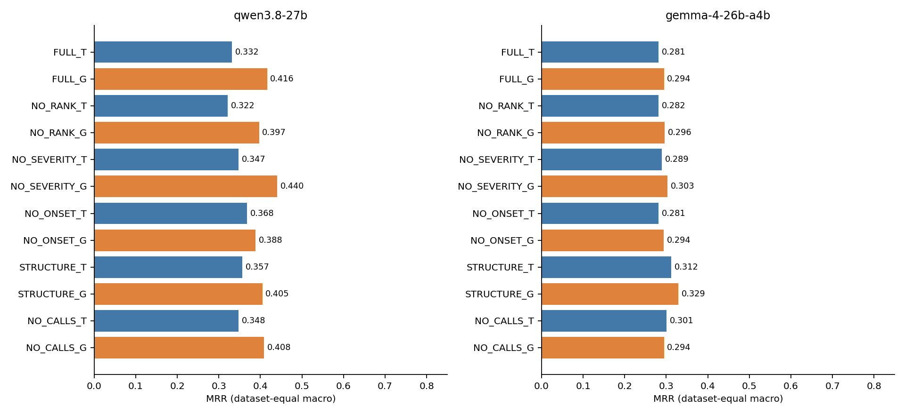
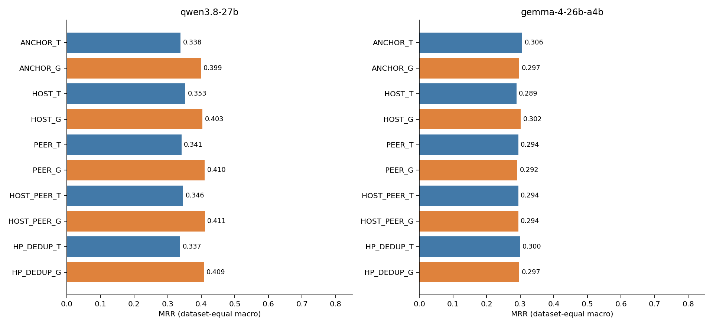
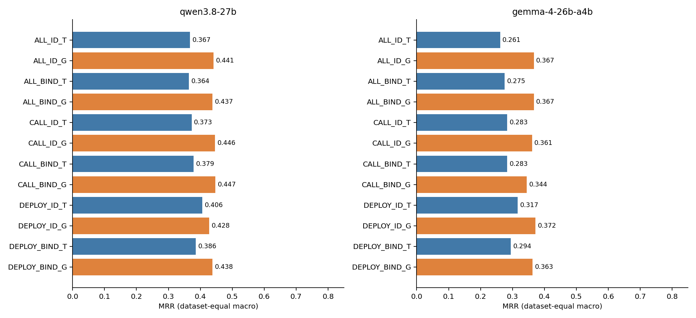
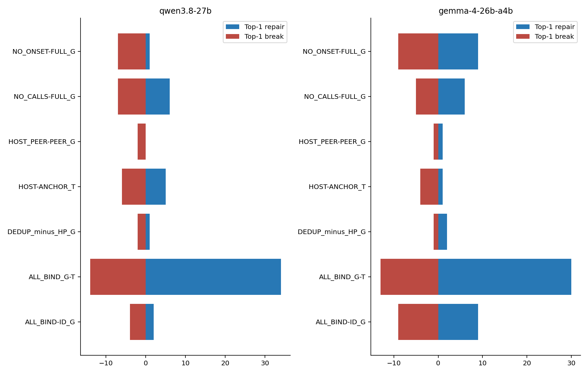
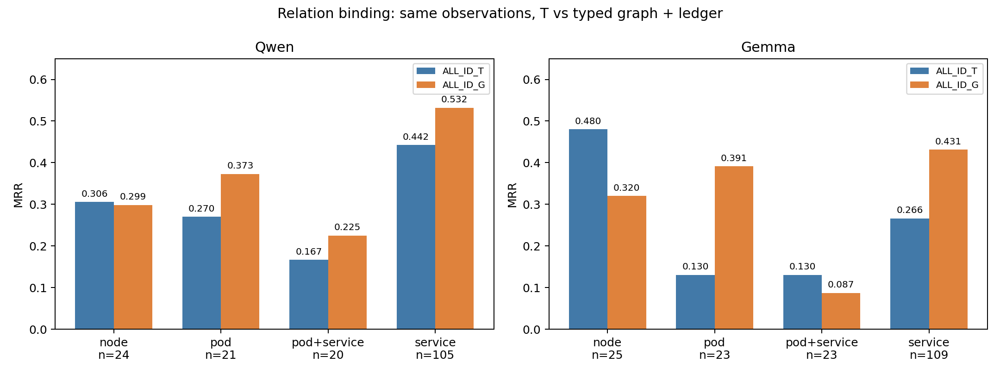
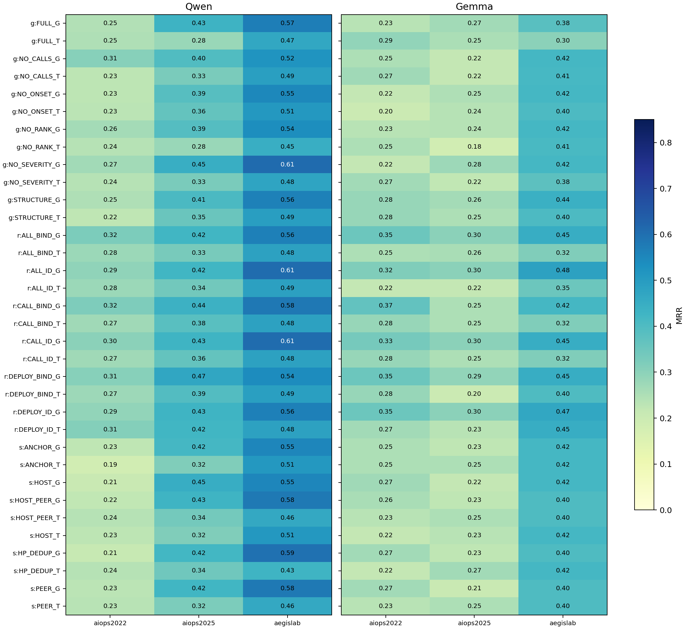
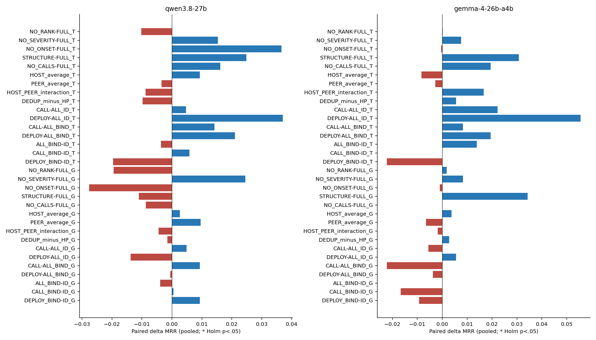
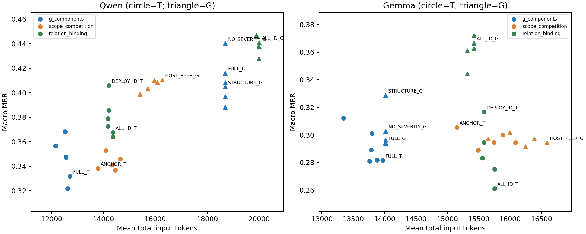

# RQ3.6：G 信息成分、宿主竞争与关系绑定——完整统计与案例分析

分析版本：2026-09-28（UTC；正式队列在多伦多时间 2026-09-27 晚间结束）。

范围：**刚完成的 `mechanisms_v2` 三个实验**，不是旧 B 的截图／文本换序实验，也不是重新汇总整个历史项目。本文只做离线分析，新增模型调用 **0**；不修改原始回答、评分、输入、模型配置或实验状态。

快速入口：[完整指标与检验表](RQ3_6_Mechanisms_Analysis_2026-09-28_assets/full_tables.md) · [逐案例输入／输出／原图](RQ3_6_Mechanisms_Analysis_2026-09-28_assets/case_review.md) · [逐逻辑单元数据](RQ3_6_Mechanisms_Analysis_2026-09-28_assets/per_record.csv)。

## 1. 核心结论

这轮实验不是“已经找到全面更强的方法”，但也不是没有信息的新负例。它把三个问题进一步分开了。

1. **G 的 rank、severity、onset 不是稳定有益的整体，也不能统一删除。** 例如 Qwen 文本移除 onset 后 macro MRR 为 **0.3317→0.3682**，图像则 **0.4160→0.3882**。两者方向相反，但差值交互尚未通过多重校正。具体案例表明，早出现／高分摘要有时帮助排除竞争者，有时掩盖 restart、CPU 饱和等更具体的信号。
2. **宿主／peer 补证据没有稳定的总体收益。** Qwen 的某些变化主要增加前五覆盖，没有增加第一名；Gemma 的小幅正负变化互相抵消。不能将“更多真实遥测”直接等同于“更好诊断”。
3. **关系绑定实验的图像条件出现本轮最值得保留的正向线索。** Gemma `ALL_ID_T→ALL_ID_G` 的 MRR 为 **0.2611→0.3667**，修复 31 例、破坏 12 例，三数据集方向均正。该比较在本实验 12 项探索性图文 family 内 Holm p=**0.0451**，但把三个实验全部 34 项图文比较合并校正后 p=**0.1279**。应优先独立复核，而不是将其改写成预注册主要假设已获证明。
4. **额外 BIND 标注不是这项图像收益的必要条件。** Gemma `ALL_ID_G` 和 `ALL_BIND_G` 均为 **0.3667**，但存在 9 修复／9 破坏；Qwen 则略降。相同均值不等于相同病例，更不等于机制已被证明。
5. **视觉收益和损失能同时出现在不同实体层次。** Gemma 上述图文比较中，service MRR 为 **0.2661→0.4312**，pod 为 **0.1304→0.3913**，node 为 **0.4800→0.3200**。这比“某数据集适合视觉”更具体；但样本少、层次与数据集相关，不能据此使用真实根因层次做部署路由。
6. **找到正确 ID 与给出正确诊断依据，是两个不同目标。** 案例中既有真实 CPU／restart 证据驱动的修复，也有答对却把 node 称作 service、把 JVM exception 解释成已证实内存耗尽、编造调用关系的回答。MRR 与依据可靠性必须分开报告。

三个预注册 primary families（B1/B2/B3）以及 B3 的绑定 secondary family，均没有 Holm p<0.05 的总体组件改善。这个结论在按比较取完整配对、超时零分敏感性分析下不变。

## 2. 实验完成情况与可信分母

### 2.1 哪些工作完成了？

正式队列于 **2026-09-27 15:48:15 UTC** 开始，**2026-09-28 00:01:18 UTC** 正常结束，约 **8 小时 13 分钟**。三个实验各顺序运行 Qwen、Gemma，全部阶段有完成记录。

| 实验 | 条件数 | 唯一 cases | 模型数 | 逻辑结果位 |
| --- | ---: | ---: | ---: | ---: |
| B1 `exp_graph_diagnostic_components` | 12 | 180 | 2 | 4,320 |
| B2 `exp_witness_scope_competition` | 10 | 180 | 2 | 3,600 |
| B3 `exp_relation_provenance_binding` | 12 | 180 | 2 | 4,320 |
| 合计 | 34 | **同一批 180** | 2 | **12,240** |

每个数据集 60 cases：AIOPS-2022、AIOPS-2025、AegisLab。登记的 screen60 与 check120 都已运行；这里没有 RE2，也没有新开 360-case test。它们是 **repeated-exposed evaluation**，不能称独立未见测试。

| 实验／模型 | 已落盘逻辑状态 | 正常模型结果 | 模型输出失败 | 请求超时 |
| --- | ---: | ---: | ---: | ---: |
| B1 Qwen | 2,160 | 2,139 | 4 | 17 |
| B1 Gemma | 2,160 | 2,159 | 1 | 0 |
| B2 Qwen | 1,800 | 1,790 | 0 | 10 |
| B2 Gemma | 1,800 | 1,800 | 0 | 0 |
| B3 Qwen | 2,160 | 2,148 | 1 | 11 |
| B3 Gemma | 2,160 | 2,160 | 0 | 0 |
| 合计 | **12,240** | **12,196** | **6** | **38** |

所有结果位有解释，无不明缺失。6 个模型失败均是候选列表内重复 ID，不是这六例输出了不存在的 ID；按冻结契约保留零分。38 个请求超时是基础设施缺失，不能当成模型不会诊断。完整回答文件数为 **12,202**，包含上述 6 个模型失败。

请求去重复用 **1,740** 个逻辑单元，因此实际新增正式请求为 **10,500**，其中 10,462 次获得响应、38 次超时。另有本轮 52 次 smoke；继承旧阶段 10,917 次后，共享累计为 **21,469**。复用的回答不是独立重复采样，不能拿来估计模型随机性。

### 2.2 主分析采用一致的配对集合

按 **实验×模型** 排除任何一个 arm 超时的整个 case，避免每个 arm 使用不同病例。模型输出失败仍保留。

| 实验／模型 | AIOPS-2022 | AIOPS-2025 | AegisLab | 共同 N | 排除 cases |
| --- | ---: | ---: | ---: | ---: | ---: |
| B1 Qwen | 53 | 53 | 57 | 163 | 17 |
| B2 Qwen | 54 | 56 | 60 | 170 | 10 |
| B3 Qwen | 57 | 54 | 59 | 170 | 10 |
| 每个实验 Gemma | 60 | 60 | 60 | 180 | 0 |

超时请求只占全部逻辑单元的 0.31%，但 B1 Qwen 的 whole-case exclusion 达到 **17/180=9.44%**；不能只用前一个小百分比掩盖实际分析样本损失。这不是新增“5% 可接受门槛”，而是明确展示缺失的影响。

主表 MRR／AC 使用三数据集**等权 macro**；配对检验以 case 为统计单位，其 ΔMRR 是 **pooled case-mean 差值**。Qwen 两者会略有不同，附录同时保留。不同实验的共同病例集不同，不能直接把 B1 与 B3 均值相减称为配对方法改进。

### 2.3 完整性与请求条件

本次一次性离线核查完成：

- 97,996 个 artifact hash 引用、78,815 个唯一文件核对；原冻结合同未变。
- 12,196 个正常输出按原 granularity-aware scorer 重新计算，和落盘分数一致；6 个重复 ID 失败检查原始 JSON 后保留原判定。
- 6,082 对跨模型公开输入一致性、6,082 对 T/G 语义 inventory 一致性核对。
- 10 个案例、21 份条件记录的公开 reason 与具体输入核对；4 张真实模型输入 PNG 已复制入案例附录并查看。

本次分析没有把大文件核验加入续跑流程。它也不意味着所有 12,240 份输入都经过逐像素人工阅读。

本批实际请求记录：Qwen/Qwen3.8-27B、google/gemma-4-26B-A4B-it；BF16、未量化，context 40,960、实际 output ceiling 8,192，使用本批冻结的 `vllm_inference_local.yaml`。有效配置 hash 为 `6c0f4a9b…`，实验合同为 `78a10ce7…`。评价依照这批原合同，不用另一个 checkout／后继配置反向改写历史状态。没有记录新的 attention 大文件。

## 3. 本轮到底操纵了什么？

| 实验 | 改变项 | 固定项 | 解释范围 |
| --- | --- | --- | --- |
| B1 G 成分 | G 的 rank、severity、onset、显式调用边 | M/R/L、候选、G 节点集合、共同投影 | G 内显式信息的条件贡献 |
| B2 宿主竞争 | 固定锚点的 host／peer 观测、字面去重 | 基础 P0、关系超集、预算；补充观测始终是文本 | 补证据及重复上下文效应，不是新 host 图布局效应 |
| B3 关系绑定 | ALL/CALL/DEPLOY × ID/BIND × T/G | 同一补充观测集合与公共任务 | 显式关系类型、局部绑定组织和承载的条件效应 |

T/G 后缀表示 **G 信息的承载方式**；M/R/L 仍在文本中。不是全遥测纯图像与全文本比较。

B1/B3 的 G 为 **typed node-link 图＋完整关系／摘要 ledger**；T 为同事实 ledger 文本。B2 的 G 继承父版 TPV 图像。三个实验内做受控比较，不能把这几种 G 当作同一张图。

B1 `STRUCTURE` 同时去掉 rank/severity/onset/source；`NO_CALLS` 只移除登记的 G 显式调用边。其他区域仍可能出现时间或调用相关信息，故不是“消除模型掌握的所有时间／依赖知识”。

B3 `BIND` 将相同绑定事实靠近关联关系，并在图中增加语义标签，是**局部组织＋冗余标签**的组合动作，不能只归因于空间距离。`CALL` 移除部署关系，`DEPLOY` 移除显式调用关系；观测不删。

资格阶段取消的 `HP_CROSSHOST` 在 180 例均不适用，发生在正式推理前，不是看成绩后删差条件。其余自然同输入保留并复用，不能伪造干预差异。

## 4. B1：G 的收益来自哪些信息？

### 4.1 全条件结果

| G 内容 | Qwen T | Qwen G | Gemma T | Gemma G |
| --- | ---: | ---: | ---: | ---: |
| FULL | 0.3317 | 0.4160 | 0.2815 | 0.2944 |
| NO_RANK | 0.3218 | 0.3969 | 0.2817 | 0.2963 |
| NO_SEVERITY | 0.3472 | **0.4402** | 0.2891 | 0.3028 |
| NO_ONSET | 0.3682 | 0.3882 | 0.2810 | 0.2935 |
| STRUCTURE | 0.3565 | 0.4048 | **0.3122** | **0.3287** |
| NO_CALLS | 0.3477 | 0.4083 | 0.3009 | 0.2944 |

加粗只是本表同模型／承载的最高观测均值，不是经过独立选择验证的冠军。



Qwen `NO_SEVERITY_G` 的 AC@1/3/5 为 **0.3646/0.5417/0.5479**；FULL_G 为 **0.3407/0.5111/0.5169**。但其 paired ΔMRR=+0.0245、原始 p=0.1441、Holm p=1，证据不足以据此全局删除 severity。

Qwen 文本去 onset，10 个原错误病例成为第一、4 个原正确病例被破坏；图像去 onset 则平均退化。该承载差值交互为 **−0.0642**，原始 p=0.0432，但 secondary family 校正后 **0.4322**。值得复查，却不是已确认交互。

Gemma 去掉全部辅助摘要后的 STRUCTURE_G 为 0.3287，高于 FULL_G 的 0.2944；paired p=0.1281、Holm=1。其方向说明“摘要有时干扰”是合理假设，不等于摘要总体无价值。

### 4.2 新发现：摘要是否与根因对齐，决定了删除它的风险

离线按接受标签检查 FULL 的 G 摘要，180 例中：

| 数据集 | 根因兼容实体出现在 G 摘要 | 根因属于最早 onset（含并列） | 根因为 rank1 |
| --- | ---: | ---: | ---: |
| AIOPS-2022 | 28/60 | 12/60 | 8/60 |
| AIOPS-2025 | 50/60 | 11/60 | 9/60 |
| AegisLab | 49/60 | 11/60 | 8/60 |
| 合计 | 127/180 | 34/180 | 25/180 |

“在 G 摘要中出现”不是根因有充分 M/R/L 证据；“最早”也不是物理故障时间。rank1 只在 **13.9%** 病例直接命中接受标签，明显不是可靠的无条件根因答案。

但模型会使用这些摘要。以下是 **事后、标签条件分层** 的删除效应：

| 比较 | 根因本来是 G rank1：N／ΔMRR | 不是 rank1：N／ΔMRR | 两组效应差异 Holm p |
| --- | --- | --- | ---: |
| Qwen：NO_ONSET_T−FULL_T | 22／−0.1629 | 141／+0.0677 | 0.0072 |
| Qwen：NO_RANK_T−FULL_T | 22／−0.1591 | 141／+0.0130 | 0.0148 |
| Gemma：NO_RANK_T−FULL_T | 25／−0.2333 | 155／+0.0378 | 0.0014 |

效应差异使用 Mann–Whitney，24 项事后摘要对齐比较共同 Holm；完整数据见 [G 对齐分层](RQ3_6_Mechanisms_Analysis_2026-09-28_assets/g_summary_alignment.csv) 和 [差异检验](RQ3_6_Mechanisms_Analysis_2026-09-28_assets/g_alignment_heterogeneity.csv)。该分层与标签、原本诊断难度及数据集相关，不能当成随机子群试验；没有逐事件组复核这组事后差异。

它支持的解释是：**摘要有助推作用；推对时删除会伤害，推错时删除可能释放其他证据的作用。** 它不能给出部署时“何时摘要是对的”的 oracle。下一步应研究公开信号如何校验摘要可靠性，而不是根据 gold 决定保留与否。

### 4.3 调用边不是无用，只是没有独立稳定的平均增益

NO_CALLS_G 相对 FULL_G：Qwen 0.4083 vs 0.4160，Gemma 完全同均值 0.2944。这里既有修复也有破坏，不能将“平均很近”解释为模型没使用关系。公开 reason 中存在真实关系引用，也存在把 caller→callee 当作故障传播方向的误用，见案例 C09。

## 5. B2：宿主和 peer 何时帮助，何时干扰？

### 5.1 全条件结果

| 补充条件 | Qwen T | Qwen G | Gemma T | Gemma G |
| --- | ---: | ---: | ---: | ---: |
| ANCHOR | 0.3382 | 0.3987 | **0.3056** | 0.2972 |
| HOST | **0.3527** | 0.4035 | 0.2889 | **0.3019** |
| PEER | 0.3410 | 0.4101 | 0.2944 | 0.2917 |
| HOST_PEER | 0.3460 | **0.4105** | 0.2944 | 0.2944 |
| HP_DEDUP | 0.3368 | 0.4085 | 0.3000 | 0.2972 |



预注册 host 平均效应为 `(HOST−ANCHOR + HOST_PEER−PEER)/2`，不是事后挑最好的 host arm。

| 效应（pooled ΔMRR） | Qwen T | Qwen G | Gemma T | Gemma G |
| --- | ---: | ---: | ---: | ---: |
| Host 平均效应 | +0.0093 | +0.0027 | −0.0083 | +0.0037 |

这四个以及 peer、host×peer、dedup 的预注册检验均未通过 Holm。单独看 Qwen HOST_T，MRR 比 ANCHOR_T 高，但 **AC@1 反而 0.2595→0.2540，AC@5 0.4461→0.4825**。它帮助部分根因进入候选，不等于帮助排在第一。

### 5.2 不是 profile 坍缩，但干预覆盖有限

180 例里 host 对比有 **115** 例真正改变输入，65 例无合格 host 补充；peer 资格检查有175例适用；dedup有110例改变。Qwen 共同集合中 HOST_T 对 ANCHOR_T 为105/170改变，dedup G 为101/170改变。

自然同输入单元的非零分数差为 **0**：它们合法复用同一响应。主分析保留所有病例，不能只挑改变输入的病例使方法看起来更有效。与旧 RQ2“换工具名却整批相同”不同，本轮真实执行了有数据支持的干预。

### 5.3 “宿主证据导致 pod→node”是局部现象，不是总体已证实定律

案例 C05 的确观察到：同一张 G 图，预测从正确 pod57600，变成错误 node7458，字面去重后又回到 pod57600。输入中同一 host CPU／load 被重复展示，方向符合“重复宿主上下文放大竞争者”的假设。

但总体 pod/node 分层差值没有通过异质性多重检验。Gemma B2 的 pod MRR 在 ANCHOR_G 和 HOST_PEER_G 都是0.3913；Qwen 的 pod MRR反而由0.2417升至0.2667，node则由0.2727降至0.2045。**一例符合机制，不能外推所有 host 补充都有该机制。**

更重要的是，C03 的 HOST 修复并没有新增真正根因 node9013 的直接遥测；加进来的是其他 host，模型转而采用原 G 摘要。C04 的 HOST 破坏也没让模型选择新增 host，而是转向原 G 的 rank1 service。补证据还会改变已有证据的使用方式，不能只用“根因证据是否新增”解释结果。

## 6. B3：调用、部署与观测绑定的作用

### 6.1 全条件结果

| 关系／绑定 | Qwen T | Qwen G | Gemma T | Gemma G |
| --- | ---: | ---: | ---: | ---: |
| ALL_ID | 0.3674 | 0.4409 | 0.2611 | 0.3667 |
| ALL_BIND | 0.3637 | 0.4375 | 0.2750 | 0.3667 |
| CALL_ID | 0.3726 | 0.4458 | 0.2833 | 0.3611 |
| CALL_BIND | 0.3788 | **0.4468** | 0.2833 | 0.3444 |
| DEPLOY_ID | **0.4057** | 0.4278 | **0.3167** | **0.3722** |
| DEPLOY_BIND | 0.3857 | 0.4381 | 0.2944 | 0.3630 |



主要关系比较与绑定次要比较均未校正显著。Gemma DEPLOY_ID_T−ALL_ID_T 原始 p=0.0184，但 Holm=0.2947；不能据此宣布“部署关系胜过调用关系”。Qwen CALL_BIND_G 的最高均值同样不是已验证的冠军。

### 6.2 最明确的正向线索：同观测、同关系下的承载变化

| 模型／集合 | ALL_ID_T MRR | ALL_ID_G MRR | ΔMRR |
| --- | ---: | ---: | ---: |
| Qwen，三数据集 macro | 0.3674 | 0.4409 | +0.0734 |
| Qwen，AIOPS-2022（57） | 0.2778 | 0.2924 | +0.0146 |
| Qwen，AIOPS-2025（54） | 0.3395 | 0.4228 | +0.0833 |
| Qwen，AegisLab（59） | 0.4850 | 0.6073 | +0.1223 |
| Qwen，两 AIOPS 合并（111） | 0.3078 | 0.3559 | +0.0480 |
| Gemma，三数据集 macro | 0.2611 | 0.3667 | +0.1056 |
| Gemma，AIOPS-2022（60） | 0.2167 | 0.3167 | +0.1000 |
| Gemma，AIOPS-2025（60） | 0.2167 | 0.3000 | +0.0833 |
| Gemma，AegisLab（60） | 0.3500 | 0.4833 | +0.1333 |
| Gemma，两 AIOPS 合并（120） | 0.2167 | 0.3083 | +0.0917 |

Gemma screen60 为0.2000→0.3167；check120 为0.2917→0.3917，两个分区方向一致。但都已经暴露，不是一次新的外部复制。

统计层次必须明确：

- **Gemma**：case Δ=+0.1056，dz=0.2206，Pratt p=0.00376；本实验图文探索 family 12项 Holm=0.04514，事件组均值敏感性 Holm=0.03837。
- **Qwen**：case Δ=+0.07382，dz=0.1730，Pratt p=0.1054，family Holm=0.4936。方向正，但未显著。
- 为防止挑选事后 family，本报告另将三个实验所有 **34 项图文对比合并**：Gemma 该项 Holm=0.1279，全部未显著。

所以这是**有一致方向及可定位案例支持、对校正范围敏感的探索性收益**。它值得比“再做一批任意 dashboard”更优先地复核；当前仍不能自动晋升为跨模型稳定改进。

### 6.3 收益是第一名修复，还是发现更多前五信号？

| ALL_ID_G−ALL_ID_T | AC@1 修复 | AC@1 破坏 | 新进入前五 | 掉出前五 |
| --- | ---: | ---: | ---: | ---: |
| Qwen（170） | 34 | 12 | 18 | 18 |
| Gemma（180） | 31 | 12 | 31 | 12 |

Qwen 的总体 AC@5 pooled 净变化为0，但 AC@1 净增22例。**它主要改善了一部分已经可提名根因的排序，同时换入换出同样多的前五病例**；不是“前五覆盖全面扩张”。

Gemma ALL_ID_T 有175/180、ALL_ID_G有178/180只输出一个候选。该对比 MRR=AC@1=AC@3=AC@5；“没有进前五”往往只是没有给后续候选，不能与 Qwen 的五候选失败机械等同。原契约允许少于五个，不事后补答案或改分数。



### 6.4 更具体的视觉适用／失效模式



| 根因层次 | Qwen N | Qwen T→G | Gemma N | Gemma T→G |
| --- | ---: | --- | ---: | --- |
| node | 24 | 0.3056→0.2986 | 25 | 0.4800→0.3200 |
| pod | 21 | 0.2698→0.3730 | 23 | 0.1304→0.3913 |
| pod+service 标签集合 | 20 | 0.1667→0.2250 | 23 | 0.1304→0.0870 |
| service | 105 | 0.4424→0.5317 | 109 | 0.2661→0.4312 |

混合层次来自 canonical 标签集合，独立列出；原生评分的 accepted labels 不变。不能将它们强行并入 pod 或 service 改变分母。

Gemma service 子集的 Δ=+0.1651，在对应 root-level 探索 family 内 Holm=0.0199。这说明**该子集观察到收益**，不是证明“service 比 node 更受益”的交互；直接 node/pod 效应差异检验没有校正显著结果。

实体层次还不足以解释全部差异。案例展示的更具体条件是：

- **可能有利：存在真实局部 CPU／状态信号，同时有高σ但实际变化很小的竞争指标；类型列、关系分组可能帮助重新选择解释。** C06 的 pod CPU 与 JVM微小变化，C10 的 node CPU 与 filesystem微小变化符合这一模式。
- **可能不利：宿主有有效变化但没有充分显式部署连接，而局部 pod 的 CPU／Trace 更显著。** C07 中根因 node在图中为孤立节点，遥测仍在文本中，G回答转向了强烈但错误的局部候选。这里没有直接测 attention，不能断言模型“只看连接多的节点”。
- **图像并未阻止关系臆造。** C09 的回答给一个没有相应调用边的实体补上了依赖故事。可见图元不能代替明确关系核验。

### 6.5 Fault-family 模式

以下为 B3 ALL_ID 的 T→G、跨数据集合并的描述性结果（每格 N≥8）：

| Fault family | Qwen N／ΔMRR | Gemma N／ΔMRR |
| --- | --- | --- |
| Application/JVM | 12／+0.2361 | 12／+0.1667 |
| Availability | 19／+0.0772 | 19／+0.2105 |
| CPU | 17／+0.0490 | 20／+0.1500 |
| Disk/I/O | 22／+0.0227 | 22／0.0000 |
| HTTP injection | 32／+0.0286 | 32／+0.0625 |
| Memory/GC | 23／+0.0797 | 26／+0.0769 |
| Network corrupt | 13／+0.1795 | 13／+0.3077 |
| Network delay | 12／+0.0556 | 12／+0.0833 |

这些 fault 子组比较未通过相应多重校正；它们是机制审阅优先级，不是可部署的 fault-type oracle。原始具体 fault type、各数据集分别的完整结果见 [strata_metrics.csv](RQ3_6_Mechanisms_Analysis_2026-09-28_assets/strata_metrics.csv)，不只保留上表较大的组。

图规模／hop／metrics数量、有效秩和缺失率进行了**数据集内部**关联分析，共1,199项可估比较，无 Holm 显著结果。当前不能建立“超过多少 hop 就切换表示”的可靠阈值；用数据集间差异替代复杂度结论会混杂。

## 7. 全数据集与统计总览



这张图保留所有条件，不只展示最高均值。AegisLab 较高，但不能遮住两个 AIOPS 的低值。比如本轮 B1 Qwen NO_SEVERITY_G：AegisLab0.6082，AIOPS-2022仅0.2657，AIOPS-2025为0.4465。项目长期 test≥0.65、两个 AIOPS各≥0.60 的目标，本轮并未达到，也未在新 test 验证。



检验口径：

- B1 primary20项；承载×消融 secondary10项。
- B2 primary16项：host平均、peer平均、两者交互、dedup，跨承载和模型。
- B3 primary16项；BIND−ID secondary12项。
- 额外图文比较、条件效应、标签对齐、fault、层次和复杂度分析均标为探索，不冒充原计划 primary。
- 双侧 Pratt-Wilcoxon，差值四舍五入至12位抑制浮点伪差异；dz为配对差值均值／标准差；ties保留。各 family 的两模型一起校正。
- 事件组敏感性先在组内平均 case Δ，再进行同 family 校正；没有将组内病例或复用调用当作独立复制。
- 不报告 confidence intervals。未显著不是统计等价或非劣证明。

超时敏感性分别采用：①每个具体对比仅要求其所需 arms 完整；②所有180例、超时置零的端到端保守描述。原主要组件结论不变。①不是主分析，②不是把基础设施失败重分类为模型失败。全部原始p、Holm、dz、分母和分组结果见[配对检验](RQ3_6_Mechanisms_Analysis_2026-09-28_assets/paired_tests.csv)、[敏感性](RQ3_6_Mechanisms_Analysis_2026-09-28_assets/sensitivity.csv)。

## 8. 具体案例：为什么成功，为什么失败？

下列是目的性机制审阅，不用10例推算全体幻觉率。完整21份回答、输入链接及4张原图在[案例附录](RQ3_6_Mechanisms_Analysis_2026-09-28_assets/case_review.md)。

### C01/C02：onset 同时可能是线索与干扰

**C01，AegisLab，`INC-A5BE8AEFA87F`，Qwen。** FULL_T 将746排第一，理由强调+4m、severity999；去掉G onset后，接受根因585的pod33542排第一，RR由1/3到1。输入中确有restart 0→1、585的RSS约762.6M→273.4M。成功不是新增了根因数据，而是改变了已存在状态信号与摘要的竞争。新reason进一步声称数据库不稳定，其因果链并未由这些数值充分证明。

**C02，AIOPS-2022，`INC-E518E9800304`，Qwen。** FULL_T正确选488，去onset后改选9852，488降第三。node磁盘／inode与pod异常在两个条件都存在。删除摘要既能减少误导，也能失去对根因的时间支持；这是全局删onset方案必须面对的反例。

### C03/C04：补充证据的作用不等于新增根因证据

**C03，AIOPS-2025，`INC-5EADA73E94EC`，Qwen。** HOST_T把node9013从前五外提至第一，但新增host数据属于1447／7497。新reason使用原有G的9013 rank1／onset，还错称它为service。这里发生了正确重排，却不能归功于“新增9013遥测”。

**C04，AIOPS-2022，`INC-D3EAA310B962`，Qwen。** 加host后437由第一变为前五外。新增8005 UDP中位数21.57→47.28重复三次，另有5026 CPU10.21→11.38；新回答没有选这两个host，而是改选原G rank1的717。更符合上下文竞争／证据使用改变，而非简单的host实体吸引。

### C05：同一张图，宿主重复与范围混淆

**AIOPS-2022，`INC-CCCFF766DA4B`，Gemma。**

| 条件 | 预测 | RR | 公开 reason 的主要方向 |
| --- | --- | ---: | --- |
| PEER_G | pod57600 | 1 | 主要讲node7458故障，ID与解释不完全一致 |
| HOST_PEER_G | node7458 | 0 | 将宿主磁盘异常当源头 |
| HP_DEDUP_G | pod57600 | 1 | 将pod文件系统增加作为node压力的来源 |

三张输入PNG **hash完全相同**。HOST_PEER重复两次7458 CPU10.6→16.16、两次4668 load1.24→1.485；DEDUP只去字面重复，保留唯一事实。此例说明“图像没变，文字重复也能改变最终诊断”，但没有独立重复采样证明每次都会这样。

### C06/C07：视觉修复与视觉破坏的成对机制

**C06，AIOPS-2022，`INC-7D95F2013B97`，Gemma。** T错误选997，G正确选pod31316。共同Metrics文本中，31316 CPU baseline0.1225、peak22.53；997的Tenured Gen约62.5M→62.7M，实际变化小，但因背景波动小得到约1.5k的deviation。T将它描述为严重资源耗尽，还把31316称作node。G图明确把31316放在pod列、6825放node列，回答转向了真实强CPU信号。这个案例支持类型／关系组织的用途，但G回答的精确时间、throttling措辞仍要逐项核验。


**C07，AIOPS-2022，`INC-97ECDC5FFBD8`，Gemma。** T正确选node6063，G错误选pod59591。根因内存中位数79.86→58.25在两份输入都存在，图上也保留6063，只是没有显式连接；59591 CPU327σ和exclusive latency也真实存在。G选择了强烈局部异常并宣称并非下游症状，却没有充分证据。这不是“根因没有画出来”的简单信息缺失，而是多个真实异常的归属判断失败。

### C08/C09/C10：正确排名和解释可靠性分离

- **C08 `INC-EF768AE9D329`，Gemma，AIOPS-2025**：G选97990，按service兼容规则命中301/adservice；确有工作集尖峰，但fault是JVM exception。reason称memory exhaustion，属于将观测升级为机制断言，不能因为ID对而视为完整解释对。
- **C09 `INC-D02CFDF1A4AE`，Gemma，AIOPS-2025**：T选接受标签211，G误选791。791确有很大的rrt_max；但图和ledger中没有211→791，G却声称791是其依赖及公共瓶颈。T的理由也有caller方向混淆，说明解释质量不能简单按正确／错误二分。
- **C10 `INC-6E6E1B20F2D5`，Gemma，AIOPS-2025**：T选802，G正确选node8820。8820的CPU baseline18.47、peak96.45；802的filesystem实际变化极小却有巨大σ。G找到了更合理的CPU信号，但reason仍将8820称为service。

这些案例共同指向三个不同瓶颈：**异常显著性不等于机制相关性；实体类型正确不等于来源判断正确；ID命中不等于关系／因果解释可靠。** 本轮没有读取隐藏思维链，也没有把公开reason当作完整内部推理轨迹。

## 9. 成本与运行效率



同一模型内看 B3 ALL_ID 的实际平均 token：

| 模型／条件 | 输入总数 | 其中图像 | 输出 | 输入变化 |
| --- | ---: | ---: | ---: | ---: |
| Qwen T | 14,367 | 0 | 173 | — |
| Qwen G | 19,994 | 6,914 | 149 | **+39.2%** |
| Gemma T | 15,753 | 0 | 118 | — |
| Gemma G | 15,422 | 1,066 | 115 | **−2.1%** |

这轮视觉对 Qwen **不省输入**，不能继续沿用“图像一定压缩token”的故事。Gemma输入小幅降低，输出也仅小幅变化；两个模型的视觉处理配方不同，不能把6914与1066当相同有效分辨率或相同硬件成本。

B1/B3新图采用共同的最坏情况画布，公开节点／ledger完整，源图样例2304×3072；它不是为每个arm单独优化的紧凑图。白空间、长ledger和模型resize可能影响读取，但本轮没有隔离它们，不能从本结果反推最佳分辨率。

正式新请求中有使用量记录的10,462个响应，共约 **161,722,402 input tokens、1,419,486 output tokens**。这些是实际usage之和，不包括38次超时的未知服务端消耗，也不重复加1740个复用单元；不是美元费用或GPU FLOPs。

当前并发配置下，B3 ALL_ID_T/G平均记录wall time：Qwen为136.93／134.08秒；Gemma为20.47／20.18秒。该计时包含实际请求链路及并发排队，不能将跨阶段运行速度差解释成表示本身节省多少生产MTTR。总队列8h13m包含模型切换、CPU请求构造和写盘，并不是单case串行耗时相加。

完整输入／文本／图像／输出、TTFT、decode及wall time按条件保留于[成本表](RQ3_6_Mechanisms_Analysis_2026-09-28_assets/full_tables.md)。没有为了本报告新采集attention或新增复杂运维指标。

## 10. 对下一步研究的直接含义

### 10.1 三个原问题现在的回答

**问题一：G收益来自调用关系，还是异常排名、严重度、时间？**

目前不能分配成一个稳定百分比。明确的新证据是：摘要会影响竞争排序，其帮助方向随摘要与根因的对齐而改变；调用边单独删除未显示稳定平均损失。不是“图结构已证明是唯一来源”，也不是“图只是异常榜单”。

**问题二：补证据何时帮助，何时因host过多误判？**

修复可能来自前五提名、上下文重排，也可能来自直接机制信息。host重复诱发pod/node竞争有具体正反配对案例，但平均host剂量效应未证实。下一轮应针对信息资格和重复，而不是继续笼统增加host数量。

**问题三：调用、部署、观测绑定分别怎样影响图文？**

本次有真正同观测的关系类型比较，但primary尚无显著效应；语义BIND未稳定优于ID。更值得保留的是typed graph＋ledger相对同事实文本的条件性收益，尤其Gemma service／pod病例；并同时保留node退化证据。

### 10.2 优先做什么，暂不做什么？

本报告不启动任何后续任务，以下只作为证据支持的优先级建议：

1. **优先复核 B3 的 ALL_ID 图文收益，而不是把34个条件全部扩大。** 固定已有输入与表示，在预先登记的新病例／重复策略下验证，避免事后挑最高均值。明确测试service/pod收益能否保留、node损失是否重现。
2. **将“高σ、早onset”的可靠性作为证据校验问题。** C06/C10显示极小背景方差可放大微小变化；C01/C02显示时间有时有效、有时误导。候选方向是公开的绝对／相对变化、持续性、状态事件、资源语义交叉支持，而不是简单删除σ／onset，更不能用gold选择。
3. **把重复证据和独立证据区别开。** C05说明一个host同一观测出现多次可改变范围判断；全局dedup未显著，因此先用已落盘案例核对“独立支持数量”而非再无差别扩充遥测。
4. **保护图中弱连接／孤立基础设施的诊断地位。** 不是给真实根因加高亮，而是对所有合法node采用同一证据关联规则，避免图中心性在有强局部症状时取代观测支持。需要与同样组织的强文本条件比较。
5. **把可验证的关系错误与MRR分别处理。** C09的不存在调用边、C10的类型错误可用确定性检查直接发现；但修复reason或过滤错误边不保证MRR提高，不能先宣布它解决了RCA。

当前不值得据此直接全局推广NO_ONSET、HOST_PEER、BIND或恢复RL。主方法仍需有可复制的MRR增益；本轮给出了更具体的失败机制及一个值得复制的视觉正向分支，而不是一个已经完成的高准确率系统。

## 11. 可复现产物与审计索引

原始来源：[RQ3.6注册协议](../../RQs/RQ3_6/descriptions/RQ3_6_experiments.md)、[正式结果目录](../../RQs/RQ3_6/results/mechanisms_v2/)。本报告的所有标签与样本选择信息只允许离线分析使用。

| 产物 | 用途 |
| --- | --- |
| [full_tables.md](RQ3_6_Mechanisms_Analysis_2026-09-28_assets/full_tables.md) | 全68个模型×arm的MRR、AC@1/3/5、AVG@3/5、各数据集及成本 |
| [per_record.csv](RQ3_6_Mechanisms_Analysis_2026-09-28_assets/per_record.csv) | 12,240行原始路径、状态、分数、reason与成本 |
| [paired_tests.csv](RQ3_6_Mechanisms_Analysis_2026-09-28_assets/paired_tests.csv) | ΔMRR、Pratt、dz、Holm、事件组敏感性 |
| [subgroup_tests.csv](RQ3_6_Mechanisms_Analysis_2026-09-28_assets/subgroup_tests.csv) | 分数据集、screen/check、层次、fault family |
| [strata_metrics.csv](RQ3_6_Mechanisms_Analysis_2026-09-28_assets/strata_metrics.csv) | 包括原始fault type在内的各条件分层指标 |
| [pattern_metrics.csv](RQ3_6_Mechanisms_Analysis_2026-09-28_assets/pattern_metrics.csv) | 层次／模式描述，候选数与前五覆盖 |
| [paired_case_deltas.csv](RQ3_6_Mechanisms_Analysis_2026-09-28_assets/paired_case_deltas.csv) | 每个实际配对的修复、破坏、rank变化 |
| [failures.csv](RQ3_6_Mechanisms_Analysis_2026-09-28_assets/failures.csv) | 模型失败与超时分开 |
| [case_review.md](RQ3_6_Mechanisms_Analysis_2026-09-28_assets/case_review.md) | 10例21份输入输出、4张原图及逐项审阅 |
| [source_manifest.csv](RQ3_6_Mechanisms_Analysis_2026-09-28_assets/source_manifest.csv) | 本次读取的文件及hash |
| [integrity.json](RQ3_6_Mechanisms_Analysis_2026-09-28_assets/integrity.json) | 分数／输入／文件核对计数 |
| [accounting.json](RQ3_6_Mechanisms_Analysis_2026-09-28_assets/accounting.json) | 新调用、复用与队列完成状态 |

离线复算入口如下；会重新做本报告的完整文件审计，不是恢复实验所需步骤：

```bash
cd /home/lglsj/CanvasRCA_nibi
source scripts/env_local.sh
"$CANVASRCA_PYTHON" docs/experiment_reports/RQ3_6_Mechanisms_Analysis_2026-09-28_assets/analyze.py
"$CANVASRCA_PYTHON" docs/experiment_reports/RQ3_6_Mechanisms_Analysis_2026-09-28_assets/explore.py
"$CANVASRCA_PYTHON" docs/experiment_reports/RQ3_6_Mechanisms_Analysis_2026-09-28_assets/finalize.py
```

本报告保留全部正向、负向、无变化与失败结果。实际完成的是：**对34个条件的完整离线统计、输入操纵审计与可定位案例分析**；没有用事后子组或成功案例集合替代单方法评估，也没有新开启实验。
