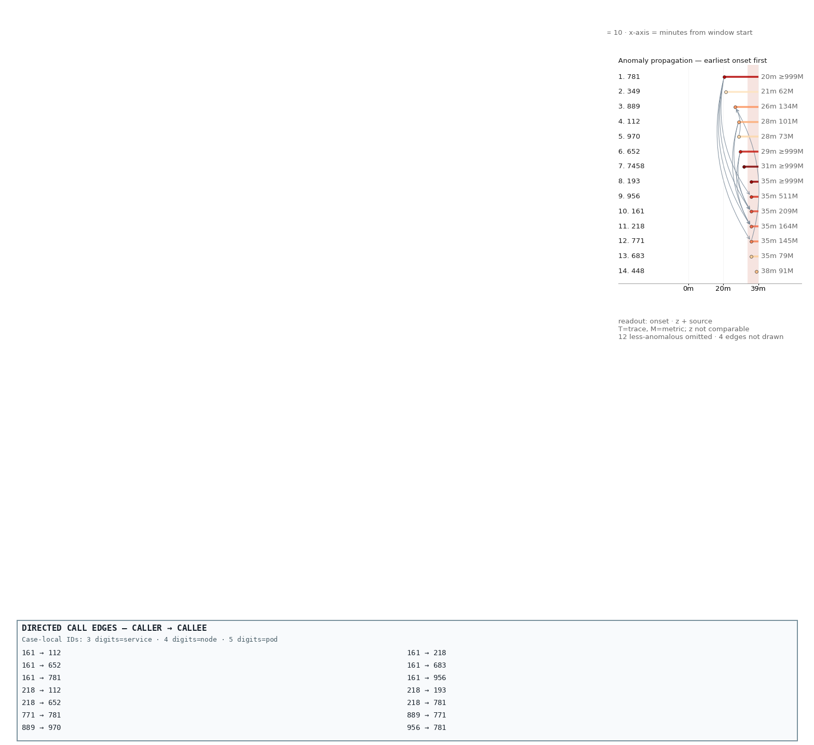
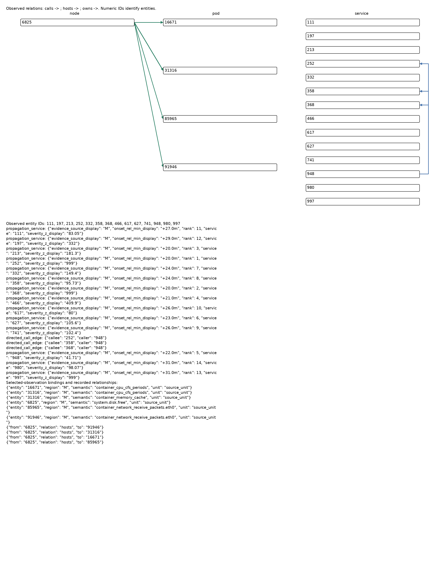
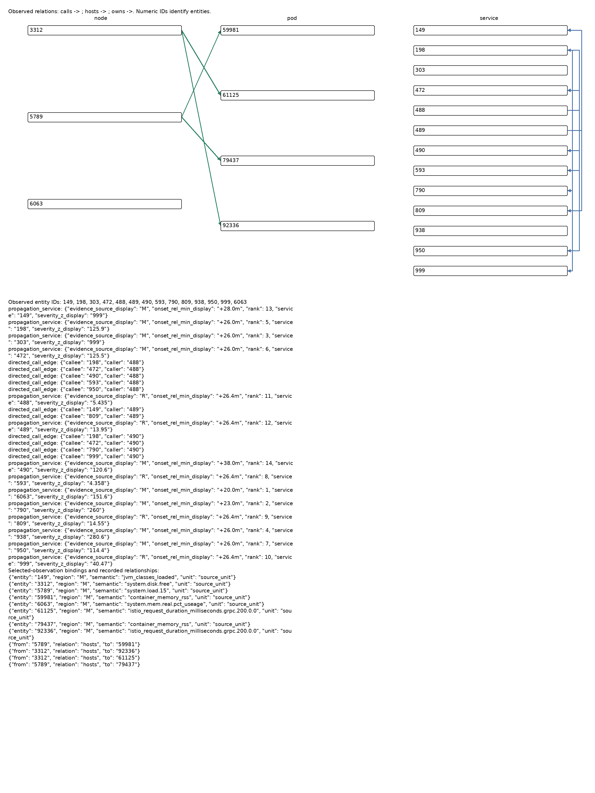
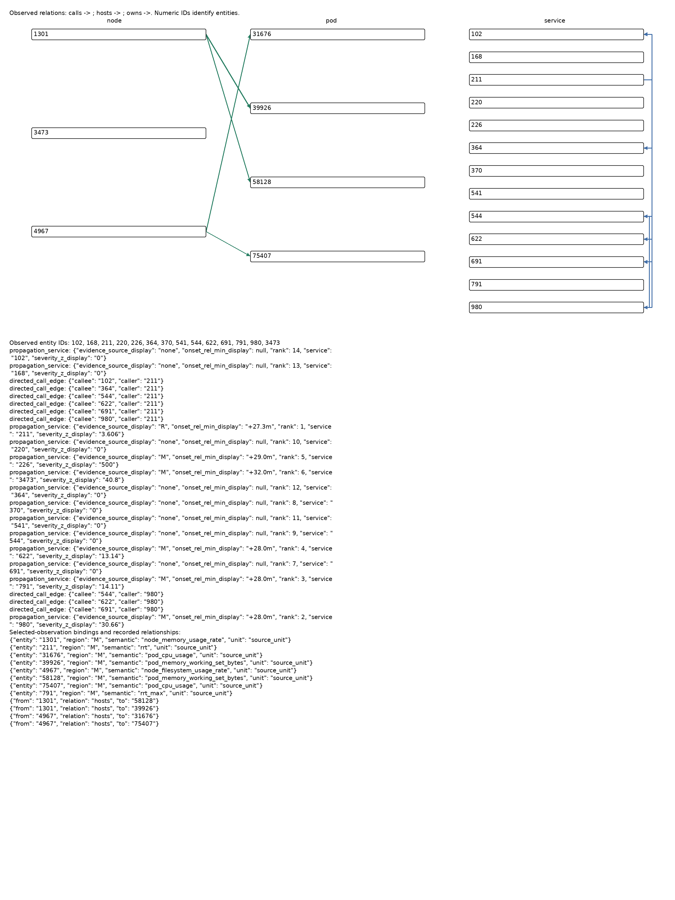

# 逐案例人工审阅

选择规则：从差值表和哈希抽取候选中覆盖收益/损失、两模型、三数据集，再按机制挑选10个病例、21份条件记录。这是目的性审阅，不估计总体错误比例。下列原始prompt/response/conversation链接为证据；ID与标签仅供离线分析。

## C01｜移除 G onset 后转向 restart 与内存下降

`INC-A5BE8AEFA87F` · aegislab · Qwen · ContainerKill

离线接受标签：`{"ts-config-service": "585"}`。

原回答围绕746的+4.0m和999构造源头；新回答选33542，service级585标签命中。输入确有restart 0→1及585 RSS约762.6M→273.4M；这支持状态信号被重新重视。数据库故障传播的延伸解释未由这些数值单独证实。

### FULL_T：RR=0.3333；预测=['746', '819', '585']

[输入](../../../RQs/RQ3_6/results/mechanisms_v2/g_components/stages/check_exp_graph_diagnostic_components/qwen3.8-27b/prompts/df9bd1a094214f8d0d0053ef1352f85c8694f28c5666a0310d4d75cd121b7a56.json) · [回答](../../../RQs/RQ3_6/results/mechanisms_v2/g_components/stages/check_exp_graph_diagnostic_components/qwen3.8-27b/outputs/df9bd1a094214f8d0d0053ef1352f85c8694f28c5666a0310d4d75cd121b7a56.json) · [conversation](../../../RQs/RQ3_6/results/mechanisms_v2/g_components/stages/check_exp_graph_diagnostic_components/qwen3.8-27b/conversations/df9bd1a094214f8d0d0053ef1352f85c8694f28c5666a0310d4d75cd121b7a56.md)

> Service 746 is the top candidate because it exhibits the earliest onset (+4.0m) and highest severity (999) in the M evidence, with a p99 latency doubling at bin 32. Verification confirms that no upstream caller is present in the G topology to cause 746's latency shift, and the subsequent failures in 819 (rank 4, +4.2m) and 585 (pod restart, bin 34) are temporally downstream of 746's onset.

### NO_ONSET_T：RR=1.0000；预测=['33542', '585', '28595']

[输入](../../../RQs/RQ3_6/results/mechanisms_v2/g_components/stages/check_exp_graph_diagnostic_components/qwen3.8-27b/prompts/3b4e17b6cb0110056d0afee4a27cb0904d82076eb5f2641d8ec8c8399fd4a706.json) · [回答](../../../RQs/RQ3_6/results/mechanisms_v2/g_components/stages/check_exp_graph_diagnostic_components/qwen3.8-27b/outputs/3b4e17b6cb0110056d0afee4a27cb0904d82076eb5f2641d8ec8c8399fd4a706.json) · [conversation](../../../RQs/RQ3_6/results/mechanisms_v2/g_components/stages/check_exp_graph_diagnostic_components/qwen3.8-27b/conversations/3b4e17b6cb0110056d0afee4a27cb0904d82076eb5f2641d8ec8c8399fd4a706.md)

> Pod 33542 (service 585) is the root cause, evidenced by a container restart (k8s.container.restarts 0→1) and a simultaneous, sharp drop in memory metrics (rss/working_set ~760M→270M) at the fault onset. This memory crash correlates temporally and causally with the new database connection abort errors (LT11578) from host 28595, while downstream services 819 and 376 show elevated latency (TRC-L) as a consequence of the database instability triggered by the pod's failure.

## C02｜移除 onset 也会丢失有用的竞争排序

`INC-E518E9800304` · aiops2022 · Qwen · k8s容器cpu负载

离线接受标签：`{"frontend": "488"}`。

488从第一掉到第三，模型改选9852；磁盘/inode与pod异常本来就存在。原G的488 +22m和调用边支持对比，但不证明其物理因果方向。此反例反对全局删除onset。

### FULL_T：RR=1.0000；预测=['488', '9852', '61576']

[输入](../../../RQs/RQ3_6/results/mechanisms_v2/g_components/stages/check_exp_graph_diagnostic_components/qwen3.8-27b/prompts/886e5e867127edcb7fe91db1469951075b7a4db2f3978ff46e98bfeb4e0343af.json) · [回答](../../../RQs/RQ3_6/results/mechanisms_v2/g_components/stages/check_exp_graph_diagnostic_components/qwen3.8-27b/outputs/886e5e867127edcb7fe91db1469951075b7a4db2f3978ff46e98bfeb4e0343af.json) · [conversation](../../../RQs/RQ3_6/results/mechanisms_v2/g_components/stages/check_exp_graph_diagnostic_components/qwen3.8-27b/conversations/886e5e867127edcb7fe91db1469951075b7a4db2f3978ff46e98bfeb4e0343af.md)

> Service 488 is the earliest onset (+22.0m) within the estimated fault window (+22.0m to +27.0m) and acts as the upstream caller to services 126 and 175, which exhibited later onsets. The alternative origin, Node 9852, shows infrastructure metric anomalies (inode/disk spikes) localized to bins 37-41 (approx +26.5m to +30.3m), which temporally overlaps the onset of downstream services but is not upstream of 488, confirming 488 as the causal origin.

### NO_ONSET_T：RR=0.3333；预测=['9852', '61576', '488']

[输入](../../../RQs/RQ3_6/results/mechanisms_v2/g_components/stages/check_exp_graph_diagnostic_components/qwen3.8-27b/prompts/90d4f8e1c3fc234a2a83a5de4990016c8434fc046b8db8e36621433f6f31e2ab.json) · [回答](../../../RQs/RQ3_6/results/mechanisms_v2/g_components/stages/check_exp_graph_diagnostic_components/qwen3.8-27b/outputs/90d4f8e1c3fc234a2a83a5de4990016c8434fc046b8db8e36621433f6f31e2ab.json) · [conversation](../../../RQs/RQ3_6/results/mechanisms_v2/g_components/stages/check_exp_graph_diagnostic_components/qwen3.8-27b/conversations/90d4f8e1c3fc234a2a83a5de4990016c8434fc046b8db8e36621433f6f31e2ab.md)

> The metrics evidence identifies node 9852 as the root cause, showing a simultaneous step-change increase in total and used inodes/disk space starting precisely at the fault window onset (bin 37/+22m) alongside severe CPU throttling and memory faults in co-located pod 61576. This local resource exhaustion aligns with the topology where service 488 (the top-ranked metric anomaly) is a caller whose symptoms are consistent with degraded downstream dependencies on the faulted node, rather than being the origin itself.

## C03｜HOST 修复不等于新增根因宿主观测

`INC-5EADA73E94EC` · aiops2025 · Qwen · node disk fill

离线接受标签：`{"node-3": "9013"}`。

标签node 9013，新加host数据实际属于1447/7497；新回答依赖原有9013 rank1/onset，且称其Service。ID命中，但不是新增了9013的直接遥测。

### ANCHOR_T：RR=0.0000；预测=['226', '136', '313']

[输入](../../../RQs/RQ3_6/results/mechanisms_v2/scope_competition/stages/check_exp_witness_scope_competition/qwen3.8-27b/prompts/995ec60991c154163c81a2d41976ef53d7227b586c2951a3adf400f23c0f120c.json) · [回答](../../../RQs/RQ3_6/results/mechanisms_v2/scope_competition/stages/check_exp_witness_scope_competition/qwen3.8-27b/outputs/995ec60991c154163c81a2d41976ef53d7227b586c2951a3adf400f23c0f120c.json) · [conversation](../../../RQs/RQ3_6/results/mechanisms_v2/scope_competition/stages/check_exp_witness_scope_competition/qwen3.8-27b/conversations/995ec60991c154163c81a2d41976ef53d7227b586c2951a3adf400f23c0f120c.md)

> Service 226 is the root cause, evidenced by a 3.24 log2 fold change in exclusive latency (indicating local processing failure rather than downstream propagation) and its status as the earliest caller with significant TRC-L anomaly. Service 136 is a secondary candidate with a 0.7 fold change in exclusive latency, while Service 313 is ranked third due to moderate latency increases (0.23-0.28) and earlier metric onset, but lacks the severe local latency isolation seen in 226. Topology confirms 226 as an origin point, with no evidence of upstream faults in 924 or 522 driving the latency.

### HOST_T：RR=1.0000；预测=['9013', '313', '226']

[输入](../../../RQs/RQ3_6/results/mechanisms_v2/scope_competition/stages/check_exp_witness_scope_competition/qwen3.8-27b/prompts/a042296bf3b9fba9d66a9528bde1808910e16414d2f7827c798f8c3b5b05b6fd.json) · [回答](../../../RQs/RQ3_6/results/mechanisms_v2/scope_competition/stages/check_exp_witness_scope_competition/qwen3.8-27b/outputs/a042296bf3b9fba9d66a9528bde1808910e16414d2f7827c798f8c3b5b05b6fd.json) · [conversation](../../../RQs/RQ3_6/results/mechanisms_v2/scope_competition/stages/check_exp_witness_scope_competition/qwen3.8-27b/conversations/a042296bf3b9fba9d66a9528bde1808910e16414d2f7827c798f8c3b5b05b6fd.md)

> Service 9013 is identified as the root cause as it has the earliest telemetry onset at +15.0m and the highest severity rank (1) in the propagation evidence. This is supported by the topology where service 522 calls 313 (onset +15.0m), and service 226 shows the most significant local latency degradation (exclusive latency lfc 3.24) consistent with a failure originating in its dependencies or self.

## C04｜补充真实 host 信息也可能引发上下文干扰

`INC-D3EAA310B962` · aiops2022 · Qwen · k8s容器网络资源包损坏

离线接受标签：`{"productcatalogservice": "437"}`。

437由第一变为前五外；新增8005 UDP中位数21.57→47.28被重复三次，另有5026 CPU10.21→11.38。新回答没选择这两个host，而改选原G中rank1的717。只能支持上下文改变伴随重排，不能认定某一新增数值必然致错。

### ANCHOR_T：RR=1.0000；预测=['437', '82967', '10086', '22932', '31727']

[输入](../../../RQs/RQ3_6/results/mechanisms_v2/scope_competition/stages/check_exp_witness_scope_competition/qwen3.8-27b/prompts/f23d0d22cdc3b1dcf348ec8a02a09828a1932a12001f3ea084f7389a2271b1ca.json) · [回答](../../../RQs/RQ3_6/results/mechanisms_v2/scope_competition/stages/check_exp_witness_scope_competition/qwen3.8-27b/outputs/f23d0d22cdc3b1dcf348ec8a02a09828a1932a12001f3ea084f7389a2271b1ca.json) · [conversation](../../../RQs/RQ3_6/results/mechanisms_v2/scope_competition/stages/check_exp_witness_scope_competition/qwen3.8-27b/conversations/f23d0d22cdc3b1dcf348ec8a02a09828a1932a12001f3ea084f7389a2271b1ca.md)

> Service 437 (product service) is identified as the root cause because its exclusive latency (local processing time) increased by over 12σ in both ListProducts and GetProduct operations, indicating a local computational bottleneck rather than downstream latency propagation. This local stall in 437 preceded the symptom onset in its caller, service 717, and is corroborated by a 8.6x burst in error-keyword logs at the gateway (10086) routing to 437, confirming the failure originated in 437's internal processing.

### HOST_T：RR=0.0000；预测=['717', '431', '518']

[输入](../../../RQs/RQ3_6/results/mechanisms_v2/scope_competition/stages/check_exp_witness_scope_competition/qwen3.8-27b/prompts/cddec75b0386a91b987432692ec7958e2da92b83f50ef46fd6f486b7a99fafbb.json) · [回答](../../../RQs/RQ3_6/results/mechanisms_v2/scope_competition/stages/check_exp_witness_scope_competition/qwen3.8-27b/outputs/cddec75b0386a91b987432692ec7958e2da92b83f50ef46fd6f486b7a99fafbb.json) · [conversation](../../../RQs/RQ3_6/results/mechanisms_v2/scope_competition/stages/check_exp_witness_scope_competition/qwen3.8-27b/conversations/cddec75b0386a91b987432692ec7958e2da92b83f50ef46fd6f486b7a99fafbb.md)

> Service 717 is the top-ranked origin in the propagation graph (rank 1) with an onset of +21.0m, which precedes the estimated fault window start of +28.0m and the onset of all other candidate services. Check 1 confirms no upstream caller of 717 exists in the provided topology to be a more plausible source, and Check 2 validates that the temporal precedence of 717's anomaly aligns with the subsequent metric degradation observed in downstream services like 431 and 518.

## C05｜同一图片下，宿主重复证据与粒度竞争

`INC-CCCFF766DA4B` · aiops2022 · Gemma · k8s容器读io负载

离线接受标签：`{"productcatalogservice-1": "57600"}`。

预测57600→7458→57600；三PNG字节相同。HOST_PEER重复7458 CPU10.6→16.16两次、4668 load1.24→1.485两次；DEDUP保留唯一事实而去掉重复。PEER虽ID正确，reason主要指向node；DEDUP reason才明确把pod文件系统增加视为源头。

### PEER_G：RR=1.0000；预测=['57600']

[输入](../../../RQs/RQ3_6/results/mechanisms_v2/scope_competition/stages/check_exp_witness_scope_competition/gemma-4-26b-a4b/prompts/bd83814d6053ec766881493ad614f1e544827f33bfb12a41adfa3b94bfc8c10b.json) · [回答](../../../RQs/RQ3_6/results/mechanisms_v2/scope_competition/stages/check_exp_witness_scope_competition/gemma-4-26b-a4b/outputs/bd83814d6053ec766881493ad614f1e544827f33bfb12a41adfa3b94bfc8c10b.json) · [conversation](../../../RQs/RQ3_6/results/mechanisms_v2/scope_competition/stages/check_exp_witness_scope_competition/gemma-4-26b-a4b/conversations/bd83814d6053ec766881493ad614f1e544827f33bfb12a41adfa3b94bfc8c10b.md)

> Node 7458 shows massive disk and inode expansion starting at t=33m, which correlates with the sudden burst of file system usage in pod 57600. Verification against the anomaly onset order confirms that the infrastructure-level disk usage surge precedes the downstream service latency and error symptoms observed in the trace and log data.

### HOST_PEER_G：RR=0.0000；预测=['7458']

[输入](../../../RQs/RQ3_6/results/mechanisms_v2/scope_competition/stages/check_exp_witness_scope_competition/gemma-4-26b-a4b/prompts/ae93ed4feff6348a4b008954018656ad36b47ae8a6b2acbdb7c749f291d0a686.json) · [回答](../../../RQs/RQ3_6/results/mechanisms_v2/scope_competition/stages/check_exp_witness_scope_competition/gemma-4-26b-a4b/outputs/ae93ed4feff6348a4b008954018656ad36b47ae8a6b2acbdb7c749f291d0a686.json) · [conversation](../../../RQs/RQ3_6/results/mechanisms_v2/scope_competition/stages/check_exp_witness_scope_competition/gemma-4-26b-a4b/conversations/ae93ed4feff6348a4b008954018656ad36b47ae8a6b2acbdb7c749f291d0a686.md)

> The node 7458 shows a massive spike in disk usage, total disk, and inode metrics starting at t=33m, which is the earliest onset in the system. This infrastructure failure precedes the downstream service symptoms and corresponds with the network segment surges seen in the node metrics.

### HP_DEDUP_G：RR=1.0000；预测=['57600']

[输入](../../../RQs/RQ3_6/results/mechanisms_v2/scope_competition/stages/check_exp_witness_scope_competition/gemma-4-26b-a4b/prompts/be2df5b0bc4d9dfbb1d3ca833ebc39876d8c7062a879832c831868aa10e3c05b.json) · [回答](../../../RQs/RQ3_6/results/mechanisms_v2/scope_competition/stages/check_exp_witness_scope_competition/gemma-4-26b-a4b/outputs/be2df5b0bc4d9dfbb1d3ca833ebc39876d8c7062a879832c831868aa10e3c05b.json) · [conversation](../../../RQs/RQ3_6/results/mechanisms_v2/scope_competition/stages/check_exp_witness_scope_competition/gemma-4-26b-a4b/conversations/be2df5b0bc4d9dfbb1d3ca833ebc39876d8c7062a879832c831868aa10e3c05b.md)

> Metric M8 shows a massive spike in filesystem usage for pod 57600, coinciding with the onset of disk and inode anomalies on node 7458. The temporal onset of disk pressure on 7458 (M5, M7, M11) matches the file system usage burst in 57600, identifying the pod as the source of the node-level exhaustion.

## C06｜图像修复：CPU pod 对比微小但高σ的 JVM 变化

`INC-7D95F2013B97` · aiops2022 · Gemma · k8s容器cpu负载

离线接受标签：`{"currencyservice-1": "31316"}`。

T选997，G选正确pod31316。M中31316 CPU baseline0.1225、peak22.53；997 Tenured Gen仅约62.5M→62.7M但deviation约1.5k。T还误称31316为node；PNG明确把31316放pod列、6825放node列。G的精确onset和CFS throttling表述不应全盘照信。

### ALL_ID_T：RR=0.0000；预测=['997']

[输入](../../../RQs/RQ3_6/results/mechanisms_v2/relation_binding/stages/check_exp_relation_provenance_binding/gemma-4-26b-a4b/prompts/a434da56731a24f123fefbfc092dc308dee8e24af0835b48140873c99fc05d53.json) · [回答](../../../RQs/RQ3_6/results/mechanisms_v2/relation_binding/stages/check_exp_relation_provenance_binding/gemma-4-26b-a4b/outputs/a434da56731a24f123fefbfc092dc308dee8e24af0835b48140873c99fc05d53.json) · [conversation](../../../RQs/RQ3_6/results/mechanisms_v2/relation_binding/stages/check_exp_relation_provenance_binding/gemma-4-26b-a4b/conversations/a434da56731a24f123fefbfc092dc308dee8e24af0835b48140873c99fc05d53.md)

> Service 997 shows severe Tenured Gen memory usage and garbage collection shifts starting significantly before downstream latency spikes in 948 and 252. Traces confirm 948's latency increases are downstream of 997's resource exhaustion, and node 31316 metrics do not show a system-wide failure that would explain the specific JVM behavior. The temporal onset of 997's memory pressure precedes the wider propagation observed in the service graph.

### ALL_ID_G：RR=1.0000；预测=['31316']

[输入](../../../RQs/RQ3_6/results/mechanisms_v2/relation_binding/stages/check_exp_relation_provenance_binding/gemma-4-26b-a4b/prompts/b7756c91375adba328d509af15324fb41ce67abf01dba2e23867f4bbf6805d53.json) · [回答](../../../RQs/RQ3_6/results/mechanisms_v2/relation_binding/stages/check_exp_relation_provenance_binding/gemma-4-26b-a4b/outputs/b7756c91375adba328d509af15324fb41ce67abf01dba2e23867f4bbf6805d53.json) · [conversation](../../../RQs/RQ3_6/results/mechanisms_v2/relation_binding/stages/check_exp_relation_provenance_binding/gemma-4-26b-a4b/conversations/b7756c91375adba328d509af15324fb41ce67abf01dba2e23867f4bbf6805d53.md)

> Pod 31316 exhibits massive CPU usage and CFS throttling spikes starting at +29.0m, matching the incident onset. While service 997 shows high memory usage, its onset and lack of causal connections to downstream latency spikes in 948/358 prioritize the CPU-bound pod 31316.

## C07｜图像退化：宿主证据仍存在，模型选择局部高强度症状

`INC-97ECDC5FFBD8` · aiops2022 · Gemma · node 磁盘读IO消耗

离线接受标签：`{"node-1": "6063"}`。

T正确选node6063；G选pod59591。两者均有6063内存中位数79.86→58.25；PNG保留6063但为孤立节点，59591 CPU/Trace为共同文本。G理由引用真实CPU327σ及exclusive latency，但不能因此证明pod是源头。

### ALL_ID_T：RR=1.0000；预测=['6063']

[输入](../../../RQs/RQ3_6/results/mechanisms_v2/relation_binding/stages/check_exp_relation_provenance_binding/gemma-4-26b-a4b/prompts/7830c10ba74d837b56902c1232103e72106b93d57c24df624a7c4974cbd30f37.json) · [回答](../../../RQs/RQ3_6/results/mechanisms_v2/relation_binding/stages/check_exp_relation_provenance_binding/gemma-4-26b-a4b/outputs/7830c10ba74d837b56902c1232103e72106b93d57c24df624a7c4974cbd30f37.json) · [conversation](../../../RQs/RQ3_6/results/mechanisms_v2/relation_binding/stages/check_exp_relation_provenance_binding/gemma-4-26b-a4b/conversations/7830c10ba74d837b56902c1232103e72106b93d57c24df624a7c4974cbd30f37.md)

> Node 6063 shows a massive drop in real memory usage starting at +20.0m, which is the earliest observed anomaly. This precedes all service-level latency spikes in downstream callers and correlates with the onset of system-wide instability. Verification confirms that the node-level memory drop occurs before the service-level metric shifts and that no other infrastructure component shows earlier onset. 

### ALL_ID_G：RR=0.0000；预测=['59591']

[输入](../../../RQs/RQ3_6/results/mechanisms_v2/relation_binding/stages/check_exp_relation_provenance_binding/gemma-4-26b-a4b/prompts/2f781771e551c0aa43f6b5d1d70bb1e14349c56416fe034eff5bd6659c1bb208.json) · [回答](../../../RQs/RQ3_6/results/mechanisms_v2/relation_binding/stages/check_exp_relation_provenance_binding/gemma-4-26b-a4b/outputs/2f781771e551c0aa43f6b5d1d70bb1e14349c56416fe034eff5bd6659c1bb208.json) · [conversation](../../../RQs/RQ3_6/results/mechanisms_v2/relation_binding/stages/check_exp_relation_provenance_binding/gemma-4-26b-a4b/conversations/2f781771e551c0aa43f6b5d1d70bb1e14349c56416fe034eff5bd6659c1bb208.md)

> Service 59591 exhibits a massive CPU usage spike (327 sigma deviation) and high exclusive latency in traces, coinciding with the start of the incident. While service 149 shows garbage collection and memory shifts, its metrics do not show the same magnitude of local processing exhaustion, and the topology shows 59591's latency is not merely a downstream byproduct.

## C08｜正确提名不代表故障机制解释正确

`INC-EF768AE9D329` · aiops2025 · Gemma · jvm exception

离线接受标签：`{"adservice": "301"}`。

T选289，G选97990，按service兼容评分命中301/adservice。M确有97990工作集尖峰；私有fault为jvm exception，reason却称memory exhaustion，并无足够证据把异常内存观测升级为已证实故障机制。

### ALL_ID_T：RR=0.0000；预测=['289']

[输入](../../../RQs/RQ3_6/results/mechanisms_v2/relation_binding/stages/check_exp_relation_provenance_binding/gemma-4-26b-a4b/prompts/570bcc7abaf5f21312d038eaeb926ac54be26eaaa9cd3c83c0d94fbfea604007.json) · [回答](../../../RQs/RQ3_6/results/mechanisms_v2/relation_binding/stages/check_exp_relation_provenance_binding/gemma-4-26b-a4b/outputs/570bcc7abaf5f21312d038eaeb926ac54be26eaaa9cd3c83c0d94fbfea604007.json) · [conversation](../../../RQs/RQ3_6/results/mechanisms_v2/relation_binding/stages/check_exp_relation_provenance_binding/gemma-4-26b-a4b/conversations/570bcc7abaf5f21312d038eaeb926ac54be26eaaa9cd3c83c0d94fbfea604007.md)

> Service 289 shows the earliest onset of anomalous metrics (node_filesystem_free_bytes) at +17.0m, which precedes the latency and error spikes in downstream services like 301 and 200. Verified that the filesystem drop in 289 correlates with the high disk write activity in 8311 and occurs before the cascading latency increases in the call graph.

### ALL_ID_G：RR=1.0000；预测=['97990']

[输入](../../../RQs/RQ3_6/results/mechanisms_v2/relation_binding/stages/check_exp_relation_provenance_binding/gemma-4-26b-a4b/prompts/4d5227b856d3bfd7003ea4fbfcde34c42181c03dc4729bf28090797f7e8dcf5a.json) · [回答](../../../RQs/RQ3_6/results/mechanisms_v2/relation_binding/stages/check_exp_relation_provenance_binding/gemma-4-26b-a4b/outputs/4d5227b856d3bfd7003ea4fbfcde34c42181c03dc4729bf28090797f7e8dcf5a.json) · [conversation](../../../RQs/RQ3_6/results/mechanisms_v2/relation_binding/stages/check_exp_relation_provenance_binding/gemma-4-26b-a4b/conversations/4d5227b856d3bfd7003ea4fbfcde34c42181c03dc4729bf28090797f7e8dcf5a.md)

> Pod 97990 exhibits a massive 999-sigma spike in memory working set bytes, which precedes the downstream latency and error surges in services like 194 and 35592. While service 194 shows significant latency fluctuations, the memory exhaustion in pod 97990 is the primary driver of system instability. Trace and log data confirm widespread errors, but the metric anomaly in pod 97990 provides the most direct evidence of resource-induced failure.

## C09｜图像退化伴随无依据调用关系

`INC-D02CFDF1A4AE` · aiops2025 · Gemma · network loss

离线接受标签：`{"checkoutservice": "980", "frontend": "211"}`。

T选接受标签211，G选791。791确有rrt_max大幅变化，但显式图边/ledger没有211→791；G却称791为211依赖及公共瓶颈。T的reason同样混淆caller方向；排名与解释必须分开核验。

### ALL_ID_T：RR=1.0000；预测=['211']

[输入](../../../RQs/RQ3_6/results/mechanisms_v2/relation_binding/stages/check_exp_relation_provenance_binding/gemma-4-26b-a4b/prompts/2a757e3742012ed59c081e5d1b9feb024cb96dad0596acdd3d013a6e541abde6.json) · [回答](../../../RQs/RQ3_6/results/mechanisms_v2/relation_binding/stages/check_exp_relation_provenance_binding/gemma-4-26b-a4b/outputs/2a757e3742012ed59c081e5d1b9feb024cb96dad0596acdd3d013a6e541abde6.json) · [conversation](../../../RQs/RQ3_6/results/mechanisms_v2/relation_binding/stages/check_exp_relation_provenance_binding/gemma-4-26b-a4b/conversations/2a757e3742012ed59c081e5d1b9feb024cb96dad0596acdd3d013a6e541abde6.md)

> Service 211 shows the earliest onset of error-related trace anomalies at +27.3m, preceding the errors in downstream callers like 980 (+28.0m). While 980 and 791 show high error ratios, they are downstream from 211 in the call graph, and 211's latency and error spikes align as the initial trigger. Verification confirmed 211's onset precedes the massive error ratio increase in 980 and 791. 

### ALL_ID_G：RR=0.0000；预测=['791']

[输入](../../../RQs/RQ3_6/results/mechanisms_v2/relation_binding/stages/check_exp_relation_provenance_binding/gemma-4-26b-a4b/prompts/8ae667591532df6da5a6f221521c0c08dcf1d8181da72a336cdcbe09c1b56230.json) · [回答](../../../RQs/RQ3_6/results/mechanisms_v2/relation_binding/stages/check_exp_relation_provenance_binding/gemma-4-26b-a4b/outputs/8ae667591532df6da5a6f221521c0c08dcf1d8181da72a336cdcbe09c1b56230.json) · [conversation](../../../RQs/RQ3_6/results/mechanisms_v2/relation_binding/stages/check_exp_relation_provenance_binding/gemma-4-26b-a4b/conversations/8ae667591532df6da5a6f221521c0c08dcf1d8181da72a336cdcbe09c1b56230.md)

> Service 791 shows a significant increase in client error ratio (MET-Z) and a massive spike in round-trip time (RRT), despite being a downstream dependency for services like 211. While service 980 exhibits higher error ratios, the onset of RRT in 791 and its role as a common dependency align with the trace latency patterns observed across multiple callers. The topology confirms 791 is the bottleneck causing propagation to upstream callers.

## C10｜图像修复 node CPU，但实体类型称呼仍错

`INC-6E6E1B20F2D5` · aiops2025 · Gemma · node cpu stress

离线接受标签：`{"node-7": "8820"}`。

T选802，G正确选node8820；共同文本有8820 CPU baseline18.47、peak96.45。802 filesystem极小变化却有极大σ。G公开reason称8820为Service；正确ID不保证层次理解或每项时间陈述正确。

### ALL_ID_T：RR=0.0000；预测=['802']

[输入](../../../RQs/RQ3_6/results/mechanisms_v2/relation_binding/stages/check_exp_relation_provenance_binding/gemma-4-26b-a4b/prompts/4ab254107303c40d105c5d3c1bb5566ac38372aa590c9a6874b056a596088e87.json) · [回答](../../../RQs/RQ3_6/results/mechanisms_v2/relation_binding/stages/check_exp_relation_provenance_binding/gemma-4-26b-a4b/outputs/4ab254107303c40d105c5d3c1bb5566ac38372aa590c9a6874b056a596088e87.json) · [conversation](../../../RQs/RQ3_6/results/mechanisms_v2/relation_binding/stages/check_exp_relation_provenance_binding/gemma-4-26b-a4b/conversations/4ab254107303c40d105c5d3c1bb5566ac38372aa590c9a6874b056a596088e87.md)

> Node 802 shows a significant fluctuation in free filesystem bytes with a 28-sigma deviation, while its hosted pods exhibit high severity. The metric onset for 802 precedes the latency spikes and CPU surges seen in downstream services like 8820 and 940. While service 8820 shows high CPU, the filesystem anomaly on node 802 provides the underlying infrastructure trigger. 

### ALL_ID_G：RR=1.0000；预测=['8820']

[输入](../../../RQs/RQ3_6/results/mechanisms_v2/relation_binding/stages/check_exp_relation_provenance_binding/gemma-4-26b-a4b/prompts/9b423a96c0cbaa44f977945958e46cbe7729b905dbe75198f8101fa2bc3e8a62.json) · [回答](../../../RQs/RQ3_6/results/mechanisms_v2/relation_binding/stages/check_exp_relation_provenance_binding/gemma-4-26b-a4b/outputs/9b423a96c0cbaa44f977945958e46cbe7729b905dbe75198f8101fa2bc3e8a62.json) · [conversation](../../../RQs/RQ3_6/results/mechanisms_v2/relation_binding/stages/check_exp_relation_provenance_binding/gemma-4-26b-a4b/conversations/9b423a96c0cbaa44f977945958e46cbe7729b905dbe75198f8101fa2bc3e8a62.md)

> Service 8820 exhibits a massive CPU usage spike (rank 6) and a concurrent filesystem deviation on its node. While downstream services like 940 show high latency, the onset of 8820's CPU saturation precedes the latency spikes in the call chain.
