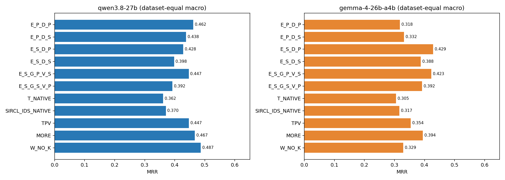
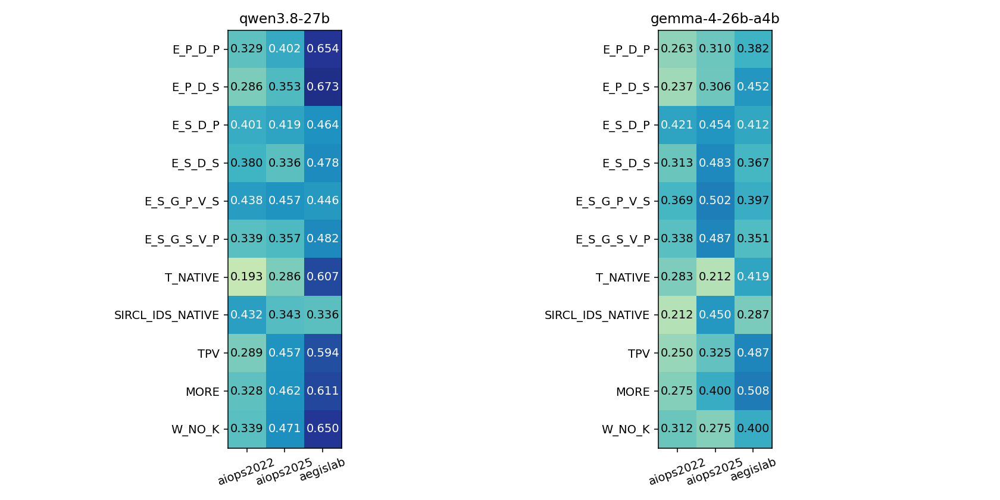
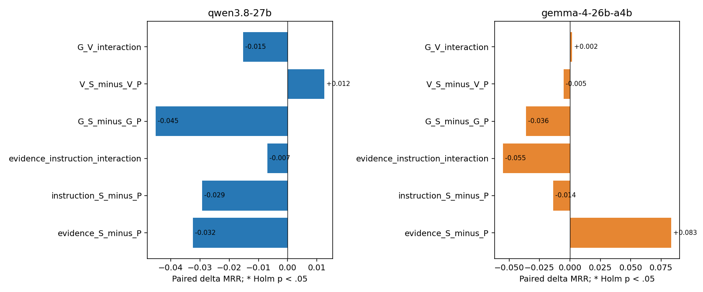
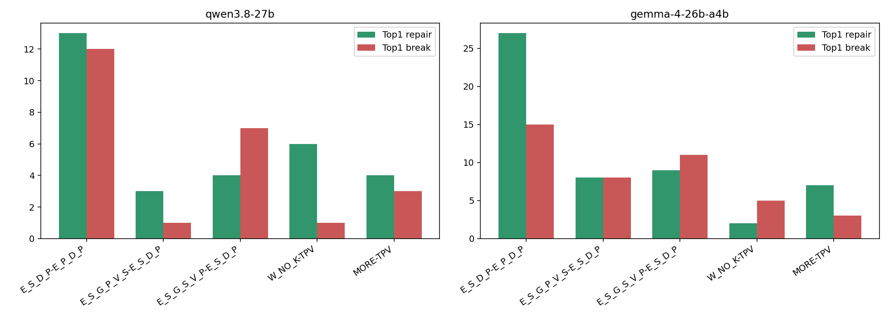
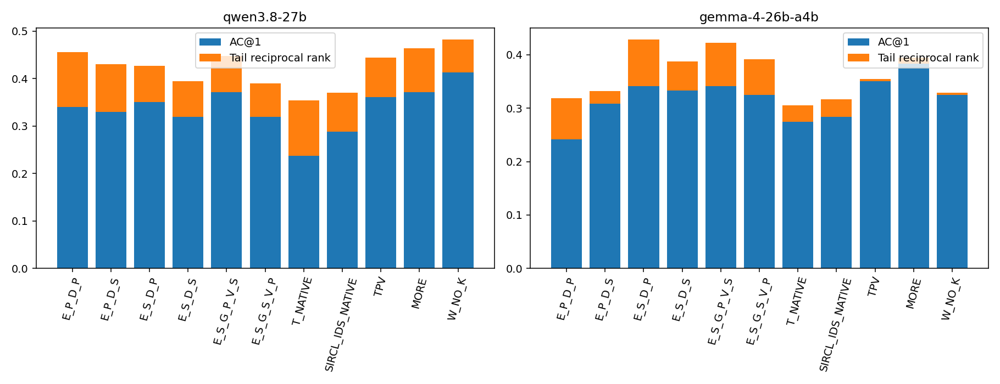
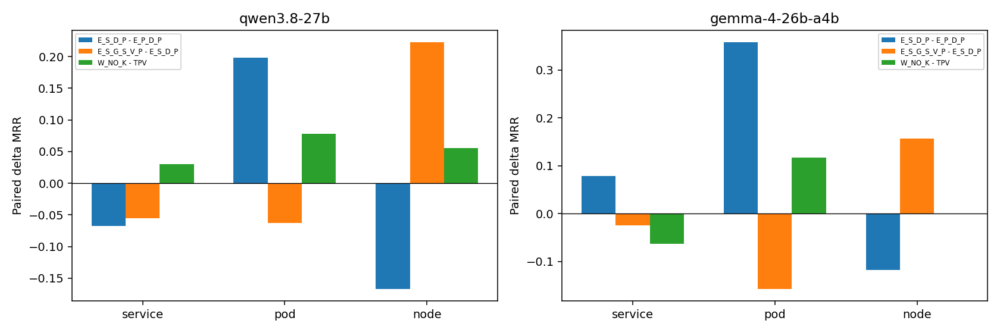
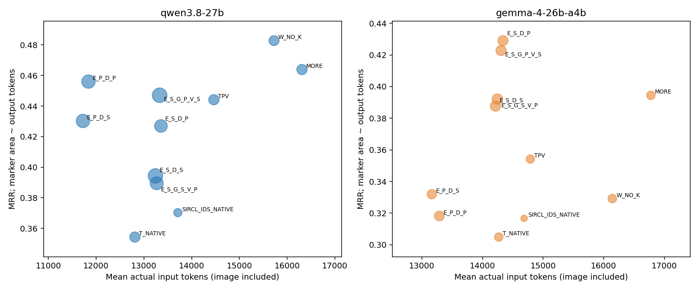

# RQ3.6 阶段 A：证据包、领域说明与核验措辞的复核分析

日期：2026-09-26。范围：`exp_evidence_instruction_replication`，check120，11条件、Qwen/Gemma各一轮。**本报告只分析已完成的阶段A，不启动B–D，不修改原输出或评分。**

## 1. 先说结论

本轮没有得到一个同时在两模型上胜出的统一新方法，但把下一步应解决的问题缩小了：

1. **Gemma继续支持“S证据＋父版指令”这个候选，Qwen没有复现其整体优势。** Gemma的`E_S_D_P` macro MRR为0.4290，相对`E_P_D_P`的0.3182增加0.1108；Qwen则从0.4618降到0.4280。Gemma这一条件比较的原始p=.0337，但在本报告完整条件比较的探索性Holm family中未显著；不能称为已确认的跨模型突破。
2. **“根因关联记录更多”与“正确故障机制保留下来”仍不是一回事。** 两模型的S输入都增加M/R/L中的根因关联记录；Qwen却在原本已有根因M的59例中从0.5944降至0.4986，在新增根因M的28例中从0.3155升至0.4167。新增信号确有价值，但对旧有效信号的破坏抵消了收益。
3. **领域说明的内容，比两版VERIFY/REVISE措辞更值得继续拆解。** 固定S证据时，换成泛化的传播/宿主说明`G_S`，两模型的平均MRR变化均为负；只换核验措辞`V_S`的平均变化很小。两组效应均未通过注册Holm检验，因此这是下一轮组件假设，而不是定论。
4. **出现了同方向的pod/node取舍。** S证据对pod根因较好、对node根因较差；强调宿主传播的`G_S`又在node上改善、pod上退化。它不是“按真实根因类型切换方法”的许可，而是应研究如何在公开证据中区分故障范围的线索。
5. **Qwen的`W_NO_K`仍是本轮最高MRR点估计：0.4867；Gemma则退化。** 相对TPV，Qwen有6例Top-1修复、1例破坏；Gemma有2例修复、5例破坏。需保留W的有效增量，同时处理宿主症状被误当故障源、静态/无变化补充竞争注意力等具体失败。
6. **最清楚的统计正结果是Qwen的文本接口校准。** `E_P_D_P`相对`T_NATIVE` pooled ΔMRR=+0.1017，四项校准family的Holm p=.0055，事件组敏感性p=.0097。它说明提示词封装、分块与答案形成条件值得认真控制；不是视觉收益，也不是新选择器贡献。
7. **当前MRR差距有很大一部分来自候选列表的形成方式。** Gemma中`E_S_D_P`比TPV的MRR高0.0749，但AC@1略低0.0083，增益来自备选保留。改善MRR时必须同时解释“找到了第一名”还是“没有丢掉前五”。



## 2. 实验做了什么，数据是否齐全

### 2.1 条件解释

| 条件 | 含义 |
|---|---|
| E_P_D_P / E_P_D_S | 父版P证据，分别采用父版/SIRCL式诊断指令 |
| E_S_D_P / E_S_D_S | SIRCL来源S证据，分别采用两套指令 |
| E_S_G_P_V_S | 固定S证据，父版领域阅读规则＋S版核验措辞 |
| E_S_G_S_V_P | 固定S证据，S版领域背景＋父版核验措辞 |
| T_NATIVE | 父版原生文本接口的单位标签校准后继 |
| SIRCL_IDS_NATIVE | 数字匿名化、公共时间适配后的SIRCL来源原生接口 |
| TPV | M/R/L文本＋G图像 |
| MORE | TPV加同预算上限的额外证据对照 |
| W_NO_K | TPV加宿主/实例/活动观测，不加入K断言 |

这里指令组件的`G_P/G_S`是**领域说明（guide）**，不要与遥测区域G（topology）混淆。两套D均有VERIFY/REVISE，不是“有推理/无推理”。P/S是统计、时间、筛选、精度与序列化的**整包对照**，不是纯选择器因果效应。

本轮P侧Trace字段由误标的`_ms`改为与存储值相符的`_us`；数值、选择和G图未改。因而不能用与历史P侧的分数变化单独证明该标签修复有用，也不能把RQ3.5→RQ3.6当同病例学习曲线。

### 2.2 完成与失败

2026-09-26 18:09:39启动，20:04:30完成，约114.85分钟。Qwen先运行，随后Gemma；服务正常退出。

| 模型 | 登记单元 | 有完整输出 | 其中模型输出失败 | 请求超时 | 未解释缺失 |
|---|---:|---:|---:|---:|---:|
| Qwen | 1,320 | 1,296 | 7 | 24 | 0 |
| Gemma | 1,320 | 1,320 | 6 | 0 | 0 |
| 合计 | 2,640 | 2,616 | 13 | 24 | 0 |

“完整输出”不等于正确答案。13份模型失败均为未知/重复候选，finish reason都是`stop`，没有观测到输出长度截断；按注册评分保留零分。Qwen有4份含未知候选、3份含重复候选；Gemma六份均含重复候选。请求超时属于基础设施缺失，不当作模型诊断错误。

本轮正式新增2,640次，smoke18次，继承历史8,241次，累计10,899次；没有逻辑复用、补跑或新增模型分析调用。40,000累计上限未重置。

### 2.3 分母——这次尤其重要

三个主数据集各40例，共120；没有RE2。本批是**重复暴露的check复核集**，不是新独立test。

按已登记的实验×模型whole-case基础设施排除：只要一个病例任一条件超时，主比较就从该模型全部11条件中排除这个病例。

| 模型 | AIOPS-2022 | AIOPS-2025 | AegisLab | 共同完整病例 |
|---|---:|---:|---:|---:|
| Qwen | 32 | 35 | 30 | 97 |
| Gemma | 40 | 40 | 40 | 120 |

Qwen24次超时分布在23例：AIOPS-2022涉及8例/9次，AIOPS-2025涉及5例/5次，AegisLab涉及10例/10次。**单元超时率只有1.82%，但损失了19.17%的全条件共同病例。** 不能因总调用失败比例小就忽略其分析影响；本报告不另设“5%以内可接受”的门槛。

主图及总表使用三个数据集等权macro；检验用逐病例配对差值，其均值为pooled。Qwen分母不等，所以两者数值不同；Gemma相同。模型间的97/120也不同，不能直接把两列差当“哪个模型更强”。

补充提供每arm已完成样本、超时按零计的全120例系统效用敏感性、每个factorial自身完整格子的敏感性。后两者不替代主分析，更不改变超时的原始性质。

### 2.4 核查与可复算性

本次离线核对19,023项已提交artifact哈希、2,603份合法输出的granularity-aware排名分数、1,770项保存输入的跨模型/条件一致性。所有2,640个登记单元均有终态；未发现得分或文件不一致。原模型配置、源码合同与资格记录一致；图像使用真实已提交PNG，图像tokens计入input。

这些是**分析时的一次性来源核查**，未加入启动/续跑路径，没有重新构建prompt或14GB context。分析数据、标签与判断仅在离线报告中使用。

## 3. 所有条件的表现

下表MRR、AC@1、AC@5均为数据集等权macro；AC以比例表示。

| Arm | Qwen MRR | Qwen AC@1 | Qwen AC@5 | Gemma MRR | Gemma AC@1 | Gemma AC@5 |
|---|---:|---:|---:|---:|---:|---:|
| E_P_D_P | .4618 | .3450 | .6462 | .3182 | .2417 | .4583 |
| E_P_D_S | .4377 | .3371 | .6046 | .3319 | .3083 | .3750 |
| E_S_D_P | .4280 | .3518 | .5374 | **.4290** | .3417 | **.5833** |
| E_S_D_S | .3979 | .3239 | .5079 | .3876 | .3333 | .4833 |
| E_S_G_P_V_S | .4467 | .3710 | .5564 | .4228 | .3417 | .5750 |
| E_S_G_S_V_P | .3925 | .3230 | .4871 | .3921 | .3250 | .5083 |
| T_NATIVE | .3617 | .2433 | .5350 | .3049 | .2750 | .3417 |
| SIRCL_IDS_NATIVE | .3704 | .2885 | .4857 | .3167 | .2833 | .3667 |
| TPV | .4469 | .3634 | .5497 | .3542 | .3500 | .3583 |
| MORE | .4670 | .3738 | .5808 | .3944 | **.3833** | .4083 |
| W_NO_K | **.4867** | **.4167** | .5601 | .3292 | .3250 | .3333 |

Qwen最高AC@5是`E_P_D_P`，而最高MRR/AC@1是`W_NO_K`；Gemma最高MRR是`E_S_D_P`，最高AC@1是`MORE`。因此本轮不宜宣布一个无条件“冠军”。完整AC@3、AVG@3/5及各口径见[指标表](RQ3_6_Stage_A_Analysis_2026-09-26_assets/arm_metrics.csv)。

### 3.1 各数据集MRR

| Arm | Qwen A22 | Qwen A25 | Qwen Aegis | Gemma A22 | Gemma A25 | Gemma Aegis |
|---|---:|---:|---:|---:|---:|---:|
| E_P_D_P | .3292 | .4024 | .6539 | .2625 | .3100 | .3821 |
| E_P_D_S | .2865 | .3533 | .6733 | .2375 | .3063 | .4521 |
| E_S_D_P | .4010 | .4190 | .4639 | .4208 | .4542 | .4121 |
| E_S_D_S | .3802 | .3357 | .4778 | .3125 | .4833 | .3671 |
| E_S_G_P_V_S | .4375 | .4571 | .4456 | .3688 | .5021 | .3975 |
| E_S_G_S_V_P | .3385 | .3571 | .4817 | .3375 | .4875 | .3513 |
| T_NATIVE | .1927 | .2857 | .6067 | .2833 | .2125 | .4188 |
| SIRCL_IDS_NATIVE | .4323 | .3429 | .3361 | .2125 | .4500 | .2875 |
| TPV | .2891 | .4571 | .5944 | .2500 | .3250 | .4875 |
| MORE | .3281 | .4619 | .6111 | .2750 | .4000 | .5083 |
| W_NO_K | .3385 | .4714 | .6500 | .3125 | .2750 | .4000 |



Qwen S证据在两AIOPS均有正向点估计，但Aegis从.6539降到.4639，抵消了收益。Gemma S证据的主要增益来自两AIOPS：A22+.1583，A25+.1442；Aegis只有+.0300。**“S包整体好/坏”会掩盖这种有研究价值的差异。**

两AIOPS合并（Qwen67例，Gemma80例）MRR：

| Arm | Qwen | Gemma |
|---|---:|---:|
| E_P_D_P | .3674 | .2863 |
| E_S_D_P | .4104 | .4375 |
| E_S_G_P_V_S | .4478 | .4354 |
| TPV | .3769 | .2875 |
| MORE | .3980 | .3375 |
| W_NO_K | .4080 | .2938 |

这些是已暴露check数据的描述性对比，尚未达到长期两个AIOPS各≥.60的目标。

## 4. 注册factorial检验：哪些效应可复现？

对每个case计算：证据主效应为两个指令背景下S−P的平均；指令主效应为两个证据背景下D_S−D_P的平均；交互为四格差分。指令组件同理。两个主family各含两模型×3项，共6项；校准family含两模型×2项，共4项。使用Pratt-Wilcoxon、paired dz和Holm；不报告CI。检验前将差值数值化至12位小数，避免RR分数运算留下约1e−17的浮点残差，误将真正零差值或并列值排序；原始评分不变。

| Family/效应 | Qwen ΔMRR | Qwen Holm p | Gemma ΔMRR | Gemma Holm p |
|---|---:|---:|---:|---:|
| 证据 S−P | −.0325 | .7414 | +.0833 | .6392 |
| 指令 D_S−D_P | −.0292 | .6392 | −.0138 | .7414 |
| 证据×指令交互 | −.0069 | .8405 | −.0551 | .5954 |
| 领域说明 G_S−G_P | −.0451 | 1.0000 | −.0360 | .6445 |
| 核验措辞 V_S−V_P | +.0125 | 1.0000 | −.0053 | .8890 |
| 领域×核验交互 | −.0153 | 1.0000 | +.0018 | 1.0000 |
| P公共接口−P原生接口 | **+.1017** | **.0055** | +.0133 | .4763 |
| S公共接口−S原生接口 | +.0241 | .9424 | +.0710 | .1956 |



Qwen P接口校准的dz=.2929。按事件组等权（Qwen81组、Gemma96组）复算，Qwen P校准Δ=.0946、Holm p=.0097，其余主效应/交互仍未显著。详见[全部检验及效应量](RQ3_6_Stage_A_Analysis_2026-09-26_assets/registered_tests.csv)。

**为什么这项校准值得重视？** `E_P_D_P`把原任务拆为公共任务、诊断块、单独候选列表、按区域记录；`T_NATIVE`保留原生大段说明、表示指南和reason措辞约束。它不是只移动一个句子，也不是纯压缩实验。说明负担、冗余和输出形成约束可能影响利用已有证据的能力；本轮确认的是这个**接口整包**，尚未定位唯一原因。

**怎样解释指令组件？** `G_P`有MET-Z/TRC-L/LOG-R的字段解释及分析语义；`G_S`更强调共享宿主、传播和源头/症状。仅交换V的净变化远小于G，但没有通过显著性检验；因此不应下一步继续广泛改写VERIFY文案，更值得检查领域说明把哪些候选推到了前面。

条件级额外比较统一置于22项探索性family。Gemma `E_S_D_P−SIRCL_IDS_NATIVE`的Δ=.1124，Holm p≈.0019，事件组敏感性Holm p=.0071；这包含公共封装和指令变化，不是“复制原工具本身构成创新”。其余条件级结果，包括Gemma `E_S_D_P−E_P_D_P`及Qwen `W_NO_K−TPV`，均未通过该family校正。详见[条件比较](RQ3_6_Stage_A_Analysis_2026-09-26_assets/paired_contrasts.csv)。

## 5. 修复、破坏与候选尾部

下面Δ为共同样本pooled；repair/break指AC@1由0→1或1→0，不等于所有MRR升降。

| 比较 | 模型 | ΔMRR | Top-1修复/破坏 | 新入前五/掉出前五 |
|---|---|---:|---:|---:|
| E_S_D_P − E_P_D_P | Qwen | −.0290 | 13 / 12 | 10 / 20 |
| 同上 | Gemma | +.1108 | 27 / 15 | 31 / 16 |
| E_S_D_S − E_S_D_P | Qwen | −.0326 | 5 / 8 | 6 / 9 |
| 同上 | Gemma | −.0414 | 8 / 9 | 6 / 18 |
| E_S_G_P_V_S − E_S_D_P | Qwen | +.0201 | 3 / 1 | 4 / 2 |
| 同上 | Gemma | −.0062 | 8 / 8 | 6 / 7 |
| E_S_G_S_V_P − E_S_D_P | Qwen | −.0375 | 4 / 7 | 4 / 9 |
| 同上 | Gemma | −.0369 | 9 / 11 | 9 / 18 |
| W_NO_K − TPV | Qwen | +.0387 | 6 / 1 | 6 / 5 |
| 同上 | Gemma | −.0250 | 2 / 5 | 3 / 6 |
| MORE − TPV | Qwen | +.0198 | 4 / 3 | 7 / 4 |
| 同上 | Gemma | +.0403 | 7 / 3 | 8 / 2 |



### 5.1 相同MRR下降，失败环节并不相同

- Qwen S替换P：AC@1净+.0103，但tail-RR−.0393，所以整体MRR下降。不是第一名普遍变差，而是丢失了部分正确备选。
- Gemma在S证据上D_P→D_S：AC@1−.0083，tail-RR−.0331，主要也是尾部损失，重复了RQ3.5的方向。
- Gemma `E_S_D_P−TPV`：AC@1−.0083、tail-RR+.0832。MRR改善并未转化成首位诊断净改善。
- Qwen `W_NO_K−TPV`：AC@1+.0515、tail-RR−.0129，正向主要来自首位修复。这比单纯“扩大候选数增加MRR”更值得继续研究。



Gemma平均候选数：`E_P_D_P`3.90、`E_P_D_S`1.73、`E_S_D_P`3.61、`E_S_D_S`2.57、TPV1.13、W_NO_K1.05。不得通过强迫补足五个候选来掩盖这一现象；应分别衡量首位选择、合理备选保留和非法/重复ID。

## 6. 模式分析：覆盖增加，为何没有自动提高MRR？

### 6.1 直接区域记录与机制证据需要分开

从实际提交的M/R/L记录解析实体，按注册granularity-aware口径映射根因；不把候选列表、G端点或reason算作遥测覆盖。

| 模型/共同样本 | 证据包 | 根因关联M记录存在 | R记录存在 | L记录存在 |
|---|---|---:|---:|---:|
| Qwen / 97 | P | 59 | 43 | 18 |
| Qwen / 97 | S | 87 | 62 | 66 |
| Gemma / 120 | P | 70 | 49 | 23 |
| Gemma / 120 | S | 108 | 74 | 80 |

这是**实体出现在可见区域数据记录中**，不保证存在与故障相关的指标，也不保证记录异常；service标签允许其合法pod记录。两模型不同计数来自共同样本分母，而非编译时使用不同证据。

| 模型 | 根因M存在性分组 | n | P MRR | S MRR | Δ |
|---|---|---:|---:|---:|---:|
| Qwen | 原已有，S仍有 | 59 | .5944 | .4986 | −.0958 |
| Qwen | P无、S新增 | 28 | .3155 | .4167 | +.1012 |
| Qwen | 两者均无 | 10 | .0333 | .0333 | .0000 |
| Gemma | 原已有，S仍有 | 70 | .4902 | .5355 | +.0452 |
| Gemma | P无、S新增 | 38 | .1018 | .3421 | +.2404 |
| Gemma | 两者均无 | 12 | .0000 | .0833 | +.0833 |

没有发生“P有根因M、S完全没有根因M”的病例，但Qwen仍明显损失。**这与RQ3.1 X大量丢失根因M的失败不同：本次瓶颈进一步进入指标语义、时间统计和候选竞争。** 分组是标签辅助的描述性分析，不是独立因果试验，也不能拿这些事后组作为部署路由。

### 6.2 pod、node的方向取舍

| 比较 | 模型 | service Δ | pod Δ | node Δ |
|---|---|---:|---:|---:|
| S证据−P证据，固定D_P | Qwen | −.0679 | +.1979 | −.1667 |
| 同上 | Gemma | +.0787 | +.3578 | −.1176 |
| G_S−G_P，固定S与V_P | Qwen | −.0551 | −.0625 | +.2222 |
| 同上 | Gemma | −.0245 | −.1569 | +.1569 |
| W_NO_K−TPV | Qwen | +.0303 | +.0781 | +.0556 |
| 同上 | Gemma | −.0633 | +.1176 | .0000 |

Qwen样本数service66/pod16/node9，另6例有pod+service可接受标签；Gemma79/17/17，另7例混合标签。混合标签保留在总成绩、CSV及fault分析，不强塞入单一层次。Aegis全为service，pod单层次全来自A22，因此不能把跨数据集构成差直接归因于根因层次。



为了直接检验取舍，补做了**事后、仅A22、事件组聚类稳健OLS**：因变量是逐例ΔRR，自变量是node/pod。3个比较×2模型组成6项Holm family。共享遥测窗口组可能含两种根因类型，不能把它们当独立同质组随意打乱。

最强线索是Gemma更换G说明的node−pod效应差+.3569，原始p=.0086、Holm p=.0514，涉及27例/15组；Qwen同一方向但更弱。**接近门槛不等于通过；样本与组数都较小。** 所有全域数据集/层次子组比较也进行了完整探索性校正，没有把“这一组显著、另一组不显著”冒充组间差异。见[直接异质性检验](RQ3_6_Stage_A_Analysis_2026-09-26_assets/posthoc_node_pod_heterogeneity.csv)。

### 6.3 W实际补充了什么

主配对子集上，Gemma120例共920条追加M观测，其中271条（29.5%）前后median完全相同；Qwen97例747条，其中216条（28.9%）相同。明确的memory/cpu request配置条目为18/12条。每例均有实际新增输入，没有全部退化为no-op。

**median不变并非无用**：它可能是有价值的正常对照，也可能掩盖短时异常。因此不能把全部不变条目一刀切删除。正确问题是：它是在检验一个已观察变化的解释，还是没有锚点就占据补充预算？下面案例显示，宿主资源大变化也不自动意味着宿主就是根因。

## 7. 成对案例：实际修复与破坏发生在哪里

按冻结hash，从三个主要比较的repair/break×模型×数据集各抽最多一例，共29对，完整原reason、原始输出路径及根因映射见[样本索引](RQ3_6_Stage_A_Analysis_2026-09-26_assets/qualitative_hash_sample.json)。下列是其中经输入对照核查的机制例子；不是将29对自动标成29条已证明原因。

### 7.1 S新增关联信号有用，但不一定是“首次看见根因”

**INC-38A22FDFB326，A22网络包损坏，Qwen，根因pod39770。** P→S，RR 1/3→1。P已有39770的指标和错误日志；旧回答偏向74010的最早onset及延迟。S回答转而强调39770的GetCart高exclusive latency和错误突增。这是证据组成/统计/竞争权重一起变化的修复，不能简单记成“根因由不可见变可见”。回答仍把pod称为service，排名正确不等于实体类型解释全对。

### 7.2 根因M还在，但最有用的内存事件丢了

**INC-CEDB66058BB8，Aegis / JVMMemoryStress，Qwen，根因371。** P→S，RR 1→0。

- P实际包含371的`container.memory.working_set`：baseline约7.55e8、peak约1.67e9，以及usage/filesystem等序列。
- S仍有371的指标，但主要为CPU、CPU利用率、page_faults摘要，不含上述内存working-set峰值序列。
- S的Trace仍清楚显示371的`SELECT price_config`，exclusive p95约1189ms；竞争者347的GET约3647ms，且rank_score略高。
- 新回答转向347的更大局部延迟，根因371从列表中消失。

这同时支持**机制级保留不足**与**最大延迟竞争**两个候选解释；不能仅凭一次前后变化决定各占多少。P回答也把log2 fold-change写成倍数，正确首位并未保证数量解释准确。

### 7.3 W通过关系绑定修复宿主故障，而非新增所有关键数值

**INC-7F84D3BE3772，A22节点磁盘消耗，Qwen，根因5900。** TPV→W，RR 0→1。

新增块绑定5900与多个pod，提供`system.load.15` 1.435→2.235、实例资源观测和hosts边。回答据此强调5900的磁盘异常及对38774的影响。其磁盘数值来自原底座，不能全部归功于W新取到了磁盘信号；关系绑定/强调已有宿主证据是更贴近输入的解释。

### 7.4 动态宿主压力也会把pod根因“升级”为node

**INC-BA41A280E858，A22容器读IO负载，Qwen，根因pod46218。** TPV→W，RR 1→1/2。

新增块真实显示node5360的`system.io.await` 0.48→13.18，并重复其hosts关系与多条pod内存观测。新回答因此把5360排第一，46218第二。不是虚构数值，而是把真实的宿主I/O症状当成源头。**仅过滤静态配置不足以解决这个break**；还需检查异常发生范围和局部负载是否能反向影响共享宿主。

### 7.5 完全相同证据，仅换说明就会改变诊断重心

**INC-392EE028390B，A25 IO fault，Gemma，根因614。** `E_S_D_P→E_S_G_S_V_P`，RR 0→1。两边输入都含`614.write_wal_mbps`15.34→48.33、`614.region_pending`67417.31→10092.65；旧回答围绕调用中心662，新回答转向614的存储/I/O证据。输入无新增事实，只改领域块，因此比跨证据包例子更能定位“说明改变证据权重”，但仍是一轮采样结果。

**反例：INC-03AEF8BDD4EF，A25 CPU stress，Gemma，根因828/其pod。** 同一替换使RR 1→1/2。两边都含实体828的`/927.828/ListProducts`，exclusive p95 3.6→95.6ms。旧回答定位828局部执行变慢；新回答转而把927当公共下游瓶颈，弱化了行首实体与exclusive字段含义。操作名中的数字不是独立证明某条调用边的依据；公共依赖也不能自动替代局部执行证据。

### 7.6 弱分母、类型误认与上下文干扰同时出现

**INC-50C26A55D214，Aegis / PodKill，Gemma。** TPV→W，RR 1→0。新增W中有两条不变的memory_request、两条restart median均0以及活动观测；新回答反而偏向原底座871的memory.node.utilization，并将三位service ID称为node。

原M行871的baseline与peak显示都约0.000694，regular std仅2.5e−20，显示deviation_sigma约1074.4G。**极小基线方差可以让很小的数值波动获得极大标准化分数**，不是看到巨大sigma就证明严重故障。本例W没有新增871该指标，因此还涉及上下文竞争/输出波动；不能直接宣布memory_request导致误选。但它为下一阶段的“动态锚点资格＋实际幅度＋实体语义”检查提供了具体反例。

### 7.7 有些零分不是没有察觉根因

**INC-5C2F191841A2，Qwen。** S条件输出把正确根因798放在第一，却又输出不在候选名单中的792；注册严格scorer将整个输出记为model failure/零分。因此该例的P→S“break”主要是答案合法性失败，不能当成未发现根因。类似例子说明，需要同时记录rank、未知ID、重复ID与reason，不能只按零分猜诊断机制。本次不放宽评分、不清理预测来重算更好分数。

## 8. 解释可靠性与自动核验

在全部完成逻辑记录中，Qwen407条Top-1正确记录里123条有至少一个literal refuted告警；Gemma421条中154条有告警。这是**case×arm记录数**，不是独立病例，也不是确认的完整幻觉率。

部分核验器对S输入没有编译出数量事实（平均`quantities_compiled=0`），却仍能做部分实体类型检查；P与W的可编译数量更多。因此不能用告警多少直接比较两种证据的真实解释可靠性。正确排名、合法ID、正确类型、正确数值、充分因果依据必须分开。

本轮抽查的PNG仍为继承的G区域，M/R/L在文本；W补充也在文本，未新增视觉画法。TPV/MORE/W之间图像相同，所以W相对TPV的变化是**在视觉底座上的文本证据增量**，不能称为图像本身的增量。下一阶段仍需要同事实G文本/图像控制。

## 9. 成本与运行效率

下表是共同配对病例的每次请求均值，输入包含图像；wall包含并发等待，不是隔离测得的decode延迟。

| Arm | Qwen输入/输出tokens | Gemma输入/输出tokens | Qwen/Gemma wall秒 |
|---|---:|---:|---:|
| E_P_D_P | 11,840 / 280 | 13,289 / 151 | 147 / 44 |
| E_S_D_P | 13,357 / 251 | 14,338 / 160 | 138 / 46 |
| E_S_G_P_V_S | 13,330 / 334 | 14,307 / 162 | 152 / 47 |
| T_NATIVE | 12,812 / 167 | 14,269 / 113 | 119 / 33 |
| SIRCL_IDS_NATIVE | 13,711 / 106 | 14,688 / 67 | 106 / 21 |
| TPV | 14,465 / 166 | 14,790 / 109 | 120 / 33 |
| MORE | 16,309 / 167 | 16,778 / 114 | 123 / 34 |
| W_NO_K | 15,724 / 158 | 16,142 / 116 | 122 / 35 |



- Qwen W相对TPV输入约+8.7%、输出约−4.9%，不是无成本的修复；Gemma输入约+9.1%、输出约+6.0%，且MRR下降。
- Qwen只换V_S后输出251→334，不能把略高MRR点估计称为更省输出。
- Qwen公共P接口比原生T少约7.6%输入，却多约68%输出；其MRR提升不是“纯压缩不增加推理开销”。
- 图像条件平均图像token约Qwen2088/Gemma1085，模型间token不是同一种硬件成本单位。
- 超时缺少完整usage的部分保留未知，未填零。总实验114.85分钟是实际队列耗时，不能由平均请求wall相加推导串行部署耗时。

## 10. 稳健性：超时和样本选择改变多少结论？

Qwen全120例、仅把请求超时暂作零效用的敏感性：W_NO_K .4528、E_S_G_P_V_S .4281、TPV .4215、MORE .4208、E_S_D_P .4135、E_P_D_P .4119。W仍最高，但E_S_D_P与E_P_D_P的排序从共同97例的负向变成接近持平。**因此不能把Qwen“S绝对比P差”写死；完整样本是否受超时机制选择影响尚不确定。**

若仅使用各factorial所需格子完整的病例，Qwen证据/指令2×2 N=112，S证据效应−.0205；指令组件N=116，G效应−.0397、V效应+.0081，方向与主分析一致，仍不显著。P接口校准在116例上Δ=.0832、Holm p=.0095，正向保留。完整[分母敏感性](RQ3_6_Stage_A_Analysis_2026-09-26_assets/factorial_own_mask_sensitivity.csv)与[各口径指标](RQ3_6_Stage_A_Analysis_2026-09-26_assets/arm_metrics.csv)均保留。

本轮没有按子组结果改条件、删模型失败或补跑直到正确。细分fault表含小样本，全部披露，但不以偶然单例得分作部署规则。新的node/pod异质性检验明确标为事后探索；它不将旧screen发现重新包装为未触碰确认性证据。

## 11. 对下一阶段的具体判断

**建议继续一个收窄的B阶段，而不是立即开C/D全矩阵，也不把S包整体替换P0。**

1. 保留`E_S_D_P`及`E_S_G_P_V_S`作为强文本候选，保留P0/TPV/MORE/W_NO_K作对照。前者适合追踪pod/操作级修复，后者保留Qwen已有首位收益。
2. B仍按计划固定P0 M/R/L与D_P，避免把本轮看到的最佳组合直接塞进B，导致两个因素同时变化。B目标是减少W的具体break，不是证明一个新“全能”选择器。
3. 实施前补充一项明确的失败检查：**动态宿主压力不自动等于node故障**。5360/46218例说明“过滤静态配置”还不够；需让锚点、peer与部署关系的范围严格一致，区分本地负载影响宿主和宿主影响多个实例。
4. 对近常量指标保留原始变化幅度、单位与统计来源，不仅显示巨大的标准化分数。若要改变资格阈值，必须先登记可消融的新规则；不能在现有结果上静默修数字或因大sigma就自动删数据。
5. 严格保护已经有效的故障机制：内存峰值/恢复、局部执行时延、状态转移等。保住一个实体的任意CPU指标，不能代替保住其内存故障信号。
6. B的W_QUAL同事实文本/图像比较必须保留；仅观察W_NO_K在TPV底座有收益不能回答“为何用视觉”。不要重做大范围剪影/布局搜索。
7. Qwen24次超时导致共同样本损失值得先做只读运维归因，判断排队负载还是个别长请求；本轮未改300秒、不自动补跑。后续若授权补算，应只补明确基础设施失败单元、保留原记录，并单独报告恢复后的完整配对结果。
8. 合法ID约束和关系/单位核验继续作为质量保障；不让检查器自行重排答案或把“SAT”当RCA正确。接口校准有效也不是复制SIRCL prompt就获得独立方法贡献。

本阶段最有价值的收敛是：**不再泛泛讨论“更多证据/更强推理”，而是处理“证据机制保留”“宿主—实例故障范围”“诊断说明的证据权重”“首位与备选形成”这四个可定位问题。** 视觉应在这些问题上提供同事实强文本无法替代的增量，不能仅靠输入压缩讲故事。

## 12. 产物与复算

- [样本级结果、原reason与成本](RQ3_6_Stage_A_Analysis_2026-09-26_assets/per_record.csv)
- [全部指标与分母敏感性](RQ3_6_Stage_A_Analysis_2026-09-26_assets/arm_metrics.csv)
- [按dataset×fault/root层次](RQ3_6_Stage_A_Analysis_2026-09-26_assets/fault_granularity.csv)
- [注册factorial/校准检验、dz、事件组](RQ3_6_Stage_A_Analysis_2026-09-26_assets/registered_tests.csv)
- [条件级修复/破坏与子组检验](RQ3_6_Stage_A_Analysis_2026-09-26_assets/paired_contrasts.csv)
- [逐例配对差值](RQ3_6_Stage_A_Analysis_2026-09-26_assets/paired_case_deltas.csv)
- [原始失败清单](RQ3_6_Stage_A_Analysis_2026-09-26_assets/failures.csv)
- [来源与调用计数](RQ3_6_Stage_A_Analysis_2026-09-26_assets/provenance.json)、[核查记录](RQ3_6_Stage_A_Analysis_2026-09-26_assets/integrity.json)

复算命令（离线、无模型调用，不改变原结果）：

```bash
cd /home/lglsj/CanvasRCA_nibi
source scripts/env_local.sh
"$CANVASRCA_PYTHON" RQs/RQ3_6/scripts/analysis/report_stage_a.py
```

核心来源为`RQs/RQ3_6/results/replication_v1/`的注册、flags、prompts、outputs、completed、audits、conversations、renders及调用记录；私有分层仅来自只读的RQ3.4 private索引。报告七张图、样本级CSV与分析脚本一起保留。此次工作到分析和建议为止，尚未启动下一阶段。
