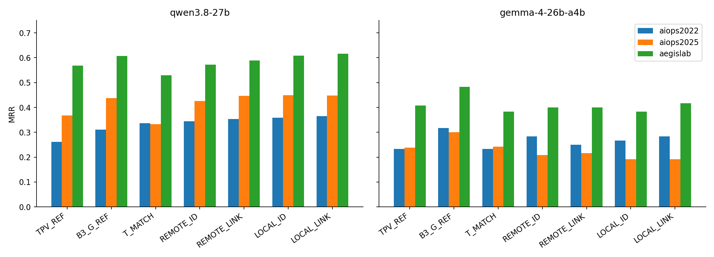
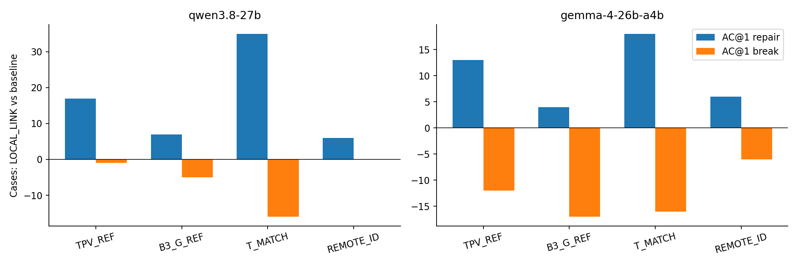
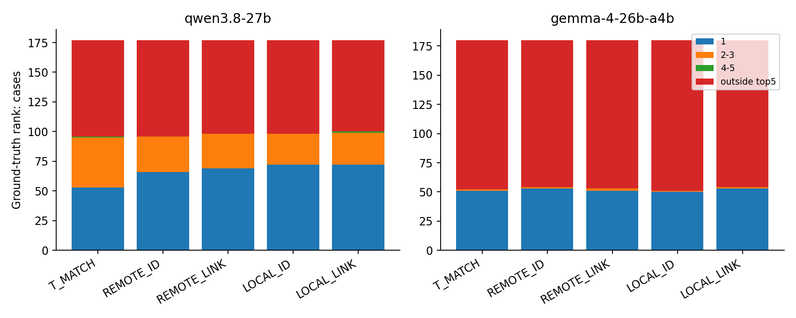
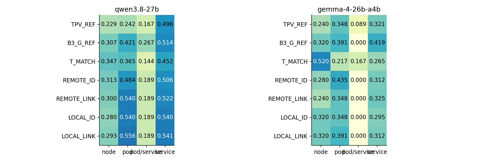
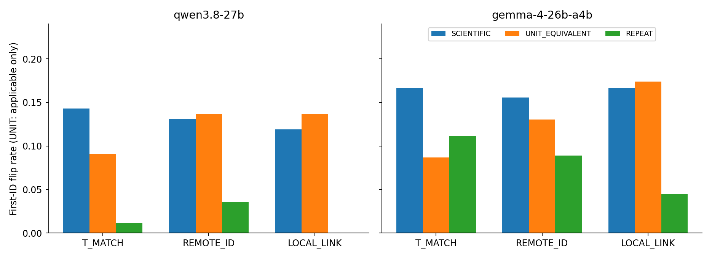
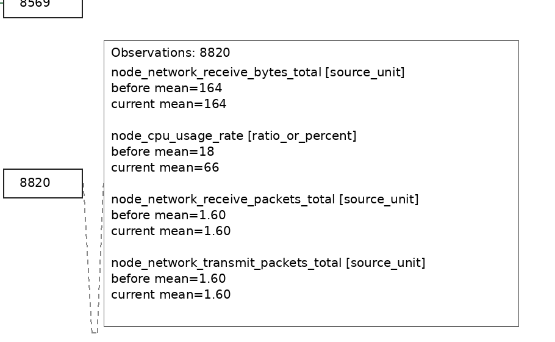
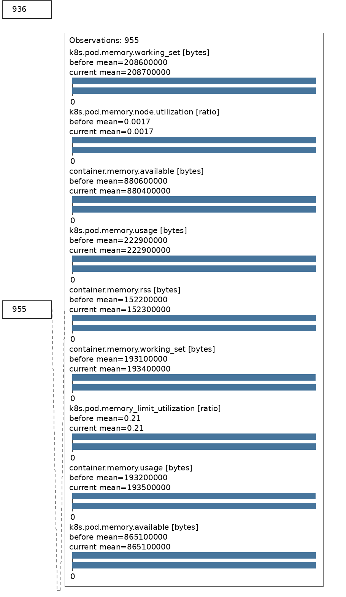
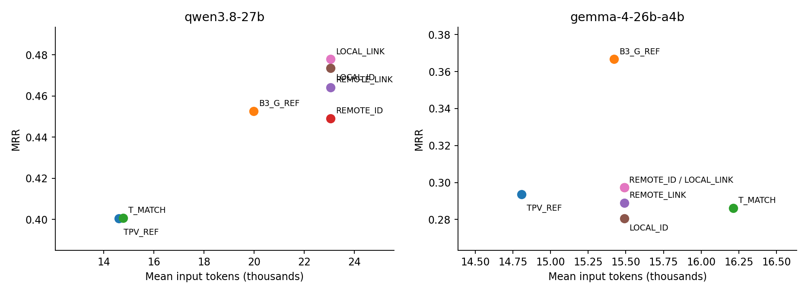

# RQ3.7 实验分析：数值—关系融合的收益、代价与不稳定性

日期：2026-09-28。范围：**已完成的 A、B，以及用户批准的 120 次 TPV 基线补跑**。阶段 C 未运行，本报告不包含新的 test、独立事件或泛化成绩。本次分析没有新增模型调用，没有修改原输入、回答、评分或实验代码。

## 1. 结论先行

这轮不是全部原地踏步，但进展有清楚的边界：

1. **Qwen 的预注册主方法 LOCAL_LINK 在本轮开发病例上，确实优于 TPV。**175 个共同有效案例中，MRR **0.4005 → 0.4776，Δ=+0.0771，八项 Holm 校正 p=0.0171，dz=0.2666**；首位修复 17 例、破坏 1 例。事件组等权敏感性分析仍为正且通过校正检验。
2. **还不能把这项收益独立归因于“数值放近＋虚线连接”。**LOCAL_LINK 相对强文本 T_MATCH 的 ΔMRR=+0.0772，但 Holm p=0.2078；相对旧 B3 图仅 +0.0279，相对 REMOTE_ID 仅 +0.0287，均未通过校正。邻近、连接及交互的析因检验也未通过。
3. **收益不是跨模型稳定的。**Gemma 的 LOCAL_LINK MRR=0.2972，基本等于 TPV 的 0.2935，却低于 B3_G_REF 的 0.3667。相对 B3 的下降为 −0.0694，预注册 Holm p=0.0692；这是值得警惕的退化信号，而不是本轮已确认的显著下降。
4. **Qwen 的改善主要体现在 pod/service，而不是 node。**LOCAL_LINK 的 node/pod/service MRR 分别为 **0.2933/0.5556/0.5409**；同内容文本分别为 **0.3467/0.3651/0.4519**。多层级可接受标签另列，不混入上述三组。
5. **数值字符串是实质性的输入敏感点。**Qwen 在科学计数法条件下，T_MATCH 首位翻转 12/84，原输入重复仅 1/84；LOCAL_LINK 为 10/84 对 0/84。新增的探索性成对翻转检验，在 12 项 Holm family 下分别 p=0.0117、0.0215。**图没有使模型摆脱这种敏感性。**
6. **图中有正确读数，不等于回答会使用这些读数。**实际案例中，根因 node 的 CPU 18→66 清楚可见，模型仍把前后读数近乎不变的文件系统量当成主因；也有根因 ID 答对、解释却虚构调用边或混淆实体类型的情况。
7. **这不是 Qwen 的成本压缩方案。**LOCAL_LINK 平均输入 23,048 tokens，同内容文本 14,773、TPV 14,589。当前结果支持“付出更多输入取得开发集排名改善”，而不是“更准且更省”。

建议：保留 LOCAL_LINK 作为已登记的待验证方法，保留 B3_G_REF 和 T_MATCH 两个关键对照；下一步可以申请执行锁定的 C，而不是再从本批结果挑一种新布局。C 的成本控制推荐条件已全部满足，但这不等于视觉机制得到证明或获得自动运行授权。

## 2. 到底完成了多少，数据是否齐全？

### 2.1 实验与终态

| 项目 | 注册范围 | 完成情况 |
|---|---|---|
| A：融合 | 180 cases × 7 条件 × 2 模型 | 2,520 个逻辑位置均有终态 |
| B：数字表示 | 90 cases × 3 表示 × 3 干预 × 2 模型 | 1,620 个逻辑位置均有终态 |
| TPV 补跑 | 原 screen60 × 2 模型 | 120/120 新调用完成，已接入 A |
| A/B smoke | 每个逻辑 smoke 18 calls | 合计 36，均通过 |
| C：锁定扩展 | RQ480、旧 test360、条件式新事件 | **未启动** |

A 是 AIOPS-2022、AIOPS-2025、AegisLab 各 60 例，B 是各 30 例；**没有 RE2**。180 例沿用历史开发病例，是 repeated-exposed evaluation，不是新的独立测试。

全研究线调用计数由 **21,469 增至 24,643**，本轮增量 **3,174**：

- A/B 正式实际新调用 3,018，其中 3,010 有完整模型结果、8 次基础设施超时。
- TPV 补跑 120。
- A/B smoke 36。

逻辑位置数不等于实际调用数：历史引用、不适用单位变换的复用、以及复用已记录超时均不会再次请求模型。40,000 累计上限剩余 15,357；这不是可以自行增加实验的授权。

正式 A/B 首次提交至最后提交约为本地时间 11:33–14:55；补跑最后一条约 15:07，队列随后正常完成。上述是提交时间范围，不是 GPU 独占计算时间。

### 2.2 超时、模型失败与分析分母

| 项目 | Qwen | Gemma |
|---|---:|---:|
| A 新条件超时逻辑位置 | 4，涉及 3 cases | 0 |
| A 仍不可用的历史引用 | 3：TPV 两例、B3 图一例 | 0 |
| A 五个新条件共同有效 cases | **177** | **180** |
| B 超时逻辑位置 | 7，其中 3 个复用 A 超时，4 个是新超时 | 0 |
| B 与 A 原输入共同有效 cases | **84** | **90** |

基础设施缺失不记模型零分。A 五条件先取共同有效病例；与历史基线的比较再取交集，因此 Qwen 对 TPV 的 n=175，对 B3 的 n=176。B 的共同集确保三表示、三变换及原输入同时可比较。

两项模型失败保留为原有零分，未排除、未修补回答：

- A/Qwen/TPV_REF：`INC-881461551C98` 将 operation 字符串 `130.773/GetQuote` 放进候选，触发 unknown/duplicate entity。
- B/Gemma/REMOTE_ID/UNIT_EQUIVALENT：`INC-491E85FD6009` 在 reason 后持续输出零，达到 **8,192 output tokens**，`finish_reason=length`，JSON 未闭合。

终态核对覆盖全部 4,140 逻辑位置；去重后的 3,727 个成功返回产物组，completion manifest 所列输入、输出、conversation、raw trajectory、PNG 等路径均存在。这里做的是离线分析清单核对，**不是恢复时的全量重建或重新哈希验证**。人工详细检查 9 个案例的跨条件回答与输入，并查看实际原 PNG、单位变换 PNG 和局部原像素截取；不是宣称人工审过所有图。

### 2.3 原来的“历史基线不可用”现已如何处理？

最初 123 个引用位置中，120 个是旧 TPV 的 Trace 单位标签与已修正协议不同，**原结果存在，并非遗失**。用户批准后，60 cases × 2 模型按修正后的既定 TPV 请求重跑；只改已登记单位标签，数值、证据选择、G 图片不变。新回答由独立补跑目录保存，旧回答和旧引用标记保留。

剩余 3 个仍是历史请求超时：Qwen TPV 的 `INC-BD921BAF43A1`、`INC-8D7BC30E2DAB`，及 B3_G 的 `INC-A2F0E757DD2A`。没有额外补跑，也没有置零。本文所有结果已经纳入这 120 次补跑。

## 3. 条件解释与真实干预覆盖

| 条件 | 输入是什么 | 主要回答什么问题 |
|---|---|---|
| TPV_REF | 既定 M/R/L 文本＋原 G 图 | 对强端到端基线是否有进步 |
| B3_G_REF | ALL_ID 资格化补充观测及旧 B3 G 图 | 新数值融合是否超过已有增强图 |
| T_MATCH | 与新图相同观测与关系，按实体组织的强文本 | 视觉是否有同内容增量 |
| REMOTE_ID | 数值面板在独立区域，以 ID 对应实体 | 2×2 的起点 |
| REMOTE_LINK | 同上，增加观测归属虚线 | 远距离时显式绑定是否有帮助 |
| LOCAL_ID | 面板移近所属实体，不增加虚线 | 邻近是否有帮助 |
| LOCAL_LINK | 邻近＋观测归属虚线 | 预注册主方法 |

所有新图仍完整提供 M/R/L 文本，数值面板是已有事实的冗余编码。**本轮不是纯 dashboard 对纯 text，也不是新的证据选择实验。**TPV 与 ALL_ID 内容并不完全相同，TPV 差值是系统级增益；纯组织解释应依靠同内容对照和析因结果。

180 个案例的五新条件，保存的 fact hash、panel hash 各只有一个值；四视觉条件共用一个 geometry hash，各有四个不同像素 hash；同一条件在两个模型间的源图 hash 相同。没有重现“换 arm 名但像素没变”的旧问题。这些全量标记核对结合既有 CPU qualification 与人工像素检查，不等于对每张图做了独立 OCR 证明。

### 3.1 一个重要事实：不是每个案例都真的画了柱形图

| 数据集 | Cases | 有至少一个连续量柱形图 | 柱形图观测数 / 全部前后观测数 | 平均 PNG 高度 |
|---|---:|---:|---:|---:|
| AIOPS-2022 | 60 | **0** | 0 / 720 | 4,580 px |
| AIOPS-2025 | 60 | **0** | 0 / 720 | 4,484 px |
| AegisLab | 60 | **44** | 285 / 720 | 4,192 px |

全部图宽 2,304 px；高度范围 3,640–5,408，未触及 8,192 上界。每例十二条已选 Metrics 都保留前后读数；未知语义或未核实单位按协议显示读数，而非伪造连续量柱形图。

因此，AIOPS 的提升发生在**关系图＋数值读数面板的组织**上，不能写成“成对条形图让 AIOPS 的数字比较更准确”。实际连续量图形覆盖集中于 AegisLab；单位换算实验也主要受同一可用性约束。这是解释实验实际测到了什么的必要信息。

## 4. 主结果：各模型、各数据集

### 4.1 Qwen

| 条件 | n | Pooled MRR | AC@1 | AC@3 | AC@5 | AVG@3 | AVG@5 |
|---|---:|---:|---:|---:|---:|---:|---:|
| TPV_REF | 175 | 0.4005 | 0.3143 | 0.4971 | 0.5143 | 0.4171 | 0.4560 |
| B3_G_REF | 176 | 0.4527 | 0.3977 | 0.5284 | 0.5284 | 0.4640 | 0.4898 |
| T_MATCH | 177 | 0.4007 | 0.2994 | 0.5367 | 0.5424 | 0.4200 | 0.4689 |
| REMOTE_ID | 177 | 0.4492 | 0.3729 | 0.5424 | 0.5424 | 0.4689 | 0.4983 |
| REMOTE_LINK | 177 | 0.4642 | 0.3898 | 0.5537 | 0.5537 | 0.4840 | 0.5119 |
| LOCAL_ID | 177 | 0.4736 | 0.4068 | 0.5537 | 0.5537 | 0.4915 | 0.5164 |
| **LOCAL_LINK** | **177** | **0.4779** | **0.4068** | **0.5593** | **0.5650** | **0.4953** | **0.5232** |

| 条件 | AIOPS-2022 | AIOPS-2025 | AegisLab | 两 AIOPS 合并 | 三数据集等权 macro |
|---|---:|---:|---:|---:|---:|
| TPV_REF | 0.2617 | 0.3672 | 0.5678 | 0.3154 | 0.3989 |
| B3_G_REF | 0.3103 | 0.4379 | 0.6073 | 0.3746 | 0.4518 |
| T_MATCH | 0.3362 | 0.3333 | 0.5292 | 0.3348 | 0.3996 |
| REMOTE_ID | 0.3448 | 0.4266 | 0.5722 | 0.3860 | 0.4479 |
| REMOTE_LINK | 0.3534 | 0.4463 | 0.5889 | 0.4003 | 0.4629 |
| LOCAL_ID | 0.3592 | **0.4492** | 0.6083 | 0.4046 | 0.4722 |
| LOCAL_LINK | **0.3649** | 0.4477 | **0.6167** | **0.4067** | **0.4764** |

新条件三个数据集分别 n=58/59/60；TPV 为 57/59/59；B3 为 58/59/59。表内横向相减不是严格配对效应，正式结论使用下一节。

LOCAL_LINK 是预注册主方法，也恰为本批 Qwen 总体最高，但不在每个数据集都最高。LOCAL_ID 与它接近，不应事后将 AIOPS-2025 换成 LOCAL_ID 拼一个新答案。

### 4.2 Gemma

| 条件 | n | MRR | AC@1 | AC@3 | AC@5 | AVG@3 | AVG@5 |
|---|---:|---:|---:|---:|---:|---:|---:|
| TPV_REF | 180 | 0.2935 | 0.2889 | 0.3000 | 0.3000 | 0.2944 | 0.2967 |
| **B3_G_REF** | **180** | **0.3667** | **0.3667** | **0.3667** | **0.3667** | **0.3667** | **0.3667** |
| T_MATCH | 180 | 0.2861 | 0.2833 | 0.2889 | 0.2889 | 0.2870 | 0.2878 |
| REMOTE_ID | 180 | 0.2972 | 0.2944 | 0.3000 | 0.3000 | 0.2981 | 0.2989 |
| REMOTE_LINK | 180 | 0.2889 | 0.2833 | 0.2944 | 0.2944 | 0.2907 | 0.2922 |
| LOCAL_ID | 180 | 0.2806 | 0.2778 | 0.2833 | 0.2833 | 0.2815 | 0.2822 |
| LOCAL_LINK | 180 | 0.2972 | 0.2944 | 0.3000 | 0.3000 | 0.2981 | 0.2989 |

| 条件 | AIOPS-2022 | AIOPS-2025 | AegisLab | 两 AIOPS 合并 |
|---|---:|---:|---:|---:|
| TPV_REF | 0.2333 | 0.2389 | 0.4083 | 0.2361 |
| B3_G_REF | **0.3167** | **0.3000** | **0.4833** | **0.3083** |
| T_MATCH | 0.2333 | 0.2417 | 0.3833 | 0.2375 |
| REMOTE_ID | 0.2833 | 0.2083 | 0.4000 | 0.2458 |
| REMOTE_LINK | 0.2500 | 0.2167 | 0.4000 | 0.2333 |
| LOCAL_ID | 0.2667 | 0.1917 | 0.3833 | 0.2292 |
| LOCAL_LINK | 0.2833 | 0.1917 | 0.4167 | 0.2375 |

Gemma 每数据集均 60 例，所以三数据集 macro 等于 pooled。它的最佳条件仍是旧 B3 图，三个数据集一致；这比仅说“模型间存在差异”更具体：**额外数值面板在此配置下没有巩固 B3 的已有收益。**



## 5. 显著性、析因和缺失敏感性

### 5.1 预注册八项 primary family

均为 LOCAL_LINK 减去基线；两模型四项比较共同校正。p 为双侧 Pratt-Wilcoxon；dz 为配对差值均值除以差值标准差。

| 模型 | 对照 | n | 配对 ΔMRR | 原始 p | Holm p | dz | 首位 repair / break |
|---|---|---:|---:|---:|---:|---:|---:|
| Qwen | TPV_REF | 175 | **+0.0771** | 0.0021 | **0.0171** | 0.2666 | **17 / 1** |
| Qwen | B3_G_REF | 176 | +0.0279 | 0.1027 | 0.5135 | 0.1053 | 7 / 5 |
| Qwen | T_MATCH | 177 | +0.0772 | 0.0346 | 0.2078 | 0.1747 | 35 / 16 |
| Qwen | REMOTE_ID | 177 | +0.0287 | 0.1795 | 0.7181 | 0.1563 | 6 / 0 |
| Gemma | TPV_REF | 180 | +0.0037 | 0.9864 | 1.0000 | 0.0098 | 13 / 12 |
| Gemma | B3_G_REF | 180 | −0.0694 | 0.0099 | 0.0692 | −0.2058 | 4 / 17 |
| Gemma | T_MATCH | 180 | +0.0111 | 0.7374 | 1.0000 | 0.0253 | 18 / 16 |
| Gemma | REMOTE_ID | 180 | 0.0000 | 1.0000 | 1.0000 | 0.0000 | 6 / 6 |

Qwen 对 TPV 同时满足项目 ΔMRR≥0.05 与 Holm p<0.05 的实质性提升标准；这里指**本次开发集中的系统级比较**。T_MATCH 的点估计提升同样大，但修复和破坏都多、配对方差更大，因此没有通过多重比较检验；不是算错，也不是应删掉破坏案例。

对 TPV 的三个数据集配对差值为 +0.1096/+0.0805/+0.0424，方向一致。把七条件都限制到同一 Qwen 174-case 交集，LOCAL_LINK=0.4804、TPV=0.4028、B3=0.4521，方向未变。

### 5.2 两个视觉因素并没有得到独立确认

邻近效应 = `(LOCAL_ID+LOCAL_LINK−REMOTE_ID−REMOTE_LINK)/2`；连接效应相应对 ID/LINK 求差；交互 = `LOCAL_LINK−LOCAL_ID−REMOTE_LINK+REMOTE_ID`。

| 模型 | 效应 | ΔMRR | 六项 Holm p |
|---|---|---:|---:|
| Qwen | 邻近 | +0.0191 | 0.9554 |
| Qwen | 连接 | +0.0097 | 0.7664 |
| Qwen | 交互 | −0.0108 | 0.8735 |
| Gemma | 邻近 | −0.0042 | 1.0000 |
| Gemma | 连接 | +0.0042 | 1.0000 |
| Gemma | 交互 | +0.0250 | 1.0000 |

Qwen 四图点估计呈 REMOTE_ID→REMOTE_LINK→LOCAL_ID→LOCAL_LINK 上升，但差距小、非零差值病例不多，不能将排序本身解释成已建立的普遍规律。Gemma 甚至没有同样的单调趋势。

### 5.3 重叠事件与缺失

Qwen 对 TPV 的事件组分析 n=144 组，ΔMRR=+0.0720、Holm p=0.0092；Gemma 对 B3 为 146 组，Δ=−0.0776、Holm p=0.0681。按事件组汇总没有改变这两项的主要判断。

对 Qwen/TPV 缺失的 5 个注册病例，分别赋予差值最坏 −1 与最好 +1，180-case 总体 Δ 的范围为 **[+0.0472,+0.1028]**。这是极端缺失敏感性范围，**不是置信区间**；最坏端仍为正，但低于 +0.05 门槛。主结果不把缺失当成零分。

## 6. 改善发生在提名还是排序？



| Qwen：LOCAL_LINK 相对 | 原第2–5升至第1 | 原前五外升至第1 | 新进入前五 | 跌出前五 |
|---|---:|---:|---:|---:|
| TPV_REF | 8 | 9 | 18 | 9 |
| B3_G_REF | 2 | 5 | 17 | 10 |
| T_MATCH | **21** | **14** | 24 | 20 |
| REMOTE_ID | 2 | 4 | 8 | 4 |

新进入/跌出前五不与前两列相加；它们是不同切面的计数。

**相对强文本，Qwen 的收益主要表现为把已有候选推到首位，而非大幅增加提名覆盖。**AC@1 净增 19/177=0.1073，AC@5 净增仅 4/177=0.0226。LOCAL_LINK 的 35 个首位修复中，21 个原来已在文本前五。这支持研究竞争候选排序，但前五命中本身不证明模型已正确理解机制。

相对 REMOTE_ID，没有破坏其已有首位正确病例，但仍有 4 例跌出前五、5 例 RR 下降。因此“首位 break=0”不能改写成“任何排名都没有退化”。

Gemma LOCAL_LINK 相对 TPV 新进入前五 14 例、跌出前五也 14 例；相对 B3 则 5 对 17。总体相近不意味着相同病例正确。



Gemma LOCAL_LINK **175/180** 个回答只给一个候选，平均 1.056 个；Qwen 平均 3.192 个。Gemma 的 AC@5 因此几乎等于 AC@1：这是输出行为，不是五个位置都经过有效搜索，也不是本次给 Gemma 填充候选的理由。

## 7. 哪些病例较容易受益，哪些退化？

以下为事后探索，不用于重新选择主方法。dataset、层级、原始 fault_type 各自将全部四基线×两模型子组比较放进一个 Holm family；图形/根因面板特征另设探索性 family。**原始细分 fault 与层级检验没有在这些 family 下获得 p<0.05 的结论。**小样本方向是下一步假设，而非已确认的路由规则。

### 7.1 根因层级

| 模型/条件 | node | pod | service | service/pod 混合可接受标签 |
|---|---:|---:|---:|---:|
| Qwen T_MATCH | 0.3467 (25) | 0.3651 (21) | 0.4519 (116) | 0.1444 (15) |
| Qwen REMOTE_ID | 0.3133 (25) | 0.4841 (21) | 0.5057 (116) | 0.1889 (15) |
| Qwen LOCAL_LINK | **0.2933 (25)** | **0.5556 (21)** | **0.5409 (116)** | 0.1889 (15) |
| Gemma T_MATCH | **0.5200 (25)** | 0.2174 (23) | 0.2650 (117) | 0.1667 (15) |
| Gemma B3_G_REF | 0.3200 (25) | 0.3913 (23) | **0.4188 (117)** | 0.0000 (15) |
| Gemma LOCAL_LINK | 0.3200 (25) | 0.3913 (23) | 0.3120 (117) | 0.0000 (15) |

括号为病例数。15 个混合组病例均来自 AIOPS-2025，历史 evaluator 同时接受对应 service/pod 标签；原简表把它们标成 unknown，本报告明确列出，**不改 accepted labels 或评分，也不将它们当成多份独立病例**。

Qwen pod 相对 TPV Δ=+0.3135，n=21，原始 p=0.0018，但包含全部层级比较的 32 项探索 family 下 Holm p=0.0581。它是强线索，仍不应把小组当成确认性成功。Gemma 新图的主要损失集中在 service：相对 B3，service MRR 0.4188→0.3120；node/pod 两组的 MRR 则相同。

两模型 node 相对 T_MATCH 都下降：Qwen −0.0533，Gemma −0.2000。**本轮没有解决 node 与其受影响 pod/service 的区分问题。**



### 7.2 fault type：不是“只要资源异常就适合图”

列出病例数≥8 的原始 fault 子组，数值为 LOCAL_LINK−T_MATCH；完整逐 fault、逐数据集表见附件，未选择性删除负向行。

| fault type | Qwen n | Qwen ΔMRR | Gemma n | Gemma ΔMRR |
|---|---:|---:|---:|---:|
| HTTPRequestReplaceMethod | 8 | +0.3333 | 8 | −0.1250 |
| HTTPResponseReplaceCode | 8 | +0.0417 | 8 | 0.0000 |
| JVMMemoryStress | 9 | **−0.2222** | 9 | 0.0000 |
| k8s容器网络延迟 | 8 | +0.0833 | 8 | +0.1250 |
| pod failure | 8 | 0.0000 | 8 | 0.0000 |

同为数值／资源相关故障，并没有一致正效应；HTTPRequestReplaceMethod 的大点估计只覆盖 8 例，不能用它声称对所有 HTTP 故障有效。全部原始 fault family 校正后未显著。

### 7.3 直接面板、孤立实体与真实柱形图

采用窄定义：**根因可接受 numeric ID 本身拥有十二条 M 中的数值面板**，不把候选名单、G 端点或关联 pod 自动算入。这不等于“没有面板就没有任何根因证据”。

- Qwen 有根因直接面板的 84 例：T_MATCH 0.6141、LOCAL_LINK 0.7113；无直接面板的 93 例：0.2079→0.2670。两组都可能改善，但前者绝对表现更高，仍混有故障类型与数据集差异。
- 根因面板实体在展示关系中孤立的 21 个 Qwen 病例：T_MATCH 0.5317、LOCAL_LINK 0.7024；然而 REMOTE_ID 已为 0.7063。**不能将相对文本的改善专门归于拉近面板。**
- AegisLab 的 44 个真实柱形图病例：Qwen T_MATCH 0.6023→LOCAL_LINK 0.7386，Gemma 0.4318→0.5227；无柱形图的 16 例则分别 0.3281→0.2812、0.2500→0.1250。
- 但同样的 44 例里，Gemma 旧 B3 已达 0.5909，高于 LOCAL_LINK。Qwen 对 B3 的共同 43 例也只增加 +0.0116。

这些结果给出比“某数据集图更好”更细的画像：**有可读直接资源观测的案例本身较容易；增加数值面板有时帮助强文本，却未稳定超过已有关系图。**“有柱形图”与“缺柱形图”不是随机分组，不能将两个组的绝对 MRR 差当作柱形图的因果效果。

## 8. 数值等价变换：总体 MRR 隐藏了多少不稳定？

### 8.1 主共同集上的成绩变化

表中均相对 A 同一原请求；SCI=等值科学计数法，UNIT=来源核实后的等价单位，REPEAT=原输入独立再调用。

| 模型 | 表示 | n | SCI ΔMRR | UNIT ΔMRR | REPEAT ΔMRR | SCI 首位翻转 | REPEAT 首位翻转 |
|---|---|---:|---:|---:|---:|---:|---:|
| Qwen | T_MATCH | 84 | +0.0030 | 0.0000 | +0.0050 | 12 | 1 |
| Qwen | REMOTE_ID | 84 | +0.0258 | −0.0139 | −0.0020 | 11 | 3 |
| Qwen | LOCAL_LINK | 84 | −0.0198 | −0.0278 | 0.0000 | 10 | 0 |
| Gemma | T_MATCH | 90 | +0.0056 | 0.0000 | −0.0278 | 15 | 10 |
| Gemma | REMOTE_ID | 90 | +0.0222 | −0.0111 | +0.0278 | 14 | 8 |
| Gemma | LOCAL_LINK | 90 | −0.0500 | −0.0333 | 0.0000 | 15 | 4 |

预注册 12 项等价变换 MRR family 均未通过校正。**MRR 不显著变化不意味着输入不敏感**：例如 Qwen 文本的总体 MRR 几乎不变，却有 12 例换了首位；正负变化会抵消，错误答案之间切换也可能完全不改变 MRR。

用同一 case 的“变换是否首位翻转”与“REPEAT 是否首位翻转”做精确成对 McNemar/binomial 检验，新增探索性 12 项 family：

- Qwen T_MATCH/SCI：只在 SCI 翻转 11 例、只在 REPEAT 翻转 0 例，Holm p=0.0117。
- Qwen LOCAL_LINK/SCI：10 对 0，Holm p=0.0215。
- Qwen REMOTE_ID/SCI：9 对 1，Holm p=0.1934。
- Gemma LOCAL_LINK/SCI：14 对 3，Holm p=0.1273；其余 Gemma 条件也未通过校正。

这是单次重复配方下的结果，不估计完整采样分布；图文三个 arm 不能合并当成三倍独立样本。当前数据表明 Qwen 的数字写法敏感性不只是已观察到的重复波动，而**没有证据表明融合图抑制了它**。



图中 SCI/REPEAT 使用主共同集，UNIT 使用实际适用集，三柱分母并非全部相同；单位干预的严格同病例重复对照见下一表，不能直接用图中两柱高差替代成对检验。

### 8.2 单位换算只在适用病例上看，会怎样？

主共同集中 Qwen 只有 22 例、Gemma 23 例真正发生 UNIT 干预，均为 AegisLab；其余复用原结果，不是模型经受换算后仍稳定。

| 模型 | 表示 | 适用 n | UNIT ΔMRR | UNIT 首位翻转 | 同一适用集 REPEAT 首位翻转 |
|---|---|---:|---:|---:|---:|
| Qwen | T_MATCH | 22 | 0.0000 | 2 | 0 |
| Qwen | REMOTE_ID | 22 | −0.0530 | 3 | 1 |
| Qwen | LOCAL_LINK | 22 | **−0.1061** | 3 | 0 |
| Gemma | T_MATCH | 23 | 0.0000 | 2 | 1 |
| Gemma | REMOTE_ID | 23 | −0.0435 | 3 | 3 |
| Gemma | LOCAL_LINK | 23 | **−0.1304** | 4 | 1 |

LOCAL_LINK 的单位变化分别损失 2.333 和 3.0 个 RR 总和；Qwen 三例均退化，Gemma 三例评分退化、另有一例仅换错误首位。适用集小，不能把这些点估计升级为确定的普遍损失，但它们说明全 84/90 例稀释后的均值掩盖了风险。

实际 UNIT 保存的共同几何保持不变，读取的示例 bytes→十进制 kB 转换同步到数值、指标展示名和单位；ratio 不变。干预仍改变数字字符串、token 长度和图中文字，并非“完全相同像素”。它检验输入等价性鲁棒性，不是检验两次 bitwise 相同输入。

## 9. 真实案例：成功、失败，以及答对但理由不对

以下是机制例证，不能代替全量失败比例。修复/破坏候选先按模型×对照×数据集分组，再按 case hash 选例；另加单位翻转和原理上重要的 node 例。完整输入链接、所有对照回答及 PNG 来源在 [案例证据附件](RQ3_7_Results_Analysis_2026-09-28_assets/case_evidence.md)。

### 9.1 网络延迟：根因排名修复，但解释虚构一条边

`INC-B63AC53AB86F`，AIOPS-2022，pod 根因 `92244`。

- Qwen T_MATCH MRR=1；REMOTE_ID 与旧 B3=0；LOCAL_LINK=1。
- 实际 Trace 文本明确绑定 `92244`、`GetProduct`、exclusive p95 4529.0→2866679.1 µs、log2 变化 9.31。这是可核实的局部延迟证据。
- LOCAL_LINK 正确采用这个候选，但 reason 又称 `92244` 调用 `27456`。保存的具体调用/部署边中**没有该边**，并把五位 pod ID 称为 service。
- 同 case 的 Gemma 方向相反：REMOTE_ID 正确，LOCAL_LINK 误选 `128`，被高 MRT/异常分数吸引。

这同时展示 **图可能改变证据权重、模型间并不一致、正确答案不保证关系解释正确**。也不能说只有 LOCAL_LINK 能找到这个信号，因为强文本已经答对。

### 9.2 Node CPU：证据清楚显示，仍错误解释为另一实体的文件系统故障

`INC-6E6E1B20F2D5`，AIOPS-2025，node 根因 `8820`。

实际数值面板：`8820` 的 CPU 前后均值 **18→66**；实体 `802` 的 filesystem free bytes **4,900,000,000→4,900,000,000**、usage **47→47**。三位 `802` 在匿名契约中是 service，不是 node。

Qwen：T_MATCH MRR=1，REMOTE_ID=0.5，LOCAL_LINK=0。LOCAL_LINK 的 reason 却称“node 802 的文件系统事件”为主因，将 `8820` 的 CPU 异常解释为次生现象。图中文字和归属关系没有将模型从显著性分数的叙事中拉回来。



这是**证据利用/竞争解释失败**的直接例证，不宜再用“缺少根因证据”解释。它也不能证明模型看过图而故意忽略：这里只能观察到输入可见、输出未正确使用。

### 9.3 Node I/O：两个模型都由文本正确转向 pod 症状

`INC-FDC8B6B87BEB`，AIOPS-2022，node 磁盘写 I/O，根因 `3466`。

T_MATCH 两模型均首位正确。LOCAL_LINK Qwen 转向 `33486` 的 Trace 延迟，Gemma 转向 `68315` 的 page fault；两者 MRR 均为 0。它与总体 node 分层的负向差值一致：**更多可见的 pod 局部异常，未必帮助识别故障发生的基础设施层级。**

### 9.4 HTTP 状态码故障：显著延迟可以压过错误响应／文件系统证据

`INC-992C09A89DC9`，AegisLab，HTTPResponseReplaceCode；可接受标签 `841/746`。

文本两模型均正确选 `746`。LOCAL_LINK Qwen 将 `746` 降至第二，Gemma 则误选延迟显著的 `374`。实际面板含 `746` filesystem 1.2M→9.7M，Trace/log 文本也存在；并非该观测被 renderer 删除。

不过，文本正确回答也把 filesystem 增加说成故障原因，而真实 fault 是 HTTP response code 注入。**排名命中只能说明定位正确，不证明故障机制解释正确。**

### 9.5 NetworkPartition：有价值的调用关系＋耗时比较，但旧图也已做到

`INC-B77D2FD0C248`，AegisLab；可接受 `115/126`。

Qwen 文本把接近零的 CPU/JVM 读数解释成 `704` 停止，正确候选只排第二；REMOTE_ID、LOCAL_LINK、旧 B3 均将 `126` 排第一。输入可核实 `564→126` 调用边及 `126` 的操作级长延迟，说明在多个症状竞争时，关系与局部耗时的联合解释有用。

但 LOCAL_LINK reason 额外声称 `126→257`，保存的具体边清单并没有这条关系。这个例子支持进一步研究**可核验的关系使用**，不支持宣布新虚线独立解决了问题。

### 9.6 等价单位：几乎一样长的条形图，也不能阻止错误的“内存压力”叙事

`INC-331437929E47`，AegisLab，NetworkCorrupt；可接受 `186/962`。

Gemma LOCAL_LINK：NATIVE、SCIENTIFIC、REPEAT 都正确；UNIT_EQUIVALENT 改选 `955`，MRR 从 1 降至 0。`955` 实际是三位 service；内存 rss 前后约 152.2M→152.3M bytes，可用内存 880.6M→880.4M，图中前后条长非常接近。模型却称为 pod 的严重内存压力，压过真正被接受的延迟候选。



这不是显示信息被删掉。单位换算后，几何未变而语词/数字呈现改变，足以使某次输出的解释与排名改变。**用比例保持的柱形图冗余编码，仍不等于获得数值不变性。**

另一例 `INC-491E85FD6009`，JVMException 根因 `496`，Qwen 原图与 REPEAT 正确、换单位后错误；Gemma 的 REMOTE_ID/UNIT 还出现本轮唯一的新输出截断。即使原图答对，部分 reason 也把 848-sigma 误写为“848 倍增长”；图上的 filesystem 均值实际是约 0.98M→4.4M，而非 848 倍。

## 10. 解释可靠性：实体类型错误仍广泛存在

额外使用保守规则扫描公开 reason 中明确的 `service/pod/node + 数字ID`，与 private 的既定实体类型映射比对；只算 ID 确实存在的明确称呼，不用 LLM 自动判因果。每个回答只计“至少一处”。

| 条件 | Qwen 明确类型不一致 / n | Gemma 明确类型不一致 / n |
|---|---:|---:|
| TPV_REF | 36/175 | 61/180 |
| B3_G_REF | 21/176 | 48/180 |
| T_MATCH | **22/177** | **39/180** |
| REMOTE_ID | 32/177 | 76/180 |
| REMOTE_LINK | 42/177 | 68/180 |
| LOCAL_ID | 35/177 | 70/180 |
| LOCAL_LINK | **32/177** | **84/180** |

这一指标是**显式措辞/绑定不一致**，不是全部 hallucination 率，也不能直接判断模型内部是否混淆。已有 scorer 仍按候选 ID 评分，reason 的名称错不改变原得分。人工案例确认其中有真实的 node/service 混用；其他泛称习惯需要逐例区别。

就当前可观察输出而言，新融合图没有显示更低的实体类型错误率。把“MRR 上升”直接写成“诊断解释更可靠”，会漏掉本轮很重要的负向发现。

## 11. 成本、运行与视觉可读性

### 11.1 同模型 token 成本

| 模型 | 条件 | 文本输入 | 图像输入 | 总输入 | 输出 | 请求 wall 均值（秒） |
|---|---|---:|---:|---:|---:|---:|
| Qwen | TPV_REF | 12,503 | 2,086 | 14,589 | 164 | 117.8 |
| Qwen | B3_G_REF | 13,071 | 6,914 | 19,985 | 149 | 134.5 |
| Qwen | T_MATCH | 14,773 | 0 | 14,773 | 158 | 230.1 |
| Qwen | LOCAL_LINK | 13,114 | **9,934** | **23,048** | 153 | 234.2 |
| Gemma | TPV_REF | 13,723 | 1,085 | 14,808 | 109 | 36.5 |
| Gemma | B3_G_REF | 14,356 | 1,066 | 15,422 | 115 | 20.2 |
| Gemma | T_MATCH | 16,214 | 0 | 16,214 | 118 | 47.1 |
| Gemma | LOCAL_LINK | 14,403 | **1,086** | **15,489** | 118 | 46.7 |

四个新图的输入 tokens 在各模型内相同，因为源尺寸/共同文字预算固定。Qwen LOCAL_LINK 相对 T_MATCH 输入约 **+56.0%**，相对 TPV约 **+58.0%**；输出略低，并未抵消输入增加。Gemma 相对 T_MATCH 输入约 −4.5%，但相对 B3 几乎一样且 MRR 较低。



不同模型 token 单位不是同一硬件成本。请求 wall 包含队列/并发影响；历史基线与新 arm 的批次时段也不同，不能据此宣称某表示纯计算慢几倍，更不能相加当成 GPU 小时。

本轮全部 3,174 个新请求中，成功返回的 usage 累计输入约 **57.94M**、其中图像 **12.72M**，输出 **0.435M** tokens，包含 smoke 与模型失败回答。8 次超时缺少最终 usage，不能当作完全没有计算成本；这些总数是已观测用量，不是精确总 GPU/能耗账单。全部推理本地执行，无 API 计费含义。

### 11.2 同一 PNG 在两个模型中不是同等视觉带宽

同一源图在 Qwen 平均约 9,934 image tokens，而 Gemma约 1,086，差约 9.15 倍。图本身又有 4K–5K 高度、长 G 明细及为 2×2 预留的空白区域。人工查看的源 PNG 保留了读数与标签；这不证明两个模型的实际视觉分辨能力相同。

**“Gemma 在此图上不受益，可能与更低的有效视觉容量及文本竞争有关”是有根据的候选解释，但不是本轮已分离的因果结论。**没有在本轮修改 processor、字体或压缩规则，也没有新增 attention 存储。

### 11.3 一个需要记录的运维语义

上述 Gemma 截断回答的实际 wall 为 **879.4 秒**，持续流式输出 8,192 tokens。源码将 300 秒传给 OpenAI SDK 的请求 timeout，流式路径没有额外总 wall deadline；这个值不能视为“每条回答总耗时绝不超过 300 秒”。持续收到 chunk 的生成可能超过 300 秒。

本轮已经正常终止，输出也按截断零分完整保留；本次不改代码、不据此重跑。若后续希望强制绝对 300 秒，需要单独明确运行契约，否则更改会影响可返回答案的长度和失败分布。

## 12. 对后续研究的明确判断

### 12.1 哪些问题获得了新答案？

- **系统是否更有效？**Qwen 相对 TPV，在本轮暴露开发集上有达到项目门槛的改善；Gemma没有对应收益。
- **为什么比 TPV 好？**有稳定的系统级方向和修复案例，但资格化附加观测、G 接口和数值面板一起参与，尚未拆出“新连线/邻近”的独立贡献。
- **纯视觉增量是否成立？**同内容文本对照显示 Qwen 正向点估计，但预注册检验未确认。AIOPS 又没有实际连续量柱形图，更应准确描述为读数—关系组织。
- **解决了哪些诊断失败？**部分 pod/service 候选排序，以及局部 Trace 与其他症状竞争的案例；没有统一解决 node 故障与 pod 症状混淆。
- **真实条形图是否让数字变化更可靠？**它没有保证单位/数字写法不变性，也没有自动阻止把小幅资源变化解读成严重根因。
- **正确性与可靠性是否一致？**不一致。定位正确时仍有虚构边、σ 与倍数混淆、ID 类型错误；正确首位和可信理由应分开报告。

### 12.2 是否进入 C？

已冻结的推荐规则全部通过：

| 检查 | 当前值/状态 |
|---|---|
| Qwen 三数据集 paired macro：LL−TPV ≥0.03 | **+0.0775** |
| Qwen LL−T_MATCH macro >0 | **+0.0769** |
| Qwen 各数据集相对 TPV 下降不超过0.03 | 三者均为正 |
| Gemma macro 相对 TPV 下降不超过0.03 | **+0.0037** |
| 两模型 node 相对 TPV 下降不超过0.05，且n≥20 | Qwen n=24、Gemma n=25，均通过 |

这是探索性扩量规则，不是总体非劣证明，尤其**不代表 node 相对强文本没有退化**。因此我的建议是：有理由做一次锁定 C 来确认 Qwen 的增益是否保留，而不是立即再造一个新方法。

若用户决定继续，保持预定 LOCAL_LINK 不动；固定 TPV、B3_G、T_MATCH、REMOTE_ID、LOCAL_LINK 五条件。兼容的 A 结果复用，RQ480/旧 test360 分开报告，旧 test 仍标为已暴露；新事件只有完整审计后才纳入。保持 Gemma，不能只保留对本方法有利的 Qwen。

在 C 结果前不根据这里的 pod/HTTP 子组做 case 路由，不改显示容量，不把负向 Gemma 从主表移除，也不启动新一轮选择器或 RL。若未来继续方法开发，最值得针对的是**让原始数值、标准化异常分数、实体类型和关系证据发生冲突时有可检验的处理方式**，而不是再次泛泛调整布局。那应属于新的锁定假设，不在本次报告中自动实施。

当前 180-case MRR 0.48 左右，仍远未达到长期 test≥0.65、两个 AIOPS≥0.60 的目标；这次值得验证的进展不应被包装成研究终点。

## 13. 可复现产物与口径

主要权威：

- [实验协议](../../RQs/RQ3_7/descriptions/RQ3_7_experiments.md)，含 DD-RQ37-1 精简与 DD-RQ37-2 补跑授权。
- [主结果目录](../../RQs/RQ3_7/results/fusion_v2_pruned/)、[TPV 补跑目录](../../RQs/RQ3_7/results/tpv_reference_backfill_v1/)。
- Frozen contract：`1a8d2032bb94718e3a23b62d1a62e331b0b1b671410312b78e22b1dc756997a2`。
- [注册分析输出](../../RQs/RQ3_7/results/fusion_v2_pruned/analysis/)，及 [本报告复算脚本](../../RQs/RQ3_7/scripts/analysis/report_analysis.py)。

报告附件：

- [所有主/次指标与成本](RQ3_7_Results_Analysis_2026-09-28_assets/all_metrics.csv)
- [A 共同集逐样本记录](RQ3_7_Results_Analysis_2026-09-28_assets/A_core_records.csv)
- [原始 fault × 数据集 × 条件表](RQ3_7_Results_Analysis_2026-09-28_assets/fault_performance.csv)
- [全部探索性分层及 Holm](RQ3_7_Results_Analysis_2026-09-28_assets/exploratory_strata.csv)
- [注册检验](RQ3_7_Results_Analysis_2026-09-28_assets/registered_comparisons.json)、[数值稳健性](RQ3_7_Results_Analysis_2026-09-28_assets/registered_robustness_statistics.json)
- [单位适用集](RQ3_7_Results_Analysis_2026-09-28_assets/applicable_robustness.json)、[翻转相对 REPEAT 检验](RQ3_7_Results_Analysis_2026-09-28_assets/exploratory_flip_vs_repeat.json)
- [失败清单](RQ3_7_Results_Analysis_2026-09-28_assets/failures.csv)、[产物完整性](RQ3_7_Results_Analysis_2026-09-28_assets/integrity.json)
- [真实动作与像素标记审计](RQ3_7_Results_Analysis_2026-09-28_assets/manipulation_audit.json)
- [案例回答/输入索引](RQ3_7_Results_Analysis_2026-09-28_assets/case_evidence.md)、[PNG 来源与 hash](RQ3_7_Results_Analysis_2026-09-28_assets/case_artifact_index.json)

复算：在项目根目录执行以下离线命令。第一个重新汇总已有完成标记，不启动服务；第二个只读取完成结果并生成本报告附件。

```bash
source scripts/env_local.sh
"$CANVASRCA_PYTHON" -m RQs.RQ3_7.src.main analyze
/home/lglsj/CanvasRCA/venvs/tools/bin/python RQs/RQ3_7/scripts/analysis/report_analysis.py
```

原始评分沿用固定 granularity-aware contract，不修改历史答案、不填充候选；主检验沿用已登记 family。补充的差值保留 12 位小数以消除浮点并列误差，主比较结论与原注册分析一致。所有资产含标签/故障分层的部分仅用于 evaluator-private 离线分析，不能进入模型输入或用于宣称本批是未接触测试。
