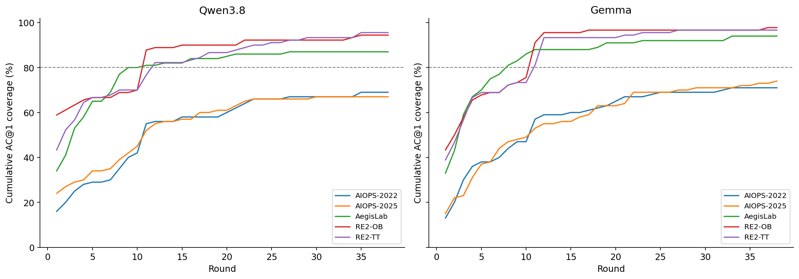
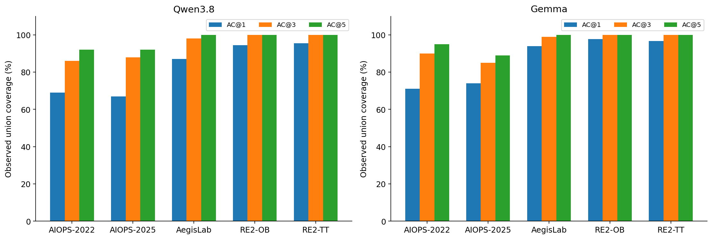
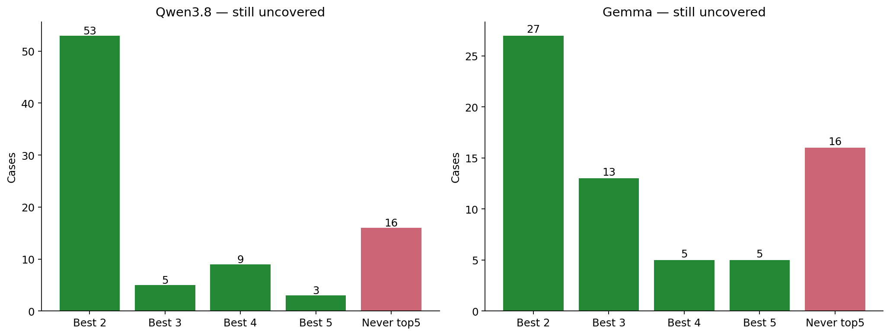
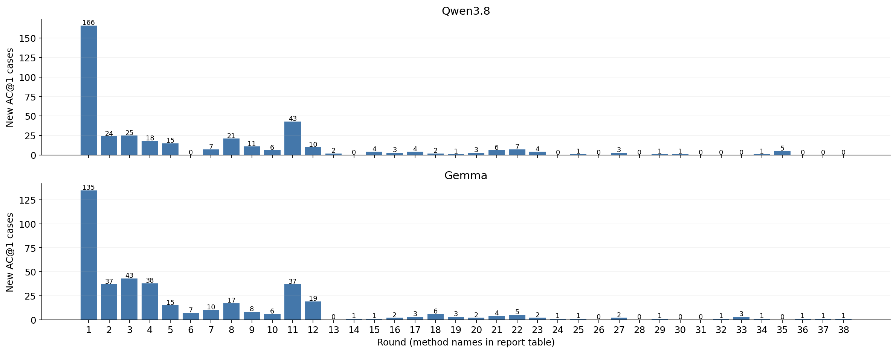
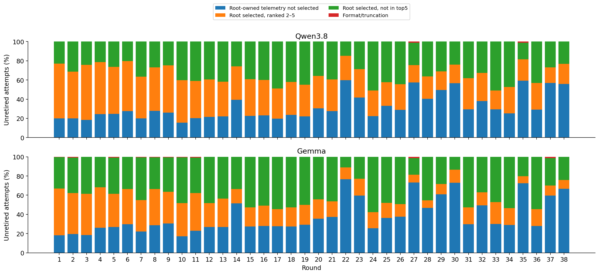
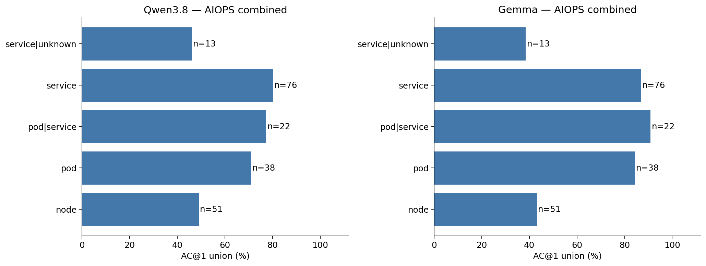

# RQ3 淘汰赛：覆盖、失败环节与候选 X 方法系统分析

日期：2026-09-15。状态：按用户要求停止淘汰赛；本次仅离线分析，新增模型调用为0。

## 1. 先说结论

1. **我们已经找到一组有明显互补性的方法，但没有找到一个能自动选择正确答案的单一方法。** Qwen累计AC@1覆盖394/480（82.1%），Gemma为414/480（86.3%）；两者AC@5均为464/480（96.7%）。这是“至少某次答对”的覆盖，不是部署一个模型一次诊断就有96.7%准确率。
2. **余下问题更多地集中到候选辨别与排序，但不只是排序。** Qwen未覆盖86例中70例曾进前五，Gemma未覆盖66例中50例曾进前五；两模型分别仍有16例从未进入前五。
3. **单纯继续更换异常分数，收益已经非常小。** 第29–38轮共1,617条逻辑结果，仅新增17个模型×case成功。后期需要能区分“根因”和“看起来更异常的受害者/同机症状”的证据，而非只增加异常强度排序器。
4. **所有剩余case的候选集合均可命中标签，且根因所属实体的直接遥测都曾被选到。** 这排除了“这些case从来没有根因实体的任何遥测”的解释，但不等于真正的致因指标已经完整、清晰、同时显示。
5. **节点级故障是两套AIOPS的共同短板。** 不能把“某服务慢/报错”直接解释成该服务就是源头；宿主机、pod、service三个层次需要可辨别的证据。
6. **第11轮的Metrics文本化是一个值得保留的强发现。** 在相同选中事实集合下，Qwen新增43例、Gemma37例；说明已有证据的读取/比较方式可以比换一个筛选器更重要。这不是全量随机对照，但也不是新增加根因遥测后的收益。
7. **答对根因不等于解释正确。** 末轮Gemma的新增成功仍包含“候选不存在”、错绑M编号、捏造Trace/依赖关系等可核验错误。因此AC@1/3/5与reason可靠性必须分开看。
8. **候选X方法应改为“面向竞争根因的对比式证据选择”。** 按公开遥测产生候选解释，再优先挑选能区分这些解释的证据包；不是跳过排名头部，而是改变真正的诊断评分，使有区分力的证据排到头部。本报告只提出方案，不编写或测试X。

## 2. 统计口径与核验

范围为coverage登记且两模型均提交完成的第1–38轮，共**10,789条模型×轮次×case逻辑结果**；其中10,229次新请求、560条复用结果。第1轮采用已修正trace单位的`round_0001_unitfix_v2`；早期后来删除的小样本第2–10轮不纳入。第39轮rank-band方法被用户否决，只有部分CPU生成物，没有模型结果，不计为第39次有效实验。

本次逐条复核记录内容hash、prompt文件hash、76个模型轮次的完整剩余cohort、首名命中与提交状态，核对跨模型共同case的实际system/text/image-hash一致；全部对上，conversation路径齐全。没有逐张重新hash全部PNG；历史轮次的输入/图片完整性审计是相应权威记录，另对文中代表图做人工复核。原始结果、评分器、模型配置、prompt、renderer及processed数据均未修改。

**术语：**“淘汰/覆盖”指某模型在某个case至少一次把可计分根因排第一；“本轮新增”是在本轮前尚未覆盖、该轮首次成功的case。AC@K为根因是否在前K位；MRR为正确候选名次的倒数，前五以外记0。本报告的最佳MRR取各case已运行方法的最大值，是离线oracle上界，不是部署性能。根因匹配沿用原granularity-aware scorer，service标签可命中相应pod，精确pod/node标签按原契约匹配；accepted中的别名/多种可接受名保留，不重新定义答案。

每轮只运行本模型尚未覆盖的全部case；因此后轮面对更难的集合，原始本轮命中率不能直接排列“方法强弱”。已经退场的case没有后轮结果，记为未测而不是失败。配对比较取同一case在相邻轮次的结果；选择集合、读取方式、采样均可能影响结果。统计单位为case；逐轮统计明确为条件性描述，未将10,789次尝试当作10,789个独立case。

## 3. AC@1 / AC@3 / AC@5覆盖

注意：全体480的AC1超过80%，不等于达到“每个数据集各80%”的淘汰目标。两个模型在两个AIOPS数据集均未达到80%；本次停止源于用户终止探索，而非全数据集门槛已经满足。

| 模型 | 数据集 | N | 累计AC@1 | 累计AC@3 | 累计AC@5 | 未覆盖 | 第1轮MRR | 已观测最佳MRR |
|---|---|---|---|---|---|---|---|---|
| Qwen3.8 | AIOPS-2022 | 100 | 69/100 (69.00%) | 86/100 | 92/100 | 31 | 0.2970 | 0.7862 |
| Qwen3.8 | AIOPS-2025 | 100 | 67/100 (67.00%) | 88/100 | 92/100 | 33 | 0.3147 | 0.7790 |
| Qwen3.8 | AegisLab | 100 | 87/100 (87.00%) | 98/100 | 100/100 | 13 | 0.4843 | 0.9300 |
| Qwen3.8 | RE2-OB | 90 | 85/90 (94.44%) | 90/90 | 90/90 | 5 | 0.7556 | 0.9722 |
| Qwen3.8 | RE2-TT | 90 | 86/90 (95.56%) | 90/90 | 90/90 | 4 | 0.6354 | 0.9778 |
| Qwen3.8 | 两个AIOPS合并 | 200 | 136/200 (68.00%) | 174/200 | 184/200 | 64 | 0.3058 | 0.7826 |
| Qwen3.8 | 三个主数据集合并 | 300 | 223/300 (74.33%) | 272/300 | 284/300 | 77 | 0.3653 | 0.8317 |
| Qwen3.8 | 全部480 | 480 | 394/480 (82.08%) | 452/480 | 464/480 | 86 | 0.4891 | 0.8855 |
| Gemma | AIOPS-2022 | 100 | 71/100 (71.00%) | 90/100 | 95/100 | 29 | 0.2425 | 0.8043 |
| Gemma | AIOPS-2025 | 100 | 74/100 (74.00%) | 85/100 | 89/100 | 26 | 0.2270 | 0.7957 |
| Gemma | AegisLab | 100 | 94/100 (94.00%) | 99/100 | 100/100 | 6 | 0.4627 | 0.9658 |
| Gemma | RE2-OB | 90 | 88/90 (97.78%) | 90/90 | 90/90 | 2 | 0.6374 | 0.9889 |
| Gemma | RE2-TT | 90 | 87/90 (96.67%) | 90/90 | 90/90 | 3 | 0.5191 | 0.9833 |
| Gemma | 两个AIOPS合并 | 200 | 145/200 (72.50%) | 175/200 | 184/200 | 55 | 0.2347 | 0.8000 |
| Gemma | 三个主数据集合并 | 300 | 239/300 (79.67%) | 274/300 | 284/300 | 61 | 0.3107 | 0.8553 |
| Gemma | 全部480 | 480 | 414/480 (86.25%) | 454/480 | 464/480 | 66 | 0.4110 | 0.9043 |

**Qwen3.8的剩余case：**最佳曾到第2名53例、第3名5例、第4名9例、第5名3例、始终不在前五16例。曾进入前五的case，应优先研究比较/排序；始终未进前五的case，应连同证据选择、诊断语义、实体绑定一起研究。

**Gemma的剩余case：**最佳曾到第2名27例、第3名13例、第4名5例、第5名5例、始终不在前五16例。曾进入前五的case，应优先研究比较/排序；始终未进前五的case，应连同证据选择、诊断语义、实体绑定一起研究。

| 模型 | AIOPS范围 | AC1覆盖数 | AC3覆盖数 | AC5覆盖数 | 分母 |
|---|---|---|---|---|---|
| Gemma | AIOPS-2022 | 71 | 90 | 95 | 100 |
| Gemma | AIOPS-2025 | 74 | 85 | 89 | 100 |
| Gemma | 两个AIOPS合并 | 145 | 175 | 184 | 200 |
| Qwen3.8 | AIOPS-2022 | 69 | 86 | 92 | 100 |
| Qwen3.8 | AIOPS-2025 | 67 | 88 | 92 | 100 |
| Qwen3.8 | 两个AIOPS合并 | 136 | 174 | 184 | 200 |

两个模型共同未覆盖**49个不同case**；Qwen独有未覆盖37例、Gemma独有17例。这证明存在模型条件差异，不支持把所有余例归为同一种数据缺陷。两模型×多方法联合至少一次AC1命中431/480，仅作跨模型oracle参考，不是一个新系统的实测性能。

## 4. 38轮方法与实际增量

R1是初始输入；R2–10含原生工具、容量和证据变化；R11/12/13/15是单模态文本化；R16是实体绑定卡片；R17–38才是固定R16表示后的选择器探索。不能把38轮全部描述成纯选择器实验。下表N为该轮实际剩余cohort，新增率的分母正是N。

| 轮 | 方法/变化 | Qwen N/新增 | 新增率 | Gemma N/新增 | 新增率 |
|---|---|---|---|---|---|
| 1 | 类型明确的初始概览 | 480 / +166 | 34.58% | 480 / +135 | 28.12% |
| 2 | BARO稳健偏离排序 | 314 / +24 | 7.64% | 345 / +37 | 10.72% |
| 3 | Trace支持度/置信度 | 290 / +25 | 8.62% | 308 / +43 | 13.96% |
| 4 | 日志模板频次 | 265 / +18 | 6.79% | 265 / +38 | 14.34% |
| 5 | 三倍标准差指标 | 247 / +15 | 6.07% | 227 / +15 | 6.61% |
| 6 | Trace状态计数 | 232 / +0 | 0.00% | 212 / +7 | 3.30% |
| 7 | 曲线形状去冗余 | 232 / +7 | 3.02% | 205 / +10 | 4.88% |
| 8 | 实体跨来源融合 | 225 / +21 | 9.33% | 195 / +17 | 8.72% |
| 9 | 同类实体相对偏移 | 204 / +11 | 5.39% | 178 / +8 | 4.49% |
| 10 | 资源家族与节点补充 | 193 / +6 | 3.11% | 170 / +6 | 3.53% |
| 11 | Metrics改用文本，其余仍为图 | 187 / +43 | 22.99% | 164 / +37 | 22.56% |
| 12 | Traces改用文本，其余仍为图 | 144 / +10 | 6.94% | 127 / +19 | 14.96% |
| 13 | Logs改用文本，其余仍为图 | 134 / +2 | 1.49% | 108 / +0 | 0.00% |
| 14 | Trace局部关联的指标对比 | 132 / +0 | 0.00% | 108 / +1 | 0.93% |
| 15 | Topology改用文本，其余仍为图 | 132 / +4 | 3.03% | 107 / +1 | 0.93% |
| 16 | 候选实体绑定卡片 | 128 / +3 | 2.34% | 106 / +2 | 1.89% |
| 17 | 实体/指标家族诊断覆盖 | 125 / +4 | 3.20% | 104 / +3 | 2.88% |
| 18 | 日志意外程度 | 121 / +2 | 1.65% | 101 / +6 | 5.94% |
| 19 | Trace本地耗时 | 119 / +1 | 0.84% | 95 / +3 | 3.16% |
| 20 | 时间窗口变化 | 118 / +3 | 2.54% | 92 / +2 | 2.17% |
| 21 | 波动方差变化 | 115 / +6 | 5.22% | 90 / +4 | 4.44% |
| 22 | 传播前沿 | 109 / +7 | 6.42% | 86 / +5 | 5.81% |
| 23 | 异构来源共识 | 102 / +4 | 3.92% | 81 / +2 | 2.47% |
| 24 | 时间异常片段覆盖 | 98 / +0 | 0.00% | 79 / +1 | 1.27% |
| 25 | 计数器速率变化 | 98 / +1 | 1.02% | 78 / +1 | 1.28% |
| 26 | 事件窗口形态 | 97 / +0 | 0.00% | 77 / +0 | 0.00% |
| 27 | 源头优先的跨模态证据包 | 97 / +3 | 3.09% | 77 / +2 | 2.60% |
| 28 | 频谱显著性 | 94 / +0 | 0.00% | 75 / +0 | 0.00% |
| 29 | 条件残差 | 94 / +1 | 1.06% | 75 / +1 | 1.33% |
| 30 | 低秩背景与稀疏异常 | 93 / +1 | 1.08% | 74 / +0 | 0.00% |
| 31 | 子序列异常 | 92 / +0 | 0.00% | 74 / +0 | 0.00% |
| 32 | 核分布变化 | 92 / +0 | 0.00% | 74 / +1 | 1.35% |
| 33 | 日志比例/不平衡 | 92 / +0 | 0.00% | 73 / +3 | 4.11% |
| 34 | 调用操作组成变化 | 92 / +1 | 1.09% | 70 / +1 | 1.43% |
| 35 | 图扩散 | 91 / +5 | 5.49% | 69 / +0 | 0.00% |
| 36 | 可加指标分解 | 86 / +0 | 0.00% | 69 / +1 | 1.45% |
| 37 | 近锚点脉冲 | 86 / +0 | 0.00% | 68 / +1 | 1.47% |
| 38 | 持续尾部异常 | 86 / +0 | 0.00% | 67 / +1 | 1.49% |

### 4.1 哪些方法提供了不同的有效视角？

以下结论都针对该轮实际剩余集合，而非推断未测试case的反事实表现。原生组件的来源/适配身份保留在[完整方法登记](Tournament_Analysis_2026-09-15_assets/methods.json)和各轮源码快照中；例如BARO使用其组件，不代表完整BARO系统复现。

| 轮 | 策略 | 数据集 | Qwen新增 | Gemma新增 |
|---|---|---|---|---|
| 2 | BARO稳健偏离排序 | AegisLab | 7 | 10 |
| 2 | BARO稳健偏离排序 | AIOPS-2022 | 4 | 7 |
| 2 | BARO稳健偏离排序 | AIOPS-2025 | 3 | 7 |
| 2 | BARO稳健偏离排序 | RE2-OB | 2 | 6 |
| 2 | BARO稳健偏离排序 | RE2-TT | 8 | 7 |
| 3 | Trace支持度/置信度 | AegisLab | 12 | 16 |
| 3 | Trace支持度/置信度 | AIOPS-2022 | 5 | 10 |
| 3 | Trace支持度/置信度 | AIOPS-2025 | 2 | 1 |
| 3 | Trace支持度/置信度 | RE2-OB | 2 | 7 |
| 3 | Trace支持度/置信度 | RE2-TT | 4 | 9 |
| 4 | 日志模板频次 | AegisLab | 5 | 8 |
| 4 | 日志模板频次 | AIOPS-2022 | 3 | 6 |
| 4 | 日志模板频次 | AIOPS-2025 | 1 | 8 |
| 4 | 日志模板频次 | RE2-OB | 2 | 7 |
| 4 | 日志模板频次 | RE2-TT | 7 | 9 |
| 8 | 实体跨来源融合 | AegisLab | 8 | 4 |
| 8 | 实体跨来源融合 | AIOPS-2022 | 5 | 4 |
| 8 | 实体跨来源融合 | AIOPS-2025 | 4 | 3 |
| 8 | 实体跨来源融合 | RE2-OB | 2 | 3 |
| 8 | 实体跨来源融合 | RE2-TT | 2 | 3 |
| 11 | Metrics改用文本，其余仍为图 | AegisLab | 1 | 2 |
| 11 | Metrics改用文本，其余仍为图 | AIOPS-2022 | 13 | 10 |
| 11 | Metrics改用文本，其余仍为图 | AIOPS-2025 | 7 | 4 |
| 11 | Metrics改用文本，其余仍为图 | RE2-OB | 16 | 14 |
| 11 | Metrics改用文本，其余仍为图 | RE2-TT | 6 | 7 |
| 12 | Traces改用文本，其余仍为图 | AIOPS-2022 | 1 | 2 |
| 12 | Traces改用文本，其余仍为图 | AIOPS-2025 | 3 | 2 |
| 12 | Traces改用文本，其余仍为图 | RE2-OB | 1 | 4 |
| 12 | Traces改用文本，其余仍为图 | RE2-TT | 5 | 11 |
| 18 | 日志意外程度 | AegisLab | 0 | 1 |
| 18 | 日志意外程度 | AIOPS-2022 | 0 | 1 |
| 18 | 日志意外程度 | AIOPS-2025 | 0 | 4 |
| 18 | 日志意外程度 | RE2-TT | 2 | 0 |
| 21 | 波动方差变化 | AegisLab | 1 | 0 |
| 21 | 波动方差变化 | AIOPS-2022 | 2 | 2 |
| 21 | 波动方差变化 | AIOPS-2025 | 2 | 1 |
| 21 | 波动方差变化 | RE2-TT | 1 | 1 |
| 22 | 传播前沿 | AIOPS-2022 | 2 | 0 |
| 22 | 传播前沿 | AIOPS-2025 | 2 | 5 |
| 22 | 传播前沿 | RE2-OB | 2 | 0 |
| 22 | 传播前沿 | RE2-TT | 1 | 0 |
| 27 | 源头优先的跨模态证据包 | AegisLab | 1 | 0 |
| 27 | 源头优先的跨模态证据包 | AIOPS-2022 | 1 | 0 |
| 27 | 源头优先的跨模态证据包 | AIOPS-2025 | 0 | 1 |
| 27 | 源头优先的跨模态证据包 | RE2-TT | 1 | 1 |
| 35 | 图扩散 | AIOPS-2022 | 2 | 0 |
| 35 | 图扩散 | RE2-OB | 1 | 0 |
| 35 | 图扩散 | RE2-TT | 2 | 0 |

Trace支持度/置信度与日志频次在早期仍有较大互补空间；Metrics文本化提供的是读取/比较层面的互补；方差、传播前沿、日志异常程度在后期带来少量新case。频谱显著性、近邻子序列异常等无增量结果同样有价值：它们说明“统计意义上的异常”不自动变成“能定位根因的证据”。

### 4.2 配对统计：有没有不止零散成功的改善？

| 轮 | 模型 | 同剩余case ΔMRR | paired Cohen dz | Holm p |
|---|---|---|---|---|
| 3 | Qwen3.8 | +0.1093 | 0.366 | 1.47e-06 |
| 11 | Qwen3.8 | +0.1753 | 0.479 | 2.73e-05 |
| 3 | Gemma | +0.1254 | 0.374 | 9.13e-07 |
| 4 | Gemma | +0.1299 | 0.400 | 4.45e-05 |
| 8 | Gemma | +0.0810 | 0.280 | 0.0479 |
| 11 | Gemma | +0.2314 | 0.619 | 3.52e-10 |

检验为Pratt-zero Wilcoxon；每模型×报告范围内37个相邻轮次比较做Holm校正，不报置信区间。dz为差值均值/差值标准差。这里是经过适应性筛选后的探索统计，不能当作预注册的独立确认。全部正、负、不显著的比较均保存在[paired_round_tests.csv](Tournament_Analysis_2026-09-15_assets/paired_round_tests.csv)。

### 4.3 一条特别重要的机制证据：第10→11轮

| 模型 | 配对N | selected fact集合相同 | 新增AC1 |
|---|---|---|---|
| Gemma | 164 | 164 | 37 |
| Qwen3.8 | 187 | 187 | 43 |

第11轮将Metrics移到文本、R/L/G仍放图。根因数据不是这轮才加入；两个模型的全部新增成功都在前一轮已经含根因直接遥测。因此“读取数值/绑定实体/比较证据”是明确候选瓶颈。但该干预同时改变像素与文本承载、token数、空出的画布内容，不能只归因于某一种视觉微机制。

### 4.4 不同方法覆盖的模式，具体不同在哪里？

从已观察到的首次成功看，可以区分三种互补：**曝光互补**（新方法选入上轮未选的根因证据，如R34→R35的productcatalog案例；不表示所有更早轮次都未选到）；**对比/上下文互补**（根因M已经在，但换日志或竞争实体上下文后成功，如R33的JVM案例）；**承载互补**（事实集合相同，Metrics转为文字后成功，如R10→R11）。三者都能增加覆盖，但X的设计应分别记录，不能全称为“增加了信号召回”。

后期成功并非每次都表现为对应模态的直接根因证据增加：R33名为日志不平衡，却可在根因L=0时成功；R35名为图扩散，却可以靠图指导选中整组根因M/R/L，而最终root-linked G不一定增多。因此**方法名不等于起效模态**。附录每轮的成功/失败根因M/R/L统计用于检查这种差别。

## 5. 每轮失败在哪里：从可观测环节拆分

“直接遥测”仅指M/R/L事实owner能按原scorer匹配根因；候选名单、成员归属说明和G上的邻接不算直接遥测。**owner匹配不是致因信号已经足够**：例如node的一条普通网络计数无法必然解释node内存故障。以下分类互斥且按顺序判定，保留对证据不足与推理不明的区别。

| 观测到的失败环节 | Qwen尝试数 | Gemma尝试数 |
|---|---|---|
| 格式/截断 | 2 | 13 |
| 本轮未选根因直接遥测 | 1531 | 1495 |
| 本轮已选，根因排2–5 | 2080 | 1328 |
| 本轮已选，根因未进前五 | 1729 | 1803 |

以上是尝试次数，同一未覆盖case可在多轮进入不同格，不能相加当作不同case。分类优先级使得“本轮未选直接遥测、却凭间接证据排进前五”仍归入未选直接遥测；Top-K完整统计另行提供，不会丢掉这类局部成功。选中但不在前五只能定位到下游处理环节，不能自动标成perception错误或reasoning错误。

**“曾经选到过”与“这次选到了”不能混为一谈。** 全部9,981次未Top1尝试中，3,026次本轮没有root-owned M/R/L，占30.32%；R17–38中这一类仍有1,574次。故不能得出“选择问题已经彻底解决，只剩reasoning”。此外，Qwen有50、Gemma51次本轮无直接根因M/R/L却把根因排入前五；间接证据、已有候选先验和备选排序都可能贡献提名，AC5本身不足以证明看到了根因直接信号。

**Qwen3.8：**完整但未Top1的回答中，89.53%自报high confidence；29.01%在reason里出现根因数字ID；17.42%把完整公开调用图中根因的直接上下游排第一。后者是邻接关系，不证明受害者因果关系，其余错误也不能因无直接边就排除间接传播。检测到66条“本轮无Trace条目但reason谈trace/local latency”候选错误，需要逐条语义复核才能称全部为幻觉。

**Gemma：**完整但未Top1的回答中，95.33%自报high confidence；21.42%在reason里出现根因数字ID；16.28%把完整公开调用图中根因的直接上下游排第一。后者是邻接关系，不证明受害者因果关系，其余错误也不能因无直接边就排除间接传播。检测到55条“本轮无Trace条目但reason谈trace/local latency”候选错误，需要逐条语义复核才能称全部为幻觉。

此轮集合中残余基础设施失败为0；Qwen模型格式失败2条，Gemma13条（分别占0.035%和0.257%）。7条finish=length，其余10,782条finish=stop。格式问题远不足以解释当前的低AC1增量。此处计已提交有效轮次，不统计被撤销运行或资格测试的历史算力消耗。

## 6. 早期、后期与始终未覆盖case的数据差异

固定分层：R1首次覆盖；R2–16首次覆盖；R17–38首次覆盖；至R38未覆盖。“很后面”另列R29–38。分层边界按协议变化/十轮窗口定义，不以最显著结果选分割点。

| 模型 | 首次覆盖阶段 | N | 曾Top3 | 曾Top5 | 根因M数中位 | 根因R数中位 | 根因L数中位 | 根因最大 / z / 中位 |
|---|---|---|---|---|---|---|---|---|
| Gemma | R1 | 135 | 135 | 135 | 6.0 | 3.0 | 363.0 | 999.00 |
| Gemma | R17-38 | 38 | 38 | 38 | 38.5 | 1.0 | 375.0 | 94.69 |
| Gemma | R2-16 | 241 | 241 | 241 | 29.0 | 3.0 | 364.0 | 806.10 |
| Gemma | uncovered | 66 | 40 | 50 | 36.0 | 0.0 | 0.0 | 24.26 |
| Qwen3.8 | R1 | 166 | 166 | 166 | 6.0 | 3.0 | 351.0 | 999.00 |
| Qwen3.8 | R17-38 | 39 | 39 | 39 | 23.0 | 3.0 | 380.0 | 308.10 |
| Qwen3.8 | R2-16 | 189 | 189 | 189 | 35.0 | 3.0 | 389.0 | 430.80 |
| Qwen3.8 | uncovered | 86 | 58 | 70 | 35.5 | 0.5 | 165.5 | 32.96 |

z是已保存公共pool中的标准化偏离统计，存在999封顶，不是故障概率；不同模态的分数不能直接比较。L数是template×entity×bin事实数，不是原始日志行数，模板事件多也不等于有用信号多。所有这些特征来自保留public pool，不是重新扫描raw data后新建的“更完整证据”。

| 模型 | 数据集 | 特征 | 已覆盖中位 | 未覆盖中位 | 秩效应量 | Holm p |
|---|---|---|---|---|---|---|
| Qwen3.8 | AIOPS-2022 | pool_root_M | 43.00 | 38.00 | 0.465 | 0.00207 |
| Qwen3.8 | AIOPS-2022 | pool_root_metric_max_z | 999.00 | 144.90 | 0.430 | 0.00207 |
| Qwen3.8 | AIOPS-2025 | pool_root_M | 43.00 | 12.00 | 0.520 | 0.000221 |
| Qwen3.8 | AIOPS-2025 | pool_root_R | 1.00 | 0.00 | 0.431 | 0.00116 |
| Qwen3.8 | AIOPS-2025 | pool_root_L | 468.00 | 0.00 | 0.402 | 0.00545 |
| Qwen3.8 | AIOPS-2025 | pool_root_metric_max_z | 999.00 | 7.08 | 0.564 | 2.58e-05 |
| Qwen3.8 | AegisLab | pool_root_metric_max_z | 357.00 | 59.42 | 0.567 | 0.00884 |
| Gemma | AIOPS-2022 | pool_root_M | 43.00 | 38.00 | 0.458 | 0.00296 |
| Gemma | AIOPS-2022 | pool_root_R | 1.00 | 0.00 | 0.337 | 0.0422 |
| Gemma | AIOPS-2022 | pool_root_L | 435.00 | 0.00 | 0.450 | 0.00296 |
| Gemma | AIOPS-2022 | pool_root_metric_max_z | 999.00 | 43.12 | 0.741 | 3.52e-09 |
| Gemma | AIOPS-2025 | pool_root_M | 43.00 | 11.50 | 0.647 | 9.74e-06 |
| Gemma | AIOPS-2025 | pool_root_R | 1.00 | 0.00 | 0.471 | 0.000742 |
| Gemma | AIOPS-2025 | pool_root_L | 375.00 | 0.00 | 0.519 | 0.000455 |
| Gemma | AIOPS-2025 | pool_root_metric_max_z | 302.95 | 7.28 | 0.510 | 0.000598 |
| Gemma | AegisLab | pool_root_L | 1825.50 | 4614.50 | -0.670 | 0.0405 |

这里按dataset、model比较不同case，Mann–Whitney检验与秩二列效应量，正值表示已覆盖组更高；每model×scope的10个特征构成一个Holm family。这些是关联，不是特征的独立因果效应；root granularity与来源覆盖会相互混杂。完整特征、所有p值以及逐轮成功/失败比较均随报告保存。

### 6.1 节点、Pod、Service与根因实体

| 模型 | 根因为node且本轮有直接证据的失败尝试 | 误选其他node | 误选pod | 误选service |
|---|---|---|---|---|
| Qwen3.8 | 732 | 132 | 277 | 323 |
| Gemma | 868 | 99 | 450 | 319 |

即使本轮已选到node的直接遥测，错误Top1仍大多落到pod/service。这是需要X针对的**诊断层次竞争**：node异常存在，不代表node异常在公开证据中足以区分“宿主故障”与“pod引起宿主压力”；不能简单把四位ID一律提前。

图中的pod|service、service|unknown表示accepted别名集合涉及不同粒度或某别名不在类型字典；不是新建的故障粒度、也不是自动认定多根因。原始接受规则保持不变。特别地，评分认可某service及其pods不等于模型精确定位到某一个故障pod；涉及这类解释时不能比scorer更细。

| 模型 | 范围 | node覆盖 | node总数 | node未覆盖 | 全部未覆盖 |
|---|---|---|---|---|---|
| Gemma | AIOPS-2022 | 11 | 29 | 18 | 29 |
| Gemma | AIOPS-2025 | 11 | 22 | 11 | 26 |
| Gemma | 两个AIOPS合并 | 22 | 51 | 29 | 55 |
| Qwen3.8 | AIOPS-2022 | 15 | 29 | 14 | 31 |
| Qwen3.8 | AIOPS-2025 | 10 | 22 | 12 | 33 |
| Qwen3.8 | 两个AIOPS合并 | 25 | 51 | 26 | 64 |

| 模型 | 数据集 | 可接受根因名/别名集合 | AC1覆盖 | AC5覆盖数 |
|---|---|---|---|---|
| Gemma | AIOPS-2022 | node-5 | 2/8 | 7 |
| Qwen3.8 | AIOPS-2022 | node-3 | 1/4 | 3 |
| Gemma | AIOPS-2022 | node-3 | 1/4 | 3 |
| Gemma | AIOPS-2025 | node-5 | 1/4 | 4 |
| Qwen3.8 | AIOPS-2025 | node-6 | 2/5 | 4 |
| Gemma | AIOPS-2025 | tidb-tikv / tidb-tikv-0 | 5/10 | 7 |
| Qwen3.8 | AIOPS-2022 | node-5 | 4/8 | 8 |
| Qwen3.8 | AIOPS-2022 | emailservice | 2/4 | 4 |
| Qwen3.8 | AIOPS-2022 | shippingservice | 2/4 | 4 |
| Qwen3.8 | AIOPS-2025 | node-5 | 2/4 | 4 |
| Qwen3.8 | AIOPS-2025 | node-8 | 2/4 | 4 |
| Qwen3.8 | AegisLab | ts-seat-service / ts-config-service | 2/4 | 4 |
| Gemma | AIOPS-2022 | node-4 | 2/4 | 4 |
| Gemma | AIOPS-2022 | shippingservice | 2/4 | 3 |
| Gemma | AIOPS-2025 | node-8 | 2/4 | 3 |
| Gemma | AIOPS-2022 | node-6 | 4/7 | 7 |
| Qwen3.8 | AIOPS-2025 | tidb-tikv / tidb-tikv-0 | 6/10 | 9 |
| Gemma | AIOPS-2025 | node-6 | 3/5 | 4 |
| Gemma | AegisLab | ts-basic-service / ts-price-service | 3/5 | 5 |
| Qwen3.8 | AIOPS-2022 | node-6 | 5/7 | 6 |

相同实体名称的重复事件仍是不同case；上表不把一个实体的一次成功推广成该实体全部故障可覆盖。[所有根因实体与fault type覆盖](Tournament_Analysis_2026-09-15_assets/fault_root_coverage.csv)保留小样本项，不仅列大组。

## 7. 五个数据集逐一诊断

### AIOPS-2022

主要困难是node资源故障和一部分网络故障。CPU容器负载两模型都已9/9覆盖，而node内存消耗仅Qwen1/5、Gemma0/5。公共池根因M仍存在，但受害service/pod的强日志、Trace和JVM波动可能抢走排序。应优先验证资源机制、实体层次及不同异常事件的时间对应，而不是对所有series统一提高异常幅度。

| 模型 | 未覆盖 | 其中曾Top3 | 其中曾Top5 | 曾选根因直接遥测 | 曾选根因Trace | 曾选根因Log |
|---|---|---|---|---|---|---|
| Qwen3.8 | 31 | 17 | 23 | 31 | 6 | 6 |
| Gemma | 29 | 19 | 24 | 29 | 7 | 2 |

| Fault type（原始标签） | N | Qwen AC1 | Gemma AC1 | Qwen AC5数 | Gemma AC5数 |
|---|---|---|---|---|---|
| k8s容器网络延迟 | 10 | 7/10 | 6/10 | 9 | 10 |
| k8s容器网络资源包损坏 | 10 | 8/10 | 9/10 | 10 | 10 |
| k8s容器cpu负载 | 9 | 9/9 | 9/9 | 9 | 9 |
| k8s容器网络丢包 | 9 | 6/9 | 8/9 | 7 | 8 |
| k8s容器读io负载 | 9 | 9/9 | 8/9 | 9 | 9 |
| k8s容器内存负载 | 8 | 6/8 | 8/8 | 7 | 8 |
| k8s容器网络资源包重复发送 | 7 | 3/7 | 4/7 | 6 | 6 |
| node 磁盘写IO消耗 | 6 | 5/6 | 2/6 | 6 | 6 |
| node 磁盘空间消耗 | 5 | 4/5 | 4/5 | 5 | 5 |
| k8s容器进程中止 | 5 | 3/5 | 4/5 | 5 | 5 |
| node 内存消耗 | 5 | 1/5 | 0/5 | 4 | 4 |
| node节点CPU故障 | 5 | 2/5 | 3/5 | 4 | 5 |
| node 磁盘读IO消耗 | 5 | 1/5 | 1/5 | 5 | 4 |
| k8s容器写io负载 | 4 | 3/4 | 4/4 | 4 | 4 |
| node节点CPU爬升 | 3 | 2/3 | 1/3 | 2 | 2 |

### AIOPS-2025

node故障、TiDB/进程故障与稀疏Trace/Log是主要剩余簇。两模型pod failure均仅5/13；Qwen/Gemma node cpu stress均2/6。相对地network corrupt、network loss、jvm latency两模型均全覆盖（各组n分别7、5、5）。根因M/R/L事实数及最大偏离显著区分成败；缺少Trace/Log时不能让一个要求跨模态验证的叙事凭空补出验证。

| 模型 | 未覆盖 | 其中曾Top3 | 其中曾Top5 | 曾选根因直接遥测 | 曾选根因Trace | 曾选根因Log |
|---|---|---|---|---|---|---|
| Qwen3.8 | 33 | 21 | 25 | 33 | 7 | 8 |
| Gemma | 26 | 11 | 15 | 26 | 4 | 2 |

| Fault type（原始标签） | N | Qwen AC1 | Gemma AC1 | Qwen AC5数 | Gemma AC5数 |
|---|---|---|---|---|---|
| pod failure | 13 | 5/13 | 5/13 | 9 | 7 |
| node memory stress | 12 | 6/12 | 7/12 | 11 | 10 |
| cpu stress | 8 | 6/8 | 6/8 | 8 | 8 |
| network corrupt | 7 | 7/7 | 7/7 | 7 | 7 |
| network delay | 7 | 6/7 | 7/7 | 7 | 7 |
| node cpu stress | 6 | 2/6 | 2/6 | 5 | 4 |
| memory stress | 6 | 5/6 | 6/6 | 6 | 6 |
| network loss | 5 | 5/5 | 5/5 | 5 | 5 |
| dns error | 5 | 3/5 | 5/5 | 4 | 5 |
| io fault | 5 | 4/5 | 4/5 | 5 | 5 |
| jvm exception | 5 | 3/5 | 5/5 | 5 | 5 |
| jvm latency | 5 | 5/5 | 5/5 | 5 | 5 |
| node disk fill | 4 | 2/4 | 2/4 | 3 | 3 |
| target port misconfig | 3 | 1/3 | 1/3 | 3 | 3 |
| jvm cpu | 3 | 3/3 | 3/3 | 3 | 3 |
| code error | 2 | 1/2 | 1/2 | 2 | 2 |
| jvm gc | 2 | 1/2 | 1/2 | 2 | 2 |
| pod kill | 2 | 2/2 | 2/2 | 2 | 2 |

### AegisLab

总体已接近覆盖饱和，但Qwen仍有13、Gemma6例。剩余全部曾进前五，说明这里优先解决候选竞争顺序比扩大根因实体可见性更有针对性。多重HTTP/JVM/数据库症状可能相互支撑错误故事；晚期log-balance仍带来2个Gemma新case，但不代表新增日志属于根因本身。

| 模型 | 未覆盖 | 其中曾Top3 | 其中曾Top5 | 曾选根因直接遥测 | 曾选根因Trace | 曾选根因Log |
|---|---|---|---|---|---|---|
| Qwen3.8 | 13 | 11 | 13 | 13 | 12 | 11 |
| Gemma | 6 | 5 | 6 | 6 | 5 | 3 |

| Fault type（原始标签） | N | Qwen AC1 | Gemma AC1 | Qwen AC5数 | Gemma AC5数 |
|---|---|---|---|---|---|
| HTTPRequestReplaceMethod | 15 | 13/15 | 14/15 | 15 | 15 |
| JVMMemoryStress | 14 | 14/14 | 14/14 | 14 | 14 |
| HTTPResponseReplaceCode | 13 | 11/13 | 12/13 | 13 | 13 |
| ContainerKill | 8 | 8/8 | 8/8 | 8 | 8 |
| HTTPResponseDelay | 7 | 6/7 | 6/7 | 7 | 7 |
| HTTPRequestDelay | 7 | 5/7 | 6/7 | 7 | 7 |
| HTTPRequestAbort | 6 | 5/6 | 6/6 | 6 | 6 |
| NetworkPartition | 6 | 5/6 | 6/6 | 6 | 6 |
| JVMException | 3 | 3/3 | 3/3 | 3 | 3 |
| NetworkLoss | 3 | 1/3 | 3/3 | 3 | 3 |
| NetworkCorrupt | 3 | 2/3 | 3/3 | 3 | 3 |
| HTTPResponseAbort | 3 | 3/3 | 2/3 | 3 | 3 |
| PodFailure | 2 | 2/2 | 2/2 | 2 | 2 |
| NetworkBandwidth | 2 | 2/2 | 2/2 | 2 | 2 |
| HTTPResponseReplaceBody | 2 | 2/2 | 2/2 | 2 | 2 |
| JVMReturn | 2 | 2/2 | 2/2 | 2 | 2 |
| JVMLatency | 1 | 1/1 | 1/1 | 1 | 1 |
| HTTPRequestReplacePath | 1 | 0/1 | 0/1 | 1 | 1 |
| NetworkDelay | 1 | 1/1 | 1/1 | 1 | 1 |
| PodKill | 1 | 1/1 | 1/1 | 1 | 1 |

### RE2-OB

Qwen85/90、Gemma88/90；所有90例均曾进入两模型前五。后期的图扩散/调用组成及短脉冲方法仍有零星收益。剩余主要属于候选排序而非从未提名根因，但具体故障机制仍需reason核验。

| 模型 | 未覆盖 | 其中曾Top3 | 其中曾Top5 | 曾选根因直接遥测 | 曾选根因Trace | 曾选根因Log |
|---|---|---|---|---|---|---|
| Qwen3.8 | 5 | 5 | 5 | 5 | 5 | 2 |
| Gemma | 2 | 2 | 2 | 2 | 2 | 0 |

| Fault type（原始标签） | N | Qwen AC1 | Gemma AC1 | Qwen AC5数 | Gemma AC5数 |
|---|---|---|---|---|---|
| cpu | 15 | 15/15 | 15/15 | 15 | 15 |
| delay | 15 | 11/15 | 13/15 | 15 | 15 |
| disk | 15 | 15/15 | 15/15 | 15 | 15 |
| loss | 15 | 14/15 | 15/15 | 15 | 15 |
| mem | 15 | 15/15 | 15/15 | 15 | 15 |
| socket | 15 | 15/15 | 15/15 | 15 | 15 |

### RE2-TT

Qwen86/90、Gemma87/90；所有90例均曾进前五。条件残差及图扩散覆盖了个别delay/mem/socket事件，表明关系证据可补强边缘case；不能据此推导对稀疏图的AIOPS2025同样有益。

| 模型 | 未覆盖 | 其中曾Top3 | 其中曾Top5 | 曾选根因直接遥测 | 曾选根因Trace | 曾选根因Log |
|---|---|---|---|---|---|---|
| Qwen3.8 | 4 | 4 | 4 | 4 | 4 | 3 |
| Gemma | 3 | 3 | 3 | 3 | 3 | 1 |

| Fault type（原始标签） | N | Qwen AC1 | Gemma AC1 | Qwen AC5数 | Gemma AC5数 |
|---|---|---|---|---|---|
| cpu | 15 | 15/15 | 15/15 | 15 | 15 |
| delay | 15 | 14/15 | 14/15 | 15 | 15 |
| disk | 15 | 15/15 | 15/15 | 15 | 15 |
| loss | 15 | 14/15 | 14/15 | 15 | 15 |
| mem | 15 | 15/15 | 15/15 | 15 | 15 |
| socket | 15 | 13/15 | 14/15 | 15 | 15 |

### 7.1 两个AIOPS合并：可行动的共同点

Qwen的64个AIOPS未覆盖case中48个曾进前五；Gemma55个中39个曾进前五。两模型所有从未进前五的case都落在AIOPS。node级失败占剩余AIOPS相当大一部分；同时也有pod级网络故障和数据库实例故障，不能把X设计成只识别node。合并分析用于找共同薄弱环节；dataset分别统计仍是主依据，避免RE2的高覆盖掩盖AIOPS。

### 7.1a 始终未进入前五的完整清单

| 模型 | case | 数据集 | fault | 可接受根因 | 公共池根因M/R/L条数 |
|---|---|---|---|---|---|
| Gemma | INC-1FDAD91BB9BE | AIOPS-2025 | pod failure | tidb-tidb / tidb-tidb-0 | 4/0/0 |
| Gemma | INC-28E6F5E88478 | AIOPS-2025 | node memory stress | node-7 | 12/0/0 |
| Gemma | INC-48C127B155B6 | AIOPS-2022 | node 内存消耗 | node-2 | 36/0/0 |
| Gemma | INC-50AFA840E6F8 | AIOPS-2025 | pod failure | tidb-tikv / tidb-tikv-0 | 10/0/0 |
| Gemma | INC-5A327CFD860F | AIOPS-2025 | pod failure | tidb-tidb / tidb-tidb-0 | 5/0/0 |
| Gemma | INC-5EADA73E94EC | AIOPS-2025 | node disk fill | node-3 | 11/0/0 |
| Gemma | INC-630A596CDD84 | AIOPS-2022 | k8s容器网络丢包 | currencyservice-0 | 23/2/322 |
| Gemma | INC-64E5D665C311 | AIOPS-2025 | node cpu stress | node-1 | 11/0/0 |
| Gemma | INC-807CFFCD9D3F | AIOPS-2025 | pod failure | tidb-tikv / tidb-tikv-0 | 10/0/0 |
| Gemma | INC-881461551C98 | AIOPS-2025 | pod failure | tidb-tidb / tidb-tidb-0 | 4/0/0 |
| Gemma | INC-B5AB9A371DE9 | AIOPS-2022 | node 磁盘读IO消耗 | node-5 | 38/0/0 |
| Gemma | INC-BD14EEDA08FA | AIOPS-2025 | node memory stress | node-8 | 12/0/0 |
| Gemma | INC-CD6BD563E846 | AIOPS-2022 | node节点CPU爬升 | node-3 | 36/0/0 |
| Gemma | INC-D9245047C658 | AIOPS-2025 | node cpu stress | node-6 | 10/0/0 |
| Gemma | INC-EDDC755A08F5 | AIOPS-2025 | pod failure | tidb-tikv / tidb-tikv-0 | 11/0/0 |
| Gemma | INC-F8B9BD5ADA9C | AIOPS-2022 | k8s容器网络资源包重复发送 | shippingservice | 74/2/1341 |
| Qwen3.8 | INC-07AA9E05FB97 | AIOPS-2022 | k8s容器内存负载 | shippingservice-1 | 37/1/426 |
| Qwen3.8 | INC-1FDAD91BB9BE | AIOPS-2025 | pod failure | tidb-tidb / tidb-tidb-0 | 4/0/0 |
| Qwen3.8 | INC-28E6F5E88478 | AIOPS-2025 | node memory stress | node-7 | 12/0/0 |
| Qwen3.8 | INC-50AFA840E6F8 | AIOPS-2025 | pod failure | tidb-tikv / tidb-tikv-0 | 10/0/0 |
| Qwen3.8 | INC-5A327CFD860F | AIOPS-2025 | pod failure | tidb-tidb / tidb-tidb-0 | 5/0/0 |
| Qwen3.8 | INC-5EADA73E94EC | AIOPS-2025 | node disk fill | node-3 | 11/0/0 |
| Qwen3.8 | INC-630A596CDD84 | AIOPS-2022 | k8s容器网络丢包 | currencyservice-0 | 23/2/322 |
| Qwen3.8 | INC-6EF79652EA22 | AIOPS-2022 | node 内存消耗 | node-1 | 38/0/0 |
| Qwen3.8 | INC-722933676134 | AIOPS-2022 | k8s容器网络资源包重复发送 | adservice-1 | 30/1/130 |
| Qwen3.8 | INC-881461551C98 | AIOPS-2025 | pod failure | tidb-tidb / tidb-tidb-0 | 4/0/0 |
| Qwen3.8 | INC-91DCB951C96E | AIOPS-2022 | k8s容器网络延迟 | cartservice2-0 | 27/0/0 |
| Qwen3.8 | INC-949F57AFA656 | AIOPS-2022 | k8s容器网络丢包 | productcatalogservice-1 | 40/1/337 |
| Qwen3.8 | INC-BD921BAF43A1 | AIOPS-2022 | node节点CPU故障 | node-6 | 40/0/0 |
| Qwen3.8 | INC-CD6BD563E846 | AIOPS-2022 | node节点CPU爬升 | node-3 | 36/0/0 |
| Qwen3.8 | INC-D573DF313B5A | AIOPS-2025 | dns error | checkoutservice-2 / checkoutservice | 15/1/246 |
| Qwen3.8 | INC-D9245047C658 | AIOPS-2025 | node cpu stress | node-6 | 10/0/0 |

这份清单使“X补什么信号”具体化：许多node/TiDB病例只有根因M，没有根因R/L；也有少量网络pod病例三模态均有根因owner，仍未获提名。前一类应检查资源/状态机制与反证，后一类要检查身份、时间语义及竞争服务的强症状。源pool拥有记录并不意味着raw data中的所有可能诊断字段都已变成当前可选fact；本次审计止于保留的public pool及其选中投影。

### 7.2 时间重叠与域差异：复用另一份数据审计进行交叉核对

将另一agent的结构分析按原始case identity与本次case严格连接，匹配373/480个不同case（该分析未含AegisLab）。只复用采样、图结构和时间窗口元数据，不沿用其旧候选缺失结论；本次当前pool候选可命中已独立重验。这里的重叠/注入元数据仅供离线分析，绝不能作为选择器输入。

| 模型 | 数据集 | 结构条件 | 有此条件覆盖 | 无此条件覆盖 | Holm p |
|---|---|---|---|---|---|
| Gemma | AIOPS-2022 | other_incident_in_window | 33/46 | 38/54 | 1 |
| Gemma | AIOPS-2025 | baseline_overlap | 44/62 | 25/31 | 0.451 |
| Qwen3.8 | AIOPS-2022 | other_incident_in_window | 29/46 | 40/54 | 0.547 |
| Qwen3.8 | AIOPS-2025 | baseline_overlap | 40/62 | 24/31 | 0.242 |

窗口重叠是合理的歧义来源，但其统计不显著时，不能把每个失败都归因于相邻事件污染。X应从公开数据识别不止一个变化片段，并选择可区分片段/候选的证据，而不是读取私有注入时刻定位答案。

## 8. 解释质量：排名成功与诊断论证不是一回事

下面是针对完整公开reason、选中packet、候选和渲染物的定点复核，不是恢复隐藏思维链。批量统计使用可观察签名，人工样例用于核实签名含义；没有声称已人工审阅全部10,789次对话与PNG。

### 同一根因证据，读取方式改变后成功

`INC-90722DCD5A51`，R11 / Qwen3.8，MRR=1.000。R10和R11均有node 6351的load、free memory、write await三条M。R10优先pod，R11两个模型改为node 6351。支持“证据本来在，但未被优先采用”；reason中关于node到pod的因果关系仍不能由名称分组自动证明。

[完整对话](../../RQs/RQ3/results/tournament_v1/round_0011_full_metric_text_rlg_v3/qwen3.8-27b/conversations/90b44afb121e652cd69d6bab939388c15f7615efa5889cd27dd3c313a474500e.md) · [选中证据](../../RQs/RQ3/results/tournament_v1/round_0011_full_metric_text_rlg_v3/gallery/INC-90722DCD5A51/balanced_additive_v1__tournament_hybrid_metric_v1__card_nonthinking_v1.packet.json) · [原始dashboard](../../RQs/RQ3/results/tournament_v1/round_0011_full_metric_text_rlg_v3/gallery/INC-90722DCD5A51/balanced_additive_v1__tournament_hybrid_metric_v1__card_nonthinking_v1.png)

### 晚期图扩散首次显著聚焦根因家族

`INC-11AFCDDD7B6E`，R35 / Qwen3.8，MRR=1.000。R34没有root-owned M/R/L，R35选中22条根因家族M、4条R、2条L；Qwen由前五外变Top1。Trace count显著下降但exclusive latency接近不变，提示吞吐/连接类证据而非只看耗时。公开reason把服务家族成员排序成功，不等于证明某一个pod是物理起点。

[完整对话](../../RQs/RQ3/results/tournament_v1/round_0035_graph_diffusion_v7/qwen3.8-27b/conversations/e3001c8c31b381e59f33b1f7afc54e74f906fdbe54f4c8882e9fbfd382c244cd.md) · [选中证据](../../RQs/RQ3/results/tournament_v1/round_0035_graph_diffusion_v7/gallery/INC-11AFCDDD7B6E/graph_diffusion_v1__tournament_frozen_v1__card_nonthinking_v1.packet.json) · [原始dashboard](../../RQs/RQ3/results/tournament_v1/round_0035_graph_diffusion_v7/gallery/INC-11AFCDDD7B6E/graph_diffusion_v1__tournament_frozen_v1__card_nonthinking_v1.png)

### 末轮答对，但验证故事有明确错误

`INC-27CBD1F8668A`，R38 / Gemma，MRR=1.000。预测12949按原scorer正确；然而367确实在候选中，reason却说不是合法候选；M216属于55408，不属于12949；图中没有Trace条目/调用边，reason却引用Trace并把service 343与其pod成员关系说成依赖关系。这是实体绑定与证据编造的具体例子，不能因为AC1=1就把解释当训练真值。

[完整对话](../../RQs/RQ3/results/tournament_v1/round_0038_sustained_tail_v8/gemma-4-26b-a4b/conversations/4405c64aaf1cea7491f40b459f48c5d4c1d63789a5ef125a51ac60c905e64416.md) · [选中证据](../../RQs/RQ3/results/tournament_v1/round_0038_sustained_tail_v8/gallery/INC-27CBD1F8668A/sustained_tail_v1__tournament_frozen_v1__card_nonthinking_v1.packet.json) · [原始dashboard](../../RQs/RQ3/results/tournament_v1/round_0038_sustained_tail_v8/gallery/INC-27CBD1F8668A/sustained_tail_v1__tournament_frozen_v1__card_nonthinking_v1.png)

### 从未进前五：数据库实例的直接证据本轮再次落选

`INC-1FDAD91BB9BE`，R38 / Qwen3.8，MRR=0.000。可接受根因tidb-tidb / tidb-tidb-0对应314；公共池有4条root-owned M、无R/L。本轮root-owned M/R/L均为0，模型重复选择156等其他实体。历史某轮出现过根因M也不意味着每一轮都保住了有效证据，必须同时看“曾经有”与“当前有没有”。

[完整对话](../../RQs/RQ3/results/tournament_v1/round_0038_sustained_tail_v8/qwen3.8-27b/conversations/9ee977d7d03287edbcd4b1d31868b9ba0775c5982913df97189827074855c295.md) · [选中证据](../../RQs/RQ3/results/tournament_v1/round_0038_sustained_tail_v8/gallery/INC-1FDAD91BB9BE/sustained_tail_v1__tournament_frozen_v1__card_nonthinking_v1.packet.json) · [原始dashboard](../../RQs/RQ3/results/tournament_v1/round_0038_sustained_tail_v8/gallery/INC-1FDAD91BB9BE/sustained_tail_v1__tournament_frozen_v1__card_nonthinking_v1.png)

### 日志策略成功，不等于找到了根因日志

`INC-DB6E9CFCBBEA`，R33 / Gemma，MRR=1.000。根因ts-station-service；成功输入仍是4条root-owned M、0条root-owned R/L。ready从1到0、restarts从0到1、memory和请求耗时构成可读证据；改变的是别处日志上下文与竞争关系。不能把此成功解释成“日志直接定位了根因”。

[完整对话](../../RQs/RQ3/results/tournament_v1/round_0033_log_balance_v7/gemma-4-26b-a4b/conversations/d3fc86da2c4615c7a117b5c0f9a97e91635c21778ab7efc445dbc0ab6e594a16.md) · [选中证据](../../RQs/RQ3/results/tournament_v1/round_0033_log_balance_v7/gallery/INC-DB6E9CFCBBEA/log_balance_v1__tournament_frozen_v1__card_nonthinking_v1.packet.json) · [原始dashboard](../../RQs/RQ3/results/tournament_v1/round_0033_log_balance_v7/gallery/INC-DB6E9CFCBBEA/log_balance_v1__tournament_frozen_v1__card_nonthinking_v1.png)

## 9. 信息、成本与边际收益

| 模型 | 逻辑结果 | 新调用 | input tokens | output tokens | 均input | 均output |
|---|---|---|---|---|---|---|
| Gemma | 5053 | 4789 | 18179608 | 848716 | 3796.1 | 177.2 |
| Qwen3.8 | 5736 | 5440 | 101265362 | 953165 | 18615.0 | 175.2 |

统计只计纳入本报告的已提交轮次；复用请求不重复计token，不把smoke、废弃小样本和撤回请求的历史费用混入。这里都是本地模型，没有API账单；token用于描述计算量，图像token计入input。Qwen/Gemma的processor不同，不能把绝对token数直接当同等硬件成本。

| 模型 | 阶段 | 逻辑尝试 | 新增覆盖 | 每新增需逻辑尝试 |
|---|---|---|---|---|
| Gemma | R1 | 480 | 135 | 3.6 |
| Gemma | R2–10 | 2105 | 181 | 11.6 |
| Gemma | R11–16 | 720 | 60 | 12.0 |
| Gemma | R17–28 | 1035 | 29 | 35.7 |
| Gemma | R29–38 | 713 | 9 | 79.2 |
| Qwen3.8 | R1 | 480 | 166 | 2.9 |
| Qwen3.8 | R2–10 | 2202 | 127 | 17.3 |
| Qwen3.8 | R11–16 | 857 | 62 | 13.8 |
| Qwen3.8 | R17–28 | 1293 | 31 | 41.7 |
| Qwen3.8 | R29–38 | 904 | 8 | 113.0 |

同一model×case下，共877条逻辑结果再次使用之前出现过的完整可见输入，包含请求复用；这些不是同样多次独立新调用。核查首次AC1成功，没有一例与该case之前的失败使用完全相同的可见输入（0例），因此本次新增覆盖均伴随实际输入变化。[空/有例都保留的清单](Tournament_Analysis_2026-09-15_assets/identical_input_first_success.csv)。不过模型存在采样，输入变化后的成功仍不能全部归因于选择器。

未覆盖case平均不是只换了一两次证据：两模型的不同selected-fact集合数中位数都是30。它们的错误Top1实体数中位数分别是Qwen7、Gemma12，最多次错误Top1占各case尝试的比例中位数分别约47.4%、31.6%。因此既有反复锚定同一错误解释，也有在多个错误候选间游移；“再加一个差别很小的分数”不足以解释或消除这两种行为。

## 10. 候选X：面向竞争根因的对比式证据选择（仅设计）

### 10.1 核心改变

不再只问“哪些观测最异常”，而是问：**哪些观测能区分当前几种最合理的根因解释？** 每个候选必须能被一组支持证据与至少一个竞争解释共同检验。排序对象由孤立异常series变为可核验的“候选—机制—证据包”。这不是把原排名中段硬取出来；全部证据重新按诊断区分力排序，再从头部选择。

| 模块 | 选取什么 | 本次结果依据 | 必须防止的错误 |
|---|---|---|---|
| 实体身份与运行层次 | 候选node / pod / service与公开命名、部署关系 | node与pod/service失败集中 | 同名/归属不是调用边；不从私有根因补关系 |
| 资源机制专家 | CPU、内存、I/O、网络各自基线与压力/用量/等待的方向 | node压力往往被服务耗时盖过 | free memory上升、计数下降等不能一律算资源耗尽 |
| 操作与传递专家 | exclusive/inclusive、流量、错误、具体caller→callee | Trace-SC、graph diffusion有互补 | 调用方向不等于故障传播方向 |
| 离散状态/日志语义专家 | ready/restart、pod/process状态、错误模板与对照模板 | 数据库实例、pod failure、日志比例案例 | 日志少或Trace空缺时保留不确定，不伪造跨模态验证 |
| 时间片段与同类对照专家 | 公开变化点、恢复、持续/脉冲、同类peer残差 | 不同窗口/形态方法只解决少量不同余例 | 不使用私有注入时刻；多个片段并存时不强行只有一个起点 |
| 反证选择器 | 能排除最强错误候选的正常/不变/不一致观测 | root已进前五但迟迟不是Top1 | 保留反证，不仅展示支持自选假设的异常 |

### 10.2 如何打分与拼接

先用公开信号为每个候选产生若干可解释机制分数，再对机制支持度做同类型内校准。优先选“改变候选相对次序”的证据：例如两个service均延迟时，下游exclusive latency是否改变、宿主机是否有独立资源压力、同宿主其他pod是否同时受损。约束下选择支持与反证的组合，惩罚只重复同一候选/同一机制的series；不是越多越好，也不是所有模态都必须同意。

建议把证据包的效用分解为：候选区分力 + 实体层次解释力 + 时间/机制一致性 + 新信息覆盖 − 重复 − 无关时段 − 无法可靠绑定的关系。权重目前不指定为“最优”，需独立开发数据验证；不能用当前480的私有标签决定哪个专家应被选中。

排序只控制选择，不篡改原观测和单位。输出仍可使用一张固定dashboard，候选名单留在prompt。若未来允许保留一个模态文本，Metrics文本＋R/L/G图值得作为强对照，而非默认全视觉最好。这里不要求重做renderer或增加调用。

### 10.3 对不同剩余类型的具体目标

- 曾Top2/3：补的是与竞争者对比的反证、源头/受害者和粒度区分，而不是重复更大z-score。
- 仅曾Top4/5：检查根因是否只靠宽松备选进入榜单；需要直接支持与稳定优先级。
- 从未Top5：首先检查关键机制字段是否真的属于可选public pool、是否进预算、是否可读；TiDB/pod-state类不能只靠HTTP latency。
- 数据确有歧义：让X保留多个有依据的候选与明确不确定性；不把“覆盖几乎所有信号”的目标写成保证480例全部可辨识。

### 10.4 将来如何知道X真的有效

只作建议、不在本次执行：在不同于本次适应性探索的数据上，冻结X后与强基线做一次同预算完整对比；同时看AC1/3/5、关键证据选择率、反证可见率、节点粒度错误率和reason可核验率。评价成功必须包括“从前五提升到第一”的转化，以及从未前五案例的新增提名，不能只报告历史方法oracle。若X仍只能复述错误传播故事，即使偶然AC1变好也不能把reason当监督真值。

## 11. 附录：每一轮各数据集的成功与失败画像

每轮列出所有五个数据集和AIOPS/主集/全体合并；列中“新增/本轮N”不等于方法在固定480集上的准确率。失败分型顺序为 **格式；未选直接遥测；已选且排2–5；已选但不在前五**。因此可以逐轮追查没有退场的case究竟停在哪个可观测环节。成功/失败特征全部原数值另存CSV，以下仅选最有解释力的摘要。

### R01｜类型明确的初始概览

原策略ID：`SEARCH22_typed_overview_template_successor_v1`。

| 范围 | Q新增/N | Q AC3 | Q AC5 | Q MRR | G新增/N | G AC3 | G AC5 | G MRR |
|---|---|---|---|---|---|---|---|---|
| AIOPS-2022 | 16/100 | 42.0% | 52.0% | 0.297 | 13/100 | 35.0% | 43.0% | 0.242 |
| AIOPS-2025 | 24/100 | 36.0% | 46.0% | 0.315 | 15/100 | 32.0% | 37.0% | 0.227 |
| AegisLab | 34/100 | 56.0% | 76.0% | 0.484 | 33/100 | 53.0% | 74.0% | 0.463 |
| RE2-OB | 53/90 | 91.1% | 100.0% | 0.756 | 39/90 | 76.7% | 96.7% | 0.637 |
| RE2-TT | 39/90 | 82.2% | 93.3% | 0.635 | 35/90 | 62.2% | 72.2% | 0.519 |
| 两个AIOPS合并 | 40/200 | 39.0% | 49.0% | 0.306 | 28/200 | 33.5% | 40.0% | 0.235 |
| 三个主数据集合并 | 74/300 | 44.7% | 58.0% | 0.365 | 61/300 | 40.0% | 51.3% | 0.311 |
| 全部480 | 166/480 | 60.4% | 72.5% | 0.489 | 135/480 | 51.0% | 63.7% | 0.411 |

| 模型 | 成功中选到直接根因 | 失败中选到直接根因 | 成功根因M/R/L中位 | 失败根因M/R/L中位 | 失败四分类 |
|---|---|---|---|---|---|
| Qwen3.8 | 166/166 | 251/314 | 3/1/0 | 1/0/0 | 0 / 63 / 179 / 72 |
| Gemma | 135/135 | 282/345 | 2/1/0 | 1/0/0 | 1 / 63 / 168 / 113 |

新增成功涉及的fault type（两个模型分开计数后合并，非独立case数）：disk×35；cpu×32；mem×29；socket×28；loss×21；delay×21；JVMMemoryStress×18；ContainerKill×11；network corrupt×10；k8s容器网络资源包损坏×7；HTTPResponseReplaceCode×6；HTTPRequestReplaceMethod×6；k8s容器cpu负载×6；network loss×5；k8s容器网络丢包×4；jvm cpu×4；jvm latency×4；node memory stress×4；NetworkPartition×3；PodFailure×3；network delay×3；NetworkDelay×2；HTTPResponseDelay×2；HTTPRequestAbort×2；NetworkLoss×2；HTTPResponseReplaceBody×2；HTTPRequestDelay×2；NetworkBandwidth×2；JVMReturn×2；NetworkCorrupt×2；node节点CPU故障×2；k8s容器内存负载×2；k8s容器进程中止×2；k8s容器读io负载×2；io fault×2；node 磁盘写IO消耗×1；node节点CPU爬升×1；k8s容器网络资源包重复发送×1；jvm exception×1；jvm gc×1；pod failure×1；JVMLatency×1；HTTPResponseAbort×1；k8s容器网络延迟×1；target port misconfig×1；cpu stress×1；memory stress×1；pod kill×1。

### R02｜BARO稳健偏离排序

原策略ID：`BARO019_FINITE_TOP24_full_remaining_v3`。

| 范围 | Q新增/N | Q AC3 | Q AC5 | Q MRR | G新增/N | G AC3 | G AC5 | G MRR |
|---|---|---|---|---|---|---|---|---|
| AIOPS-2022 | 4/84 | 31.0% | 46.4% | 0.203 | 7/87 | 31.0% | 43.7% | 0.209 |
| AIOPS-2025 | 3/76 | 19.7% | 28.9% | 0.129 | 7/85 | 17.6% | 28.2% | 0.148 |
| AegisLab | 7/66 | 37.9% | 54.5% | 0.259 | 10/67 | 34.3% | 56.7% | 0.281 |
| RE2-OB | 2/37 | 67.6% | 89.2% | 0.368 | 6/51 | 39.2% | 80.4% | 0.329 |
| RE2-TT | 8/51 | 54.9% | 70.6% | 0.377 | 7/55 | 34.5% | 52.7% | 0.254 |
| 两个AIOPS合并 | 7/160 | 25.6% | 38.1% | 0.168 | 14/172 | 24.4% | 36.0% | 0.179 |
| 三个主数据集合并 | 14/226 | 29.2% | 42.9% | 0.195 | 24/239 | 27.2% | 41.8% | 0.207 |
| 全部480 | 24/314 | 37.9% | 52.9% | 0.245 | 37/345 | 30.1% | 49.3% | 0.233 |

| 模型 | 成功中选到直接根因 | 失败中选到直接根因 | 成功根因M/R/L中位 | 失败根因M/R/L中位 | 失败四分类 |
|---|---|---|---|---|---|
| Qwen3.8 | 24/24 | 232/290 | 3/2/0 | 2/0/0 | 0 / 58 / 141 / 91 |
| Gemma | 37/37 | 247/308 | 3/1/0 | 2/0/0 | 3 / 60 / 132 / 113 |

新增成功涉及的fault type（两个模型分开计数后合并，非独立case数）：mem×6；HTTPRequestReplaceMethod×5；delay×5；socket×4；JVMMemoryStress×3；k8s容器cpu负载×3；cpu stress×3；cpu×3；loss×3；NetworkPartition×2；node 磁盘空间消耗×2；HTTPRequestDelay×2；network delay×2；disk×2；NetworkBandwidth×1；JVMLatency×1；JVMException×1；k8s容器内存负载×1；node memory stress×1；pod kill×1；HTTPResponseReplaceCode×1；HTTPResponseDelay×1；k8s容器网络丢包×1；k8s容器网络资源包损坏×1；k8s容器网络延迟×1；k8s容器进程中止×1；k8s容器写io负载×1；jvm cpu×1；jvm gc×1；network loss×1。

### R03｜Trace支持度/置信度

原策略ID：`SIRCL_TRACE_SC8_full_remaining_v3`。

| 范围 | Q新增/N | Q AC3 | Q AC5 | Q MRR | G新增/N | G AC3 | G AC5 | G MRR |
|---|---|---|---|---|---|---|---|---|
| AIOPS-2022 | 5/80 | 37.5% | 48.8% | 0.224 | 10/80 | 27.5% | 36.2% | 0.205 |
| AIOPS-2025 | 2/73 | 19.2% | 34.2% | 0.133 | 1/78 | 10.3% | 23.1% | 0.077 |
| AegisLab | 12/59 | 49.2% | 74.6% | 0.392 | 16/57 | 40.4% | 68.4% | 0.393 |
| RE2-OB | 2/35 | 77.1% | 100.0% | 0.459 | 7/45 | 62.2% | 93.3% | 0.437 |
| RE2-TT | 4/43 | 72.1% | 86.0% | 0.412 | 9/48 | 47.9% | 62.5% | 0.364 |
| 两个AIOPS合并 | 7/153 | 28.8% | 41.8% | 0.181 | 11/158 | 19.0% | 29.7% | 0.142 |
| 三个主数据集合并 | 19/212 | 34.4% | 50.9% | 0.239 | 27/215 | 24.7% | 40.0% | 0.208 |
| 全部480 | 25/290 | 45.2% | 62.1% | 0.292 | 43/308 | 33.8% | 51.3% | 0.266 |

| 模型 | 成功中选到直接根因 | 失败中选到直接根因 | 成功根因M/R/L中位 | 失败根因M/R/L中位 | 失败四分类 |
|---|---|---|---|---|---|
| Qwen3.8 | 25/25 | 216/265 | 2/1/0 | 1/1/0 | 0 / 49 / 152 / 64 |
| Gemma | 43/43 | 216/265 | 2/2/0 | 1/0/0 | 0 / 49 / 114 / 102 |

新增成功涉及的fault type（两个模型分开计数后合并，非独立case数）：HTTPRequestReplaceMethod×7；delay×6；cpu×6；JVMMemoryStress×5；k8s容器网络丢包×4；loss×4；mem×4；HTTPResponseReplaceCode×3；k8s容器cpu负载×3；NetworkPartition×2；node 磁盘空间消耗×2；k8s容器读io负载×2；HTTPRequestAbort×2；JVMException×2；HTTPRequestDelay×1；PodKill×1；cpu stress×1；node memory stress×1；PodFailure×1；HTTPResponseReplaceBody×1；NetworkCorrupt×1；NetworkBandwidth×1；ContainerKill×1；k8s容器内存负载×1；node节点CPU故障×1；k8s容器进程中止×1；k8s容器网络资源包损坏×1；dns error×1；disk×1；socket×1。

### R04｜日志模板频次

原策略ID：`SIRCL_DRAIN_FREQ6_full_remaining_v3`。

| 范围 | Q新增/N | Q AC3 | Q AC5 | Q MRR | G新增/N | G AC3 | G AC5 | G MRR |
|---|---|---|---|---|---|---|---|---|
| AIOPS-2022 | 3/75 | 40.0% | 48.0% | 0.216 | 6/70 | 30.0% | 35.7% | 0.192 |
| AIOPS-2025 | 1/71 | 21.1% | 35.2% | 0.139 | 8/77 | 19.5% | 29.9% | 0.166 |
| AegisLab | 5/47 | 38.3% | 66.0% | 0.293 | 8/41 | 43.9% | 68.3% | 0.355 |
| RE2-OB | 2/33 | 81.8% | 100.0% | 0.453 | 7/38 | 52.6% | 92.1% | 0.417 |
| RE2-TT | 7/39 | 69.2% | 76.9% | 0.437 | 9/39 | 61.5% | 71.8% | 0.429 |
| 两个AIOPS合并 | 4/146 | 30.8% | 41.8% | 0.178 | 14/147 | 24.5% | 32.7% | 0.178 |
| 三个主数据集合并 | 9/193 | 32.6% | 47.7% | 0.206 | 22/188 | 28.7% | 40.4% | 0.217 |
| 全部480 | 18/265 | 44.2% | 58.5% | 0.271 | 38/265 | 37.0% | 52.5% | 0.277 |

| 模型 | 成功中选到直接根因 | 失败中选到直接根因 | 成功根因M/R/L中位 | 失败根因M/R/L中位 | 失败四分类 |
|---|---|---|---|---|---|
| Qwen3.8 | 18/18 | 187/247 | 1/1/0 | 1/0/0 | 0 / 60 / 134 / 53 |
| Gemma | 38/38 | 168/227 | 1/1/0 | 1/0/0 | 0 / 59 / 96 / 72 |

新增成功涉及的fault type（两个模型分开计数后合并，非独立case数）：mem×6；cpu×6；delay×6；disk×4；ContainerKill×3；jvm exception×3；network delay×3；HTTPResponseReplaceCode×2；HTTPResponseDelay×2；k8s容器cpu负载×2；socket×2；HTTPRequestReplaceMethod×2；JVMMemoryStress×1；k8s容器读io负载×1；node 磁盘空间消耗×1；JVMException×1；HTTPRequestAbort×1；HTTPResponseReplaceBody×1；k8s容器内存负载×1；k8s容器网络资源包损坏×1；node节点CPU故障×1；k8s容器写io负载×1；k8s容器网络资源包重复发送×1；cpu stress×1；network loss×1；network corrupt×1；loss×1。

### R05｜三倍标准差指标

原策略ID：`SIRCL_MA_3SIGMA_TOP24_full_remaining_v3`。

| 范围 | Q新增/N | Q AC3 | Q AC5 | Q MRR | G新增/N | G AC3 | G AC5 | G MRR |
|---|---|---|---|---|---|---|---|---|
| AIOPS-2022 | 1/72 | 26.4% | 44.4% | 0.161 | 2/64 | 15.6% | 28.1% | 0.114 |
| AIOPS-2025 | 4/70 | 17.1% | 34.3% | 0.144 | 6/69 | 18.8% | 29.0% | 0.148 |
| AegisLab | 7/42 | 31.0% | 47.6% | 0.272 | 3/33 | 24.2% | 39.4% | 0.189 |
| RE2-OB | 1/31 | 71.0% | 96.8% | 0.384 | 2/31 | 45.2% | 77.4% | 0.305 |
| RE2-TT | 2/32 | 68.8% | 78.1% | 0.372 | 2/30 | 33.3% | 46.7% | 0.213 |
| 两个AIOPS合并 | 5/142 | 21.8% | 39.4% | 0.152 | 8/133 | 17.3% | 28.6% | 0.132 |
| 三个主数据集合并 | 12/184 | 23.9% | 41.3% | 0.180 | 11/166 | 18.7% | 30.7% | 0.143 |
| 全部480 | 15/247 | 35.6% | 53.0% | 0.230 | 15/227 | 24.2% | 39.2% | 0.175 |

| 模型 | 成功中选到直接根因 | 失败中选到直接根因 | 成功根因M/R/L中位 | 失败根因M/R/L中位 | 失败四分类 |
|---|---|---|---|---|---|
| Qwen3.8 | 15/15 | 175/232 | 2/1/0 | 2/0/0 | 0 / 57 / 114 / 61 |
| Gemma | 15/15 | 155/212 | 3/1/0 | 2/0/0 | 2 / 57 / 73 / 80 |

新增成功涉及的fault type（两个模型分开计数后合并，非独立case数）：HTTPResponseReplaceCode×3；HTTPResponseDelay×3；memory stress×3；loss×3；k8s容器网络资源包损坏×2；pod failure×2；cpu×2；socket×2；ContainerKill×1；HTTPRequestDelay×1；HTTPResponseAbort×1；io fault×1；dns error×1；HTTPRequestAbort×1；k8s容器进程中止×1；cpu stress×1；jvm cpu×1；network corrupt×1。

### R06｜Trace状态计数

原策略ID：`PUBLIC_TRACE_STATUS6_full_remaining_v3`。

| 范围 | Q新增/N | Q AC3 | Q AC5 | Q MRR | G新增/N | G AC3 | G AC5 | G MRR |
|---|---|---|---|---|---|---|---|---|
| AIOPS-2022 | 0/71 | 28.2% | 40.8% | 0.150 | 0/62 | 14.5% | 22.6% | 0.071 |
| AIOPS-2025 | 0/66 | 18.2% | 34.8% | 0.112 | 1/63 | 15.9% | 22.2% | 0.084 |
| AegisLab | 0/35 | 31.4% | 60.0% | 0.211 | 5/30 | 33.3% | 63.3% | 0.306 |
| RE2-OB | 0/30 | 73.3% | 100.0% | 0.394 | 1/29 | 55.2% | 100.0% | 0.370 |
| RE2-TT | 0/30 | 60.0% | 90.0% | 0.331 | 0/28 | 35.7% | 53.6% | 0.188 |
| 两个AIOPS合并 | 0/137 | 23.4% | 38.0% | 0.132 | 1/125 | 15.2% | 22.4% | 0.077 |
| 三个主数据集合并 | 0/172 | 25.0% | 42.4% | 0.148 | 6/155 | 18.7% | 30.3% | 0.122 |
| 全部480 | 0/232 | 35.8% | 56.0% | 0.204 | 7/212 | 25.9% | 42.9% | 0.164 |

| 模型 | 成功中选到直接根因 | 失败中选到直接根因 | 成功根因M/R/L中位 | 失败根因M/R/L中位 | 失败四分类 |
|---|---|---|---|---|---|
| Qwen3.8 | — | 168/232 | — | 1/0/0 | 0 / 64 / 121 / 47 |
| Gemma | 6/7 | 144/205 | 0/0/2 | 1/0/0 | 0 / 61 / 75 / 69 |

新增成功涉及的fault type（两个模型分开计数后合并，非独立case数）：HTTPRequestDelay×1；NetworkPartition×1；HTTPResponseReplaceCode×1；NetworkLoss×1；PodKill×1；network loss×1；mem×1。

### R07｜曲线形状去冗余

原策略ID：`SHAPE_DIVERSITY075_TOP24_full_remaining_v3`。

| 范围 | Q新增/N | Q AC3 | Q AC5 | Q MRR | G新增/N | G AC3 | G AC5 | G MRR |
|---|---|---|---|---|---|---|---|---|
| AIOPS-2022 | 1/71 | 16.9% | 32.4% | 0.116 | 2/62 | 24.2% | 29.0% | 0.121 |
| AIOPS-2025 | 1/66 | 19.7% | 30.3% | 0.123 | 6/62 | 16.1% | 21.0% | 0.138 |
| AegisLab | 4/35 | 31.4% | 37.1% | 0.216 | 2/25 | 36.0% | 44.0% | 0.216 |
| RE2-OB | 0/30 | 66.7% | 93.3% | 0.343 | 0/28 | 32.1% | 64.3% | 0.208 |
| RE2-TT | 1/30 | 56.7% | 73.3% | 0.301 | 0/28 | 32.1% | 53.6% | 0.199 |
| 两个AIOPS合并 | 2/137 | 18.2% | 31.4% | 0.119 | 8/124 | 20.2% | 25.0% | 0.130 |
| 三个主数据集合并 | 6/172 | 20.9% | 32.6% | 0.139 | 10/149 | 22.8% | 28.2% | 0.144 |
| 全部480 | 7/232 | 31.5% | 45.7% | 0.186 | 10/205 | 25.4% | 36.6% | 0.160 |

| 模型 | 成功中选到直接根因 | 失败中选到直接根因 | 成功根因M/R/L中位 | 失败根因M/R/L中位 | 失败四分类 |
|---|---|---|---|---|---|
| Qwen3.8 | 7/7 | 180/225 | 1/0/0 | 2/0/0 | 0 / 45 / 98 / 82 |
| Gemma | 9/10 | 152/195 | 3/0/0 | 2/0/0 | 1 / 43 / 64 / 87 |

新增成功涉及的fault type（两个模型分开计数后合并，非独立case数）：HTTPResponseReplaceCode×2；jvm latency×2；k8s容器网络延迟×2；io fault×2；HTTPRequestAbort×1；HTTPRequestDelay×1；node 磁盘写IO消耗×1；loss×1；HTTPRequestReplaceMethod×1；JVMReturn×1；memory stress×1；network corrupt×1；node memory stress×1。

### R08｜实体跨来源融合

原策略ID：`ENTITY_CROSS_SOURCE_FUSION24_full_remaining_v3`。

| 范围 | Q新增/N | Q AC3 | Q AC5 | Q MRR | G新增/N | G AC3 | G AC5 | G MRR |
|---|---|---|---|---|---|---|---|---|
| AIOPS-2022 | 5/70 | 24.3% | 37.1% | 0.185 | 4/60 | 20.0% | 31.7% | 0.143 |
| AIOPS-2025 | 4/65 | 21.5% | 32.3% | 0.159 | 3/56 | 12.5% | 23.2% | 0.114 |
| AegisLab | 8/31 | 41.9% | 54.8% | 0.364 | 4/23 | 47.8% | 60.9% | 0.328 |
| RE2-OB | 2/30 | 56.7% | 86.7% | 0.339 | 3/28 | 32.1% | 78.6% | 0.295 |
| RE2-TT | 2/29 | 69.0% | 82.8% | 0.387 | 3/28 | 50.0% | 57.1% | 0.282 |
| 两个AIOPS合并 | 9/135 | 23.0% | 34.8% | 0.172 | 7/116 | 16.4% | 27.6% | 0.129 |
| 三个主数据集合并 | 17/166 | 26.5% | 38.6% | 0.208 | 11/139 | 21.6% | 33.1% | 0.162 |
| 全部480 | 21/225 | 36.0% | 50.7% | 0.249 | 17/195 | 27.2% | 43.1% | 0.198 |

| 模型 | 成功中选到直接根因 | 失败中选到直接根因 | 成功根因M/R/L中位 | 失败根因M/R/L中位 | 失败四分类 |
|---|---|---|---|---|---|
| Qwen3.8 | 21/21 | 147/204 | 4/1/0 | 2/0/0 | 0 / 57 / 92 / 55 |
| Gemma | 17/17 | 127/178 | 4/1/0 | 2/0/0 | 1 / 51 / 67 / 59 |

新增成功涉及的fault type（两个模型分开计数后合并，非独立case数）：NetworkPartition×3；disk×3；delay×3；loss×3；JVMException×2；HTTPRequestDelay×2；HTTPResponseDelay×2；k8s容器网络丢包×2；cpu stress×2；k8s容器读io负载×2；HTTPRequestAbort×1；NetworkCorrupt×1；node 磁盘写IO消耗×1；node 内存消耗×1；k8s容器网络延迟×1；node cpu stress×1；memory stress×1；cpu×1；HTTPRequestReplaceMethod×1；k8s容器cpu负载×1；k8s容器进程中止×1；pod kill×1；jvm exception×1；code error×1。

### R09｜同类实体相对偏移

原策略ID：`PEER_SHIFT_HALF_NATIVE_TOP24_full_remaining_v3`。

| 范围 | Q新增/N | Q AC3 | Q AC5 | Q MRR | G新增/N | G AC3 | G AC5 | G MRR |
|---|---|---|---|---|---|---|---|---|
| AIOPS-2022 | 5/65 | 29.2% | 43.1% | 0.196 | 3/56 | 16.1% | 26.8% | 0.124 |
| AIOPS-2025 | 3/61 | 19.7% | 29.5% | 0.137 | 1/53 | 7.5% | 18.9% | 0.066 |
| AegisLab | 3/23 | 47.8% | 65.2% | 0.320 | 2/19 | 31.6% | 47.4% | 0.225 |
| RE2-OB | 0/28 | 64.3% | 92.9% | 0.340 | 1/25 | 32.0% | 84.0% | 0.282 |
| RE2-TT | 0/27 | 59.3% | 74.1% | 0.295 | 1/25 | 32.0% | 40.0% | 0.183 |
| 两个AIOPS合并 | 8/126 | 24.6% | 36.5% | 0.168 | 4/109 | 11.9% | 22.9% | 0.096 |
| 三个主数据集合并 | 11/149 | 28.2% | 40.9% | 0.191 | 6/128 | 14.8% | 26.6% | 0.115 |
| 全部480 | 11/204 | 37.3% | 52.5% | 0.225 | 8/178 | 19.7% | 36.5% | 0.148 |

| 模型 | 成功中选到直接根因 | 失败中选到直接根因 | 成功根因M/R/L中位 | 失败根因M/R/L中位 | 失败四分类 |
|---|---|---|---|---|---|
| Qwen3.8 | 10/11 | 143/193 | 7/0/0 | 3/0/0 | 0 / 50 / 95 / 48 |
| Gemma | 8/8 | 118/170 | 5/0/0 | 2/0/0 | 1 / 52 / 56 / 61 |

新增成功涉及的fault type（两个模型分开计数后合并，非独立case数）：k8s容器读io负载×4；HTTPRequestAbort×2；k8s容器网络资源包损坏×2；node memory stress×2；HTTPResponseReplaceCode×1；JVMReturn×1；node 磁盘读IO消耗×1；memory stress×1；pod failure×1；HTTPRequestDelay×1；k8s容器网络丢包×1；loss×1；socket×1。

### R10｜资源家族与节点补充

原策略ID：`RESOURCE_FAMILY_NODE_SERVICE_ADDITIVE_full_remaining_v3`。

| 范围 | Q新增/N | Q AC3 | Q AC5 | Q MRR | G新增/N | G AC3 | G AC5 | G MRR |
|---|---|---|---|---|---|---|---|---|
| AIOPS-2022 | 2/60 | 20.0% | 28.3% | 0.124 | 0/53 | 5.7% | 18.9% | 0.053 |
| AIOPS-2025 | 3/58 | 20.7% | 27.6% | 0.132 | 1/52 | 7.7% | 19.2% | 0.068 |
| AegisLab | 0/20 | 20.0% | 30.0% | 0.097 | 3/17 | 23.5% | 47.1% | 0.259 |
| RE2-OB | 1/28 | 78.6% | 96.4% | 0.414 | 2/24 | 41.7% | 95.8% | 0.356 |
| RE2-TT | 0/27 | 59.3% | 85.2% | 0.319 | 0/24 | 41.7% | 54.2% | 0.196 |
| 两个AIOPS合并 | 5/118 | 20.3% | 28.0% | 0.128 | 1/105 | 6.7% | 19.0% | 0.060 |
| 三个主数据集合并 | 5/138 | 20.3% | 28.3% | 0.124 | 4/122 | 9.0% | 23.0% | 0.088 |
| 全部480 | 6/193 | 34.2% | 46.1% | 0.193 | 6/170 | 18.2% | 37.6% | 0.141 |

| 模型 | 成功中选到直接根因 | 失败中选到直接根因 | 成功根因M/R/L中位 | 失败根因M/R/L中位 | 失败四分类 |
|---|---|---|---|---|---|
| Qwen3.8 | 6/6 | 158/187 | 4/0/0 | 1/0/0 | 0 / 29 / 83 / 75 |
| Gemma | 6/6 | 135/164 | 2/2/0 | 2/0/0 | 1 / 28 / 57 / 78 |

新增成功涉及的fault type（两个模型分开计数后合并，非独立case数）：disk×2；k8s容器写io负载×1；k8s容器网络延迟×1；memory stress×1；jvm latency×1；network loss×1；HTTPResponseDelay×1；HTTPResponseAbort×1；HTTPRequestReplaceMethod×1；cpu stress×1；mem×1。

### R11｜Metrics改用文本，其余仍为图

原策略ID：`METRIC_TEXT_RLG_VISUAL_RESOURCE24_full_remaining_v3`。

| 范围 | Q新增/N | Q AC3 | Q AC5 | Q MRR | G新增/N | G AC3 | G AC5 | G MRR |
|---|---|---|---|---|---|---|---|---|
| AIOPS-2022 | 13/58 | 32.8% | 39.7% | 0.284 | 10/53 | 45.3% | 49.1% | 0.307 |
| AIOPS-2025 | 7/55 | 21.8% | 32.7% | 0.197 | 4/51 | 19.6% | 25.5% | 0.144 |
| AegisLab | 1/20 | 20.0% | 40.0% | 0.156 | 2/14 | 28.6% | 57.1% | 0.270 |
| RE2-OB | 16/27 | 96.3% | 100.0% | 0.769 | 14/22 | 86.4% | 100.0% | 0.761 |
| RE2-TT | 6/27 | 81.5% | 85.2% | 0.477 | 7/24 | 70.8% | 75.0% | 0.490 |
| 两个AIOPS合并 | 20/113 | 27.4% | 36.3% | 0.242 | 14/104 | 32.7% | 37.5% | 0.227 |
| 三个主数据集合并 | 21/133 | 26.3% | 36.8% | 0.229 | 16/118 | 32.2% | 39.8% | 0.232 |
| 全部480 | 43/187 | 44.4% | 52.9% | 0.342 | 37/164 | 45.1% | 53.0% | 0.341 |

| 模型 | 成功中选到直接根因 | 失败中选到直接根因 | 成功根因M/R/L中位 | 失败根因M/R/L中位 | 失败四分类 |
|---|---|---|---|---|---|
| Qwen3.8 | 43/43 | 115/144 | 3/0/0 | 1/0/0 | 0 / 29 / 56 / 59 |
| Gemma | 37/37 | 98/127 | 3/0/0 | 1/0/0 | 1 / 29 / 50 / 47 |

新增成功涉及的fault type（两个模型分开计数后合并，非独立case数）：disk×12；socket×9；cpu×8；k8s容器内存负载×6；mem×6；loss×5；k8s容器cpu负载×3；k8s容器写io负载×3；node 磁盘写IO消耗×3；delay×3；node 磁盘空间消耗×2；cpu stress×2；pod failure×2；HTTPResponseReplaceCode×2；node disk fill×2；HTTPRequestAbort×1；k8s容器网络资源包损坏×1；k8s容器读io负载×1；k8s容器进程中止×1；node节点CPU爬升×1；target port misconfig×1；node memory stress×1；node cpu stress×1；network corrupt×1；node 磁盘读IO消耗×1；k8s容器网络丢包×1；io fault×1。

### R12｜Traces改用文本，其余仍为图

原策略ID：`TRACE_TEXT_MLG_VISUAL_RESOURCE24_full_remaining_v3`。

| 范围 | Q新增/N | Q AC3 | Q AC5 | Q MRR | G新增/N | G AC3 | G AC5 | G MRR |
|---|---|---|---|---|---|---|---|---|
| AIOPS-2022 | 1/45 | 13.3% | 28.9% | 0.105 | 2/43 | 14.0% | 25.6% | 0.107 |
| AIOPS-2025 | 3/48 | 20.8% | 25.0% | 0.133 | 2/47 | 8.5% | 21.3% | 0.088 |
| AegisLab | 0/19 | 42.1% | 42.1% | 0.202 | 0/12 | 8.3% | 25.0% | 0.079 |
| RE2-OB | 1/11 | 81.8% | 100.0% | 0.485 | 4/8 | 100.0% | 100.0% | 0.688 |
| RE2-TT | 5/21 | 76.2% | 95.2% | 0.524 | 11/17 | 88.2% | 88.2% | 0.765 |
| 两个AIOPS合并 | 4/93 | 17.2% | 26.9% | 0.120 | 4/90 | 11.1% | 23.3% | 0.097 |
| 三个主数据集合并 | 4/112 | 21.4% | 29.5% | 0.133 | 4/102 | 10.8% | 23.5% | 0.095 |
| 全部480 | 10/144 | 34.0% | 44.4% | 0.217 | 19/127 | 26.8% | 37.0% | 0.222 |

| 模型 | 成功中选到直接根因 | 失败中选到直接根因 | 成功根因M/R/L中位 | 失败根因M/R/L中位 | 失败四分类 |
|---|---|---|---|---|---|
| Qwen3.8 | 10/10 | 105/134 | 2/3/0 | 1/0/0 | 0 / 29 / 52 / 53 |
| Gemma | 19/19 | 79/108 | 1/1/0 | 1/0/0 | 0 / 29 / 27 / 52 |

新增成功涉及的fault type（两个模型分开计数后合并，非独立case数）：loss×8；socket×6；delay×4；k8s容器网络延迟×3；mem×2；pod kill×1；network delay×1；network loss×1；disk×1；dns error×1；jvm latency×1。

### R13｜Logs改用文本，其余仍为图

原策略ID：`LOG_TEXT_MRG_VISUAL_RESOURCE24_full_remaining_v3`。

| 范围 | Q新增/N | Q AC3 | Q AC5 | Q MRR | G新增/N | G AC3 | G AC5 | G MRR |
|---|---|---|---|---|---|---|---|---|
| AIOPS-2022 | 0/44 | 9.1% | 22.7% | 0.073 | 0/41 | 14.6% | 29.3% | 0.094 |
| AIOPS-2025 | 1/45 | 17.8% | 22.2% | 0.094 | 0/45 | 6.7% | 17.8% | 0.046 |
| AegisLab | 1/19 | 21.1% | 42.1% | 0.161 | 0/12 | 16.7% | 50.0% | 0.149 |
| RE2-OB | 0/10 | 80.0% | 100.0% | 0.433 | 0/4 | 75.0% | 100.0% | 0.342 |
| RE2-TT | 0/16 | 56.2% | 81.2% | 0.323 | 0/6 | 16.7% | 50.0% | 0.167 |
| 两个AIOPS合并 | 1/89 | 13.5% | 22.5% | 0.084 | 0/86 | 10.5% | 23.3% | 0.069 |
| 三个主数据集合并 | 2/108 | 14.8% | 25.9% | 0.098 | 0/98 | 11.2% | 26.5% | 0.078 |
| 全部480 | 2/134 | 24.6% | 38.1% | 0.150 | 0/108 | 13.9% | 30.6% | 0.093 |

| 模型 | 成功中选到直接根因 | 失败中选到直接根因 | 成功根因M/R/L中位 | 失败根因M/R/L中位 | 失败四分类 |
|---|---|---|---|---|---|
| Qwen3.8 | 2/2 | 103/132 | 1/0/1 | 1/0/0 | 0 / 29 / 48 / 55 |
| Gemma | — | 79/108 | — | 1/0/0 | 0 / 29 / 32 / 47 |

新增成功涉及的fault type（两个模型分开计数后合并，非独立case数）：HTTPResponseReplaceCode×1；io fault×1。

### R14｜Trace局部关联的指标对比

原策略ID：`LOCAL_CONTRAST_TRACE_RESOURCE_TOP24_full_remaining_v3`。

| 范围 | Q新增/N | Q AC3 | Q AC5 | Q MRR | G新增/N | G AC3 | G AC5 | G MRR |
|---|---|---|---|---|---|---|---|---|
| AIOPS-2022 | 0/44 | 13.6% | 20.5% | 0.078 | 0/41 | 7.3% | 12.2% | 0.039 |
| AIOPS-2025 | 0/44 | 18.2% | 22.7% | 0.086 | 1/45 | 8.9% | 11.1% | 0.057 |
| AegisLab | 0/18 | 16.7% | 33.3% | 0.104 | 0/12 | 0.0% | 25.0% | 0.058 |
| RE2-OB | 0/10 | 80.0% | 100.0% | 0.412 | 0/4 | 25.0% | 50.0% | 0.188 |
| RE2-TT | 0/16 | 56.2% | 81.2% | 0.289 | 0/6 | 33.3% | 33.3% | 0.167 |
| 两个AIOPS合并 | 0/88 | 15.9% | 21.6% | 0.082 | 1/86 | 8.1% | 11.6% | 0.049 |
| 三个主数据集合并 | 0/106 | 16.0% | 23.6% | 0.086 | 1/98 | 7.1% | 13.3% | 0.050 |
| 全部480 | 0/132 | 25.8% | 36.4% | 0.135 | 1/108 | 9.3% | 15.7% | 0.062 |

| 模型 | 成功中选到直接根因 | 失败中选到直接根因 | 成功根因M/R/L中位 | 失败根因M/R/L中位 | 失败四分类 |
|---|---|---|---|---|---|
| Qwen3.8 | — | 80/132 | — | 1/0/0 | 0 / 52 / 46 / 34 |
| Gemma | 1/1 | 52/107 | 5/0/0 | 0/0/0 | 0 / 55 / 16 / 36 |

新增成功涉及的fault type（两个模型分开计数后合并，非独立case数）：jvm exception×1。

### R15｜Topology改用文本，其余仍为图

原策略ID：`TOPOLOGY_TEXT_MRL_VISUAL_RESOURCE24_full_remaining_v3`。

| 范围 | Q新增/N | Q AC3 | Q AC5 | Q MRR | G新增/N | G AC3 | G AC5 | G MRR |
|---|---|---|---|---|---|---|---|---|
| AIOPS-2022 | 2/44 | 18.2% | 31.8% | 0.138 | 1/41 | 7.3% | 12.2% | 0.057 |
| AIOPS-2025 | 1/44 | 11.4% | 20.5% | 0.086 | 0/44 | 4.5% | 11.4% | 0.031 |
| AegisLab | 0/18 | 22.2% | 50.0% | 0.147 | 0/12 | 8.3% | 50.0% | 0.128 |
| RE2-OB | 1/10 | 80.0% | 100.0% | 0.483 | 0/4 | 75.0% | 100.0% | 0.396 |
| RE2-TT | 0/16 | 56.2% | 75.0% | 0.315 | 0/6 | 50.0% | 50.0% | 0.222 |
| 两个AIOPS合并 | 3/88 | 14.8% | 26.1% | 0.112 | 1/85 | 5.9% | 11.8% | 0.044 |
| 三个主数据集合并 | 3/106 | 16.0% | 30.2% | 0.118 | 1/97 | 6.2% | 16.5% | 0.054 |
| 全部480 | 4/132 | 25.8% | 40.9% | 0.169 | 1/107 | 11.2% | 21.5% | 0.076 |

| 模型 | 成功中选到直接根因 | 失败中选到直接根因 | 成功根因M/R/L中位 | 失败根因M/R/L中位 | 失败四分类 |
|---|---|---|---|---|---|
| Qwen3.8 | 4/4 | 99/128 | 2/0/0 | 1/0/0 | 0 / 29 / 49 / 50 |
| Gemma | 1/1 | 77/106 | 2/0/0 | 1/0/0 | 0 / 29 / 21 / 56 |

新增成功涉及的fault type（两个模型分开计数后合并，非独立case数）：k8s容器读io负载×1；k8s容器网络延迟×1；jvm latency×1；loss×1；k8s容器写io负载×1。

### R16｜候选实体绑定卡片

原策略ID：`CANDIDATE_BINDING_CARDS_RESOURCE24_full_remaining_v3`。

| 范围 | Q新增/N | Q AC3 | Q AC5 | Q MRR | G新增/N | G AC3 | G AC5 | G MRR |
|---|---|---|---|---|---|---|---|---|
| AIOPS-2022 | 0/42 | 16.7% | 26.2% | 0.086 | 0/40 | 7.5% | 17.5% | 0.054 |
| AIOPS-2025 | 0/43 | 18.6% | 25.6% | 0.098 | 2/44 | 11.4% | 13.6% | 0.078 |
| AegisLab | 2/18 | 11.1% | 33.3% | 0.158 | 0/12 | 8.3% | 41.7% | 0.125 |
| RE2-OB | 0/9 | 100.0% | 100.0% | 0.463 | 0/4 | 25.0% | 100.0% | 0.258 |
| RE2-TT | 1/16 | 56.2% | 81.2% | 0.337 | 0/6 | 0.0% | 33.3% | 0.067 |
| 两个AIOPS合并 | 0/85 | 17.6% | 25.9% | 0.092 | 2/84 | 9.5% | 15.5% | 0.066 |
| 三个主数据集合并 | 2/103 | 16.5% | 27.2% | 0.104 | 2/96 | 9.4% | 18.8% | 0.074 |
| 全部480 | 3/128 | 27.3% | 39.1% | 0.158 | 2/106 | 9.4% | 22.6% | 0.080 |

| 模型 | 成功中选到直接根因 | 失败中选到直接根因 | 成功根因M/R/L中位 | 失败根因M/R/L中位 | 失败四分类 |
|---|---|---|---|---|---|
| Qwen3.8 | 3/3 | 96/125 | 1/0/0 | 1/0/0 | 0 / 29 / 46 / 50 |
| Gemma | 2/2 | 75/104 | 3/0/0 | 1/0/0 | 0 / 29 / 22 / 53 |

新增成功涉及的fault type（两个模型分开计数后合并，非独立case数）：HTTPRequestReplaceMethod×1；HTTPResponseAbort×1；loss×1；jvm latency×1；pod failure×1。

### R17｜实体/指标家族诊断覆盖

原策略ID：`DIAGNOSTIC_COVER_selection_only_v4`。

| 范围 | Q新增/N | Q AC3 | Q AC5 | Q MRR | G新增/N | G AC3 | G AC5 | G MRR |
|---|---|---|---|---|---|---|---|---|
| AIOPS-2022 | 0/42 | 9.5% | 11.9% | 0.040 | 1/40 | 5.0% | 17.5% | 0.064 |
| AIOPS-2025 | 3/43 | 16.3% | 25.6% | 0.134 | 1/42 | 4.8% | 11.9% | 0.048 |
| AegisLab | 0/16 | 12.5% | 25.0% | 0.080 | 0/12 | 16.7% | 25.0% | 0.072 |
| RE2-OB | 0/9 | 77.8% | 100.0% | 0.444 | 1/4 | 25.0% | 100.0% | 0.425 |
| RE2-TT | 1/15 | 53.3% | 86.7% | 0.340 | 0/6 | 0.0% | 50.0% | 0.108 |
| 两个AIOPS合并 | 3/85 | 12.9% | 18.8% | 0.088 | 2/82 | 4.9% | 14.6% | 0.056 |
| 三个主数据集合并 | 3/101 | 12.9% | 19.8% | 0.087 | 2/94 | 6.4% | 16.0% | 0.058 |
| 全部480 | 4/125 | 22.4% | 33.6% | 0.143 | 3/104 | 6.7% | 21.2% | 0.075 |

| 模型 | 成功中选到直接根因 | 失败中选到直接根因 | 成功根因M/R/L中位 | 失败根因M/R/L中位 | 失败四分类 |
|---|---|---|---|---|---|
| Qwen3.8 | 4/4 | 97/121 | 1/1/0 | 1/0/0 | 0 / 24 / 38 / 59 |
| Gemma | 3/3 | 73/101 | 2/0/0 | 1/0/0 | 0 / 28 / 18 / 55 |

新增成功涉及的fault type（两个模型分开计数后合并，非独立case数）：socket×2；dns error×1；memory stress×1；network delay×1；k8s容器网络资源包重复发送×1；jvm exception×1。

### R18｜日志意外程度

原策略ID：`LOG_SURPRISE_selection_only_v4`。

| 范围 | Q新增/N | Q AC3 | Q AC5 | Q MRR | G新增/N | G AC3 | G AC5 | G MRR |
|---|---|---|---|---|---|---|---|---|
| AIOPS-2022 | 0/42 | 14.3% | 21.4% | 0.080 | 1/39 | 7.7% | 12.8% | 0.059 |
| AIOPS-2025 | 0/40 | 12.5% | 22.5% | 0.078 | 4/41 | 12.2% | 22.0% | 0.132 |
| AegisLab | 0/16 | 18.8% | 31.2% | 0.108 | 1/12 | 8.3% | 50.0% | 0.188 |
| RE2-OB | 0/9 | 88.9% | 100.0% | 0.430 | 0/3 | 33.3% | 33.3% | 0.111 |
| RE2-TT | 2/14 | 50.0% | 85.7% | 0.392 | 0/6 | 16.7% | 66.7% | 0.192 |
| 两个AIOPS合并 | 0/82 | 13.4% | 22.0% | 0.079 | 5/80 | 10.0% | 17.5% | 0.096 |
| 三个主数据集合并 | 0/98 | 14.3% | 23.5% | 0.084 | 6/92 | 9.8% | 21.7% | 0.108 |
| 全部480 | 2/121 | 24.0% | 36.4% | 0.145 | 6/101 | 10.9% | 24.8% | 0.113 |

| 模型 | 成功中选到直接根因 | 失败中选到直接根因 | 成功根因M/R/L中位 | 失败根因M/R/L中位 | 失败四分类 |
|---|---|---|---|---|---|
| Qwen3.8 | 2/2 | 91/119 | 1/2/0 | 1/0/0 | 0 / 28 / 41 / 50 |
| Gemma | 6/6 | 69/95 | 4/0/0 | 1/0/0 | 0 / 26 / 19 / 50 |

新增成功涉及的fault type（两个模型分开计数后合并，非独立case数）：node cpu stress×2；cpu×1；loss×1；HTTPResponseDelay×1；k8s容器读io负载×1；memory stress×1；node memory stress×1。

### R19｜Trace本地耗时

原策略ID：`TRACE_SELF_TIME_selection_only_v4`。

| 范围 | Q新增/N | Q AC3 | Q AC5 | Q MRR | G新增/N | G AC3 | G AC5 | G MRR |
|---|---|---|---|---|---|---|---|---|
| AIOPS-2022 | 0/42 | 16.7% | 23.8% | 0.085 | 1/38 | 7.9% | 21.1% | 0.075 |
| AIOPS-2025 | 1/40 | 12.5% | 22.5% | 0.089 | 0/37 | 10.8% | 10.8% | 0.041 |
| AegisLab | 0/16 | 18.8% | 37.5% | 0.103 | 2/11 | 18.2% | 45.5% | 0.250 |
| RE2-OB | 0/9 | 88.9% | 100.0% | 0.448 | 0/3 | 0.0% | 66.7% | 0.150 |
| RE2-TT | 0/12 | 58.3% | 58.3% | 0.236 | 0/6 | 16.7% | 50.0% | 0.158 |
| 两个AIOPS合并 | 1/82 | 14.6% | 23.2% | 0.087 | 1/75 | 9.3% | 16.0% | 0.058 |
| 三个主数据集合并 | 1/98 | 15.3% | 25.5% | 0.090 | 3/86 | 10.5% | 19.8% | 0.083 |
| 全部480 | 1/119 | 25.2% | 34.5% | 0.132 | 3/95 | 10.5% | 23.2% | 0.090 |

| 模型 | 成功中选到直接根因 | 失败中选到直接根因 | 成功根因M/R/L中位 | 失败根因M/R/L中位 | 失败四分类 |
|---|---|---|---|---|---|
| Qwen3.8 | 1/1 | 92/118 | 4/0/0 | 1/0/0 | 0 / 26 / 39 / 53 |
| Gemma | 3/3 | 65/92 | 2/1/0 | 1/0/0 | 0 / 27 / 19 / 46 |

新增成功涉及的fault type（两个模型分开计数后合并，非独立case数）：node disk fill×1；NetworkCorrupt×1；NetworkLoss×1；node节点CPU爬升×1。

### R20｜时间窗口变化

原策略ID：`WINDOW_CHANGE_selection_only_v4`。

| 范围 | Q新增/N | Q AC3 | Q AC5 | Q MRR | G新增/N | G AC3 | G AC5 | G MRR |
|---|---|---|---|---|---|---|---|---|
| AIOPS-2022 | 2/42 | 11.9% | 19.0% | 0.094 | 2/37 | 10.8% | 16.2% | 0.087 |
| AIOPS-2025 | 0/39 | 15.4% | 30.8% | 0.104 | 0/37 | 8.1% | 18.9% | 0.055 |
| AegisLab | 1/16 | 25.0% | 31.2% | 0.158 | 0/9 | 11.1% | 22.2% | 0.083 |
| RE2-OB | 0/9 | 44.4% | 100.0% | 0.344 | 0/3 | 33.3% | 100.0% | 0.317 |
| RE2-TT | 0/12 | 58.3% | 83.3% | 0.326 | 0/6 | 16.7% | 50.0% | 0.131 |
| 两个AIOPS合并 | 2/81 | 13.6% | 24.7% | 0.099 | 2/74 | 9.5% | 17.6% | 0.071 |
| 三个主数据集合并 | 3/97 | 15.5% | 25.8% | 0.109 | 2/83 | 9.6% | 18.1% | 0.072 |
| 全部480 | 3/118 | 22.0% | 37.3% | 0.149 | 2/92 | 10.9% | 22.8% | 0.084 |

| 模型 | 成功中选到直接根因 | 失败中选到直接根因 | 成功根因M/R/L中位 | 失败根因M/R/L中位 | 失败四分类 |
|---|---|---|---|---|---|
| Qwen3.8 | 3/3 | 80/115 | 3/0/0 | 1/0/0 | 0 / 35 / 39 / 41 |
| Gemma | 2/2 | 58/90 | 2/0/0 | 1/0/0 | 0 / 32 / 18 / 40 |

新增成功涉及的fault type（两个模型分开计数后合并，非独立case数）：k8s容器网络资源包重复发送×2；HTTPResponseAbort×1；node节点CPU故障×1；k8s容器读io负载×1。

### R21｜波动方差变化

原策略ID：`VARIANCE_SHIFT_selection_only_v4`。

| 范围 | Q新增/N | Q AC3 | Q AC5 | Q MRR | G新增/N | G AC3 | G AC5 | G MRR |
|---|---|---|---|---|---|---|---|---|
| AIOPS-2022 | 2/40 | 12.5% | 20.0% | 0.095 | 2/35 | 8.6% | 8.6% | 0.067 |
| AIOPS-2025 | 2/39 | 20.5% | 28.2% | 0.124 | 1/37 | 5.4% | 18.9% | 0.074 |
| AegisLab | 1/15 | 13.3% | 26.7% | 0.122 | 0/9 | 11.1% | 33.3% | 0.111 |
| RE2-OB | 0/9 | 77.8% | 100.0% | 0.426 | 0/3 | 0.0% | 100.0% | 0.233 |
| RE2-TT | 1/12 | 58.3% | 91.7% | 0.371 | 1/6 | 50.0% | 50.0% | 0.333 |
| 两个AIOPS合并 | 4/79 | 16.5% | 24.1% | 0.109 | 3/72 | 6.9% | 13.9% | 0.071 |
| 三个主数据集合并 | 5/94 | 16.0% | 24.5% | 0.111 | 3/81 | 7.4% | 16.0% | 0.075 |
| 全部480 | 6/115 | 25.2% | 37.4% | 0.163 | 4/90 | 10.0% | 21.1% | 0.098 |

| 模型 | 成功中选到直接根因 | 失败中选到直接根因 | 成功根因M/R/L中位 | 失败根因M/R/L中位 | 失败四分类 |
|---|---|---|---|---|---|
| Qwen3.8 | 6/6 | 79/109 | 1/0/0 | 1/0/0 | 0 / 30 / 36 / 43 |
| Gemma | 4/4 | 54/86 | 2/0/0 | 1/0/0 | 0 / 32 / 14 / 40 |

新增成功涉及的fault type（两个模型分开计数后合并，非独立case数）：pod failure×2；HTTPRequestReplaceMethod×1；k8s容器读io负载×1；node 磁盘写IO消耗×1；jvm exception×1；cpu×1；k8s容器内存负载×1；k8s容器网络资源包损坏×1；delay×1。

### R22｜传播前沿

原策略ID：`PROPAGATION_FRONTIER_selection_only_v4`。

| 范围 | Q新增/N | Q AC3 | Q AC5 | Q MRR | G新增/N | G AC3 | G AC5 | G MRR |
|---|---|---|---|---|---|---|---|---|
| AIOPS-2022 | 2/38 | 13.2% | 13.2% | 0.083 | 0/33 | 3.0% | 9.1% | 0.027 |
| AIOPS-2025 | 2/37 | 16.2% | 21.6% | 0.116 | 5/36 | 19.4% | 22.2% | 0.172 |
| AegisLab | 0/14 | 28.6% | 42.9% | 0.139 | 0/9 | 11.1% | 11.1% | 0.056 |
| RE2-OB | 2/9 | 77.8% | 100.0% | 0.513 | 0/3 | 33.3% | 100.0% | 0.317 |
| RE2-TT | 1/11 | 36.4% | 45.5% | 0.230 | 0/5 | 20.0% | 20.0% | 0.067 |
| 两个AIOPS合并 | 4/75 | 14.7% | 17.3% | 0.099 | 5/69 | 11.6% | 15.9% | 0.103 |
| 三个主数据集合并 | 4/89 | 16.9% | 21.3% | 0.106 | 5/78 | 11.5% | 15.4% | 0.097 |
| 全部480 | 7/109 | 23.9% | 30.3% | 0.152 | 5/86 | 12.8% | 18.6% | 0.103 |

| 模型 | 成功中选到直接根因 | 失败中选到直接根因 | 成功根因M/R/L中位 | 失败根因M/R/L中位 | 失败四分类 |
|---|---|---|---|---|---|
| Qwen3.8 | 7/7 | 41/102 | 5/0/0 | 0/0/0 | 0 / 61 / 26 / 15 |
| Gemma | 5/5 | 19/81 | 6/0/0 | 0/0/0 | 0 / 62 / 10 / 9 |

新增成功涉及的fault type（两个模型分开计数后合并，非独立case数）：dns error×3；network delay×3；loss×2；k8s容器网络延迟×1；k8s容器网络丢包×1；mem×1；memory stress×1。

### R23｜异构来源共识

原策略ID：`HETEROGENEOUS_CONSENSUS_selection_only_v5`。

| 范围 | Q新增/N | Q AC3 | Q AC5 | Q MRR | G新增/N | G AC3 | G AC5 | G MRR |
|---|---|---|---|---|---|---|---|---|
| AIOPS-2022 | 2/36 | 19.4% | 22.2% | 0.123 | 0/33 | 6.1% | 12.1% | 0.044 |
| AIOPS-2025 | 1/35 | 8.6% | 14.3% | 0.065 | 0/31 | 6.5% | 6.5% | 0.027 |
| AegisLab | 0/14 | 42.9% | 71.4% | 0.262 | 1/9 | 55.6% | 88.9% | 0.393 |
| RE2-OB | 0/7 | 71.4% | 71.4% | 0.357 | 0/3 | 66.7% | 66.7% | 0.278 |
| RE2-TT | 1/10 | 40.0% | 60.0% | 0.267 | 1/5 | 40.0% | 40.0% | 0.267 |
| 两个AIOPS合并 | 3/71 | 14.1% | 18.3% | 0.094 | 0/64 | 6.2% | 9.4% | 0.036 |
| 三个主数据集合并 | 3/85 | 18.8% | 27.1% | 0.122 | 1/73 | 12.3% | 19.2% | 0.080 |
| 全部480 | 4/102 | 24.5% | 33.3% | 0.152 | 2/81 | 16.0% | 22.2% | 0.099 |

| 模型 | 成功中选到直接根因 | 失败中选到直接根因 | 成功根因M/R/L中位 | 失败根因M/R/L中位 | 失败四分类 |
|---|---|---|---|---|---|
| Qwen3.8 | 4/4 | 57/98 | 2/0/0 | 1/0/0 | 0 / 41 / 29 / 28 |
| Gemma | 2/2 | 32/79 | 2/1/0 | 0/0/0 | 0 / 47 / 14 / 18 |

新增成功涉及的fault type（两个模型分开计数后合并，非独立case数）：k8s容器网络延迟×2；code error×1；socket×1；HTTPResponseReplaceCode×1；loss×1。

### R24｜时间异常片段覆盖

原策略ID：`TEMPORAL_EPISODE_COVER_selection_only_v5`。

| 范围 | Q新增/N | Q AC3 | Q AC5 | Q MRR | G新增/N | G AC3 | G AC5 | G MRR |
|---|---|---|---|---|---|---|---|---|
| AIOPS-2022 | 0/34 | 14.7% | 17.6% | 0.070 | 1/33 | 3.0% | 9.1% | 0.045 |
| AIOPS-2025 | 0/34 | 2.9% | 8.8% | 0.029 | 0/31 | 3.2% | 6.5% | 0.019 |
| AegisLab | 0/14 | 0.0% | 14.3% | 0.029 | 0/8 | 12.5% | 50.0% | 0.156 |
| RE2-OB | 0/7 | 71.4% | 100.0% | 0.421 | 0/3 | 33.3% | 100.0% | 0.278 |
| RE2-TT | 0/9 | 33.3% | 88.9% | 0.281 | 0/4 | 25.0% | 50.0% | 0.133 |
| 两个AIOPS合并 | 0/68 | 8.8% | 13.2% | 0.050 | 1/64 | 3.1% | 7.8% | 0.033 |
| 三个主数据集合并 | 0/82 | 7.3% | 13.4% | 0.046 | 1/72 | 4.2% | 12.5% | 0.046 |
| 全部480 | 0/98 | 14.3% | 26.5% | 0.094 | 1/79 | 6.3% | 17.7% | 0.059 |

| 模型 | 成功中选到直接根因 | 失败中选到直接根因 | 成功根因M/R/L中位 | 失败根因M/R/L中位 | 失败四分类 |
|---|---|---|---|---|---|
| Qwen3.8 | — | 76/98 | — | 1/0/0 | 0 / 22 / 26 / 50 |
| Gemma | 1/1 | 58/78 | 3/0/0 | 1/0/0 | 0 / 20 / 13 / 45 |

新增成功涉及的fault type（两个模型分开计数后合并，非独立case数）：k8s容器内存负载×1。

### R25｜计数器速率变化

原策略ID：`COUNTER_RATE_CHANGE_selection_only_v5`。

| 范围 | Q新增/N | Q AC3 | Q AC5 | Q MRR | G新增/N | G AC3 | G AC5 | G MRR |
|---|---|---|---|---|---|---|---|---|
| AIOPS-2022 | 0/34 | 8.8% | 14.7% | 0.048 | 1/32 | 6.2% | 6.2% | 0.042 |
| AIOPS-2025 | 0/34 | 2.9% | 8.8% | 0.028 | 0/31 | 3.2% | 6.5% | 0.019 |
| AegisLab | 0/14 | 0.0% | 14.3% | 0.029 | 0/8 | 12.5% | 50.0% | 0.156 |
| RE2-OB | 0/7 | 100.0% | 100.0% | 0.476 | 0/3 | 0.0% | 100.0% | 0.233 |
| RE2-TT | 1/9 | 66.7% | 88.9% | 0.415 | 0/4 | 0.0% | 50.0% | 0.113 |
| 两个AIOPS合并 | 0/68 | 5.9% | 11.8% | 0.038 | 1/63 | 4.8% | 6.3% | 0.030 |
| 三个主数据集合并 | 0/82 | 4.9% | 12.2% | 0.036 | 1/71 | 5.6% | 11.3% | 0.045 |
| 全部480 | 1/98 | 17.3% | 25.5% | 0.102 | 1/78 | 5.1% | 16.7% | 0.055 |

| 模型 | 成功中选到直接根因 | 失败中选到直接根因 | 成功根因M/R/L中位 | 失败根因M/R/L中位 | 失败四分类 |
|---|---|---|---|---|---|
| Qwen3.8 | 1/1 | 65/97 | 0/2/0 | 1/0/0 | 0 / 32 / 24 / 41 |
| Gemma | 1/1 | 49/77 | 2/0/0 | 1/0/0 | 0 / 28 / 12 / 37 |

新增成功涉及的fault type（两个模型分开计数后合并，非独立case数）：mem×1；k8s容器网络资源包重复发送×1。

### R26｜事件窗口形态

原策略ID：`INCIDENT_WINDOW_PATTERN_selection_only_v6`。

| 范围 | Q新增/N | Q AC3 | Q AC5 | Q MRR | G新增/N | G AC3 | G AC5 | G MRR |
|---|---|---|---|---|---|---|---|---|
| AIOPS-2022 | 0/34 | 14.7% | 20.6% | 0.078 | 0/31 | 0.0% | 9.7% | 0.023 |
| AIOPS-2025 | 0/34 | 8.8% | 11.8% | 0.047 | 0/31 | 3.2% | 3.2% | 0.016 |
| AegisLab | 0/14 | 7.1% | 21.4% | 0.064 | 0/8 | 12.5% | 25.0% | 0.094 |
| RE2-OB | 0/7 | 85.7% | 100.0% | 0.410 | 0/3 | 66.7% | 100.0% | 0.361 |
| RE2-TT | 0/8 | 62.5% | 62.5% | 0.292 | 0/4 | 25.0% | 50.0% | 0.146 |
| 两个AIOPS合并 | 0/68 | 11.8% | 16.2% | 0.062 | 0/62 | 1.6% | 6.5% | 0.019 |
| 三个主数据集合并 | 0/82 | 11.0% | 17.1% | 0.063 | 0/70 | 2.9% | 8.6% | 0.028 |
| 全部480 | 0/97 | 20.6% | 26.8% | 0.107 | 0/77 | 6.5% | 14.3% | 0.047 |

| 模型 | 成功中选到直接根因 | 失败中选到直接根因 | 成功根因M/R/L中位 | 失败根因M/R/L中位 | 失败四分类 |
|---|---|---|---|---|---|
| Qwen3.8 | — | 69/97 | — | 1/0/0 | 0 / 28 / 26 / 43 |
| Gemma | — | 48/77 | — | 1/0/0 | 0 / 29 / 10 / 38 |

本轮两个模型均无新增Top1；仍保留AC3/5、名次改善/退化、实际输入及全部失败记录，不能把无Top1增量等同于“没有改变输出”。

### R27｜源头优先的跨模态证据包

原策略ID：`SOURCE_FIRST_BUNDLE_selection_only_v6`。

| 范围 | Q新增/N | Q AC3 | Q AC5 | Q MRR | G新增/N | G AC3 | G AC5 | G MRR |
|---|---|---|---|---|---|---|---|---|
| AIOPS-2022 | 1/34 | 5.9% | 5.9% | 0.044 | 0/31 | 0.0% | 3.2% | 0.008 |
| AIOPS-2025 | 0/34 | 5.9% | 14.7% | 0.049 | 1/31 | 9.7% | 9.7% | 0.054 |
| AegisLab | 1/14 | 28.6% | 35.7% | 0.185 | 0/8 | 12.5% | 25.0% | 0.087 |
| RE2-OB | 0/7 | 42.9% | 71.4% | 0.271 | 0/3 | 33.3% | 100.0% | 0.278 |
| RE2-TT | 1/8 | 37.5% | 62.5% | 0.265 | 1/4 | 25.0% | 25.0% | 0.250 |
| 两个AIOPS合并 | 1/68 | 5.9% | 10.3% | 0.046 | 1/62 | 4.8% | 6.5% | 0.031 |
| 三个主数据集合并 | 2/82 | 9.8% | 14.6% | 0.070 | 1/70 | 5.7% | 8.6% | 0.037 |
| 全部480 | 3/97 | 14.4% | 22.7% | 0.101 | 2/77 | 7.8% | 13.0% | 0.058 |

| 模型 | 成功中选到直接根因 | 失败中选到直接根因 | 成功根因M/R/L中位 | 失败根因M/R/L中位 | 失败四分类 |
|---|---|---|---|---|---|
| Qwen3.8 | 3/3 | 40/94 | 6/2/0 | 0/0/0 | 1 / 54 / 17 / 22 |
| Gemma | 2/2 | 19/75 | 3/0/0 | 0/0/0 | 1 / 55 / 6 / 13 |

新增成功涉及的fault type（两个模型分开计数后合并，非独立case数）：mem×2；HTTPRequestReplaceMethod×1；k8s容器网络资源包损坏×1；dns error×1。

### R28｜频谱显著性

原策略ID：`SPECTRAL_SALIENCY_selection_only_v6`。

| 范围 | Q新增/N | Q AC3 | Q AC5 | Q MRR | G新增/N | G AC3 | G AC5 | G MRR |
|---|---|---|---|---|---|---|---|---|
| AIOPS-2022 | 0/33 | 9.1% | 12.1% | 0.036 | 0/31 | 3.2% | 3.2% | 0.016 |
| AIOPS-2025 | 0/34 | 0.0% | 8.8% | 0.019 | 0/30 | 3.3% | 6.7% | 0.025 |
| AegisLab | 0/13 | 23.1% | 38.5% | 0.137 | 0/8 | 12.5% | 25.0% | 0.073 |
| RE2-OB | 0/7 | 57.1% | 100.0% | 0.379 | 0/3 | 0.0% | 66.7% | 0.167 |
| RE2-TT | 0/7 | 57.1% | 85.7% | 0.326 | 0/3 | 0.0% | 0.0% | 0.000 |
| 两个AIOPS合并 | 0/67 | 4.5% | 10.4% | 0.028 | 0/61 | 3.3% | 4.9% | 0.020 |
| 三个主数据集合并 | 0/80 | 7.5% | 15.0% | 0.045 | 0/69 | 4.3% | 7.2% | 0.027 |
| 全部480 | 0/94 | 14.9% | 26.6% | 0.091 | 0/75 | 4.0% | 9.3% | 0.031 |

| 模型 | 成功中选到直接根因 | 失败中选到直接根因 | 成功根因M/R/L中位 | 失败根因M/R/L中位 | 失败四分类 |
|---|---|---|---|---|---|
| Qwen3.8 | — | 56/94 | — | 1/0/0 | 0 / 38 / 22 / 34 |
| Gemma | — | 40/75 | — | 0/0/0 | 0 / 35 / 6 / 34 |

本轮两个模型均无新增Top1；仍保留AC3/5、名次改善/退化、实际输入及全部失败记录，不能把无Top1增量等同于“没有改变输出”。

### R29｜条件残差

原策略ID：`CONDITIONAL_RESIDUAL_selection_only_v7`。

| 范围 | Q新增/N | Q AC3 | Q AC5 | Q MRR | G新增/N | G AC3 | G AC5 | G MRR |
|---|---|---|---|---|---|---|---|---|
| AIOPS-2022 | 0/33 | 9.1% | 9.1% | 0.040 | 0/31 | 3.2% | 3.2% | 0.016 |
| AIOPS-2025 | 0/34 | 8.8% | 11.8% | 0.047 | 1/30 | 6.7% | 10.0% | 0.058 |
| AegisLab | 0/13 | 7.7% | 15.4% | 0.054 | 0/8 | 12.5% | 25.0% | 0.087 |
| RE2-OB | 0/7 | 85.7% | 85.7% | 0.357 | 0/3 | 33.3% | 66.7% | 0.194 |
| RE2-TT | 1/7 | 57.1% | 71.4% | 0.362 | 0/3 | 0.0% | 33.3% | 0.083 |
| 两个AIOPS合并 | 0/67 | 9.0% | 10.4% | 0.044 | 1/61 | 4.9% | 6.6% | 0.037 |
| 三个主数据集合并 | 0/80 | 8.8% | 11.2% | 0.045 | 1/69 | 5.8% | 8.7% | 0.043 |
| 全部480 | 1/94 | 18.1% | 21.3% | 0.092 | 1/75 | 6.7% | 12.0% | 0.050 |

| 模型 | 成功中选到直接根因 | 失败中选到直接根因 | 成功根因M/R/L中位 | 失败根因M/R/L中位 | 失败四分类 |
|---|---|---|---|---|---|
| Qwen3.8 | 1/1 | 47/93 | 0/3/0 | 0/0/0 | 0 / 46 / 18 / 29 |
| Gemma | 1/1 | 29/74 | 4/0/0 | 0/0/0 | 0 / 45 / 8 / 21 |

新增成功涉及的fault type（两个模型分开计数后合并，非独立case数）：delay×1；io fault×1。

| 模型 | 首次覆盖case | 数据集 | fault | 接受根因 |
|---|---|---|---|---|
| Qwen3.8 | INC-758FE568E14E | RE2-TT | delay | ts-travel-service |
| Gemma | INC-1B936A4C6354 | AIOPS-2025 | io fault | tidb-tikv / tidb-tikv-0 |

### R30｜低秩背景与稀疏异常

原策略ID：`LOWRANK_SPARSE_selection_only_v7`。

| 范围 | Q新增/N | Q AC3 | Q AC5 | Q MRR | G新增/N | G AC3 | G AC5 | G MRR |
|---|---|---|---|---|---|---|---|---|
| AIOPS-2022 | 0/33 | 9.1% | 12.1% | 0.043 | 0/31 | 0.0% | 9.7% | 0.024 |
| AIOPS-2025 | 1/34 | 8.8% | 11.8% | 0.066 | 0/29 | 3.4% | 6.9% | 0.024 |
| AegisLab | 0/13 | 15.4% | 23.1% | 0.096 | 0/8 | 0.0% | 25.0% | 0.062 |
| RE2-OB | 0/7 | 85.7% | 100.0% | 0.417 | 0/3 | 66.7% | 100.0% | 0.344 |
| RE2-TT | 0/6 | 50.0% | 50.0% | 0.194 | 0/3 | 0.0% | 33.3% | 0.067 |
| 两个AIOPS合并 | 1/67 | 9.0% | 11.9% | 0.055 | 0/60 | 1.7% | 8.3% | 0.024 |
| 三个主数据集合并 | 1/80 | 10.0% | 13.8% | 0.061 | 0/68 | 1.5% | 10.3% | 0.029 |
| 全部480 | 1/93 | 18.3% | 22.6% | 0.097 | 0/74 | 4.1% | 14.9% | 0.043 |

| 模型 | 成功中选到直接根因 | 失败中选到直接根因 | 成功根因M/R/L中位 | 失败根因M/R/L中位 | 失败四分类 |
|---|---|---|---|---|---|
| Qwen3.8 | 1/1 | 40/92 | 3/0/0 | 0/0/0 | 0 / 52 / 18 / 22 |
| Gemma | — | 20/74 | — | 0/0/0 | 0 / 54 / 10 / 10 |

新增成功涉及的fault type（两个模型分开计数后合并，非独立case数）：node disk fill×1。

| 模型 | 首次覆盖case | 数据集 | fault | 接受根因 |
|---|---|---|---|---|
| Qwen3.8 | INC-5CE6915288DD | AIOPS-2025 | node disk fill | node-5 |

### R31｜子序列异常

原策略ID：`SUBSEQUENCE_DISCORD_selection_only_v7`。

| 范围 | Q新增/N | Q AC3 | Q AC5 | Q MRR | G新增/N | G AC3 | G AC5 | G MRR |
|---|---|---|---|---|---|---|---|---|
| AIOPS-2022 | 0/33 | 15.2% | 24.2% | 0.072 | 0/31 | 6.5% | 16.1% | 0.046 |
| AIOPS-2025 | 0/33 | 15.2% | 27.3% | 0.098 | 0/29 | 3.4% | 3.4% | 0.011 |
| AegisLab | 0/13 | 0.0% | 15.4% | 0.031 | 0/8 | 12.5% | 50.0% | 0.156 |
| RE2-OB | 0/7 | 71.4% | 100.0% | 0.374 | 0/3 | 33.3% | 100.0% | 0.317 |
| RE2-TT | 0/6 | 50.0% | 83.3% | 0.261 | 0/3 | 0.0% | 33.3% | 0.067 |
| 两个AIOPS合并 | 0/66 | 15.2% | 25.8% | 0.085 | 0/60 | 5.0% | 10.0% | 0.029 |
| 三个主数据集合并 | 0/79 | 12.7% | 24.1% | 0.076 | 0/68 | 5.9% | 14.7% | 0.044 |
| 全部480 | 0/92 | 19.6% | 33.7% | 0.111 | 0/74 | 6.8% | 18.9% | 0.056 |

| 模型 | 成功中选到直接根因 | 失败中选到直接根因 | 成功根因M/R/L中位 | 失败根因M/R/L中位 | 失败四分类 |
|---|---|---|---|---|---|
| Qwen3.8 | — | 65/92 | — | 1/0/0 | 0 / 27 / 30 / 35 |
| Gemma | — | 52/74 | — | 1/0/0 | 0 / 22 / 13 / 39 |

本轮两个模型均无新增Top1；仍保留AC3/5、名次改善/退化、实际输入及全部失败记录，不能把无Top1增量等同于“没有改变输出”。

### R32｜核分布变化

原策略ID：`KERNEL_DISTRIBUTION_selection_only_v7`。

| 范围 | Q新增/N | Q AC3 | Q AC5 | Q MRR | G新增/N | G AC3 | G AC5 | G MRR |
|---|---|---|---|---|---|---|---|---|
| AIOPS-2022 | 0/33 | 6.1% | 12.1% | 0.034 | 1/31 | 6.5% | 6.5% | 0.043 |
| AIOPS-2025 | 0/33 | 18.2% | 30.3% | 0.113 | 0/29 | 6.9% | 10.3% | 0.037 |
| AegisLab | 0/13 | 7.7% | 23.1% | 0.073 | 0/8 | 0.0% | 50.0% | 0.119 |
| RE2-OB | 0/7 | 85.7% | 100.0% | 0.440 | 0/3 | 33.3% | 100.0% | 0.317 |
| RE2-TT | 0/6 | 50.0% | 66.7% | 0.228 | 0/3 | 0.0% | 0.0% | 0.000 |
| 两个AIOPS合并 | 0/66 | 12.1% | 21.2% | 0.073 | 1/60 | 6.7% | 8.3% | 0.040 |
| 三个主数据集合并 | 0/79 | 11.4% | 21.5% | 0.073 | 1/68 | 5.9% | 13.2% | 0.050 |
| 全部480 | 0/92 | 19.6% | 30.4% | 0.111 | 1/74 | 6.8% | 16.2% | 0.058 |

| 模型 | 成功中选到直接根因 | 失败中选到直接根因 | 成功根因M/R/L中位 | 失败根因M/R/L中位 | 失败四分类 |
|---|---|---|---|---|---|
| Qwen3.8 | — | 57/92 | — | 1/0/0 | 0 / 35 / 27 / 30 |
| Gemma | 1/1 | 37/73 | 5/0/0 | 0/0/0 | 0 / 36 / 10 / 27 |

新增成功涉及的fault type（两个模型分开计数后合并，非独立case数）：k8s容器内存负载×1。

| 模型 | 首次覆盖case | 数据集 | fault | 接受根因 |
|---|---|---|---|---|
| Gemma | INC-1FDDC9D9F646 | AIOPS-2022 | k8s容器内存负载 | cartservice-0 |

### R33｜日志比例/不平衡

原策略ID：`LOG_BALANCE_selection_only_v7`。

| 范围 | Q新增/N | Q AC3 | Q AC5 | Q MRR | G新增/N | G AC3 | G AC5 | G MRR |
|---|---|---|---|---|---|---|---|---|
| AIOPS-2022 | 0/33 | 3.0% | 6.1% | 0.018 | 1/30 | 13.3% | 23.3% | 0.087 |
| AIOPS-2025 | 0/33 | 6.1% | 12.1% | 0.045 | 0/29 | 6.9% | 10.3% | 0.030 |
| AegisLab | 0/13 | 7.7% | 15.4% | 0.054 | 2/8 | 25.0% | 62.5% | 0.338 |
| RE2-OB | 0/7 | 85.7% | 100.0% | 0.457 | 0/3 | 33.3% | 100.0% | 0.317 |
| RE2-TT | 0/6 | 33.3% | 50.0% | 0.200 | 0/3 | 0.0% | 33.3% | 0.067 |
| 两个AIOPS合并 | 0/66 | 4.5% | 9.1% | 0.032 | 1/59 | 10.2% | 16.9% | 0.059 |
| 三个主数据集合并 | 0/79 | 5.1% | 10.1% | 0.035 | 3/67 | 11.9% | 22.4% | 0.092 |
| 全部480 | 0/92 | 13.0% | 19.6% | 0.078 | 3/73 | 12.3% | 26.0% | 0.100 |

| 模型 | 成功中选到直接根因 | 失败中选到直接根因 | 成功根因M/R/L中位 | 失败根因M/R/L中位 | 失败四分类 |
|---|---|---|---|---|---|
| Qwen3.8 | — | 65/92 | — | 1/0/0 | 0 / 27 / 18 / 47 |
| Gemma | 3/3 | 49/70 | 3/0/0 | 1/0/0 | 0 / 21 / 16 / 33 |

新增成功涉及的fault type（两个模型分开计数后合并，非独立case数）：JVMMemoryStress×1；HTTPRequestReplaceMethod×1；node 磁盘空间消耗×1。

| 模型 | 首次覆盖case | 数据集 | fault | 接受根因 |
|---|---|---|---|---|
| Gemma | INC-DB6E9CFCBBEA | AegisLab | JVMMemoryStress | ts-station-service |
| Gemma | INC-97B043342751 | AegisLab | HTTPRequestReplaceMethod | ts-basic-service / ts-route-service |
| Gemma | INC-C83F01A1BA7F | AIOPS-2022 | node 磁盘空间消耗 | node-4 |

### R34｜调用操作组成变化

原策略ID：`OPERATION_MIX_selection_only_v7`。

| 范围 | Q新增/N | Q AC3 | Q AC5 | Q MRR | G新增/N | G AC3 | G AC5 | G MRR |
|---|---|---|---|---|---|---|---|---|
| AIOPS-2022 | 0/33 | 12.1% | 12.1% | 0.045 | 0/29 | 13.8% | 13.8% | 0.063 |
| AIOPS-2025 | 0/33 | 18.2% | 27.3% | 0.099 | 1/29 | 6.9% | 6.9% | 0.046 |
| AegisLab | 0/13 | 7.7% | 15.4% | 0.041 | 0/6 | 16.7% | 50.0% | 0.167 |
| RE2-OB | 1/7 | 42.9% | 85.7% | 0.369 | 0/3 | 0.0% | 66.7% | 0.150 |
| RE2-TT | 0/6 | 50.0% | 83.3% | 0.269 | 0/3 | 33.3% | 66.7% | 0.194 |
| 两个AIOPS合并 | 0/66 | 15.2% | 19.7% | 0.072 | 1/58 | 10.3% | 10.3% | 0.055 |
| 三个主数据集合并 | 0/79 | 13.9% | 19.0% | 0.067 | 1/64 | 10.9% | 14.1% | 0.065 |
| 全部480 | 1/92 | 18.5% | 28.3% | 0.103 | 1/70 | 11.4% | 18.6% | 0.074 |

| 模型 | 成功中选到直接根因 | 失败中选到直接根因 | 成功根因M/R/L中位 | 失败根因M/R/L中位 | 失败四分类 |
|---|---|---|---|---|---|
| Qwen3.8 | 1/1 | 68/91 | 1/1/0 | 1/0/0 | 0 / 23 / 25 / 43 |
| Gemma | 1/1 | 49/69 | 2/0/0 | 1/0/0 | 0 / 20 / 12 / 37 |

新增成功涉及的fault type（两个模型分开计数后合并，非独立case数）：delay×1；node memory stress×1。

| 模型 | 首次覆盖case | 数据集 | fault | 接受根因 |
|---|---|---|---|---|
| Qwen3.8 | INC-332A9C57BCB5 | RE2-OB | delay | checkoutservice |
| Gemma | INC-6DCAE95A54B2 | AIOPS-2025 | node memory stress | node-1 |

### R35｜图扩散

原策略ID：`GRAPH_DIFFUSION_selection_only_v7`。

| 范围 | Q新增/N | Q AC3 | Q AC5 | Q MRR | G新增/N | G AC3 | G AC5 | G MRR |
|---|---|---|---|---|---|---|---|---|
| AIOPS-2022 | 2/33 | 9.1% | 9.1% | 0.076 | 0/29 | 3.4% | 3.4% | 0.017 |
| AIOPS-2025 | 0/33 | 15.2% | 24.2% | 0.092 | 0/28 | 3.6% | 7.1% | 0.021 |
| AegisLab | 0/13 | 23.1% | 38.5% | 0.137 | 0/6 | 0.0% | 50.0% | 0.125 |
| RE2-OB | 1/6 | 83.3% | 83.3% | 0.444 | 0/3 | 33.3% | 100.0% | 0.317 |
| RE2-TT | 2/6 | 50.0% | 83.3% | 0.483 | 0/3 | 0.0% | 66.7% | 0.133 |
| 两个AIOPS合并 | 2/66 | 12.1% | 16.7% | 0.084 | 0/57 | 3.5% | 5.3% | 0.019 |
| 三个主数据集合并 | 2/79 | 13.9% | 20.3% | 0.093 | 0/63 | 3.2% | 9.5% | 0.029 |
| 全部480 | 5/91 | 20.9% | 28.6% | 0.142 | 0/69 | 4.3% | 15.9% | 0.046 |

| 模型 | 成功中选到直接根因 | 失败中选到直接根因 | 成功根因M/R/L中位 | 失败根因M/R/L中位 | 失败四分类 |
|---|---|---|---|---|---|
| Qwen3.8 | 5/5 | 34/86 | 6/2/0 | 0/0/0 | 1 / 51 / 19 / 15 |
| Gemma | — | 19/69 | — | 0/0/0 | 0 / 50 / 5 / 14 |

新增成功涉及的fault type（两个模型分开计数后合并，非独立case数）：k8s容器读io负载×1；k8s容器网络资源包重复发送×1；delay×1；mem×1；socket×1。

| 模型 | 首次覆盖case | 数据集 | fault | 接受根因 |
|---|---|---|---|---|
| Qwen3.8 | INC-8474ED217050 | AIOPS-2022 | k8s容器读io负载 | shippingservice |
| Qwen3.8 | INC-11AFCDDD7B6E | AIOPS-2022 | k8s容器网络资源包重复发送 | productcatalogservice |
| Qwen3.8 | INC-D25E7590F78E | RE2-OB | delay | checkoutservice |
| Qwen3.8 | INC-4B2715C98025 | RE2-TT | mem | ts-route-service |
| Qwen3.8 | INC-02DC63A76944 | RE2-TT | socket | ts-train-service |

### R36｜可加指标分解

原策略ID：`ADDITIVE_RIPPLE_selection_only_v7`。

| 范围 | Q新增/N | Q AC3 | Q AC5 | Q MRR | G新增/N | G AC3 | G AC5 | G MRR |
|---|---|---|---|---|---|---|---|---|
| AIOPS-2022 | 0/31 | 3.2% | 12.9% | 0.035 | 0/29 | 6.9% | 10.3% | 0.036 |
| AIOPS-2025 | 0/33 | 15.2% | 30.3% | 0.103 | 1/28 | 14.3% | 17.9% | 0.086 |
| AegisLab | 0/13 | 15.4% | 23.1% | 0.067 | 0/6 | 33.3% | 50.0% | 0.153 |
| RE2-OB | 0/5 | 100.0% | 100.0% | 0.500 | 0/3 | 33.3% | 66.7% | 0.178 |
| RE2-TT | 0/4 | 50.0% | 50.0% | 0.250 | 0/3 | 0.0% | 0.0% | 0.000 |
| 两个AIOPS合并 | 0/64 | 9.4% | 21.9% | 0.070 | 1/57 | 10.5% | 14.0% | 0.061 |
| 三个主数据集合并 | 0/77 | 10.4% | 22.1% | 0.069 | 1/63 | 12.7% | 17.5% | 0.069 |
| 全部480 | 0/86 | 17.4% | 27.9% | 0.103 | 1/69 | 13.0% | 18.8% | 0.071 |

| 模型 | 成功中选到直接根因 | 失败中选到直接根因 | 成功根因M/R/L中位 | 失败根因M/R/L中位 | 失败四分类 |
|---|---|---|---|---|---|
| Qwen3.8 | — | 61/86 | — | 1/0/0 | 0 / 25 / 24 / 37 |
| Gemma | 1/1 | 49/68 | 2/0/0 | 1/0/0 | 0 / 19 / 12 / 37 |

新增成功涉及的fault type（两个模型分开计数后合并，非独立case数）：node memory stress×1。

| 模型 | 首次覆盖case | 数据集 | fault | 接受根因 |
|---|---|---|---|---|
| Gemma | INC-C1BAEE5AC440 | AIOPS-2025 | node memory stress | node-6 |

### R37｜近锚点脉冲

原策略ID：`NEAR_ANCHOR_IMPULSE_selection_only_v8`。

| 范围 | Q新增/N | Q AC3 | Q AC5 | Q MRR | G新增/N | G AC3 | G AC5 | G MRR |
|---|---|---|---|---|---|---|---|---|
| AIOPS-2022 | 0/31 | 3.2% | 3.2% | 0.016 | 0/29 | 0.0% | 6.9% | 0.016 |
| AIOPS-2025 | 0/33 | 3.0% | 12.1% | 0.036 | 0/27 | 0.0% | 3.7% | 0.009 |
| AegisLab | 0/13 | 15.4% | 23.1% | 0.071 | 0/6 | 33.3% | 50.0% | 0.153 |
| RE2-OB | 0/5 | 80.0% | 80.0% | 0.333 | 1/3 | 33.3% | 66.7% | 0.417 |
| RE2-TT | 0/4 | 25.0% | 50.0% | 0.175 | 0/3 | 0.0% | 66.7% | 0.150 |
| 两个AIOPS合并 | 0/64 | 3.1% | 7.8% | 0.027 | 0/56 | 0.0% | 5.4% | 0.012 |
| 三个主数据集合并 | 0/77 | 5.2% | 10.4% | 0.034 | 0/62 | 3.2% | 9.7% | 0.026 |
| 全部480 | 0/86 | 10.5% | 16.3% | 0.058 | 1/68 | 4.4% | 14.7% | 0.049 |

| 模型 | 成功中选到直接根因 | 失败中选到直接根因 | 成功根因M/R/L中位 | 失败根因M/R/L中位 | 失败四分类 |
|---|---|---|---|---|---|
| Qwen3.8 | — | 37/86 | — | 0/0/0 | 0 / 49 / 14 / 23 |
| Gemma | 1/1 | 26/67 | 2/0/0 | 0/0/0 | 1 / 40 / 7 / 19 |

新增成功涉及的fault type（两个模型分开计数后合并，非独立case数）：loss×1。

| 模型 | 首次覆盖case | 数据集 | fault | 接受根因 |
|---|---|---|---|---|
| Gemma | INC-E38C6642AA01 | RE2-OB | loss | currencyservice |

### R38｜持续尾部异常

原策略ID：`SUSTAINED_TAIL_selection_only_v8`。

| 范围 | Q新增/N | Q AC3 | Q AC5 | Q MRR | G新增/N | G AC3 | G AC5 | G MRR |
|---|---|---|---|---|---|---|---|---|
| AIOPS-2022 | 0/31 | 12.9% | 12.9% | 0.048 | 0/29 | 0.0% | 6.9% | 0.017 |
| AIOPS-2025 | 0/33 | 9.1% | 12.1% | 0.053 | 1/27 | 3.7% | 7.4% | 0.044 |
| AegisLab | 0/13 | 7.7% | 23.1% | 0.077 | 0/6 | 0.0% | 33.3% | 0.083 |
| RE2-OB | 0/5 | 80.0% | 100.0% | 0.407 | 0/2 | 50.0% | 100.0% | 0.267 |
| RE2-TT | 0/4 | 50.0% | 50.0% | 0.208 | 0/3 | 0.0% | 33.3% | 0.067 |
| 两个AIOPS合并 | 0/64 | 10.9% | 12.5% | 0.051 | 1/56 | 1.8% | 7.1% | 0.030 |
| 三个主数据集合并 | 0/77 | 10.4% | 14.3% | 0.055 | 1/62 | 1.6% | 9.7% | 0.035 |
| 全部480 | 0/86 | 16.3% | 20.9% | 0.083 | 1/67 | 3.0% | 13.4% | 0.044 |

| 模型 | 成功中选到直接根因 | 失败中选到直接根因 | 成功根因M/R/L中位 | 失败根因M/R/L中位 | 失败四分类 |
|---|---|---|---|---|---|
| Qwen3.8 | — | 38/86 | — | 0/0/0 | 0 / 48 / 18 / 20 |
| Gemma | 1/1 | 22/66 | 2/0/0 | 0/0/0 | 0 / 44 / 6 / 16 |

新增成功涉及的fault type（两个模型分开计数后合并，非独立case数）：pod failure×1。

| 模型 | 首次覆盖case | 数据集 | fault | 接受根因 |
|---|---|---|---|---|
| Gemma | INC-27CBD1F8668A | AIOPS-2025 | pod failure | emailservice-2 / emailservice |

## 12. 可复算材料与执行边界

| 材料 | assets目录中的文件 |
|---|---|
| 逐尝试全部分数、证据特征、失败类别及原始文件路径 | observations.csv |
| 每model×case首次成功、最佳TopK与特征 | case_profiles.csv |
| 全部方法首次成功case | all_first_successes.csv |
| 全部未覆盖case | all_uncovered_cases.csv |
| 每轮成功/失败特征及校正检验 | round_success_failure_features.csv |
| 每数据集/模型/实体/fault覆盖 | fault_root_coverage.csv |
| 配对变化和统计 | paired_round_tests.csv |
| 来源特征检验 | feature_tests.csv |
| 元数据二元关联 | categorical_tests.csv |
| reason离线筛查 | reason_screen.csv |
| 完整核验摘要 | integrity.json |

分析源码位于`tmp/tournament_analysis_20260915/analyze.py`和`report.py`。前者复核输入输出、读取公共池/选中packet，后者生成附表图表与本报告。`feature_cache.json`是本次只读提取的派生缓存，不是新preparation或实验输入；不应被模型pipeline读取。报告表格使用原评分，不改阈值、不修回答、不重跑任何case。

**停止状态：淘汰赛不再继续，X未实现、未测试，无训练/推理在运行。**
